①②③④⑤⑥⑦⑧⑨⑩

# 一、计算机网络概述

## 1. 网络的概念

计算机网络主要由结点（Node）和链路（Link）组成。结点可以是计算机、集线器、交换机或路由器等设备。这些设备通过链路相连，形成一个网络。当多个这样的网络通过路由器连接起来，便构成了一个更广泛的计算机网络，称为**互连网（internetwork 或 internet）**。

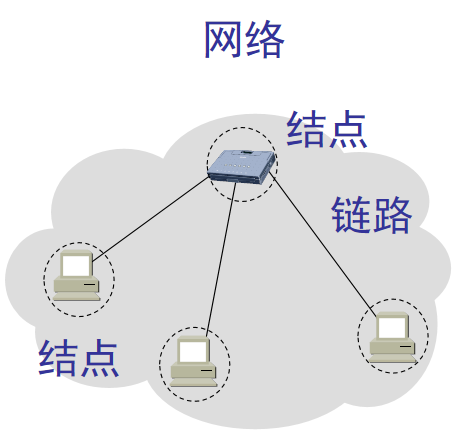

**因特网（Internet）**是全球最大的互连网，用户数量达到亿级，互连的网络数量超过百万个。因特网通过广泛的网络架构和通信协议，使得全球范围内的计算机设备能够相互连接和交换数据。

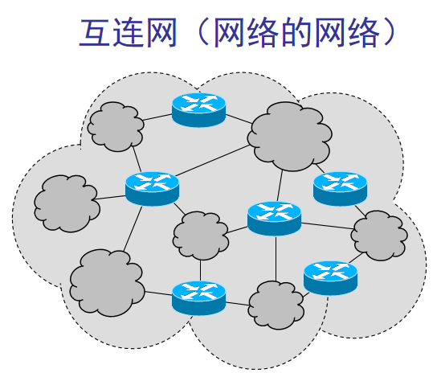

## 2. 因特网的发展阶段

因特网的发展经历了几个重要阶段：

- **第一阶段（1969年）：** 最初形态为美国军用计算机网络ARPANET（阿帕网），它是因特网的前身。在这一阶段，数据的处理和通信处理主要集中通过大型主机完成。

- **第二阶段：** 此阶段因特网发展为具有三级结构的网络。这个结构通常包括本地网络、区域网络和更广泛的国家级或国际级网络，使得更多的用户和地区得以接入和扩展。

- **第三阶段：** 在这一阶段，因特网的结构进一步演化为具有多层次ISP（Internet Service Providers）的形式。ISP分布在不同的层级，包括国际、国家、地区和本地等级别，每一级都提供不同范围内的网络服务和连接。

这些阶段的转变不仅技术上具有划时代的意义，而且也在社会、经济和文化层面产生了深远的影响，使

## 3. 因特网的标准化

因特网的标准化是关键因素之一，它确保了全球范围内不同设备和网络间的兼容性和互操作性。因特网的标准由几个组织共同制定和维护：

- **互联网工程任务组（IETF）**：负责制定互联网的工程标准，包括TCP/IP协议族等。
- **互联网架构委员会（IAB）**：指导IETF的方向和策略，并提供技术和程序方面的咨询。
- **万维网联盟（W3C）**：负责制定与Web相关的标准，如HTML和CSS。
- **国际电信联盟（ITU）**：国际范围内负责通信标准的组织，也涉及网络协议和标准。
- **IEEE**：电子和电气工程师协会，制定包括局域网和城域网标准等在内的众多标准。

这些标准化组织的合作和努力，使得互联网能够持续发展，支持日益增长的技术需求和新兴的应用。

## 4. 因特网的组成

### （1）功能划分

因特网的功能可以划分为边缘部分和核心部分，这两部分共同构成了整个互联网的基础架构。

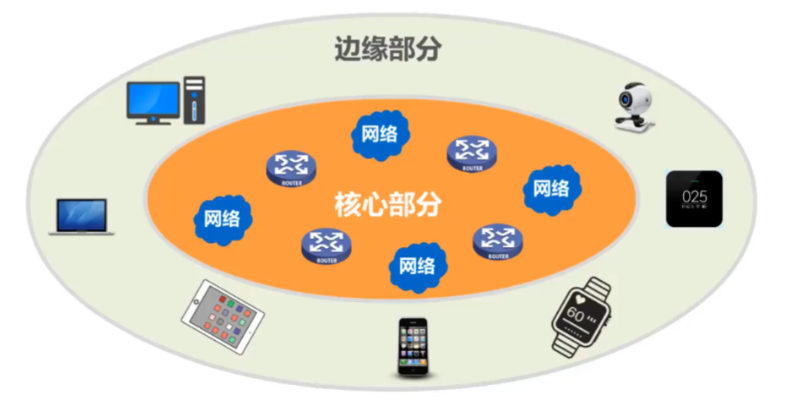

边缘部分包含了所有连接到互联网上的主机，这些主机可以是个人用户的设备，也可以是企业的服务器。边缘部分的主要特点和功能包括：

- **直接用户接触**：用户直接与这部分的设备交互，如上网浏览、发送电子邮件、进行视频通话等。
- **设备多样性**：包括台式计算机、笔记本电脑、平板电脑、智能手机、智能手表，以及各种物联网设备如智能摄像头和智能家居控制器。
- **数据生成与消费**：边缘部分的设备不仅消费来自互联网的数据，也生成数据上传到互联网，如社交媒体内容、视频上传等。

核心部分构成了互联网的骨干，负责处理数据的传输和路由选择，以确保数据能够从源头安全、高效地传输到目的地。核心部分的主要特点包括：

- **路由器和网络设备**：由大量的路由器、交换机和其他网络设备组成，这些设备负责数据的中继和路由选择。
- **高度可靠性**：核心网络设计重视冗余和高可用性，以确保网络的稳定运行，即使部分设备或链接发生故障也不会影响整体网络。
- **数据传输服务**：提供数据从一个网络到另一个网络的连通性服务，确保全球范围内的信息流动。

### （2）边缘部分

#### ① 端系统

端系统（End Systems），也称为主机（Hosts），是处在因特网边缘的设备，包括但不限于个人计算机、智能手机、平板电脑、服务器以及各种物联网设备。端系统是用户直接与之交互的设备，用于执行各种程序和应用，这些程序和应用通过网络进行数据交换。

端系统的关键功能是数据生成和消费。例如，一台智能手机可能用于观看视频（数据消费）同时也可能用于上传视频到社交媒体（数据生成）。在网络术语中，当我们说“主机 A 和主机 B 进行通信”时，我们通常指的是在这些设备上运行的应用程序之间的通信。

#### ② 通信方式

在端系统之间的通信可以采取不同的架构方式，主要分为客户端/服务器（Client/Server, C/S）模式和点对点（Peer-to-Peer, P2P）模式。

- **客户端/服务器模式**：在这种模式下，服务器提供服务，如网页、数据存储或视频流，而客户端（如浏览器、应用程序）则请求并使用这些服务。服务器通常具有强大的处理能力和高速的网络连接。
  
- **点对点（P2P）模式**：在P2P模式下，每个节点既充当客户端又充当服务器。每个端系统可以直接与其他端系统交换数据，不必通过中心服务器。这种模式适用于文件共享、加密货币交易等应用。

### （3）核心部分

#### ① 电路交换

电路交换涉及在通信双方之间建立预定义的通信路径。一旦建立，这条路径将在通信会话期间被专用。电话网络就是电路交换的一个典型例子。

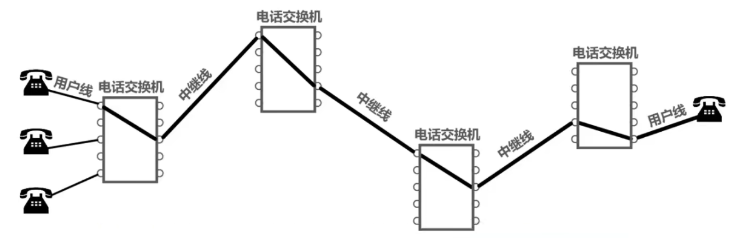

#### ② 分组交换

分组交换没有固定的通信路径。数据被分割成小块（称为分组），每个分组包含目的地地址，并且每个分组独立路由到目的地。这是因特网中最常用的数据交换方式。

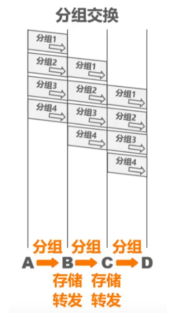


#### ③ 报文交换

报文交换类似于分组交换，但它在传输大的数据单元时不进行分割。整个报文作为一个整体在网络中传输，每个节点存储整个报文并转发到下一个节点。

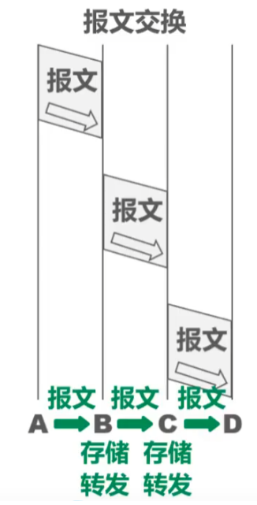

#### ④ 对比

- **电路交换**：优点是通信延迟小，适用于实时通信，如传统电话通话。缺点是资源利用率低，路径一旦建立，即使不传输数据也会占用带宽。
- **分组交换**：优点是高效利用网络资源，灵活且健壮。缺点是可能会有较高的延迟和延迟波动，因为分组可能会因为网络拥堵而被延迟或丢失。
- **报文交换**：优点是简化了数据处理，因为不需要拆分和重组数据。缺点是可能造成延迟，尤其是当报文很大时，因为每个节点需要接收整个报文。

## 5. 计算机网络的分类

### （1）按作用范围划分

#### ① 广域网（WAN, Wide Area Network）
广域网是覆盖广泛地理区域的网络，通常跨越城市、省份甚至国家。WAN可以使用公共、租用或专有的通信设备进行远程通信。因特网是最大的广域网示例，它连接了全球的数百万个私有和公共网络。

- **特点**：高延迟，较高的运营成本，管理复杂。
- **应用**：连接不同地区的企业分支机构，实现远程访问和全球数据共享。

#### ② 城域网（MAN, Metropolitan Area Network）
城域网覆盖一个较大的城市或一群相邻的城市，范围介于局域网和广域网之间。它通常由一个单一的实体或政府机构管理，用于连接多个局域网。

- **特点**：覆盖范围比局域网广，但小于广域网；适用于城市或大学校园。
- **应用**：高速网络服务供应商经常利用MAN来提供高速互联网接入服务。

#### ③ 局域网（LAN, Local Area Network）
局域网是在相对较小的地理区域内（如一个建筑物或一组紧密相连的建筑物）使用的网络。它通常由单个组织拥有和维护，用于连接办公室、家庭或校园内的计算机和设备。

- **特点**：低延迟，高数据传输速率，安装和维护成本相对较低。
- **应用**：文件共享、打印机共享、应用程序访问以及其他通信需求。

#### ④ 个人局域网（PAN, Personal Area Network）
个人局域网是最小范围的网络，通常用于个人设备的连接，如连接电脑、智能手机、平板电脑和其他个人设备。这些网络范围通常限于一个房间内，经常使用蓝牙、Wi-Fi等无线技术。

- **特点**：非常低的覆盖范围，低功率，便于个人使用。
- **应用**：智能手机与耳机、手表、健康追踪设备等的连接。

### （2）按线路划分

#### ① 星型拓扑（Star Topology）

在星型拓扑中，所有的节点都直接连接到一个中心节点，通常是一个路由器、交换机或集线器。数据在此拓扑结构中通过中心节点进行传输。

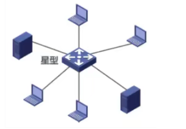

- **优点**：
  - 易于安装和配置。
  - 单一节点故障（除了中心节点）不会影响到网络中的其他节点。
  - 管理和故障诊断相对简单。
- **缺点**：
  - 如果中心节点失败，整个网络将瘫痪。
  - 随着网络节点数量的增加，中心节点的流量负载也会增加，可能成为瓶颈。

#### ② 总线型拓扑（Bus Topology）

在总线型拓扑中，所有的节点都连接到一条共享的通信线路上，这条线路称为总线。数据在总线上以广播的形式发送，所有节点都可以接收到数据，但只有目标节点会处理数据。

- **优点**：
  - 成本低，因为只需要一条长的电缆和几个连接器。
  - 易于理解和设置。
- **缺点**：
  - 总线故障会影响整个网络。
  - 随着网络负载的增加，性能会下降。
  - 安全性和隐私性较差，因为数据被所有设备共享。

#### ③ 环形拓扑（Ring Topology）

环形拓扑中的每个节点都直接连接到两个邻近的节点，形成一个闭环。数据在环中沿一个方向传递，从一个节点传到另一个节点。

- **优点**：
  - 数据传输可以是非常系统的，因为每个信号都有一个固定的方向。
  - 可以使用重复器或放大器增强信号，适合较大的网络。
- **缺点**：
  - 单点故障可以导致整个网络系统的失败。
  - 添加或移除节点会影响网络，安装和配置相对复杂。

#### ④ 网型拓扑（Mesh Topology）

网型拓扑中，节点通过完全连接的方式相互连接，即每个节点都与其他所有节点直接连接。网型拓扑可以是全网型或部分网型。

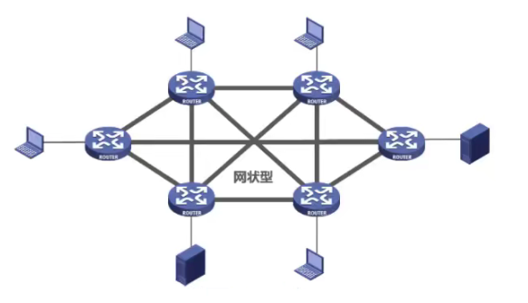

- **优点**：
  - 提供了高度的冗余，如果一个节点或连接失败，数据可以通过其他路线传输。
  - 适用于需要高可靠性的应用。
- **缺点**：
  - 成本高，因为需要大量的线缆和端口。
  - 管理和维护相对复杂。

## 6. 计算机网络的性能指标

#### （1）速率
- **定义**：速率（或称数据率）是指数据传输的速度，通常以比特每秒（bps）来衡量。
- **重要性**：速率决定了在给定时间内可以发送或接收多少数据，是影响网络性能的基本因素之一。

#### （2）带宽
- **定义**：带宽最初指信号所占据的频率带宽，但在计算机网络中通常指网络传输媒介最大的数据传输率。
- **重要性**：带宽越大，理论上能够处理的数据量越大，网络的数据传输能力越强。

#### （3）吞吐量
- **定义**：吞吐量是指在实际网络环境中，单位时间内网络传输的数据量，通常以比特每秒计算。
- **重要性**：吞吐量受网络的带宽、网络的拥塞程度以及数据的丢包率等因素的影响，是评估网络实际性能的重要指标。

#### （4）时延
- **定义**：时延（或延迟）是数据从源点到目的地所需的时间。时延包括传播时延、处理时延、排队时延和传输时延。
- **重要性**：低时延是网络快速响应的关键，特别是对于实时应用（如VoIP、在线游戏和其他实时视频服务）。

#### （5）往返时间（RTT）
- **定义**：往返时间是数据从源到目的地再返回源的总时间。
- **重要性**：RTT是网络响应速度的一个重要指标，对于设计和优化网络协议如TCP非常关键。

#### （6）利用率
- **定义**：利用率是指网络资源被活跃使用的程度，通常表示为一段时间内使用的带宽与可用带宽的比例。
- **重要性**：高利用率意味着网络资源被充分使用，但过高的利用率可能导致网络拥堵。

#### （7）丢包率
- **定义**：丢包率是指在网络传输过程中丢失数据包的比例。
- **重要性**：丢包率高会严重影响网络服务的质量，特别是对于视频传输和VoIP等敏感应用。

# 二、计算机网络体系结构

## 1.常用的计算机网络体系结构

## 2.物理层

## 3.数据链路层

## 4.网络层

## 5.运输层

### （1）端口号

在运输层，每个应用程序或服务都会使用端口号来与网络通信。端口号是一个16位的数字，范围从0到65535。其中，0到1023号端口称为“周知端口”（well-known ports），用于常见的服务如HTTP（80端口）和FTP（21端口）。用户或应用程序可以在1024到65535之间选择未被系统分配的端口号来使用。

### （2）TCP（传输控制协议）

TCP是一种面向连接的协议，提供可靠的数据传输。它负责将数据分割成数据包，并确保它们按顺序到达目的地。TCP提供错误检测、流量控制和拥塞控制，适用于需要确保数据完整性和顺序的应用，如文件传输、电子邮件等。

#### ① TCP协议头

TCP协议头是TCP数据包的一部分，包含了控制信息和数据信息。

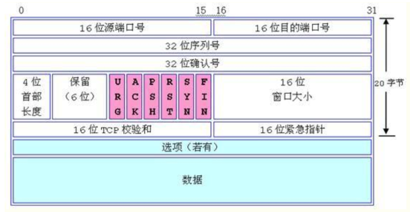

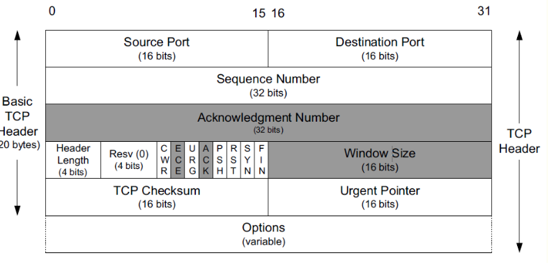

* **16位源端口号（Source Port）**：发送主机中进程的端口号
* **16位目的端口号（Destination Port）**：接收主机中进程的端口号
* **32位序列号（Sequence Number）**：每一个包中都包含序列号，序列号被系统初始化为某个随机值ISN。后续的TCP报文段中序号加上该报文段所携带数据的第一个字节在整个字节流中的偏移。例如，某个TCP报文段传送的数据是字节流中的第1025～2048字节，那么该报文段的序号值就是ISN+1025
* **32位确认号（Acknowledgment Number）**：目的主机返回确认号，使源主机知道某个或几个报文段已被接收
* **四位首部长度（Header Length）**：由于TCP首部包含一个长度可变的选项部分，所以需要这么一个值来指定这个TCP报文段到底有多长
* **URG标志**：表示紧急指针（urgent pointer）是否有效
* **ACK标志**：表示确认号是否有效。我们称携带ACK标识的TCP报文段为确认报文段
* **PSH标志**：提示接收端应用程序应该立即从TCP接收缓冲区中读走数据，为接收后续数据腾出空间（如果应用程序不将接收到的数据读走，它们就会一直停留在TCP接收缓冲区中）
* **RST标志**：表示要求对方重新建立连接。我们称携带RST标志的TCP报文段为复位报文段
* **SYN标志**：表示请求建立一个连接。我们称携带SYN标志的TCP报文段为同步报文段
* **FIN标志**：表示通知对方本端要关闭连接了。我们称携带FIN标志的TCP报文段为结束报文段
* 1**6位窗口大小（window size）** ：是TCP流量控制的一个手段。这里说的窗口，指的是接收通告窗口（Receiver Window，RWND）。它告诉对方本端的TCP接收缓冲区还能容纳多少字节的数据，这样对方就可以控制发送数据的速度
* **16位校验和（TCP check sum）：** 由发送端填充，接收端对TCP报文段执行CRC算法以检验TCP报文段在传输过程中是否损坏。注意，这个校验不仅包括TCP头部，也包括数据部分。这也是TCP可靠传输的一个重要保障。
* **16位紧急指针（urgent pointer）** ：是一个正的偏移量。它和序号字段的值相加表示最后一个紧急数据的下一字节的序号。因此，确切地说，这个字段是紧急指针相对当前序号的偏移，不妨称之为紧急偏移。TCP的紧急指针是发送端向接收端发送紧急数据的方法。
* **TCP头部选项** ：TCP头部的最后一个选项字段（options）是可变长的可选信息。这部分最多包含40字节

#### ② 三次握手

三次握手是TCP连接的建立过程，确保客户端和服务器双方都能够接收和发送数据。过程如下：

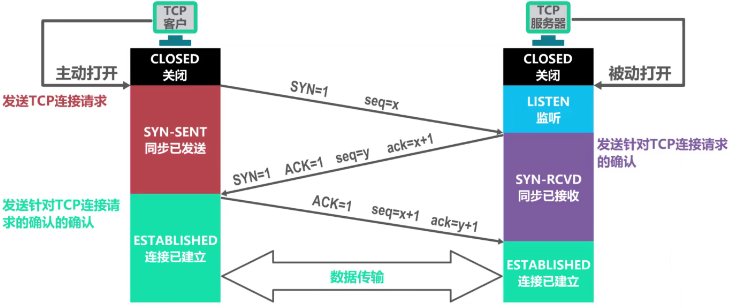

1. **关闭状态**：客户端和服务器的TCP进程初始都处于关闭状态，即未建立任何连接。
   
2. **服务器监听状态**：TCP服务器进入监听状态，等待客户端的连接请求。
   
3. **客户端发起连接**：TCP客户进程向TCP服务器进程发送一个带有SYN标志的TCP连接请求报文段。客户端进入同步已发送状态，选择初始序号x作为序列号。
   
4. **服务器响应连接请求**：TCP服务器进程接收到客户端的请求报文段后，如果同意建立连接，则发送一个带有SYN和ACK标志的TCP连接请求确认报文段给客户端。服务器进入同步已接收状态，选择初始序号y作为序列号，确认号ack设置为客户端序号x的下一个值（即x+1）。
   
5. **客户端确认连接**：客户端收到服务器的请求确认报文段后，发送一个带有ACK标志的TCP确认报文段给服务器。客户端和服务器进入连接已建立状态，可以开始数据传输。客户端的序列号设置为x+1，确认号设置为服务器序号y的下一个值（即y+1）。

这个过程称为TCP的三次握手，确保客户端和服务器都同意建立连接并能够正常通信。每一步都包含特定的TCP报文段，其中序列号和确认号的设置确保了数据的可靠传输和顺序性。

- **确认双方的能力**：三次握手确保了双方都能够正常接收和发送数据，避免了类似于描述中的误解和资源浪费。
- **确定初始序号**：通过三次握手，双方能够交换初始序号，确保数据传输的顺序性和正确性。
- **避免旧连接影响**：第三次握手中的ACK确认号能够清除网络中滞留的旧连接信息，避免错误的连接状态转换。

假如TCP连接的建立使用两次握手而不是三次握手可以吗？

假设描述：

客户端发送一个TCP请求报文段，但因为网络结点延迟，报文段在传输过程中长时间滞留。客户端采用超时重传机制，重新发送TCP请求报文段。服务端接收到重传的TCP请求报文段，并发送一个TCP连接请求确认报文段给客户端，进入连接已建立状态，开始数据传输。数据传输完成后，双方正常关闭连接。后续，滞留在网络中的旧的TCP请求报文段到达服务端，服务端错误地再次发送确认报文段，认为连接重新建立。

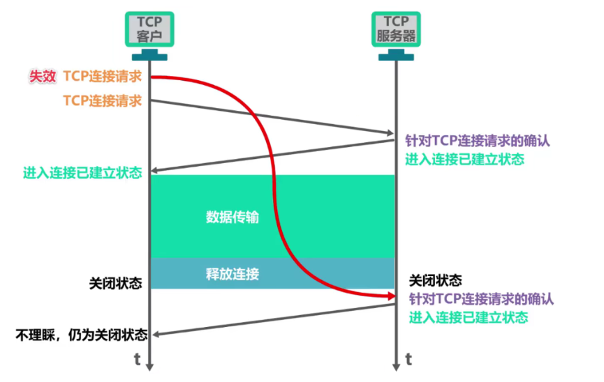

服务端在收到滞留的旧报文段后，错误地认为是新的连接请求，进入连接已建立状态。这导致服务端浪费资源等待客户端发来数据，尤其是在高负载环境下会影响性能。


#### ③ 四次挥手

四次挥手是TCP连接的释放过程，确保双方都知道连接已经关闭。过程如下：

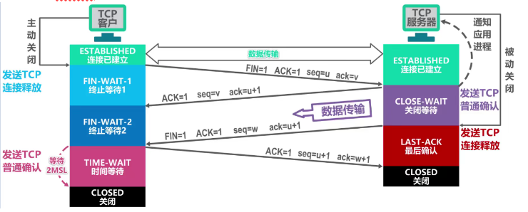

1. **客户进程发送连接释放报文段**：客户端发送一个带有FIN和ACK标志的TCP请求释放报文段，表示要关闭连接，并确认服务端最后接收的序列号，seq=u表示TCP客户进程之前已发送过的数据的最后一个字节的序号+1，ack=v表示客户进程之前已收到的数据的最后一个字节的序号+1。客户端进入终止等待1状态，等待服务端的确认或响应。

2. **服务器进程接收连接释放报文段**：服务端收到客户端的关闭请求后，发送一个带有ACK标志的TCP确认报文段，并进入关闭等待状态。此时，服务器端向客户端发送确认，表明服务器已经接受了客户端的关闭请求，但仍然可能有数据需要发送给客户端。

   - 在半关闭状态下，客户端已经没有数据要发送了，但服务器端可能还有数据需要发送给客户端。这种状态会持续一段时间，直到服务器端发送完所有数据为止。

   - 客户端收到服务器端的确认后，进入终止等待2状态，等待服务器端发出的TCP连接释放报文段。

3. **服务器进程释放连接**：当服务器端没有数据要发送时，也会发送一个带有FIN和ACK标志的TCP连接释放报文段，并进入最后确认状态。这个报文段中，序列号seq=w表示服务器端发出的最后一个字节的序号，确认号ack=u+1表示客户端发出的最后一个字节的序号加1。客户端接收到服务端的连接释放报文段后，发送带有ACK的应答报文段，seq设为u+1，ack设为w+1，并进入时间等待状态，而接受的服务端进入关闭状态。

   - 客户进程还需要经过**2MSL**后才能进入关闭状态。MSL为最长报文段寿命，RFC 793建议为2分钟。在TCP连接关闭时，客户端会进入TIME_WAIT状态，等待2MSL时间后才能关闭连接，以确保网络中的所有报文段都能够完全消失，避免出现旧报文段对新连接的干扰。

思考：为什么TCP客户进程还需要经过**2MSL**后才能进入关闭状态？

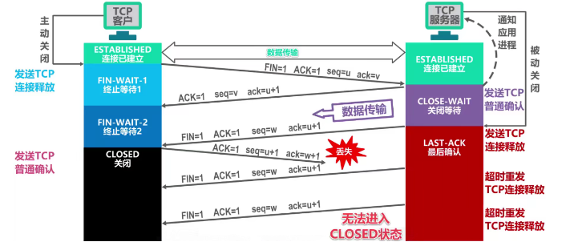

#### ④ 可靠性传输

- 分段传输：TCP协议会将应用层数据根据最大分段大小（MSS）分割成适合发送的数据段。MSS通常由TCP实现时的最大传输单元（MTU）减去IP数据包头部和TCP段头部的大小而得出。分段传输是TCP独有的特性，与网络层的IP数据报分片传输（根据MTU分割）不同。

- 超时重传：当TCP发送数据段后，会启动一个定时器等待接收端的确认。如果在超时时间内未收到确认，TCP将重发该数据段。这种机制确保了即使在网络出现丢包或延迟的情况下，数据仍能够可靠地传输。

- CRC校验和：TCP使用CRC校验和来检测数据在传输过程中是否发生了错误。如果接收端检测到数据段的CRC校验和有误，会丢弃该数据段并不发送确认，从而要求发送端重新发送数据。

- 流量控制：流量控制允许接收端控制发送端的发送速率，以避免接收缓冲区溢出。TCP使用可变大小的滑动窗口协议来实现流量控制。发送端发送数据时，会根据接收端通知的窗口大小来控制发送的数据量，确保接收端能够及时处理和接收数据，防止丢包和数据堆积。

- 滑动窗口：滑动窗口是TCP流量控制的核心机制之一：

  - **发送窗口**：发送端维护一个发送窗口，指示可以在不等待确认的情况下发送的最大数据量（以字节为单位）。

  - **接收窗口**：接收端通知发送端其接收窗口大小，指示接收端当前可接收的数据量（以字节为单位）。

#### ⑤ **滑动窗口协议**

* **应答机制**：传统的应答机制是每发送一个数据报，就等待一个确认应答（ACK）。这种一对一的确认方式类似于面对面的聊天，你一句我一句，效率较低，尤其在往返时间（RTT）较长的情况下，会导致通信效率下降。

  

* **累计应答**：为了提高效率，引入了累计应答机制。接收方可以在接收到多个数据包后再发送一个累计确认应答，而不是每接收一个数据包就发送一个应答。这种方式减少了应答包的数量，提高了传输效率。

* **窗口**：窗口是操作系统开辟的一个缓存空间，用于存储接收到的数据包。接收方会根据实际接收情况，在应答数据包中告知发送方自己的接收窗口大小。窗口大小决定了发送方无需等待确认应答，可以继续发送数据的最大值（以字节为单位）。

* **滑动窗口**：如果发送窗口左部的字节已经发送并且收到了确认，那么就将发送窗口向右滑动一定距离，直到左部第一个字节不是已发送并且已确认的状态；接收窗口的滑动类似，接收窗口左部字节已经发送确认并交付主机，就向右滑动接收窗口。

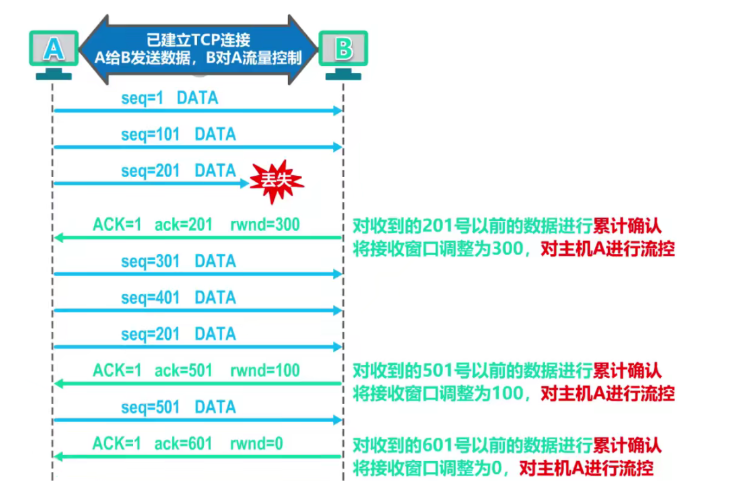

* 假设主机A发送数据给主机B，在建立TCP连接时，主机B在确认报文中将自己的接收窗口rwnd告知主机A。（假设接收窗口大小为400）
* 主机A根据主机B的接收窗口大小创建自己的发送窗口（在内存上开辟一块空间缓存一个接收窗口大小的数据），并且假设每个数据包中载荷数据为100Bytes
* 主机A分别将第一组数据（为了方便讲解假设seq=1，实际上应该为seq=ISN+1）, 第二组数据(seq=101)、第三组数据(seq=201)、第四组数据(seq=301)发送给主机B，中间不需要等待主机B的应答数据报（累计应答）
* 假设第三组数据（seq=201）在输出过程中被丢失了，尽管主机B接收到了第四组数据，但是因为累计应答时只应答最大连续报文，所以应答数据包中ack=201表示序号201之前的所有数据全部正确接收。假设主机B将接收窗口大小调整为300，在应答报文中rwnd=300
* 主机A接收到应答数据报后，将自己发送窗口中的序号1~200的数据删除，发送窗口往前（向右）移动并且将大小重新设置为300（开辟接收窗口大小的缓存序号为201-500的数据）
* 主机B将序号为201，301，401的数据报发送给主机B
* 假设以上三组数据报没有丢失，主机B在接收到所有数据后发送应答数据报，ack=501，并且将窗口调整为100，rwnd=100A
* 主机A接收到应答数据报后，将自己发送窗口中的序号201~500的数据删除，发送窗口往前（向右）移动并且将大小重新设置为100（开辟接收窗口大小的缓存序号为501-600的数据）
* 主机A将序号位600的数据报发送给主机B ，按照以上逻辑知道数据发送完毕。

当接收方由于自身缓冲区已满或其他原因，将接收窗口调整为0后，发送方会收到接收窗口为0的应答报文。这意味着接收方暂时无法接收新的数据，发送方需要停止发送数据。

发送方在接收到接收窗口为0的应答报文后，会启动一个持续计时器。该计时器用于定期检查接收窗口的状态。

当持续计时器到期时，发送方会主动向接收方发送一个零窗口探测报文（Zero Window Probe）。该报文通常只携带一个字节的数据。其目的是触发接收方发送当前接收窗口大小的应答报文。

发送方接收到接收方对零窗口探测报文的应答后，检查应答中的接收窗口大小：

- 如果接收窗口仍然为0，发送方重新启动持续计时器，等待下一个计时周期，再发送新的零窗口探测报文。
- 如果接收窗口大于0，发送方知道接收方的接收窗口已经恢复，可以继续发送数据。

#### ⑥ 长连接和短连接

**长连接**：长连接是指TCP通信双方在建立连接后，保持连接状态较长时间，直到某一方主动关闭连接。这种方式适用于需要频繁通信的场景。

**短链接**：短连接是指在每次通信时建立一个新的TCP连接，数据传输完成后立即关闭连接。这种方式适用于操作不频繁的场景。

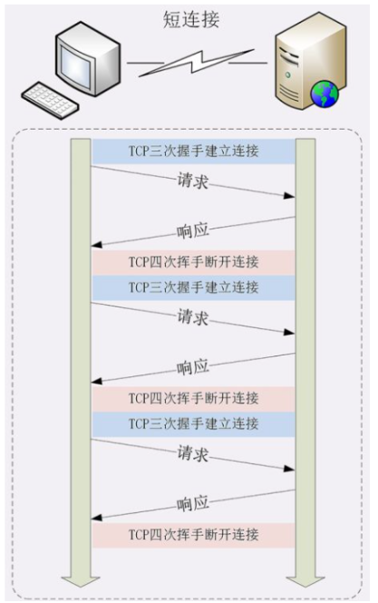


#### ⑦ 拆包和粘包

由于`TCP`传输协议是面向字节流的传输协议，没有消息保护边界，所以发送方发送的多个数据包，接收方应用层不知如何区分，可能会被当成一个包来处理，这就是粘包；或者，发送方将一个打包分成多个小包发送，而接收方将它们当成多个包进行处理，这就是拆包。

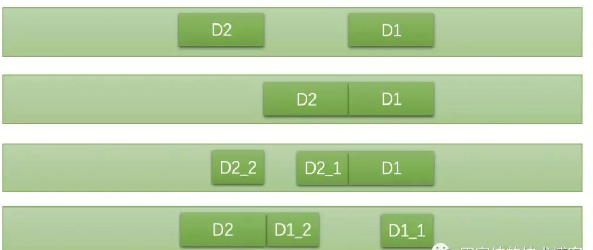

 看上面这张图片，演示了`TCP`传输的四种情况：

1. 客户端向服务器发送了两个包，两个数据包之间互不影响，这是正常的，我们不需要管；
2. 客户端向服务器发送了两个包，但是两个包被并在了一起，当作一个包发送，这就是发生了粘包现象，服务器可能会将它们当成一个数据包处理；
3. 客户端向服务器发送了两个包`D1`和`D2`，但是`D2`的一部分与`D1`合并在了一起，发生了粘包，而`D2`另一部分被单独发送，也就是说`D2`被拆分成了两个小包，发生了拆包现象；
4. 第四种情况和第三种类似，只是顺序反了一下，`D1`发生了拆包，而`D1`的后半部分与`D2`发生了粘包；

这里需要强调一点，`TCP`协议可以保证数据完整，并且顺序地接收，但是并不帮助区分多个数据，因为它是面向字节流的传输协议。也就是说，要解决粘包、拆包问题的是应用层协议，应用层协议对字节进行拆分。

 定长协议，顾名思义，就是应用层需要发送的每份数据，长度都是固定的。比如说，将数据长度定义为`1024`字节，所有不满足`1024`字节的数据，可以通过补`0`进行填充。而接收方每次读取`1024`字节，就可以正确区分每一份数据。

 不过，稍微想想也知道，这种方式并不好，对数据进行填充，完全就是一种浪费带宽的行为，而且处理起来也麻烦。

 我们可以为每一份数据，添加特殊字符，如分隔起始字符和结束字符，这样就可以区分了。

 当然，有时候我们并不确定应该选择哪个字符作为标记字符，因为不确定这个字符是否原本就在数据中包含。此时我们可以对数据进行转码，比如说将数据转成`Base64`编码，而`Base64`只有`64`种字符，然后我们就可以使用这`64`种之外的字符作为标记。

 变长协议，对于应用层的报文，可以将它分为报文头部以及报文体，而我们可以在报文头中指定当前报文中数据的长度，这样，接收方就能根据长度，正确地拆分多个粘在一起的数据了。

- 发送方：将发送的报文分为头部和实体，在头部中指明实体中数据的长度；
- 接收方：根据报文头部中的信息，正确地区分多个数据；

 大部分应用层协议应该使用的都是这种方式，比如说`HTTP`协议，`HTTP`报文分为头部（header）以及实体（body），在`HTTP`协议的首部中，有一个`Content-Length`首部行，就是指明`body`中携带数据的字节数。

#### ⑧ SYN FLOOD

SYN Flood（SYN 洪泛）攻击是一种利用 TCP/IP 协议漏洞的拒绝服务（DoS）攻击方式。在一个 SYN Flood 攻击中，攻击者发送大量伪造的 TCP 连接请求（SYN 数据包），使得目标服务器不断响应这些请求并且维护 TCP 连接，最终导致服务器资源耗尽无法响应合法的连接请求从而实现拒绝服务攻击。

1、监视 SYN 包

对于直接的 Syn Flood 攻击，一种简单的防范方法是监视 SYN 包。如果发现某个 IP 发送了大量的报文，直接将这个 IP 列入黑名单即可。然而，这种方法对于源地址不断变化的攻击则效果不佳。

2、延缓 TCB 分配

另一种方法是延缓 TCB 的分配。Syn Flood 攻击消耗服务器资源的主要原因是系统一接收到 SYN 数据报文就立即分配 TCB。因此，延缓 TCB 的分配可以有效地减轻服务器资源的消耗。

3、监视并释放无效连接

这种方法通过不断监视系统的半开连接和不活动连接，当达到一定阈值时拆除这些连接，从而释放系统资源。然而，这种方法可能会对所有连接一视同仁，可能会误释放正常连接请求，因此这种方法只适合应对少许简单的 Syn Flood 攻击。

4、使用 SYN Cookie 技术：SYN Cookie 是一种用于防范 SYN 攻击的技术。当服务器收到 SYN 包时，不立即分配资源，而是根据源 IP 地址、端口和初始序号等信息生成一个加密的 cookie 并发送给客户端。当客户端发送 ACK 包时，服务器根据 cookie 解密还原出连接请求信息，并建立连接。这种方法可以有效防止服务器资源被大量半连接请求耗尽。

5、调整 TCP/IP 协议栈参数：通过调整 TCP/IP 协议栈的参数，可以减少 SYN 攻击的影响。例如，可以减少 SYN 包的重试次数，限制同时处理的半连接数量，缩短 SYN 包超时时间等。

6、增加连接队列大小：服务器在处理连接请求时，会将请求放入一个队列中进行处理。增加连接队列大小可以增加服务器同时处理连接的能力，从而一定程度上减轻 SYN 攻击带来的负担。

#### ⑨TIME_WAIT或CLOSED_WAIT过多

正常的TCP客户端连接在关闭后，会进入一个TIME_WAIT的状态，持续的时间一般在1-4分钟，对于连接数不高的场景，1-4分钟其实并不长，对系统也不会有什么影响，
  但如果短时间内（例如1s内）进行大量的短连接，则可能出现这样一种情况：客户端所在的操作系统的socket端口和文件描述符被用尽，系统无法再发起新的连接。

close_wait 按照正常操作的话应该很短暂的一个状态，接收到客户端的fin包并且回复客户端ack之后，会继续发送FIN包告知客户端关闭关闭连接，之后迁移到Last_ACK状态。但是close_wait过多只能说明没有迁移到Last_ACK，也就是服务端是否发送FIN包，只有发送FIN包才会发生迁移，所以问题定位在是否发送FIN包。FIN包的底层实现其实就是调用socket的close方法，这里的问题出在没有执行close方法。说明服务端socket忙于读写。

- top查看cpu利用率和load情况（大量close_wait属于io密集型，会导致load相比cpu利用率高出很多）
- netstat观察close_wait的数量变化。
- wireshark辅助查看网络包的发送情况。
- 优化服务器系统的网络配置，连接配置，使用socket重用或及时释放资源即可。

### （3）UDP（用户数据报协议）

UDP是一种无连接的协议，不保证数据传输的可靠性和顺序。它将数据发送为数据报形式，不建立连接或保持状态。UDP适用于实时应用，如视频流和音频通话，其中速度和实时性比数据的可靠性更为重要。

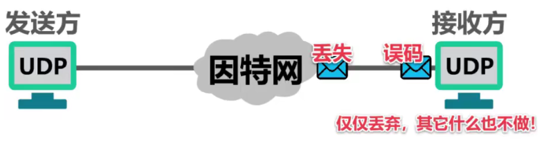

#### ① UDP协议头

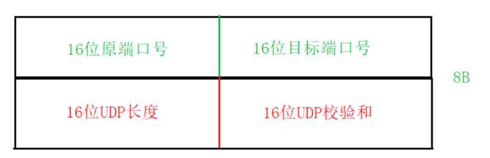

#### ② UDP的应用

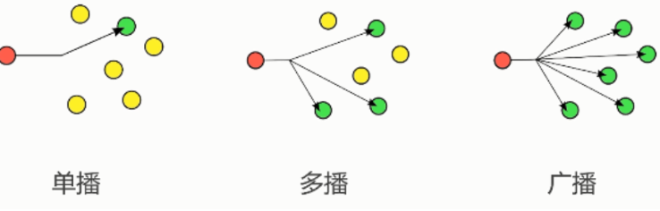

单播是指点对点的通信方式，即一个发送方和一个接收方之间的通信。UDP单播用于在网络中将数据包从一个单独的源地址发送到一个单独的目标地址。

**应用场景**：

- **DNS查询**：域名系统（DNS）使用UDP单播进行查询请求和响应。
- **简单网络管理协议（SNMP）**：用于网络管理和监控设备。
- **实时应用**：如在线游戏、视频会议等，要求低延迟，但可以容忍部分数据丢失的应用。

多播是指将数据从一个源地址发送到多个指定的接收地址。使用UDP多播可以在网络中同时传输数据给多个接收方，避免重复发送相同数据，提高了效率。

**应用场景**：

- **视频会议**：多播技术用于视频会议中，允许一个视频流同时发送给多个参与者。
- **实时数据分发**：如股票行情、体育赛事直播等，需要同时向多个客户端发送实时数据。
- **分布式系统**：在分布式系统中，多播用于节点之间的协调和数据同步。

 广播是指将数据从一个源地址发送到网络中的所有主机。UDP广播用于在局域网内将数据发送给所有设备。

**应用场景**：

- **DHCP**：动态主机配置协议（DHCP）使用广播来分配IP地址和其他配置参数。
- **ARP**：地址解析协议（ARP）使用广播来查询局域网内其他设备的MAC地址。
- **网络发现**：设备在局域网内发现其他设备或服务时使用广播。

### （4）TCP与UDP的区别

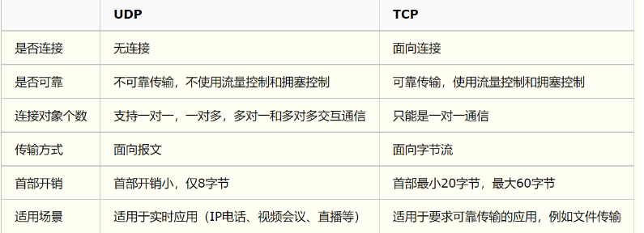

## 6.应用层

### （1）万维网

万维网（World Wide Web）是一个信息共享系统，通过互联网访问。它允许用户通过超文本传输协议（HTTP）和其他协议访问、浏览和传输信息。万维网由大量的互联网页面组成，网页之间通过超链接相互连接。

#### **①组成部分**

1. **网页**：使用HTML（超文本标记语言）编写的文档，包含文本、图片、视频等内容。
2. **Web服务器**：存储和提供网页内容的服务器。它接收并响应客户端的HTTP请求。
3. **Web浏览器**：用户访问万维网的工具，如Chrome、Firefox、Safari等。它解析并展示网页内容。

#### ② 统一资源定位符URL

统一资源定位符（URL，Uniform Resource Locator）是用于标识和定位互联网上资源的字符串。URL提供了一种标准化的方式来描述资源的访问路径，包括资源所在的位置和访问方法。


#### ③ 跨域

跨域（Cross-Origin）是指浏览器在执行请求时，当前页面的源（协议、域名、端口）与请求的目标源不同。由于浏览器的同源策略（Same-Origin Policy），跨域请求会受到限制，以保护用户数据的安全，防止跨站请求伪造（CSRF）和其他攻击。

常见的跨域请求场景

1. **AJAX 请求**：使用 JavaScript 通过 XMLHttpRequest 或 Fetch API 请求不同源的资源。
2. **Web API 调用**：前端应用需要访问不同域的 RESTful API 服务。
3. **加载第三方资源**：页面加载不同源的脚本、样式表、图片、视频等资源。

### （2）HTTP

HTTP（HyperText Transfer Protocol）是用于万维网的应用层协议，定义了客户端和服务器之间如何传输超文本。HTTP是无状态的协议，即每个请求和响应是独立的，不保留前一次请求的状态。

并且HTTP是明文传输。

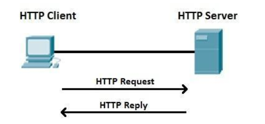

#### ① HTTP报文格式

HTTP报文是客户端和服务器之间交换数据的格式，分为请求报文和响应报文。

##### HTTP请求报文

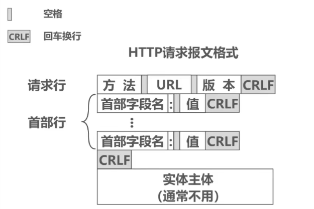

一个HTTP请求报文由以下部分组成：

1. **请求行（Request Line）**：
   - **方法（Method）**：如GET、POST、PUT、DELETE等。
   - **URL路径**：资源的路径。
   - **HTTP版本**：如HTTP/1.0或HTTP/1.1。

   ```
   GET /index.html HTTP/1.1
   ```

2. **请求头部（Request Headers）**：
   提供请求的附加信息，以`键: 值`对的形式。

   ```
   Host: www.example.com
   User-Agent: Mozilla/5.0
   Accept: text/html
   ```

3. **空行（CRLF）**：
   请求头部和请求体之间的空行。

4. **请求体（Request Body）**（可选）：
   包含POST请求的数据。

   ```
   username=user&password=pass
   ```

完整请求报文示例：

```
GET /index.html HTTP/1.1
Host: www.example.com
User-Agent: Mozilla/5.0
Accept: text/html

```

##### HTTP响应报文

一个HTTP响应报文由以下部分组成：

1. **状态行（Status Line）**：
   - **HTTP版本**：如HTTP/1.0或HTTP/1.1。
   - **状态码（Status Code）**：如200、404、500等。
   - **状态描述**：如OK、Not Found等。

   ```
   HTTP/1.1 200 OK
   ```

2. **响应头部（Response Headers）**：
   提供响应的附加信息，以`键: 值`对的形式。

   ```
   Content-Type: text/html
   Content-Length: 1234
   ```

3. **空行（CRLF）**：
   响应头部和响应体之间的空行。

4. **响应体（Response Body）**：
   包含实际的资源数据，如HTML文档。

   ```
   <html>
   <body>
   <h1>Hello, World!</h1>
   </body>
   </html>
   ```

完整响应报文示例：

```
HTTP/1.1 200 OK
Content-Type: text/html
Content-Length: 1234

<html>
<body>
<h1>Hello, World!</h1>
</body>
</html>
```

#### ② HTTP/1.0

HTTP/1.0采用**非持续连接**方式。每次请求都会建立一个新的TCP连接，响应结束后立即断开连接。每请求一个文档就要有两倍的RTT的开销。若一个网页上有很多引用对象（例如图片等)
那么请求每一个对象都需要花费2RTT的时间。

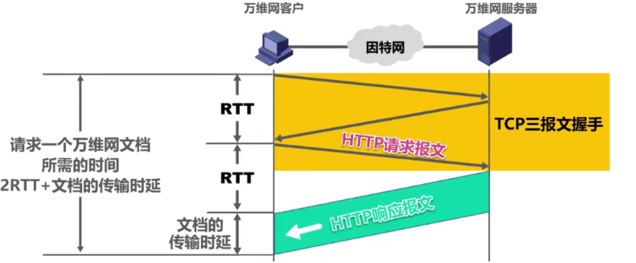

为了减小时延，浏览器通常会建立多个并行的TCP连接同时请求多个对象。但是，这会大量占用万维网服务器的资源，特别是万维网服务器往往要同时服务于大量客户的请求，这会使其负担很重。

#### ③ HTTP/1.1

HTTP/1.1采用**持续连接**方式。默认启用连接复用（keep-alive），可以在一个TCP连接上发送多个请求和响应，减少了连接建立和关闭的开销。

为了进一步提高效率，HTTP/1.1的持续连接还可以使用**流水线方式工作**，允许客户端在收到响应之前发送多个请求，进一步提高了传输效率，节省了RTT，使TCP连接中的空闲时间减少，提高了下载文档的效率。

#### ④ HTTP/2

随着网络应用普及到人们的日常生活，它的应用范围、复杂性、重要性也在不断扩大。为了解决HTTP协议问题，HTTP/2应运而生。HTTP/2没有改动HTTP的应用语义，仍然使用HTTP的请求方法、状态码和头字段等规则，它主要修改了HTTP的报文传输格式，通过引入服务器推送等举措，来减少网络延迟，提高客户端的页面加载速度。

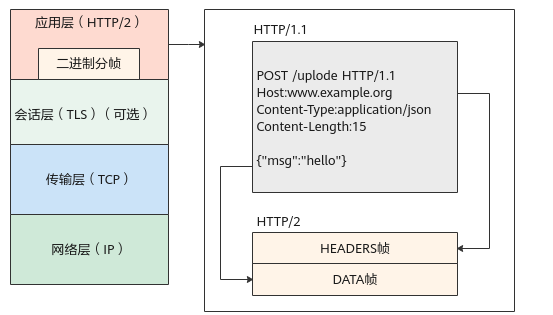

二进制分帧：HTTP/2没有改动HTTP的应用语义，仍然使用HTTP的请求方法、状态码和头字段等规则，它主要修改了HTTP的报文传输格式。HTTP/1.1协议以换行符作为纯文本的分隔符，而HTTP/2将所有传输的信息分割为更小的消息和帧，并采用二进制格式对它们编码，这些帧对应着特定数据流中的消息，他们都在一个TCP连接内复用。

优先级排序：将HTTP消息分解为很多独立的帧之后就可以复用多个数据流中的帧，客户端和服务器交错发送和传输这些帧的顺序就成为关键的性能决定因素。HTTP/2允许每个数据流都有一个关联的权重和依赖关系，数据流依赖关系和权重的组合明确表达了资源优先级，这是一种用于提升浏览性能的关键功能。HTTP/2协议还允许客户端随时更新这些优先级，我们可以根据用户互动和其他信号更改依赖关系和重新分配权重，这进一步优化了浏览器性能。

首部压缩：HTTP/2使用了HPACK算法来压缩头字段，这种压缩格式对传输的头字段进行编码，减少了头字段的大小。同时，在两端维护了索引表，用于记录出现过的头字段，后面在传输过程中就可以传输已经记录过的头字段的索引号，对端收到数据后就可以通过索引号找到对应的值。

多路复用：多路复用允许同时通过单一的HTTP/2连接发起多重的请求-响应消息，实现多流并行而并不依赖多个TCP连接，HTTP/2把HTTP协议通信的基本单位缩小为一个一个的帧，这些帧对应着逻辑流中的消息，并行地在同一个TCP连接上双向交换消息。

HTTP/2基于二进制分帧层，HTTP/2可以在共享TCP连接的基础上同时发送请求和响应。HTTP消息被分解为独立的帧，而不破坏消息本身的语义交错发出去，在另一端根据流标识符和首部将他们重新组装起来。通过多路复用技术，可以避免HTTP旧版本的消息头阻塞问题，极大提高传输性能。

服务器推送：HTTP2.0的一个强大的新功能，就是服务器可以对一个客户端请求发送多个响应。服务器向客户端推送资源无需客户端明确的请求。服务端根据客户端的请求，提前返回多个响应，推送额外的资源给客户端。如下图所示，客户端请求stream 1，服务端在返回stream 1的消息的同时推送了stream 2和stream 4。

#### ⑤ Cookie 

Cookie是一种存储在客户端浏览器中的小型文本文件。它由服务器生成，并通过HTTP协议发送给客户端浏览器。浏览器将Cookie保存在本地，并在每次发送请求时自动携带该Cookie，以便服务器可以读取其中的数据。

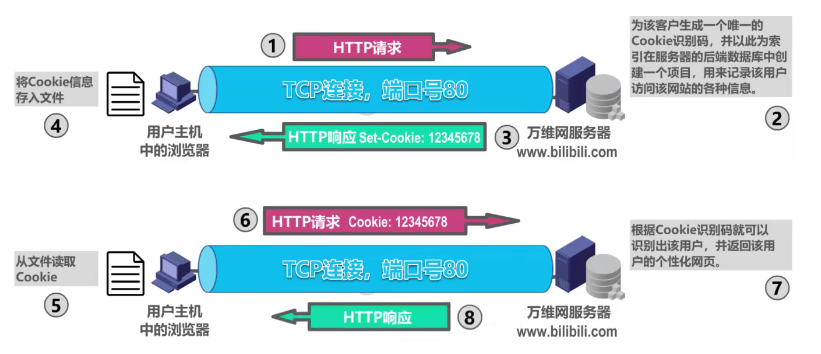

Cookie的特点

- **存储数据量小**：Cookie的大小通常受到浏览器限制，一般不超过4KB。这意味着Cookie只适合存储少量的数据。
- **存储在客户端**：Cookie将数据存储在客户端浏览器中，可以通过JavaScript进行读取和操作。
- **每次请求都会携带**：客户端每次发送请求时，会自动附带相应的Cookie数据。
- **不安全**：Cookie中的数据可以被用户和其他网站访问到，因此不适合存储敏感信息。

####  ⑥ Session

Session是一种服务器端的数据存储机制，用于存储和管理用户会话相关的数据。每个用户都会被分配一个唯一的Session ID，该ID通过Cookie或URL重写的方式发送给客户端浏览器，并在后续的请求中携带。

Session的特点

- **服务端存储**：Session数据存储在服务器端，在客户端浏览器中仅保存一个与Session相关的标识（通常是Session ID）。
- **存储容量大**：相比于Cookie，Session可以存储更多的数据，没有明确的大小限制。
- **安全性较高**：Session数据位于服务器端，对客户端是不可见的，因此适合存储敏感信息。
- **依赖Cookie或URL重写**：Session ID通常通过Cookie或URL重写的方式传递给客户端。

通过上述的介绍可以看出，Cookie和Session在实现机制和应用场景上有一些明显的区别。下面我们对它们进行进一步的比较：

- **存储位置**：Cookie存储在客户端浏览器，Session存储在服务器端。
- **数据容量**：Cookie的容量较小，一般不超过4KB；而Session可以存储更多的数据。
- **安全性**：由于Cookie存储在客户端，其中的数据可被用户和其他网站访问，因此安全性较低；而Session数据存储在服务器端，对客户端不可见，因此相对较安全。
- **传输方式**：Cookie通过HTTP协议自动发送给服务器，每次请求都会携带Cookie数据；而Session可以通过Cookie或URL重写的方式传递Session ID。
- **生命周期**：Cookie可以通过设置过期时间来指定存储的时间，可以是短期的或长期的；而Session默认情况下会持续到用户关闭浏览器或会话超时。
- **应用场景**：Cookie适合存储少量的数据，常用于用户身份认证、记住登录状态等场景；Session适合存储较大的数据，常用于购物车功能、跨页面数据传递等场景。

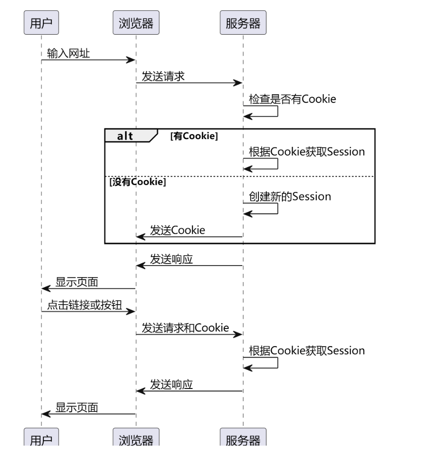

### （3）HTTPS

HTTPS（HyperText Transfer Protocol Secure）是HTTP的安全版本，它在HTTP的基础上添加了SSL/TLS协议，用于在客户端和服务器之间建立加密连接，确保数据传输的安全性和完整性。

#### ① 中间人攻击

HTTP为什么不安全？HTTP容易被中间人窃听、篡改、冒充。

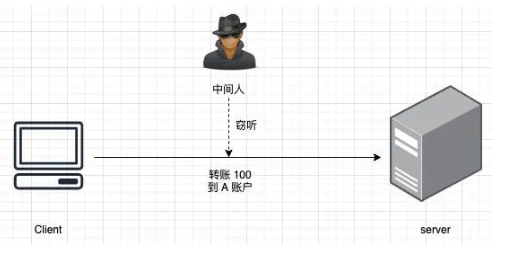

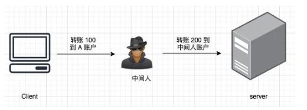

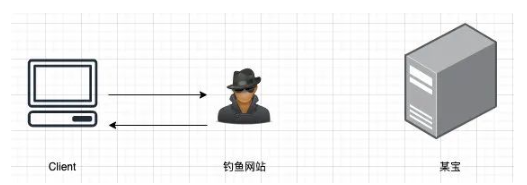

#### ② SSL/TLS

SSL（Secure Sockets Layer）是一种安全协议，用于在互联网上保护数据的传输安全。它工作在传输层，主要功能是通过加密技术，保护不同计算机之间的数据传输过程，防止敏感数据被黑客窃取和篡改。SSL 协议可以用于保护网站的用户登录、信用卡支付、网上银行等敏感信息的传输，以及企业之间的机密数据的传输。SSL 协议目前已经被继承为 TLS（Transport Layer Security），是一种安全性更高的传输层协议。

#### ③ 对称加密

既然 HTTP 是明文传输的，那我们给报文加密不就行了，既然要加密，我们肯定需要通信双方协商好密钥吧，一种是通信双方使用**同一把密钥**，即**对称加密**的方式来给报文进行加解密。

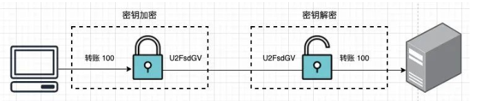

对称加密具有加解密速度快，性能高的特点，也是 HTTPS 最终采用的加密形式，但是这里有一个关键问题，对称加密的通信双方要使用同一把密钥，这个密钥是如何协商出来的？如果通过报文的方式直接传输密钥，之后的通信其实还是在裸奔，因为这个密钥会被中间人截获甚至替换掉，这样中间人就可以用截获的密钥解密报文，甚至替换掉密钥以达到篡改报文的目的。

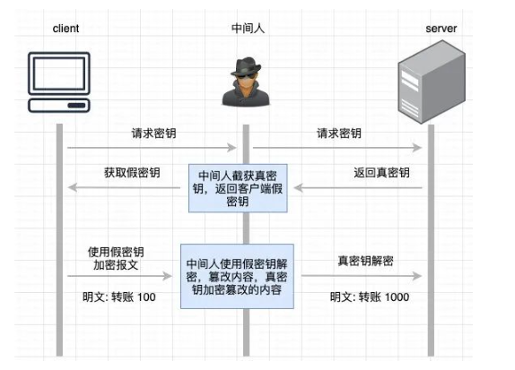

#### ④ 非对称加密

非对称加密即加解密双方使用不同的密钥，一把作为公钥，可以公开的，一把作为私钥，不能公开，公钥加密的密文只有私钥可以解密，私钥加密的内容，也只有公钥可以解密。

这样的话对于 server 来说，保管好私钥，发布公钥给其他 client, 其他 client 只要把对称加密的密钥加密传给 server 即可，如此一来由于公钥加密只有私钥能解密，而私钥只有 server 有，所以能保证 client 向 server 传输是安全的，server 解密后即可拿到对称加密密钥，这样交换了密钥之后就可以用对称加密密钥通信了。

但是问题又来了， server 怎么把公钥**安全地**传输给 client 呢。如果直接传公钥，也会存在被中间人调包的风险。

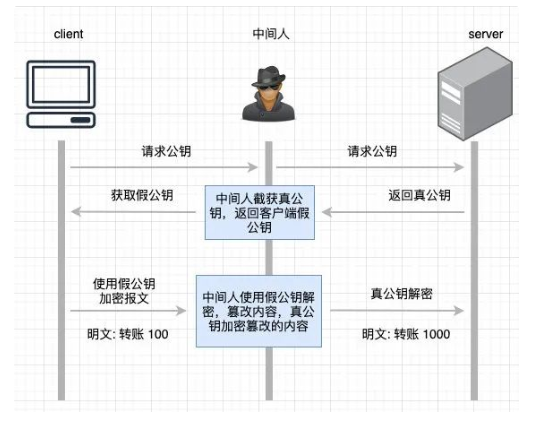

#### ⑤ CA

如何解决公钥传输问题呢，从现实生活中的场景找答案，员工入职时，企业一般会要求提供学历证明，显然不是什么阿猫阿狗的本本都可称为学历，这个学历必须由第三方权威机构（Certificate Authority，简称 CA）即教育部颁发，同理，server 也可以向 CA 申请证书，**在证书中附上公钥**，然后将证书传给 client，证书由站点管理者向 CA 申请，申请的时候会提交 DNS 主机名等信息，CA 会根据这些信息生成证书。

这样当 client 拿到证书后，就可以获得证书上的公钥，再用此公钥加密**对称加密密钥**传给 server 即可，看起来确实很完美，不过在这里大家要考虑两个问题

 **如何验证证书的真实性，如何防止证书被篡改**？

想象一下上文中我们提到的学历，企业如何认定你提供的学历证书是真是假呢，答案是用学历编号，企业拿到证书后用学历编号在学信网上一查就知道证书真伪了，学历编号其实就是我们常说的**数字签名**，可以防止证书造假。

首先使用一些摘要算法（如 MD5）将证书明文（如证书序列号，DNS主机名等）生成摘要，然后再用第三方权威机构的私钥对生成的摘要进行加密（签名）。

客户端拿到证书后也用同样的摘要算法对证书明文计算摘要，两者一笔对就可以发现报文是否被篡改了，那为啥要用第三方权威机构（Certificate Authority，简称 CA）私钥对摘要加密呢，因为摘要算法是公开的，中间人可以替换掉证书明文，再根据证书上的摘要算法计算出摘要后把证书上的摘要也给替换掉！这样 client 拿到证书后计算摘要发现一样，误以为此证书是合法就中招了。所以必须要用 CA 的私钥给摘要进行加密生成签名，这样的话 client 得用 CA 的公钥来给签名解密，拿到的才是未经篡改合法的摘要（私钥签名，公钥才能解密）。

server 将证书传给 client 后，client 的验签过程如下

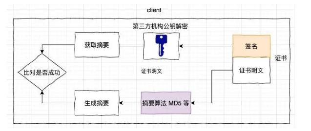

这样的话，由于只有 CA 的公钥才能解密签名，如果客户端收到一个假的证书，使用 CA 的公钥是无法解密的，如果客户端收到了真的证书，但证书上的内容被篡改了，摘要比对不成功的话，客户端也会认定此证书非法。

细心的你一定发现了问题，CA 公钥如何安全地传输到 client ？如果还是从 server 传输到 client，依然无法解决公钥被调包的风险，**实际上此公钥是存在于 CA 证书上，而此证书（也称 Root CA 证书）被操作系统信任，内置在操作系统上的，无需传输**。

 **如何防止证书被调包**？

实际上任何站点都可以向第三方权威机构申请证书，中间人也不例外。

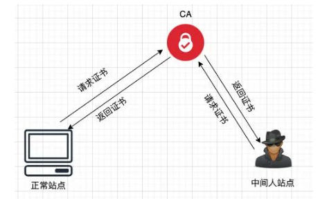

正常站点和中间人都可以向 CA 申请证书，获得认证的证书由于都是 CA 颁发的，所以都是合法的，那么此时中间人是否可以在传输过程中将正常站点发给 client 的证书替换成自己的证书呢，如下所示

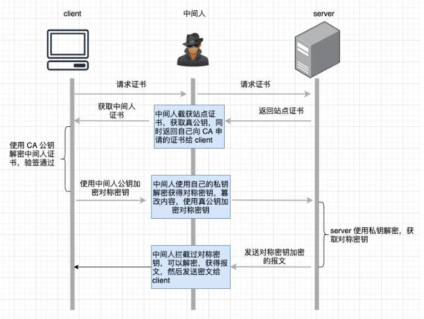

答案是不行，因为客户端除了通过验签的方式验证证书是否合法之外，**还需要验证证书上的域名与自己的请求域名是否一致**，中间人中途虽然可以替换自己向 CA 申请的合法证书，但此证书中的域名与 client 请求的域名不一致，client 会认定为不通过！

### （4）从输入 URL 到展现页面的全过程

以HTTPS协议的非持续连接

#### 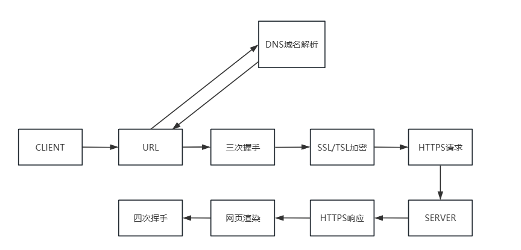

### （5）RestFul

RESTful 是一种基于 REST（Representational State Transfer，表述性状态转移）架构风格的 Web 服务设计方式。RESTful 系统使用 HTTP 协议并通过明确的 URL（统一资源定位符）和 HTTP 方法来操作资源。RESTful 服务的核心思想是将网络上的所有内容都视为资源，并通过标准的 HTTP 方法对这些资源进行操作。

RESTful 请求的 URL 通常具有以下特点：

1. **资源定位**：URL 用于唯一标识网络上的资源。每个 URL 代表一个资源（如用户、订单、产品等）。
2. **层次结构清晰**：URL 通常具有层次结构，反映资源之间的关系。例如，`/users/123/orders/456` 可能表示用户 123 的订单 456。
3. **使用名词而非动词**：URL 通常使用名词来表示资源，而不是动词。例如，使用 `/users` 表示用户资源，而不是 `/getUsers` 或 `/createUser`。
4. **HTTP 方法表示操作**：通过标准的 HTTP 方法（如 GET、POST、PUT、DELETE 等）来表示对资源的操作：
   - **GET**：获取资源
   - **POST**：创建资源
   - **PUT**：更新资源
   - **DELETE**：删除资源
5. **支持过滤、排序和分页**：URL 可以通过查询参数支持资源的过滤、排序和分页。例如：
   - `GET /products?category=electronics`：获取电子产品类别的产品
   - `GET /products?sort=price&order=asc`：按价格升序排序产品
   - `GET /products?page=2&limit=10`：获取第 2 页，每页 10 个产品
6. **无状态性**：每个请求应该包含完成该请求所需的所有信息，服务器不应该依赖于客户端的状态。

### （6）RPC

RPC（Remote Procedure Call，远程过程调用）是一种进程间通信技术，允许程序通过调用远程服务器上的函数或过程来实现分布式计算。RPC 的目的是使远程服务调用看起来就像是在调用本地函数一样，简化了分布式系统的开发。

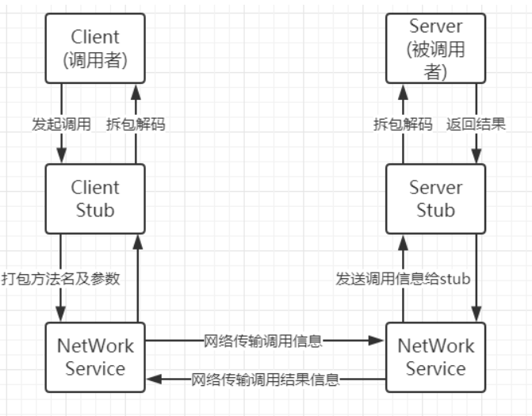

RPC与RestFul

**RESTful**：

- 基于资源（Resource）的概念，使用标准的 HTTP 方法（GET、POST、PUT、DELETE 等）对资源进行操作。
- 强调无状态性，每个请求都包含所有必要的信息，服务器不需要保存客户端的状态。
- 使用统一的接口（如 URL）来操作资源，便于理解和使用。

**RPC**：

- 基于过程调用的概念，客户端通过调用远程服务器上的函数或方法来实现通信。
- 可以是有状态的，服务器可能需要维护客户端的会话状态。
- 通常使用特定的协议和接口定义语言（如 Protocol Buffers）来描述服务接口和数据格式。

### （7）JWT

#### ① 概述

Json web token（JWT）是为了网络应用环境间传递声明而执行的一种基于JSON的开发标准（RFC 7519），该token被设计为紧凑且安全的，特别适用于分布式站点的单点登陆（SSO）场景。JWT的声明一般被用来在身份提供者和服务提供者间传递被认证的用户身份信息，以便于从资源服务器获取资源，也可以增加一些额外的其它业务逻辑所必须的声明信息，该token也可直接被用于认证，也可被加密。

**什么情况下使用JWT比较适合？** **授权：**这是最常见的使用场景，解决单点登录问题。因为JWT使用起来轻便，开销小，服务端不用记录用户状态信息（无状态），所以使用比较广泛； **信息交换：**JWT是在各个服务之间安全传输信息的好方法。因为JWT可以签名，例如，使用公钥/私钥对儿 - 可以确定请求方是合法的。此外，由于使用标头和有效负载计算签名，还可以验证内容是否未被篡改。

#### ② 跨域认证的问题

互联网服务离不开用户认证。一般流程是下面这样： 

1、用户向服务器发送用户名和密码。 

2、服务器验证通过后，在当前对话（session）里面保存相关数据，比如用户角色、登录时间等等。 

3、服务器向用户返回一个 session_id，写入用户的 Cookie。 

4、用户随后的每一次请求，都会通过 Cookie，将 session_id 传回服务器。 

5、服务器收到 session_id，找到前期保存的数据，由此得知用户的身份。

这种模式的问题在于，扩展性（scaling）不好。单机当然没有问题，如果是服务器集群，或者是跨域的服务导向架构，就要求 session 数据共享，每台服务器都能够读取 session。

举例来说，A 网站和 B 网站是同一家公司的关联服务。现在要求，用户只要在其中一个网站登录，再访问另一个网站就会自动登录，请问怎么实现？

一种解决方案是 session 数据持久化，写入[数据库](https://cloud.tencent.com/solution/database?from_column=20065&from=20065)或别的持久层。各种服务收到请求后，都向持久层请求数据。这种方案的优点是架构清晰，缺点是工程量比较大。另外，持久层万一挂了，就会单点失败。 另一种方案是服务器索性不保存 session 数据了，所有数据都保存在客户端，每次请求都发回服务器。JWT 就是这种方案的一个代表。

#### ③ 工作原理

JWT 的原理是，服务器认证以后，生成一个 JSON 对象，发回给用户，就像下面这样。 

```json
{ "姓名": "张三",
"角色": "管理员",
"到期时间": "2018年7月1日0点0分" } 
```

以后，用户与服务端通信的时候，都要发回这个 JSON 对象。服务器完全只靠这个对象认定用户身份。为了防止用户篡改数据，服务器在生成这个对象的时候，会加上签名。

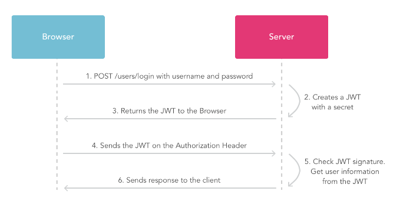

**服务器就不保存任何 session 数据了，也就是说，服务器变成无状态了，从而比较容易实现扩展。**

**区别**

 (1) session 存储在服务端占用服务器资源，而 JWT 存储在客户端

 (2) session 存储在 Cookie 中，存在伪造跨站请求伪造攻击的风险

 (3) session 只存在一台服务器上，那么下次请求就必须请求这台服务器，不利于分布式应用

 (4) 存储在客户端的 JWT 比存储在服务端的 session 更具有扩展性

#### ④ 数据结构

一个token分3部分，按顺序:

- 头部（header)：声明类型和声明加密的算法 通常直接使用 HMAC SHA256

  ```json
   {
   "alg": "HS256",
   "typ": "JWT"
   }
  ```

- 载荷（payload)：Payload 部分也是一个 JSON 对象，用来存放实际需要传递的数据。

  iss (issuer)：签发人 exp (expiration time)：过期时间 sub (subject)：主题 aud (audience)：受众 nbf (Not Before)：生效时间 iat (Issued At)：签发时间 jti (JWT ID)：编号

  ```json
   {
   "sub": "1234567890",
   "name": "chongchong",
   "admin": true
   }
  ```

- 签名（signature)：对前两部分的签名，防止数据篡改

   对象为一个很长的字符串，字符之间通过"."分隔符分为三个子串。注意JWT对象为一个长字串，各字串之间也没有换行符，一般格式为：xxxxx.yyyyy.zzzzz 。 例如 

```
yJhbGciOiJIUzI1NiIsInR5cCI6IkpXVCJ9.eyJzdWIiOiIxMjM0NTY3ODkwIiwibmFtZSI6IkpvaG4gRG9lIiwiaWF0IjoxNTE2MjM5MDIyfQ.SflKxwRJSMeKKF2QT4fwpMeJf36POk6yJV_adQssw5c
```

### （8）幂等性

**幂等性**指的是无论一个操作执行多少次，其结果都应当是相同的。这对于设计 API 尤其重要，因为它能确保在网络不稳定或客户端重复请求的情况下，API 的行为是一致和可靠的。

1. **网络波动不稳定**：网络通信中的丢包、延迟等情况可能导致客户端未收到服务端的响应或服务端未收到客户端的请求，此时客户端可能会重试发送请求，导致接口被重复调用。
2. **用户操作**：用户快速重复点击导致，例如用户在等待响应时，由于不确定是否操作成功，可能会多次点击提交按钮，进而发送多次相同的请求。再比如页用户频繁刷新页面，尤其是在某些提交操作尚未完成时，刷新页面可能会重新发送请求。还有用户可能在浏览器上点击回退然后再重复之间的提交操作，这都可能会导致重新发送请求。
3. **重试机制**：在高可用性设计中，客户端常常设置有重试机制，当请求失败或超时时会自动重新发起请求。而在分布式系统中，服务间调用也可能有重试策略，以应对临时故障。比如Nginx重试，RPC重试，或者调用方业务层中进行重试。
4. **定时任务或异步处理**：在定时任务中如果定时任务调度或逻辑设计不当，可能会导致同一任务被执行多次。或者在消息队列中，消息可能会因为异常等原因被重复消费。
5. **并发控制**：缺乏有效的并发控制手段，导致在并发环境下，针对同一资源的操作被多次执行。

**GET 请求**：GET 请求天生是幂等的，因为它们只用于读取数据，不会修改服务器的状态。

**页面控制**：页面调用接口时可以通过禁用（如按钮置灰或显示加载状态）防止用户在请求未完成前重复点击，从而减少不必要的重复请求和可能的数据冲突。

**使用RPG模式**：指示客户端发起一个新的GET请求去访问一个特定的URL。客户端遵照服务器的重定向指示，自动发送GET请求访问新的URL，此时返回的页面将展示之前POST操作处理完毕的结果。

**Token机制：**客户端每次请求都需要携带一个唯一的Token，而服务器则验证这个Token的有效性。如果服务器收到了一个已经使用过的Token就会认为这是一个重复请求并拒绝处理。

唯一标识符、时间戳、乐观锁

# 三、攻击

## 1.SQL注入

`SQL注入` 攻击指的是攻击者在 `HTTP` 请求中注入恶意 `SQL` 命令，服务器用请求参数构造数据库 `SQL` 命令时，恶意 `SQL` 被一起构造，并在数据库中执行，以便得到数据库中的感兴趣的数据或对数据库进行读取、修改、删除、插入等敏感的操作，从而导致数据被随意篡改

但是 `SQL注入` 攻击，需要攻击者对数据库表有所了解才行，比如你的项目 `开源` 了，不小心公开了数据库的账号和密码；另外你的网站上线没有 `关闭调试模式`，有心者可以网站的根据错误回显可以猜测表结构；另外还有就是 `盲注`，也即是很多有心者会盲猜数据表结构，但是这种难度最大

`SQL注入` 可以通过预编译手段进行预防，绑定参数是最好的防 `SQL` 注入方法。现在流行的框架基本都实现了 `SQL预编译`和 `参数绑定`，恶意攻击的 `SQL` 会被当做 `SQL` 的参数，而不是 `SQL` 命令被执行

## 2.CSRF攻击

`CSRF` 全称 `Cross Site Request Forgery`跨站点请求伪造，攻击者通过跨站请求，以合法的用户身份进行非法操作，如转账交易、发表评论等。其核心是利用了浏览器 `Cookie` 或服务器的 `Session` 策略，盗取用户的身份信息

在打开 `A网站` 的情况下，另开 `Tab页面` 打开恶意 `网站B`，此时在 `B页面` 的 `恶意意图` 下，浏览器发起一个对 `网站A` 的 `HTTP` 请求

因为之前 `A网站` 已经打开了，浏览器存有 `A网站` 中的 `Cookie` 或其他用于身份认证的信息，这一次被 `恶意意图` 的请求，将会自动带上这些信息，这将会导致身份劫持，造成并非本人意愿的操作结果

而对应 `CSRF攻击` 的防御策略有：`token`、 `验证码`、`Referer 检测` 等

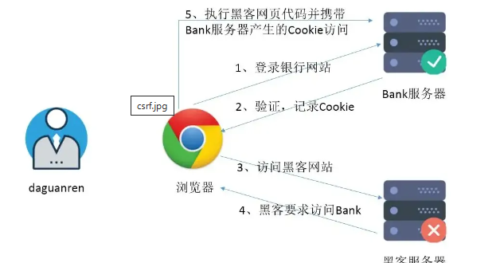

## 3.DDOS攻击

`DDoS` 全称 `Distributed Denial of Service，分布式拒绝服务攻击`。是拒绝服务攻击的升级版。拒绝攻击服务其实就是让你的服务不能正常给用户提供服务，也就是俗话说的服务宕机。常用于攻击对外提供服务的服务器，像常见的：`Web服务`、`邮件服务`、`DNS服务`、`即时通讯服务` 这些等

在早期发起 `DoS攻击` 是一件很容易的事情，只需要写个程序让服务过载，无暇提供正常服务即可，也就是一秒中请求服务多次，将目标服务器的内存跑崩

后来随着技术对发展，现在的服务器都是分布式，并不是单一服务器提供服务，一个服务背后拥有着是数不清的 `CDN节点`，也是就拥有着数不清的`Web服务器`。想靠单台服务器去攻击这种分布式网络，无异于对方`以卵击石` ，而且现在很多 `DDOS 攻击` 都不是免费的，所以很容易造成偷鸡不成蚀把米

防御手段：随着技术发展到今天也并不能完全杜绝这种攻击的出现，只能通过技术去缓解。其中包括：`流量清洗`、`SYN Cookie` 等等

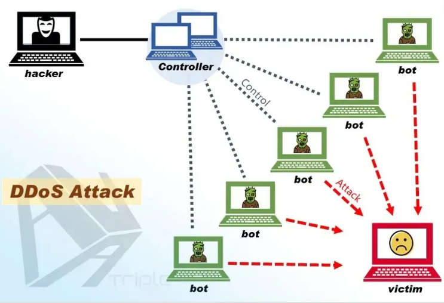

## 4.DNS劫持

当今互联网流量中，以 `HTTP／HTTPS` 为主的 `Web服务` 产生的流量占据了绝大部分。

`Web服务` 发展的如火如荼，这背后离不开一个默默无闻的大功臣就是域名解析系统，`DNS` 提供将域名转换成 `ip地址` 的服务，每一个域名的解析都要经过 `DNS` ，所以可以看出它的重要性。

正是因为它的重要性，所以 `DNS劫持` 很容易被别有用心的人利用早期并没有考虑太多的安全性，所以导致 `DNS` 很容易被劫持。

如果攻击者篡改 `DNS解析` 设置，将域名由正常 `IP` 指向由攻击者控制的非法 `IP`，就会导致我们访问域名打开的却不是对应的网站，而是一个假冒或者别有用心的网站。这种攻击手段就是 `DNS劫持`。

通过 `DNS劫持` 简单点可以导致用户流失，严重的后果甚至惠将用户诱导至攻击者控制额非法网站，可能会造成银行卡号、手机号码、账号密码等重要信息的泄露。

后来出现了 `DNSSEC` 技术，虽然在一定程度上解决了劫持问题，但是国内并没有太多应用的案例，因此后来阿里、腾讯推出了 `httpDNS` 服务也一定程度上可以抑制这种攻击手段。另外可以 `安装SSL证书`。SSL证书具备服务器身份认证功能，可以使DNS 劫持导致的连接错误情况及时被发现和终止。

## 5.XSS攻击

XSS(Cross-Site Scripting,跨站脚本攻击)是一种代码注入攻击。攻击者在目标网站上注入恶意代码，当用户(被攻击者)登录网站时就会执行这些恶意代码，通过这些脚本可以读取cookie,session tokens，或者网站其他敏感的网站信息，对用户进行钓鱼欺诈。

XSS是指攻击者在网页中嵌入客户端脚本，通常是JavaScript 编写的恶意代码，也有使用其他客户端脚本语言编写的。当用户使用浏览器浏览被嵌入恶意代码的网页时，恶意代码将会在用户的浏览器上执行。

Javascript 可以用来获取用户的 Cookie、改变网页内容、URL 跳转，攻击者可以在 script 标签中输入 Javascript 代码，如 alert(/xss/)，实现一些“特殊效果”。

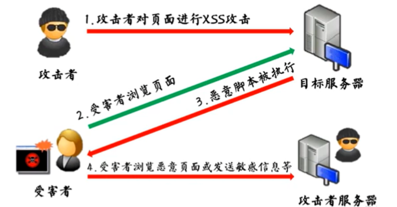


