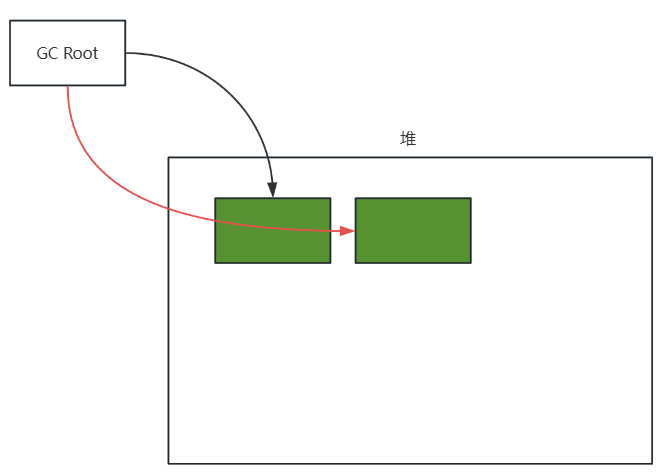
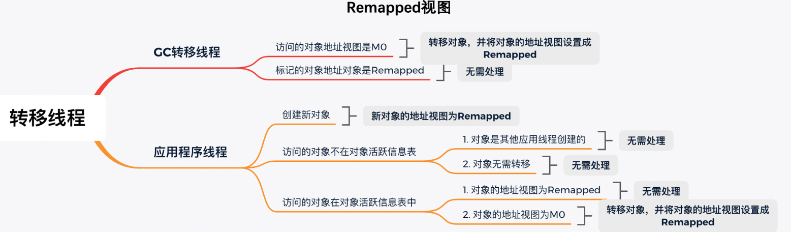
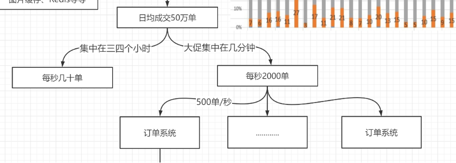

# 一、JVM之走进类加载

## 1.初始JVM

Java虚拟机（Java Virtual Machine）是运行所有Java应用程序的引擎，是Java平台的核心部分，提供了Java程序运行时的环境。JVM主要的功能是==允许Java程序能在任何设备或操作系统上运行==，实现了Java的“一次编写，到处运行”（==WORA==）的理念。


### （1）JVM、JDK、JRE关系


### （2）主要组成


- **类加载器（Class Loaders）**：类加载器负责从文件系统或网络中加载类信息到JVM中。在Java中，类加载器通过一个称为类加载机制的过程，将Java类的.class文件加载到运行时数据区，并在内存中创建一个java.lang.Class对象。
- **运行时数据区（Runtime Data Areas）**：运行时数据区是JVM在执行Java程序时用来存储数据的内存区域。
- **执行引擎（Execution Engine）**：执行引擎是JVM的核心，负责执行类文件中的字节码。它包括一个虚拟处理器，并可执行解释指令。执行引擎还包括：
  - **解释器（Interpreter）**：读取字节码，解释指令，然后执行。它的缺点是速度比较慢。
  - **即时编译器（Just-In-Time Compiler, JIT）**：将热点代码（频繁执行的代码）编译为本地机器代码，以提高执行效率。
  - **垃圾收集器（Garbage Collector）**：自动管理内存，释放不再使用的对象所占用的内存空间。

## 2.源文件到类文件

### （1）javac

`javac` 是 Java 编译器的命令行工具，它是 Java 开发工具包（JDK）的一部分。`javac` 用于将 Java 程序源代码（以 `.java` 文件形式存在）转换成 Java 字节码（以 `.class` 文件形式存在），这些字节码可以被 Java 虚拟机（JVM）执行。

下面是一个Person.java源文件到类文件的流程示例

**源文件**

```java
package com.lxy;

class Person {
    private String name = "yzt";
    private int age;
    private final double salary = 100;
    private static String address;
    private final static String hobby = "Programming";
    private static Object obj = new Object();

    public void say() {
        System.out.println("person say...");
    }

    public static int calc(int op1, int op2) {
        op1 = 3;
        int result = op1 + op2;
        Object obj = new Object();
        return result;
    }

    public static void main(String[] args) {
        calc(1, 2);
    }
}
```

**编译：Person.java ---->Person.class**（==对等信息的转换==）

```
javac Person.java
```

**编译流程：**


1. **解析**：编译器读取源代码，将文本分解为标记，并构建出抽象语法树（AST），包括词法、语法分析。
2. **语义分析**：编译器对AST进行检查，确认代码逻辑（如数据类型和作用域）的正确性。
3. **生成字节码**：编译器将AST转换为平台无关的字节码，这些字节码随后可以在任何JVM上运行。

**类文件**


> Person.class为二进制文件，这些文件通常不能直接阅读，需要使用专门的工具如 `javap`（Java反汇编器）来查看其内容，或者通过IDE（如 IntelliJ IDEA, Eclipse）来进行查看和管理。
>
> 使用命令 `javap -v -p Person.class` 可以反编译并查看 `Person.class` 文件中的详细字节码信息和所有访问级别的类成员

```java
Classfile /E:/data/jvm_study_all/target/classes/com/lxy/Person.class
  Last modified 2024-5-9; size 1094 bytes
  MD5 checksum 0ae1d8db8e931e4329464f25b2893f05
  Compiled from "Person.java"
class com.lxy.Person
  minor version: 0
  major version: 51
  flags: ACC_SUPER
Constant pool:
   #1 = Methodref          #10.#46        // java/lang/Object."<init>":()V
   #2 = String             #47            // yzt
   #3 = Fieldref           #13.#48        // com/lxy/Person.name:Ljava/lang/String;
   #4 = Double             100.0d
   #6 = Fieldref           #13.#49        // com/lxy/Person.salary:D
   #7 = Fieldref           #50.#51        // java/lang/System.out:Ljava/io/PrintStream;
   #8 = String             #52            // person say...
   #9 = Methodref          #53.#54        // java/io/PrintStream.println:(Ljava/lang/String;)V
  #10 = Class              #55            // java/lang/Object
  #11 = Methodref          #13.#56        // com/lxy/Person.calc:(II)I
  #12 = Fieldref           #13.#57        // com/lxy/Person.obj:Ljava/lang/Object;
  #13 = Class              #58            // com/lxy/Person
  #14 = Utf8               name
  #15 = Utf8               Ljava/lang/String;
  #16 = Utf8               age
  #17 = Utf8               I
  #18 = Utf8               salary
  #19 = Utf8               D
  #20 = Utf8               ConstantValue
  #21 = Utf8               address
  #22 = Utf8               hobby
  #23 = String             #59            // Programming
  #24 = Utf8               obj
  #25 = Utf8               Ljava/lang/Object;
  #26 = Utf8               <init>
  #27 = Utf8               ()V
  #28 = Utf8               Code
  #29 = Utf8               LineNumberTable
  #30 = Utf8               LocalVariableTable
  #31 = Utf8               this
  #32 = Utf8               Lcom/lxy/Person;
  #33 = Utf8               say
  #34 = Utf8               calc
  #35 = Utf8               (II)I
  #36 = Utf8               op1
  #37 = Utf8               op2
  #38 = Utf8               result
  #39 = Utf8               main
  #40 = Utf8               ([Ljava/lang/String;)V
  #41 = Utf8               args
  #42 = Utf8               [Ljava/lang/String;
  #43 = Utf8               <clinit>
  #44 = Utf8               SourceFile
  #45 = Utf8               Person.java
  #46 = NameAndType        #26:#27        // "<init>":()V
  #47 = Utf8               yzt
  #48 = NameAndType        #14:#15        // name:Ljava/lang/String;
  #49 = NameAndType        #18:#19        // salary:D
  #50 = Class              #60            // java/lang/System
  #51 = NameAndType        #61:#62        // out:Ljava/io/PrintStream;
  #52 = Utf8               person say...
  #53 = Class              #63            // java/io/PrintStream
  #54 = NameAndType        #64:#65        // println:(Ljava/lang/String;)V
  #55 = Utf8               java/lang/Object
  #56 = NameAndType        #34:#35        // calc:(II)I
  #57 = NameAndType        #24:#25        // obj:Ljava/lang/Object;
  #58 = Utf8               com/lxy/Person
  #59 = Utf8               Programming
  #60 = Utf8               java/lang/System
  #61 = Utf8               out
  #62 = Utf8               Ljava/io/PrintStream;
  #63 = Utf8               java/io/PrintStream
  #64 = Utf8               println
  #65 = Utf8               (Ljava/lang/String;)V
{
  private java.lang.String name;
    descriptor: Ljava/lang/String;
    flags: ACC_PRIVATE

  private int age;
    descriptor: I
    flags: ACC_PRIVATE

  private final double salary;
    descriptor: D
    flags: ACC_PRIVATE, ACC_FINAL
    ConstantValue: double 100.0d

  private static java.lang.String address;
    descriptor: Ljava/lang/String;
    flags: ACC_PRIVATE, ACC_STATIC

  private static final java.lang.String hobby;
    descriptor: Ljava/lang/String;
    flags: ACC_PRIVATE, ACC_STATIC, ACC_FINAL
    ConstantValue: String Programming

  private static java.lang.Object obj;
    descriptor: Ljava/lang/Object;
    flags: ACC_PRIVATE, ACC_STATIC

  com.lxy.Person();
    descriptor: ()V
    flags:
    Code:
      stack=3, locals=1, args_size=1
         0: aload_0
         1: invokespecial #1                  // Method java/lang/Object."<init>":()V
         4: aload_0
         5: ldc           #2                  // String yzt
         7: putfield      #3                  // Field name:Ljava/lang/String;
        10: aload_0
        11: ldc2_w        #4                  // double 100.0d
        14: putfield      #6                  // Field salary:D
        17: return
      LineNumberTable:
        line 3: 0
        line 4: 4
        line 6: 10
      LocalVariableTable:
        Start  Length  Slot  Name   Signature
            0      18     0  this   Lcom/lxy/Person;

  public void say();
    descriptor: ()V
    flags: ACC_PUBLIC
    Code:
      stack=2, locals=1, args_size=1
         0: getstatic     #7                  // Field java/lang/System.out:Ljava/io/PrintStream;
         3: ldc           #8                  // String person say...
         5: invokevirtual #9                  // Method java/io/PrintStream.println:(Ljava/lang/String;)V
         8: return
      LineNumberTable:
        line 12: 0
        line 13: 8
      LocalVariableTable:
        Start  Length  Slot  Name   Signature
            0       9     0  this   Lcom/lxy/Person;

  public static int calc(int, int);
    descriptor: (II)I
    flags: ACC_PUBLIC, ACC_STATIC
    Code:
      stack=2, locals=4, args_size=2
         0: iconst_3
         1: istore_0
         2: iload_0
         3: iload_1
         4: iadd
         5: istore_2
         6: new           #10                 // class java/lang/Object
         9: dup
        10: invokespecial #1                  // Method java/lang/Object."<init>":()V
        13: astore_3
        14: iload_2
        15: ireturn
      LineNumberTable:
        line 16: 0
        line 17: 2
        line 18: 6
        line 19: 14
      LocalVariableTable:
        Start  Length  Slot  Name   Signature
            0      16     0   op1   I
            0      16     1   op2   I
            6      10     2 result   I
           14       2     3   obj   Ljava/lang/Object;

  public static void main(java.lang.String[]);
    descriptor: ([Ljava/lang/String;)V
    flags: ACC_PUBLIC, ACC_STATIC
    Code:
      stack=2, locals=1, args_size=1
         0: iconst_1
         1: iconst_2
         2: invokestatic  #11                 // Method calc:(II)I
         5: pop
         6: return
      LineNumberTable:
        line 23: 0
        line 24: 6
      LocalVariableTable:
        Start  Length  Slot  Name   Signature
            0       7     0  args   [Ljava/lang/String;

  static {};
    descriptor: ()V
    flags: ACC_STATIC
    Code:
      stack=2, locals=0, args_size=0
         0: new           #10                 // class java/lang/Object
         3: dup
         4: invokespecial #1                  // Method java/lang/Object."<init>":()V
         7: putstatic     #12                 // Field obj:Ljava/lang/Object;
        10: return
      LineNumberTable:
        line 9: 0
}
SourceFile: "Person.java"
```

### （2）.class文件

在Java中，`.class` 文件是一个编译后的Java字节码文件，它包含了Java源代码编译后的内容。这些文件可以被Java虚拟机（JVM）加载和执行。

**The `ClassFile` Structure**

> 官网：[Chapter 4. The class File Format (oracle.com)](https://docs.oracle.com/javase/specs/jvms/se8/html/jvms-4.html)

```java
ClassFile {
    u4             magic;
    u2             minor_version;
    u2             major_version;
    u2             constant_pool_count;
    cp_info        constant_pool[constant_pool_count-1];
    u2             access_flags;
    u2             this_class;
    u2             super_class;
    u2             interfaces_count;
    u2             interfaces[interfaces_count];
    u2             fields_count;
    field_info     fields[fields_count];
    u2             methods_count;
    method_info    methods[methods_count];
    u2             attributes_count;
    attribute_info attributes[attributes_count];
}
```

- **magic**：这是一个固定的4字节（`u4`）魔数，对于所有的`.class`文件，这个值都是`0xCAFEBABE`，用于确认文件是否为有效的Java类文件。
- **minor_version 和 major_version**：这两个部分定义了类文件的版本。`minor_version` 是次要版本号，`major_version` 是主要版本号。它们共同决定了这个类文件被哪个版本的JVM支持。
- **constant_pool_count 和 constant_pool**：常量池入口的数量和常量池数组。常量池是类文件结构中的一个重要部分，存储了各种==字面量（字符串、final修饰的基本数据类型）==和对类型、字段和方法的==符号引用==。`constant_pool_count` 指定了常量池数组中，常量池项的数量，实际数量比这个值小1。
- **access_flags**：访问标志，这是一组标志用来识别一些类或接口级别的访问信息，如这个类是类还是接口，是否为`public`，是否为`abstract`等。
- **this_class 和 super_class**：这两个字段分别提供了当前类和其直接超类在常量池中的索引。`this_class` 指向常量池中一个表示当前类名的`Class`类型的常量，`super_class` 对应的是其直接父类的名称。
- **interfaces_count 和 interfaces**：接口计数和接口数组，指出类实现的接口数量和提供对常量池的索引，常量池中存储了每个接口的全限定名。
- **fields_count 和 fields**：字段计数和字段数组，这些字段包含了类中声明的变量，包括其名称、类型和其他修饰符。
- **methods_count 和 methods**：方法计数和方法数组，这里列出了类中定义的所有方法，包括方法名、返回类型、参数、访问控制和其他信息。
- **attributes_count 和 attributes**：属性计数和属性数组，属性部分在类文件中扮演重要角色，它包含了诸如源码文件名、行号信息、局部变量表等额外信息，这些信息主要用于调试、编译器设计等用途。

主要内容概括为

1. **类信息**：
   - 类名
   - 父类名（除了 `java.lang.Object` 外，所有类都有父类）
   - 接口信息（如果实现了接口）
   - 访问修饰符
   - 构造方法
2. **字段信息**：
   - 类变量和实例变量的名称
   - 数据类型
   - 访问修饰符（如 public, private, protected）
3. **方法信息**：
   - 方法名
   - 返回类型
   - 参数列表
   - 访问修饰符
   - 方法的字节码指令
4. **常量池**：包含所有字面量和符号引用，如类和接口的全名，字段的名称和描述符，方法的名称和描述符等。
5. **元数据和注解**：包括类、方法和字段上的注解信息。

我们可以看到JVM和.class文件的设计精妙地将程序的开发和部署环境分离开来，使得Java程序具有很高的可移植性和平台独立性。==JVM相对于.class文件就像操作系统相对于汇编语言==。

### （3）常量池

在Java `.class` 文件中，常量池（Constant Pool）是一个非常重要的组成部分，它存储了编译时生成的各种字面量和符号引用。

#### 字面量（Literals）
这些是直接在Java代码中定义的值，如整数、浮点数、字符串等。例如：

- **整数**：所有的 `int` 和 `short` 类型的值。
- **浮点数**：所有的 `float` 和 `double` 类型的值。
- **字符串**：所有在Java代码中出现的字符串字面值。

#### 符号引用（Symbolic References）
符号引用是对类、接口、字段和方法的引用，不直接指向数据的具体位置，而是通过一种符号方式来引用。它们包括：

1. **类和接口的全名**：
   - 用来引用代码中使用到的所有类和接口。

2. **字段的名称和描述符**：
   - **名称**：字段的名称。
   - **描述符**：描述字段的数据类型，例如 `I` 表示 `int` 类型，`Lcom/example/MyClass;` 表示 `MyClass` 类型的对象。

3. **方法的名称和描述符**：
   - **名称**：方法的名称。
   - **描述符**：描述方法的返回类型和参数类型。例如，`（ILjava/lang/String;)V` 表示一个方法，接受一个整型和一个字符串型参数，没有返回值（`V` 表示 void）。

4. **接口方法的引用**：
   - 类似于方法的引用，但专门用于接口中的方法。

这些引用在运行时被用来解析实际的内存地址，使JVM能够定位到正确的类、字段、方法等。

常量池的主要作用是优化Java程序的性能和存储效率。通过共享常用的字面量和符号引用，减少了内存的使用，并加速了运行时的解析过程。此外，它也是Java动态链接的基础部分，使得Java能够在运行时动态加载类。

## 3.类文件到虚拟机

### （1）类加载机制

类加载机制是Java中的一种核心机制，用于==将类的字节码文件中的数据读入到内存中，并生成一个数据访问入口==。这个机制不仅涉及到类的加载，还包括类的链接和初始化等过程。类加载的最终产物是在JVM内存中创建的类实例的访问入口（`Class`类实例），这使得Java程序能够执行类中定义的代码和操作类的数据。

类加载核心过程如下：

1. **加载**：**虚拟机把Class文件加载到内存**，这涉及从各种来源（如文件系统、网络、归档文件等）读取`.class`文件。
2. **校验**：**对数据进行校验**确保加载的Class文件符合JVM规范，没有安全问题。
3. **转换解析和初始化**：将类文件中的符号引用转换为直接引用。对类变量进行初始化，执行静态代码块等。
4. **形成可以虚拟机直接使用的Java类型**：最终产物是在JVM内存中生成的`java.lang.Class`对象，这个对象代表了加载的类，并提供了操作该类的各种方法。


Java的类加载机制提供多种方式来加载`.class`文件，适应于不同的运行环境和需求。以下是几种常见的类加载方法及其典型应用场景：

1. **从本地系统直接加载**
   - **应用场景**：桌面应用或服务器端应用。
   - **描述**：最常见的方式，从类路径指定的目录中直接读取`.class`文件。

2. **通过网络下载`.class`文件**
   - **应用场景**：已经较少使用的Web Applet。
   - **描述**：从服务器通过网络下载到客户端并执行。

3. **从ZIP，JAR等归档文件中加载**
   - **应用场景**：JAR、WAR格式的企业应用。
   - **描述**：从归档文件如JAR中读取`.class`文件，便于分发和使用。

4. **从专有数据库中提取`.class`文件**
   - **应用场景**：大型企业环境中的某些JSP应用。
   - **描述**：从数据库中查询和加载`.class`文件，适用于代码分发和版本控制严格的环境。

5. **将Java源文件动态编译为`.class`文件**
   - **应用场景**：动态代理和运行时代码生成。
   - **描述**：在运行时将源代码编译成`.class`文件，通常用于生成代理类。

6. **从加密文件中获取`.class`文件**
   - **应用场景**：防止反编译的软件保护。
   - **描述**：`.class`文件被加密，加载时需先解密，增强安全性。

### （2）类加载总流程

==Java类的生命周期==可以概括为五个阶段：加载（Load）、链接（Link）、初始化（Initialize）、使用（Use）和卸载（Unload）。类加载过程主要涉及前三个阶段，这些阶段是类从被发现到准备好被JVM使用的关键转换步骤。


#### ① 装载(Load)

> 查找并导入字节码文件

##### 1. 查找字节码文件转换为字节流
这个步骤主要由==类加载器==完成，它们通过使用==类的全限定名==（包括类的包名和类名，如`com.example.MyClass`）来查找类。类加载器根据全限定名从不同的来源获取类的定义，这些来源于上述类加载方式。

##### 2. 字节流转换为运行时数据结构
一旦类加载器找到并加载了类的二进制数据，它接着需要==从静态存储结构到运行时数据结构==，将二进制字节流转化为JVM的==方法区==的运行时数据结构。这包括了==类信息，静态变量，常量==等。

##### 3. 生成java.lang.Class对象
在Java==堆上==生成一个代表该类的`java.lang.Class`对象。这个对象作为程序员在Java代码中访问类的字段、方法、构造器等反射信息的入口。

获取类的二进制字节流的阶段确实是Java程序员可以大展拳脚的一个阶段。在这个阶段，程序员通过==自定义类加载器==可以实现多种灵活的加载策略，从而控制类的加载方式和来源。

#### ② 链接（Link）

##### 验证（Verify）

验证阶段主要确保加载的Class文件的字节流完全==符合当前虚拟机的要求，并且不会危害虚拟机的安全性==。这个阶段包括以下几个核心验证过程：

- **文件格式验证**：检查字节流是否符合Class文件格式规范，确保它可以被当前版本的虚拟机正确处理。这包括验证文件是否以`0xCAFEBABE`开头，以及版本号是否被虚拟机支持。
- **元数据验证**：对类的元数据进行校验，确保没有违反Java语法规范的情况，例如检查类是否非法地继承了final类。
- **字节码验证**：通过数据流和控制流分析，验证方法体的程序逻辑是否合法且安全。这包括确保字节码操作不会导致虚拟机执行不安全的操作，检查跳转指令是否指向有效位置，以及验证栈操作的数据类型与操作码参数是否匹配。
- **符号引用验证**：在虚拟机解析符号引用成直接引用时进行，确保常量池中的符号引用所指向的类、方法和字段是可访问的，并具备相应的访问权限。

注意，虽然验证通常被视为类加载过程中链接阶段的一部分，实际上它在整个类加载过程中都起着关键作用：

- **文件格式验证**：这一步通常在类文件被加载到内存之前就已经开始，即在装载阶段。它确保类文件符合基本的存储格式，如检查文件是否以`0xCAFEBABE`开头。
- **符号引用验证**：这部分验证则是在类的链接阶段的解析步骤中进行，确保所有的符号引用都可以正确地解析到具体的类、方法和字段上。

并且Java虚拟机提供了一定的灵活性，允许开发者通过启动参数来控制验证的行为：

- **-Xverify:none**：这个参数可以关闭类加载时的验证步骤。这通常在开发和测试阶段用于提高性能，因为跳过验证可以减少类加载的时间。然而，这可能会增加运行时错误的风险，因为没有执行完整的验证可能导致一些不符合规范的类被加载到JVM中。

##### 准备（Prepare）

在类的加载过程中的准备阶段，Java虚拟机为类的静态变量分配内存，并将其初始化为类型的默认值。这个阶段的特点包括：

1. **静态变量分配内存**：==静态变量（也称为类变量）被分配在方法区中==。这些变量是类级别的，与类的任何实例无关，共享于类的所有实例之间。
2. **默认初始化**：==静态变量在此阶段被初始化为默认值==。例如，数值类型（如int、float）初始化为0或0.0，引用类型（如对象引用）初始化为`null`。
   - ==注意==：`final`修饰的静态变量由于在编译时就已确定其字面量值，因此在准备阶段会直接赋予这些值，而不是默认值。实例变量不在此阶段处理。它们是随对象一起在堆中分配，并在对象构造时根据构造方法或初始化块中的指令被初始化。

**示例说明**

提供的两个示例很好地说明了准备阶段对静态变量和局部变量的不同处理：

```java
public class Demo1 {
    private static int i;
    public static void main(String[] args) {
        // 正常打印出0，因为静态变量i在准备阶段会有默认值0
        System.out.println(i);
    }
}
public class Demo2 {
    public static void main(String[] args) {
        // 编译通不过，因为局部变量没有赋值不能被使用
        int i;
        System.out.println(i);
    }
}
```

- **示例 1**（`Demo1`）展示了一个静态变量`i`，在准备阶段被自动初始化为0，因此当它被访问时，即使没有显式赋值，也能打印出其默认值0。
- **示例 2**（`Demo2`）中的局部变量`i`没有初始化，Java不允许使用未初始化的局部变量，因此这段代码无法编译通过。

对于一些特殊情况，如果类字段属性表中存在ConstantValue属性，那在准备阶段变量就会被初始化为ContstantValue属性所指的值。对于这句话，我们又怎么理解呢？

`ConstantValue`属性是类文件中字段的一个可选固定属性，它用于指定字段的常量值。这个属性只适用于静态变量（==static修饰==的变量），并且通常与==final修饰符==一起使用，用于==基本类型==和==String类型==的字段。当字段在Java源代码中被声明为final且直接初始化为一个编译时常量表达式时，编译器会自动为该字段生成`ConstantValue`属性。

在Java程序中，使用`ConstantValue`属性的情况通常涉及到被`static`和`final`修饰的基本数据类型或String类型的字段。例如：

```java
public class Demo {
    private static final int a = 1;
    private static final String greeting = "Hello";
}
```

在==类加载的准备阶段==，JVM会读取这些字段的`ConstantValue`属性，并使用该属性指定的值来==初始化对应的静态变量==。这意味着：

- 对于`int`类型的`a`，即使其默认初始化值为0，由于存在`ConstantValue`属性，它会被立即初始化为1。
- 同理，`String`类型的`greeting`会被初始化为"Hello"。

`ConstantValue`属性只适用于基本类型和String类型的原因是，这些类型的值可以在==编译时完全确定==，并且可以直接==存储在常量池==中。这使得JVM能够在类加载时快速地将这些预定义的、不变的值赋给相应的字段。

##### 解析（Resolve）

在这个阶段中，JVM 将常量池中==符号引用转换直接引用==

- **符号引用**是一种抽象的、不依赖于虚拟机内存布局和实现的引用方式，主要存储在常量池中。
- **直接引用**是具体的、直接指向目标的引用，它可以是指向内存中对象的指针、相对偏移量或一个能间接定位到目标的句柄。

JVM通常会==缓存首次解析的结果==，以避免重复解析带来的性能损耗。如果一个符号引用已经被成功解析，那么后续对该符号引用的解析应保证成功；反之，如果首次解析失败，后续的解析也应抛出同样的异常。

**invokedynamic (indy)** 指令是Java 7中引入的，用于==支持Java的动态语言特性==，Java 8中它被广泛应用于lambda表达式的实现。与其他的方法调用指令（如invokevirtual、invokestatic等）不同，invokedynamic不在类加载时就确定调用的具体方法，而是允许开发者在运行时动态指定方法版本。 **invokedynamic (indy)** 指令可以从某种角度上被视为一种实现多态的机制。

#### ③ 初始化（Initialize）

初始化阶段的目的是为==类变量赋予程序员设定的具体初始值，以及执行静态代码块中的语句==。这个过程确保类的静态状态符合逻辑和预期，为类的后续使用做好准备。

**类变量初始化的两种方式**

1. **在声明时指定初始值**：这是最直观的初始化方式，直接在静态变量声明时赋值。

   ```java
   public class MyClass {
       public static int value = 10;
   }
   ```

2. **使用静态代码块**：静态代码块提供了一个在类加载时执行初始化代码的机会。它通常用于初始化那些不能在声明时直接赋初值的复杂静态变量。

   ```java
   public class MyClass {
       public static int value;
       static {
           value = calculateInitialValue();
       }
       private static int calculateInitialValue() {
           // 复杂的初始化逻辑
           return 10;
       }
   }
   ```

**==注意静态变量和静态代码块的顺序==**：在Java中，静态变量和静态代码块的执行顺序非常重要，因为它们按照在代码中的出现顺序执行。如果静态代码块在一个静态变量之前，并试图访问那个变量，那么它可能访问到的是那个变量的默认初始化值，而不是预期的赋值。关键是理解"默认初始化"（在准备阶段）和"显式初始化"（在初始化阶段）之间的区别。

```java
package com.lxy.classloader;
public class Main {
    static Integer age=18;//需要放在静态块前
    public static String info;
    static{
        info="zhangMan:"+age;
    }
    public static void main(String[] args) {
        System.out.println(info);
    }
}
```

**具体步骤**

1. **加载和链接**：如果类还未被加载和链接，那么JVM首先会完成这些步骤。
2. **父类初始化**：根据Java的初始化规则，如果类有父类，且父类还没有被初始化，那么JVM会先初始化父类。这是因为子类的行为可能依赖于父类的状态。
3. **执行初始化语句**：类中定义的所有静态初始化器（static块）和静态变量的赋值语句将被执行。这些语句按照它们在类中出现的顺序执行。

#### ④ 使用（Use）

==类的初始化只在“主动引用”时被触发，而“被动引用”则不会导致类的初始化==。

**主动引用**

主动引用是指直接导致Java类初始化的操作。这些操作确保Java类在任何被使用前已经完全初始化。以下是触发类初始化的主要情况：

1. **创建类的实例**：使用`new`关键字实例化一个类时，Java虚拟机会初始化这个类。
2. **访问或设置类的静态变量**：除了直接定义为`final`的静态变量之外，访问或赋值一个类的静态变量会触发这个类的初始化。
3. **调用类的静态方法**：调用类的任何静态方法时，该类会被初始化。
4. **反射**：使用`Class.forName("com.example.Test")`这类反射方法会触发类的初始化。
5. **初始化子类**：如果一个类是另一个类的子类，初始化子类将首先触发父类的初始化。
6. **JVM启动类**：如果一个类是启动应用时的主类（即包含`main`方法的类），JVM会首先初始化这个类。

**被动引用**

被动引用不会触发类的初始化。以下是一些常见的被动引用情况：

1. **访问静态字段，只触发父类初始化**：如果通过子类引用父类的静态字段，只有父类会被初始化，子类不会。
2. **定义类的数组**：定义引用类的数组不会触发该类的初始化，因为数组实际上是由JVM在运行时动态生成的，代表数组的类称为“[Lcom.example.Test;”这样的形式。
3. **引用静态常量**：引用由`static final`修饰且在编译时就确定下来的基本类型或字符串直接量的静态字段，不会触发类的初始化。这是因为这样的常量值在编译时就已经存入调用类的常量池中了。

#### ⑤ 卸载（unload）

**类的卸载条件**

1. **实例已经被回收**：这意味着该类的所有实例都已经不再被引用，因此已经被垃圾回收器回收。没有任何活跃的实例，这是类卸载的先决条件。
2. **类加载器已经被回收**：类是由类加载器加载的，因此类的生命周期与其类加载器紧密相关。如果加载该类的类加载器本身被回收了（即没有任何引用指向这个类加载器），则这个类加载器加载的所有类都有可能被卸载。
3. **Class对象不再被引用**：每个类在JVM中都有一个`java.lang.Class`对象与之对应，它包含了类的元数据，提供了反射的入口。如果这个Class对象本身不再被任何引用（比如不被变量引用、不在任何对象的字段中、不在任何集合对象中等），并且不能通过反射访问该类，那么这个类就可能被卸载。

**为什么类不易被卸载**

1. **类加载器的生命周期**：通常，特别是对于启动类加载器（Bootstrap ClassLoader）和扩展类加载器（Extension ClassLoader），它们由JVM直接管理，并在JVM的整个生命周期内持续活跃。因此，这些类加载器加载的类几乎永远不会被卸载。
2. **Class对象的广泛引用**：在Java应用中，很多地方都可能通过反射持有Class对象的引用，这使得Class对象很难达到“无引用”的状态。

### （3）类加载器

类加载器的主要职责是，根据指定的类名，找到其对应的字节码，读取这些数据，并将其转换成在JVM内部可以使用的`java.lang.Class`对象。这个过程包括解析二进制字节流数据并为之在JVM的方法区分配内存。

每个类加载器在Java中都维护着一个称为“命名空间”的概念，这个命名空间是由该加载器及其所有父加载器加载的类构成的。这意味着：

- **父加载器**：父加载器所加载的类也属于子加载器的命名空间。例如，如果一个系统类加载器（System Class Loader）加载了`java.util.ArrayList`，那么这个类也在任何由系统类加载器派生的自定义加载器的命名空间中。
- **类的可见性**：在一个类加载器的命名空间内，它能够“看到”由自己或其任何父加载器加载的类。

在Java中，一个类的唯一性不仅仅由其全限定名（即包括包名的类名，如`com.example.MyClass`）确定，还由加载这个类的类加载器实例共同决定。这意味着：

- **同一个类由不同加载器加载**：如果两个不同的类加载器加载了相同全限定名的类文件，它们在JVM中是作为两个不同的类存在的。这种机制允许JVM中存在多个版本的相同类，这些类相互之间是隔离的。
- **同一命名空间内的类的唯一性**：在同一个类加载器的命名空间内，不会出现两个同名的类。如果试图通过同一个类加载器重复加载相同全限定名的类，将不会再次加载，而是返回已经加载的类实例。

#### ① 分类


**1. Bootstrap ClassLoader（启动类加载器）**

- **职责**：负责加载 JVM 基础核心类库，如 `$JAVA_HOME/jre/lib/rt.jar`、`charsets.jar` 等。
- **实现方式**：此加载器由 C++ 实现，并不继承自 `java.lang.ClassLoader`。这意味着它不是一个 Java 对象，而是 JVM 自身的一部分。
- **特点**：它不是 `ClassLoader` 的子类，因此在 Java 应用程序中不能直接引用它。

**2. Extension ClassLoader（扩展类加载器）**

- **职责**：负责加载 Java 的扩展库，包括 `$JAVA_HOME/jre/lib/ext` 目录下的所有 JAR 包，或者通过 `-Djava.ext.dirs` 系统属性指定的目录下的 JAR 包。
- **实现方式**：这是 `ClassLoader` 的子类，由 Java 实现。
- **用途**：它扩展了 Java 标准核心库之外的功能，允许包括服务提供者接口（SPI）等机制的库被加载进 JVM。

**3. App ClassLoader（应用类加载器）**

- **职责**：负责加载用户类路径（Classpath）上指定的类库，这包括由环境变量 `CLASSPATH` 或 `-Djava.class.path` 指定的 JAR 文件和类路径。
- **实现方式**：这也是 `ClassLoader` 的子类，由 Java 实现。
- **特点**：这是默认的类加载器，通常用来加载用户定义的类。

**4. Custom ClassLoader（自定义类加载器）**

- **职责**：由应用开发者根据具体需要实现的类加载器，用于特定场景，如加载网络上的资源，实现热部署等。
- **实现方式**：通过继承 `java.lang.ClassLoader` 并重写 `findClass` 方法等，实现特定的加载逻辑。
- **用途**：使得Java应用能够以非标准方式加载类，如从非标准来源加载类或按需隔离类加载等。

这种结构不仅帮助保护Java平台的核心API不被恶意代码覆盖或篡改，还提供了一种有效的方式来维持不同来源代码之间的隔离性，从而增强了应用的安全性和稳定性。

如果只有一个类加载器，用户可以通过定义与Java核心类同名的类（例如`java.lang.String`）来覆盖标准的Java类库。这样做可能会导致严重的安全漏洞，因为恶意代码可以改变或替代标准库的行为。通过引入分层的类加载器，JVM能够==确保核心库的类总是由启动类加载器（Bootstrap ClassLoader）加载，该加载器不会加载任何来自用户定义路径的类==。

使用分层类加载器可以==实现代码之间的隔离==。例如，应用服务器可以为每个部署的应用程序使用一个单独的类加载器，这样每个应用就可以使用特定版本的库而不会与服务器上运行的其他应用程序冲突。这对于管理和维护大型系统至关重要，可以防止库版本的冲突问题。 

有了分层的类加载器，可以更灵活地加载和卸载特定的代码库。这在需要==热部署==应用组件的环境中非常有用，即在不停止和重启应用服务器的情况下更新应用程序的功能。

#### ② 三种特性

**全盘负责机制（Full Responsibility）**

全盘负责机制确保当一个类加载器负责加载某个类时，==所有该类依赖和引用的其他类也将由同一个类加载器加载==，除非显式指定另一个类加载器进行加载。这意味着一旦类加载器开始加载类，它也将负责加载该类引用的所有其他类。这种策略有助于保持类加载的一致性，确保不会由于类的来源不同导致的潜在冲突。

**双亲委派模型（Parent Delegation Model）**

双亲委派模型是一种类加载顺序，保证了Java核心库的类不会被第三方类覆盖。这个机制的工作流程如下：

1. **类缓存检查**：类加载器首先检查是否已经加载了请求的类，以优化性能并避免重复加载。
2. ==**向上委托**==：如果类未加载，类加载器会将加载任务委托给其父类加载器。这个过程会一直递归向上，直到达到顶层的启动类加载器（Bootstrap ClassLoader）。
3. ==**向下加载**==：从顶层开始，每层类加载器将尝试在自己的类路径下查找并加载类。如果顶层加载器无法加载该类，加载任务就会依次向下传递回原请求的加载器。


**缓存**

Java类加载器将所有加载过的类缓存在内存中，这提高了类加载的效率，避免了重复加载的性能损耗。当程序尝试加载类时，类加载器会先从缓存中查找。

如果类文件被修改，只有重启JVM后修改才会生效，因为只有在JVM启动时，==修改后的类文件才会重新加载进内存==。这是因为一旦类被加载进内存，它将不会被自动更新，即使底层的文件发生了变化。

#### ③ 打破双亲委派

双亲委派模型虽然为Java类加载带来了诸多好处，如安全性和Java核心库的一致性，但它也有其局限性，特别是在现代Java应用中，需要更灵活的类加载机制来支持各种运行时的动态功能。

**1. SPI（Service Provider Interface）**

SPI 是一种==服务发现机制==。它==允许Java核心库查询和加载服务或驱动而无需关心服务提供者的具体实现==。这种机制非常适合于那些由第三方提供具体实现的接口，如 JDBC。

- **工作原理**：Java核心库定义了一系列的接口和预期的行为（如 `java.sql.Driver`），而服务提供者实现这些接口并将它们的实现类的全限定名注册到 `META-INF/services` 下的一个特定服务的配置文件中。在运行时，Java的 `ServiceLoader` 类可以加载这些配置文件，发现并实例化这些服务的实现，而开发者只需面向接口编程。

**2. OSGi（Open Service Gateway Initiative）**

OSGi 是一个创建模块化应用的框架，其核心是一个动态的组件模型。==不同的应用或应用组件可以被分为不同的模块（称为bundle），每个模块可以有自己的类加载器==。

- **模块化和热部署**：在 OSGi 环境中，每个 bundle 由自己的类加载器加载，这允许单独更新、安装或卸载任何一个 bundle，而不影响系统的其它部分。这种方式提供了真正的模块化和动态更新功能，支持热部署和热替换。
- **类加载器的自定义实现**：OSGi中每个bundle的类加载器负责管理那个bundle的类加载请求。它们不遵循传统的双亲委派模型，而是根据需要在bundle间进行类查找和加载，增加了加载过程的复杂性但提高了模块间的隔离性。

类加载的源码分析，如果想破坏双亲委派模型，可以重写loadClass(name)方法。

```java
protected Class<?> loadClass(String name, boolean resolve)
        throws ClassNotFoundException
    {
        synchronized (getClassLoadingLock(name)) {
            // First, check if the class has already been loaded
            Class<?> c = findLoadedClass(name);
            if (c == null) {
                long t0 = System.nanoTime();
                try {
                    if (parent != null) {
                        c = parent.loadClass(name, false);
                    } else {
                        c = findBootstrapClassOrNull(name);
                    }
                } catch (ClassNotFoundException e) {
                    // ClassNotFoundException thrown if class not found
                    // from the non-null parent class loader
                }

                if (c == null) {
                    // If still not found, then invoke findClass in order
                    // to find the class.
                    long t1 = System.nanoTime();
                    c = findClass(name);

                    // this is the defining class loader; record the stats
                    sun.misc.PerfCounter.getParentDelegationTime().addTime(t1 - t0);
                    sun.misc.PerfCounter.getFindClassTime().addElapsedTimeFrom(t1);
                    sun.misc.PerfCounter.getFindClasses().increment();
                }
            }
            if (resolve) {
                resolveClass(c);
            }
            return c;
        }
    }
```

#### ④ 自定义类加载器

**类的全限定名的使用**

自定义类加载器需要使用类的全限定名称来正确地定位和加载类文件。这是因为 `defineClass` 方法，核心方法之一，用于将字节码转换为 `Class` 对象，要求提供的类名必须是包括包路径的全名，例如 `com.example.Test`。如果提供的是相对路径或简单类名，必须转换为全路径。这通常涉及到配置或计算类文件的基础目录，并将其与类名结合，形成类文件的完整路径。

**避免重写 `loadClass` 方法**

通常建议不重写 `loadClass` 方法，以保留双亲委派模型的完整性。双亲委派模型确保类加载的顺序性和安全性，防止类被不当地重载。如果需要实现特定的加载逻辑（如加载加密的类文件），应重写 `findClass` 方法而非 `loadClass`。这样，只有当父类加载器无法加载类时，自定义的加载逻辑才会被调用。

**避免将可加载类放在类路径下**

如果 `Test` 类放在标准类路径下，由于双亲委派机制，系统类加载器（`AppClassLoader`）将优先加载它，而不会使用到自定义类加载器。这可能导致预期之外的行为，特别是当您希望通过自定义类加载器来处理特定的加载逻辑时。将测试类或特定逻辑处理的类放在一个独立于标准类路径的位置，可以确保这些类只通过自定义类加载器加载，实现了类的隔离和特殊处理。

**示例**

```java
package com.example.jvmcase.loader;

import java.io.*;

/**
 * 自定义类加载器，用于从指定的根目录加载类
 */
public class MyClassLoader extends ClassLoader {
    private String root;

    /**
     * 根据类名查找类
     *
     * @param name 类名
     * @return 查找到的类
     * @throws ClassNotFoundException 如果类没有找到
     */
    @Override
    protected Class<?> findClass(String name) throws ClassNotFoundException {
        byte[] classData = loadClassData(name);
        if (classData == null) {
            throw new ClassNotFoundException("Could not find class: " + name);
        }
        // 将二进制字节码转换为Class对象
        return defineClass(name, classData, 0, classData.length);
    }

    /**
     * 加载类的字节码数据
     *
     * @param className 类名
     * @return 类的字节码数据
     */
    private byte[] loadClassData(String className) {
        // 将类名转换为文件路径
        String fileName = root + File.separatorChar + className.replace('.', File.separatorChar) + ".class";
        //读取数据写入缓冲区
        try (InputStream ins = new FileInputStream(fileName);
             ByteArrayOutputStream baos = new ByteArrayOutputStream()) {
            byte[] buffer = new byte[1024];
            int length;
            while ((length = ins.read(buffer)) != -1) {
                baos.write(buffer, 0, length);
            }
            return baos.toByteArray();
        } catch (IOException e) {
            e.printStackTrace();
        }
        return null;
    }

    /**
     * 获取类加载器的根目录
     *
     * @return 根目录路径
     */
    public String getRoot() {
        return root;
    }

    /**
     * 设置类加载器的根目录
     *
     * @param root 根目录路径
     */
    public void setRoot(String root) {
        this.root = root;
    }

    /**
     * 主方法，测试自定义类加载器
     *
     * @param args 命令行参数
     */
    public static void main(String[] args) {
        MyClassLoader classLoader = new MyClassLoader();
        // 设置类加载器的根目录
        classLoader.setRoot("D:\\path\\to\\classes");

        try {
            // 使用自定义类加载器加载Test类
            Class<?> testClass = classLoader.loadClass("com.example.Test");
            System.out.println(testClass);

            // 创建Test类的实例并打印类加载器信息
            Object object = testClass.getDeclaredConstructor().newInstance();
            System.out.println(object.getClass().getClassLoader());
        } catch (ClassNotFoundException | InstantiationException | IllegalAccessException | NoSuchMethodException | InvocationTargetException e) {
            e.printStackTrace();
        }
    }
}

```

# 二、深入运行时数据区

## 1.定义

> `官网`：[https://docs.oracle.com/javase/specs/jvms/se8/html/index.html](https://docs.oracle.com/javase/specs/jvms/se8/html/index.html)

The Java Virtual Machine defines various run-time data areas that are used during execution of a program. Some of these data areas are created on Java Virtual Machine start-up and are destroyed only when the Java Virtual Machine exits. Other data areas are per thread. Per-thread data areas are created when a thread is created and destroyed when the thread exits.

运行时数据区是JVM在执行Java程序时用于存储各种数据的物理部分。

在Java虚拟机（JVM）的类装载过程中，类文件的装载涉及到多个关键的运行时数据区，这些数据区在JVM中扮演着存储和处理类信息的关键角色。

- 当类装载器读取类文件（一个二进制数据流）时，它首先将这些==静态数据转换为方法区中的运行时数据结构==。方法区（非堆）是JVM中用于==存储已被虚拟机加载的类结构信息（类信息、字段信息、方法信息）、运行时常量池、即时编译器编译后的代码==的内存区域。
- 每当JVM装载一个类时，都会在==堆内存==中创建一个`java.lang.Class`类实例，用来表示这个类。这个Class对象包含了类的元数据，==提供了程序运行时访问类的能力==。

因此对于运行时数据区的深入了解是必要的。

## 2.结构（规范）


- 方法区（Method Area）：方法区（非堆）是用于==存储每个类的结构信息==的区域，方法区是由所有==线程共享==的。
- 堆（Heap）：堆是JVM管理的最大的一块内存区域，它被所有==线程共享==。堆是Java虚拟机管理的内存中用于==存储对象实例和数组==的主要区域。堆是垃圾收集器管理的主要区域，也称为GC堆（Garbage Collected Heap）。
- 虚拟机栈（Java Virtual Machine Stacks）：==每个Java线程都有自己的虚拟机栈，这个栈与线程同时创建==。虚拟机栈描述了Java方法执行的内存模型：==每个方法在执行的同时都会创建一个栈帧==用于==存储局部变量表、操作数栈、动态链接信息以及方法出口==等信息。每个方法从调用直至执行完毕的过程，就对应着一个栈帧在虚拟机栈中入栈到出栈的过程。
- 本地方法栈（Native Method Stacks）：本地方法栈与虚拟机栈非常相似，差别在于虚拟机栈为虚拟机执行Java方法（也就是字节码）服务，而本地方法栈则用于支持JVM使用到的本地方法（即Native方法）。本地方法是使用C语言或其他语言实现的方法，不在JVM的管理范畴之内，但可以通过JNI（Java Native Interface）被调用。
- 程序计数器（Program Counter Register）：程序计数器是一块较小的内存空间，它可以看作是当前线程所执行的字节码的行号指示器。在JVM的执行过程中，控制权需要不断地在线程之间切换，每个线程都需要一个独立的程序计数器，各线程之间计数器互不影响，独立存储，以保证线程切换后能恢复到正确的执行位置。

## 3.各区域的补充说明

### （1）方法区的具体实现

JVM规范对方法区的具体实现没有强制要求，这允许不同的JVM实现可以根据自己的优化需求来选择最适合的方法区实现。

#### ① JDK 6和7中的永久代（PermGen）

在JDK 6和JDK 7中，方法区的实现是通过一个称为==永久代（Permanent Generation，简称PermGen）==的内存区域来实现的。==永久代是堆内存的一部分==，它用于存储JVM加载的类和其他相关的元数据。

动态扩容：==永久代有一个固定的大小上限==，这可能导致一些问题，特别是在大量使用动态生成类的应用中，很容易遇到==永久代空间不足的问题==。

垃圾回收：当永久代满时，会触发Full GC来清理不再使用的类和其他元数据。由于涉及堆的压缩和整理，这会==增加垃圾回收的时间，并可能导致应用暂停==。

通过`-XX:PermSize`和`-XX:MaxPermSize`设置初始和最大值。

#### ② JDK 8中的元空间（Metaspace）

从JDK 8开始，Oracle的JVM实现去掉了永久代，引入了==元空间（Metaspace）==来代替。==元空间并不在虚拟机的堆内，而是使用本地内存（也称为非堆内存）==。这样做的主要目的是为了==避免固定大小的永久代带来的内存溢出问题==，以及为了更好地支持不同语言的动态性（如Java、Scala和Groovy等）。并且==元空间的垃圾收集与堆内存的垃圾收集分离==，它主要侧重于卸载不再使用的类，并不涉及传统意义上的内存碎片问题，因此可以减少垃圾回收的时间。

### （2）虚拟机栈的栈帧

每个栈帧对应一个被调用的方法，可以理解为一个方法的运行空间。


- 局部变量表（Local Variables）：局部变量表是一个数组结构，==用于存储方法参数和方法内定义的局部变量==。这些变量值可能包括各种类型，如：boolean、byte、char、short、int、float、long、double和引用类型。局部变量表的大小在编译期间确定，并且在方法运行期间不会改变。

- 操作数栈（Operand Stack）：==操作数栈是一个后入先出（LIFO）栈，用于存储指令执行过程中的中间结果==。此外，它也用于存储指令的==输入参数和输出结果==。

  > 考虑一个简单的Java方法及其对应的字节码，以此展示操作数栈的工作方式：
  >
  > ```java
  > public int add(int a, int b) {
  >     return a + b;
  > }
  > ```
  >
  > 对应的字节码可能如下：
  >
  > ```plaintext
  > 0: iload_1        // Load int from local variable 1 (a) onto the stack
  > 1: iload_2        // Load int from local variable 2 (b) onto the stack
  > 2: iadd           // Add two integers
  > 3: ireturn        // Return integer from top of the stack
  > ```
  >
  > - **iload_1**：该指令将第一个方法参数 `a` 加载到操作数栈顶。
  > - **iload_2**：紧接着，将第二个方法参数 `b` 加载到操作数栈顶，此时栈顶下方是 `a`。
  > - **iadd**：从栈顶取出两个整数（b和a），计算它们的和，然后将结果（a+b）推回栈顶。
  > - **ireturn**：将栈顶的结果返回。

- 动态链接（Dynamic Linking）：每个栈帧都包含一个指向运行时常量池中该栈帧所属方法的符号引用。==将符号引用转换为直接引用==，这使得当前方法能够调用其他方法或者访问其他类的变量。==动态链接使得Java能够支持多态和动态方法调用==。

  > 在Java虚拟机（JVM）的类加载机制中，链接阶段的解析步骤涉及将符号引用转换为直接引用，但这个过程并不一定是一次性完成的。这主要是因为某些==符号引用的解析可能会延迟到首次使用时==，特别是在涉及多态调用的情况下。例如，对于通过接口或抽象类引用的方法调用，具体调用哪个方法的决定可能需要在运行时才能确定。

- 方法返回地址（Return Address）：当方法调用完成后，程序必须知道从哪里继续执行。方法返回地址指示了调用该方法之前的执行点。

- 附加信息：此部分包括异常表，用于处理方法执行中抛出的异常。

### （3） The pc Register 详解

官方定义：The Java Virtual Machine can support many threads of execution at once (JLS §17). Each Java Virtual Machine thread has its own pc (program counter) register. At any point, each Java Virtual Machine thread is executing the code of a single method, namely the current method (§2.6) for that thread.==If that method is not native, the pc register contains the address of the Java Virtual Machine instruction currently being executed==. ==If the method currently being executed by the thread is native, the value of the Java Virtual Machine's pc register is undefined==. The Java Virtual Machine's pc register is wide enough to hold a returnAddress or a native pointer on the specific platform.

JVM的设计受到了冯·诺依曼体系结构的启发，这种体系结构对现代计算机系统的运作方式有深远的影响。在冯·诺依曼体系中，CPU通过时间片的概念来调度和切换程序的执行，这为多任务处理提供了基础。类似地，在Java虚拟机（JVM）中，多线程的管理和切换机制在很多方面模仿了CPU的行为，确保了在一个共享的运行环境中并行执行多个线程。

- pc寄存器仅在执行==Java方法==时有定义的值，因为这些方法依赖于JVM来解释或编译其字节码。对于Java方法，pc寄存器指向当前或下一条要执行的字节码指令。
- 当执行==本地（native）方法==（即用本地编程语言如C或C++编写的方法，通常通过Java Native Interface调用）时，控制权转交给本地方法服务的系统，此时pc寄存器的值不再由JVM控制或定义。因为==本地方法的执行不依赖于JVM的指令调度==，而是==直接在操作系统层面上运行==，所以pc寄存器在这种情况下没有作用。

### （4）Native Method Stacks 详解

在Java方法执行的时候调用native的方法流程：

当Java代码第一次调用本地方法时，JNI（Java Native Interface）负责在本地库中查找并链接这些方法的实际地址。这通常发生在本地方法首次被调用时，==JVM通过JNI使用动态链接技术将符号引用（方法名称等）解析为具体的内存地址或入口点==。一旦地址被确定，Java代码中对本地方法的调用就被转换为对该地址的调用。此时，执行控制权从Java环境传递到本地方法。在调用过程中，JNI还负责在Java数据类型和本地数据类型之间进行转换，确保数据在Java环境和本地环境之间正确传递。


Java虚拟机栈和本地方法栈的分离设计是Java平台独特需求的反映，它不仅支持Java程序的独立运行，还提供了访问本地系统资源的能力，同时增强了程序的稳定性和性能。

### （5）常量池详解

#### ① 静态常量池（Static Constant Pool）

静态常量池是存在于Java类文件结构中的一部分。它主要存储两大类常量：字面量、符号引用。在类和接口被加载到JVM时，为运行时常量池提供数据源。

#### ② 运行时常量池（Runtime Constant Pool）

运行时常量池是方法区的一部分，每个类或接口的静态常量池的运行时表示形式（即将静态存储结构转换为动态存储结构）。

#### ③ 字符串常量池（String Constant Pool）

字符串常量池，特别是在Java 7及之后的版本中（之前在永久代），是Java堆的一部分，用于存储字符串字面量和`intern()`方法的字符串。这个池有助于节省大量由于重复创建相同的字符串实例而浪费的内存。


下面详细的展示了字符串常量池的作用

直接从字符串常量池中引用，直接使用双引号定义字符串时，Java 会首先检查字符串常量池中是否已存在相同内容的字符串。如果存在，就直接返回该字符串的引用；如果不存在，则在常量池中创建一个新的字符串，然后返回这个字符串的引用。

```java
String str = "aaa";  
String str1 = "aaa"; 
```

这两行代码中，`str` 和 `str1` 都引用了字符串常量池中同一个字符串对象 `"aaa"`。

使用`new String()`明确地在堆上创建一个新的字符串对象，即使该字符串的内容已经存在于字符串常量池中。这种方式会创建一个新的对象，然后指向常量池中的字符串。

```java
String str2 = new String("aaa");
```

在这种情况下，`str2` 引用的是堆上新创建的字符串对象，该对象的内容是 `"aaa"`，但它与常量池中的 `"aaa"` 是两个不同的对象。

`intern()` 方法用于返回字符串对象的规范化表示形式。它检查字符串常量池是否已包含一个等价于此 `String` 对象的字符串。如果包含，则返回池中的字符串引用；如果不包含，则将此字符串（包括其引用）添加到池中，并返回此字符串引用。

```java
String str3 = str2.intern(); 
```

这里，由于 `"aaa"` 已存在于字符串常量池中，`intern()` 方法会使 `str3` 引用常量池中的那个已存在的 `"aaa"` 字符串对象。

## 4.区域指向

### （1）栈指向堆


### （2）方法区指向堆


### （3）堆指向方法区


实例对象是如何从堆找到方法区的元数据的呢？下面介绍内存对象布局。

# 三、内存的布局模型

## 1.Java对象内存模型


对象头（Header）是存储对象元数据的部分，包括Mark Word、Class Metadata Pointer以及Length。

实例数据（Instance Data）部分是==对象真正存储的有效信息==，即我们在类中定义的各种类型的字段数据。

对齐填充（Padding）为了==确保对象的大小是8字节的整数倍==（在大多数现代计算机上）。

观察Java对象内存模型工具：

```xml
<dependency>
    <groupId>org.openjdk.jol</groupId>
    <artifactId>jol-core</artifactId>
    <version>0.16</version>
</dependency>
```

### （1）大小端

在计算机科学中，字节序（或称为端序）是指多字节数据在内存中的存储顺序，主要有两种方式：大端存储（Big Endian）和小端存储（Little Endian）。

#### 大端存储（Big Endian）
- **定义**：在大端存储模式中，最高有效字节（MSB）存放在最低的内存地址，最低有效字节（LSB）存放在最高的内存地址。这种方式的一个主要优势是符号位的判断更直接，因为符号位总是位于内存中的固定位置（最低地址位）。
- **使用场景**：大端模式通常在网络协议中使用，因为许多网络协议都是基于大端序定义的，例如TCP/IP协议。因此，在进行网络编程和数据传输时，大端序是更自然的选择。

#### 小端存储（Little Endian）
- **定义**：在小端存储模式中，最低有效字节（LSB）存放在最低的内存地址，最高有效字节（MSB）存放在最高的内存地址。这种方式的一个主要优势是在进行数据类型的截断操作时更为直接，例如将一个长整型截断为整型时，可以简单地忽略高地址端的字节。
- **使用场景**：小端模式通常在个人计算机中使用，因为它可以简化某些类型的数据处理。Intel和AMD的处理器都使用小端存储。

### （2）Class Pointer

#### 句柄池访问

在使用句柄池的JVM实现中，对象的内存布局中并不直接包含指向类元数据的指针。相反，==对象头包含一个指向句柄的指针==，而句柄则包含了指向==类元数据的指针==以及指向==对象数据（实例数据）的指针==。

**优点**：由于对象数据和类型数据的引用都被封装在句柄中，改变对象的内存布局（如垃圾收集过程中的对象移动）不会影响到持有句柄的代码，因为句柄本身的位置是固定的。

**缺点**：每次访问对象的类元数据或实例数据都需要额外的间接寻址，这可能导致性能略有下降。


#### 直接引用访问

在使用直接引用的JVM实现中，==对象头直接包含了一个指向其类元数据的指针==。这种方式省略了句柄池，对象头中直接存放了到类元数据的直接引用。

**优点**：通过减少一次间接寻址，可以更快地访问对象的类型信息，从而提高性能。没有句柄的额外内存开销，减少了每个对象所需的总内存。

**缺点**：在进行垃圾收集时，如果需要移动对象以优化内存使用，直接引用可能需要调整，这增加了垃圾收集器的复杂度和处理时间。


### （3）指针压缩

在64位JVM中，对象指针（Ordinary Object Pointer，简称OOP）默认是8字节。指针压缩的主要目的是减少JVM内部对象指针的大小，从而降低内存消耗，增加缓存命中率，提高程序性能。具体目的包括：

1. ==**提高缓存利用率**==：减小指针大小可以减少内存占用，从而使得更多的数据能够被缓存于CPU的缓存中，提高访问速度。
2. ==**减少垃圾收集压力**==：较小的指针减少了堆内存的使用量，这意味着垃圾收集器需要处理的内存量减少，从而可以降低GC的频率和延迟。

指针压缩基于这样一个假设：即使在64位系统中，堆内存的使用也不太可能超过32GB。因此，可以通过一些技巧来压缩常规的8字节指针到4字节。具体来说，是这样实现的：

- **32位偏移量**：在压缩指针模式下，JVM使用32位（4字节）来存储指向堆中对象的引用。这个32位的数值不是直接的内存地址，而是一个相对于某个基点的偏移量。
- **乘以8（左移3位）**：由于JVM中对象的内存布局通常是按8字节对齐的（即对象起始地址是8的倍数），这个偏移量实际上指的是要访问的对象与基点之间的“槽位”数。为了从这个偏移量计算出实际的内存地址，需要将其乘以8，这在计算机中可以通过将偏移量左移3位来高效完成。
- **加上一个基准地址**：这个基准地址是堆区在物理内存中的起始地址。将左移后的结果加上这个基准地址，就得到了对象实际的物理内存地址。

在64位Java虚拟机（JVM）中，指针（即引用类型的数据）通常占用8字节（64位）的空间。这种设计使得指针能够直接寻址到更广泛的内存空间。然而，对于大多数应用程序来说，尤其是内存小于32GB的情况，实际上并不需要那么大的地址空间。因此，为了更高效地使用内存，64位JVM提供了一种叫做“指针压缩”的优化技术。

通过上述方法，32位的偏移量经过左移3位后，理论上可以寻址到 $\(2^{32} \times 8 = 2^{35}\) $字节，即32GB的内存空间。这样的寻址能力对于大多数情况下的Java应用是足够的。采用指针压缩不仅可以节省内存空间（将指针从8字节减少到4字节），还能因为减少内存占用而提高缓存效率，进而可能提高应用性能。

- **启用指针压缩**：默认在内存小于32GB的系统上启用（`-XX:+UseCompressedOops`）。
- **禁用指针压缩**：在高内存系统上或出于特定测试和性能分析的目的，可以手动禁用指针压缩（`-XX:-UseCompressedOops`）。

### （4）对齐填充

对齐填充主要解决了两个问题：

1. **提高内存访问效率**：
   - 大多数现代处理器在访问内存时都有对齐要求。对齐的内存访问比非对齐的内存访问更快。对于某些处理器，非对齐的访问可能导致额外的处理成本，甚至在某些系统上引发异常。
   - 当数据项（如整数、长整数等）在内存中对齐时，处理器可以在一个内存访问周期内加载或存储该数据，而不需要进行额外的内存访问。

2. **防止数据跨越缓存行边界**：
   - 缓存行通常为32或64字节。当数据结构的一部分位于一个缓存行的末尾，另一部分位于下一个缓存行的开头时，可能需要两次缓存行的访问来获取完整的数据结构，这会降低缓存的效率。

**内存排列策略**

- **策略0（基本类型 > 填充字段 > 引用类型）**：这种策略优先放置基本类型数据，可能是为了尽量减少基本类型数据因为对齐要求引入的内存填充。这种策略可能有利于减少对象的总大小。
  
- **策略1（引用类型 > 基本类型 > 填充字段）**：将引用类型放在前面可能是为了优化引用对象的访问，尤其是在这些==引用频繁被访问==的情况下。
  
- **策略2（结合父类和子类的引用类型排序）**：这种策略尝试将父类和子类的引用类型放在一起，以优化内存布局，可能是为了减少由于引用类型数据分散导致的缓存不命中。在子类使用策略1，而父类使用策略0的情况下，这种策略尤其有助于保持内存布局的连续性和逻辑一致性。

## 2.Java堆内存模型

Java堆内存模型的设计是基于JVM运行时数据区的规范，是对==运行时数据区规范的一种具体实现==。这些规范定义了不同类型的内存区域以及它们的使用方式。重点关注的两个主要区域是堆（Heap）和方法区（Method Area），这两个区域是由所有线程共享的。

### （1）堆与非堆结构


**年轻代（Young Generation）**

- ==年轻代是大多数新创建的对象的初始位置==。
- **Eden区**：大部分新生成的对象首先被分配在Eden区。Eden区占年轻代的大部分空间。
- **两个Survivor区（Survivor 0 和 Survivor 1，通常称为S0和S1或From和To）**：这两个区域较小，用于保存从Eden区和Survivor区幸存下来的对象。在每次Minor GC后，存活的对象会从Eden区和一个Survivor区复制到另一个Survivor区，即从From复制到To。在复制过程中，还会进行对象年龄的检查，一旦达到一定年龄阈值，就会被晋升到老年代。

**老年代（Old Generation）**

- ==老年代存储长时间存活的对象==。与年轻代相比，==老年代的垃圾收集频率较低，但每次收集的开销更大==，因为涉及到的对象通常都是较为复杂或与应用生命周期相同的对象，会影响应用的停顿时间。

**Minor GC**：主要清理年轻代，因为大多数新创建的对象很快无用（==朝生夕死==），Minor GC通常很快而频繁。

**Full GC**：涵盖==整个堆区==，包括年轻代、老年代以及方法区。Full GC的触发通常由多种因素决定，如==系统调用System.gc()，老年代空间不足，方法区空间不足==等。

### （2）新对象分配内存过程

> 一般情况下，新创建的对象都会被分配到Eden区，一些特殊的大的对象会直接分配到Old区。


#### ① 对象的创建与分配
- **对象创建**：当程序中创建新对象时，JVM首先在堆的年轻代的Eden区分配空间。大部分情况下，对象首先在Eden区分配。
- **分配方式**：采用指针碰撞或空闲列表方法来分配内存。指针碰撞是在分区的顶部维持一个指针，对象存储在指针以下的内存中；空闲列表则记录哪些内存块是空闲的。

#### ② 初次垃圾回收（Minor GC）
- **触发条件**：当Eden区满时，触发Minor GC。
- **回收过程**：
  - 存活对象从Eden区复制到一个幸存者区（Survivor Space，如S0）。
  - 如果对象已经在幸存者区并在一次GC后仍然存活，它们可能会在两个幸存者区（S0和S1）之间来回复制，每次复制时增加年龄计数。
  - 当对象在幸存者区的年龄达到一定阈值（如15），它们可能被晋升到老年代。该阈值可通过JVM参数配置。

#### ③ 多次Minor GC
- **周期性的GC**：随着程序执行，更多的对象被创建，更多的Minor GC触发。
- **对象晋升**：在经历多次Minor GC后，存活的对象（通常是长期存活的对象）根据年龄阈值晋升到老年代。此过程有助于避免频繁的GC，因为老年代的GC（Major GC或Full GC）不如年轻代频繁。

#### ④ 在老年代中的存活
- **长期存储**：一旦对象被移至老年代，它们将在这里停留更长时间，除非它们被回收。
- **老年代的GC**：老年代的空间更大，GC频率较低，但每次GC可能耗时较长。老年代的GC通常涉及整个堆（包括年轻代和老年代）。

#### ⑤ 对象的最终回收
- **触发条件**：当老年代也满了，将触发Major GC或Full GC。
- **回收过程**：这次GC尝试清理尽可能多的不再被任何引用的对象。如果GC后老年代依然无法满足新的内存需求，可能会抛出`OutOfMemoryError`。

整个过程中，JVM的垃圾收集器通过监控对象的存活状态和年龄，动态地管理内存分配和回收。通过这样的机制，JVM优化了内存使用，确保了应用程序性能的稳定性和可靠性。此外，了解这一过程可以帮助开发者更好地理解和优化他们的Java应用。

### （3）新生代晋升老年代策略

#### ① 年龄阈值

对象在新生代中每经历一次Minor GC且存活下来，其年龄就会增加1。JVM通常设定一个阈值（默认15），当对象的年龄达到这个阈值时，如果它仍然存活，它会在下一次GC时被晋升到老年代。这个年龄阈值可以通过JVM启动参数调整，例如，`-XX:MaxTenuringThreshold=<age>`。

#### ② 动态年龄判定

在HotSpot JVM中，晋升年龄并不总是固定的。JVM会根据每次GC后存活对象的大小以及老年代的剩余空间动态调整这个阈值。如果==新生代中相同年龄所有对象大小的总和超过了新生代的一半，超过这个年龄的对象就可以直接晋升到老年代==。

#### ③ 大对象直接分配到老年代

JVM还有一个策略是==直接将大对象（Large Object）分配到老年代==。因为大对象在新生代中可能迅速占用大量空间，并频繁引起Minor GC，所以直接分配到老年代可以避免这种情况。大对象的大小阈值可以通过参数如`-XX:PretenureSizeThreshold=<size>`设置。

#### ④ 分配担保

在进行Minor GC前，JVM会检查老年代的可用空间是否足够。如果不足以容纳预估的晋升对象大小，JVM将提前触发一次Full GC，以清理老年代空间防止分配失败。

在进行Minor GC时，如果==Eden区和Survivor区的空间不足以保证所有存活对象的存储==，那么这些对象将直接被晋升到老年代，这一策略被称为“分配担保”。

### （4）Full GC时机

#### ① 老年代空间不足

==历史上晋升的对象平均大小大于老年代的剩余空间==，JVM会触发Full GC以清理老年代，避免分配失败。

Minor GC后，==存活的对象大小超过老年代的剩余空间==，JVM会触发Full GC。

#### ② 元空间空间不足

从Java 8开始，元空间替代了永久代，用于存储类的元数据。如果元空间中没有足够的空间来存储新的类或元数据，JVM会触发Full GC。元空间的大小并不在Java堆内，而是使用本机内存，其扩展限制通常受操作系统的可用内存限制。

#### ③ 显示调用 System.gc()

当代码中调用`System.gc()`时，JVM会被建议执行Full GC。尽管JVM可以忽略这个建议，但在大多数实现和默认设置中，它通常会导致Full GC的执行。使用`System.gc()`应该非常谨慎，因为它可能导致显著的性能下降。

### （5）常见面试题

* **为什么需要Survivor区?只有Eden不行吗？**

在Java中，大多数新创建的对象很快就变得不可达。这意味着如果没有Survivor区，那么每次Minor GC时，Eden区中的大部分对象可能都会死亡，但所有存活的对象都必须直接晋升到老年代，将导致老年代快速填满，这会频繁触发更耗时的Full GC。

Survivor区作为Eden区和老年代之间的缓冲区，可以收纳从Eden区存活下来的对象。只有在Survivor区中存活足够长时间（经历多次GC）的对象，才会被晋升到老年代。这样可以显著减少直接晋升到老年代的对象数量。

* **为什么需要两个Survivor区？**

在每次Minor GC中，存活的对象会从一个Survivor区复制到另一个Survivor区（或老年代），在复制过程中，对象会连续地排列，这样可以清理掉之前Eden、Survivor区中的碎片，有助于保持新生代的整体空间利用率。

* **新生代中Eden:S1:S2为什么是8:1:1？**

绝大多数新创建的对象很快会变得不可达（即“朝生暮死”）。因此，Eden区被设计得相对较大，以便能存储更多新生成的对象。只有少数对象会在第一次垃圾收集后仍然存活，因此每个Survivor区只需要小部分空间来保存这些对象。

如果Survivor区过小，那么存活的对象可能会过早地被晋升到老年代，这可能导致老年代更快地填满，从而增加了执行Full GC的频率。反之，过大的Survivor区可能会导致新生代的其他部分（如Eden区）变小，从而增加Minor GC的频率。

现代JVM如HotSpot提供了自适应的垃圾收集器，它可以根据应用的实际行为调整Eden和Survivor的比例，以达到最佳的垃圾收集性能。

## 3.程序常见异常

### （1）visualvm工具

> 使用参考[一起学JVM（GC可视化工具Visual GC）-腾讯云开发者社区-腾讯云 (tencent.com)](https://cloud.tencent.com/developer/article/1913754)

### （2）堆内存溢出

> 设置参数比如-Xmx20M -Xms20M，减少运行时间

```java
public static void main(String[] args) {
        List<Person> list=new ArrayList<Person>();
        while(true){
            list.add(new Person());
        }
    }
```


### （3）方法区内存溢出

> 设置Metaspace的大小，比如-XX:MetaspaceSize=50M -XX:MaxMetaspaceSize=50M

```java
import org.objectweb.asm.ClassWriter;
import org.objectweb.asm.MethodVisitor;
import org.objectweb.asm.Opcodes;
class MetaspaceOverflowTest extends ClassLoader {

    public static void main(String[] args) {
        int count = 0;
        try {
            MetaspaceOverflowTest test = new MetaspaceOverflowTest();
            for (; ; count++) {
                String className = "Class" + count;
                byte[] classData = generateClass(className);
                test.defineClass(className, classData, 0, classData.length);
            }
        } catch (Throwable e) {
            e.printStackTrace();
            System.out.println("Failed after creating " + count + " classes.");
        }
    }

    private static byte[] generateClass(String className) {
        ClassWriter cw = new ClassWriter(ClassWriter.COMPUTE_FRAMES | ClassWriter.COMPUTE_MAXS);
        cw.visit(Opcodes.V1_8, Opcodes.ACC_PUBLIC, className, null, "java/lang/Object", null);

        // 创建构造函数
        MethodVisitor mv = cw.visitMethod(Opcodes.ACC_PUBLIC, "<init>", "()V", null, null);
        mv.visitVarInsn(Opcodes.ALOAD, 0);
        mv.visitMethodInsn(Opcodes.INVOKESPECIAL, "java/lang/Object", "<init>", "()V", false);
        mv.visitInsn(Opcodes.RETURN);
        mv.visitMaxs(1, 1);
        mv.visitEnd();

        cw.visitEnd();
        return cw.toByteArray();
    }
}
```


### （4）虚拟机栈溢出

```java
public static long count=0;
public static void method(long i){
    System.out.println(count++);
    method(i);
}
public static void main(String[] args) {
    method(1);
}
```


由于线程栈的大小是有限的，深度递归或大的循环调用可能会导致栈帧的数量超过栈的深度限制，从而引发`StackOverflowError`。这种错误表明线程栈的空间已被完全使用，而JVM无法再为新的方法调用分配栈帧。

减小栈大小可以在相同的物理内存下允许创建更多的线程，这对于高并发应用可能是有益的。然而，过小的栈可能导致栈溢出，尤其是在执行深度递归或大循环时。增加栈大小可以减少栈溢出的风险，但会减少同一时间内可创建的线程数量，可能导致系统的并发能力下降。

虽然理论上减小栈大小可以增加线程数量，但操作系统对单个进程可创建的线程数通常有上限。在多数现代操作系统上，单个进程的线程数限制大约在3000到5000之间。超出这个范围可能导致系统资源耗尽或其他稳定性问题。

# 四、对象已死判断

## 1.对象生命周期


### （1）创建阶段

1. **分配空间**：JVM在堆内存中为新对象分配空间。
   
2. **赋默认值**：赋默认值。
   
3. **初始化**：构造方法按照从超类到子类的顺序执行，先初始化超类的成员变量和构造方法，再初始化子类的成员变量和构造方法。

### （2）应用阶段

对象在使用中：在这个阶段，对象至少被一个强引用所持有，因此GC不会回收它。如果对象只被软引用、弱引用或虚引用持有，则可能会被GC回收，具体取决于GC策略和内存需求。

#### ① 强引用（Strong Reference）

强引用是Java中最常见的引用类型。如果一个对象具有强引用，它将永远不会被垃圾回收器回收，只要这个引用还存在，对象就会保持在堆内存中。这意味着，只要强引用还在，GC不会考虑回收该对象，即使JVM可能因此而抛出内存溢出（`OutOfMemoryError`）异常。

**使用场景：**管理核心数据结构或其他关键数据。

**缺点：**可能导致内存泄漏，如果不当处理可能会使对象长时间占据内存。

#### ② 软引用（Soft Reference）

软引用是一种相对较弱的引用，用于描述一些有用但并非必需的对象。==在JVM即将抛出内存溢出异常之前，会考虑清理软引用所指向的对象，从而释放内存==。因此，软引用可以用于实现内存敏感的缓存。

**使用场景：**实现缓存机制，如图片缓存，==当内存足够时保留缓存，内存不足时释放缓存==。

**缺点：**如果对象的加载或初始化成本较高，频繁地回收和重新创建可能会影响性能。

#### ③ 弱引用（Weak Reference）

弱引用比软引用更弱，它保证持有的对象拥有更短的生命周期。GC在下一次回收动作发生时，无论内存是否足够，都会回收仅被弱引用关联的对象。

#### ④ 虚引用（Phantom Reference）

虚引用也称为幽灵引用或幻影引用，是所有引用类型中最弱的一种。设置虚引用的唯一目的是==在这个对象被垃圾回收器回收时接收到一个系统通知==。

### （3）不可见阶段

当对象不再被任何强引用指向时，它进入不可见阶段。例如，当对象的引用被显式设置为null，或者引用的变量超出了其作用域。

### （4）不可达阶段

在这一阶段，GC通过根搜索算法确定对象不再被任何强引用所达到。此时，对象被认为是“垃圾”。
### （5）收集阶段

在这个阶段，GC（垃圾收集器）识别出对象已不可达，即对象在应用中已无法被任何活跃线程的栈或其他静态引用所达到。此时，GC做好了回收该对象内存的准备。以下是关键点：

1. **对象的`finalize()`方法**：如果该对象重写了`finalize()`方法，且此方法尚未被调用过（Java仅保证调用一次），GC会将该对象放入一个叫做**终结器引用队列（Finalizer Reference Queue）**的队列中。这会导致对象在这一次的GC中暂时幸免于难，等待`finalize()`的执行。`finalize()`方法的执行将会影响GC的效率，因为它需要在回收对象前执行用户定义的清理逻辑。这不仅增加了GC的复杂性，也可能因为`finalize()`执行时间过长而延迟内存的回收。
2. **对象复活**：在`finalize()`方法中，如果对象的引用被赋给某个类变量或对象的成员变量，这个对象便可以“复活”。即对象在`finalize()`方法执行后重新变得可达，GC将不会回收它。

### （6）终结阶段

一旦对象的`finalize()`方法执行完成，如果对象没有复活（即再次变得可达），它就进入了终结阶段。在此阶段，对象确实成为了垃圾，等待被GC清除。

### （7）空间重分配阶段

最终，GC会回收处于终结阶段的对象所占用的内存空间。在这个阶段，对象的存储空间将被回收，可以用来分配新的对象。这标志着对象从内存中的彻底移除。

## 2.垃圾识别策略

### （1）引用计数法

引用计数法是一种简单直观的垃圾识别方法。它给每个对象分配一个引用计数器。每当有一个地方引用它时，计数器值就加一；当引用失效时，计数器值就减一。任何时刻计数器为零的对象即被视为可能的垃圾。但会出现循环引用的弊端。

**循环引用**：如果两个对象相互引用，但它们不再被其他活跃的对象或根对象引用，它们的引用计数永远不会达到零，这导致这些对象不会被回收，形成内存泄漏。


### （2）可达性分析

核心思想是通过一系列的称为==“GC Roots”的对象作为起始点==，从这些节点开始向下搜索，搜索所走过的路径称为==引用链==（Reference Chain），当一个对象到GC Roots没有任何引用链相连时（即从GC Roots到该对象不可达），则证明此对象是不可使用的。


**GC Roots包括**：

- 虚拟机栈中引用的对象（栈帧中的本地变量表）
- 方法区中的类静态属性引用的对象
- 方法区中常量引用的对象
- 本地方法栈中JNI（即通常说的Native方法）引用的对象

# 五、垃圾回收算法

## 1.垃圾回收算法理论

### （1）**标记清除算法**

标记-清除算法主要分为两个阶段：标记阶段和清除阶段。

1. **标记阶段**：这个阶段的任务是==识别出所有从GC Roots可达的对象==。通过遍历从GC Roots开始的引用链，所有被访问到的对象都被标记为活动的，即这些对象都是“活”的，不应该被垃圾回收器回收。
2. **清除阶段**：在标记完成后，清除阶段开始执行。这个阶段会遍历堆中的所有对象，释放那些在标记阶段未被标记的对象所占用的内存空间。未被标记的对象即视为垃圾，因为它们不可达。

缺点

1. **==标记和清除过程效率低下==**：这两个过程都需要遍历堆中的大量对象，特别是在大型应用中，这会成为性能瓶颈。
2. ==**内存碎片**==：清除阶段释放的内存空间通常是不连续的，这导致大量小的空闲内存块散落在堆中。这种内存碎片会使得随后的大对象分配变得困难，有时候虽然堆中总的空闲内存还很多，但没有足够大的连续内存块来满足某些大对象的分配需求。


#### **① 动态分区分配策略**

**首次适应算法（Fisrt-fit）**

遍历内存的空闲区块列表，==找到第一个足够大的空闲块==，然后将其分配给请求。如果找到的空闲块比所需大小大，将其分割成两部分，一部分分配给请求，剩余部分仍然保留在空闲列表中

简单且==执行速度快==，因为它只寻找第一个满足要求的空闲块。有助于保留大的空闲块在内存中的后部，可能在未来用于更大的分配请求。

可能导致内存中前部分的空间碎片化，特别是如果频繁地有小块内存请求的话。

**最佳适应算法（Best-fit）**

遍历整个空闲内存列表，==寻找与所需内存大小最接近的空闲块==。理论上可以更有效地利用内存，减少未使用空间的大小。

最大限度减少因分配内存而产生的未使用的碎片。适合分配许多小块内存的场景。

==速度较慢==，因为需要遍历整个列表找到最合适的空闲块。随着时间推移，可能会使得内存中留下许多非常小的、无法使用的空闲块。

**最差适应算法（Worst-fit）**

从空闲内存列表中==找到最大的空闲块==，然后分割所需的内存给请求。这种方法试图最大化剩余的空闲块大小，以便为未来大的内存请求做准备。

有助于处理大块的内存请求，因为它保留了相对较大的空闲块。

可能导致许多小的碎片，这些碎片最终可能无法被有效使用。可能导致内存利用率不均衡，因为小的请求可能会留下很大的未使用块。

### （2）**复制算法**

复制算法将可用内存划分为两个等大的区域，通常被称为“From空间”和“To空间”。

标记阶段：垃圾收集器暂停应用程序的执行（Stop-the-World），遍历From空间中的对象。使用可达性分析，确定哪些对象是活动的，即仍然被应用所引用的对象。

复制阶段：==将所有活动对象复制到To空间，未被引用的对象则被自动释放==。完成复制后，From空间和To空间的角色互换：原来的To空间成为新的From空间，原来的From空间变为空的To空间，待下一次垃圾收集时使用。

**优点**

==消除了内存碎片==，因为活动对象在复制过程中被紧密排列在一起。垃圾收集过程==只涉及活动对象==，可以==相对快速完成==，尤其是在对象存活率低的情况下（如新生代）。

**缺点**

==空间利用率降低==：由于内存被划分为两个相等的区域，但在任何时候只有一半的区域被用于对象分配，这导致了实际可用的内存容量减半。

### （3）**标记 - 整理（压缩）算法**

> 标记整理算法严格意义应该叫做标记清除整理算法或者标记清除压缩算法，因为他的本质就是在标记清除的基础在进行再整理。
>
> 特别适用于老年代内存管理，因为老年代中对象的存活率高，不频繁进行垃圾回收

标记-压缩算法主要分为三个阶段：标记、压缩和更新引用。



1. **标记阶段**：与标记-清除算法相同，从GC Roots出发遍历所有可达对象。每个访问到的对象都被标记为活跃状态。
2. **压缩阶段**：遍历堆内存，计算每个活动对象新的位置。将所有活动的对象移动到堆的一端，通常是堆的起始位置。通过这种方式，所有的活动对象都被紧密地排列在一起，从而消除了内存碎片。
3. **更新引用阶段**：更新所有指向活动对象的引用，使它们指向对象的新位置。这一步确保了程序的引用仍然有效，且能正确地访问到移动后的对象。

优点

- **消除内存碎片**：压缩阶段将所有活动对象集中到内存的一端，有效消除了内存碎片，这为未来的内存分配提供了连续的空间，避免了因碎片导致的内存分配问题。
- **提高空间利用率**：相比于标记-清除算法，标记-压缩算法通过压缩活动对象，最大化地利用了可用内存，提高了空间利用率。

缺点

- **性能开销**：移动对象和更新引用的过程可能比较耗时，特别是在对象数量多且存活率高的情况下。
- **停顿时间**：压缩阶段需要移动对象和更新引用，这通常要求暂停应用线程（Stop-the-World），可能会导致较长的GC停顿时间。

### （4）分代收集算法

## 2.整理算法

### （1）整理算法分类

- **随机整理**：在随机整理中，==对象的移动位置是随机的==，不考虑它们在堆中的初始位置或它们之间的引用关系。这种方法简单粗暴，仅仅旨在==减少内存碎片，而不关心对象的访问模式和局部性==。
- **线性顺序整理**：线性顺序整理会==根据对象间的引用关系将对象重新排列==。通常，如果一个对象频繁访问另一个对象，这种整理方式会尝试将它们放置在内存中的相邻位置。这种方式尤其==关注对象的访问模式和数据的局部性==。
- **滑动顺序整理**：滑动顺序整理是==将所有活动对象“滑动”到堆的一端==。这种方法通过移动对象消除碎片，同时保持了对象在堆中的相对顺序。

### （2）典型垃圾收集算法

#### ① Two-Finger 

双指针算法，由Robert A. Saunders于1974年提出，是一种在内存管理中使用的垃圾回收技术。该算法通过两次遍历堆空间来整理和更新内存中的对象，特别适用于管理固定大小对象的内存区域。


算法的第一次遍历(图 1.1-1.5)：

1. 在算法初始阶段，`指针free`指向区域开始，`指针scan`指向区域末尾，在第一次遍历过程中，`指针free`不断向前移动，`指针scan`不断向后移动；
2. `指针free`不断向前移动，直到遇到一个空闲位置，`指针scan`不断向后移动，直到遇到一个存活对象；
3. 当`指针free`和`指针scan`分别指向空闲位置和存活对象时，准备将 scan 指向的对象移动到 free 的位置；
4. 将 scan 指向的对象移动到 free 的位置，scan 指向的位置记录下原对象移动到了哪里(图中为 B 位置)，并将这块内存标记为空闲；
5. 当 `指针free`和`指针scan`发生交错，遍历结束。

算法的第二次遍历：

1. 初始化时，`指针scan`指向区域的起始位置；
2. 然后开始遍历，如果`指针scan`指向的对象中包含指向空闲位置的指针 p，则 p 指向的内存块中必定记录着对象移动后的地址，然后将 p 指向这个地址。比如，图中对象 3 有一个指针指向对象 4，对象 4 移动后，其原来的内存块 F 中记录着其移动后的地址 B，那么需要将这个指针修改为指向 B；
3. 继续遍历，直到`指针scan`指向的位置为空闲内存，遍历结束。

双指针算法的优势是实现简单且执行速度快，但它打乱了堆中对象的原有顺序，这会破坏程序局部性，而且还对分配内存大小有严格限制，所以其应用范围有限。

这也算是采用任意顺序策略的整理算法的通病，可以想象一下，如果对象大小不固定，遍历存活对象并找到合适大小的空闲内存，该如何遍历堆，又会遍历多少次？到这儿也就能够理解为什么**采用任意顺序策略的整理算法只能处理单一大小对象，或只能对不同大小的对象分别进行整理的原因**了。

#### ② Lisp2

Lisp 2 算法是一种广泛使用的滑动回收算法，与双指针算法不同，它需要在每个对象头部增加一个额外的槽来保存转发地址(`forwarding address`)，即对象移动的目标地址，除此之外，它需要三次堆遍历，但每次遍历要做的工作相较于其他算法并不多。

使用滑动算法整理前后的内存对比示意图如下所示，即把所有存活对象按照顺序依次移动到内存的一端，就好似依次滑动过去一样。


Lisp 2 算法需要三次堆遍历，我们依次讨论。在标记结束之后的第一次堆遍历过程中，回收器将会计算出每个存活对象的最终地址(转发地址)，并保存在对象的`forwarding address`域中，其示意图如下：


1. 在初始状态，`指针free`和`指针scan`都在起始位置；
2. `指针scan`向前遍历，直到遇到存活对象，然后将 free 指向的地址写入对象 1 的`forwarding address`域；
3. `指针free`和`指针scan`均向前移动 `size(对象1)` 步；
4. `指针scan`继续向前移动，直到下一个存活对象，然后重复步骤 2 和步骤 3，直到`指针scan`跑到堆的末端。

接着进行第二次堆遍历过程中，回收器将使用对象头中`forwarding address`域记录的转发地址来更新 GC Roots 以及被标记对象的引用，该操作确保它们指向对象的新位置。

最后是第三次遍历，将每个存活对象移动到其新的目标位置。

Lisp 2 算法的实践过程中，通常会把整个堆空间划分为多个内存块，这样多个内存块里面可以同时并发执行；并且在相邻内存块上使用不同的滑动方向，这样可以产生较大的对象“聚集”，进而产生更大的空闲内存间隙，如下图所示。


Lisp 2 算法相比于其他算法的最大优点是堆空间利用率高，但缺点也很明显，堆遍历次数多。

#### ③ Threaded

引线整理算法通过一种策略解决指针更新的问题，并且不需要额外的域来保存转发地址。一次引线操作是将指向某对象的指针反转，将指向它的指针连接成链表，当转移这个对象时，可以通过这个链表找到所有指向他的指针。由于算法会破坏域信息，所以并不适合并发回收器。引线过程如下图所示：


引线前，A, B, C 都有一个指针域指向 N, 引线后， N 中的一个域作为链表的头指向 C 中指向 N 的指针， C 中指向 N 的指针指向 B 中指向 N 的指针， B 中指向 N 的指针指向 A 中指向 N 的指针。因为 A 是链表的尾部，所以 A 中原来存放指针的位置可以保存 N 处已经指向 C 的指针的位置的信息。

引线整理算法需要两次遍历，第一次实现引线，以及前向指针的逆引线；第二次实现后向指针的逆引线。

#### ④ One-Pass 

单次遍历算法用一个位图标记存活的内存对象，并将内存分成大小相等的块，每个块第一个存活对象的转发地址将记录在偏移向量中，块中其它对象的偏移地址通过块大小和块中存活对象的数量与大小实时计算。

## 3.分代收集算法理论

分代收集不是一种具体的算法，而是一种==根据应用程序中对象生命周期的不同特征来设计的垃圾收集策略==。这种策略是基于几个关键的假设，或称为“分代假说”，这些假说反映了大多数程序中对象的行为特点。

### （1）**弱分代假说**

这个假说认为，==绝大多数对象都是“朝生夕死”的==，即对象在被创建后不久就变得不可达，从而可以被垃圾回收。这种现象在程序运行中尤为常见，如局部变量和临时对象。

这个假设支持了在==新生代（Young Generation）中使用高效的垃圾收集算法==，如==复制算法（Copying）==，因为这些算法能快速回收大量短命对象。

### （2）**强分代假说**

==活得越久的对象，越难以消亡==。这意味着，如果一个对象在多次垃圾回收过程中仍然存活，它很可能会持续存活更长的时间。

基于这个假设，长生命周期的对象被晋升到老年代（Old Generation）。==老年代通常采用标记-清除或标记-整理算法==，这些算法适合处理存活对象较多的情况，因为这些算法在回收不频繁时更有效率。

### （3）**跨代引用假说**

跨代引用假说（Cross-Generational Reference Hypothesis）是垃圾回收（GC）领域中的一个重要概念，特别是在分代垃圾收集策略中。这一假说的核心思想是==基于观察到的对象行为和引用模式，指出在多代环境中，对象引用通常是局限在同一代内，而跨代引用（即从一个年轻代到老年代或反向的引用）相对较少。==

- **同代引用**：大部分对象引用发生在同一代内。例如，年轻代中新创建的对象通常引用其他年轻代中的对象。
- **跨代引用**：跨代引用相对较少。当它们发生时，通常是老年代的对象引用年轻代的对象，而不是反过来。这是因为老年代的对象通常有更长的生命周期，可能会持有新创建对象的引用。

基于跨代引用假说，垃圾收集器可以优化其收集策略，如仅对年轻代进行垃圾收集（Minor GC），这样做可以显著减少GC的暂停时间，因为它避免了扫描整个堆。

为了有效管理和快速识别跨代引用，现代垃圾收集器会使用写屏障（Write Barrier）来记录当老年代对象引用一个年轻代对象时的写操作。这些信息通常被存储在一种结构中，称为卡表（Card Table），它帮助在执行Minor GC时快速检查是否有老年代的对象引用到年轻代对象，从而避免扫描整个老年代。

# 六、浅析垃圾回收器

## 1.JVM参数

### （1）标准参数

```
-version  该参数用于打印出JVM的版本信息。
-help      这个参数提供了一个快速的帮助指南，展示了大多数常用的命令行选项和一些基本的命令用法。
-server      指示JVM使用“服务器”模式的性能配置来启动。
-cp			设置Java应用程序的类路径
```

### （2）-X参数

> 非标准参数，也就是在JDK各个版本中可能会变动

```
-Xint     解释执行
-Xcomp    第一次使用就编译成本地代码
-Xmixed   混合模式，JVM自己来决定
```

### （3） -XX参数

> 非标准化参数，相对不稳定，主要用于JVM调优和Debug

```
a.Boolean类型
格式：-XX:[+-]<name>            +或-表示启用或者禁用name属性
比如：-XX:+UseConcMarkSweepGC   表示启用CMS类型的垃圾回收器
	 -XX:+UseG1GC              表示启用G1类型的垃圾回收器
b.非Boolean类型
格式：-XX<name>=<value>表示name属性的值是value
比如：-XX:MaxGCPauseMillis=500
```

### （4）其他参数

> 相当于是-XX类型的参数

```
-Xms1000M等价于-XX:InitialHeapSize=1000M
-Xmx1000M等价于-XX:MaxHeapSize=1000M
-Xss100等价于-XX:ThreadStackSize=100
```

### （5）查看参数

> java -XX:+PrintFlagsFinal -version > flags.txt

> 值得注意的是"="表示默认值，":="表示被用户或JVM修改后的值
> 要想查看某个进程具体参数的值，可以使用jinfo

### （6）设置参数的常见方式

* 开发工具中设置比如IDEA，eclipse
* 运行jar包的时候:java  -XX:+UseG1GC xxx.jar
* web容器比如tomcat，可以在脚本中的进行设置
* 通过jinfo实时调整某个java进程的参数(参数只有被标记为manageable的flags可以被实时修改)

### （7）常用参数含义

| 参数                                                         |                             含义                             |                             说明                             |
| :----------------------------------------------------------- | :----------------------------------------------------------: | :----------------------------------------------------------: |
| -XX:CICompilerCount=3                                        |                        最大并行编译数                        | 如果设置大于1，虽然编译速度会提高，但是同样影响系统稳定性，会增加JVM崩溃的可能 |
| -XX:InitialHeapSize=100M                                     |                         初始化堆大小                         |                         简写-Xms100M                         |
| -XX:MaxHeapSize=100M                                         |                          最大堆大小                          |                         简写-Xms100M                         |
| -XX:NewSize=20M                                              |                       设置年轻代的大小                       |                                                              |
| -XX:MaxNewSize=50M                                           |                        年轻代最大大小                        |                                                              |
| -XX:OldSize=50M                                              |                        设置老年代大小                        |                                                              |
| -XX:MetaspaceSize=50M                                        |                        设置方法区大小                        |                                                              |
| -XX:MaxMetaspaceSize=50M                                     |                        方法区最大大小                        |                                                              |
| -XX:+UseParallelGC                                           |                      使用UseParallelGC                       |                      新生代，吞吐量优先                      |
| -XX:+UseParallelOldGC                                        |                     使用UseParallelOldGC                     |                      老年代，吞吐量优先                      |
| -XX:+UseConcMarkSweepGC                                      |                           使用CMS                            |                     老年代，停顿时间优先                     |
| -XX:+UseG1GC                                                 |                           使用G1GC                           |                 新生代，老年代，停顿时间优先                 |
| -XX:NewRatio                                                 |                        新老生代的比值                        | 比如-XX:Ratio=4，则表示新生代:老年代=1:4，也就是新生代占整个堆内存的1/5 |
| -XX:SurvivorRatio                                            |                    两个S区和Eden区的比值                     | 比如-XX:SurvivorRatio=8，也就是(S0+S1):Eden=2:8，也就是一个S占整个新生代的1/10 |
| -XX:+HeapDumpOnOutOfMemoryError                              |                      启动堆内存溢出打印                      |      当JVM堆内存发生溢出时，也就是OOM，自动生成dump文件      |
| -XX:HeapDumpPath=heap.hprof                                  |                    指定堆内存溢出打印目录                    |             表示在当前目录生成一个heap.hprof文件             |
| -XX:+PrintGCDetails -XX:+PrintGCTimeStamps -XX:+PrintGCDateStamps -Xloggc:g1-gc.log |                         打印出GC日志                         |           可以使用不同的垃圾收集器，对比查看GC情况           |
| -Xss128k                                                     |                    设置每个线程的堆栈大小                    |                    经验值是3000-5000最佳                     |
| -XX:MaxTenuringThreshold=6                                   |                    提升年老代的最大临界值                    |                         默认值为 15                          |
| -XX:InitiatingHeapOccupancyPercent                           |                启动并发GC周期时堆内存使用占比                | G1之类的垃圾收集器用它来触发并发GC周期,基于整个堆的使用率,而不只是某一代内存的使用比. 值为 0 则表示”一直执行GC循环”. 默认值为 45. |
| -XX:G1HeapWastePercent                                       |                    允许的浪费堆空间的占比                    | 默认是10%，如果并发标记可回收的空间小于10%,则不会触发MixedGC。 |
| -XX:MaxGCPauseMillis=200ms                                   |                        G1最大停顿时间                        | 暂停时间不能太小，太小的话就会导致出现G1跟不上垃圾产生的速度。最终退化成Full GC。所以对这个参数的调优是一个持续的过程，逐步调整到最佳状态。 |
| -XX:ConcGCThreads=n                                          |                 并发垃圾收集器使用的线程数量                 |               默认值随JVM运行的平台不同而不同                |
| -XX:G1MixedGCLiveThresholdPercent=65                         |        混合垃圾回收周期中要包括的旧区域设置占用率阈值        |                       默认占用率为 65%                       |
| -XX:G1MixedGCCountTarget=8                                   | 设置标记周期完成后，对存活数据上限为 G1MixedGCLIveThresholdPercent 的旧区域执行混合垃圾回收的目标次数 | 默认8次混合垃圾回收，混合回收的目标是要控制在此目标次数以内  |
| -XX:G1OldCSetRegionThresholdPercent=1                        |           描述Mixed GC时，Old Region被加入到CSet中           |        默认情况下，G1只把10%的Old Region加入到CSet中         |
|                                                              |                                                              |                                                              |

## 2.垃圾收集器

垃圾收集器是一种用于自动管理内存的软件组件，它负责在程序运行时识别和释放不再使用的内存，是==垃圾回收算法的具体实现==。垃圾收集器的实现可以采用不同的算法和策略，以满足各种实际需求。


### （1）Serial

Serial收集器是虚拟机中最基本、历史最悠久的垃圾收集器之一，早在JDK1.3.1之前就是新生代收集的唯一选择。

它是一种==单线程收集器==，这意味着它仅使用一个CPU核心或一条收集线程来执行垃圾收集操作，同时在执行垃圾收集时需要暂停其他线程的执行（Stop The World）。

Serial收集器的优点在于其==简单高效==，拥有出色的单线程收集效率。然而，其缺点是在执行垃圾收集时需要暂停所有线程，可能导致应用程序的==停顿时间较长==。

该收集器采用的是==复制算法==，==适用于新生代的垃圾收集==。==在Client模式下，默认情况下会使用Serial收集器作为新生代的垃圾收集器==。


### （2）Serial Old

Serial Old收集器是==Serial收集器的老年代版本==，同样是一种==单线程收集器==。不同于Serial收集器的是，Serial Old==采用的是"标记-整理算法"==，这意味着在执行垃圾收集时，它会先标记出活动对象，然后将它们整理到内存的一端，从而==减少内存碎片化==。

与Serial收集器类似，Serial Old收集器也在执行垃圾收集时需要暂停其他线程的执行。这种收集器通常适用于对暂停时间要求不高、老年代内存较小的应用场景。


### （3）ParNew

ParNew收集器可以被理解为==Serial收集器的多线程版本==。

在多CPU环境下，其效率比Serial收集器高，能够更好地利用多核处理器的性能优势。与Serial收集器类似，ParNew在执行垃圾收集时需要暂停所有应用程序线程，这会导致应用程序的停顿时间较长。在单CPU环境下，其效率可能会比Serial收集器略低。

ParNew收集器同样采用复制算法来进行新生代的垃圾收集。通常被作为运行==在Server模式下的虚拟机中首选的新生代收集器==，特别是在多核服务器环境下。


### （4）Parallel Scavenge

Parallel Scavenge收集器是一种新生代收集器，同样采用复制算法进行垃圾收集，而且是==并行的多线程收集器==。与ParNew相比，Parallel Scavenge更==注重系统的吞吐量==。

- 停顿时间是指垃圾收集器执行垃圾回收操作时，导致应用程序执行停顿的时间。对于需要与用户交互的程序而言，较短的停顿时间可以提升用户体验，因为用户不喜欢在使用过程中遇到明显的卡顿或延迟。

- 而吞吐量则是指在一定时间内，垃圾收集器能够执行垃圾回收的时间与应用程序运行时间的比例。较高的吞吐量意味着垃圾收集器可以更有效地利用CPU资源，尽快完成程序的运算任务。这对于后台运算等不需要太多用户交互的任务非常重要。


这两个指标确实是评价垃圾收集器性能优劣的重要标准，开发者可以根据应用的特点和需求选择合适的垃圾收集器来平衡吞吐量和停顿时间。

可以通过调整两个参数来控制Parallel Scavenge收集器的行为：

1. -XX:MaxGCPauseMillis：这个参数控制最大的垃圾收集停顿时间。通过设置这个参数，可以确保垃圾收集的停顿时间不超过一定的阈值，从而保证应用程序的响应性。

2. -XX:GCRatio：这个参数直接设置吞吐量的大小。通过调整这个参数，可以根据应用程序的需求来平衡垃圾收集的性能和系统的吞吐量。

### （5） Parallel Old

Parallel Old收集器是==Parallel Scavenge收集器的老年代版本==。它同样采用多线程并行的方式进行垃圾回收，并且使用==标记-整理算法==来进行老年代的垃圾回收。与Parallel Scavenge类似，Parallel Old也更加关注系统的吞吐量。

### （6）CMS

CMS（Concurrent Mark Sweep）收集器是一种以==获取最短回收停顿时间==为目标的垃圾收集器。由于CMS收集器注重最短的停顿时间，而老年代的垃圾回收通常会导致更长的停顿时间，因此CMS收集器在老年代的应用场景中更为常见。

它采用的是=="标记-清除算法"==，整个垃圾回收过程可以分为以下四个步骤：

1. **初始标记（CMS initial mark）**：在这一步中，CMS收集器会快速标记GC Roots直接关联的对象，而不需要进行完整的Tracing过程，因此速度很快。

2. **并发标记（CMS concurrent mark）**：在这一步中，CMS收集器会进行GC Roots的完整Tracing，以标记出所有的活动对象。

3. **重新标记（CMS remark）**：在用户程序运行过程中，由于对象的变动，可能会导致并发标记时的部分对象状态发生变化。在这一步中，CMS收集器会修正并发标记过程中可能出现的遗漏或错误。

4. **并发清除（CMS concurrent sweep）**：在这一步中，CMS收集器会清除所有不可达对象，回收空间。同时，由于并发清除过程中可能会有新的垃圾对象产生，这些新的垃圾对象会被留待下次清理，称为浮动垃圾。


CMS收集器的主要优势在于它的==并发收集能力==，即在大部分的垃圾收集工作可以与用户线程同时进行，从而==减少了垃圾回收导致的停顿时间==。

CMS收集器采用标记-清除算法，清除后会==产生大量的空间碎片==，这些空间碎片可能会导致内存分配效率降低，甚至会出现内存碎片导致内存不足的情况。并且在==并发阶段会消耗一定的系统资源==，可能会==影响应用程序的吞吐量==，尤其是在多核处理器上运行时，可能会出现吞吐量下降的情况。

注意：初始化标记阶段是串行的，这是JDK7的行为。==JDK8以后默认是并行的==，可以通过参数-XX:+CMSParallelInitialMarkEnabled控制。

### （7）G1(Garbage-First)

G1（Garbage-First）收集器与其他收集器相比，==在Java堆的内存布局上有显著的差异==。它==将整个Java堆划分为多个大小相等的独立区域，称为Region==。尽管仍然保留了新生代和老年代的概念，但它们不再是物理上隔离的，而是由一部分Region的集合组成。

每个Region的大小都是相同的，可以在1MB到32MB之间，但必须是2的幂。如果对象太大，一个Region放不下（超过Region大小的50%），那么就会直接放到Humongous区域（H区）。

G1收集器的特点包括==分代收集==（仍然保留了分代的概念）、==空间整合==（属于“标记-整理”算法，不会导致空间碎片）、==可预测的停顿==（能够明确指定一个时间段内的垃圾收集时间不超过预设值）。

G1收集器的工作过程可以分为以下几步：
1. 初始标记（Initial Marking）：**仅仅只是标记一下GC Roots能直接关联到的对象，并且修改TAMS指针的值**，让下一阶段用户线程并发运行时，能正确地在可用的Region中分配新对象。这个阶段需要停顿线程，但耗时很短，而且是借用进行Minor GC的时候同步完成的，所以G1收集器在这个阶段实际并没有额外的停顿。
2. 并发标记（Concurrent Marking）：从GC Root开始对堆中对象进行可达性分析，递归扫描整个堆里的对象图，找出要回收的对象，这阶段耗时较长，但可与用户程序并发执行。**当对象图扫描完成以后，还要重新处理SATB记录下的在并发时有引用变动的对象**。
3. 最终标记（Final Marking）：对用户线程做另一个短暂的暂停，用于处理并发阶段结束后仍遗留下来的最后那少量的SATB（Snapshot-At-The-Beginning）记录。
4. 筛选回收（Live Data Counting and Evacuation）：**负责更新Region的统计数据，对各个Region的回收价值和成本进行排序，根据用户所期望的停顿时间来制定回收计划**，可以自由选择任意多个Region构成回收集，然后把决定回收的那一部分Region的存活对象复制到空的Region中，再清理掉整个旧Region的全部空间。这里的操作涉及存活对象的移动，是必须暂停用户线程，由多条收集器线程并行完成的。

**G1在逻辑上仍然采用了分代的思想，从整体来看是基于「标记-整理」算法实现的收集器，但从局部（两个Region之间）上看又是基于「标记-复制」算法实现。**


G1（Garbage-First）垃圾收集器是从JDK 7开始引入的，到了JDK 8已经非常成熟，甚至成为了==JDK 9的默认垃圾收集器==。它是一种适用于新生代和老年代的垃圾收集器。

是否选择G1收集器取决于应用程序的特性和需求：

1. **存活对象占比**：如果应用程序中存活对象占堆内存的比例超过50%，则G1收集器可能更适合，因为它能更高效地处理大量存活对象。

2. **对象分配和晋升速度变化大**：如果应用程序的对象分配和晋升速度变化很大，G1收集器能够更灵活地调整回收策略，以适应动态变化的情况。

3. **垃圾回收时间较长**：如果应用程序中垃圾回收时间较长，可能会影响应用的性能和稳定性，G1收集器能够优化垃圾回收时间，提高应用的响应性。

在G1收集器中，RSet（Remembered Set）是一种用于记录维护Region中对象引用关系的数据结构。当G1收集器执行新生代的垃圾收集时（即Minor GC），如果发现==新生代的对象被老年代的Region引用==，则该对象不能被回收。为了记录这种引用关系，G1收集器使用类似于哈希结构的RSet，其中key表示Region的地址，value表示引用该对象的集合。通过RSet，G1收集器能够知道哪些老年代的对象引用了新生代的对象，从而避免误回收。

### （8）ZGC

ZGC（Z Garbage Collector）是==JDK 11==中引入的一种新型垃圾收集器，与传统的收集器相比，它在内存布局和垃圾回收策略上有较大的不同。

以下是ZGC的主要特点：

1. **无新老年代的概念**：ZGC中已经==取消了新老年代的概念==，整个Java堆被划分为一系列的页面（page），垃圾收集器能够处理整个堆。

2. **压缩操作**：ZGC在进行垃圾收集时会对页面进行压缩，这意味着不会产生内存碎片问题，从而提高了内存的利用率。

3. **64位Linux独占**：目前，ZGC只能在64位的Linux操作系统上使用，限制了其在其他平台上的应用范围，因此目前使用相对较少。

4. **低停顿时间**：ZGC能够达到10毫秒以内的停顿时间要求，这使得它非常适合对系统响应时间要求较高的应用场景。

5. **支持大内存**：ZGC支持TB级别的内存，即使堆内存变大后，停顿时间仍能保持在10毫秒以内，这使得其适用于需要处理大内存的应用场景。


## 3.如何选择垃圾收集器

#### ① 垃圾回收器分类

**串行收集器**（如Serial和Serial Old）适合于==内存较小的嵌入式设备==，因为它们只能有一个垃圾回收线程执行，导致用户线程暂停。

**并行收集器**（如Parallel Scavenge和Parallel Old）优先考虑吞吐量，适用于==科学计算、后台处理==等非交互场景。多条垃圾收集线程并行工作，但此时用户线程仍然处于等待状态。

**并发收集器**（如CMS和G1）优先考虑停顿时间，适用于需要相对较短停顿时间的场景，如==Web应用==。在这种收集器中，用户线程和垃圾收集线程可以同时执行，垃圾收集线程执行时不会停顿用户线程的运行。

#### ② 如何选择

1. **让服务器自动选择**：首先==允许虚拟机根据应用程序的特性自动选择垃圾收集器==，并根据应用的性能进行调整。

2. **小内存情况**：如果应用程序的数据集较小（约100MB以下），则建议选择串行收集器（Serial Collector）。

3. **单核处理器**：如果应用程序运行在单核处理器上，并且没有严格的停顿时间要求，则可以选择串行收集器（Serial Collector）或允许虚拟机自动选择垃圾收集器。

4. **对吞吐量要求高**：如果应用程序对整体吞吐量的优化是首要考虑因素，并且可以接受较长的垃圾收集停顿时间（超过1秒），则可以选择并行收集器（Parallel Collector）或允许虚拟机自动选择垃圾收集器。

5. **响应时间优先**：如果应用程序对响应时间的要求更加严格，并且需要保持垃圾收集的停顿时间在1秒以内，则应选择并发收集器（Concurrent Collector），如CMS（Concurrent Mark Sweep）或G1（Garbage-First）收集器。

**开启垃圾收集器**

```
（1）串行
	-XX：+UseSerialGC 
	-XX：+UseSerialOldGC
（2）并行(吞吐量优先)：
    -XX：+UseParallelGC
    -XX：+UseParallelOldGC
（3）并发收集器(响应时间优先)
	-XX：+UseConcMarkSweepGC
	-XX：+UseG1GC
```

## 4.卡表

> 参考：https://segmentfault.com/a/1190000044141576

### （1）跨代引用

在Java虚拟机（JVM）的垃圾回收（GC）中，跨代引用管理是一个关键的优化点。这些引用存在于不同的内存代之间，例如新生代对象可能引用老年代对象，反之亦然。这种情况在进行只针对新生代的垃圾收集（即Minor GC）时尤其重要，因为它影响了GC的效率和性能。下面是对跨代引用的详细讨论和JVM如何处理这一问题的解释。

跨代引用主要涉及以下情况：

- **新生代对老年代的引用**：新生代中的对象持有老年代对象的引用。
- **老年代对新生代的引用**：老年代的对象持有新生代对象的引用。

这些引用的存在增加了垃圾收集的复杂性，特别是在执行针对新生代的GC时。如果新生代中的对象被老年代所引用，那么在进行新生代的垃圾收集时，不能仅仅考虑新生代内部的对象关系，还必须确认这些对象是否被老年代中的对象引用，从而确保正确的可达性分析。


跨代引用虽然在所有引用中占比不高，但它们对垃圾收集的性能影响很大。JVM通过使用记忆集这种高效的数据结构来优化对跨代引用的管理，减轻了因频繁GC而带来的性能负担。这种策略是JVM设计者对垃圾收集机制深思熟虑的结果，有效平衡了内存回收的需要与应用性能之间的关系。

### （2）记忆集

记忆集主要用于记录老年代（或其他非收集区域）到新生代（收集区域）的指针，其核心目的是为了减少垃圾收集时的扫描范围，从而提高GC效率。


在执行Minor GC时，不必扫描整个老年代，只需检查记忆集中记录的引用。这显著减少了必须遍历的内存量，从而减少了GC的暂停时间。

虽然维护记忆集需要额外的内存空间和一定的运行时开销（如在对象引用发生变化时更新记忆集），但这种投入与减少GC暂停时间的收益相比，通常是划算的。

记忆集是一种逻辑上的概念，并没有规定具体的实现，类似方法区。

在HotSpot中，采用卡表去实现记忆集。可以把记忆集和卡表的关系理解为Map跟HashMap。

### （3）卡表

垃圾收集器只需要通过记忆集判断出某一块非收集区域是否存在有指向了收集区域的指针就可以了，并不需要了解这些跨代指针的全部细节。

那设计者在实现记忆集的时候，便可以选择更为粗犷的记录粒度来节省记忆集的存储和维护成本，下面列举了一些可供选择（当然也可以选择这个范围以外的）的记录精度：


卡表作为记忆集的实现方式，在HotSpot JVM中通过一个字节数组来实现。这个字节数组的每一个元素代表了一个特定大小的内存块，称为“卡页（Card Page）”，通常大小为512字节。

- **卡精度**：卡表以粗粒度的方式记录老年代对新生代的引用。每个卡页对应数组中的一个元素，该元素标识是否存在跨代引用。
- **标记和扫描**：在执行Minor GC时，只需检查那些标记为“脏”的卡页，即数组中值为1的元素。这些标记表明相应的内存区域含有指向新生代的引用。

以下这行代码是HotSpot默认的卡表标记逻辑 ：

```abnf
CARD_TABLE [this address >> 9] = 0;
```

此代码行表明，当一个内存地址中的对象发生写操作时，相应的卡表数组位置会被更新。通过右移9位（等于除以512），确定哪个卡页应被标记为脏。

一般来说，卡页大小都是以2的N次幂的字节数，通过上面代码可以看出HotSpot中使用的卡页是`2的9次幂`，即512字节。

意味着如果卡表标识内存区域的起始地址是0x0000的话，数组CARD_TABLE的第0、1、2号元素，分别对应了地址范围为0x0000～0x01FF、0x0200～0x03FF、0x0400～0x05FF的卡页内存块 ，如图所示：


一个卡页的内存中通常包含不止一个对象，只要卡页内有一个（或更多）对象的字段存在着跨代指针，那就将对应卡表的数组元素的值标识为1，称为这个元素变脏（Dirty），没有则标识为0。

**简单来说，就是卡页的字节数组只有0和1两种状态，1表示哪些内存区域存在跨代指针，那么只要把1的加入GC Roots中一并扫描，就能知道哪些进行跨代引用了，这样就不用挨个去扫描了。**

**可以把老年代划分为一个个内存区域，每块内存区域分别对应卡表的元素，然后把卡表中变脏的元素，直接加入GC Roots中一并扫描，跨代引用问题就迎刃而解了。**


如图，对象A在老年代 0x0000～0x01FF 内存区域被引用，那只要把对应的卡表标记为1，YGC的时候扫描卡表，就能知道对象A被老年代哪块内存区域引用了。

### （4）写屏障

先来解决何时变脏的问题，这个问题很简单，即**其他分代区域中对象引用了本区域对象时，其对应的卡表元素就应该变脏，变脏时间点原则上应该发生在引用类型字段赋值的那一刻**。

但问题是如何变脏，即如何在对象赋值的那一刻去更新维护卡表。

在HotSpot虚拟机里是通过「**写屏障（Write Barrier）**」解决的。

写屏障（Write Barrier）是Java虚拟机（JVM）垃圾回收（GC）中用于管理对象引用更新的关键技术。通过在引用更新操作中插入额外的逻辑，写屏障帮助维护跨代引用的正确性，并优化垃圾收集过程。

> 注意：这里提到的 写屏障 和 volatile 的写屏障不是一回事。

写屏障可以看作在虚拟机层面对「引用类型字段赋值」这个动作的AOP切面，在引用对象赋值时会产生一个环形（Around）通知。写屏障在每次对象的引用字段被更新时触发，记录这些变更。这对于准确标记和跟踪老年代对新生代的引用尤其重要。

在赋值前的部分的写屏障叫作「**写前屏障（Pre-Write Barrier）**」，在赋值后的则叫作「**写后屏障（Post-Write Barrier）**」。

HotSpot虚拟机的许多收集器中都有使用到写屏障，**但直至G1收集器出现之前，其他收集器都只用到了写后屏障。**

应用写屏障后，虚拟机就会为所有赋值操作生成相应的指令，一旦收集器在写屏障中增加了更新卡表操作，无论更新的是不是老年代对新生代对象的引用，每次只要对引用进行更新，就会产生额外的开销，不过这个开销与YGC时扫描整个老年代的代价相比还是低得多的。

当引入一个解决方案的时候，随之而来的可能还有其他问题。卡表在高并发场景下还面临着「**伪共享（False Sharing）**」问题。在多线程环境中，当多个线程尝试更新相同或相邻的内存位置（如卡表中的相邻条目），这可能导致CPU缓存行的频繁失效，从而引起性能下降。

### （5）伪共享

伪共享是处理并发底层细节时一种经常需要考虑的问题，号称并发的「**隐形杀手**」。

现代中央处理器的缓存系统中是以缓存行（Cache Line）为单位存储的，当多线程修改互相独立的变量时，如果这些变量恰好共享同一个缓存行，就会彼此影响（写回、无效化或者同步）而导致性能降低。


core1 更新 A，同时 core2 更新 B，由于数据的读取和更新是以「**缓存行**」为单位的，这就意味着当这两件事同时发生时，就产生了竞争，导致 core1 和 core2 有可能需要重新刷新自己的数据（缓存行被对方更新了），最终导致系统的性能大打折扣，这就是伪共享问题。

为了避免伪共享问题，一种简单的解决方案是不采用无条件的写屏障，而是先检查卡表标记，只有当该卡表元素未被标记过时才将其标记为变脏。

即将卡表更新的逻辑变为以下代码所示：

```cpp
if (CARD_TABLE [this address >> 9] != 0)
CARD_TABLE [this address >> 9] = 0;
```

相当于说其实就是多了一个「**if 判断条件**」。

在JDK 7之后，HotSpot虚拟机增加了一个新的参数「**-XX：+UseCondCardMark**」，此参数默认是关闭的，用来决定是否开启卡表更新的条件判断。

开启会增加一次额外判断的开销，但能够避免伪共享问题，两者各有性能损耗，是否打开要根据应用实际运行情况来进行测试权衡。

## 5.三色标记算法

> 参考：[(1) java - 昨晚做梦面试官问我三色标记算法 - 个人文章 - SegmentFault 思否](https://segmentfault.com/a/1190000044141641)

### （1）三色标记

**既然叫三色标记算法，首先我们要搞明白是哪三色，三色是：黑色，白色，灰色。**

把可达性分析遍历对象图过程中遇到的对象，按照「**是否访问过**」这个条件标记成以下三种颜色：

- **白色**：表示对象尚未被垃圾收集器访问过。显然在可达性分析刚刚开始的阶段，所有的对象都是白色的，若在分析结束的阶段，仍然是白色的对象，即代表不可达。
- **黑色**：表示对象已经被垃圾收集器访问过，且这个对象的所有引用都已经扫描过。黑色的对象代表已经扫描过，它是安全存活的，如果有其他对象引用指向了黑色对象，无须重新扫描一遍。黑色对象不可能直接（不经过灰色对象）指向某个白色对象。
- **灰色**：表示对象已经被垃圾收集器访问过，但这个对象上至少存在一个引用还没有被扫描过。


### （2）漏标

由于一些垃圾回收器存在垃圾回收线程和用户线程并发的情况（例如CMS的并发阶段），那么三色标记会有两个问题：


- 浮动垃圾：一种是把原本消亡的对象错误标记为存活，这不是好事，但其实是可以容忍的，只不过产生了一点逃过本次收集的浮动垃圾而已，下次收集清理掉就好，问题不大。
- 漏标：另一种是把原本存活的对象错误标记为已消亡，这就是非常致命的后果了，程序肯定会因此发生错误，也就是上述演示的效果。

第一点无伤大雅，所以我们解决问题的重心放到第二点上。

1994年理论上被证明了，「**当且仅当以下两个条件同时满足时**」，会产生「**对象消失**」的问题，即原本应该是黑色的对象被误标为白色：

- 赋值器插入了一条或多条从黑色对象到白色对象的新引用。
- 赋值器删除了全部从灰色对象到该白色对象的直接或间接引用。

其实一句话说白了就是：「**跟灰色对象断开连接，跟黑色对象建立连接**」。

因此，我们要解决并发扫描时的对象消失问题，只需破坏这两个条件中的任意一个即可。

由此分别产生了两种解决方案：「**增量更新（Incremental Update）**」和「**原始快照（Snapshot At The Beginning，SATB）**」。

这两个解决方案各破坏一个条件。

### （3）增量更新

增量更新要破坏的是第一个条件。

**当黑色对象插入新的指向白色对象的引用关系时，就将这个新插入的引用记录下来，等并发扫描结束之后，再将这些记录过的引用关系中的黑色对象为根，重新扫描一次。**

这可以简化理解为，黑色对象一旦新插入了指向白色对象的引用之后，它就变回灰色对象了。

本质也是维护了个映射关系，扫描结束的时候把这个映射关系再重新扫描一遍，不用全局扫描。


### （4）原始快照

原始快照要破坏的是第二个条件。

**当灰色对象要删除指向白色对象的引用关系时，就将这个要删除的引用记录下来，在并发扫描结束之后，再将这些记录过的引用关系中的灰色对象为根，重新扫描一次。**

这也可以简化理解为，无论引用关系删除与否，都会按照刚刚开始扫描那一刻的「**对象图快照**」来进行搜索，故名「**原始快照**」。


**无论是增量更新还是原始快照，虚拟机的记录操作都是通过写屏障实现的。**

写屏障，我们之前讲记忆集与卡表的时候介绍过的，可以理解为Spring中的AOP，目前为止卡表状态的维护，增量更新，原始快照都是基于写屏障。

**另外，CMS使用的是增量更新，G1使用的是原始快照。**

# 七、深入CMS

> 参考：[java - 深入解析CMS垃圾回收器 - 个人文章 - SegmentFault 思否](https://segmentfault.com/a/1190000044161863)

## 1.两种模式一种策略

### （1）**Backgroud CMS** 

CMS（Concurrent Mark Sweep）垃圾收集器的 **Background CMS** 模式，通常简称为后台并发收集模式，是CMS的一种工作方式，旨在在应用程序运行时并行地进行垃圾收集，以最小化用户线程的停顿时间。这种模式使得垃圾收集活动与应用程序的正常运行几乎同时进行，进而减少对应用程序性能的影响。


其流程与上述对CMS的描述一致，但实际上并发标记还会增加以下两个流程。

#### **① 并发预处理阶段**

并发预处理可以通过参数：`-XX:-CMSPrecleaningEnabled`控制，默认开启。

并发预处理阶段用户线程可以与垃圾回收线程一起执行。

并发预处理目的在于希望能尽可能减少下一个阶段「**重新标记**」所消耗的时间，因为下一个阶段重新标记是需要Stop The World的。

在前个并发阶段中，老年代的对象引用关系可能会发生变化，所以并发预处理这个阶段会扫描可能由于并发标记时导致老年代发生变化的对象，会再扫描一遍标记为Dirty的卡页，并标记被Dirty对象直接或间接引用的对象，然后清除Card标识。


#### ② **可中止的预处理**

此阶段也不停止应用程序，本阶段尝试在STW的最终标记阶段之前尽可能多做一些工作。本阶段的具体时间取决于多种因素，因为它循环做同样的事情，直到满足某个退出条件。

在该阶段，主要循环去做两件事：

1. 处理 From 和 To 区的对象，标记可达的老年代对象。
2. 和上一个阶段一样，扫描处理Dirty Card中的对象。

在预处理步骤后，如果满足下面这个条件，就会开启可中断的预处理：

- Eden的使用空间大于`-XX:CMSScheduleRemarkEdenSizeThreshold`，这个参数的默认值是2M，如果新生代的对象太少，就没有必要执行该阶段，直接执行重新标记阶段。

如果满足下面的条件，就会退出循环：

- 设置了`CMSMaxAbortablePrecleanLoops`循环次数，并且执行的次数大于或者等于这个值的时候，**默认为0**。
- `CMSMaxAbortablePrecleanTime`，执行可中断预清理的时间超过了这个值，这个参数的**默认值是5000毫秒**。
- Eden的使用率达到`-XX:CMSScheduleRemarkEdenPenetration`，**这个参数的默认值是50%**。

如果在可取消的并发预处理能够发生一次Minor GC，那样能够减轻重新标记阶段的工作。

如果一直没等到Minor GC，这个时候进行重新标记的话，可能会发生连续停顿，假设新生代在重新标记的时候发生了Minor GC（STW），重新标记又是STW的，因此可能会发生连续停顿。

CMS提供了参数`CMSScavengeBeforeRemark`，使重新标记前强制进行一次Minor GC。

这个参数有利有弊，利是降低了Remark阶段的停顿时间，弊的是在新生代对象很少的情况下也多了一次YGC，哪怕在可取消的并发预处理阶段已经发生了一次YGC，然后在该阶段又会去傻傻的触发一次。

CMS使用以下参数控制此阶段：

- **CMSScheduleRemarkEdenSizeThreshold**：默认值2M，用于启动可中断的并发预清理。
- **CMSScheduleRemarkEdenPenetration**：默认值50%，用于在Eden空间使用率达到50%时中断并发预清理，进入重新标记阶段。
- **CMSMaxAbortablePrecleanTime**：默认值5秒，限定最长预处理时间。到达后，无论Minor GC是否发生或Eden空间使用率是否达标，都会中止并进入重新标记。
- **CMSScavengeBeforeRemark**：在重新标记前强制执行一次Minor GC，以应对5秒内未发生Minor GC的情况。

这里有个小细节，其实重新标记也是可以并发执行的。

可以通过`-XX:ParallelRemarkEnabled`，参数启用并行重新标记，当设置为true时，它允许在重新标记阶段使用多线程。

### （2）Foregroud CMS

Foreground CMS（前台CMS）是Java虚拟机（JVM）中并发标记-清除（CMS）垃圾收集器的一种操作模式，其中CMS垃圾收集（GC）过程以同步或“前台”方式运行，而不是其通常的异步或“后台”执行。当后台CMS不能继续有效地执行时（并发失败），通常会触发这种模式。

由于CMS需要占用主线程来完成垃圾收集，因此在前台模式下，应用程序的停顿时间通常会增加，这可能会影响到应用程序的响应时间和性能，并且会使用更多的CPU资源，因为它需要尽快完成垃圾收集以恢复应用程序的正常运行。

#### ① 什么是并发失败？

并发失败发生在以下两种情况中的任何一种：

1. 老年代被填满
2. 老年代无法提供晋升的空间

#### ② **处理并发失败**

为了管理和尽可能避免并发失败，Java提供了一些参数来控制CMS GC的触发时机：

- **-XX:CMSInitiatingOccupancyFraction=<N>**：这个参数设置年老代使用到多少百分比时开始触发CMS垃圾回收。例如，设置为70意味着当年老代的内存使用达到总空间的70%时，垃圾收集器将启动。
- **-XX:+UseCMSInitiatingOccupancyOnly**：这个开关确保垃圾收集器只在年老代内存使用达到上面指定的百分比时才触发CMS。如果这个选项被禁用，JVM可能会根据自己的启发式算法调整触发CMS的时机。

源码公式：((100 - MinHeapFreeRatio) + (double)( CMSTriggerRatio * MinHeapFreeRatio) / 100.0) / 100.0

这个计算考虑了最小空闲堆比例（`MinHeapFreeRatio`）和CMS触发比例（`CMSTriggerRatio`），通过公式计算得出具体的触发阈值。例如，默认情况下，当老年代达到92%的使用率时，会触发CMS回收。

### （3）压缩

对于CMS来说，虽然它默认不进行堆压缩，但Java提供了参数来控制在执行Full GC时是否进行压缩，以缓解碎片问题。这通过以下两个JVM启动参数来控制：

1. **-XX:+UseCMSCompactAtFullCollection**：这个参数启用在Full GC时的堆压缩。如果开启，每次Full GC后都会尝试压缩堆，以减少内存碎片。
   
2. **-XX:CMSFullGCsBeforeCompaction=0**：这个参数设置在多少次Full GC之后进行一次压缩。设置为0意味着每次Full GC后都会进行堆压缩。这是一个重要的参数，因为它直接影响内存管理的效率和程序的停顿时间。

由于CMS主要是并发运行的，它不会像其他收集器那样在应用运行时进行内存整理，这可能导致随着时间的推移内存碎片化加剧。当碎片问题严重到一定程度时，CMS可能无法找到足够的连续空间来分配大对象，这时就会触发Full GC。在这种情况下，如果并发模式失败，垃圾收集器将退回到一个完全的STW（Stop-The-World）模式，进行内存的标记、清除和压缩，这会导致较长时间的应用暂停。

在高负载或关键业务期间，频繁或长时间的Full GC会严重影响系统性能和用户体验。尽管启用堆压缩可以帮助减少这种情况的发生频率，但它会增加每次Full GC的持续时间，因为压缩堆是一个资源密集型的操作。因此，合理配置CMS的参数，平衡内存碎片与停顿时间之间的关系，对于维护系统性能至关重要。

## 2.CMS常用参数

### （1）常用参数介绍

**-XX:+UseConcMarkSweepGC**

打开CMS GC收集器。JVM在1.8之前默认使用的是Parallel GC，9以后使用G1 GC。

**-XX:+UseParNewGC**

当使用CMS收集器时，默认年轻代使用多线程并行执行垃圾回收（UseConcMarkSweepGC开启后则默认开启）。

**-XX:+CMSParallelRemarkEnabled**

采用并行标记方式降低停顿（默认开启）。

**-XX:+CMSConcurrentMTEnabled**

被启用时，并发的CMS阶段将以多线程执行（因此，多个GC线程会与所有的应用程序线程并行工作）。（默认开启）

**-XX:ConcGCThreads**

定义并发CMS过程运行时的线程数。

**-XX:ParallelGCThreads**

定义CMS过程并行收集的线程数。

**-XX:CMSInitiatingOccupancyFraction**

该值代表老年代堆空间的使用率，默认值为68。当老年代使用率达到此值之后，并行收集器便开始进行垃圾收集，该参数需要配合UseCMSInitiatingOccupancyOnly一起使用，单独设置无效。

**-XX:+UseCMSInitiatingOccupancyOnly**

该参数启用后，参数CMSInitiatingOccupancyFraction才会生效。默认关闭。

**-XX:+CMSClassUnloadingEnabled**

相对于并行收集器，CMS收集器默认不会对永久代进行垃圾回收。如果希望对永久代进行垃圾回收，可用设置-XX:+CMSClassUnloadingEnabled。默认关闭。

**-XX:+CMSIncrementalMode**

开启CMS收集器的增量模式。增量模式使得回收过程更长，但是暂停时间往往更短。默认关闭。

**-XX:CMSFullGCsBeforeCompaction**

设置在执行多少次Full GC后对内存空间进行压缩整理，默认值0。

**-XX:+CMSScavengeBeforeRemark**

在cms gc remark之前做一次ygc，减少gc roots扫描的对象数，从而提高remark的效率，默认关闭。

**-XX:+ExplicitGCInvokesConcurrent**

该参数启用后JVM无论什么时候调用系统GC，都执行CMS GC，而不是Full GC。

**-XX:+ExplicitGCInvokesConcurrentAndUnloadsClasses**

该参数保证当有系统GC调用时，永久代也被包括进CMS垃圾回收的范围内。

**-XX:+DisableExplicitGC**

该参数将使JVM完全忽略系统的GC调用（不管使用的收集器是什么类型）。

**-XX:+UseCompressedOops**

这个参数用于对类对象数据进行压缩处理，提高内存利用率。（默认开启）

**-XX:MaxGCPauseMillis=200**

这个参数用于设置GC暂停等待时间，单位为毫秒，不要设置过低。

### （2）CMS的线程数计算公式

区分young区的parnew gc线程数和old区的cms线程数，分别为以下两参数：

* -XX:ParallelGCThreads=m       // STW暂停时使用的GC线程数，一般用满CPU
* -XX:ConcGCThreads=n            // GC线程和业务线程并发执行时使用的GC线程数，一般较小

### （3）ParallelGCThreads

其中ParallelGCThreads 参数的默认值是：

* CPU核心数 <= 8，则为 ParallelGCThreads=CPU核心数，比如4C8G取4，8C16G取8
* CPU核心数 > 8，则为 ParallelGCThreads = CPU核心数 * 5/8 + 3 向下取整
* 16核的情况下，ParallelGCThreads = 13
* 32核的情况下，ParallelGCThreads = 23
* 64核的情况下，ParallelGCThreads = 43
* 72核的情况下，ParallelGCThreads = 48

**ConcGCThreads**

ConcGCThreads的默认值则为：

ConcGCThreads = (ParallelGCThreads + 3)/4 向下取整。

* ParallelGCThreads = 1~4时，ConcGCThreads = 1
* ParallelGCThreads = 5~8时，ConcGCThreads = 2
* ParallelGCThreads = 13~16时，ConcGCThreads = 4

### （4）CMS推荐配置参数：

第一种情况：8C16G左右服务器，再大的服务器可以上G1了  没必要

```
-Xmx12g -Xms12g
-XX:ParallelGCThreads=8
-XX:ConcGCThreads=2
-XX:+UseConcMarkSweepGC
-XX:+CMSClassUnloadingEnabled
-XX:+CMSIncrementalMode
-XX:+CMSScavengeBeforeRemark
-XX:+UseCMSInitiatingOccupancyOnly
-XX:CMSInitiatingOccupancyFraction=70
-XX:CMSFullGCsBeforeCompaction=5
-XX:MaxGCPauseMillis=100  // 按业务情况来定
-XX:+ExplicitGCInvokesConcurrent
-XX:+ExplicitGCInvokesConcurrentAndUnloadsClasses
-XX:+PrintGCTimeStamps
-XX:+PrintGCDetails
-XX:+PrintGCDateStamps
```

第二种情况：4C8G

```
-Xmx6g -Xms6g
-XX:ParallelGCThreads=4
-XX:ConcGCThreads=1
-XX:+UseConcMarkSweepGC
-XX:+CMSClassUnloadingEnabled
-XX:+CMSIncrementalMode
-XX:+CMSScavengeBeforeRemark
-XX:+UseCMSInitiatingOccupancyOnly
-XX:CMSInitiatingOccupancyFraction=70
-XX:CMSFullGCsBeforeCompaction=5
-XX:MaxGCPauseMillis=100  // 按业务情况来定
-XX:+ExplicitGCInvokesConcurrent
-XX:+ExplicitGCInvokesConcurrentAndUnloadsClasses
-XX:+PrintGCTimeStamps
-XX:+PrintGCDetails
-XX:+PrintGCDateStamps
```

第三种情况：2C4G，这种情况下，也不推荐使用，因为2C的情况下，线程上下文的开销比较大，性能可能还不如你不动的情况，没必要。非要用，给你个配置，你自己玩。

```
-Xmx3g -Xms3g
-XX:ParallelGCThreads=2
-XX:ConcGCThreads=1
-XX:+UseConcMarkSweepGC
-XX:+CMSClassUnloadingEnabled
-XX:+CMSIncrementalMode
-XX:+CMSScavengeBeforeRemark
-XX:+UseCMSInitiatingOccupancyOnly
-XX:CMSInitiatingOccupancyFraction=70
-XX:CMSFullGCsBeforeCompaction=5
-XX:MaxGCPauseMillis=100  // 按业务情况来定
-XX:+ExplicitGCInvokesConcurrent
-XX:+ExplicitGCInvokesConcurrentAndUnloadsClasses
-XX:+PrintGCTimeStamps
-XX:+PrintGCDetails
-XX:+PrintGCDateStamps
```

## 3.为什么不适用CMS

### （1）处理器资源敏感

CMS收集器是比较消耗CPU资源的，对处理器资源是比较敏感的。

**在并发阶段，它不会导致用户线程停顿，但会占用一部分线程（或者说处理器的计算能力）来进行垃圾回收，从而导致应用程序变慢，降低总吞吐量。**

**低延迟和高吞吐，往往无法同时达成，低延迟有时是牺牲高吞吐换得的，有得必有失。**

**CMS默认启动的回收线程数是（处理器核心数量+3）/4**，也就是说，如果处理器核心数在四个或以上，并发回收时垃圾收集线程只占用不超过25%的处理器运算资源。

但是当处理器核心数量不足四个时，CMS对用户程序的影响就可能变得很大。如果应用本来的处理器负载就很高，还要分出一半的运算能力去执行收集器线程，就可能导致用户程序的执行速度忽然大幅降低。

CMS 回收线程数量可以通过`-XX:ParallelCMSThreads=<N>`这个JVM参数来设定，其中`<N>`代表期望的线程数。

请注意，这个参数只影响CMS中进行并发标记和清除的线程数量，并不影响其他部分（如初始标记和重新标记）的线程数量。

为了缓解这种情况，虚拟机还提供了一种称为「**增量式并发收集器”（Incremental Concurrent Mark Sweep/i-CMS）**」的CMS收集器变种。

增量式并发收集器**在并发标记、清理的时候让收集器线程、用户线程交替运行**，尽量减少垃圾收集线程的独占资源的时间，这样整个垃圾收集的过程会更长，但对用户程序的影响就会显得较少一些。

**直观感受是速度变慢的时间更多了，但速度下降幅度就没有那么明显。**

实践证明增量式的CMS收集器效果很一般，从JDK 7开始，i-CMS模式已经被声明为「**deprecated**」，即已过时不再提倡用户使用，到 JDK 9发布后i-CMS模式被完全废弃。

### （2）无法处理“浮动垃圾”

**在CMS的并发标记和并发清理阶段，用户线程是还在继续运行的，程序在运行自然就还会伴随有新的垃圾对象不断产生。**

但这一部分垃圾对象是出现在标记过程结束以后，CMS无法在当次收集中处理掉它们，只好留待下一次垃圾收集时再清理掉。这一部分垃圾就称为「**浮动垃圾**」。

由于在垃圾收集阶段用户线程还需要持续运行，那就还需要预留足够内存空间提供给用户线程使用，因此CMS收集器不能像其他收集器那样等待到老年代几乎完全被填满了再进行收集。

**在JDK5的默认设置下，CMS收集器当老年代使用了68%的空间后就会被激活。到了JDK 6时，CMS收集器的启动阈值就已经默认提升至92%**，我们可以通过 `-XX:CMSInitiatingOccupancyFraction` 参数自行调节。

但这又会更容易面临另一种风险：要是CMS运行期间预留的内存无法满足程序分配新对象的需要，就会出现一次「**并发失败（Concurrent Mode Failure）**」。

这时候虚拟机将不得不启动后备预案：**冻结用户线程的执行，临时启用Serial Old收集器来重新进行老年代的垃圾收集**，但这样停顿时间就很长了。

**顺嘴提一句：Serial Old使用的是「标记-整理"（Mark-Compact）」算法。**

总结：CMS收集器无法处理「**浮动垃圾（Floating Garbage**）」，甚至有可能出现「**Con-current Mode Failure**」失败进而导致另一次完全Stop The World的Full GC的产生。

### （3）内存碎片

CMS是一款基于「**标记-清除**」算法实现的收集器，在垃圾收集算法的时候我们说过，标记-清除会产生「**内存碎片**」。

空间碎片过多时，将会给大对象分配带来很大麻烦，往往会出现老年代还有很多剩余空间，但就是无法找到足够大的连续空间来分配当前对象，而不得不提前触发一次Full GC的情况。

为了解决这个问题，CMS收集器提供了一个`-XX：+UseCMS-CompactAtFullCollection`开关参数（默认是开启的，此参数从JDK 9开始废弃）。

**用于在CMS收集器不得不进行Full GC时开启内存碎片的合并整理过程，但是整理过程又必须移动存活对象**

**这样空间碎片问题是解决了，但停顿时间又会变长，属于是白忙活了。**

因此虚拟机设计者们还提供了另外一个参数`-XX：CMSFullGCsBefore-Compaction`（此参数从JDK 9开始废弃）。

这个参数的作用是要求CMS收集器在执行过若干次（数量由参数值决定）不整理空间的Full GC之后，下一次进入Full GC前会先进行碎片整理（默认值为0，表示每次进入Full GC时都进行碎片整理）。

需要注意的是，虽然内存压缩可以减少内存碎片，提高内存利用效率，但同时也会增加GC的暂停时间，因此可能会对应用的响应性能产生负面影响。因此，在调整此参数时，需要考虑应用的特性和需求，进行适当的权衡。

# 八、深入G1

> 参考：[(1) java - 深入解析G1垃圾回收器 - 个人文章 - SegmentFault 思否](https://segmentfault.com/a/1190000044161885)

## 1.概述

G1垃圾收集器（Garbage-First Collector）是一种现代的、高效的垃圾回收机制，旨在Java虚拟机（JVM）中为具有大量内存和多核处理器的系统提供高吞吐量及低延迟。自JDK 9起，G1成为默认的垃圾收集器，替代了之前的Parallel和Concurrent Mark Sweep（CMS）收集器。G1的主要目标是提供一种可以预测停顿时间的GC，特别适用于需要低延迟的大型应用。

在G1之前的垃圾回收器，如Parallel Scavenge、Parallel Old、CMS等，主要针对Java堆内存中的特定部分(新生代或老年代)进行操作。然而，G1将Java堆划分为多个「**小区域**」，并根据每个区域中垃圾对象的数量和大小来优先进行垃圾回收。

称之为「**基于Region的内存布局**」。

另外设计者们设计G1的时候希望G1能够建立起「**停顿时间模型**」，停顿时间模型的意思是能够支持指定在一个长度为M毫秒的时间片段内，消耗在垃圾收集上的时间大概率不超过N毫秒这样的目标。

如果我把`-XX:MaxGCPauseMillis`，调的非常小，那是不是就回收的更快了？

G1默认的停顿目标为两百毫秒，但如果我们把停顿时间调得非常低，譬如设置为二十毫秒，很可能出现的结果就是由于停顿目标时间太短，导致每次选出来的回收集只占堆内存很小的一部分，**收集器收集的速度逐渐跟不上分配器分配的速度，导致垃圾慢慢堆积。**

**应用运行时间一长，最终占满堆引发Full GC反而降低性能，所以通常把期望停顿时间设置为一两百毫秒或者两三百毫秒会是比较合理的。**

与CMS中的「**Concurrent Mode Failure**」失败会导致Full GC类似，如果内存回收的速度赶不上内存分配的速度，G1收集器也要被迫冻结用户线程执行，导致Full GC而产生长时间Stop The World。

G1可以通过`-XX:MaxGCPauseMillis`参数设置垃圾收集的最大停顿时间的JVM参数，单位为毫秒。

在垃圾收集过程中，**G1收集器会记录每个Region的回收耗时、每个Region记忆集里的脏卡数量等各个可测量的步骤花费的成本**，并分析得出平均值、标准偏差、置信度等统计信息。

然后通过这些信息预测现在开始回收的话，由哪些Region组成回收集才可以在不超过期望停顿时间的约束下获得最高的收益。

G1收集器会根据这个设定值进行自我调整以尽量达到这个暂停时间目标。例如，如果设定了`-XX:MaxGCPauseMillis=200`，那么JVM会尽力保证大部分（但并非全部）的GC暂停时间不会超过200毫秒。

## 2.基于Region的内存布局

G1的基于Region的堆内存布局，这是能够建立起「**停顿时间模型**」的关键。

**G1逻辑上分代，但是物理上不分代。**

**G1不再坚持固定大小以及固定数量的分代区域划分**，而是把连续的Java堆划分为多个大小相等的独立区域，每一个区域称之为「**Region**」。


每一个Region都可以根据需要，扮演新生代的Eden空间、Survivor空间，或者老年代空间。收集器能够对扮演不同角色的Region采用不同的策略去处理。

G1可以通过参数控制新生代内存的大小：`-XX:G1NewSizePercent`(默认等于5)，`-XX:G1MaxNewSizePercent`(默认等于60)。

也就是说新生代大小默认占整个堆内存的 `5% ~ 60%`。

G1收集器将整个Java堆划分成约「**2048个大小相同的独立Region块**」，每个Region的大小可以通过参数`-XX：G1HeapRegionSize`设定，取值范围为1MB～32MB，且应为2的N次幂。

**可以简单推算一下，G1能管理的最大内存大约 32MB \* 2048 = 64G左右。**

Region中还有一类特殊的「**Humongous区域**」，专门用来存储大对象，可以简单理解为对应着老年代。

**G1认为只要大小超过了一个Region容量一半的对象（即超过1.5个region）即可判定为大对象。**

而对于那些超过了整个Region容量的超级大对象，将会被存放在N个连续的Humongous Region之中。

G1的大多数行为都把Humongous Region作为老年代的一部分来进行看待。

分配大对象的时候，因为占用空间太大，可能会过早发生GC停顿。G1在每次分配大对象的时候都会去检查当前堆内存占用是否超过初始堆占用阈值IHOP(The Initiating Heap Occupancy Percent)，缺省情况是Java堆内存的45%。当老年代的空间超过45%，G1会启动一次混合周期。

## 3.可预测的停顿时间模型

**基于Region的停顿时间模型是G1能够建立可预测的停顿时间模型的前提。**

G1将Region作为单次回收的最小单元，即每次收集到的内存空间都是Region大小的整数倍，这样可以有计划地避免在整个Java堆中进行全区域的垃圾收集。

**G1收集器会去跟踪各个Region里面的垃圾堆积的「价值」大小，价值即回收所获得的空间大小以及回收所需时间的经验值，然后在后台维护一个优先级列表。**

**每次根据用户设定允许的收集停顿时间（使用参数`-XX：MaxGCPauseMillis`指定，默认值是200毫秒），优先处理回收价值收益最大的那些Region，这也就是「Garbage First」名字的由来。**

这种使用Region划分内存空间，以及具有优先级的区域回收方式，保证了G1收集器在有限的时间内获取尽可能高的收集效率。

所以说G1实现可预测的停顿时间模型的关键就是`Region布局`和`优先级队列`。看起来好像G1的实现也不复杂，但是其实有许多细节是需要考虑的。

## 4.相关问题

### （1）跨Region引用

首先第一个问题：**G1将Java堆分成多个独立Region后，Region里面存在的跨Region引用对象如何解决？**

本质上还是我们之前提过的「**跨代引用**」问题，解决方案的思路我们已经知道，使用「**记忆集**」。

G1的记忆集在存储结构的本质上是一种「哈希表」，Key是别的Region的起始地址，Value是一个集合，里面存储的元素是卡页的索引号。


使用记忆集固然没啥毛病，但是麻烦的是，G1的堆内存是以Region为基本回收单位的，所以它的每个Region都维护有自己的记忆集，这些记忆集会记录下别的Region指向自己的指针，并标记这些指针分别在哪些卡页的范围之内。

- **稀疏表：本质上就是一种Hash表，Key是Region的起始地址，Value是一个数组，里面存储的元素是卡页的索引号。**

- **细粒度位图**：就是一个C位图，但是这个位图，可以详细的记录我们的内存变化，包括并发标记修改，对应元素标识等当稀疏表指定region的card数量超过阈值时，则在细粒度位图中创建一个对应的PerRegionTable对象。一个Region地址链表，维护当前Region中所有card对应的一个BitMap集合。

  

- **粗粒度位图：当细粒度位图 size超过阈值时，所有region 形成一个 bitMap。如果有region 对当前 Region 有指针指向，就设置其对应的bit 为1，也就是粗粒度位图**

  

由于Region数量较多，每个Region都维护有自己的记忆集，光是存储记忆集这块就要占用相当一部分内存，**G1比其他圾收集器有着更高的内存占用负担。根据经验，G1至少要耗费大约相当于Java堆容量10%至20%的额外内存来维持收集器工作。**

这可以说是G1的缺陷之一。

除了跨代引用外，对象引用关系改变，如何解决？

### （2）对象引用关系改变

解决的办法我们之前在讲「三色标记算法」的时候提过，G1使用「原始快照」来解决这一问题。

垃圾收集对用户线程的影响还体现在回收过程中新创建对象的内存分配上，程序要继续运行就肯定会持续有新对象被创建。

**G1为每一个Region设计了两个名为「TAMS（Top at Mark Start）」的指针。**

TAMS：指的是在并发标记开始时，每个区域（Region）中的对象顶部（Top）的位置。TAMS用来区分一个区域内在标记周期开始前已存在的对象和标记开始后新分配的对象。

把Region中的一部分空间划分出来用于并发回收过程中的新对象分配，并发回收时新分配的对象地址都必须要在这两个指针位置以上。G1收集器默认在这个地址以上的对象是被隐式标记过的，即默认它们是存活的，不纳入回收范围。

### （3）TLAB

分配空间时，为了提高JVM的运行效率，应当尽量减少临界区范围，避免全局锁。G1的通常的应用场景中，会存在大量的访问器同时执行，为减少锁冲突，JVM引入了TLAB（线程本地分配缓冲区 Thread Local Allocation Buffer）机制。

TLAB是Java堆内的一个区域，每个Java线程在进行对象分配时都有自己的TLAB。这是一个优化技术，用于提高对象分配的速度，并减少多线程环境中的竞争。

#### ① 分配流程


#### ② 快速分配（Fast Allocation）

快速分配是在TLAB（Thread-Local Allocation Buffer）中进行的对象分配方式。每个Java线程都有自己的TLAB，这是堆内存的一个小的、线程专有的区域。快速分配的过程非常高效，因为它避免了线程间的竞争：

- **无锁操作**：由于TLAB是线程专有的，线程在TLAB中分配内存时不需要加锁，从而极大地提高了分配速度。
- **简单的指针偏移**：对象的分配仅仅是一个指针偏移的操作，线程只需将TLAB中的顶部指针向前移动对象大小的长度即完成分配。

快速分配的优势在于其极低的延迟和高吞吐量，尤其适用于创建大量小对象的情况。

#### ③ 慢速分配（Slow Allocation）

当TLAB空间不足以容纳新对象时，或者对象太大无法在TLAB中分配时，将采用慢速分配策略。慢速分配涉及更多的步骤和潜在的全局堆竞争：

- **全局堆访问**：如果TLAB中没有足够的空间，线程需要访问全局堆空间进行对象分配。
- **锁或同步机制**：在全局堆上进行对象分配可能需要获取全局锁，尤其是在多线程环境中，这可能导致显著的线程竞争和延迟。
- **可能触发GC**：如果在全局堆上找不到足够的空间来分配新对象，可能会触发一次垃圾收集来释放内存。

慢速分配的效率明显低于快速分配，因为它涉及更多的检查和潜在的内存管理操作。在性能敏感的应用中，过多的慢速分配可能成为性能瓶颈。

### （4）异步更新

在Java虚拟机（JVM）的垃圾回收（GC）领域，特别是在使用G1垃圾收集器时，DCQS（Dirty Card Queue Set）是一个重要的组件。DCQS是用来处理卡表（Card Table）中标记为脏的条目的机制。这些脏卡代表了可能包含跨代引用的内存区域，因此在垃圾回收过程中需要特别注意。

DCQS的主要功能是管理和处理那些在垃圾回收过程中被标记为脏的卡。在G1垃圾收集器中，卡表用来跟踪堆中各个区域（regions）的内存修改情况，每当一个区域的内存被引用更新时，相应的卡就会被标记为脏（dirty）。这些脏卡需要在下一次GC中被处理，以确保跨代引用得到正确处理。

1. **确保数据一致性**：通过处理所有脏卡中的引用，DCQS确保新生代和老年代之间的引用关系在垃圾回收过程中保持一致，从而防止错误地回收还被引用的对象。
2. **优化GC性能**：通过及时清理脏卡，DCQS帮助G1垃圾收集器减少不必要的内存扫描，提高GC的效率和性能。

DCQS是G1垃圾收集器中处理跨代引用的关键组件之一，它通过有效管理脏卡来确保垃圾回收的准确性和高效性。理解和优化DCQS的运作对于提升大型Java应用的性能至关重要。

## 5.CMS与G1

相比CMS，G1的优点有很多，**较为明显的优点就是G1不会产生垃圾碎片**。

But，G1相对于CMS仍然不是占全方位、压倒性优势的，至少G1无论是为了垃圾收集产生的内存占用（Footprint）还是程序运行时的额外执行负载（Overload）都要比CMS要高。

**就内存占用来说，虽然G1和CMS都使用卡表来处理跨代指针，但G1的每个Region都必须有一份卡表，这导致G1的记忆集可能会占整个堆容量的20%乃至更多的内存空间，相比起来CMS的卡表就相当简单，全局只有一份。**

在执行负载的角度上，譬如它们都使用到写屏障，CMS用写后屏障来更新维护卡表；而G1除了使用写后屏障来进行同样的卡表维护操作外，**为了实现原始快照搜索（SATB）算法，还需要使用写前屏障来跟踪并发时的指针变化情况。**

相比起增量更新算法，原始快照搜索能够减少并发标记和重新标记阶段的消耗，避免CMS那样在最终标记阶段停顿时间过长的缺点，但是在用户程序运行过程中确实会产生由跟踪引用变化带来的额外负担。

**由于G1对写屏障的复杂操作要比CMS消耗更多的运算资源，所以CMS的写屏障实现是直接的同步操作，而G1就不得不将其实现为类似于消息队列的结构，把写前屏障和写后屏障中要做的事情都放到队列里，然后再异步处理。**

目前在小内存应用上CMS的表现大概率仍然要会优于G1，而在大内存应用上G1则大多能发挥其优势，**这个优劣势的Java堆容量平衡点通常在6GB至8GB之间。**

在Java虚拟机（JVM）的垃圾回收（GC）领域，CMS（Concurrent Mark-Sweep）和G1（Garbage-First）收集器是两种非常重要的垃圾收集器，各有其设计理念、优势和使用场景。了解这两种收集器的差异有助于选择适合特定应用的GC策略。

## 6.G1常用参数

```
G1常用参数：
-XX: +UseG1GC 开启G1垃圾收集器
-XX: G1HeapReginSize 设置每个Region的大小，是2的幂次，1MB-32MB之间
-XX:MaxGCPauseMillis 最大停顿时间
-XX:ParallelGCThread 并行GC工作的线程数
-XX:ConcGCThreads 并发标记的线程数
-XX:InitiatingHeapOcccupancyPercent 默认45%，代表GC堆占用达到多少的时候开始垃圾收集
```


# 九、深入ZGC

## 1.ZGC概述

ZGC 在 Java 11 中作为实验功能引入，并在 JDK 15 中成为正式功能，这得益于 JEP-377 的实施。

ZGC 旨在处理非常大的堆，甚至可以达到多个 TB（太字节），同时保持极低的暂停时间，通常不超过几毫秒。它特别适合需要低延迟的应用程序，因为它执行大部分任务都是并发进行的，不需要停止程序执行。

在ZGC算法中，并没有分代的概念，所以就不存在Young GC、Old GC，所有的GC行为都是Full GC。


和G1一样，ZGC也采用基于Region的堆内存布局，但与G1不同的是，ZGC的Region具有动态性——动态创建和销毁，以及动态的区域容量大小。

在x64硬件平台下，ZGC的Region可以有小、中、大、三类容量：

- 小型Region（Small Region）：容量固定为2MB，用于放置小于256KB的小对象。

- 中型Region（Medium Region）：容量固定为32MB，用于放置大于等于256KB但小于4MB的对象。

- 大型Region（Large Region）：容量不固定，可以动态变化，但必须为2MB的整数倍，用于放置4MB或以上的大对象。每个大型Region中只会存放一个大对象，这也预示着虽然名字叫作「大型Region」，但它的实际容量完全有可能小于中型Region，最小容量可低至4MB。大型Region在ZGC的实现中是不会被重分配的，因为复制一个大对象的代价非常高昂。

  

## 2.三大核心技术

### （1）多重映射
多重映射技术允许ZGC将相同的物理内存映射到虚拟内存的多个地址。这种映射方式有助于ZGC在执行垃圾收集时，无需实际移动对象，只需通过修改映射来“移动”对象。

多重映射允许ZGC在应用程序运行时并发执行内存的清理和整理。由于物理内存没有被实际移动，ZGC可以在后台进行这些操作，应用程序的运行几乎不会受到影响。

在实施过程中，ZGC维护了三个主要的视图（Marked0、Marked1、Remapped），每个视图都有自己的虚拟地址空间，但它们共享相同的物理内存。这种方法允许ZGC在不同的垃圾回收阶段高效地标记和整理对象，而不会干扰到应用程序的正常运行。


通过这种技术，ZGC可以在并发标记和整理阶段避免停顿，从而减少应用程序的暂停时间。它也简化了内存页的复用和释放过程。

### （2）读屏障

读屏障是一种在读取对象引用时执行的运行时检查，用来确保垃圾收集期间引用的正确性和实时性。

之前的GC都是采用写屏障（Write Barrier），而ZGC采用的是读屏障。

读屏障（Load Barriers）类似于 Spring AOP 的前置通知。

并且ZGC的读屏障是只有从堆中读取对象引用，才需要加入读屏障


在ZGC中，当读取处于重分配集的对象时，会被读屏障拦截，通过转发表记录将访问转发到新复制的对象上，并同时修正更新该引用的值，使其直接指向新对象，ZGC将这种行为叫做指针的「**自愈能力**」。


这样就算GC把对象移动了，读屏障也会发现并修正指针，于是应用代码就永远都会持有更新后的有效指针，而且不需要STW，类似JDK里的CAS自旋，读取的值发现已经失效了，需要重新读取。

**好处是：第一次访问旧对象访问会变慢，但也只会有一次变慢，当「自愈」完成后，后续访问就不会变慢了。**

正是因为Load Barriers的存在，所以会导致配置ZGC的应用的吞吐量会变低。不过这点开销是值得的。

### （3）染色指针
ZGC收集器有一个标志性的设计是它采用的「**染色指针**」技术。

**ZGC 出现之前， GC 信息保存在对象头的 Mark Word 中，如对象的哈希码、分代年龄、锁记录等就是这样存储的。**

追踪式收集算法的标记阶段就可能存在只跟指针打交道而不必涉及指针所引用的对象本身的场景。

例如对象标记的过程中需要给对象打上三色标记，这些标记本质上就只和对象的引用有关，而与对象本身无关。

**而ZGC的染色指针将这些信息直接标记在引用对象的指针上。**

染色指针是一种直接将少量额外的信息存储在指针上的技术，Linux下64位指针的高18位不能用来寻址，ZGC的染色指针技术盯上了这剩下的46位指针宽度，**将其高4位提取出来存储四个标志信息**。

当然，由于这些标志位进一步压缩了原本就只有46位的地址空间，也直接导致ZGC能够管理的内存不可以超过4TB（2的42次幂）。


JVM 可以从指针上直接看到对象的三色标记状态（Marked0、Marked1）、是否进入了重分配集（Remapped）、是否需要通过 finalize 方法来访问到（Finalizable）。

```basic
18位：预留给以后使用；
1位：Finalizable标识，此位与并发引用处理有关，它表示这个对象只能通过finalizer才能访问；
1位：Remapped标识，设置此位的值后，对象未指向relocation set中（relocation set表示需要GC的Region集合）；
1位：Marked1标识；
1位：Marked0标识，和上面的Marked1都是标记对象用于辅助GC；
42位：对象的地址（所以它可以支持2^42=4T内存）；
```

- **染色指针可以使得一旦某个Region的存活对象被移走之后，这个Region立即就能够被释放和重用掉，而不必等待整个堆中所有指向该Region的引用都被修正后才能清理**。理论上只要还有一个空闲Region，ZGC就能完成收集。
- **染色指针可以大幅减少在垃圾收集过程中内存屏障的使用数量**，ZGC只使用了读屏障。因为信息直接维护在指针中。
- **染色指针可以作为一种可扩展的存储结构用来记录更多与对象标记、重定位过程相关的数据，以便日后进一步提高性能**。
  如果开发了前18位指针，既可以腾出已用的4个标志位，将ZGC可支持的最大堆内存从4TB拓展到64TB，也可以利用其余位置再存储更多的标志，譬如存储一些追踪信息来让垃圾收集器在移动对象时能将低频次使用的对象移动到不常访问的内存区域。

## 3.运行过程


### （1）初始标记

### （2）并发标记

并发标记是遍历对象图做可达性分析的阶段。与G1、Shenandoah不同的是，ZGC的标记是在指针上而不是在对象上进行的，**标记阶段会更新染色指针中的Marked 0、Marked 1标志位**。


**为何要设计M0和M1**

我们提到在标记阶段存在两个地址视图M0和M1，上面的算法过程显示只用到了一个地址视图，为什么设计成两个？简单地说是为了区别前一次标记和当前标记。

ZGC是按照页面进行部分内存垃圾回收的，也就是说当对象所在的页面需要回收时，页面里面的对象需要被转移，如果页面不需要转移，页面里面的对象也就不需要转移。


如图，这个对象在第二次GC周期开始的时候，地址视图还是M0。如果第二次GC的标记阶段还切到M0视图的话，就不能区分出对象是活跃的，还是上一次垃圾回收标记过的。这个时候，第二次GC周期的标记阶段切到M1视图的话就可以区分了，此时这3个地址视图代表的含义是：

* M1：本次垃圾回收中识别的活跃对象。
* M0：前一次垃圾回收的标记阶段被标记过的活跃对象，对象在转移阶段未被转移，但是在本次垃圾回收中被识别为不活跃对象。
* Remapped：前一次垃圾回收的转移阶段发生转移的对象或者是被应用程序线程访问的对象，但是在本次垃圾回收中被识别为不活跃对象。

### （3）重新标记


### （4）并发转移准备

这个阶段需要根据特定的查询条件统计得出本次收集过程要清理哪些Region，将这些Region组成重分配集（Relocation Set）。

重分配集与G1收集器的回收集（Collection Set）还是有区别的，ZGC划分Region的目的并非为了像G1那样做收益优先的增量回收。

相反，**ZGC每次回收都会扫描所有的Region，用范围更大的扫描成本换取省去G1中记忆集的维护成本**。

因此，ZGC的重分配集只是决定了里面的存活对象会被重新复制到其他的Region中，里面的Region会被释放，而并不能说回收行为就只是针对这个集合里面的Region进行，因为标记过程是针对全堆的。

此外，**在JDK 12的ZGC中开始支持的类卸载以及弱引用的处理**，也是在这个阶段中完成的。

### （5）初始转移



重分配是ZGC执行过程中的核心阶段，这个过程要把重分配集中的存活对象复制到新的Region上，并为重分配集中的每个Region维护一个转发表（Forward Table），记录从旧对象到新对象的转向关系。

得益于染色指针的支持，ZGC收集器能仅从引用上就明确得知一个对象是否处于重分配集之中，如果用户线程此时并发访问了位于重分配集中的对象，这次访问将会被预置的内存屏障所截获，然后立即根据Region上的转发表记录将访问转发到新复制的对象上，并同时修正更新该引用的值，使其直接指向新对象。

ZGC将这种行为称为指针的「**自愈”（Self-Healing）**」能力。这样做的好处是只有第一次访问旧对象会陷入转发，也就是只慢一次，对比Shenandoah的Brooks转发指针，那是每次对象访问都必须付出的固定开销，简单地说就是每次都慢。

因此ZGC对用户程序的运行时负载要比Shenandoah来得更低一些。

还有另外一个直接的好处是由于染色指针的存在，一旦重分配集中某个Region的存活对象都复制完毕后，这个Region就可以立即释放用于新对象的分配（但是转发表还得留着不能释放掉），哪怕堆中还有很多指向这个对象的未更新指针也没有关系，这些旧指针一旦被使用，它们都是可以自愈的。

### （6）并发转移

**重映射所做的就是修正整个堆中指向重分配集中旧对象的所有引用。**

这一点从目标角度看是与Shenandoah并发引用更新阶段一样的，但是ZGC的并发重映射并不是一个必须要「迫切」去完成的任务，因为前面说过，即使是旧引用，它也是可以自愈的，最多只是第一次使用时多一次转发和修正操作。

**重映射清理这些旧引用的主要目的是为了不变慢（还有清理结束后可以释放转发表这样的附带收益），所以说这并不是很「迫切」。**因此，ZGC很巧妙地把并发重映射阶段要做的工作，合并到了下一次垃圾收集循环中的并发标记阶段里去完成，反正它们都是要遍历所有对象的，这样合并就节省了一次遍历对象图的开销。一旦所有指针都被修正之后，原来记录新旧对象关系的转发表就可以释放掉了。

**ZGC几乎整个收集过程都全程可并发，短暂停顿也只与GC Roots大小相关而与堆内存大小无关，因而同样实现了任何堆上停顿都小于十毫秒的目标。**

## 5.ZGC常用参数

* `-Xms -Xmx`：堆的最大内存和最小内存，这里都设置为16G，程序的堆内存将保持16G不变。
* `-XX:ReservedCodeCacheSize -XX:InitialCodeCacheSize`：设置CodeCache的大小， JIT编译的代码都放在CodeCache中，一般服务64m或128m就已经足够。我们的服务因为有一定特殊性，所以设置的较大，后面会详细介绍。
* `-XX:+UnlockExperimentalVMOptions -XX:+UseZGC`：启用ZGC的配置。
* `-XX:ConcGCThreads`：并发回收垃圾的线程。默认是总核数的12.5%，8核CPU默认是1。调大后GC变快，但会占用程序运行时的CPU资源，吞吐会受到影响。
* `-XX:ParallelGCThreads`：STW阶段使用线程数，默认是总核数的60%。
* `-XX:ZCollectionInterval`：ZGC发生的最小时间间隔，单位秒。
* `-XX:ZAllocationSpikeTolerance`：ZGC触发自适应算法的修正系数，默认2，数值越大，越早的触发ZGC。
* `-XX:+UnlockDiagnosticVMOptions -XX:-ZProactive`：是否启用主动回收，默认开启，这里的配置表示关闭。
* `-Xlog`：设置GC日志中的内容、格式、位置以及每个日志的大小。

```xml
-Xms16G -Xmx16G 
-XX:ReservedCodeCacheSize=256m -XX:InitialCodeCacheSize=256m 
-XX:+UnlockExperimentalVMOptions -XX:+UseZGC 
-XX:ConcGCThreads=2 -XX:ParallelGCThreads=6 
-XX:ZCollectionInterval=120 -XX:ZAllocationSpikeTolerance=5 
-XX:+UnlockDiagnosticVMOptions -XX:-ZProactive 
-Xlog:safepoint,classhisto*=trace,age*,gc*=info:file=/opt/logs/logs/gc-%t.log:time,tid,tags:filecount=5,filesize=50m 
```

## 6.ZGC优缺点

相比G1、Shenandoah等先进的垃圾收集器，ZGC在实现细节上做了一些不同的权衡选择。

譬如G1需要通过写屏障来维护记忆集，才能处理跨代指针，得以实现Region的增量回收。记忆集要占用大量的内存空间，写屏障也对正常程序运行造成额外负担，这些都是权衡选择的代价。

**ZGC就完全没有使用记忆集，它甚至连分代都没有，连像CMS中那样只记录新生代和老年代间引用的卡表也不需要，因而完全没有用到写屏障，所以给用户线程带来的运行负担也要小得多。**

**可是，有优就有劣，ZGC的这种选择也限制了它能承受的对象分配速率不会太高。**

因为ZGC四个阶段都支持并发，如果分配速率高，将创造大量的新对象，这就产生了大量的浮动垃圾。如果这种高速分配持续维持的话，回收到的内存空间持续小于期间并发产生的浮动垃圾所占的空间，堆中剩余可腾挪的空间就越来越小了。

目前唯一的办法就是尽可能地增加堆容量大小，获得更多喘息的时间。**但是若要从根本上提升ZGC能够应对的对象分配速率，还是需要引入分代收集，让新生对象都在一个专门的区域中创建。所以分代算法有利有弊。**


# 十、性能调优

## 1.JVM常用命令

jps：命令 `jps`（Java Virtual Machine Process Status Tool）用于==列出当前系统上所有的HotSpot JVM进程==。它可以显示本地或指定主机上的Java进程，并提供Java应用程序的类、jar文件名和其他信息。

jinfo：命令 `jinfo`（Configuration Info for Java）用于==实时地查看和调整JVM的配置参数==。它可以输出和更新运行时的Java系统属性和JVM选项。

jstat：命令 `jstat`（JVM Statistics Monitoring Tool）用于==收集并输出Java虚拟机各种性能监控数据==。它主要用于监视类装载、内存、垃圾收集、JIT编译等运行时数据。

```
jstat -gc <pid> 1000ms 10  # 每秒输出一次指定进程的GC情况，总共输出10次
jstat -class <pid>  # 输出类装载信息
```

jmap：命令 `jmap`（Memory Map for Java）用于==生成堆转储快照（heap dump）==，你可以用它来查看堆中对象的统计信息，包括类、实例数量及合计空间等。

```
jmap -heap <pid>  # 输出Java进程的堆配置和使用信息
jmap -histo <pid>  # 输出堆中对象的统计信息，包括类、实例数量和合计空间
jmap -dump:format=b,file=heapdump.hprof <pid>  # 生成Java堆转储文件
```

## 2. JVM内部优化

### （1）执行引擎


#### ① 解释执行器
解释执行是JVM中的一种基本执行方式，它将字节码逐条转换成机器码然后执行，而不是将整个字节码编译成机器码。这种方式的优点是快速启动，无需等待整个程序编译完成，因此适用于那些不需要运行很长时间的小程序。缺点是执行速度较慢，因为每次执行都需要读取和解释字节码。

#### ② 即时编译器（JIT）
即时编译器（JIT）是JVM的另一种执行方式，它在程序运行时将字节码编译成本地机器码，这样可以在执行过程中提高效率。JIT编译器会对字节码进行分析，然后将“热点代码”（即执行频率高的代码）编译成优化的机器代码，从而提高程序的运行效率。JIT编译的优势在于它可以利用运行时的动态信息来进行更深入的优化。

#### ③ JVM分层编译

> **默认状态**：Java 8及以后版本默认启用分层编译。使用`-XX:+TieredCompilation`参数可明确启用。
>
> **编译器选择**：无论是开启还是关闭分层编译，传统的`-client`和`-server`选择编译器的参数现在无效。关闭分层编译时，默认直接使用C2编译器。
>
> **特定编译器使用**：如果需要仅使用C1进行编译，可以在开启分层编译的情况下使用`-XX:TieredStopAtLevel=1`参数，使JVM在C1编译后不再进行更高级别的编译。

JVM的分层编译是指JVM使用多个编译层次对代码进行编译，每个层次都有不同的优化程度和编译时间。

在Oracle的HotSpot JVM中，通常有C1（客户端编译器）和C2（服务器端编译器）两种编译器。

- C1编译器编译速度快，生成的代码质量适中。
- C2编译器编译速度慢，但生成的代码更优化。

##### 分层编译

**0. 解释执行**  ：在最初的阶段，代码以解释方式执行，不进行任何编译，以便快速启动。

**1. 简单的C1编译**  ：这个级别使用Client Compiler (C1) 进行基本的优化编译，不涉及深入的性能分析（Profiling），主要用于提升启动性能。

**Profiling：**在程序执行过程中，收集关于程序的运行信息（如函数调用次数、执行时间等），以帮助开发者理解程序的行为和性能瓶颈。

**2. 受限的C1编译代码**  ：在此阶段，C1编译器开始收集方法调用和循环回边的次数，但是不进行完全的性能分析。

**3. 完全C1编译代码**  ：此级别下，C1编译器使用全部可用的Profiling信息来编译代码，以进一步优化执行效率。

**4. C2编译代码**  ：最高级别的优化，Server Compiler (C2) 被用于编译热点代码，这些代码经过深入的优化，通常性能至少提高30%。


##### 编译策略

- **热点检测和动态编译**：JVM内部的Profiling系统在程序运行时实时分析代码的执行频率和运行特性，自动识别热点代码。这些代码首先被C1编译，如果确认为更热的热点，则进一步由C2编译，以提高峰值性能。

- **编译级别的灵活应用**：对于一些简单方法（如getter/setter），如果它们的字节码数量少且在C1编译后没有额外的性能提升数据，JVM可能选择不进一步使用C2编译，以节约资源和提高效率。

- **编译器的忙碌与空闲管理**：如果C1编译器忙碌，JVM可能会选择在解释执行中继续进行Profiling，并直接跳至C2编译。反之，如果C2忙碌，它可能在C1的不同层次之间转换，以优化编译负载和执行效率。

#### ④ 热点代码

热点代码指在程序执行过程中频繁运行的代码部分，这些部分是JVM进行优化的关键目标。通过即时编译（JIT），JVM能够显著提升这些热点区域的执行效率。热点代码主要包括两类：

- **被多次调用的方法**：这些方法由于被频繁调用，成为优化的主要对象。JIT编译器通常将整个方法编译成机器代码，以提高执行效率。
- **被多次执行的循环体**：频繁执行的循环体也是性能优化的重点。尽管是循环体触发的编译，JVM通常还是会将整个方法编译，这种编译过程称为栈上替换（On Stack Replacement, OSR）。这允许JVM在方法执行中途，替换掉当前执行的代码版本，使用新编译的更优化版本。

JVM使用热点探测技术（Hot Spot Detection）来识别需要即时编译的热点代码。常见的热点探测方法包括：

- **基于采样的热点探测**：这种方法周期性地检查线程的栈顶方法。如果某些方法经常出现在栈顶，这些方法被认为是热点方法。这种方法实现简单且效率高，但可能会受到线程阻塞或其他因素的影响，难以准确捕捉方法执行的完整性。

- **基于计数器的热点探测**：这种方法为每个方法或代码块设置一个执行计数器。当某个方法的执行次数超过预定的阈值时，该方法被标记为热点方法。这种方法的优点是结果非常精确和严格，缺点是实现相对复杂，并且不容易直接获取方法之间的调用关系。

HotSpot 虚拟机采用基于计数器的热点探测机制，具体包括：

- **方法调用计数器（Invocation Counter）**：用来统计方法被调用的次数。
- **回边计数器（Back Edge Counter）**：专门用于统计循环结构的执行频率。

当这些计数器中的任何一个超过了设定的阈值，就会触发JIT编译。这种机制确保了JVM可以针对程序中真正重要的部分进行优化，从而有效地提高程序的整体执行效率。通过动态编译和优化，JVM能够适应各种运行时条件，优化各类应用的性能。

#### ⑤ AOT和Graal VM

Java平台的两个先进技术——Ahead-of-Time (AOT) 编译和Graal VM，代表了Java执行环境的重要发展方向，它们各自有着独特的特点和应用场景。

##### AOT 编译（Ahead-of-Time Compilation）

AOT编译是Java平台的一个功能，允许在Java程序实际运行之前就将代码编译成机器码。这与传统的JIT（即时编译）形成对比，JIT在程序运行时编译字节码到机器码。AOT编译的主要优点包括：

- **启动时间加快**：由于代码已经是编译好的机器码，应用启动时间可以显著减少。
- **性能预测性提高**：由于消除了运行时编译的不确定性，应用的性能表现更为一致。
- **系统资源优化**：减少了JIT编译时的CPU和内存使用，适合资源受限的环境。

AOT技术在Java 9中引入了实验性支持，通过使用`jaotc`工具，开发者可以为Java方法生成本地代码。然而，AOT编译并不是完全取代JIT编译，而是与之互补，特别是在减少JVM启动时间和减轻JIT编译时的性能波动方面。

##### Graal VM

Graal VM是一个高性能的Java虚拟机，由Oracle Labs开发。它不仅支持Java，还支持其他多种语言，如JavaScript、Python、Ruby等。Graal VM的主要特点和优势包括：

- **多语言支持**：通过实现Language Development Kit (LDK)，Graal VM能够在同一个运行时环境中支持多种编程语言。
- **Graal编译器**：这是一种新的JIT编译器，可以用作HotSpot的替代编译器。它是用Java编写的，这使得编译器本身更容易维护和优化。
- **性能提升**：Graal VM提供了比标准JVM更优的性能，特别是在高负载和复杂代码场景下。
- **Polyglot（多语种）能力**：Graal VM提供了无缝的多语种编程能力，允许不同语言编写的模块直接交互，这为构建现代复杂应用提供了极大的灵活性。

Graal VM还包括一种名为SubstrateVM的组件，它允许将应用编译成独立的原生镜像，这些镜像启动快且占用的内存少，非常适合微服务和云基础设施。

### （2）计数器

#### ① 方法调用计数器

方法调用计数器是JVM中用于跟踪方法调用频率的机制，旨在确定哪些方法应被即时编译以提高运行效率。这个计数器在Client和Server模式下的默认阈值分别为1500次和10000次，表明在这些模式下方法调用的频率阈值有所不同。这些阈值可以通过虚拟机参数`-XX:CompileThreshold`进行人为设定。

##### 调用计数器的特点和动作：

- **调用频率统计**：计数器不是简单地统计方法调用的绝对次数，而是测量一段时间内方法的调用频率。这种方式更能反映程序的运行特性和热点方法。

- **计数器热度的衰减**：如果一个方法在一定时间内的调用次数没有达到编译的阈值，JVM会减少该方法的调用计数器值。这个过程称为“方法调用计数器热度的衰减”（Counter Decay），旨在减少对不再频繁使用的方法的资源消耗。

- **半衰周期**：方法调用计数器的衰减通常在虚拟机执行垃圾收集时进行。半衰周期（Counter Half Life Time）是调整方法调用计数器衰减速度的时间单位，可通过参数`-XX:CounterHalfLifeTime`设置，单位为秒。

##### JIT编译的触发：

当方法调用计数器达到或超过设定的阈值时，JVM认为该方法是“热点”并触发JIT编译。这种编译过程通常会针对高频调用的方法进行优化，以提升程序的运行效率。

通过这些机制，JVM能够智能地管理资源，对运行频率高的代码进行优化，而不必浪费资源去编译那些很少执行的代码。这也是JVM如何保持高效运行Java程序的关键策略之一。


#### ② 回边计数器

回边计数器（Back Edge Counter）在Java虚拟机中扮演着关键角色，用于监测方法中循环体的执行频率，并触发特定类型的即时编译——On-Stack Replacement（OSR）编译。这种编译技术主要用于优化运行中的循环代码，特别是那些循环体大而且频繁执行的情况。

##### OSR编译机制
OSR编译是一种在程序运行时进行的编译优化，它使得虚拟机能够在方法的执行中途，特别是在循环执行时，将正在执行的解释代码动态替换为编译后的代码。这一过程发生在所谓的“回边”处，即控制流回到循环开始的地方的字节码指令。

OSR编译主要适用于那些执行时间较长的循环，如果循环执行时间较短，可能并不会触发OSR编译，因为编译本身也是有成本的。此外，在实际的程序设计和性能调优中，应该注意到OSR编译可能对性能的提升有限制，尤其是在循环执行的早期阶段。


##### 触发OSR编译的阈值
OSR编译的触发阈值与普通方法的JIT编译阈值不同。它是基于特定的计算公式，该公式取决于几个JVM参数的设置：

- **CompileThreshold**：基本的编译阈值。(不启用分层编译)
- **OnStackReplacePercentage**：相对于基本阈值的一个百分比，用于确定触发OSR编译的具体阈值。
- **InterpreterProfilePercentage**：解释执行期间收集性能数据的比例。

例如，在默认情况下，当使用C1编译器时，OSR编译的阈值计算如下：

$\[ \text{OSR Threshold for C1} = \text{CompileThreshold} \times \left(\frac{\text{OnStackReplacePercentage (933) - InterpreterProfilePercentage (33)}}{100}\right) = 13500 \]$

而对于C2编译器：

$\[ \text{OSR Threshold for C2} = \text{CompileThreshold} \times \left(\frac{\text{OnStackReplacePercentage (140) - InterpreterProfilePercentage (33)}}{100}\right) = 10700 \]$

##### 回边计数器的特性和作用

- **没有热度衰减**：与方法调用计数器不同，回边计数器不进行热度衰减。这是因为循环体的执行频率对于性能优化非常关键，需要准确监测其执行次数。
- **计数器溢出的影响**：当回边计数器的值达到或超过阈值时，不仅触发OSR编译，还可能导致方法计数器的值被调整到溢出状态。这确保了下次再进入该方法时，会直接触发标准的JIT编译，而不是再次进行解释执行。


### （3）Code Cache

Java虚拟机（JVM）中的Code Cache是一个特殊的内存区域，用于存放转换成本机代码（native code）的字节码。这主要包括通过即时编译器（JIT）生成的代码。Code Cache是非堆内存的一部分，对JVM性能至关重要。

JVM将每个编译成本机代码的代码块称为`nmethod`，这可以是一个完整的Java方法，或者是一个内联方法的一部分。由于JIT编译器是Code Cache的主要使用者，这部分内存有时也被称为JIT代码缓存。

#### ① Code Cache的优化

Code Cache的大小是有上限的，一旦满了，JVM会停止进一步的代码编译，并可能显示警告“`CodeCache is full… The compiler has been disabled`”，这会导致应用性能下降。为了管理这一风险，我们可以调整以下参数：

* **InitialCodeCacheSize**：初始代码缓存大小，默认为160KB。
* **ReservedCodeCacheSize**：保留的最大代码缓存大小，默认为48MB。
* **CodeCacheExpansionSize**：代码缓存的扩展大小，默认为32KB或64KB，根据系统架构而定。

尽管可以增加`ReservedCodeCacheSize`以避免缓存溢出，这通常只是暂时的解决方案。JVM提供了`UseCodeCacheFlushing`选项来控制代码缓存的自动清理，帮助释放不再热门的编译代码。

- 代码缓存已满；如果该区域的大小超过某个阈值，则会刷新该区域
- 自上次清理以来已过了特定的时间间隔
- 预编译代码不够热。对于每个编译的方法，JVM都会跟踪一个特殊的热度计数器。如果此计数器的值小于计算的阈值，JVM将释放这段预编译代码

#### ② 监控Code Cache

为了监控Code Cache的使用情况，我们可以使用`-XX:+PrintCodeCache`启动选项，这样在应用运行时，JVM会输出有关代码缓存使用的详细信息，包括：

* 内存的总大小，与`ReservedCodeCacheSize`设置相对应。
* `used`：当前已使用的内存大小。
* `max_used`：历史上使用的最大内存大小。
* `free`：当前未使用的内存大小。

#### ③ JDK9中的分段代码缓存

从JDK 9开始，JVM引入了分段代码缓存，将代码缓存细分为三个部分，每部分存储不同类型的编译代码：

* **非方法代码**（Non-nmethod code）：存储非方法的编译代码。
* **带分析数据的方法代码**（Profiled nmethod code）：存储包含性能分析数据的方法代码。
* **非带分析数据的方法代码**（Non-profiled nmethod code）：存储没有性能分析数据的方法代码。

这种分段方法有助于提高代码缓存的管理效率，特别是在方法清理和内存回收方面，因为JVM可以针对不同类型的代码采取更精细的管理策略，从而优化性能。

## 3.JVM运行时优化

### （1）方法内联

方法内联是JVM中一种常用的运行时优化技术，它通过替换方法调用的位置直接插入方法体的代码，从而减少方法调用的开销。方法内联是JVM性能优化中的关键技术，因为它可以显著减少方法调用的成本，特别是在那些小而频繁调用的方法中。

#### ① 代码执行过程

方法内联是Java虚拟机（JVM）优化程序执行效率的一种方式。在常规的方法调用中，存在一些不显眼但却必要的开销，包括生成方法栈帧、压入参数、弹出栈帧以及执行地址的跳转。这些额外的开销在某些情况下甚至可能超过方法本身的逻辑执行所需的时间。尤其是那些逻辑简单但被频繁调用的方法，其性能开销主要来自于这些调用过程而非方法本身的计算。JVM通过方法内联来优化这类热点代码，即直接将方法的代码嵌入到调用者代码中，从而省略调用过程的开销，提高执行效率。


#### ② 内联条件

JVM内联一个方法的决策基于多个条件：

- **热点代码**：JVM通过分析方法调用的频率来识别热点代码。通常，频繁执行的方法具有更高的优化价值。在不同的编译模式下，识别热点代码的阈值也不同。例如，在客户端编译模式下，一个方法可能需要被调用1500次才被视为热点代码；而在服务器端编译模式下，这一阈值可能为10000次。这个阈值可以通过`-XX:CompileThreshold`参数进行调整。
- **方法体大小**：方法体的大小直接影响是否可被内联。一个较大的方法体会占用更多的code cache空间，从而减少可以缓存其他热点方法的空间，进而影响整体性能。通常，只有当方法体较小时（例如，热点方法小于325字节，非热点方法小于35字节），JVM才会考虑内联。
- **方法的访问权限**：方法的修饰符也影响内联的可能性。使用`private`、`static`、或`final`修饰的方法更容易被内联，因为这些方法不容易被其他类修改或覆盖，JVM可以安全地将它们内联。相比之下，`public`或`protected`方法可能被子类继承或覆盖，JVM需要进行额外的类型检查，这增加了内联的复杂性。

### （2）逃逸分析

逃逸分析是JVM中的另一种重要的优化技术，用于分析对象的作用域和生命周期。逃逸分析的核心是确定对象是否只在方法或线程内部“逃逸”出去。如果一个对象在创建后，只在方法内部使用，且不被外部方法引用，则认为它没有“逃逸”。

#### ① 逃逸对象

在JVM的优化中，逃逸分析主要关注对象指针的动态范围。如果一个对象在方法内被创建并且其引用没有被返回或传递到其他方法或线程，这样的对象被认为是“非逃逸”的。如果对象的引用被方法外部访问，如通过返回值或存储到全局变量中，这种情况称为对象的“逃逸”。

以下是一个逃逸对象的例子：

```java
public User doSomething1() {
    User user1 = new User();
    user1.setId(1);
    user1.setDesc("xxxxxxxx");
    // 其他操作...
    return user1;  // 这里user1逃逸，因为被方法外部引用
}
```

#### ② 逃逸分析

逃逸分析，是一种可以有效减少Java 程序中同步负载和内存堆分配压力的跨函数全局数据流分析算法。通过逃逸分析，Java Hotspot编译器能够分析出一个新的对象的引用的使用范围从而决定是否要将这个对象分配到堆上。 逃逸分析（Escape Analysis）算是目前Java虚拟机中比较前沿的优化技术了。

逃逸分析不是直接的优化手段，而是代码分析手段。

逃逸分析的一个关键应用是优化内存管理和同步。当JVM通过逃逸分析确定对象没有逃逸时，可以采取以下优化措施：

* **栈上分配**：通常，Java对象都是在堆上分配的，但如果一个对象没有逃逸，它可以在栈上分配。栈上分配可以大幅减少堆内存的使用，从而减少垃圾收集的压力。
* **同步消除**：如果逃逸分析确定某个对象不会被多线程共享，JVM可以移除对该对象的同步处理，从而提高性能。
* **标量替换**：JVM可以将一个聚合对象分解为几个独立的成员变量，只要这些对象不逃逸到方法外。这样做可以提高访问效率，并有可能进一步优化内存分配。

例如，下面的方法中创建的`user2`对象就不会逃逸：

```java
public void doSomething2() {
    User user2 = new User();
    user2.setId(2);
    user2.setDesc("xxxxxxxx");
    // 其他操作...
    // user2仅在此方法内部使用，未逃逸
}
```

在这种情况下，`user2`可能在栈上分配，并且与其相关的同步操作可以被消除。

逃逸分析在Java HotSpot VM中是默认开启的，可以通过JVM启动参数`-XX:+DoEscapeAnalysis`来控制。这项技术的实施有助于提升应用程序的性能，尤其是在内存密集型和多线程环境中。

#### ③ 栈上分配

栈上分配是一种内存优化技术，通过这种技术，JVM可以将那些不会逃逸到方法外的对象直接在栈上分配内存，而不是传统的堆上分配。这种方式的好处在于，当方法执行完毕，方法栈帧被弹出时，这些对象也会随之自动被清理，而不需等待垃圾收集器的介入。这种优化能显著提高内存回收的效率，降低垃圾收集器的运行频率，从而提高程序整体的性能。

#### ④ 同步消除

同步消除是另一种通过逃逸分析实现的优化技术。当JVM通过逃逸分析确认某个对象只在单线程内部使用时，原本在这个对象上使用的同步措施（如`synchronized`块或方法）可以被安全地移除。因为只有一个线程访问该对象，不存在线程安全问题，从而无需同步操作，这也进一步提高了执行效率。

#### ⑤ 标量替换

标量替换是一种高级的内存优化技术，它基于逃逸分析的结果。如果一个对象的各个字段在方法内部被独立访问，并且这个对象本身不会逃逸到方法外部，那么JVM可以选择不在堆上创建这个对象，而是将其内部的字段作为独立的局部变量在栈上分配。这些局部变量可能进一步被优化存放到CPU的寄存器中，从而加快访问速度并减少内存使用。

**案例分析：**

```java
public void example() {
    Point p = new Point(10, 20);
    int x = p.x;
    int y = p.y;
    int sum = x + y;
    // 更多使用x和y的代码，而不是p
}
```
在这个例子中，`Point`对象`p`的字段`x`和`y`在方法`example`中被分解并独立使用。如果`Point`对象`p`不会逃逸到方法外，那么JVM可以采用标量替换，不在堆上创建`Point`对象，而是在栈上直接创建`x`和`y`两个变量。

**相关JVM参数：**

- `-XX:+DoEscapeAnalysis`：启用逃逸分析
- `-XX:+EliminateAllocations`：允许JVM进行标量替换
- `-XX:+UseTLAB`：使用线程本地分配缓冲区，这与栈上分配配合可以进一步优化性能。


#### ⑥ 触发逃逸分析

对象的逃逸分析主要在JIT编译阶段进行，通过分析确定对象是否满足以下逃逸条件：

1. **全局逃逸**：对象被赋值给堆中的对象字段或类的静态变量。
2. **参数逃逸**：对象被传递给调用方法中，可能被其他方法或线程引用。

基于逃逸情况，JVM采用不同的内存分配策略：

- **非逃逸对象**：可以在栈上分配或使用TLAB，提高分配效率，减少GC压力。
- **逃逸对象**：通常在堆上分配，参与垃圾回收。

逃逸分析的结果影响对象的分配位置。JVM首先尝试将对象分配在栈上，如果不可能，则考虑线程本地分配缓冲区（TLAB）。如果这些策略都不可行，JVM会根据当前的垃圾收集策略来决定对象是否可以直接分配到老年代，否则对象将分配到年轻代的Eden区。


**对象分配流程图解析**：

- 对象首先尝试在栈上分配。
- 如果栈上分配不成功，则尝试在TLAB上分配。
- 如果TLAB分配失败，根据GC策略可能直接分配到老年代。
- 如果不适合直接分配到老年代，则分配到Eden区。

**线程本地分配缓存（TLAB）补充**：

TLAB是每个线程专有的内存分配区域，存在于Java堆的Eden区中。它的主要目的是减少多线程环境中堆内存分配时的竞争。

每个线程从Eden区预分配一块内存作为TLAB。由于每个线程在自己的TLAB上分配内存，无需同步操作，大大提高了对象分配的效率。当TLAB用尽时，线程会从Eden区重新分配一块新的TLAB，已用尽的TLAB会在下一次GC时一起回收。

TLAB的工作机制

1. **分配**：每个Java线程从Eden区预分配一块区域作为自己的TLAB。这个区域的大小可以通过JVM参数配置，如`-XX:TLABSize`。每个线程的内存分配请求首先尝试在自己的TLAB中处理。这种方式避免了与其他线程的直接竞争，因为每个线程操作自己的缓冲区。

2. **地址和控制**：TLAB的控制通过三个主要的指针进行：`start`（起始地址），`top`（当前分配的顶部），`end`（末端地址）。线程每次分配内存时，`top`指针会移动。如果`top`指针达到`end`指针，则表示TLAB已满。

3. **TLAB Refill**：当TLAB填满时，需要进行refill操作。这时，当前TLAB的控制权归还给Eden，线程会从Eden区再次划分一块新的TLAB。旧的TLAB中的对象仍由垃圾收集器管理，不会立即回收。

4. **垃圾收集**：在垃圾收集时，Eden区被视为一个整体。不管对象是在TLAB中还是直接在Eden中分配的，都会一视同仁地进行标记和移动。存活的对象可能被移动到Survivor空间或直接晋级到老年代，根据其年龄和其他因素。

JVM提供了多个参数来调整和监控TLAB的行为，例如：
- `-XX:TLABSize`：设置TLAB的大小。
- `-XX:+UseTLAB`：启用TLAB，默认是开启的。
- `-XX:+PrintTLAB`：打印TLAB的统计信息和使用情况。

## 4.垃圾收集器常见参数

### （1）GC常用参数

#### 堆内存设置

- **-Xmx**: ==设置JVM最大堆内存==。例如，`-Xmx4g` 表示设置最大堆内存为4GB。这个值一般设为==物理内存的2/3==。
- **-Xms**: ==设置JVM启动时堆内存大小==。为了减少堆内存动态调整带来的性能影响，通常设置与`-Xmx`相同。如 `-Xms4g`。

#### 新生代大小

- **-Xmn**: ==设置年轻代大小==。==默认新生代占堆大小的 1/3==。适当增加这个值可以在对象快速消亡的高并发场景下减少老年代的GC压力。但在使用G1 GC时，不需要手动设置，因为G1会自动管理。

#### 线程栈大小

- **-Xss**: 设置每个线程的堆栈大小。例如，`-Xss256k` 将栈大小设置为256KB。==减小这个值可以减少系统的总内存占用，但太小可能导致栈溢出==。

#### TLAB设置

- **-XX:+UseTLAB**: 启用线程本地分配缓冲区（Thread Local Allocation Buffer），默认开启。
- **-XX:TLABSize**: 设置TLAB的大小。
- **-XX:+PrintTLAB**: 打印TLAB使用情况。

#### GC日志打印

- **-XX:+PrintGC**: 打印GC基本信息。
- **-XX:+PrintGCDetails**: 打印GC的详细信息。
- **-XX:+PrintHeapAtGC**: 每次GC后打印堆的信息。
- **-XX:+PrintGCTimeStamps**: 在GC日志前打印时间戳。
- **-XX:+PrintGCApplicationConcurrentTime**: 打印应用运行的时间。
- **-XX:+PrintGCApplicationStoppedTime**: 打印应用暂停的时间。
- **-XX:+PrintReferenceGC**: 打印各种类型引用的回收详情。

#### 其他重要参数

- **-XX:MaxTenuringThreshold**: 设置对象晋升到老年代的年龄阈值。这个值在CMS 下默认为 6，G1 下默认为 15，这个值和我们前面提到的对象提升有关，改动效果会比较明显。
- **-XX:+PrintTenuringDistribution**: 打印对象在各年龄段的分布情况。
- **-verbose:class**: 打印类加载和卸载的详细信息。
- **-XX:+PrintVMOptions**: 启动时打印JVM接受的参数。
- **-XX:+PrintFlagsFinal**: 在JVM初始化完毕后打印所有参数的值。
- **-XX:+PrintFlagsInitial**: 在JVM初始化之初打印所有参数的值。
- **-XX:+DisableExplicitGC**: 禁止System.gc()的调用影响，有助于防止应用代码或第三方库显式触发GC造成的性能问题。

### （2）Parallel常用参数

#### -XX:SurvivorRatio

这个参数用于控制伊甸园区（Eden Space）与幸存者区（Survivor Space）的大小比例。默认值是8，意味着伊甸园区的大小是任一幸存者区大小的8倍。调整这个比例可以影响垃圾收集的频率和效率，因为它决定了新生代中对象晋升老年代的速度。

#### -XX:PreTenureSizeThreshold

这个参数用于设置直接进入老年代的对象的大小阈值。如果对象的大小超过这个设定值，该对象将直接在老年代中分配，避免在新生代中分配后再经历多次复制过程。这个参数默认是没有设置的，因为大多数情况下小对象会更频繁地被创建和回收。此参数对处理大对象时很有用，可以减少新生代的垃圾收集压力。

#### -XX:MaxTenuringThreshold

这个参数定义了对象在新生代中的存活次数，超过这个次数的对象将被晋升到老年代。对于并行收集器，默认值为15。这个值可以控制对象晋升老年代的速度，较低的值会使对象较快地被移动到老年代，可能增加老年代的垃圾收集频率，较高的值会使对象在新生代中存活更长时间，但可能会导致新生代垃圾收集频率的增加。

#### -XX:+ParallelGCThreads

这个参数设置并行收集器中执行垃圾收集任务的线程数。默认情况下，这个数字==与CPU的核心数相同==。适当的增加或减少这个数值可以优化垃圾收集的性能，尤其是在多核处理器上。太多的垃圾收集线程可能会消耗过多的系统资源，而太少的线程可能无法充分利用多核处理器的能力。

#### -XX:+UseAdaptiveSizePolicy

启用这个选项后，虚拟机会自动调整新生代、老年代的大小以及伊甸园和幸存者区的比例，目标是最优化吞吐量或停顿时间等性能指标。这使得JVM可以根据应用的行为动态地调整堆的参数，而不是靠固定的设置。

### **（3）CMS常用参数**

#### -XX:+UseConcMarkSweepGC
这个参数用来启用CMS垃圾回收器。开启后，JVM会使用CMS进行老年代的垃圾回收，而年轻代默认使用并行收集器。

#### -XX:+ParallelGCThreads
这个参数设置并行GC时运行的线程数。对于CMS，这影响了初次标记和重新标记阶段的并行度。通常设置为==与CPU核心数相同==，以最大化垃圾回收效率。

#### -XX:CMSInitiatingOccupancyFraction
这个参数设置老年代被使用多少百分比后启动CMS回收。默认值为68%。

当老年代内存填满到一定程度（即达到 `-XX:CMSInitiatingOccupancyFraction` 指定的阈值）时，CMS开始并发回收，但如果在此期间老年代内存仍然填满，则会发生并发模式失败。此时，JVM会启动备用的垃圾收集器（通常是Serial Old GC）来进行阻塞式的垃圾回收，这种收集器通常会导致较长的停顿时间。

降低这个阈值意味着CMS会在老年代内存使用较低时就触发，这样可以给CMS回收留出更多的空间和时间，减少因内存快速填满而导致的并发模式失败。通过提前开始回收，可以更平滑地管理内存，减少需要启用Serial Old GC的情况，从而减少长时间的停顿。

#### -XX:+UseCMSCompactAtFullCollection
启用这个选项后，在执行ull GC时，CMS回收器会对内存进行压缩。这有助于减少内存碎片，但可能会增加GC的总体停顿时间。

#### -XX:CMSFullGCsBeforeCompaction
这个参数指定进行几次完全GC后，执行一次压缩操作。这有助于控制内存碎片，但过于频繁的压缩可能会影响性能。

#### -XX:+CMSClassUnloadingEnabled
启用这个选项允许CMS回收器在进行垃圾回收时卸载类。这对于那些动态生成或卸载大量类的Java应用尤为重要。

#### -XX:CMSInitiatingPermOccupancyFraction
此参数用于控制触发永久代垃圾收集的使用比例。由于Java 8已经移除了永久代，替换为元空间（Metaspace），这个参数在Java 8及以后的版本中已经不再使用。

#### -XX:MaxGCPauseMillis
这个参数设置目标最大GC停顿时间（以毫秒为单位）。GC将尽可能在这个时间内完成，通常通过调整堆大小或其他相关参数来达到这个目标。

### （4）**G1常用参数**

#### -XX:+UseG1GC
此参数用于启用G1垃圾收集器。开启后，JVM会采用G1 GC进行内存管理，它适用于需要大堆并且要求限制GC停顿时间的应用。

#### -XX:MaxGCPauseMillis
这个参数设置目标最大GC暂停时间，单位为毫秒。这是一个软目标，G1 GC会尽可能调整年轻代大小和其他因素，以尽量满足此暂停时间目标。例如，设置 `-XX:MaxGCPauseMillis=200` 意味着目标是尽量不让垃圾收集停顿超过200毫秒。

#### -XX:GCPauseIntervalMillis
此参数用于设置期望的GC间隔时间，控制GC的频率。尽管这个参数不是非常常用，但可以帮助调整应用的响应能力。

#### -XX:+G1HeapRegionSize
设置单个Heap Region的大小，有效值范围通常在1MB到32MB之间（必须是2的幂）。较大的region可能会减少管理开销，但增加GC停顿时间。此参数对于堆内存较小的系统来说，调整到较小的值可能更有效。

#### -XX:G1NewSizePercent 和 -XX:G1MaxNewSizePercent
这两个参数定义了新生代在堆中所占比例的最小值和最大值。`-XX:G1NewSizePercent` 设置新生代的起始大小，而 `-XX:G1MaxNewSizePercent` 设置新生代可能达到的最大大小，新生代最大比例，默认为60%。这有助于G1平衡年轻代和老年代的大小，优化垃圾收集性能。

#### -XX:GCTimeRatio
此参数定义了运行时间与GC时间的比例，用于调整GC的频率和效率。一个较低的值会导致GC更频繁，可能减少停顿时间，但增加总GC开销。

#### -XX:ConcGCThreads
设置并发GC时运行的线程数。这个数量决定了并发阶段的处理能力，通常设置为可用处理器核心的一小部分。

#### -XX:InitiatingHeapOccupancyPercent (IHOP)
定义了启动G1并发GC周期前，堆占用率的百分比。默认值通常在45%左右。这个设置决定了在堆内存使用达到多少百分比后，G1开始其并发标记周期。

调整这些参数需要根据具体应用的行为和性能指标来进行，通常涉及到在实际运行环境中的多次测试和调优。理解每个参数的具体作用可以帮助开发者和系统管理员优化Java应用的性能，尤其是在对延迟敏感的大规模应用中。


## 5.**亿级流量电商系统JVM调优**

### （1）亿级流量系统




对于亿级流量的系统，例如描述中提到的每天点击量在亿级别的电商平台，如淘宝，处理这样的流量需要深入分析用户行为和数据，以及实施高效的技术解决方案

#### 用户行为分析

> 根据淘宝数据假设

- **每日活跃用户（DAU）** 大约在500万左右，假设每个用户平均点击30次，则总点击量大约为1.5亿次。
- **付费用户比例** 是10%，即大约有50万的付费用户（转化用户）。

#### 技术解决方案
​    1.**图片缓存**：由于电商平台大量依赖图片展示商品，图片缓存是提升性能的关键。使用CDN（内容分发网络）可以将图片缓存在接近用户地理位置的服务器上，减少加载时间，提升用户体验。

2. **Redis缓存**：大多数用户访问的是读取请求，比如浏览商品。利用Redis等内存数据库缓存频繁读取的数据（如商品信息、价格等），可以极大地减少对数据库的访问压力和延迟。：对于电商平台，使用Redis存储用户的会话信息，如购物车内容，可以快速读写用户状态。

3. **分布式架构**：将系统拆分为多个微服务，每个服务负责不同的功能（如用户服务、订单服务、支付服务等），这有助于分散风险、提高系统的可扩展性和容错性。使用负载均衡技术确保流量平均分配到各个服务器和服务，避免某一节点过载。

4. **数据库优化**：对数据库进行垂直或水平分割，以应对大规模的数据和高并发访问。使用主从复制技术，将读操作和写操作分离，可以显著提升数据库性能。

### **（2）GC**预估

假设在电商大促活动期间，系统需处理约2000订单/秒，使用4台服务器进行负载均衡，每台服务器承担大约500订单/秒的处理量。每个订单在处理过程中大约占用0.2MB的内存（计算），因此每台服务器每秒钟将产生大约100MB的内存需求。这些对象大多是短暂存在的，通常在1秒后变为垃圾。

#### 堆内存配置
若设定JVM堆空间的最大值为3GB，按照常规配置，新生代占用堆空间的1/3，老年代占2/3，具体分配如下：
- 老年代：约2GB
- Eden区：约800MB
- Survivor区（S0和S1）：各约100MB

基于对象优先在Eden区分配的原则，Eden区在约8秒后填满，触发一次Minor GC。每次Minor GC后有100MB的对象无法被回收（晋升策略），这些对象会在下次GC前转移到老年代。

每8秒有100MB的对象进入老年代，大约每2分40秒老年代将满载，引发一次Full GC。Full GC会涉及老年代和新生代的彻底回收，同时还会清理元空间，可能导致较长的停顿时间。对于大促等高并发场景，频繁的Full GC可能会严重影响系统性能。

#### 避免不必要的Full GC
为了减少或避免不必要的Full GC，可以考虑以下策略：
- **调整堆大小**：增加整体堆大小或调整新生代与老年代的比例，以延长触发Full GC的时间。
- **优化GC策略**：调整 `-XX:MaxTenuringThreshold` 参数以更合理地控制对象从新生代晋升到老年代的时机。
- **监控和调优**：实施实时监控，分析GC日志，及时调整JVM参数以应对实际的内存使用模式。
- **使用更高效的GC算法**：考虑启用如G1 GC这样更适合大堆管理的垃圾收集器，它能更好地控制停顿时间并优化内存回收效率。

### （3）**GC调优**

1. **堆内存设置**
   - `-Xms3072M -Xmx3072M`：堆内存初始化和最大值都设置为3072MB，保证堆大小固定，避免动态扩展带来的性能损失。
   - `-Xmn2048M`：将新生代设置为2048MB，这意味着老年代为1024MB。
2. **新生代和老年代比例**
   - 新生代包括Eden区和两个Survivor区，按照 `-XX:SurvivorRatio=7` 的设置，Eden区约为1400MB，每个Survivor区约为300MB。这种配置有助于应对短暂对象的快速分配和回收。
3. **垃圾回收相关设置**
   - `-XX:+UseConcMarkSweepGC`：使用CMS垃圾回收器，旨在==减少垃圾回收时的停顿时间==，适合对响应时间要求较高的应用。
   - `-XX:MaxTenuringThreshold=2`：对象在新生代的最大年龄为2，之后将晋升到老年代。这有助于快速晋升Bean对象，减少新生代的GC压力。
   - `-XX:ParallelGCThreads=8`：设置并行GC时的线程数为8，合理利用多核CPU资源，提高垃圾回收的效率。
4. **内存和GC行为分析**

Eden区容量约为1.4GB。每秒产生100MB新对象，需要大约14秒时间才能填满Eden区。此时，会触发一次Minor GC。在第一次Minor GC后，存活的100MB对象被移动到S0区。由于Survivor区有足够空间（各300MB），这些对象暂时不会晋升到老年代。14秒后，Eden区再次填满。这时候的存活对象（假设仍然是100MB）会尝试移动到S1区。此时，S0区的对象（已经存活了14秒的100MB）已变为垃圾，因此被回收，S1区接收新一轮的100MB存活对象。

这个过程会周期性重复，每次Eden区填满后触发Minor GC，且Survivor区之间的对象转移不会导致对象晋升到老年代，因为Survivor区足够大以容纳这些存活对象。由于系统设计中每次GC后都能有效回收掉上一周期的Survivor区对象，这意味着老年代不会因为新生代对象晋升而持续增长。

Minor GC的频次从原来的每8秒一次提高到每14秒一次，这减少了GC的总次数，有助于降低因GC引起的CPU资源消耗和停顿时间。由于新生代的有效管理和充分利用Survivor区，老年代的填充速度得到控制，从而有效避免了频繁的Full GC。这对系统的稳定运行和性能提升非常关键。

# 十一、JVM常用工具

## 1.性能监控工具

## 2.内存分析工具

## 3.日志分析工具

