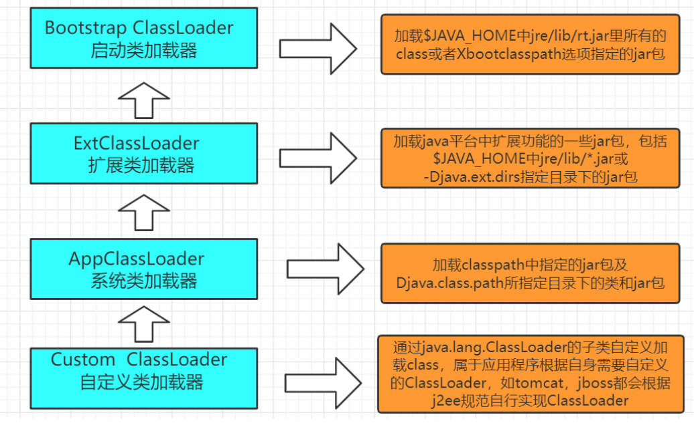
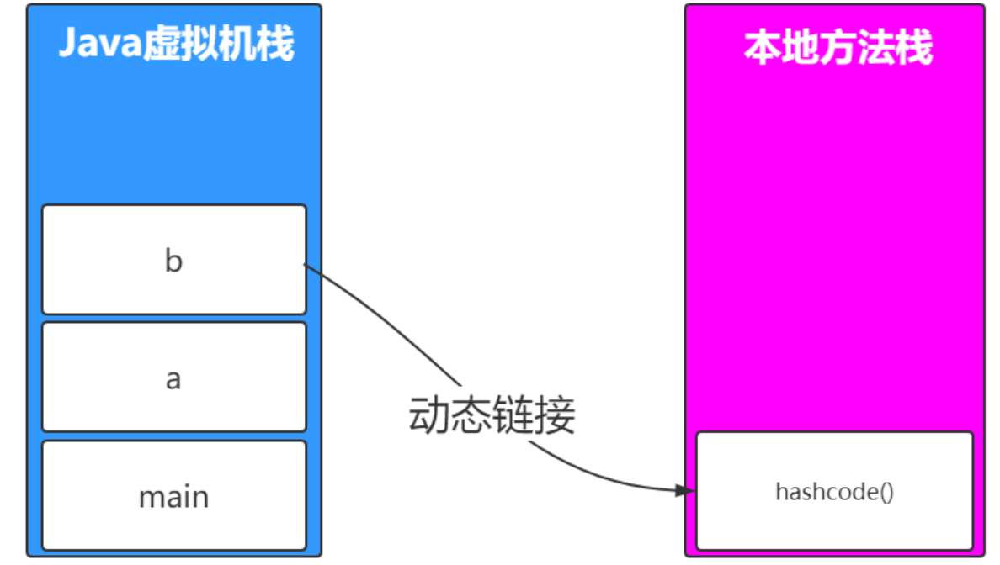
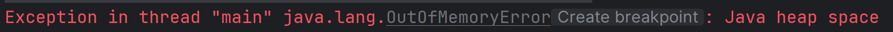
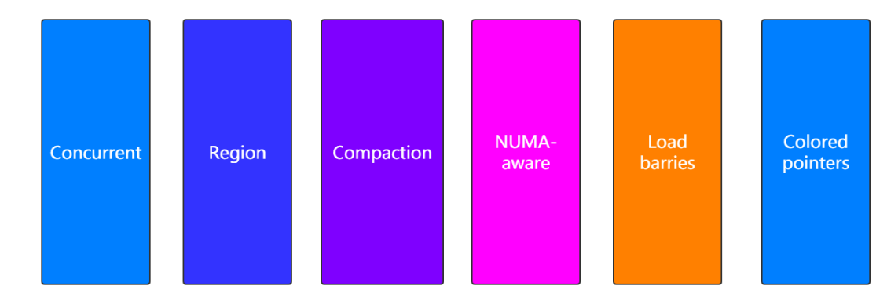

# 一、JVM之走进类加载

## 1.初始JVM

Java虚拟机（Java Virtual Machine）是运行所有Java应用程序的引擎，是Java平台的核心部分，提供了Java程序运行时的环境。JVM主要的功能是==允许Java程序能在任何设备或操作系统上运行==，实现了Java的“一次编写，到处运行”（==WORA==）的理念。


### （1）JVM、JDK、JRE关系


### （2）主要组成

- **类加载器（Class Loaders）**：负责从文件系统或网络中加载Class文件，Class文件在文件形式中是以字节码的形式存在，类加载器读取这些字节码并生成对应的类。
- **运行时数据区（Runtime Data Areas）**：当JVM运行Java程序时，它管理程序所需的内存。这包括堆（Heap）、栈（Stack）、方法区（Method Area）、程序计数器（Program Counter Register）和本地方法栈（Native Method Stack）。
- **垃圾回收器（Garbage collector）**：
- **执行引擎（Execution Engine）**：负责执行类文件中的指令。在早期的JVM中，执行引擎是纯解释器，但现在JVM采用即时编译（JIT）技术将热点代码编译为本地机器码提高效率。

### （3）学习路线

源文件到类文件，类文件到虚拟机，虚拟机内部处理，

## 2.源文件到类文件

### （1）javac

`javac` 是 Java 编译器的命令行工具，它是 Java 开发工具包（JDK）的一部分。`javac` 用于将 Java 程序源代码（以 `.java` 文件形式存在）转换成 Java 字节码（以 `.class` 文件形式存在），这些字节码可以被 Java 虚拟机（JVM）执行。

下面是一个Person.java源文件到类文件的流程示例

**源文件**

```java
package com.lxy;

class Person {
    private String name = "yzt";
    private int age;
    private final double salary = 100;
    private static String address;
    private final static String hobby = "Programming";
    private static Object obj = new Object();

    public void say() {
        System.out.println("person say...");
    }

    public static int calc(int op1, int op2) {
        op1 = 3;
        int result = op1 + op2;
        Object obj = new Object();
        return result;
    }

    public static void main(String[] args) {
        calc(1, 2);
    }
}
```

**编译：Person.java ---->Person.class**（==对等信息的转换==）

```
javac Person.java
```

**编译流程：**


1. **解析**：编译器读取源代码，将文本分解为标记，并构建出抽象语法树（AST），包括词法、语法分析。
2. **语义分析**：编译器对AST进行检查，确认代码逻辑（如数据类型和作用域）的正确性。
3. **生成字节码**：编译器将AST转换为平台无关的字节码，这些字节码随后可以在任何JVM上运行。

**类文件**

> Person.class为二进制文件，需要进行反编译以便于查看
>
> javap -v -p Person.class 进行反编译，查看字节码信息和指令等信息

```java
Classfile /E:/data/jvm_study_all/target/classes/com/lxy/Person.class
  Last modified 2024-5-9; size 1094 bytes
  MD5 checksum 0ae1d8db8e931e4329464f25b2893f05
  Compiled from "Person.java"
class com.lxy.Person
  minor version: 0
  major version: 51
  flags: ACC_SUPER
Constant pool:
   #1 = Methodref          #10.#46        // java/lang/Object."<init>":()V
   #2 = String             #47            // yzt
   #3 = Fieldref           #13.#48        // com/lxy/Person.name:Ljava/lang/String;
   #4 = Double             100.0d
   #6 = Fieldref           #13.#49        // com/lxy/Person.salary:D
   #7 = Fieldref           #50.#51        // java/lang/System.out:Ljava/io/PrintStream;
   #8 = String             #52            // person say...
   #9 = Methodref          #53.#54        // java/io/PrintStream.println:(Ljava/lang/String;)V
  #10 = Class              #55            // java/lang/Object
  #11 = Methodref          #13.#56        // com/lxy/Person.calc:(II)I
  #12 = Fieldref           #13.#57        // com/lxy/Person.obj:Ljava/lang/Object;
  #13 = Class              #58            // com/lxy/Person
  #14 = Utf8               name
  #15 = Utf8               Ljava/lang/String;
  #16 = Utf8               age
  #17 = Utf8               I
  #18 = Utf8               salary
  #19 = Utf8               D
  #20 = Utf8               ConstantValue
  #21 = Utf8               address
  #22 = Utf8               hobby
  #23 = String             #59            // Programming
  #24 = Utf8               obj
  #25 = Utf8               Ljava/lang/Object;
  #26 = Utf8               <init>
  #27 = Utf8               ()V
  #28 = Utf8               Code
  #29 = Utf8               LineNumberTable
  #30 = Utf8               LocalVariableTable
  #31 = Utf8               this
  #32 = Utf8               Lcom/lxy/Person;
  #33 = Utf8               say
  #34 = Utf8               calc
  #35 = Utf8               (II)I
  #36 = Utf8               op1
  #37 = Utf8               op2
  #38 = Utf8               result
  #39 = Utf8               main
  #40 = Utf8               ([Ljava/lang/String;)V
  #41 = Utf8               args
  #42 = Utf8               [Ljava/lang/String;
  #43 = Utf8               <clinit>
  #44 = Utf8               SourceFile
  #45 = Utf8               Person.java
  #46 = NameAndType        #26:#27        // "<init>":()V
  #47 = Utf8               yzt
  #48 = NameAndType        #14:#15        // name:Ljava/lang/String;
  #49 = NameAndType        #18:#19        // salary:D
  #50 = Class              #60            // java/lang/System
  #51 = NameAndType        #61:#62        // out:Ljava/io/PrintStream;
  #52 = Utf8               person say...
  #53 = Class              #63            // java/io/PrintStream
  #54 = NameAndType        #64:#65        // println:(Ljava/lang/String;)V
  #55 = Utf8               java/lang/Object
  #56 = NameAndType        #34:#35        // calc:(II)I
  #57 = NameAndType        #24:#25        // obj:Ljava/lang/Object;
  #58 = Utf8               com/lxy/Person
  #59 = Utf8               Programming
  #60 = Utf8               java/lang/System
  #61 = Utf8               out
  #62 = Utf8               Ljava/io/PrintStream;
  #63 = Utf8               java/io/PrintStream
  #64 = Utf8               println
  #65 = Utf8               (Ljava/lang/String;)V
{
  private java.lang.String name;
    descriptor: Ljava/lang/String;
    flags: ACC_PRIVATE

  private int age;
    descriptor: I
    flags: ACC_PRIVATE

  private final double salary;
    descriptor: D
    flags: ACC_PRIVATE, ACC_FINAL
    ConstantValue: double 100.0d

  private static java.lang.String address;
    descriptor: Ljava/lang/String;
    flags: ACC_PRIVATE, ACC_STATIC

  private static final java.lang.String hobby;
    descriptor: Ljava/lang/String;
    flags: ACC_PRIVATE, ACC_STATIC, ACC_FINAL
    ConstantValue: String Programming

  private static java.lang.Object obj;
    descriptor: Ljava/lang/Object;
    flags: ACC_PRIVATE, ACC_STATIC

  com.lxy.Person();
    descriptor: ()V
    flags:
    Code:
      stack=3, locals=1, args_size=1
         0: aload_0
         1: invokespecial #1                  // Method java/lang/Object."<init>":()V
         4: aload_0
         5: ldc           #2                  // String yzt
         7: putfield      #3                  // Field name:Ljava/lang/String;
        10: aload_0
        11: ldc2_w        #4                  // double 100.0d
        14: putfield      #6                  // Field salary:D
        17: return
      LineNumberTable:
        line 3: 0
        line 4: 4
        line 6: 10
      LocalVariableTable:
        Start  Length  Slot  Name   Signature
            0      18     0  this   Lcom/lxy/Person;

  public void say();
    descriptor: ()V
    flags: ACC_PUBLIC
    Code:
      stack=2, locals=1, args_size=1
         0: getstatic     #7                  // Field java/lang/System.out:Ljava/io/PrintStream;
         3: ldc           #8                  // String person say...
         5: invokevirtual #9                  // Method java/io/PrintStream.println:(Ljava/lang/String;)V
         8: return
      LineNumberTable:
        line 12: 0
        line 13: 8
      LocalVariableTable:
        Start  Length  Slot  Name   Signature
            0       9     0  this   Lcom/lxy/Person;

  public static int calc(int, int);
    descriptor: (II)I
    flags: ACC_PUBLIC, ACC_STATIC
    Code:
      stack=2, locals=4, args_size=2
         0: iconst_3
         1: istore_0
         2: iload_0
         3: iload_1
         4: iadd
         5: istore_2
         6: new           #10                 // class java/lang/Object
         9: dup
        10: invokespecial #1                  // Method java/lang/Object."<init>":()V
        13: astore_3
        14: iload_2
        15: ireturn
      LineNumberTable:
        line 16: 0
        line 17: 2
        line 18: 6
        line 19: 14
      LocalVariableTable:
        Start  Length  Slot  Name   Signature
            0      16     0   op1   I
            0      16     1   op2   I
            6      10     2 result   I
           14       2     3   obj   Ljava/lang/Object;

  public static void main(java.lang.String[]);
    descriptor: ([Ljava/lang/String;)V
    flags: ACC_PUBLIC, ACC_STATIC
    Code:
      stack=2, locals=1, args_size=1
         0: iconst_1
         1: iconst_2
         2: invokestatic  #11                 // Method calc:(II)I
         5: pop
         6: return
      LineNumberTable:
        line 23: 0
        line 24: 6
      LocalVariableTable:
        Start  Length  Slot  Name   Signature
            0       7     0  args   [Ljava/lang/String;

  static {};
    descriptor: ()V
    flags: ACC_STATIC
    Code:
      stack=2, locals=0, args_size=0
         0: new           #10                 // class java/lang/Object
         3: dup
         4: invokespecial #1                  // Method java/lang/Object."<init>":()V
         7: putstatic     #12                 // Field obj:Ljava/lang/Object;
        10: return
      LineNumberTable:
        line 9: 0
}
SourceFile: "Person.java"
```

### （2）.class文件

**The `ClassFile` Structure**

> 官网：[Chapter 4. The class File Format (oracle.com)](https://docs.oracle.com/javase/specs/jvms/se8/html/jvms-4.html)

```java
ClassFile {
    u4             magic;
    u2             minor_version;
    u2             major_version;
    u2             constant_pool_count;
    cp_info        constant_pool[constant_pool_count-1];
    u2             access_flags;
    u2             this_class;
    u2             super_class;
    u2             interfaces_count;
    u2             interfaces[interfaces_count];
    u2             fields_count;
    field_info     fields[fields_count];
    u2             methods_count;
    method_info    methods[methods_count];
    u2             attributes_count;
    attribute_info attributes[attributes_count];
}
```

- **magic**：这是一个固定的4字节（`u4`）魔数，对于所有的`.class`文件，这个值都是`0xCAFEBABE`，用于确认文件是否为有效的Java类文件。
- **minor_version 和 major_version**：这两个部分定义了类文件的版本。`minor_version` 是次要版本号，`major_version` 是主要版本号。它们共同决定了这个类文件被哪个版本的JVM支持。
- **constant_pool_count 和 constant_pool**：常量池入口的数量和常量池数组。常量池是类文件结构中的一个重要部分，存储了各种==字面量（字符串、final修饰数字）==和对类型、字段和方法的==符号引用==。`constant_pool_count` 指定了常量池数组中，常量池项的数量，实际数量比这个值小1。
- **access_flags**：访问标志，这是一组标志用来识别一些类或接口级别的访问信息，如这个类是类还是接口，是否为`public`，是否为`abstract`等。
- **this_class 和 super_class**：这两个字段分别提供了当前类和其直接超类在常量池中的索引。`this_class` 指向常量池中一个表示当前类名的`Class`类型的常量，`super_class` 对应的是其直接父类的名称。
- **interfaces_count 和 interfaces**：接口计数和接口数组，指出类实现的接口数量和提供对常量池的索引，常量池中存储了每个接口的全限定名。
- **fields_count 和 fields**：字段计数和字段数组，这些字段包含了类中声明的变量，包括其名称、类型和其他修饰符。
- **methods_count 和 methods**：方法计数和方法数组，这里列出了类中定义的所有方法，包括方法名、返回类型、参数、访问控制和其他信息。
- **attributes_count 和 attributes**：属性计数和属性数组，属性部分在类文件中扮演重要角色，它包含了诸如源码文件名、行号信息、局部变量表等额外信息，这些信息主要用于调试、编译器设计等用途。


我们可以看到JVM和.class文件的设计精妙地将程序的开发和部署环境分离开来，使得Java程序具有很高的可移植性和平台独立性。==JVM相对于.class文件就像操作系统相对于汇编语言或机器语言==。

## 3.类文件到虚拟机

### （1）类加载机制

类加载机制是Java中的一种核心机制，用于==将类的字节码文件中的数据读入到内存中，并生成一个数据访问入口==。这个机制不仅涉及到类的加载，还包括类的链接和初始化等过程。类加载的最终产物是在JVM内存中创建的类实例的访问入口（`Class`类实例），这使得Java程序能够执行类中定义的代码和操作类的数据。

类加载核心过程如下：

1. **加载**：**虚拟机把Class文件加载到内存**，这涉及从各种来源（如文件系统、网络、归档文件等）读取`.class`文件。
2. **校验**：**对数据进行校验**确保加载的Class文件符合JVM规范，没有安全问题。
3. **转换解析和初始化**：将类文件中的符号引用转换为直接引用。对类变量进行初始化，执行静态代码块等。
4. **形成可以虚拟机直接使用的Java类型**：最终产物是在JVM内存中生成的`java.lang.Class`对象，这个对象代表了加载的类，并提供了操作该类的各种方法。


Java的类加载机制提供多种方式来加载`.class`文件，适应于不同的运行环境和需求。以下是几种常见的类加载方法及其典型应用场景：

1. **从本地系统直接加载**
   - **应用场景**：桌面应用或服务器端应用。
   - **描述**：最常见的方式，从类路径指定的目录中直接读取`.class`文件。

2. **通过网络下载`.class`文件**
   - **应用场景**：已经较少使用的Web Applet。
   - **描述**：从服务器通过网络下载到客户端并执行。

3. **从ZIP，JAR等归档文件中加载**
   - **应用场景**：JAR、WAR格式的企业应用。
   - **描述**：从归档文件如JAR中读取`.class`文件，便于分发和使用。

4. **从专有数据库中提取`.class`文件**
   - **应用场景**：大型企业环境中的某些JSP应用。
   - **描述**：从数据库中查询和加载`.class`文件，适用于代码分发和版本控制严格的环境。

5. **将Java源文件动态编译为`.class`文件**
   - **应用场景**：动态代理和运行时代码生成。
   - **描述**：在运行时将源代码编译成`.class`文件，通常用于生成代理类。

6. **从加密文件中获取`.class`文件**
   - **应用场景**：防止反编译的软件保护。
   - **描述**：`.class`文件被加密，加载时需先解密，增强安全性。

### （2）类加载总流程

==Java类的生命周期==可以概括为五个阶段：加载（Load）、链接（Link）、初始化（Initialize）、使用（Use）和卸载（Unload）。类加载过程主要涉及前三个阶段，这些阶段是类从被发现到准备好被JVM使用的关键转换步骤。


#### 装载(Load)

> 查找并导入字节码文件

##### 1. 查找字节码文件转换为字节流
这个步骤主要由==类加载器==完成，它们通过使用==类的全限定名==（包括类的包名和类名，如`com.example.MyClass`）来查找类。类加载器根据全限定名从不同的来源获取类的定义，这些来源于上述类加载方式。

##### 2. 字节流转换为运行时数据结构
一旦类加载器找到并加载了类的二进制数据，它接着需要==从静态存储结构到运行时数据结构==，将二进制字节流转化为JVM的==方法区==的运行时数据结构。这包括了==类信息，静态变量，常量==等。

##### 3. 生成java.lang.Class对象
在Java==堆上==生成一个代表该类的`java.lang.Class`对象。这个对象作为程序员在Java代码中访问类的字段、方法、构造器等反射信息的入口。

获取类的二进制字节流的阶段确实是Java程序员可以大展拳脚的一个阶段。在这个阶段，程序员通过==自定义类加载器==可以实现多种灵活的加载策略，从而控制类的加载方式和来源。

#### 链接（Link）

##### 验证（Verify）

验证阶段主要确保加载的Class文件的字节流完全==符合当前虚拟机的要求，并且不会危害虚拟机的安全性==。这个阶段包括以下几个核心验证过程：

- **文件格式验证**：检查字节流是否符合Class文件格式规范，确保它可以被当前版本的虚拟机正确处理。这包括验证文件是否以`0xCAFEBABE`开头，以及版本号是否被虚拟机支持。
- **元数据验证**：对类的元数据进行校验，确保没有违反Java语法规范的情况，例如检查类是否非法地继承了final类。
- **字节码验证**：通过数据流和控制流分析，验证方法体的程序逻辑是否合法且安全。这包括确保字节码操作不会导致虚拟机执行不安全的操作，检查跳转指令是否指向有效位置，以及验证栈操作的数据类型与操作码参数是否匹配。
- **符号引用验证**：在虚拟机解析符号引用成直接引用时进行，确保常量池中的符号引用所指向的类、方法和字段是可访问的，并具备相应的访问权限。

注意，虽然验证通常被视为类加载过程中链接阶段的一部分，实际上它在整个类加载过程中都起着关键作用：

- **文件格式验证**：这一步通常在类文件被加载到内存之前就已经开始，即在装载阶段。它确保类文件符合基本的存储格式，如检查文件是否以`0xCAFEBABE`开头。
- **符号引用验证**：这部分验证则是在类的链接阶段的解析步骤中进行，确保所有的符号引用都可以正确地解析到具体的类、方法和字段上。

并且Java虚拟机提供了一定的灵活性，允许开发者通过启动参数来控制验证的行为：

- **-Xverify:none**：这个参数可以关闭类加载时的验证步骤。这通常在开发和测试阶段用于提高性能，因为跳过验证可以减少类加载的时间。然而，这可能会增加运行时错误的风险，因为没有执行完整的验证可能导致一些不符合规范的类被加载到JVM中。

##### 准备（Prepare）

在类的加载过程中的准备阶段，Java虚拟机为类的静态变量分配内存，并将其初始化为类型的默认值。这个阶段的特点包括：

1. **静态变量分配内存**：==静态变量（也称为类变量）被分配在方法区中==。这些变量是类级别的，与类的任何实例无关，共享于类的所有实例之间。
2. **默认初始化**：==静态变量在此阶段被初始化为默认值==。例如，数值类型（如int、float）初始化为0或0.0，引用类型（如对象引用）初始化为`null`。
   - ==注意==：`final`修饰的静态变量由于在编译时就已确定其字面量值，因此在准备阶段会直接赋予这些值，而不是默认值。实例变量不在此阶段处理。它们是随对象一起在堆中分配，并在对象构造时根据构造方法或初始化块中的指令被初始化。

**示例说明**

提供的两个示例很好地说明了准备阶段对静态变量和局部变量的不同处理：

```java
public class Demo1 {
    private static int i;
    public static void main(String[] args) {
        // 正常打印出0，因为静态变量i在准备阶段会有默认值0
        System.out.println(i);
    }
}
public class Demo2 {
    public static void main(String[] args) {
        // 编译通不过，因为局部变量没有赋值不能被使用
        int i;
        System.out.println(i);
    }
}
```

- **示例 1**（`Demo1`）展示了一个静态变量`i`，在准备阶段被自动初始化为0，因此当它被访问时，即使没有显式赋值，也能打印出其默认值0。
- **示例 2**（`Demo2`）中的局部变量`i`没有初始化，Java不允许使用未初始化的局部变量，因此这段代码无法编译通过。

对于一些特殊情况，如果类字段属性表中存在ConstantValue属性，那在准备阶段变量就会被初始化为ContstantValue属性所指的值。对于这句话，我们又怎么理解呢？

`ConstantValue`属性是类文件中字段的一个可选固定属性，它用于指定字段的常量值。这个属性只适用于静态变量（==static修饰==的变量），并且通常与==final修饰符==一起使用，用于==基本类型==和==String类型==的字段。当字段在Java源代码中被声明为final且直接初始化为一个编译时常量表达式时，编译器会自动为该字段生成`ConstantValue`属性。

在Java程序中，使用`ConstantValue`属性的情况通常涉及到被`static`和`final`修饰的基本数据类型或String类型的字段。例如：

```java
public class Demo {
    private static final int a = 1;
    private static final String greeting = "Hello";
}
```

在==类加载的准备阶段==，JVM会读取这些字段的`ConstantValue`属性，并使用该属性指定的值来==初始化对应的静态变量==。这意味着：

- 对于`int`类型的`a`，即使其默认初始化值为0，由于存在`ConstantValue`属性，它会被立即初始化为1。
- 同理，`String`类型的`greeting`会被初始化为"Hello"。

`ConstantValue`属性只适用于基本类型和String类型的原因是，这些类型的值可以在==编译时完全确定==，并且可以直接==存储在常量池==中。这使得JVM能够在类加载时快速地将这些预定义的、不变的值赋给相应的字段。

##### 解析（Resolve）

在这个阶段中，JVM 将常量池中==符号引用转换直接引用==

- **符号引用**是一种抽象的、不依赖于虚拟机内存布局和实现的引用方式，主要存储在常量池中。
- **直接引用**是具体的、直接指向目标的引用，它可以是指向内存中对象的指针、相对偏移量或一个能间接定位到目标的句柄。

JVM通常会==缓存首次解析的结果==，以避免重复解析带来的性能损耗。如果一个符号引用已经被成功解析，那么后续对该符号引用的解析应保证成功；反之，如果首次解析失败，后续的解析也应抛出同样的异常。

**invokedynamic (indy)** 指令是Java 7中引入的，用于==支持Java的动态语言特性==，Java 8中它被广泛应用于lambda表达式的实现。与其他的方法调用指令（如invokevirtual、invokestatic等）不同，invokedynamic不在类加载时就确定调用的具体方法，而是允许开发者在运行时动态指定方法版本。 **invokedynamic (indy)** 指令可以从某种角度上被视为一种实现多态的机制。

#### 初始化（Initialize）

初始化阶段的目的是为==类变量赋予程序员设定的具体初始值，以及执行静态代码块中的语句==。这个过程确保类的静态状态符合逻辑和预期，为类的后续使用做好准备。

**类变量初始化的两种方式**

1. **在声明时指定初始值**：这是最直观的初始化方式，直接在静态变量声明时赋值。

   ```java
   public class MyClass {
       public static int value = 10;
   }
   ```

2. **使用静态代码块**：静态代码块提供了一个在类加载时执行初始化代码的机会。它通常用于初始化那些不能在声明时直接赋初值的复杂静态变量。

   ```java
   public class MyClass {
       public static int value;
       static {
           value = calculateInitialValue();
       }
       private static int calculateInitialValue() {
           // 复杂的初始化逻辑
           return 10;
       }
   }
   ```

**==注意静态变量和静态代码块的顺序==**：在Java中，静态变量和静态代码块的执行顺序非常重要，因为它们按照在代码中的出现顺序执行。如果静态代码块在一个静态变量之前，并试图访问那个变量，那么它可能访问到的是那个变量的默认初始化值，而不是预期的赋值。关键是理解"默认初始化"（在准备阶段）和"显式初始化"（在初始化阶段）之间的区别。

**具体步骤**

1. **加载和链接**：如果类还未被加载和链接，那么JVM首先会完成这些步骤。
2. **父类初始化**：根据Java的初始化规则，如果类有父类，且父类还没有被初始化，那么JVM会先初始化父类。这是因为子类的行为可能依赖于父类的状态。
3. **执行初始化语句**：类中定义的所有静态初始化器（static块）和静态变量的赋值语句将被执行。这些语句按照它们在类中出现的顺序执行。

#### 使用（Use）

==类的初始化只在“主动引用”时被触发，而“被动引用”则不会导致类的初始化==。

**主动引用**

主动引用是指直接导致Java类初始化的操作。这些操作确保Java类在任何被使用前已经完全初始化。以下是触发类初始化的主要情况：

1. **创建类的实例**：使用`new`关键字实例化一个类时，Java虚拟机会初始化这个类。
2. **访问或设置类的静态变量**：除了直接定义为`final`的静态变量之外，访问或赋值一个类的静态变量会触发这个类的初始化。
3. **调用类的静态方法**：调用类的任何静态方法时，该类会被初始化。
4. **反射**：使用`Class.forName("com.example.Test")`这类反射方法会触发类的初始化。
5. **初始化子类**：如果一个类是另一个类的子类，初始化子类将首先触发父类的初始化。
6. **JVM启动类**：如果一个类是启动应用时的主类（即包含`main`方法的类），JVM会首先初始化这个类。

**被动引用**

被动引用不会触发类的初始化。以下是一些常见的被动引用情况：

1. **访问静态字段，只触发父类初始化**：如果通过子类引用父类的静态字段，只有父类会被初始化，子类不会。
2. **定义类的数组**：定义引用类的数组不会触发该类的初始化，因为数组实际上是由JVM在运行时动态生成的，代表数组的类称为“[Lcom.example.Test;”这样的形式。
3. **引用静态常量**：引用由`static final`修饰且在编译时就确定下来的基本类型或字符串直接量的静态字段，不会触发类的初始化。这是因为这样的常量值在编译时就已经存入调用类的常量池中了。

#### 卸载（unload）

**类的卸载条件**

1. **实例已经被回收**：这意味着该类的所有实例都已经不再被引用，因此已经被垃圾回收器回收。没有任何活跃的实例，这是类卸载的先决条件。
2. **类加载器已经被回收**：类是由类加载器加载的，因此类的生命周期与其类加载器紧密相关。如果加载该类的类加载器本身被回收了（即没有任何引用指向这个类加载器），则这个类加载器加载的所有类都有可能被卸载。
3. **Class对象不再被引用**：每个类在JVM中都有一个`java.lang.Class`对象与之对应，它包含了类的元数据，提供了反射的入口。如果这个Class对象本身不再被任何引用（比如不被变量引用、不在任何对象的字段中、不在任何集合对象中等），并且不能通过反射访问该类，那么这个类就可能被卸载。

**为什么类不易被卸载**

1. **类加载器的生命周期**：通常，特别是对于启动类加载器（Bootstrap ClassLoader）和扩展类加载器（Extension ClassLoader），它们由JVM直接管理，并在JVM的整个生命周期内持续活跃。因此，这些类加载器加载的类几乎永远不会被卸载。
2. **Class对象的广泛引用**：在Java应用中，很多地方都可能通过反射持有Class对象的引用，这使得Class对象很难达到“无引用”的状态。

### （3）类加载器

类加载器的主要职责是，根据指定的类名，找到其对应的字节码，读取这些数据，并将其转换成在JVM内部可以使用的`java.lang.Class`对象。这个过程包括解析二进制字节流数据并为之在JVM的方法区分配内存。

每个类加载器，从根本上说，都拥有自己的命名空间。命名空间由该加载器及其所有父加载器所加载的类组成。在同一个命名空间中，不会出现两个同名的类。因此，==类加载器可以确定类在JVM中的唯一性==，由类加载器实例和类的全限定名共同确定。

#### 分类



**1. Bootstrap ClassLoader（启动类加载器）**

- **职责**：负责加载 JVM 基础核心类库，如 `$JAVA_HOME/jre/lib/rt.jar`、`charsets.jar` 等。
- **实现方式**：此加载器由 C++ 实现，并不继承自 `java.lang.ClassLoader`。这意味着它不是一个 Java 对象，而是 JVM 自身的一部分。
- **特点**：它不是 `ClassLoader` 的子类，因此在 Java 应用程序中不能直接引用它。

**2. Extension ClassLoader（扩展类加载器）**

- **职责**：负责加载 Java 的扩展库，包括 `$JAVA_HOME/jre/lib/ext` 目录下的所有 JAR 包，或者通过 `-Djava.ext.dirs` 系统属性指定的目录下的 JAR 包。
- **实现方式**：这是 `ClassLoader` 的子类，由 Java 实现。
- **用途**：它扩展了 Java 标准核心库之外的功能，允许包括服务提供者接口（SPI）等机制的库被加载进 JVM。

**3. App ClassLoader（应用类加载器）**

- **职责**：负责加载用户类路径（Classpath）上指定的类库，这包括由环境变量 `CLASSPATH` 或 `-Djava.class.path` 指定的 JAR 文件和类路径。
- **实现方式**：这也是 `ClassLoader` 的子类，由 Java 实现。
- **特点**：这是默认的类加载器，通常用来加载用户定义的类。

**4. Custom ClassLoader（自定义类加载器）**

- **职责**：由应用开发者根据具体需要实现的类加载器，用于特定场景，如加载网络上的资源，实现热部署等。
- **实现方式**：通过继承 `java.lang.ClassLoader` 并重写 `findClass` 方法等，实现特定的加载逻辑。
- **用途**：使得Java应用能够以非标准方式加载类，如从非标准来源加载类或按需隔离类加载等。

这种结构不仅帮助保护Java平台的核心API不被恶意代码覆盖或篡改，还提供了一种有效的方式来维持不同来源代码之间的隔离性，从而增强了应用的安全性和稳定性。

如果只有一个类加载器，用户可以通过定义与Java核心类同名的类（例如`java.lang.String`）来覆盖标准的Java类库。这样做可能会导致严重的安全漏洞，因为恶意代码可以改变或替代标准库的行为。通过引入分层的类加载器，JVM能够==确保核心库的类总是由启动类加载器（Bootstrap ClassLoader）加载，该加载器不会加载任何来自用户定义路径的类==。

使用分层类加载器可以==实现代码之间的隔离==。例如，应用服务器可以为每个部署的应用程序使用一个单独的类加载器，这样每个应用就可以使用特定版本的库而不会与服务器上运行的其他应用程序冲突。这对于管理和维护大型系统至关重要，可以防止库版本的冲突问题。 

有了分层的类加载器，可以更灵活地加载和卸载特定的代码库。这在需要==热部署==应用组件的环境中非常有用，即在不停止和重启应用服务器的情况下更新应用程序的功能。

#### 三种特性

**全盘负责机制（Full Responsibility）**

全盘负责机制确保当一个类加载器负责加载某个类时，==所有该类依赖和引用的其他类也将由同一个类加载器加载==，除非显式指定另一个类加载器进行加载。这意味着一旦类加载器开始加载类，它也将负责加载该类引用的所有其他类。这种策略有助于保持类加载的一致性，确保不会由于类的来源不同导致的潜在冲突。

**双亲委派模型（Parent Delegation Model）**

双亲委派模型是一种类加载顺序，保证了Java核心库的类不会被第三方类覆盖。这个机制的工作流程如下：

1. **类缓存检查**：类加载器首先检查是否已经加载了请求的类，以优化性能并避免重复加载。
2. ==**递归向上委托**==：如果类未加载，类加载器会将加载任务委托给其父类加载器。这个过程会一直递归向上，直到达到顶层的启动类加载器（Bootstrap ClassLoader）。
3. ==**尝试加载类**==：从顶层开始，每层类加载器将尝试在自己的类路径下查找并加载类。如果顶层加载器无法加载该类，加载任务就会依次向下传递回原请求的加载器。


**缓存**

Java类加载器将所有加载过的类缓存在内存中，这提高了类加载的效率，避免了重复加载的性能损耗。当程序尝试加载类时，类加载器会先从缓存中查找。

如果类文件被修改，只有重启JVM后修改才会生效，因为只有在JVM启动时，==修改后的类文件才会重新加载进内存==。这是因为一旦类被加载进内存，它将不会被自动更新，即使底层的文件发生了变化。

#### 打破双亲委派

双亲委派模型虽然为Java类加载带来了诸多好处，如安全性和Java核心库的一致性，但它也有其局限性，特别是在现代Java应用中，需要更灵活的类加载机制来支持各种运行时的动态功能。

**1. SPI（Service Provider Interface）**

SPI 是一种==服务发现机制==。它==允许Java核心库查询和加载服务或驱动而无需关心服务提供者的具体实现==。这种机制非常适合于那些由第三方提供具体实现的接口，如 JDBC。

- **工作原理**：Java核心库定义了一系列的接口和预期的行为（如 `java.sql.Driver`），而服务提供者实现这些接口并将它们的实现类的全限定名注册到 `META-INF/services` 下的一个特定服务的配置文件中。在运行时，Java的 `ServiceLoader` 类可以加载这些配置文件，发现并实例化这些服务的实现，而开发者只需面向接口编程。

**2. OSGi（Open Service Gateway Initiative）**

OSGi 是一个创建模块化应用的框架，其核心是一个动态的组件模型。==不同的应用或应用组件可以被分为不同的模块（称为bundle），每个模块可以有自己的类加载器==。

- **模块化和热部署**：在 OSGi 环境中，每个 bundle 由自己的类加载器加载，这允许单独更新、安装或卸载任何一个 bundle，而不影响系统的其它部分。这种方式提供了真正的模块化和动态更新功能，支持热部署和热替换。
- **类加载器的自定义实现**：OSGi中每个bundle的类加载器负责管理那个bundle的类加载请求。它们不遵循传统的双亲委派模型，而是根据需要在bundle间进行类查找和加载，增加了加载过程的复杂性但提高了模块间的隔离性。

类加载的源码分析，如果想破坏双亲委派模型，可以重写loadClass(name)方法。

```java
protected Class<?> loadClass(String name, boolean resolve)
        throws ClassNotFoundException
    {
        synchronized (getClassLoadingLock(name)) {
            // First, check if the class has already been loaded
            Class<?> c = findLoadedClass(name);
            if (c == null) {
                long t0 = System.nanoTime();
                try {
                    if (parent != null) {
                        c = parent.loadClass(name, false);
                    } else {
                        c = findBootstrapClassOrNull(name);
                    }
                } catch (ClassNotFoundException e) {
                    // ClassNotFoundException thrown if class not found
                    // from the non-null parent class loader
                }

                if (c == null) {
                    // If still not found, then invoke findClass in order
                    // to find the class.
                    long t1 = System.nanoTime();
                    c = findClass(name);

                    // this is the defining class loader; record the stats
                    sun.misc.PerfCounter.getParentDelegationTime().addTime(t1 - t0);
                    sun.misc.PerfCounter.getFindClassTime().addElapsedTimeFrom(t1);
                    sun.misc.PerfCounter.getFindClasses().increment();
                }
            }
            if (resolve) {
                resolveClass(c);
            }
            return c;
        }
    }
```

#### 自定义类加载器

**类的全限定名的使用**

自定义类加载器需要使用类的全限定名称来正确地定位和加载类文件。这是因为 `defineClass` 方法，核心方法之一，用于将字节码转换为 `Class` 对象，要求提供的类名必须是包括包路径的全名，例如 `com.example.Test`。如果提供的是相对路径或简单类名，必须转换为全路径。这通常涉及到配置或计算类文件的基础目录，并将其与类名结合，形成类文件的完整路径。

**避免重写 `loadClass` 方法**

通常建议不重写 `loadClass` 方法，以保留双亲委派模型的完整性。双亲委派模型确保类加载的顺序性和安全性，防止类被不当地重载。如果需要实现特定的加载逻辑（如加载加密的类文件），应重写 `findClass` 方法而非 `loadClass`。这样，只有当父类加载器无法加载类时，自定义的加载逻辑才会被调用。

**避免将可加载类放在类路径下**

如果 `Test` 类放在标准类路径下，由于双亲委派机制，系统类加载器（`AppClassLoader`）将优先加载它，而不会使用到自定义类加载器。这可能导致预期之外的行为，特别是当您希望通过自定义类加载器来处理特定的加载逻辑时。将测试类或特定逻辑处理的类放在一个独立于标准类路径的位置，可以确保这些类只通过自定义类加载器加载，实现了类的隔离和特殊处理。

**示例**

```java
package com.example.jvmcase.loader;

import java.io.*;

public class MyClassLoader extends ClassLoader {
    private String root;

    @Override
    protected Class<?> findClass(String name) throws ClassNotFoundException {
        byte[] classData = loadClassData(name);
        if (classData == null) {
            throw new ClassNotFoundException("Could not find class: " + name);
        }
        // 将二进制字节码转换为Class对象
        return defineClass(name, classData, 0, classData.length);
    }

    private byte[] loadClassData(String className) {
        // 转换类名到文件路径
        String fileName = root + File.separatorChar + className.replace('.', File.separatorChar) + ".class";
        try (InputStream ins = new FileInputStream(fileName);
             ByteArrayOutputStream baos = new ByteArrayOutputStream()) {
            byte[] buffer = new byte[1024];
            int length;
            while ((length = ins.read(buffer)) != -1) {
                baos.write(buffer, 0, length);
            }
            return baos.toByteArray();
        } catch (IOException e) {
            e.printStackTrace();
        }
        return null;
    }

    public String getRoot() {
        return root;
    }

    public void setRoot(String root) {
        this.root = root;
    }

    public static void main(String[] args) {
        MyClassLoader classLoader = new MyClassLoader();
        // 设置类加载器的根目录
        classLoader.setRoot("D:\\path\\to\\classes");

        try {
            // 使用自定义类加载器加载Test类
            Class<?> testClass = classLoader.loadClass("com.example.Test");
            System.out.println(testClass);

            // 创建Test类的实例并打印类加载器信息
            Object object = testClass.newInstance();
            System.out.println(object.getClass().getClassLoader());
        } catch (ClassNotFoundException | InstantiationException | IllegalAccessException e) {
            e.printStackTrace();
        }
    }
}

```

# 二、深入运行时数据区

## 1.定义

> `官网`：[https://docs.oracle.com/javase/specs/jvms/se8/html/index.html](https://docs.oracle.com/javase/specs/jvms/se8/html/index.html)

The Java Virtual Machine defines various run-time data areas that are used during execution of a program. Some of these data areas are created on Java Virtual Machine start-up and are destroyed only when the Java Virtual Machine exits. Other data areas are per thread. Per-thread data areas are created when a thread is created and destroyed when the thread exits.

在Java虚拟机（JVM）的类装载过程中，类文件的装载涉及到多个关键的运行时数据区，这些数据区在JVM中扮演着存储和处理类信息的关键角色。

- 当类装载器读取类文件（一个二进制数据流）时，它首先将这些==静态数据转换为方法区中的运行时数据结构==。方法区（非堆）是JVM中用于==存储已被虚拟机加载的类信息、运行时常量池、静态变量、即时编译器编译后的代码==的内存区域。
- 每当JVM装载一个类时，都会在==堆内存==中创建一个`java.lang.Class`类实例，用来表示这个类。这个Class对象包含了类的元数据，==提供了程序运行时访问类的能力==。

因此对于运行时数据区的深入了解是必要的。

## 2.结构（规范）


- 方法区（Method Area）：方法区（非堆）是用于==存储每个类的结构信息==的区域，方法区是由所有==线程共享==的。
- 堆（Heap）：堆是JVM管理的最大的一块内存区域，它被所有==线程共享==。堆是Java虚拟机管理的内存中用于==存储对象实例和数组==的主要区域。堆是垃圾收集器管理的主要区域，也称为GC堆（Garbage Collected Heap）。
- 虚拟机栈（Java Virtual Machine Stacks）：==每个Java线程都有自己的虚拟机栈，这个栈与线程同时创建==。虚拟机栈描述了Java方法执行的内存模型：==每个方法在执行的同时都会创建一个栈帧==用于==存储局部变量表、操作数栈、动态链接信息以及方法出口==等信息。每个方法从调用直至执行完毕的过程，就对应着一个栈帧在虚拟机栈中入栈到出栈的过程。
- 本地方法栈（Native Method Stacks）：本地方法栈与虚拟机栈非常相似，差别在于虚拟机栈为虚拟机执行Java方法（也就是字节码）服务，而本地方法栈则用于支持JVM使用到的本地方法（即Native方法）。本地方法是使用C语言或其他语言实现的方法，不在JVM的管理范畴之内，但可以通过JNI（Java Native Interface）被调用。
- 程序计数器（Program Counter Register）：程序计数器是一块较小的内存空间，它可以看作是当前线程所执行的字节码的行号指示器。在JVM的执行过程中，控制权需要不断地在线程之间切换，每个线程都需要一个独立的程序计数器，各线程之间计数器互不影响，独立存储，以保证线程切换后能恢复到正确的执行位置。

## 3.各区域的补充说明

### （1）方法区的具体实现

JVM规范对方法区的具体实现没有强制要求，这允许不同的JVM实现可以根据自己的优化需求来选择最适合的方法区实现。

#### JDK 6和7中的永久代（PermGen）

在JDK 6和JDK 7中，方法区的实现是通过一个称为==永久代（Permanent Generation，简称PermGen）==的内存区域来实现的。==永久代是堆内存的一部分==，它用于存储JVM加载的类和其他相关的元数据。

动态扩容：==永久代有一个固定的大小上限==，这可能导致一些问题，特别是在大量使用动态生成类的应用中，很容易遇到==永久代空间不足的问题==。

垃圾回收：当永久代满时，会触发Full GC来清理不再使用的类和其他元数据。由于涉及堆的压缩和整理，这会==增加垃圾回收的时间，并可能导致应用暂停==。

通过`-XX:PermSize`和`-XX:MaxPermSize`设置初始和最大值。

#### JDK 8中的元空间（Metaspace）

从JDK 8开始，Oracle的JVM实现去掉了永久代，引入了==元空间（Metaspace）==来代替。==元空间并不在虚拟机的堆内，而是使用本地内存（也称为非堆内存）==。这样做的主要目的是为了==避免固定大小的永久代带来的内存溢出问题==，以及为了更好地支持不同语言的动态性（如Java、Scala和Groovy等）。并且==元空间的垃圾收集与堆内存的垃圾收集分离==，它主要侧重于卸载不再使用的类，并不涉及传统意义上的内存碎片问题，因此可以减少垃圾回收的时间。

### （2）虚拟机栈的栈帧

每个栈帧对应一个被调用的方法，可以理解为一个方法的运行空间。


- 局部变量表（Local Variables）：局部变量表是一个数组结构，==用于存储方法参数和方法内定义的局部变量==。这些变量值可能包括各种类型，如：boolean、byte、char、short、int、float、long、double和引用类型。局部变量表的大小在编译期间确定，并且在方法运行期间不会改变。

- 操作数栈（Operand Stack）：==操作数栈是一个后入先出（LIFO）栈，用于存储指令执行过程中的中间结果==。此外，它也用于存储指令的==输入参数和输出结果==。

  > 考虑一个简单的Java方法及其对应的字节码，以此展示操作数栈的工作方式：
  >
  > ```java
  > public int add(int a, int b) {
  >     return a + b;
  > }
  > ```
  >
  > 对应的字节码可能如下：
  >
  > ```plaintext
  > 0: iload_1        // Load int from local variable 1 (a) onto the stack
  > 1: iload_2        // Load int from local variable 2 (b) onto the stack
  > 2: iadd           // Add two integers
  > 3: ireturn        // Return integer from top of the stack
  > ```
  >
  > - **iload_1**：该指令将第一个方法参数 `a` 加载到操作数栈顶。
  > - **iload_2**：紧接着，将第二个方法参数 `b` 加载到操作数栈顶，此时栈顶下方是 `a`。
  > - **iadd**：从栈顶取出两个整数（b和a），计算它们的和，然后将结果（a+b）推回栈顶。
  > - **ireturn**：将栈顶的结果返回。

- 动态链接（Dynamic Linking）：每个栈帧都包含一个指向运行时常量池中该栈帧所属方法的符号引用。==将符号引用转换为直接引用==，这使得当前方法能够调用其他方法或者访问其他类的变量。==动态链接使得Java能够支持多态和动态方法调用==。

  > 在Java虚拟机（JVM）的类加载机制中，链接阶段的解析步骤涉及将符号引用转换为直接引用，但这个过程并不一定是一次性完成的。这主要是因为某些==符号引用的解析可能会延迟到首次使用时==，特别是在涉及多态调用的情况下。例如，对于通过接口或抽象类引用的方法调用，具体调用哪个方法的决定可能需要在运行时才能确定。

- 方法返回地址（Return Address）：当方法调用完成后，程序必须知道从哪里继续执行。方法返回地址指示了调用该方法之前的执行点。

- 附加信息：此部分包括异常表，用于处理方法执行中抛出的异常。

### （3） The pc Register 详解

官方定义：The Java Virtual Machine can support many threads of execution at once (JLS §17). Each Java Virtual Machine thread has its own pc (program counter) register. At any point, each Java Virtual Machine thread is executing the code of a single method, namely the current method (§2.6) for that thread.==If that method is not native, the pc register contains the address of the Java Virtual Machine instruction currently being executed==. ==If the method currently being executed by the thread is native, the value of the Java Virtual Machine's pc register is undefined==. The Java Virtual Machine's pc register is wide enough to hold a returnAddress or a native pointer on the specific platform.

JVM的设计受到了冯·诺依曼体系结构的启发，这种体系结构对现代计算机系统的运作方式有深远的影响。在冯·诺依曼体系中，CPU通过时间片的概念来调度和切换程序的执行，这为多任务处理提供了基础。类似地，在Java虚拟机（JVM）中，多线程的管理和切换机制在很多方面模仿了CPU的行为，确保了在一个共享的运行环境中并行执行多个线程。

- pc寄存器仅在执行==Java方法==时有定义的值，因为这些方法依赖于JVM来解释或编译其字节码。对于Java方法，pc寄存器指向当前或下一条要执行的字节码指令。
- 当执行==本地（native）方法==（即用本地编程语言如C或C++编写的方法，通常通过Java Native Interface调用）时，控制权转交给本地方法服务的系统，此时pc寄存器的值不再由JVM控制或定义。因为==本地方法的执行不依赖于JVM的指令调度==，而是==直接在操作系统层面上运行==，所以pc寄存器在这种情况下没有作用。

### （4）Native Method Stacks 详解

在Java方法执行的时候调用native的方法流程：

当Java代码第一次调用本地方法时，JNI（Java Native Interface）负责在本地库中查找并链接这些方法的实际地址。这通常发生在本地方法首次被调用时，==JVM通过JNI使用动态链接技术将符号引用（方法名称等）解析为具体的内存地址或入口点==。一旦地址被确定，Java代码中对本地方法的调用就被转换为对该地址的调用。此时，执行控制权从Java环境传递到本地方法。在调用过程中，JNI还负责在Java数据类型和本地数据类型之间进行转换，确保数据在Java环境和本地环境之间正确传递。



Java虚拟机栈和本地方法栈的分离设计是Java平台独特需求的反映，它不仅支持Java程序的独立运行，还提供了访问本地系统资源的能力，同时增强了程序的稳定性和性能。

### （5）常量池详解

#### 静态常量池（Static Constant Pool）

静态常量池是存在于Java类文件结构中的一部分。它主要存储两大类常量：字面量符号引用。在类和接口被加载到JVM时，为运行时常量池提供数据源。

#### 运行时常量池（Runtime Constant Pool）

运行时常量池是方法区的一部分，每个类或接口的静态常量池的运行时表示形式（即将静态存储结构转换为动态存储结构）。

#### 字符串常量池（String Constant Pool）

字符串常量池，特别是在Java 7及之后的版本中（之前在永久代），是Java堆的一部分，用于存储字符串字面量和`intern()`方法的字符串。这个池有助于节省大量由于重复创建相同的字符串实例而浪费的内存。


下面详细的展示了字符串常量池的作用

直接从字符串常量池中引用，直接使用双引号定义字符串时，Java 会首先检查字符串常量池中是否已存在相同内容的字符串。如果存在，就直接返回该字符串的引用；如果不存在，则在常量池中创建一个新的字符串，然后返回这个字符串的引用。

```java
String str = "aaa";  
String str1 = "aaa"; 
```

这两行代码中，`str` 和 `str1` 都引用了字符串常量池中同一个字符串对象 `"aaa"`。

使用`new String()`明确地在堆上创建一个新的字符串对象，即使该字符串的内容已经存在于字符串常量池中。这种方式会创建一个新的对象，然后指向常量池中的字符串。

```java
String str2 = new String("aaa");
```

在这种情况下，`str2` 引用的是堆上新创建的字符串对象，该对象的内容是 `"aaa"`，但它与常量池中的 `"aaa"` 是两个不同的对象。

`intern()` 方法用于返回字符串对象的规范化表示形式。它检查字符串常量池是否已包含一个等价于此 `String` 对象的字符串。如果包含，则返回池中的字符串引用；如果不包含，则将此字符串（包括其引用）添加到池中，并返回此字符串引用。

```java
String str3 = str2.intern(); 
```

这里，由于 `"aaa"` 已存在于字符串常量池中，`intern()` 方法会使 `str3` 引用常量池中的那个已存在的 `"aaa"` 字符串对象。

## 4.区域指向

### （1）栈指向堆


### （2）方法区指向堆


### （3）堆指向方法区


实例对象是如何从堆找到方法区的元数据的呢？下面介绍内存对象布局。

# 三、内存的布局模型

## 1.Java对象内存模型


对象头（Header）是存储对象元数据的部分，包括两个主要结构：Mark Word和Class Metadata Pointer。

实例数据（Instance Data）部分是==对象真正存储的有效信息==，即我们在类中定义的各种类型的字段数据。

对齐填充（Padding）为了==确保对象的大小是8字节的整数倍==（在大多数现代计算机上）。

观察Java对象内存模型工具：

```xml
<dependency>
    <groupId>org.openjdk.jol</groupId>
    <artifactId>jol-core</artifactId>
    <version>0.16</version>
</dependency>
```

### （1）大小端

在计算机科学中，字节序（或称为端序）是指多字节数据在内存中的存储顺序，主要有两种方式：大端存储（Big Endian）和小端存储（Little Endian）。

#### 大端存储（Big Endian）
- **定义**：在大端存储模式中，最高有效字节（MSB）存放在最低的内存地址，最低有效字节（LSB）存放在最高的内存地址。这种方式的一个主要优势是符号位的判断更直接，因为符号位总是位于内存中的固定位置（最低地址位）。
- **使用场景**：大端模式通常在网络协议中使用，因为许多网络协议都是基于大端序定义的，例如TCP/IP协议。因此，在进行网络编程和数据传输时，大端序是更自然的选择。

#### 小端存储（Little Endian）
- **定义**：在小端存储模式中，最低有效字节（LSB）存放在最低的内存地址，最高有效字节（MSB）存放在最高的内存地址。这种方式的一个主要优势是在进行数据类型的截断操作时更为直接，例如将一个长整型截断为整型时，可以简单地忽略高地址端的字节。
- **使用场景**：小端模式通常在个人计算机中使用，因为它可以简化某些类型的数据处理。Intel和AMD的处理器都使用小端存储。

### （2）Class Pointer

#### 句柄池访问

在使用句柄池的JVM实现中，对象的内存布局中并不直接包含指向类元数据的指针。相反，==对象头包含一个指向句柄的指针==，而句柄则包含了指向==类元数据的指针==以及指向==对象数据（实例数据）的指针==。

**优点**：由于对象数据和类型数据的引用都被封装在句柄中，改变对象的内存布局（如垃圾收集过程中的对象移动）不会影响到持有句柄的代码，因为句柄本身的位置是固定的。

**缺点**：每次访问对象的类元数据或实例数据都需要额外的间接寻址，这可能导致性能略有下降。


#### 直接引用访问

在使用直接引用的JVM实现中，==对象头直接包含了一个指向其类元数据的指针==。这种方式省略了句柄池，对象头中直接存放了到类元数据的直接引用。

**优点**：通过减少一次间接寻址，可以更快地访问对象的类型信息，从而提高性能。没有句柄的额外内存开销，减少了每个对象所需的总内存。

**缺点**：在进行垃圾收集时，如果需要移动对象以优化内存使用，直接引用可能需要调整，这增加了垃圾收集器的复杂度和处理时间。


### （3）指针压缩

在64位JVM中，对象指针（Ordinary Object Pointer，简称OOP）默认是8字节。指针压缩的主要目的是减少JVM内部对象指针的大小，从而降低内存消耗，增加缓存命中率，提高程序性能。具体目的包括：

1. ==**提高缓存利用率**==：减小指针大小可以减少内存占用，从而使得更多的数据能够被缓存于CPU的缓存中，提高访问速度。
2. ==**减少垃圾收集压力**==：较小的指针减少了堆内存的使用量，这意味着垃圾收集器需要处理的内存量减少，从而可以降低GC的频率和延迟。

在内存低于32GB的情况下，64位JVM可以利用指针压缩，将原本8字节的指针压缩到4字节。这种压缩基于一个假设：堆中的对象通常不会使用全部的64位地址空间。实际上，通过将==32位偏移量乘以8（即左移3位）并加上一个基准地址，可以有效地寻址到32GB的内存空间==。

- **启用指针压缩**：默认在内存小于32GB的系统上启用（`-XX:+UseCompressedOops`）。
- **禁用指针压缩**：在高内存系统上或出于特定测试和性能分析的目的，可以手动禁用指针压缩（`-XX:-UseCompressedOops`）。

### （4）对齐填充

对齐填充主要解决了两个问题：

1. **提高内存访问效率**：
   - 大多数现代处理器在访问内存时都有对齐要求。对齐的内存访问比非对齐的内存访问更快。对于某些处理器，非对齐的访问可能导致额外的处理成本，甚至在某些系统上引发异常。
   - 当数据项（如整数、长整数等）在内存中对齐时，处理器可以在一个内存访问周期内加载或存储该数据，而不需要进行额外的内存访问。

2. **防止数据跨越缓存行边界**：
   - 缓存行通常为32或64字节。当数据结构的一部分位于一个缓存行的末尾，另一部分位于下一个缓存行的开头时，可能需要两次缓存行的访问来获取完整的数据结构，这会降低缓存的效率。

**内存排列策略**

- **策略0（基本类型 > 填充字段 > 引用类型）**：这种策略优先放置基本类型数据，可能是为了尽量减少基本类型数据因为对齐要求引入的内存填充。这种策略可能有利于减少对象的总大小。
  
- **策略1（引用类型 > 基本类型 > 填充字段）**：将引用类型放在前面可能是为了优化引用对象的访问，尤其是在这些==引用频繁被访问==的情况下。
  
- **策略2（结合父类和子类的引用类型排序）**：这种策略尝试将父类和子类的引用类型放在一起，以优化内存布局，可能是为了减少由于引用类型数据分散导致的缓存不命中。在子类使用策略1，而父类使用策略0的情况下，这种策略尤其有助于保持内存布局的连续性和逻辑一致性。

## 2.JVM内存模型

JVM内存模型的设计是基于JVM运行时数据区的规范，是对==运行时数据区规范的一种具体实现==。这些规范定义了不同类型的内存区域以及它们的使用方式。重点关注的两个主要区域是堆（Heap）和方法区（Method Area），这两个区域是由所有线程共享的。

### （1）堆与非堆结构


**年轻代（Young Generation）**

- ==年轻代是大多数新创建的对象的初始位置==。
- **Eden区**：大部分新生成的对象首先被分配在Eden区。Eden区占年轻代的大部分空间。
- **两个Survivor区（Survivor 0 和 Survivor 1，通常称为S0和S1或From和To）**：这两个区域较小，用于保存从Eden区和Survivor区幸存下来的对象。在每次Minor GC后，存活的对象会从Eden区和一个Survivor区复制到另一个Survivor区，即从From复制到To。在复制过程中，还会进行对象年龄的检查，一旦达到一定年龄阈值，就会被晋升到老年代。

**老年代（Old Generation）**

- ==老年代存储长时间存活的对象==。与年轻代相比，==老年代的垃圾收集频率较低，但每次收集的开销更大==，因为涉及到的对象通常都是较为复杂或与应用生命周期相同的对象，会影响应用的停顿时间。

**Minor GC**：主要清理年轻代，因为大多数新创建的对象很快无用（==朝生夕死==），Minor GC通常很快而频繁。

**Full GC**：涵盖==整个堆区==，包括年轻代、老年代以及方法区。Full GC的触发通常由多种因素决定，如==系统调用System.gc()，老年代空间不足，方法区空间不足==等。

### （2）新对象分配内存过程

> 一般情况下，新创建的对象都会被分配到Eden区，一些特殊的大的对象会直接分配到Old区。


### （3）新生代晋升老年代策略（悲观）

#### 年龄阈值

对象在新生代中每经历一次Minor GC且存活下来，其年龄就会增加1。JVM通常设定一个阈值（默认15），当对象的年龄达到这个阈值时，如果它仍然存活，它会在下一次GC时被晋升到老年代。这个年龄阈值可以通过JVM启动参数调整，例如，`-XX:MaxTenuringThreshold=<age>`。

#### 动态年龄判定

在HotSpot JVM中，晋升年龄并不总是固定的。JVM会根据每次GC后存活对象的大小以及老年代的剩余空间动态调整这个阈值。如果==新生代中相同年龄所有对象大小的总和超过了新生代的一半，超过这个年龄的对象就可以直接晋升到老年代==。

#### 大对象直接分配到老年代

JVM还有一个策略是==直接将大对象（Large Object）分配到老年代==。因为大对象在新生代中可能迅速占用大量空间，并频繁引起Minor GC，所以直接分配到老年代可以避免这种情况。大对象的大小阈值可以通过参数如`-XX:PretenureSizeThreshold=<size>`设置。

#### 分配担保

在进行Minor GC前，JVM会检查老年代的可用空间是否足够。如果不足以容纳预估的晋升对象大小，JVM将提前触发一次Full GC，以清理老年代空间防止分配失败。

在进行Minor GC时，如果==Eden区和Survivor区的空间不足以保证所有存活对象的存储==，那么这些对象将直接被晋升到老年代，这一策略被称为“分配担保”。

### （4）Full GC时机

#### 老年代空间不足

Minor GC后晋升到老年代的对象==预计大小超过老年代剩余空间==，或者历史上晋升的对象平均大小大于老年代的剩余空间，JVM会触发Full GC以清理老年代，避免分配失败。

Minor GC后，==存活的对象大小超过老年代的剩余空间==，JVM会触发Full GC。

#### 元空间（MetaSpace）空间不足

从Java 8开始，元空间替代了永久代，用于存储类的元数据。如果元空间中没有足够的空间来存储新的类或元数据，JVM会触发Full GC。元空间的大小并不在Java堆内，而是使用本机内存，其扩展限制通常受操作系统的可用内存限制。

#### 显示调用 System.gc()

当代码中调用`System.gc()`时，JVM会被建议执行Full GC。尽管JVM可以忽略这个建议，但在大多数实现和默认设置中，它通常会导致Full GC的执行。使用`System.gc()`应该非常谨慎，因为它可能导致显著的性能下降。

### （5）常见面试题

* **为什么需要Survivor区?只有Eden不行吗？**

在Java中，大多数新创建的对象很快就变得不可达。这意味着如果没有Survivor区，那么每次Minor GC时，Eden区中的大部分对象可能都会死亡，但所有存活的对象都必须直接晋升到老年代，将导致老年代快速填满，这会频繁触发更耗时的Full GC。

Survivor区作为Eden区和老年代之间的缓冲区，可以收纳从Eden区存活下来的对象。只有在Survivor区中存活足够长时间（经历多次GC）的对象，才会被晋升到老年代。这样可以显著减少直接晋升到老年代的对象数量。

* **为什么需要两个Survivor区？**

在每次Minor GC中，存活的对象会从一个Survivor区复制到另一个Survivor区（或老年代），在复制过程中，对象会连续地排列，这样可以清理掉之前Eden、Survivor区中的碎片，有助于保持新生代的整体空间利用率。

* **新生代中Eden:S1:S2为什么是8:1:1？**

绝大多数新创建的对象很快会变得不可达（即“朝生暮死”）。因此，Eden区被设计得相对较大，以便能存储更多新生成的对象。只有少数对象会在第一次垃圾收集后仍然存活，因此每个Survivor区只需要小部分空间来保存这些对象。

如果Survivor区过小，那么存活的对象可能会过早地被晋升到老年代，这可能导致老年代更快地填满，从而增加了执行Full GC的频率。反之，过大的Survivor区可能会导致新生代的其他部分（如Eden区）变小，从而增加Minor GC的频率。

现代JVM如HotSpot提供了自适应的垃圾收集器，它可以根据应用的实际行为调整Eden和Survivor的比例，以达到最佳的垃圾收集性能。

## 3.程序常见异常

### （1）visualvm工具

> 使用参考[一起学JVM（GC可视化工具Visual GC）-腾讯云开发者社区-腾讯云 (tencent.com)](https://cloud.tencent.com/developer/article/1913754)

### （2）堆内存溢出

> 设置参数比如-Xmx20M -Xms20M，减少运行时间

```java
public static void main(String[] args) {
        List<Person> list=new ArrayList<Person>();
        while(true){
            list.add(new Person());
        }
    }
```



### （3）方法区内存溢出

> 设置Metaspace的大小，比如-XX:MetaspaceSize=50M -XX:MaxMetaspaceSize=50M

```java
import org.objectweb.asm.ClassWriter;
import org.objectweb.asm.MethodVisitor;
import org.objectweb.asm.Opcodes;
class MetaspaceOverflowTest extends ClassLoader {

    public static void main(String[] args) {
        int count = 0;
        try {
            MetaspaceOverflowTest test = new MetaspaceOverflowTest();
            for (; ; count++) {
                String className = "Class" + count;
                byte[] classData = generateClass(className);
                test.defineClass(className, classData, 0, classData.length);
            }
        } catch (Throwable e) {
            e.printStackTrace();
            System.out.println("Failed after creating " + count + " classes.");
        }
    }

    private static byte[] generateClass(String className) {
        ClassWriter cw = new ClassWriter(ClassWriter.COMPUTE_FRAMES | ClassWriter.COMPUTE_MAXS);
        cw.visit(Opcodes.V1_8, Opcodes.ACC_PUBLIC, className, null, "java/lang/Object", null);

        // 创建构造函数
        MethodVisitor mv = cw.visitMethod(Opcodes.ACC_PUBLIC, "<init>", "()V", null, null);
        mv.visitVarInsn(Opcodes.ALOAD, 0);
        mv.visitMethodInsn(Opcodes.INVOKESPECIAL, "java/lang/Object", "<init>", "()V", false);
        mv.visitInsn(Opcodes.RETURN);
        mv.visitMaxs(1, 1);
        mv.visitEnd();

        cw.visitEnd();
        return cw.toByteArray();
    }
}
```


### （4）虚拟机栈溢出

```java
public static long count=0;
public static void method(long i){
    System.out.println(count++);
    method(i);
}
public static void main(String[] args) {
    method(1);
}
```


由于线程栈的大小是有限的，深度递归或大的循环调用可能会导致栈帧的数量超过栈的深度限制，从而引发`StackOverflowError`。这种错误表明线程栈的空间已被完全使用，而JVM无法再为新的方法调用分配栈帧。

减小栈大小可以在相同的物理内存下允许创建更多的线程，这对于高并发应用可能是有益的。然而，过小的栈可能导致栈溢出，尤其是在执行深度递归或大循环时。增加栈大小可以减少栈溢出的风险，但会减少同一时间内可创建的线程数量，可能导致系统的并发能力下降。

虽然理论上减小栈大小可以增加线程数量，但操作系统对单个进程可创建的线程数通常有上限。在多数现代操作系统上，单个进程的线程数限制大约在3000到5000之间。超出这个范围可能导致系统资源耗尽或其他稳定性问题。

# 四、对象已死判断

## 1.对象生命周期


### （1）创建阶段

1. **分配空间**：JVM在堆内存中为新对象分配空间。
   
2. **赋默认值**：赋默认值。
   
3. **初始化**：构造方法按照从超类到子类的顺序执行，先初始化超类的成员变量和构造方法，再初始化子类的成员变量和构造方法。

### （2）应用阶段

对象在使用中：在这个阶段，对象至少被一个强引用所持有，因此GC不会回收它。如果对象只被软引用、弱引用或虚引用持有，则可能会被GC回收，具体取决于GC策略和内存需求。

#### 强引用（Strong Reference）

强引用是Java中最常见的引用类型。如果一个对象具有强引用，它将永远不会被垃圾回收器回收，只要这个引用还存在，对象就会保持在堆内存中。这意味着，只要强引用还在，GC不会考虑回收该对象，即使JVM可能因此而抛出内存溢出（`OutOfMemoryError`）异常。

**使用场景：**管理核心数据结构或其他关键数据。

**缺点：**可能导致内存泄漏，如果不当处理可能会使对象长时间占据内存。

#### 软引用（Soft Reference）

软引用是一种相对较弱的引用，用于描述一些有用但并非必需的对象。==在JVM即将抛出内存溢出异常之前，会考虑清理软引用所指向的对象，从而释放内存==。因此，软引用可以用于实现内存敏感的缓存。

**使用场景：**实现缓存机制，如图片缓存，==当内存足够时保留缓存，内存不足时释放缓存==。

**缺点：**如果对象的加载或初始化成本较高，频繁地回收和重新创建可能会影响性能。

#### 弱引用（Weak Reference）

弱引用比软引用更弱，它保证持有的对象拥有更短的生命周期。GC在下一次回收动作发生时，无论内存是否足够，都会回收仅被弱引用关联的对象。

#### 虚引用（Phantom Reference）

虚引用也称为幽灵引用或幻影引用，是所有引用类型中最弱的一种。设置虚引用的唯一目的是==在这个对象被垃圾回收器回收时接收到一个系统通知==。

### （3）不可见阶段

当对象不再被任何强引用指向时，它进入不可见阶段。例如，当对象的引用被显式设置为null，或者引用的变量超出了其作用域。

### （4）不可达阶段

在这一阶段，GC通过根搜索算法确定对象不再被任何强引用所达到。此时，对象被认为是“垃圾”。
### （5）收集阶段

在这个阶段，GC（垃圾收集器）识别出对象已不可达，即对象在应用中已无法被任何活跃线程的栈或其他静态引用所达到。此时，GC做好了回收该对象内存的准备。以下是关键点：

1. **对象的`finalize()`方法**：如果该对象重写了`finalize()`方法，且此方法尚未被调用过（Java仅保证调用一次），GC会将该对象放入一个叫做**终结器引用队列（Finalizer Reference Queue）**的队列中。这会导致对象在这一次的GC中暂时幸免于难，等待`finalize()`的执行。`finalize()`方法的执行将会影响GC的效率，因为它需要在回收对象前执行用户定义的清理逻辑。这不仅增加了GC的复杂性，也可能因为`finalize()`执行时间过长而延迟内存的回收。
2. **对象复活**：在`finalize()`方法中，如果对象的引用被赋给某个类变量或对象的成员变量，这个对象便可以“复活”。即对象在`finalize()`方法执行后重新变得可达，GC将不会回收它。

### （6）终结阶段

一旦对象的`finalize()`方法执行完成，如果对象没有复活（即再次变得可达），它就进入了终结阶段。在此阶段，对象确实成为了垃圾，等待被GC清除。

### （7）空间重分配阶段

最终，GC会回收处于终结阶段的对象所占用的内存空间。在这个阶段，对象的存储空间将被回收，可以用来分配新的对象。这标志着对象从内存中的彻底移除。

## 2.垃圾识别策略

### （1）引用计数法

引用计数法是一种简单直观的垃圾识别方法。它给每个对象分配一个引用计数器。每当有一个地方引用它时，计数器值就加一；当引用失效时，计数器值就减一。任何时刻计数器为零的对象即被视为可能的垃圾。但会出现循环引用的弊端。

**循环引用**：如果两个对象相互引用，但它们不再被其他活跃的对象或根对象引用，它们的引用计数永远不会达到零，这导致这些对象不会被回收，形成内存泄漏。


### （2）可达性分析

核心思想是通过一系列的称为==“GC Roots”的对象作为起始点==，从这些节点开始向下搜索，搜索所走过的路径称为==引用链==（Reference Chain），当一个对象到GC Roots没有任何引用链相连时（即从GC Roots到该对象不可达），则证明此对象是不可使用的。


**GC Roots包括**：

- 虚拟机栈中引用的对象（栈帧中的本地变量表）
- 方法区中的类静态属性引用的对象
- 方法区中常量引用的对象
- 本地方法栈中JNI（即通常说的Native方法）引用的对象

# 五、垃圾回收算法

## 1.垃圾回收算法理论

### （1）**标记清除算法**

#### 工作原理

标记-清除算法主要分为两个阶段：标记阶段和清除阶段。

1. **标记阶段**：这个阶段的任务是==识别出所有从GC Roots可达的对象==。通过遍历从GC Roots开始的引用链，所有被访问到的对象都被标记为活动的，即这些对象都是“活”的，不应该被垃圾回收器回收。
2. **清除阶段**：在标记完成后，清除阶段开始执行。这个阶段会遍历堆中的所有对象，释放那些在标记阶段未被标记的对象所占用的内存空间。未被标记的对象即视为垃圾，因为它们不可达。

#### 缺点

1. **==标记和清除过程效率低下==**：这两个过程都需要遍历堆中的大量对象，特别是在大型应用中，这会成为性能瓶颈。
2. ==**内存碎片**==：清除阶段释放的内存空间通常是不连续的，这导致大量小的空闲内存块散落在堆中。这种内存碎片会使得随后的大对象分配变得困难，有时候虽然堆中总的空闲内存还很多，但没有足够大的连续内存块来满足某些大对象的分配需求。

#### **标记清除算法的衍生规则之分配（动态分区分配策略）**

**首次适应算法（Fisrt-fit）**

遍历内存的空闲区块列表，==找到第一个足够大的空闲块==，然后将其分配给请求。如果找到的空闲块比所需大小大，将其分割成两部分，一部分分配给请求，剩余部分仍然保留在空闲列表中

简单且==执行速度快==，因为它只寻找第一个满足要求的空闲块。有助于保留大的空闲块在内存中的后部，可能在未来用于更大的分配请求。

可能导致内存中前部分的空间碎片化，特别是如果频繁地有小块内存请求的话。

**最佳适应算法（Best-fit）**

遍历整个空闲内存列表，==寻找与所需内存大小最接近的空闲块==。理论上可以更有效地利用内存，减少未使用空间的大小。

最大限度减少因分配内存而产生的未使用的碎片。适合分配许多小块内存的场景。

==速度较慢==，因为需要遍历整个列表找到最合适的空闲块。随着时间推移，可能会使得内存中留下许多非常小的、无法使用的空闲块。

**最差适应算法（Worst-fit）**

从空闲内存列表中==找到最大的空闲块==，然后分割所需的内存给请求。这种方法试图最大化剩余的空闲块大小，以便为未来大的内存请求做准备。

有助于处理大块的内存请求，因为它保留了相对较大的空闲块。

可能导致许多小的碎片，这些碎片最终可能无法被有效使用。可能导致内存利用率不均衡，因为小的请求可能会留下很大的未使用块。

### （2）**复制算法**

#### 工作原理

复制算法将可用内存划分为两个等大的区域，通常被称为“From空间”和“To空间”。

标记阶段：垃圾收集器暂停应用程序的执行（Stop-the-World），遍历From空间中的对象。使用可达性分析，确定哪些对象是活动的，即仍然被应用所引用的对象。

复制阶段：==将所有活动对象复制到To空间，未被引用的对象则被自动释放==。完成复制后，From空间和To空间的角色互换：原来的To空间成为新的From空间，原来的From空间变为空的To空间，待下一次垃圾收集时使用。

#### **优点**

==消除了内存碎片==，因为活动对象在复制过程中被紧密排列在一起。垃圾收集过程==只涉及活动对象==，可以==相对快速完成==，尤其是在对象存活率低的情况下（如新生代）。

#### 缺点

==空间利用率降低==：由于内存被划分为两个相等的区域，但在任何时候只有一半的区域被用于对象分配，这导致了实际可用的内存容量减半。

### （3）**标记 - 整理（压缩）算法**

> 标记整理算法严格意义应该叫做标记清除整理算法或者标记清除压缩算法，因为他的本质就是在标记清除的基础在进行再整理。
>
> 特别适用于老年代内存管理，因为老年代中对象的存活率高，不频繁进行垃圾回收

#### 工作原理

标记-压缩算法主要分为三个阶段：标记、压缩和更新引用。

1. **标记阶段**：与标记-清除算法相同，从GC Roots出发遍历所有可达对象。每个访问到的对象都被标记为活跃状态。
2. **压缩阶段**：遍历堆内存，计算每个活动对象新的位置。将所有活动的对象移动到堆的一端，通常是堆的起始位置。通过这种方式，所有的活动对象都被紧密地排列在一起，从而消除了内存碎片。
3. **更新引用阶段**：更新所有指向活动对象的引用，使它们指向对象的新位置。这一步确保了程序的引用仍然有效，且能正确地访问到移动后的对象。

#### 优点

- **消除内存碎片**：压缩阶段将所有活动对象集中到内存的一端，有效消除了内存碎片，这为未来的内存分配提供了连续的空间，避免了因碎片导致的内存分配问题。
- **提高空间利用率**：相比于标记-清除算法，标记-压缩算法通过压缩活动对象，最大化地利用了可用内存，提高了空间利用率。

#### 缺点

- **性能开销**：移动对象和更新引用的过程可能比较耗时，特别是在对象数量多且存活率高的情况下。
- **停顿时间**：压缩阶段需要移动对象和更新引用，这通常要求暂停应用线程（Stop-the-World），可能会导致较长的GC停顿时间。

## 2.整理算法

### （1）整理算法分类

#### **随机整理**

在随机整理中，==对象的移动位置是随机的==，不考虑它们在堆中的初始位置或它们之间的引用关系。这种方法简单粗暴，仅仅旨在==减少内存碎片，而不关心对象的访问模式和局部性==。

#### **线性顺序整理**

线性顺序整理会==根据对象间的引用关系将对象重新排列==。通常，如果一个对象频繁访问另一个对象，这种整理方式会尝试将它们放置在内存中的相邻位置。这种方式尤其==关注对象的访问模式和数据的局部性==。

#### 滑动顺序整理

滑动顺序整理是==将所有活动对象“滑动”到堆的一端==。这种方法通过移动对象消除碎片，同时保持了对象在堆中的相对顺序。

### （2）典型整理算法

#### 双指针回收算法（Two-Finger Compaction）（随机整理）

**第一次遍历：**“from”指针遍历堆中的对象。对于每一个存活的对象，将对象从“from”指针位置复制到“to”指针位置。“to”指针随着每次复制移动，以保证所有复制的对象都紧密排列，从而减少碎片。

**第二次遍历：**对于每个引用，根据对象的新位置更新引用，使之指向对象在内存中的新位置。

任意顺序整理==实现简单，且执行速度快==，但程序运行的效率很大程度上依赖于局部性原理，即程序倾向于访问最近刚刚访问过的数据或与其相邻的数据。任意顺序整理可能==将彼此频繁交互的对象分散到内存的不同部分==，导致==缓存命中率下降==，增加访问延迟。算法设计仅适用于固定大小的对象，==那么对于大小不一的对象，必须引入额外的逻辑来处理==。

#### Lisp2整理算法（滑动顺序整理）

他是一个三指针算法，并且可以处理不同大小的对象。但是需要三次遍历，并且由于对象大小不一样，所以需要额外的空间存储，而不是直接移动。

1. **Free指针**：指向当前堆中可用于存放下一个存活对象的起始位置。
2. **Scan指针**：用于扫描堆中的对象，确定哪些对象是存活的，需要被移动到由Free指针指向的位置。
3. **end指针**：通常用于碰撞，结束整理。

**整理过程分为三个主要阶段：**

1. **第一次遍历**：Scan、Free指针同时遍历堆，遇到存活对象标记时，Free指针向前增加对象大小个空间，为不同大小的对象预留适当的空间。
2. **第二次遍历**：更新所有指向存活对象的引用，确保它们指向内存中的新位置。
3. **第三次遍历**：实际将对象从旧位置移动到新位置。

Lisp2整理算法的一个核心特征是在对象本身内部记录迁移信息，即每个对象的头部会暂时使用一部分空间来存储其迁移后的地址。这种机制是整个算法能够有效执行的关键，因为它确保了在整个垃圾回收过程中，对象的新位置信息可以被及时和准确地访问和更新。

#### **单次遍历算法（滑动顺序整理）**

与Lisp2相比，单次遍历算法旨在通过单一的堆遍历完成对象的标记、压缩和更新引用的任务，从而减少垃圾回收引起的暂停时间，并提高效率。

1. **第一次遍历**：当 Scan 指针找到一个存活对象，而 Free 指针指向了足够的空闲空间时，系统会在一个单独的迁移信息表中记录此对象的新位置。这个迁移信息表对于后续的对象移动和引用更新至关重要。
2. **第二次遍历**：算法遍历迁移信息表，按表中记录的新位置移动每个对象。在对象移动到新位置后，系统需要更新所有指向这些对象的引用，确保它们指向正确的内存地址。这可能包括堆内对象的引用和栈上的引用

### （3）整理算法总结

所有现代的标记-整理回收器均使用滑动整理，它不会改变对象的相对顺序，也就不会影响赋值器的空间局部性。复制式回收器甚至可以通过改变对象布局的方式，将对象与其父节点或者兄弟节点排列的更近以提高赋值器的空间局部性。

- 适用于老年代或任何对象生命周期较长且存活率较高的内存区域。

整理算法的限制，如任意顺序算法只能处理单一大小的对象，或者针对大小不同的对象需要分批处理；整理过程需要2次或者3次遍历堆空间；对象头部可能需要一个额外的槽来保存迁移的信息。

## 3.分代收集算法理论

分代收集不是一种具体的算法，而是一种==根据应用程序中对象生命周期的不同特征来设计的垃圾收集策略==。这种策略是基于几个关键的假设，或称为“分代假说”，这些假说反映了大多数程序中对象的行为特点。

### （1）**弱分代假说（Weak Generational Hypothesis）**

这个假说认为，==绝大多数对象都是“朝生夕死”的==，即对象在被创建后不久就变得不可达，从而可以被垃圾回收。这种现象在程序运行中尤为常见，如局部变量和临时对象。

这个假设支持了在==新生代（Young Generation）中使用高效的垃圾收集算法==，如==复制算法（Copying）==，因为这些算法能快速回收大量短命对象。

### （2）**强分代假说（Strong Generational Hypothesis）**

==活得越久的对象，越难以消亡==。这意味着，如果一个对象在多次垃圾回收过程中仍然存活，它很可能会持续存活更长的时间。

基于这个假设，长生命周期的对象被晋升到老年代（Old Generation）。==老年代通常采用标记-清除或标记-整理算法==，这些算法适合处理存活对象较多的情况，因为这些算法在回收不频繁时更有效率。

### （3）**跨代引用假说（Cross-Generational Reference Hypothesis）**

跨代引用（即新生代对象引用老年代对象的情况）。这个假设==减少了在新生代垃圾收集时需要检查老年代对象的数量==，从而可以独立地对新生代进行优化和垃圾收集，提高垃圾收集的效率。

基于这些假说，分代垃圾收集策略将堆内存划分为新生代和老年代，每个代使用不同的垃圾回收算法，以最适合该代中对象行为的方式执行。这样的策略可以显著提高垃圾收集的效率，减少程序的暂停时间，并优化内存管理。

# 六、浅析垃圾回收器

## 1.JVM参数

### （1）标准参数

```
-version  该参数用于打印出JVM的版本信息。
-help      这个参数提供了一个快速的帮助指南，展示了大多数常用的命令行选项和一些基本的命令用法。
-server      指示JVM使用“服务器”模式的性能配置来启动。
-cp			设置Java应用程序的类路径
```

### （2）-X参数

> 非标准参数，也就是在JDK各个版本中可能会变动

```
-Xint     解释执行
-Xcomp    第一次使用就编译成本地代码
-Xmixed   混合模式，JVM自己来决定
```

### （3） -XX参数

> 非标准化参数，相对不稳定，主要用于JVM调优和Debug

```
a.Boolean类型
格式：-XX:[+-]<name>            +或-表示启用或者禁用name属性
比如：-XX:+UseConcMarkSweepGC   表示启用CMS类型的垃圾回收器
	 -XX:+UseG1GC              表示启用G1类型的垃圾回收器
b.非Boolean类型
格式：-XX<name>=<value>表示name属性的值是value
比如：-XX:MaxGCPauseMillis=500
```

### （4）其他参数

> 相当于是-XX类型的参数

```
-Xms1000M等价于-XX:InitialHeapSize=1000M
-Xmx1000M等价于-XX:MaxHeapSize=1000M
-Xss100等价于-XX:ThreadStackSize=100
```

### （5）查看参数

> java -XX:+PrintFlagsFinal -version > flags.txt

> 值得注意的是"="表示默认值，":="表示被用户或JVM修改后的值
> 要想查看某个进程具体参数的值，可以使用jinfo

### （6）设置参数的常见方式

* 开发工具中设置比如IDEA，eclipse
* 运行jar包的时候:java  -XX:+UseG1GC xxx.jar
* web容器比如tomcat，可以在脚本中的进行设置
* 通过jinfo实时调整某个java进程的参数(参数只有被标记为manageable的flags可以被实时修改)

### （7）常用参数含义

| 参数                                                         |                             含义                             |                             说明                             |
| :----------------------------------------------------------- | :----------------------------------------------------------: | :----------------------------------------------------------: |
| -XX:CICompilerCount=3                                        |                        最大并行编译数                        | 如果设置大于1，虽然编译速度会提高，但是同样影响系统稳定性，会增加JVM崩溃的可能 |
| -XX:InitialHeapSize=100M                                     |                         初始化堆大小                         |                         简写-Xms100M                         |
| -XX:MaxHeapSize=100M                                         |                          最大堆大小                          |                         简写-Xms100M                         |
| -XX:NewSize=20M                                              |                       设置年轻代的大小                       |                                                              |
| -XX:MaxNewSize=50M                                           |                        年轻代最大大小                        |                                                              |
| -XX:OldSize=50M                                              |                        设置老年代大小                        |                                                              |
| -XX:MetaspaceSize=50M                                        |                        设置方法区大小                        |                                                              |
| -XX:MaxMetaspaceSize=50M                                     |                        方法区最大大小                        |                                                              |
| -XX:+UseParallelGC                                           |                      使用UseParallelGC                       |                      新生代，吞吐量优先                      |
| -XX:+UseParallelOldGC                                        |                     使用UseParallelOldGC                     |                      老年代，吞吐量优先                      |
| -XX:+UseConcMarkSweepGC                                      |                           使用CMS                            |                     老年代，停顿时间优先                     |
| -XX:+UseG1GC                                                 |                           使用G1GC                           |                 新生代，老年代，停顿时间优先                 |
| -XX:NewRatio                                                 |                        新老生代的比值                        | 比如-XX:Ratio=4，则表示新生代:老年代=1:4，也就是新生代占整个堆内存的1/5 |
| -XX:SurvivorRatio                                            |                    两个S区和Eden区的比值                     | 比如-XX:SurvivorRatio=8，也就是(S0+S1):Eden=2:8，也就是一个S占整个新生代的1/10 |
| -XX:+HeapDumpOnOutOfMemoryError                              |                      启动堆内存溢出打印                      |      当JVM堆内存发生溢出时，也就是OOM，自动生成dump文件      |
| -XX:HeapDumpPath=heap.hprof                                  |                    指定堆内存溢出打印目录                    |             表示在当前目录生成一个heap.hprof文件             |
| -XX:+PrintGCDetails -XX:+PrintGCTimeStamps -XX:+PrintGCDateStamps -Xloggc:g1-gc.log |                         打印出GC日志                         |           可以使用不同的垃圾收集器，对比查看GC情况           |
| -Xss128k                                                     |                    设置每个线程的堆栈大小                    |                    经验值是3000-5000最佳                     |
| -XX:MaxTenuringThreshold=6                                   |                    提升年老代的最大临界值                    |                         默认值为 15                          |
| -XX:InitiatingHeapOccupancyPercent                           |                启动并发GC周期时堆内存使用占比                | G1之类的垃圾收集器用它来触发并发GC周期,基于整个堆的使用率,而不只是某一代内存的使用比. 值为 0 则表示”一直执行GC循环”. 默认值为 45. |
| -XX:G1HeapWastePercent                                       |                    允许的浪费堆空间的占比                    | 默认是10%，如果并发标记可回收的空间小于10%,则不会触发MixedGC。 |
| -XX:MaxGCPauseMillis=200ms                                   |                        G1最大停顿时间                        | 暂停时间不能太小，太小的话就会导致出现G1跟不上垃圾产生的速度。最终退化成Full GC。所以对这个参数的调优是一个持续的过程，逐步调整到最佳状态。 |
| -XX:ConcGCThreads=n                                          |                 并发垃圾收集器使用的线程数量                 |               默认值随JVM运行的平台不同而不同                |
| -XX:G1MixedGCLiveThresholdPercent=65                         |        混合垃圾回收周期中要包括的旧区域设置占用率阈值        |                       默认占用率为 65%                       |
| -XX:G1MixedGCCountTarget=8                                   | 设置标记周期完成后，对存活数据上限为 G1MixedGCLIveThresholdPercent 的旧区域执行混合垃圾回收的目标次数 | 默认8次混合垃圾回收，混合回收的目标是要控制在此目标次数以内  |
| -XX:G1OldCSetRegionThresholdPercent=1                        |           描述Mixed GC时，Old Region被加入到CSet中           |        默认情况下，G1只把10%的Old Region加入到CSet中         |
|                                                              |                                                              |                                                              |

## 2.垃圾收集器

垃圾收集器是一种用于自动管理内存的软件组件，它负责在程序运行时识别和释放不再使用的内存，是==垃圾回收算法的具体实现==。垃圾收集器的实现可以采用不同的算法和策略，以满足各种实际需求。


### （1）Serial

Serial收集器是虚拟机中最基本、历史最悠久的垃圾收集器之一，早在JDK1.3.1之前就是新生代收集的唯一选择。

它是一种==单线程收集器==，这意味着它仅使用一个CPU核心或一条收集线程来执行垃圾收集操作，同时在执行垃圾收集时需要暂停其他线程的执行（Stop The World）。

Serial收集器的优点在于其==简单高效==，拥有出色的单线程收集效率。然而，其缺点是在执行垃圾收集时需要暂停所有线程，可能导致应用程序的==停顿时间较长==。

该收集器采用的是==复制算法==，==适用于新生代的垃圾收集==。==在Client模式下，默认情况下会使用Serial收集器作为新生代的垃圾收集器==。


### （2）Serial Old

Serial Old收集器是==Serial收集器的老年代版本==，同样是一种==单线程收集器==。不同于Serial收集器的是，Serial Old==采用的是"标记-整理算法"==，这意味着在执行垃圾收集时，它会先标记出活动对象，然后将它们整理到内存的一端，从而==减少内存碎片化==。

与Serial收集器类似，Serial Old收集器也在执行垃圾收集时需要暂停其他线程的执行。这种收集器通常适用于对暂停时间要求不高、老年代内存较小的应用场景。


### （3）ParNew

ParNew收集器可以被理解为==Serial收集器的多线程版本==。

在多CPU环境下，其效率比Serial收集器高，能够更好地利用多核处理器的性能优势。与Serial收集器类似，ParNew在执行垃圾收集时需要暂停所有应用程序线程，这会导致应用程序的停顿时间较长。在单CPU环境下，其效率可能会比Serial收集器略低。

ParNew收集器同样采用复制算法来进行新生代的垃圾收集。通常被作为运行==在Server模式下的虚拟机中首选的新生代收集器==，特别是在多核服务器环境下。


### （4）Parallel Scavenge

Parallel Scavenge收集器是一种新生代收集器，同样采用复制算法进行垃圾收集，而且是==并行的多线程收集器==。与ParNew相比，Parallel Scavenge更==注重系统的吞吐量==。

吞吐量是衡量系统垃圾收集效率的重要指标，它表示==程序运行时间中垃圾收集所占比例的倒数==。如果吞吐量越高，说明垃圾收集所占用的时间越少，系统的性能表现越好，因为用户代码能够更充分地利用CPU资源。

可以通过调整两个参数来控制Parallel Scavenge收集器的行为：

1. -XX:MaxGCPauseMillis：这个参数控制最大的垃圾收集停顿时间。通过设置这个参数，可以确保垃圾收集的停顿时间不超过一定的阈值，从而保证应用程序的响应性。

2. -XX:GCRatio：这个参数直接设置吞吐量的大小。通过调整这个参数，可以根据应用程序的需求来平衡垃圾收集的性能和系统的吞吐量。

### （5） Parallel Old

Parallel Old收集器是==Parallel Scavenge收集器的老年代版本==。它同样采用多线程并行的方式进行垃圾回收，并且使用==标记-整理算法==来进行老年代的垃圾回收。与Parallel Scavenge类似，Parallel Old也更加关注系统的吞吐量。

### （6）CMS

CMS（Concurrent Mark Sweep）收集器是一种以==获取最短回收停顿时间==为目标的垃圾收集器。由于CMS收集器注重最短的停顿时间，而老年代的垃圾回收通常会导致更长的停顿时间，因此CMS收集器在老年代的应用场景中更为常见。

它采用的是=="标记-清除算法"==，整个垃圾回收过程可以分为以下四个步骤：

1. **初始标记（CMS initial mark）**：在这一步中，CMS收集器会快速标记GC Roots直接关联的对象，而不需要进行完整的Tracing过程，因此速度很快。

2. **并发标记（CMS concurrent mark）**：在这一步中，CMS收集器会进行GC Roots的完整Tracing，以标记出所有的活动对象。

3. **重新标记（CMS remark）**：在用户程序运行过程中，由于对象的变动，可能会导致并发标记时的部分对象状态发生变化。在这一步中，CMS收集器会修正并发标记过程中可能出现的遗漏或错误。

4. **并发清除（CMS concurrent sweep）**：在这一步中，CMS收集器会清除所有不可达对象，回收空间。同时，由于并发清除过程中可能会有新的垃圾对象产生，这些新的垃圾对象会被留待下次清理，称为浮动垃圾。


CMS收集器的主要优势在于它的==并发收集能力==，即在大部分的垃圾收集工作可以与用户线程同时进行，从而==减少了垃圾回收导致的停顿时间==。

CMS收集器采用标记-清除算法，清除后会==产生大量的空间碎片==，这些空间碎片可能会导致内存分配效率降低，甚至会出现内存碎片导致内存不足的情况。并且在==并发阶段会消耗一定的系统资源==，可能会==影响应用程序的吞吐量==，尤其是在多核处理器上运行时，可能会出现吞吐量下降的情况。

注意：初始化标记阶段是串行的，这是JDK7的行为。==JDK8以后默认是并行的==，可以通过参数-XX:+CMSParallelInitialMarkEnabled控制。

### （7）G1(Garbage-First)

G1（Garbage-First）收集器与其他收集器相比，==在Java堆的内存布局上有显著的差异==。它==将整个Java堆划分为多个大小相等的独立区域，称为Region==。尽管仍然保留了新生代和老年代的概念，但它们不再是物理上隔离的，而是由一部分Region的集合组成。

每个Region的大小都是相同的，可以在1MB到32MB之间，但必须是2的幂。如果对象太大，一个Region放不下（超过Region大小的50%），那么就会直接放到Humongous区域（H区）。

G1收集器的特点包括==分代收集==（仍然保留了分代的概念）、==空间整合==（属于“标记-整理”算法，不会导致空间碎片）、==可预测的停顿==（能够明确指定一个时间段内的垃圾收集时间不超过预设值）。

G1收集器的工作过程可以分为以下几步：
1. 初始标记（Initial Marking）：标记GC Roots能够关联的对象，并修改TAMS（Top At Mark Start）的值，需要暂停用户线程。
2. 并发标记（Concurrent Marking）：从GC Roots进行可达性分析，找出存活的对象，与用户线程并发执行。
3. 最终标记（Final Marking）：修正在并发标记阶段因用户程序并发执行导致的数据变动，需要暂停用户线程。
4. 筛选回收（Live Data Counting and Evacuation）：对各个Region的回收价值和成本进行排序，根据用户所期望的GC停顿时间制定回收计划。


### （8）ZGC

ZGC（Z Garbage Collector）是==JDK 11==中引入的一种新型垃圾收集器，与传统的收集器相比，它在内存布局和垃圾回收策略上有较大的不同。

以下是ZGC的主要特点：

1. **无新老年代的概念**：ZGC中已经==取消了新老年代的概念==，整个Java堆被划分为一系列的页面（page），垃圾收集器能够处理整个堆。

2. **压缩操作**：ZGC在进行垃圾收集时会对页面进行压缩，这意味着不会产生内存碎片问题，从而提高了内存的利用率。

3. **64位Linux独占**：目前，ZGC只能在64位的Linux操作系统上使用，限制了其在其他平台上的应用范围，因此目前使用相对较少。

4. **低停顿时间**：ZGC能够达到10毫秒以内的停顿时间要求，这使得它非常适合对系统响应时间要求较高的应用场景。

5. **支持大内存**：ZGC支持TB级别的内存，即使堆内存变大后，停顿时间仍能保持在10毫秒以内，这使得其适用于需要处理大内存的应用场景。



## 3.常见问题

### （1）垃圾收集器分类

**串行收集器**（如Serial和Serial Old）适合于==内存较小的嵌入式设备==，因为它们只能有一个垃圾回收线程执行，导致用户线程暂停。

**并行收集器**（如Parallel Scavenge和Parallel Old）优先考虑吞吐量，适用于==科学计算、后台处理==等非交互场景。多条垃圾收集线程并行工作，但此时用户线程仍然处于等待状态。

**并发收集器**（如CMS和G1）优先考虑停顿时间，适用于需要相对较短停顿时间的场景，如==Web应用==。在这种收集器中，用户线程和垃圾收集线程可以同时执行，垃圾收集线程执行时不会停顿用户线程的运行。

### （2）吞吐量和停顿时间

停顿时间是指垃圾收集器执行垃圾回收操作时，导致应用程序执行停顿的时间。对于需要与用户交互的程序而言，较短的停顿时间可以提升用户体验，因为用户不喜欢在使用过程中遇到明显的卡顿或延迟。

而吞吐量则是指在一定时间内，垃圾收集器能够执行垃圾回收的时间与应用程序运行时间的比例。较高的吞吐量意味着垃圾收集器可以更有效地利用CPU资源，尽快完成程序的运算任务。这对于后台运算等不需要太多用户交互的任务非常重要。

这两个指标确实是评价垃圾收集器性能优劣的重要标准，开发者可以根据应用的特点和需求选择合适的垃圾收集器来平衡吞吐量和停顿时间。

### （3）如何选择垃圾收集器

1. **让服务器自动选择**：首先==允许虚拟机根据应用程序的特性自动选择垃圾收集器==，并根据应用的性能进行调整。

2. **小内存情况**：如果应用程序的数据集较小（约100MB以下），则建议选择串行收集器（Serial Collector）。

3. **单核处理器**：如果应用程序运行在单核处理器上，并且没有严格的停顿时间要求，则可以选择串行收集器（Serial Collector）或允许虚拟机自动选择垃圾收集器。

4. **对吞吐量要求高**：如果应用程序对整体吞吐量的优化是首要考虑因素，并且可以接受较长的垃圾收集停顿时间（超过1秒），则可以选择并行收集器（Parallel Collector）或允许虚拟机自动选择垃圾收集器。

5. **响应时间优先**：如果应用程序对响应时间的要求更加严格，并且需要保持垃圾收集的停顿时间在1秒以内，则应选择并发收集器（Concurrent Collector），如CMS（Concurrent Mark Sweep）或G1（Garbage-First）收集器。

### （4）G1垃圾收集器

G1（Garbage-First）垃圾收集器是从JDK 7开始引入的，到了JDK 8已经非常成熟，甚至成为了==JDK 9的默认垃圾收集器==。它是一种适用于新生代和老年代的垃圾收集器。

是否选择G1收集器取决于应用程序的特性和需求：

1. **存活对象占比**：如果应用程序中存活对象占堆内存的比例超过50%，则G1收集器可能更适合，因为它能更高效地处理大量存活对象。

2. **对象分配和晋升速度变化大**：如果应用程序的对象分配和晋升速度变化很大，G1收集器能够更灵活地调整回收策略，以适应动态变化的情况。

3. **垃圾回收时间较长**：如果应用程序中垃圾回收时间较长，可能会影响应用的性能和稳定性，G1收集器能够优化垃圾回收时间，提高应用的响应性。

在G1收集器中，RSet（Remembered Set）是一种用于记录维护Region中对象引用关系的数据结构。当G1收集器执行新生代的垃圾收集时（即Minor GC），如果发现==新生代的对象被老年代的Region引用==，则该对象不能被回收。为了记录这种引用关系，G1收集器使用类似于哈希结构的RSet，其中key表示Region的地址，value表示引用该对象的集合。通过RSet，G1收集器能够知道哪些老年代的对象引用了新生代的对象，从而避免误回收。

### （5）开启垃圾收集器

```
（1）串行
	-XX：+UseSerialGC 
	-XX：+UseSerialOldGC
（2）并行(吞吐量优先)：
    -XX：+UseParallelGC
    -XX：+UseParallelOldGC
（3）并发收集器(响应时间优先)
	-XX：+UseConcMarkSweepGC
	-XX：+UseG1GC
```

# 七、深入CMS

## 1.CMS的两种模式

### （1）**Backgroud CMS** 

> 正常的模式

CMS（Concurrent Mark Sweep）垃圾收集器的 **Background CMS** 模式，通常简称为后台并发收集模式，是CMS的一种工作方式，旨在在应用程序运行时并行地进行垃圾收集，以最小化用户线程的停顿时间。这种模式使得垃圾收集活动与应用程序的正常运行几乎同时进行，进而减少对应用程序性能的影响。

其流程与上述对CMS的描述一致，但实际上并发标记还能被整理成以下两个流程。

**并发预处理阶段**

在CMS垃圾收集器的并发预处理阶段，CMS会在应用程序继续运行的同时对堆状态进行预处理，为重新标记阶段做准备。主要工作包括：

- **卸载不再引用的类加载器**：确保已经被卸载的类不会在重新标记阶段引起错误。
- **更新根集合**：应对运行期间根集合的可能变化，确保重新标记阶段的准确性。
- **处理卡表和其他数据结构**：预处理并发标记阶段中可能变化的数据结构，提高重新标记的效率。

如果出现老年代对象因年轻代对象引用导致的遍历效率问题，也可以设置通过在重新标记前进行minor GC等操作，提升遍历效率。

**可中止的预处理**

可中止的预处理是CMS中的一项优化机制，通过在合适的时机中止预处理来提高垃圾收集的效率和性能。中止时机可能是：

- 重新标记阶段即将开始前
- 系统资源即将耗尽时
- Minor GC

CMS使用以下参数控制此阶段：

- **CMSScheduleRemarkEdenSizeThreshold**：默认值2M，用于启动可中断的并发预清理。
- **CMSScheduleRemarkEdenPenetration**：默认值50%，用于在Eden空间使用率达到50%时中断并发预清理，进入重新标记阶段。
- **CMSMaxAbortablePrecleanTime**：默认值5秒，限定最长预处理时间。到达后，无论Minor GC是否发生或Eden空间使用率是否达标，都会中止并进入重新标记。
- **CMSScavengeBeforeRemark**：在重新标记前强制执行一次Minor GC，以应对5秒内未发生Minor GC的情况。

#### 记忆集

在进行young GC时，除了常规的GC roots（如栈引用、静态变量等），如果老年代的对象引用了新生代对象，这些老年代对象也需要作为GC roots处理。为了避免每次young GC时扫描整个老年代，我们引入了记忆集这种抽象数据结构来记录老年代到新生代的引用。

记忆集的目的是高效地追踪和管理老年代对新生代的引用，避免全堆扫描的高成本。

#### 卡表

> 注意以下仅仅是卡表对于跨代引用的优化，但其作用远远不止，G1会详细说明

卡表是记忆集的具体实现，本质上是一个字节数组，其中每个元素（通常是一个字节）代表堆中的一块固定大小的内存区域，这个区域称为“卡页”。HotSpot虚拟机默认的卡页大小是512字节。如果卡页中至少有一个对象包含跨代引用，则该卡页对应的数组元素被标记为“脏”（置为1），否则为“干净”（置为0）。

**操作流程：**

- **标记**：在并发标记阶段，如果卡页内的对象发生引用变更，则对应的卡页会被标记为脏。
- **重新标记**：在重新标记阶段，进行必要的引用更新和清理脏卡标记，只检查标记为脏的卡页，从而提高效率。

**作用**：

- 老年代通过卡表快速识别哪些部分含有指向新生代的引用。
- 在GC中，可以通过卡表快速定位需要特别关注的区域，减少不必要的检查和处理。

### （2）Foregroud CMS

Foreground CMS（前台CMS）是Java虚拟机（JVM）中并发标记-清除（CMS）垃圾收集器的一种操作模式，其中CMS垃圾收集（GC）过程以同步或“前台”方式运行，而不是其通常的异步或“后台”执行。当后台CMS不能继续有效地执行时，通常会触发这种模式。

由于CMS需要占用主线程来完成垃圾收集，因此在前台模式下，应用程序的停顿时间通常会增加，这可能会影响到应用程序的响应时间和性能，并且会使用更多的CPU资源，因为它需要尽快完成垃圾收集以恢复应用程序的正常运行。

**什么是并发失败？**

并发失败发生在以下两种情况中的任何一种：

1. **并发垃圾收集器未能在年老代空间被完全占用前清理掉足够的不可达对象**。这意味着即使GC正在尝试并发地清理垃圾，年老代的空间仍然因为不断的对象分配而被填满。
2. **年老代中的有效空闲内存空间无法满足某个内存分配请求**，这可能导致应用暂停，CMS垃圾收集器将转为STW模式执行垃圾回收，直到足够的内存被清理出来。

**配置和管理并发失败**

为了管理和尽可能避免并发失败，Java提供了一些参数来控制CMS GC的触发时机：

- **-XX:CMSInitiatingOccupancyFraction=<N>**：这个参数设置年老代使用到多少百分比时开始触发CMS垃圾回收。例如，设置为70意味着当年老代的内存使用达到总空间的70%时，垃圾收集器将启动。
- **-XX:+UseCMSInitiatingOccupancyOnly**：这个开关确保垃圾收集器只在年老代内存使用达到上面指定的百分比时才触发CMS。如果这个选项被禁用，JVM可能会根据自己的启发式算法调整触发CMS的时机。

源码公式：((100 - MinHeapFreeRatio) + (double)( CMSTriggerRatio * MinHeapFreeRatio) / 100.0) / 100.0

这个计算考虑了最小空闲堆比例（`MinHeapFreeRatio`）和CMS触发比例（`CMSTriggerRatio`），通过公式计算得出具体的触发阈值。例如，默认情况下，当老年代达到92%的使用率时，会触发CMS回收。

## 2.CMS的标记压缩算法-----MSC（**Mark Sweep Compact**）

对于CMS来说，虽然它默认不进行堆压缩，但Java提供了参数来控制在执行Full GC时是否进行压缩，以缓解碎片问题。这通过以下两个JVM启动参数来控制：

1. **-XX:+UseCMSCompactAtFullCollection**：这个参数启用在Full GC时的堆压缩。如果开启，每次Full GC后都会尝试压缩堆，以减少内存碎片。
   
2. **-XX:CMSFullGCsBeforeCompaction=0**：这个参数设置在多少次Full GC之后进行一次压缩。设置为0意味着每次Full GC后都会进行堆压缩。这是一个重要的参数，因为它直接影响内存管理的效率和程序的停顿时间。

由于CMS主要是并发运行的，它不会像其他收集器那样在应用运行时进行内存整理，这可能导致随着时间的推移内存碎片化加剧。当碎片问题严重到一定程度时，CMS可能无法找到足够的连续空间来分配大对象，这时就会触发Full GC。在这种情况下，如果并发模式失败，垃圾收集器将退回到一个完全的STW（Stop-The-World）模式，进行内存的标记、清除和压缩，这会导致较长时间的应用暂停。

在高负载或关键业务期间，频繁或长时间的Full GC会严重影响系统性能和用户体验。尽管启用堆压缩可以帮助减少这种情况的发生频率，但它会增加每次Full GC的持续时间，因为压缩堆是一个资源密集型的操作。因此，合理配置CMS的参数，平衡内存碎片与停顿时间之间的关系，对于维护系统性能至关重要。

## 3.三色标记

“三色标记”算法是很多垃圾收集器（特别是并发和增量收集器）==用来确保在应用程序运行期间正确标记活动对象的一种机制==。这种方法非常有效地解决了因为并发标记导致的对象引用变化而可能引起的多标和漏标问题。

### （1）染色标记

三色标记算法通过给对象染色（黑色、灰色、白色）来追踪垃圾收集过程中的对象访问和扫描状态：

- **黑色**：==表示对象已经被垃圾收集器完全扫描过==，包括其所有引用。这些对象是安全存活的，不再需要扫描。
- **灰色**：==表示对象被垃圾收集器访问过，但至少有一个引用还未被扫描==。灰色对象是下一步扫描的候选对象。
- **白色**：==表示对象尚未被垃圾收集器访问过==。如果在扫描结束时仍是白色，则这些对象可被认定为垃圾。

### （2）标记流程

1. **初始化**：所有对象最初都置于白色集合中。
   
2. **根扫描**：将所有从GC Roots直接可达的对象移至灰色集合，这表示它们已被访问，但其引用未完全扫描。
   
3. **处理灰色集合**：从灰色集合中取出一个对象。扫描该对象的所有引用。将引用的对象（如果还是白色）转移到灰色集合中。如果是黑色，将该对象转移至黑色集合。
   
4. **重复处理**：重复步骤3，直到灰色集合为空。
   
5. **结束**：扫描结束后，仍留在白色集合中的对象视为不可达，即可进行回收。

由于应用程序线程可能在并发标记过程中改变对象的引用，三色标记算法需要采用一些机制（==如写入屏障==）来保证标记的准确性。写入屏障在对象引用发生变化时进行干预，确保任何新引用的对象不会被错误地忽略，同时保证任何新生对象都能被正确标记和追踪。

您的描述非常详细地阐述了垃圾收集中的"多标-浮动垃圾"和"漏标-读写屏障"这两个重要概念，并解释了如何通过增量更新和原始快照（SATB）两种机制来应对这些问题。以下是对这些关键点的总结和解释，旨在提供一个清晰的视角理解这些复杂的垃圾收集动作。

## 4. 多标-浮动垃圾
在垃圾收集的并发标记过程中，由于应用程序线程的持续运行，==新产生的对象或者因方法执行完毕而使得部分对象不再被局部变量引用，这些对象可能在本轮垃圾收集中不会被回收==，即使它们实际上已经是不可达的。这类对象称为"浮动垃圾"。浮动垃圾不影响垃圾收集的正确性，但它们会延迟到下一次垃圾收集周期才被清除。

### （1）漏标
在并发的垃圾收集过程中，如果不采取措施，漏标可能发生，这是因为：

一个灰色对象断开对一个白色对象的引用（即引用改变），同时一个黑色对象新建了对那个白色对象的引用，那么该白色引用仍然会被回收，即使已经可达。

漏标的后果是一些实际上仍然被引用的对象被错误地视为垃圾并被收集，这是一个严重的错误，需要通过机制来避免。

### （2）解决方案
- **增量更新**：在黑色对象新增指向白色对象的引用时，记录这个新引用。并发扫描结束后，以这些记录的引用的黑色对象为根，重新进行扫描。这使得黑色对象在添加了新的白色对象引用后，其状态回退到灰色，需重新扫描。
  
- **原始快照（SATB）**：在灰色对象删除对白色对象的引用时，记录这个即将删除的引用。并发扫描结束后，从记录的引用出发进行扫描，确保这些白色对象在本轮GC中不被错误清除，将它们直接标记为黑色以保留下来。

### （3）读写屏障

以上均是通过读写屏障来保证数据的一致性。

- **原始快照**：通过写屏障，在对象的引用消失时记录下来原有引用，以备后续扫描使用。
- **增量更新**：通过写屏障，在对象新增引用时记录下来，以保证新的引用关系在并发扫描结束后被正确处理。

## 5.CMS常用参数

### （1）常用参数介绍

**-XX:+UseConcMarkSweepGC**

打开CMS GC收集器。JVM在1.8之前默认使用的是Parallel GC，9以后使用G1 GC。

**-XX:+UseParNewGC**

当使用CMS收集器时，默认年轻代使用多线程并行执行垃圾回收（UseConcMarkSweepGC开启后则默认开启）。

**-XX:+CMSParallelRemarkEnabled**

采用并行标记方式降低停顿（默认开启）。

**-XX:+CMSConcurrentMTEnabled**

被启用时，并发的CMS阶段将以多线程执行（因此，多个GC线程会与所有的应用程序线程并行工作）。（默认开启）

**-XX:ConcGCThreads**

定义并发CMS过程运行时的线程数。

**-XX:ParallelGCThreads**

定义CMS过程并行收集的线程数。

**-XX:CMSInitiatingOccupancyFraction**

该值代表老年代堆空间的使用率，默认值为68。当老年代使用率达到此值之后，并行收集器便开始进行垃圾收集，该参数需要配合UseCMSInitiatingOccupancyOnly一起使用，单独设置无效。

**-XX:+UseCMSInitiatingOccupancyOnly**

该参数启用后，参数CMSInitiatingOccupancyFraction才会生效。默认关闭。

**-XX:+CMSClassUnloadingEnabled**

相对于并行收集器，CMS收集器默认不会对永久代进行垃圾回收。如果希望对永久代进行垃圾回收，可用设置-XX:+CMSClassUnloadingEnabled。默认关闭。

**-XX:+CMSIncrementalMode**

开启CMS收集器的增量模式。增量模式使得回收过程更长，但是暂停时间往往更短。默认关闭。

**-XX:CMSFullGCsBeforeCompaction**

设置在执行多少次Full GC后对内存空间进行压缩整理，默认值0。

**-XX:+CMSScavengeBeforeRemark**

在cms gc remark之前做一次ygc，减少gc roots扫描的对象数，从而提高remark的效率，默认关闭。

**-XX:+ExplicitGCInvokesConcurrent**

该参数启用后JVM无论什么时候调用系统GC，都执行CMS GC，而不是Full GC。

**-XX:+ExplicitGCInvokesConcurrentAndUnloadsClasses**

该参数保证当有系统GC调用时，永久代也被包括进CMS垃圾回收的范围内。

**-XX:+DisableExplicitGC**

该参数将使JVM完全忽略系统的GC调用（不管使用的收集器是什么类型）。

**-XX:+UseCompressedOops**

这个参数用于对类对象数据进行压缩处理，提高内存利用率。（默认开启）

**-XX:MaxGCPauseMillis=200**

这个参数用于设置GC暂停等待时间，单位为毫秒，不要设置过低。

### （2）CMS的线程数计算公式

区分young区的parnew gc线程数和old区的cms线程数，分别为以下两参数：

* -XX:ParallelGCThreads=m       // STW暂停时使用的GC线程数，一般用满CPU
* -XX:ConcGCThreads=n            // GC线程和业务线程并发执行时使用的GC线程数，一般较小

### （3）ParallelGCThreads

其中ParallelGCThreads 参数的默认值是：

* CPU核心数 <= 8，则为 ParallelGCThreads=CPU核心数，比如4C8G取4，8C16G取8
* CPU核心数 > 8，则为 ParallelGCThreads = CPU核心数 * 5/8 + 3 向下取整
* 16核的情况下，ParallelGCThreads = 13
* 32核的情况下，ParallelGCThreads = 23
* 64核的情况下，ParallelGCThreads = 43
* 72核的情况下，ParallelGCThreads = 48

**ConcGCThreads**

ConcGCThreads的默认值则为：

ConcGCThreads = (ParallelGCThreads + 3)/4 向下取整。

* ParallelGCThreads = 1~4时，ConcGCThreads = 1
* ParallelGCThreads = 5~8时，ConcGCThreads = 2
* ParallelGCThreads = 13~16时，ConcGCThreads = 4

### （4）CMS推荐配置参数：

第一种情况：8C16G左右服务器，再大的服务器可以上G1了  没必要

```
-Xmx12g -Xms12g
-XX:ParallelGCThreads=8
-XX:ConcGCThreads=2
-XX:+UseConcMarkSweepGC
-XX:+CMSClassUnloadingEnabled
-XX:+CMSIncrementalMode
-XX:+CMSScavengeBeforeRemark
-XX:+UseCMSInitiatingOccupancyOnly
-XX:CMSInitiatingOccupancyFraction=70
-XX:CMSFullGCsBeforeCompaction=5
-XX:MaxGCPauseMillis=100  // 按业务情况来定
-XX:+ExplicitGCInvokesConcurrent
-XX:+ExplicitGCInvokesConcurrentAndUnloadsClasses
-XX:+PrintGCTimeStamps
-XX:+PrintGCDetails
-XX:+PrintGCDateStamps
```

第二种情况：4C8G

```
-Xmx6g -Xms6g
-XX:ParallelGCThreads=4
-XX:ConcGCThreads=1
-XX:+UseConcMarkSweepGC
-XX:+CMSClassUnloadingEnabled
-XX:+CMSIncrementalMode
-XX:+CMSScavengeBeforeRemark
-XX:+UseCMSInitiatingOccupancyOnly
-XX:CMSInitiatingOccupancyFraction=70
-XX:CMSFullGCsBeforeCompaction=5
-XX:MaxGCPauseMillis=100  // 按业务情况来定
-XX:+ExplicitGCInvokesConcurrent
-XX:+ExplicitGCInvokesConcurrentAndUnloadsClasses
-XX:+PrintGCTimeStamps
-XX:+PrintGCDetails
-XX:+PrintGCDateStamps
```

第三种情况：2C4G，这种情况下，也不推荐使用，因为2C的情况下，线程上下文的开销比较大，性能可能还不如你不动的情况，没必要。非要用，给你个配置，你自己玩。

```
-Xmx3g -Xms3g
-XX:ParallelGCThreads=2
-XX:ConcGCThreads=1
-XX:+UseConcMarkSweepGC
-XX:+CMSClassUnloadingEnabled
-XX:+CMSIncrementalMode
-XX:+CMSScavengeBeforeRemark
-XX:+UseCMSInitiatingOccupancyOnly
-XX:CMSInitiatingOccupancyFraction=70
-XX:CMSFullGCsBeforeCompaction=5
-XX:MaxGCPauseMillis=100  // 按业务情况来定
-XX:+ExplicitGCInvokesConcurrent
-XX:+ExplicitGCInvokesConcurrentAndUnloadsClasses
-XX:+PrintGCTimeStamps
-XX:+PrintGCDetails
-XX:+PrintGCDateStamps
```

# 八、性能调优

> 此性能调优只针对于面试突击，深入还需继续学习，其次由于时间紧张，跳过了G1、ZGC、执行引擎的学习

## 1.JVM常用命令

### （1）jps
命令 `jps`（Java Virtual Machine Process Status Tool）用于==列出当前系统上所有的HotSpot JVM进程==。它可以显示本地或指定主机上的Java进程，并提供Java应用程序的类、jar文件名和其他信息。
### 2. jinfo
命令 `jinfo`（Configuration Info for Java）用于==实时地查看和调整JVM的配置参数==。它可以输出和更新运行时的Java系统属性和JVM选项。
### 3. jstat
命令 `jstat`（JVM Statistics Monitoring Tool）用于==收集并输出Java虚拟机各种性能监控数据==。它主要用于监视类装载、内存、垃圾收集、JIT编译等运行时数据。
- **用法示例**：
  
  ```
  jstat -gc <pid> 1000ms 10  # 每秒输出一次指定进程的GC情况，总共输出10次
  jstat -class <pid>  # 输出类装载信息
  ```

### 4. jmap
命令 `jmap`（Memory Map for Java）用于==生成堆转储快照（heap dump）==，你可以用它来查看堆中对象的统计信息，包括类、实例数量及合计空间等。
- **用法示例**：
  
  ```
  jmap -heap <pid>  # 输出Java进程的堆配置和使用信息
  jmap -histo <pid>  # 输出堆中对象的统计信息，包括类、实例数量和合计空间
  jmap -dump:format=b,file=heapdump.hprof <pid>  # 生成Java堆转储文件
  ```

## 2.垃圾收集器常见参数

### （1）GC常用参数

#### 堆内存设置

- **-Xmx**: ==设置JVM最大堆内存==。例如，`-Xmx4g` 表示设置最大堆内存为4GB。这个值一般设为==物理内存的2/3==。
- **-Xms**: ==设置JVM启动时堆内存大小==。为了减少堆内存动态调整带来的性能影响，通常设置与`-Xmx`相同。如 `-Xms4g`。

#### 新生代大小

- **-Xmn**: ==设置年轻代大小==。==默认新生代占堆大小的 1/3==。适当增加这个值可以在对象快速消亡的高并发场景下减少老年代的GC压力。但在使用G1 GC时，不需要手动设置，因为G1会自动管理。

#### 线程栈大小

- **-Xss**: 设置每个线程的堆栈大小。例如，`-Xss256k` 将栈大小设置为256KB。==减小这个值可以减少系统的总内存占用，但太小可能导致栈溢出==。

#### TLAB设置

- **-XX:+UseTLAB**: 启用线程本地分配缓冲区（Thread Local Allocation Buffer），默认开启。
- **-XX:TLABSize**: 设置TLAB的大小。
- **-XX:+PrintTLAB**: 打印TLAB使用情况。

#### GC日志打印

- **-XX:+PrintGC**: 打印GC基本信息。
- **-XX:+PrintGCDetails**: 打印GC的详细信息。
- **-XX:+PrintHeapAtGC**: 每次GC后打印堆的信息。
- **-XX:+PrintGCTimeStamps**: 在GC日志前打印时间戳。
- **-XX:+PrintGCApplicationConcurrentTime**: 打印应用运行的时间。
- **-XX:+PrintGCApplicationStoppedTime**: 打印应用暂停的时间。
- **-XX:+PrintReferenceGC**: 打印各种类型引用的回收详情。

#### 其他重要参数

- **-XX:MaxTenuringThreshold**: 设置对象晋升到老年代的年龄阈值。这个值在CMS 下默认为 6，G1 下默认为 15，这个值和我们前面提到的对象提升有关，改动效果会比较明显。
- **-XX:+PrintTenuringDistribution**: 打印对象在各年龄段的分布情况。
- **-verbose:class**: 打印类加载和卸载的详细信息。
- **-XX:+PrintVMOptions**: 启动时打印JVM接受的参数。
- **-XX:+PrintFlagsFinal**: 在JVM初始化完毕后打印所有参数的值。
- **-XX:+PrintFlagsInitial**: 在JVM初始化之初打印所有参数的值。
- **-XX:+DisableExplicitGC**: 禁止System.gc()的调用影响，有助于防止应用代码或第三方库显式触发GC造成的性能问题。

### （2）Parallel常用参数

#### -XX:SurvivorRatio

这个参数用于控制伊甸园区（Eden Space）与幸存者区（Survivor Space）的大小比例。默认值是8，意味着伊甸园区的大小是任一幸存者区大小的8倍。调整这个比例可以影响垃圾收集的频率和效率，因为它决定了新生代中对象晋升老年代的速度。

#### -XX:PreTenureSizeThreshold

这个参数用于设置直接进入老年代的对象的大小阈值。如果对象的大小超过这个设定值，该对象将直接在老年代中分配，避免在新生代中分配后再经历多次复制过程。这个参数默认是没有设置的，因为大多数情况下小对象会更频繁地被创建和回收。此参数对处理大对象时很有用，可以减少新生代的垃圾收集压力。

#### -XX:MaxTenuringThreshold

这个参数定义了对象在新生代中的存活次数，超过这个次数的对象将被晋升到老年代。对于并行收集器，默认值为15。这个值可以控制对象晋升老年代的速度，较低的值会使对象较快地被移动到老年代，可能增加老年代的垃圾收集频率，较高的值会使对象在新生代中存活更长时间，但可能会导致新生代垃圾收集频率的增加。

#### -XX:+ParallelGCThreads

这个参数设置并行收集器中执行垃圾收集任务的线程数。默认情况下，这个数字==与CPU的核心数相同==。适当的增加或减少这个数值可以优化垃圾收集的性能，尤其是在多核处理器上。太多的垃圾收集线程可能会消耗过多的系统资源，而太少的线程可能无法充分利用多核处理器的能力。

#### -XX:+UseAdaptiveSizePolicy

启用这个选项后，虚拟机会自动调整新生代、老年代的大小以及伊甸园和幸存者区的比例，目标是最优化吞吐量或停顿时间等性能指标。这使得JVM可以根据应用的行为动态地调整堆的参数，而不是靠固定的设置。

### **（3）CMS常用参数**

#### -XX:+UseConcMarkSweepGC
这个参数用来启用CMS垃圾回收器。开启后，JVM会使用CMS进行老年代的垃圾回收，而年轻代默认使用并行收集器。

#### -XX:+ParallelGCThreads
这个参数设置并行GC时运行的线程数。对于CMS，这影响了初次标记和重新标记阶段的并行度。通常设置为==与CPU核心数相同==，以最大化垃圾回收效率。

#### -XX:CMSInitiatingOccupancyFraction
这个参数设置老年代被使用多少百分比后启动CMS回收。默认值为68%。

当老年代内存填满到一定程度（即达到 `-XX:CMSInitiatingOccupancyFraction` 指定的阈值）时，CMS开始并发回收，但如果在此期间老年代内存仍然填满，则会发生并发模式失败。此时，JVM会启动备用的垃圾收集器（通常是Serial Old GC）来进行阻塞式的垃圾回收，这种收集器通常会导致较长的停顿时间。

降低这个阈值意味着CMS会在老年代内存使用较低时就触发，这样可以给CMS回收留出更多的空间和时间，减少因内存快速填满而导致的并发模式失败。通过提前开始回收，可以更平滑地管理内存，减少需要启用Serial Old GC的情况，从而减少长时间的停顿。

### -XX:+UseCMSCompactAtFullCollection
启用这个选项后，在执行ull GC时，CMS回收器会对内存进行压缩。这有助于减少内存碎片，但可能会增加GC的总体停顿时间。

### -XX:CMSFullGCsBeforeCompaction
这个参数指定进行几次完全GC后，执行一次压缩操作。这有助于控制内存碎片，但过于频繁的压缩可能会影响性能。

### -XX:+CMSClassUnloadingEnabled
启用这个选项允许CMS回收器在进行垃圾回收时卸载类。这对于那些动态生成或卸载大量类的Java应用尤为重要。

### -XX:CMSInitiatingPermOccupancyFraction
此参数用于控制触发永久代垃圾收集的使用比例。由于Java 8已经移除了永久代，替换为元空间（Metaspace），这个参数在Java 8及以后的版本中已经不再使用。

### -XX:MaxGCPauseMillis
这个参数设置目标最大GC停顿时间（以毫秒为单位）。GC将尽可能在这个时间内完成，通常通过调整堆大小或其他相关参数来达到这个目标。

### （4）**G1常用参数**

#### -XX:+UseG1GC
此参数用于启用G1垃圾收集器。开启后，JVM会采用G1 GC进行内存管理，它适用于需要大堆并且要求限制GC停顿时间的应用。

#### -XX:MaxGCPauseMillis
这个参数设置目标最大GC暂停时间，单位为毫秒。这是一个软目标，G1 GC会尽可能调整年轻代大小和其他因素，以尽量满足此暂停时间目标。例如，设置 `-XX:MaxGCPauseMillis=200` 意味着目标是尽量不让垃圾收集停顿超过200毫秒。

#### -XX:GCPauseIntervalMillis
此参数用于设置期望的GC间隔时间，控制GC的频率。尽管这个参数不是非常常用，但可以帮助调整应用的响应能力。

#### -XX:+G1HeapRegionSize
设置单个Heap Region的大小，有效值范围通常在1MB到32MB之间（必须是2的幂）。较大的region可能会减少管理开销，但增加GC停顿时间。此参数对于堆内存较小的系统来说，调整到较小的值可能更有效。

#### -XX:G1NewSizePercent 和 -XX:G1MaxNewSizePercent
这两个参数定义了新生代在堆中所占比例的最小值和最大值。`-XX:G1NewSizePercent` 设置新生代的起始大小，而 `-XX:G1MaxNewSizePercent` 设置新生代可能达到的最大大小，新生代最大比例，默认为60%。这有助于G1平衡年轻代和老年代的大小，优化垃圾收集性能。

### -XX:GCTimeRatio
此参数定义了运行时间与GC时间的比例，用于调整GC的频率和效率。一个较低的值会导致GC更频繁，可能减少停顿时间，但增加总GC开销。

### -XX:ConcGCThreads
设置并发GC时运行的线程数。这个数量决定了并发阶段的处理能力，通常设置为可用处理器核心的一小部分。

### -XX:InitiatingHeapOccupancyPercent (IHOP)
定义了启动G1并发GC周期前，堆占用率的百分比。默认值通常在45%左右。这个设置决定了在堆内存使用达到多少百分比后，G1开始其并发标记周期。

调整这些参数需要根据具体应用的行为和性能指标来进行，通常涉及到在实际运行环境中的多次测试和调优。理解每个参数的具体作用可以帮助开发者和系统管理员优化Java应用的性能，尤其是在对延迟敏感的大规模应用中。


## 3.**亿级流量电商系统JVM调优**

### （1）亿级流量系统


对于亿级流量的系统，例如描述中提到的每天点击量在亿级别的电商平台，如淘宝，处理这样的流量需要深入分析用户行为和数据，以及实施高效的技术解决方案

#### 用户行为分析

> 根据淘宝数据假设

- **每日活跃用户（DAU）** 大约在500万左右，假设每个用户平均点击30次，则总点击量大约为1.5亿次。
- **付费用户比例** 是10%，即大约有50万的付费用户（转化用户）。

#### 技术解决方案
​    1.**图片缓存**：由于电商平台大量依赖图片展示商品，图片缓存是提升性能的关键。使用CDN（内容分发网络）可以将图片缓存在接近用户地理位置的服务器上，减少加载时间，提升用户体验。

2. **Redis缓存**：大多数用户访问的是读取请求，比如浏览商品。利用Redis等内存数据库缓存频繁读取的数据（如商品信息、价格等），可以极大地减少对数据库的访问压力和延迟。：对于电商平台，使用Redis存储用户的会话信息，如购物车内容，可以快速读写用户状态。

3. **分布式架构**：将系统拆分为多个微服务，每个服务负责不同的功能（如用户服务、订单服务、支付服务等），这有助于分散风险、提高系统的可扩展性和容错性。使用负载均衡技术确保流量平均分配到各个服务器和服务，避免某一节点过载。

4. **数据库优化**：对数据库进行垂直或水平分割，以应对大规模的数据和高并发访问。使用主从复制技术，将读操作和写操作分离，可以显著提升数据库性能。

### **（2）GC**预估

假设在电商大促活动期间，系统需处理约2000订单/秒，使用4台服务器进行负载均衡，每台服务器承担大约500订单/秒的处理量。每个订单在处理过程中大约占用0.2MB的内存（计算），因此每台服务器每秒钟将产生大约100MB的内存需求。这些对象大多是短暂存在的，通常在1秒后变为垃圾。

#### 堆内存配置
若设定JVM堆空间的最大值为3GB，按照常规配置，新生代占用堆空间的1/3，老年代占2/3，具体分配如下：
- 老年代：约2GB
- Eden区：约800MB
- Survivor区（S0和S1）：各约100MB

基于对象优先在Eden区分配的原则，Eden区在约8秒后填满，触发一次Minor GC。每次Minor GC后有100MB的对象无法被回收（晋升策略），这些对象会在下次GC前转移到老年代。

每8秒有100MB的对象进入老年代，大约每2分40秒老年代将满载，引发一次Full GC。Full GC会涉及老年代和新生代的彻底回收，同时还会清理元空间，可能导致较长的停顿时间。对于大促等高并发场景，频繁的Full GC可能会严重影响系统性能。

#### 避免不必要的Full GC
为了减少或避免不必要的Full GC，可以考虑以下策略：
- **调整堆大小**：增加整体堆大小或调整新生代与老年代的比例，以延长触发Full GC的时间。
- **优化GC策略**：调整 `-XX:MaxTenuringThreshold` 参数以更合理地控制对象从新生代晋升到老年代的时机。
- **监控和调优**：实施实时监控，分析GC日志，及时调整JVM参数以应对实际的内存使用模式。
- **使用更高效的GC算法**：考虑启用如G1 GC这样更适合大堆管理的垃圾收集器，它能更好地控制停顿时间并优化内存回收效率。

### （3）**GC调优**

1. **堆内存设置**
   - `-Xms3072M -Xmx3072M`：堆内存初始化和最大值都设置为3072MB，保证堆大小固定，避免动态扩展带来的性能损失。
   - `-Xmn2048M`：将新生代设置为2048MB，这意味着老年代为1024MB。
2. **新生代和老年代比例**
   - 新生代包括Eden区和两个Survivor区，按照 `-XX:SurvivorRatio=7` 的设置，Eden区约为1400MB，每个Survivor区约为300MB。这种配置有助于应对短暂对象的快速分配和回收。
3. **垃圾回收相关设置**
   - `-XX:+UseConcMarkSweepGC`：使用CMS垃圾回收器，旨在==减少垃圾回收时的停顿时间==，适合对响应时间要求较高的应用。
   - `-XX:MaxTenuringThreshold=2`：对象在新生代的最大年龄为2，之后将晋升到老年代。这有助于快速晋升Bean对象，减少新生代的GC压力。
   - `-XX:ParallelGCThreads=8`：设置并行GC时的线程数为8，合理利用多核CPU资源，提高垃圾回收的效率。
4. **内存和GC行为分析**

Eden区容量约为1.4GB。每秒产生100MB新对象，需要大约14秒时间才能填满Eden区。此时，会触发一次Minor GC。在第一次Minor GC后，存活的100MB对象被移动到S0区。由于Survivor区有足够空间（各300MB），这些对象暂时不会晋升到老年代。14秒后，Eden区再次填满。这时候的存活对象（假设仍然是100MB）会尝试移动到S1区。此时，S0区的对象（已经存活了14秒的100MB）已变为垃圾，因此被回收，S1区接收新一轮的100MB存活对象。

这个过程会周期性重复，每次Eden区填满后触发Minor GC，且Survivor区之间的对象转移不会导致对象晋升到老年代，因为Survivor区足够大以容纳这些存活对象。由于系统设计中每次GC后都能有效回收掉上一周期的Survivor区对象，这意味着老年代不会因为新生代对象晋升而持续增长。

Minor GC的频次从原来的每8秒一次提高到每14秒一次，这减少了GC的总次数，有助于降低因GC引起的CPU资源消耗和停顿时间。由于新生代的有效管理和充分利用Survivor区，老年代的填充速度得到控制，从而有效避免了频繁的Full GC。这对系统的稳定运行和性能提升非常关键。


