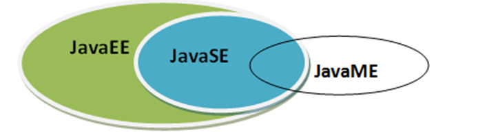
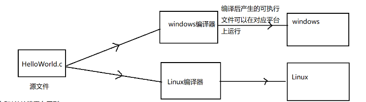
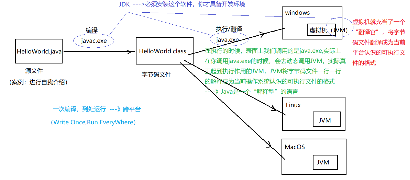
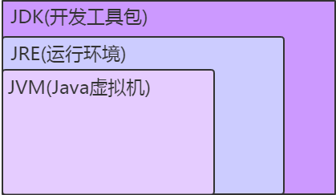
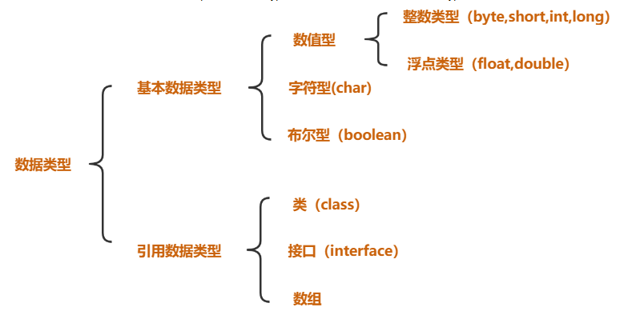
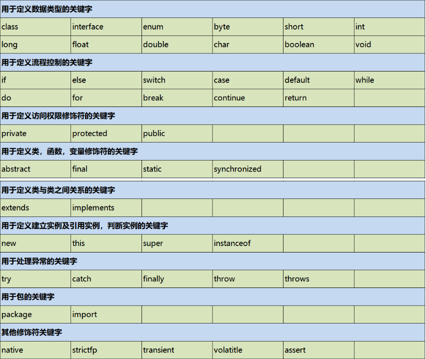
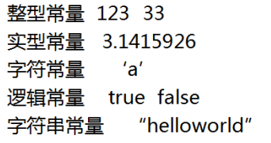
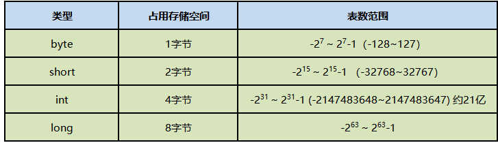
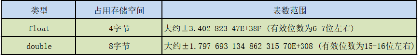
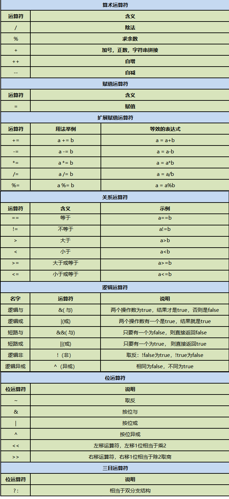

# 一、初始Java

## 1.Java简史

## 2.体系结构



### （1）**Java SE (Standard Edition)**

- 这是最常用的Java版本，用于==开发普通桌面应用程序（也称为客户端应用程序）和服务器端应用程序。==
- 它提供了进行对象编程、多线程、网络通信、数据库连接、图形用户界面（GUI）构建、XML解析等的基本API。

### **（2）Java EE (Enterprise Edition)**

- 它建立在Java SE的基础上，添加了==支持企业级应用程序开发==的库和API，比如用于大型分布式系统的Web服务、组件模型、管理和通信API。
- Java EE旨在帮助开发者创建大型的、多层的、可伸缩的、安全的和可靠的网络应用程序。
- 它提供了支持Servlets、JavaServer Pages (JSP)、Enterprise JavaBeans (EJB)、消息服务等的API。

### **（3）Java ME (Micro Edition)**

- 这个版本旨在为==资源受限的设备==提供Java技术，例如移动设备和嵌入式设备。
- Java ME为这些设备提供了一个轻量级的运行时环境，包括配置（例如CDC和CLDC）和配置文件（如MIDP），这些都是为了适应不同类型的设备。
- 它还包括了专门为小型设备优化的API，以及一些服务提供程序接口，用于接入设备的特定功能。

## 3.优势

- **简单性**:Java设计得简洁易懂，它省去了其他语言中常见的复杂特性，比如指针和运算符重载。
- **面向对象**:Java是一种纯粹的面向对象编程语言。它提倡对象的概念，包括封装、继承和多态。
- **平台无关性**:“==编写一次，到处运行==”（Write Once, Run Anywhere, WORA）是Java最著名的特性。Java程序被编译成字节码，可以在任何安装了Java虚拟机（JVM）的平台上运行。
- **自动内存管理**:Java具有自动垃圾收集机制，这意味着程序员不需要手动管理内存分配和回收。
- **安全性**:它提供了一个安全的运行时环境，使用沙箱模型来保护系统免受未经授权的代码访问。
- **多线程**:Java内建了强大的多线程功能，允许同时执行多个线程以优化资源使用和程序性能。
- **健壮性**:强类型机制、异常处理、垃圾收集等功能使Java成为一个健壮的编程语言，减少程序崩溃的可能性。
- **高性能**:虽然Java被认为比直接编译到本机代码的语言慢，但随着JVM的优化和即时编译技术（JIT编译器），Java的性能大大提高。
- **分布式**:Java有一个丰富的标准库，简化了文件处理和网络连接等分布式应用的开发。

## 4,核心特性

### （1）自动内存管理

> 在Java中，自动内存管理主要是通过==垃圾收集器==来实现的。

 在Java中，当你创建对象时，==JVM==会自动在堆内存中为其分配空间。当这些对象不再被任何变量引用时，它们将成为垃圾收集器（GC）的回收目标，这个过程对开发者来说是透明的。

 尽管有了垃圾收集器，Java程序仍然可能出现==内存泄漏==，通常是由于==长时间存活的对象持续占用内存或者对对象的引用未被正确清除==。虽然自动内存管理简化了编程，但垃圾收集过程可能会影响应用程序的性能，尤其是在垃圾收集发生时可能会暂停程序的运行。

Java程序在运行时使用内存管理机制来分配和管理内存，主要包括堆内存、栈内存和方法区内存。

- **堆内存**：堆内存用于存储==对象实例==和==数组==。所有通过`new`关键字创建的对象都会存储在堆内存中。

- **栈内存**：栈内存用于存储方法调用的==局部变量==和方法调用的执行上下文（栈帧，包含方法的参数和局部变量。）。

- **方法区**：方法区内存用于存储类的==元数据信息==、==静态域==、==字符串常量池==等。

### （2）平台无关性

> Java虚拟机是实现跨平台的核心机制

- **字节码**: Java程序首先被编译成一种中间形式称为字节码（.class文件），这是一种平台无关的代码。
- **Java虚拟机(JVM)**: 字节码可以在任何安装了JVM的设备上运行。JVM是一个在主机硬件上虚拟出的机器，它负责执行字节码，并且可以边解释边执行，每个操作系统都有专为其设计的JVM版本。
- **==编写一次，到处运行（WORA）==**: 由于JVM的存在，开发者只需编写一次代码，就可以在任何支持JVM的平台上运行，而无需为每个平台重新编写或编译代码。

### （3）与c语言跨平台原理对比

- **C语言是源文件跨平台**：编译器与平台相关，编译生成的可执行文件与平台相关。



- **Java是编译后文件跨平台**：将源代码编译为==平台无关的字节码文件==（.class文件），然后在具有相应Java虚拟机（JVM）的平台上运行这些字节码文件来实现的



## 5.JDK下载与配置

> [Java Downloads | Oracle](https://www.oracle.com/java/technologies/downloads/?er=221886)

## 6.第一个Java程序

```java
public class HelloWorld{
		public static void main(String[] args){//main函数的默认结构
			System.out.print("hello world!");//打印
		}
}
```

注意：需要==将可执行文件javac、java路径添加到环境变量path中==，这样才能在源代码文件路径下，执行java、javac进行编译。

## 7.JDK API

[JDK1.8 API 中文文档 - qingjiawen - 博客园 (cnblogs.com)](https://www.cnblogs.com/qingjiawen/p/13657514.html)

## 8.反编译

[java-decompiler/jd-gui: A standalone Java Decompiler GUI (github.com)](https://github.com/java-decompiler/jd-gui)

JD-GUI（Java Decompiler GUI）是一个流行的Java反编译工具，有图形界面，使用方便。

## 9.JDK,JRE,JVM



JVM不能单独搞定class的执行，解释class的时候JVM需要调用解释所需要的类库lib。在JDK下面的的jre目录里面有两个文件夹bin和lib,在这里可以认为bin里的就是jvm，lib中则是jvm工作所需要的类库，而jvm和 lib和起来就称为jre。

# 二、数据类型



## 1.标识（zhi）符

**驼峰命名法：**

- 类名：首字母大写，其余遵循驼峰命名
- 方法名，变量名：首字母小写，其余遵循驼峰命名
- 包名：全部小写，不遵循驼峰命名

## 2.关键字

> [Java Language Keywords (The Java™ Tutorials > Learning the Java Language > Language Basics) (oracle.com)](https://docs.oracle.com/javase/tutorial/java/nutsandbolts/_keywords.html)



### （1）enum

`enum`（枚举）是Java中的一种特殊数据类型，用于定义一组常量。它用于表示一组固定的常量值，例如一周中的天数、方向、季节等。枚举可以使代码更具可读性和可维护性。

示例：

```java
package com.lxy.basic;

public enum Day {
    // 枚举常量
    SUNDAY(0, "星期天"),
    MONDAY(1, "星期一"),
    TUESDAY(2, "星期二"),
    WEDNESDAY(3, "星期三"),
    THURSDAY(4, "星期四"),
    FRIDAY(5, "星期五"),
    SATURDAY(6, "星期六");

    // 字段
    private final int id;
    private final String week;

    // 构造函数
    Day(int id, String week) {
        this.id = id;
        this.week = week;
    }

    // 获取id的方法
    public int getId() {
        return id;
    }

    // 获取week的方法
    public String getWeek() {
        return week;
    }

    public static void main(String[] args) {
        Day friday = Day.FRIDAY;
        Day sunday = Day.SUNDAY;

        System.out.println("Friday: " + friday.getId() + ", " + friday.getWeek());
        System.out.println("Sunday: " + sunday.getId() + ", " + sunday.getWeek());
    }
}

```

- 枚举类型可以包含方法和字段。
- 枚举类型是一个类，枚举常量是这个类的实例。

### （2）interface

`interface`（接口）是Java中的一种引用类型，用于定义类必须实现的方法。接口不能包含任何实现，只能包含方法声明（从Java 8开始可以包含默认方法和静态方法）。

示例：

```java
package com.lxy.basic;

interface Animal {
    void eat(); //省略了abstract public  修饰
    void sleep();
}

class Dog implements Animal {
    public void eat() {
        System.out.println("Dog is eating");
    }

    public void sleep() {
        System.out.println("Dog is sleeping");
    }
}
class Main{
    public static void main(String[] args) {
        Dog dog = new Dog();
        dog.eat();
        dog.sleep();
    }
}
```

- 一个类可以实现多个接口，从而实现多重继承的效果。
- 接口可以扩展（继承）其他接口。

### （3）final

`final`关键字可以用于类、方法和变量，表示它们不能被修改。

示例：

```java
// final 变量
final int CONSTANT = 10;

// final 方法
class Parent {
    public final void show() {
        System.out.println("This is a final method.");
    }
}

class Child extends Parent {
    // 下面的代码会导致编译错误，因为不能重写final方法
    // public void show() {
    //     System.out.println("Cannot override this method.");
    // }
}

// final 类
final class ImmutableClass {
    private final int value;

    public ImmutableClass(int value) {
        this.value = value;
    }

    public int getValue() {
        return value;
    }
}

// 下面的代码会导致编译错误，因为不能继承final类
// class SubClass extends ImmutableClass {
// }
```

- `final`变量：值一旦赋值就不能改变。
- `final`方法：不能被子类重写。
- `final`类：不能被继承。

## （4）static

`static`关键字用于声明类的成员（字段和方法）为类级别，而不是实例级别。这意味着静态成员属于类本身，而不是类的实例。

示例：

```java
class Counter {
    static int count = 0;

    Counter() {
        count++;
        System.out.println("Count is: " + count);
    }

    static void displayCount() {
        System.out.println("Total count is: " + count);
    }
}

public class TestStatic {
    public static void main(String[] args) {
        Counter c1 = new Counter();
        Counter c2 = new Counter();
        Counter.displayCount();
    }
}
```

- 静态变量：所有实例共享同一个静态变量。
- 静态方法：可以直接通过类名调用，不能访问非静态成员。
- 静态块：用于初始化静态数据成员，只在类加载时执行一次。

```java
class StaticBlockExample {
    static int data;
    
    static {
        data = 50;
        System.out.println("Static block initialized.");
    }

    public static void main(String[] args) {
        System.out.println("Data: " + data);
    }
}
```

通过使用这些关键字和概念，Java程序可以实现更加灵活和强大的功能，同时保持代码的清晰和可维护性。

## 3.常量和变量

### （1）常量



- **符号常量（Symbolic Constants）**

```java
final int MAX_SIZE = 100;
final double PI = 3.14159;
static final double PI = 3.14159;
```

一旦给`final`变量赋值后，它的值就不能被改变。

注意：`final`修饰的变量==名称要大写，中间用_隔开==。

- **枚举常量（Enum Constants）**

```java
enum Color {
    RED, GREEN, BLUE;
}
```

这里的`RED`、`GREEN`和`BLUE`是枚举常量，它们是`Color`类型的实例。

### （2）变量

注意：==只声明未赋值的变量相当于未定义，不能直接使用==，如下所示

```JAVA
public class Test{
	public static void main(String[] args){
		int age;
		System.out.print(age);//未赋值使用会报错
	}
}
```

## 4.数据类型

> Java是一种==强类型语言==，每个变量都必须声明其数据类型。 


注意：对于==小数==来说，==默认是`double`类型==

### （1）整数类型



注意：==整数默认就是`int`类型==，如果超过了表数范围，需要用`long`类型接收，并且在整数后面加`l`或`L`。并且最好不要进行浮点数的比较。

```java
public class Test{
	public static void main(String[] args){
		long num=12313131313;//整数后面需要加l或L才能正常运行
		System.out.print(num);
	}
}
```

### （2）浮点类型



注意：浮点型默认就是`double`类型，要想将一个`double`类型的数赋给`float`类型，必须后面加上`F`或`f`。

```java
public class Test{
	public static void main(String[] args){
		float num=3.1415;
		System.out.print(num);
	}
}
```

### （3）字符类型

## 5.类型转换

> 级别由小到大：byte、char、short、int、long、float、double

### （1）隐式类型转换（自动转换）

将一个小范围的数据类型赋值给一个大范围的数据类型。

### （2）显示类型转换

从一个大范围的数据类型转换为一个小范围的数据类型，可能导致数据丢失。

```java
public class Test{
	public static void main(String[] args){
		int num1=123;
		double num2=num1;//小范围到大范围支持自动转换
		int num3=num2;//大范围到小范围需要手动转换，但可能会导致数据丢失
	}
}
```

特殊情况：对于byte，short，char类型来说，只要在他们的表数范围中，从大范围到小范围依旧可以自动转换

```java
public class Test{
	public static void main(String[] args){
		byte num1=123;//byte:-128~127
		System.out.println(num1);
		byte num2=128;
		System.out.println(num2);
		byte num3=(byte)128;
		System.out.println(num3);
	}
}
```


将`num2`注释后运行结果为123、-128，那么为什么（byte）128的值为-128呢？

Java中的==溢出==会导致结果的循环或截断，即当整数值超出`byte`的取值范围时，它将==绕回==最小值-128，这是由补码表示方式决定的。

-128的补码为`1000 0000`（绝对值的原码取反加1），可以确定符号为负，然后再取反加1得到原码为`1000 0000`值为128，加上符号则为-128

## 6.原码、补码、反码

> 为了进行整数的加法和减法运算，计算机通常使用补码表示方式，因为补码能够自然地处理溢出和负数运算。补码表示方式也使得0的表示方式唯一，无需区分正零和负零。

**（1）原码（Sign-Magnitude）**

- 最简单的表示方式，其中一个比特位用于表示正负号，其余位表示数值的绝对值。。

**（2） 反码（One's Complement）**

- 反码的表示方式是在原码的基础上，对负数的数值除符号位外取反。
- 正数的反码与其原码相同，负数的反码是其绝对值的二进制位取反。

**（3）补码（Two's Complement）**

- 正数的补码与其原码相同，负数的补码是其绝对值的原码取反后加1。
- 补码的优势是它只有一个表示0的方式，同时在加法和减法运算中能够自然地得出正确结果。

### 7.Scanner类的简单使用

```java
import java.util.Scanner; //导包
public class Test{
	public static void main(String[] args){
		//实现功能：求圆的周长和面积
		final double PI=3.14;//符号常量
		//创建一个扫描器
		Scanner sc=new Scanner(System.in);
        //将输入的下一个标记扫描为double
		double r = sc.nextDouble();
		//周长
		double c = 2*PI*r;
		System.out.println(c);
		//面积
		double s=PI*r*r;
		System.out.println(s);
	}
}
```

# 三、操作符



## 1.相关概念

- 操作数（operand）
- 操作符（operator）
- 表达式（expression）
- 语句（sentence）

## 2.部分操作符详解

### （1）赋值运算符

`a+=b`和`a=a+b`的区别：a+=b的可读性差、但运行效率高，因为==自动进行类型转换==。

```java
public class Test{
	public static void main(String[] args){
		int b=133;
		byte a=20;
		a=a+b;//大范围到小范围，需要手动类型转换
		a+=b;//自动类型转换
	}
}
```

### （2）逻辑运算符

> `&&`和`||`具有短路的特性

**`&&`**：只要第一个表达式为`false`，那么第二个表达式便不参与运算，直接返回`false`。

**`||`**：只要第一个表达式为`true`，那么第二个表达式便不参与运算，直接返回`true`。

### （3）位运算符

**`~`取反**

==如何计算一个取反后的实际数值？==

例如：~6（类型为`byte`）

6 原码：0000 1010 取反 -----> 1111 0101 那么该二进制代表的实际数值是多少呢？

首先可以判断该数值为负数，即该二进制为补码，对其取反后加1，变为000 1011的原码，值为11，加上符号为-11。

**`^`异或**

异或同一个数结果为0。

任何数异或0结果不变。

## 3.优先级

> 优先级由大到小：单目运算符、算术运算符、关系运算符、逻辑运算符、三目运算符、赋值运算符

# 四、流程控制

## 1.分支语句

## 2.循环语句

### （1）关键字

#### **① `break`的==标签==作用**

`break`一般只打断就近的循环体，但也可以设计标签，一般设于循环体前一行，来根据标签来结束循环

```java
public class Test{
	public static void main(String[] args){
		outer:
		for(int i=0;i<9;i++){
			for(int j=0;j<5;j++){
				if(i==1 && j==3)
					break outer;
				System.out.print(i+" : "+j+"\t");
			}
		}
	}
}
```

表明当符合条件时，`break`并不是结束本次循环，而是根据标签来结束循环

#### **②`continue`的标签作用**

> 用法与`break`类比

# 五、方法

## 1.方法的重载

定义：方法的重载是指一个类中可以定义多个方法名相同，但参数不同的方法。 调用时，会根据不同的参数自动匹配对应的方法。

条件：方法名相同，形参列表不同（形参顺序、形参类型、形参个数）

注意：传参时，实际参数可以从小范围到大范围的自动进行类型转换==模糊匹配==形式参数

```java
public class Test{
		public static void main(String[] args){
                add(5);//整数默认是int类型：级别：byte,short,char-->int-->long-->float--->double
        }
        public static void add(double num1){
                System.out.println("------2");
        }
        public static void add(float num1){
                System.out.println("------3");
        }
        public static void add(long num1){
                System.out.println("------4");
        }
		public static void add(short num1){
                System.out.println("------5");
        }
}
```

运行结果如下：

表明`int`类型自动类型转换为`long`类型。

# 六、数组

## 1.数组的初始化

### （1）静态初始化

在定义数组的同时就为数组元素分配空间并赋值

```java
int[] arr=new int[]{0,1,2,3,4};
//int[] arr=new int[5]{0,1,2,3,4};错误的
int[] arr={0,1,2,3,4};//定义赋值不能分开
```

### （2）默认初始化

数组是引用类型，它的元素相当于类的实例变量，因此数组一经分配空间，其中的每个元素也被按照实例变量同样的方式被隐式初始化。

```java
int[] arr=new int[3];//0 0 0
```

注意：引用类型初始化为`null`

## 2.数组的应用

### （1）最值

```java
public static int getMax(int[]arr) {
        int max=arr[0];
        for(int e:arr) {
            if(e>max){
                max=e;
            }
        }
        return max;
    }
```

### （2）查询

```java
public static int getIndex(int[]arr, int num){
        for (int i = 0; i < arr.length; i++) {
            if (arr[i] == num)
                return i;
        }
        return -1;
    }
```

### （3）添加

```java
public static void insertEle(int[]arr, int index, int num){
        for (int i = arr.length-1; i >=index ; i--) {
            arr[i]=arr[i-1];
        }
        arr[index]=num;
    }
```

### （4）删除

```java
public static void eraseEle1(int[]arr,int index){
    for (int i = index; i <arr.length-1 ; i++)
        arr[i] = arr[i + 1];
}
public static void eraseEle2(int[]arr,int num){
    int index=getIndex(arr,num);
    eraseEle1(arr,index);
}
```

## 3.main

#### （1）main可以重载吗？

Java中的`main`方法可以重载，但只有一个特定的`main`方法才能作为程序的入口点。这个特定的`main`方法的签名必须是`public static void main(String[] args)`。其他重载的`main`方法不会被Java虚拟机识别为程序的入口。

#### （2）可以有多个main函数吗？

可以在一个Java类中定义多个`main`方法，但只有一个`main`方法是作为程序的入口点的。

#### （3）`String[] args`

当您运行Java程序时，您可以在命令行中提供一些参数，这些参数会作为字符串数组传递给`main`方法。

## 4.Arrays工具类

> API文档[Arrays (Java Platform SE 8 ) (oracle.com)](https://docs.oracle.com/javase/8/docs/api/)

Java的`Arrays`工具类是一个实用类，提供了大量的静态方法，用于操作数组（例如排序、搜索、填充、比较等）。这些方法极大地方便了对数组的处理，提升了开发效率。`Arrays`类位于`java.util`包中。

### （1）`sort` 方法
用于对数组进行排序。

```java
import java.util.Arrays;

public class ArraysSortExample {
    public static void main(String[] args) {
        int[] numbers = {5, 3, 8, 1, 2};
        Arrays.sort(numbers);
        System.out.println(Arrays.toString(numbers)); // 输出：[1, 2, 3, 5, 8]
    }
}
```

### （2）`binarySearch` 方法
用于在排序的数组中搜索元素，返回元素的索引。如果未找到，返回负值。

```java
import java.util.Arrays;

public class ArraysBinarySearchExample {
    public static void main(String[] args) {
        int[] numbers = {1, 2, 3, 5, 8};
        int index = Arrays.binarySearch(numbers, 3);
        System.out.println("Index of 3: " + index); // 输出：Index of 3: 2
    }
}
```

### （3） `copyOf` 方法
用于复制数组，返回一个新数组。

```java
import java.util.Arrays;

public class ArraysCopyOfExample {
    public static void main(String[] args) {
        int[] numbers = {1, 2, 3, 5, 8};
        int[] copiedNumbers = Arrays.copyOf(numbers, 7);
        System.out.println(Arrays.toString(copiedNumbers)); // 输出：[1, 2, 3, 5, 8, 0, 0]
    }
}
```

### （4） `fill` 方法
用于用指定值填充数组。

```java
import java.util.Arrays;

public class ArraysFillExample {
    public static void main(String[] args) {
        int[] numbers = new int[5];
        Arrays.fill(numbers, 7);
        System.out.println(Arrays.toString(numbers)); // 输出：[7, 7, 7, 7, 7]
    }
}
```

### （3）`equals` 方法
用于比较两个数组是否相等。

```java
import java.util.Arrays;

public class ArraysEqualsExample {
    public static void main(String[] args) {
        int[] numbers1 = {1, 2, 3};
        int[] numbers2 = {1, 2, 3};
        boolean isEqual = Arrays.equals(numbers1, numbers2);
        System.out.println("Arrays are equal: " + isEqual); // 输出：Arrays are equal: true
    }
}
```

### （3） `toString` 方法
用于将数组转换为字符串表示形式。

```java
import java.util.Arrays;

public class ArraysToStringExample {
    public static void main(String[] args) {
        int[] numbers = {1, 2, 3, 5, 8};
        String arrayString = Arrays.toString(numbers);
        System.out.println(arrayString); // 输出：[1, 2, 3, 5, 8]
    }
}
```

### （3） `asList` 方法
用于将数组转换为列表（List）。

```java
import java.util.Arrays;
import java.util.List;

public class ArraysAsListExample {
    public static void main(String[] args) {
        String[] fruits = {"Apple", "Banana", "Cherry"};
        List<String> fruitList = Arrays.asList(fruits);
        System.out.println(fruitList); // 输出：[Apple, Banana, Cherry]
    }
}
```

## 5.`arraycopy`

`System.arraycopy`是Java中一个非常有用的方法，用于在数组之间复制数据。它比通过循环手动复制数组元素更高效，适用于需要将一个数组的一部分或全部复制到另一个数组的场景。

该方法的签名如下：

```java
public static void arraycopy(Object src, int srcPos, Object dest, int destPos, int length)
```

- `src`：源数组。
- `srcPos`：源数组中的起始位置。
- `dest`：目标数组。
- `destPos`：目标数组中的起始位置。
- `length`：要复制的元素数量。

下面是几个使用`System.arraycopy`方法的示例：

示例 1：复制整个数组

```java
public class ArrayCopyExample {
    public static void main(String[] args) {
        int[] srcArray = {1, 2, 3, 4, 5};
        int[] destArray = new int[srcArray.length];

        System.arraycopy(srcArray, 0, destArray, 0, srcArray.length);

        System.out.println("Source Array: " + java.util.Arrays.toString(srcArray));
        System.out.println("Destination Array: " + java.util.Arrays.toString(destArray));
    }
}
```

输出：

```
Source Array: [1, 2, 3, 4, 5]
Destination Array: [1, 2, 3, 4, 5]
```

示例 2：复制部分数组

```java
public class ArrayCopyPartialExample {
    public static void main(String[] args) {
        int[] srcArray = {1, 2, 3, 4, 5};
        int[] destArray = new int[5];

        // 复制srcArray的第二个元素开始的3个元素到destArray的第二个位置开始
        System.arraycopy(srcArray, 1, destArray, 2, 3);

        System.out.println("Source Array: " + java.util.Arrays.toString(srcArray));
        System.out.println("Destination Array: " + java.util.Arrays.toString(destArray));
    }
}
```

输出：

```
Source Array: [1, 2, 3, 4, 5]
Destination Array: [0, 0, 2, 3, 4]
```

- `System.arraycopy`方法是本地方法，底层实现使用了高效的内存复制操作。
- 复制操作要求源数组和目标数组具有相同的基本数据类型，否则会抛出`ArrayStoreException`。
- 如果`srcPos`、`destPos`或`length`参数超出数组的范围，会抛出`IndexOutOfBoundsException`。


