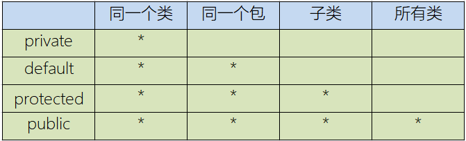
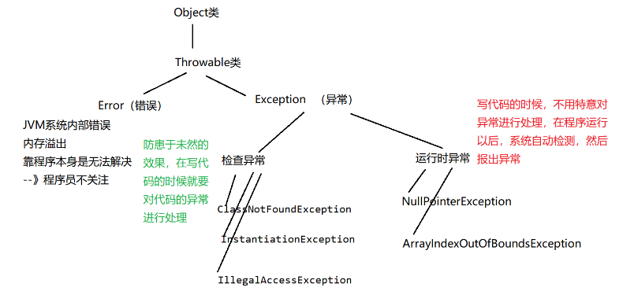
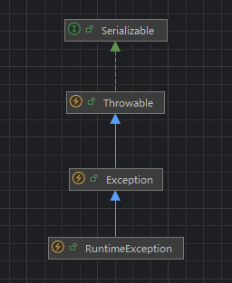
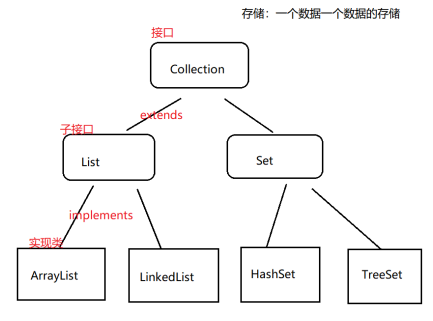
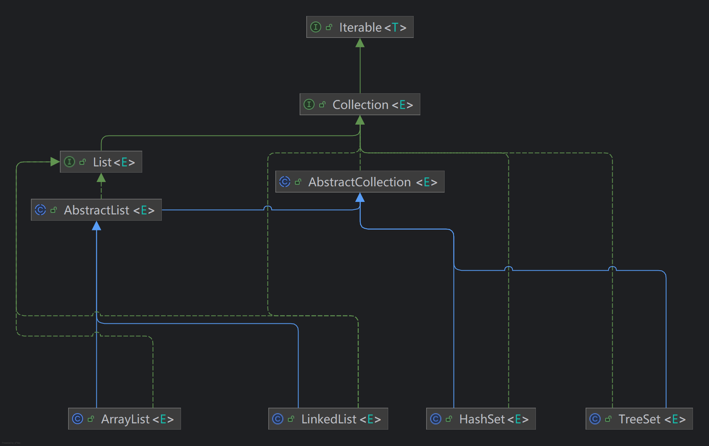
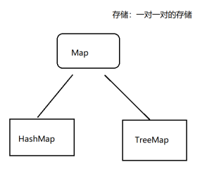
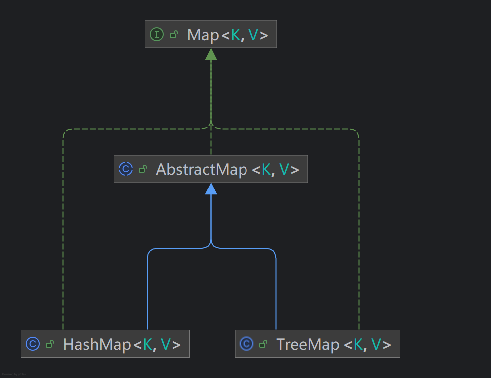
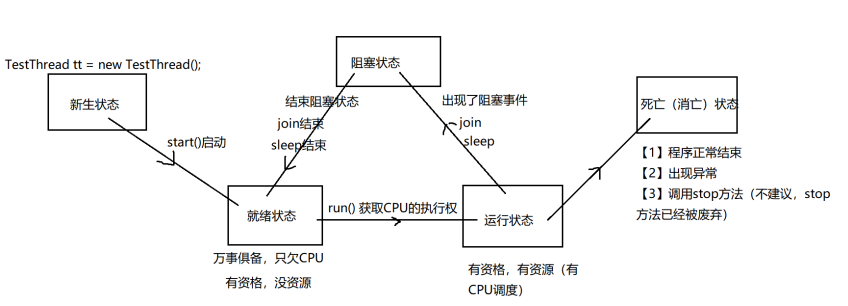

# 一、对象

## 1.创建对象

> 类的加载：将类的字节码文件从磁盘加载到内存中

```java
String str=new String();//强制进入
```

## 2.构造器

new关键字实际上是在调用一个方法，这个方法叫构造方法（构造器），如果类没有构造器，那么会自动生成默认构造器。

```java
public class Person {
    //属性
    public int age;
    public String name;
    double weight;
    //构造器
    //空构造器
    public Person(){
    }
    //构造器重载
    public Person(int age, String name, double weight) {
        //形参和属性重名时，将采用就近原则，因此需要用this来指定属性
        this.age = age;
        this.name = name;
        this.weight = weight;
    }
    //方法
    public void introduce() {
        System.out.println("name:"+name+",age:"+age+",weight:"+weight);
    }
}
```

```java
public class Test {
    public static void main(String[] args) {
        Person person=new Person();//调用空构造器
        person.age=18;
        person.name="lisi";
        person.weight=134.5;
        person.introduce();
        Person person2=new Person(20,"zhangsan",126.6);//调用重载的构造器
        person2.introduce();
    }
}
```

注意：==一般保证空构造器的存在==，空构造器中一般不会进行属性的赋值操作，并且会重载构造器，在重载的构造器中进行属性赋值操作。

## 3.内存分析

分析下面程序运行的内存管理

```java
public class Test {
    //首先`main`函数开辟栈帧，
    public static void main(String[] args) {
        int age=40;
        //第一次创建`Person`实例需要加载，即将磁盘上的`.class`文件加载到内存中，然后在堆区为实例开辟空间，并返回一个地址。
        Person person2=new Person(20,"zhangsan",126.6);
        change1(age);
        System.out.println(age);//40
        change2(person2);
        System.out.println("age:"+person2.age+",name:"+ person2.name+",weight:"+person2.weight);
        change3(person2);
        System.out.println("age:"+person2.age+",name:"+ person2.name+",weight:"+person2.weight);
    }
    //`change1`中的形参`age`接受外部`age`的实参赋值，两者指向的值相同，但空间不同，因此形参`age`的赋值不影响实参`age`，而且生命周期只存在这个方法中，随着栈帧的回收而一并销毁。
    public static void change1(int age) {
        age=30;
    }
    //`change2`中的形参`person`接受外部`person2`的实参赋值，两者存储的都是实例的地址`0x96`，但后续又为`person`创建的新的对象，此时`person`存储的是新对象的地址，指向了新的对象。
    public static void change2(Person person) {
        person=new Person(40,"wangwu",172.3);
    }
    //`change3`中的形参`person`接受外部`person2`的实参赋值，两者存储的都是实例的地址`0x96`，并且调用了类的方法`setAge`，修改了`0x96`指向的对象的属性，外部实际参数`person2`的属性也会被修改。
    public static void change3(Person person) {
        person.setAge(60);
    }
}
```

## 4.this

`this`除了可以引用属性和方法外，还可以==引用构造器==，并且只能放到==第一行==。

```java
public Person(int age,String name){
        this.age = age;
        this.name = name;
    }
public Person(int age, String name, double weight) {
        this(age,name);
        this.weight = weight;
    }
```

## 5.static

> static可以修饰属性、方法、代码块、内部类

### （1）修饰属性

`static`被修饰的属性，在类加载时，存储在方法区的静态域，因此是先于对象的创建的，不属于某个对象，而是这个类的属性。

应用于数据在类中共享，如同学的学校、班级等共同属性。

```java
public class Student {
    static String school="qhdx";//先于对象创建，属于类的属性
    int id;
    String name;

    public Student(int id, String name) {
        this.id = id;
        this.name = name;
    }

    @Override
    public String toString() {
        return "Student{" +
                "id=" + id +
                ", name='" + name + '\'' +
                '}';
    }
}
```

```java
public static void main(String[] args) {
    Student stu=new Student(0,"zhangsan");
    System.out.println(Student.school);//可以使用类.属性进行访问，更推荐
    System.out.println(stu.school);//也可以通过对象访问
    System.out.println(stu);
}
```

### （2）修饰方法

方法依旧加载到方法区，以字节码信息的格式存储。==修饰后的方法，无法访问非静态成员，也无法使用`this`，同时也不能使用其他的非静态方法==。

```java
public static void learning() {
        System.out.println("studying at "+school);//可以访问静态属性
    }
```

```java
public static void main(String[] args) {
        Student stu=new Student(0,"zhangsan");
        Student.learning();//更推荐
        stu.learning();
    }
```

### （3）修饰代码块

初始化

## 6.代码块

> 类的组成：属性、方法、代码块、内部类

代码块：普通快、构造块、静态块、同步块（多线程）

```java
public class Student {
    static String school="qhdx";
    public static void learning() {
        System.out.println("studying at "+school);
        {
            //主要是为了限制局部变量的作用域
            //这是普通快，在方法里，用{}引用。
        }
    }
    {
        //这是构造块，在类里，与方法在同一层次
    }
    static{
        //这是静态块，在构造块前加static修饰
        //只能访问静态属性、方法
        synchronized(Student.class){
            //同步块
            System.out.println(school);
        }
    }
}
```

代码块的==执行顺序==：静态块（类的加载）、构造块、普通块。

# 二、OOP

## 1.封装

> 将某些东西进行隐藏，然后提供相应的方式进行获取。

### （1）封装的过程

- ==`private`修饰属==性，使属性类外不可见。
- ==提供`public`修饰的方法==，允许存在类外访问的接口，一般为`setter`和`getter`方法。
- 即使有可以访问的接口，但可以加以==限制条件==。

以下是一个封装的实例

```java
//一个不愿意暴露年纪的女孩类
public class Girl {
    private int age;
    String name;

    public Girl() {
    }

    public Girl(int age, String name) {
        this.age = age;
        this.name = name;
    }

    public int getAge() {//当然也可以添加一些限制条件，比如限定访问的身份
        return age;
    }

    public void setAge(int age) {
        this.age = age;
    }
}
```

```java
public class Test {
    public static void main(String[] args) {
        Girl girl1=new Girl(22,"wangwei");
        //System.out.println(girl.age);不能直接访问，需要调用必要的接口
        System.out.println(girl1.getAge());
    }
}
```

## 2.继承

### （1）`extends`

> 继承是  ==is-a==的关系

```java
package com.lxy.oop;

public class Person {
    int age;
    String name;

    public Person() {
    }
    public Person(int age, String name) {
        this.age = age;
        this.name = name;
    }

    public void sleep() {
        System.out.println("age:"+age+"\n"+"name:"+name +"\n"+"person sleep");
    }
    public void eat() {
        System.out.println("age:"+age+"\n"+"name:"+name +"\n"+"person eat");
    }
}

```

```java
package com.lxy.oop;

public class Student extends Person {
    int stuId;
    //除了上述属性，还有继承自父类的属性
    public Student(){
    }
    public Student(int stuId) {
        this.stuId = stuId;
    }

    public Student(int age, String name, int stuId) {
        super(age, name);//类比this，super表示继承父类的构造器
        //其实构造器的第一行都有super() 来调用父类的空构造器，一般省略不写
        this.stuId = stuId;
    }

    public void study(){
        System.out.println("student study");
    }
    //除了上述方法，还有继承自父类的方法

    //eat方法重写
    public void eat() {
        System.out.println("age:"+age+"\n"+"name:"+name +"\n"+"student eat");
    }

    //对toString的重写，后续会讲解
    public String toString() {
        return "Student{" +
                "stuId=" + stuId +
                ", age=" + age +
                ", name='" + name + '\'' +
                '}';
    }
}

```

```java
package com.lxy.oop;

public class Main {
    public static void main(String[] args) {
        Person studentA=new Student(18,"zhangSan",2020);
        studentA.sleep();
        studentA.eat();
        //此时该类仍是Person类，并没有添加的方法，需要对类型进行强制转换
        ((Student)studentA).study();
        System.out.println(studentA);
    }
}

```

注意：子类只能继承一个父类，而父类可以被多个子类继承。

```java
public class Teacher extends Person{
    int teaId;

    public Teacher() {
    }

    public Teacher(int teaId) {
        this.teaId = teaId;
    }

    public Teacher(int age, String name, int teaId) {
        super(age, name);
        this.teaId = teaId;
    }
    public void teach() {
        System.out.println("teacher teach");
    }
}
```

### （2）内存分析

`Student`继承自`Person`，因此`student1`可以访问到`sleep()`方法，并且创建对象时，也会为父类的属性开辟空间与初始化并赋值。

### （3）权限修饰符



注意：如果想让==子类可用，需要至少`protected`的修饰==。

修饰属性、方法：`private`,`default`,`protected`,`public`

修饰类：`public`,`default`

一般来说，==属性用`private`，方法用`public`==

### （4）重写

子类不适用于父类的方法，或子类不满意父类的方法，可以对父类的方法进行重写。重写后，调用方法时就会优先调用重写后的方法。

条件：==方法名字与父类一致，形参列表也要一致==。

```java
//重写了父类的sleep()，保持了别名、形参列表均一致
public void sleep() {
        System.out.println("Students only sleep 8 hours a day");
    }
```

```java
public class Main {
    public static void main(String[] args) {
        Student student1=new Student(18,"zhangsan",0);
        student1.sleep();//输出student sleep 6 hour，实现了方法的重写
        Person person1=new Person(20,"lisi");
        person1.sleep();//
    }
}
```

注意：重载和重写是有区别的。

|          | 重写（override）     | 重载（overload） |
| -------- | -------------------- | ---------------- |
| 位置     | 不同类               | 同一类           |
| 条件     | 形参列表一致         | 形参列表不一致   |
| 修饰符   | 权限必须大于等于父类 | 无关             |
| 返回类型 | 范围必须小于等于父类 | 无关             |
| 抛出异常 | 范围必须小于等于父类 | 无关             |

抛出异常的测试

```java
public class Person {
    public void sleep()throws Exception{
        System.out.println("Person slepp");
    }
}
```

```java
public class Student extends Person{
    @Override
    public void sleep() throws RuntimeException{//子类抛出的异常必须是父类抛出异常的同类或子类
        System.out.println("Student sleep");
    }
}
```

### （5）继承条件下构造器的执行

注意：`Person`隐藏了一个`super();`，指向`Object`类。

每一个构造器第一行都会隐式调用父类的空构造器。

### （6）`Object`

> API帮助文档[Object (Java Platform SE 8 ) (oracle.com)](https://docs.oracle.com/javase/8/docs/api/)

所有类都直接或间接的继承自`Object`类，`Object`类是所有类的根基类，也就意味着所有的对象都拥有`Object`类的属性和方法。

#### ① `toString`

```java
public String toString() {
        return getClass().getName() + "@" + Integer.toHexString(hashCode());
    }
```

```java
public class Test {
    public static void main(String[] args) {
        Person person1=new Person(20,"lisi");
        System.out.println(person1);//输出：com.lxy.text5.Person@4554617c
    }
}
```

==将对象的内容转换为字符串表示形式==。默认情况下，`toString` 方法返回一个`包名.类名@对象的哈希码`字符串表示。

哈希码字符串的==产生过程==：创建对象在堆上开辟空间产生地址-->哈希算法产生hashcode-->转换进制-->转换字符串

经常重写 `toString` 方法，对于在调试、日志记录和用户界面中显示对象的信息非常有用。

```java
public String toString() {//保持重写原则
        return "Student{" +
                "stuId=" + stuId +
                ", age=" + age +
                ", name='" + name + '\'' +
                '}';
    }
```

```java
public class Test {
    public static void main(String[] args) {
        Student student1=new Student(18,"zhangsan",0);
        System.out.println(student1);//输出：Student{stuId=0, age=18, name='zhangsan'}
    }
}
```

#### ② `equals`

```java
public boolean equals(Object obj) {
        return (this == obj);
    }
```

引用类型的`==`是地址比较，基本类型是值比较。

`Object`类提供的`equals`只是简单的`==`地址比较，没有实际的意义，一般情况下我们也要对`equals`进行重写。

```java
@Override
public boolean equals(Object o) {
    //地址相同，指同一实例比较
    if (this == o) return true;
    //o为空，或者类的字节码信息不同（不是一个类），返回false
    if (o == null || getClass() != o.getClass()) return false;
    Student student = (Student) o;//向下转型需要强转，为了获得子类的特有内容
    return stuId == student.stuId;//比较属性
}

@Override
public int hashCode() {
    return Objects.hash(stuId);
}
```

上述代码中用`getClass() != o.getClass()`来进行类的类型比较，Java中也可以使用`instanceof`关键字。

用于==检查对象是否是某个类的实例或者是否实现了某个接口==。

```java
object instanceof Class
```

其中，`object` 是要检查的对象，`Class` 可以是类名或接口名。`instanceof` 运算符返回一个布尔值，如果对象是指定类的实例或实现了指定接口，返回 `true`，否则返回 `false`。

```java
//检查对象是否是某个类的实例
Person person = new Person("Alice", 30);
if (person instanceof Person) {
    System.out.println("person is an instance of Person.");
}
```

```java
//检查对象是否实现了某个接口
if (person instanceof Serializable) {
    System.out.println("person implements Serializable.");
}
```

当你在类中重写 `equals()` 方法时，通常也需要重写 `hashCode()` 方法，以维持 `equals()` 和 `hashCode()` 的一般契约，即如果两个对象相等，则它们的哈希码也必须相等。不遵守这一规则将导致无法正确地将对象存储在基于哈希的集合中。

#### ③` hashCode`

在 Java 中，`hashCode()` 方法是 `Object` 类的一个非常重要的方法，它提供了对象的哈希码，这个哈希码主要用于优化信息存储和快速检索，特别是在使用哈希表等数据结构时。

1. **哈希表**：`hashCode()` 方法是在使用基于哈希的数据结构，如 `HashMap`、`HashSet` 和 `Hashtable` 等时的一个关键部分。这些数据结构使用哈希码来快速定位键或对象在数据结构中的位置，从而提供快速的查找、插入和删除操作。
   
2. **快速查找**：如果两个对象相等（即 `equals(Object obj)` 方法返回 `true`），则它们必须具有相同的哈希码。这个规则允许使用哈希码作为快速拒绝不等对象的手段。如果两个对象的哈希码不同，它们绝不可能相等。
   
3. **内存管理**：哈希码还可以用于内部存储机制，以帮助管理对象在内存中的位置，尽管这种用途对于应用程序开发者通常是透明的。

每个 Java 对象都继承自 `Object` 类，因此继承了 `hashCode()` 方法。默认情况下，`Object` 类中的 `hashCode()` 方法返回对象的内存地址的一个转换（虽然具体实现依赖于 JVM），但这已经足够为大多数基本用途提供唯一标识。

例如，在自定义类中重写 `equals()` 和 `hashCode()`：

```java
public class Person {
    private String name;
    private int age;

    @Override
    public boolean equals(Object o) {
        if (this == o) return true;
        if (o == null || getClass() != o.getClass()) return false;
        Person person = (Person) o;
        return age == person.age &&
               Objects.equals(name, person.name);
    }

    @Override
    public int hashCode() {
        return Objects.hash(name, age);
    }
}
```

在这个例子中，`hashCode()` 方法使用 `name` 和 `age` 属性来计算哈希码，确保了与 `equals()` 方法的一致性。

### （7）类与类的关系

> 类之间主要有五种关系：依赖（Dependency）、关联（Association）、聚合（Aggregation）和组合（Composition）以及继承（Inheritance）。
>

1. **依赖（Dependency）**：一个类的改变会影响到依赖它的类，或者说一个类需要使用依赖的类。
2. **关联（Association）**：两个类之间的一种连接，它使得一个类知道另一个类的属性和方法。关联可以是单向的或者双向的。
3. **聚合（Aggregation）**：特殊的关联，是整体和部分的关系，但是==部分可以脱离整体==而单独存在。
4. **组合（Composition）**：更强的聚合关系，==部分不能脱离整体==存在，整体的生命周期控制部分的生命周期。
5. **继承（Inheritance）**：一种类与类的层次关系，子类继承父类的特征和行为，可以增加新的特征和行为或覆盖父类的方法。

## 3.多态

### （1）理解多态

> 同一个行为，不同的子类表现出来不同的形态

下面是一种常见的多态场景：==父类当方法的形参，然后传入的是具体的子类的对象，然后调用同一个方法，根据传入的子类的不同展现出来的效果也不同==。

```java
public class Animal {
    public void shout() {
        System.out.println("Animal shout");
    }
}
```

```java
public class Dog extends Animal{
    public void shout() {
        System.out.println("Dog shout");
    }
}
```

```java
public class Pig extends Animal{
    public void shout() {
        System.out.println("Pig shout");
    }
}
```

```java
public class Girl {
    public void play(Animal animal) {
        animal.shout();//多态
    }
}
```

```java
public class Test {
    public static void main(String[] args) {
        Animal animal1=new Dog();//注意等号左侧是编译期的类型，右侧是运行期的类型
        Animal animal2=new Pig();
        Girl girl=new Girl();
        girl.play(animal1);
        girl.play(animal2);
    }
}
```

注意：多态跟属性无关，多态指的是方法的多态，而不是属性的多态。

### （2）==多态的条件==

- 继承
- 方法重写
- 父类引用指向子类对象

### （3）内存分析

编译期间`animal1`的类型为`Animal`，指向`Animal.class`的字节码信息，但在运行期，父类引用子类实例，`Animal`类型的`animal1`接收了`Dog`类型的实例，并且该子类重写了方法，因此调用方法时，优先执行的是子类重写的方法。

### （4）向上转型、向下转型

#### ① 向上转型

```java
Animal animal1=new Dog();
//animal1.name="qiqi"; Animal是编译期的类型，无法访问到Dog类的属性，因此访问时需要向下转型
//animal1.age=3;
```

#### ② 向下转型

```java
Animal animal1=new Dog();
dog=(Dog)animal1;
dog.name="qiqi"; 
dog.age=3;
```

现在回忆以下`equals`的实现

```java
@Override
public boolean equals(Object o) {
    if (this == o) return true;
    if (o == null || getClass() != o.getClass()) return false;
    Student student = (Student) o;//向下转型，为了获得子类的特有内容
    return stuId == student.stuId;//如果不进行转型，根据编译期的类型，变量`o`无法访问stuId这个Student的属性
}
```

### （5）简单的工厂设计模式

多态的使用场景不仅可以使用父类做方法的形参，还可以使用父类做方法的返回值类型，真实返回的对象可以是该类的任意一个子类对象。

该场景适用于简单的==工厂设计模式==，它是解决大量对象创建问题的一个解决方案。将创建和使用分开，工厂负责创建，使用者直接调用即可。

```java
public class PetStore {//工厂类，负责根据需求创建类
    public static Animal getAnimal(String petName){//父类做返回值引用子类实例
        Animal animal=null;
        if("Dog".equals(petName))
            animal=new Dog();
        if("Pig".equals(petName))
            animal=new Pig();
        return animal;
    }
}
```

```java
public class Test {
    public static void main(String[] args) {
        Girl girl=new Girl();
        Animal animal=PetStore.getAnimal("Dog");
        girl.play(animal);//直接调用
    }
}
```

不难看出这一场景需要满足：父类做返回值引用子类实例、工厂类创建方法需要`static`修饰，传入能确定创建对象的字符串参数。

### （6）`final`

#### ① `final`修饰属性

不可以被修改，如果修饰的是引用类型，那么就是其地址不可被修改，但其属性依旧可以修改。

```java
public class Test {
    public static void main(String[] args) {
        final Student student=new Student();
        student.age=18;
        student.name="wangwu";
        System.out.println(student);//输出：Student{age=18, name='wangwu'}，该对象属性依旧被修改
    }
}
```

#### ② `final`修饰方法

`final`修饰的方法，该方法无法被重写。

#### ③ final`修饰类

`final`修饰的类，该类无法被继承，同样该类里面的方法一样不能被重写。

```java
public final class Person {
    int age;
    String name;
    void sleep(){
        System.out.println("Person sleep");
    }
}
```

```java
public class Teacher extends Person{//不可以被继承，Person被final修饰
}
```

Math类被`final`修饰，因此其不能被继承，方法也无法重写。并且`private`修饰了构造器，外部无法创建Math对象，因此Math方法、属性均被`static`修饰，可以通过类来访问。

```java
public final class Math {//没有子类
    /**
     * Don't let anyone instantiate this class.
     */
    private Math() {}//不能创建实例
    public static final double E = 2.7182818284590452354;//类.属性访问
    ......
```

### （7）抽象类

在抽象类中定义抽象方法，目的是为了为子类提供一个通用的模板，子类可以在模板的基础上进行开发，先重写父类的抽象方法，然后可以扩展子类自己的内容。抽象类设计避免了子类设计的随意性，通过抽象类，子类的设计变得更加严格，进行某些程度上的限制。

==一个类中有抽象方法，那么该类就是抽象类。==

```java
public abstract class Person {//抽象类
    int age;
    String name;
    void sleep(){
        System.out.println("Person sleep");
    }
    abstract void work();//抽象方法
}
```

继承的子类需要重写父类全部的抽象方法，否则也只能做抽象类。

```java
public class Student extends Person{//重写了所有抽象方法
    void work(){
        System.out.println("Student work is study");
    }
}
```

```java
public abstract class Teacher extends Person{//未重写所有抽象方法

}
```

==抽象类不能被创建==，但仍有==构造器==，因为创建子类需要调用父类的super（）。

```java
public class Test {
    public static void main(String[] args) {
        //Person person=new Person();//不能创建抽象类
        Student student=new Student();
        student.work();
    }
}
```

### （8）接口

> 定义规则

#### ① interface`和`implements`

声明格式类比`class`，与类是同一层次的概念，但也有其特殊的地方。

- ==没有构造器==
- ==JDK1.8之前，接口中只有常量和抽象方法==，且有固定的修饰符（可以省略不写）
- 接口与类是实现关系，类实现接口，并需要重写接口所有的抽象方法，否则变为抽象类
- 类只能单继承，接口可以多实现

```java
public interface TestInterface01 {
    public static final int num=10;//常量，public static final修饰
    public abstract void func1_1();//抽象方法，public abstract修饰
    public abstract void func1_2();
}
```

```java
public interface TestInterface02 {
    void func2_1();//可以省略，自动补齐
    void func2_2();
}
```

```java
public class Student extends Person implements TestInterface01,TestInterface02{//先继承，再实现，并且可以多实现
    //需要重写所有的抽象方法，否则只能是抽象类
    void work(){
        System.out.println("Student work is study");
    }
    public void func2_1() {
        System.out.println("func0_1 override");
    }
    public void func2_2() {
        System.out.println("func0_2 override");
    }
    public void func1_1() {
        System.out.println("func0_1 override");
    }
    public void func1_2() {
        System.out.println("func0_1 override");
    }
}
```

```java
public class Test {
    public static void main(String[] args) {
        //Person person=new Person();//不能创建抽象类
        Student student=new Student();
        student.work();
        student.func1_1();
        student.func1_2();
        student.func2_1();
        student.func2_2();
        //四种接口常量的访问方式
        System.out.println(TestInterface01.num);
        System.out.println(Student.num);
        System.out.println(student.num);
        TestInterface01 t1=new Student();//类比子类继承父类，此时的接口可以看成抽象类
        System.out.println(t1.num);
    }
}
```

#### ② 继承和实现

继承：==is-a==的关系

实现：==has-a==的关系

#### ③ 新特性：非抽象方法

- ==`default`修饰==，如果需要重写则不能加`default`
- ==静态方法==

```java
public interface TestInterface01 {
    public static final int num=10;
    public abstract void func1_1();
    //`default`修饰
    public default void func1_2(){
        System.out.println("run func1_2");
    }
    //静态方法
    public static void func1_3(){
        System.out.println("run func1_3");
    }
}
```

```java
public class Test implements TestInterface01{
    public void func1_1() {//重写抽象方法
        System.out.println("func1_1 override");
    }
    public void func1_2(){//重写`default`修饰的方法，不能加default，当然也可以不重写
        TestInterface01.super.func1_2();//允许在重写 default 方法时仍然能够访问到接口原本提供的默认实现。
        System.out.println("func1_2 override");
    }
    public static void func1_3(){//不能重写静态方法，只会新创建一个属于该类的静态方法
        System.out.println("func1_3 override");
    }
    public static void main(String[] args) {
        Test t=new Test();
        t.func1_1();
        t.func1_2();
        Test.func1_3();
        TestInterface01.func1_3();
    }
}
```

### （9）内部类

#### ① 成员内部类

```java
public class TestOuter {
    int num=10;
    static int num2=10;
    //非静态成员内部类
    public class A{
        int num=20;//可以与外部类重名
        void func_A(){
            int num=30;
            funcOuter_1();//非静态成员内部类可以访问外部类的方法
            funcOuter_2();//静态方法可以调用
            System.out.println(num);//30
            System.out.println(this.num);//20
            System.out.println(TestOuter.this.num);//10，也可以访问外部类的属性
        }
    }
    //静态成员内部类
    public static class B{
        int num=40;
        void func_B(){
            funcOuter_2();//只能访问静态属性和方法
        }
    }
    public void funcOuter_1(){
        System.out.println("TestOuter function_1");
    }
    public static void funcOuter_2(){
        System.out.println("TestOuter function_2");
    }
}
```

```java
public class Test {
    public static void main(String[] args) {
        //非静态内部类（实例内部类）的创建
        //由于非静态内部类可以访问外部类的属性和方法，因此需要通过一个实例来创建非静态内部类
        TestOuter t=new TestOuter();
        TestOuter.A a=t.new A();
        //静态内部类的创建
        TestOuter.B b=new TestOuter.B();
    }
}
```

#### ② 局部内部类

```java
public interface TestInterface01 {
    public abstract void func();//抽象方法
}
```

```java
public class TestOuter {
    public void method_1(){
        final int num=10;
        class A{
            public void method_A(){
                System.out.println(num);//内部类只能访问final修饰的变量
            }
        }
    }
    
    public TestInterface01 method_2(){
        class B implements TestInterface01{//内部类实现接口，用接口接收内部类的实例，用于只需要创建一次的场景
            public void func(){
                System.out.println("override func");
            }
        }
        return new B();
    }
    
    public TestInterface01 method_3(){
        return new TestInterface01() {//与上述结果相同，既然只需要创建一次就销毁，那么就没必要取别名，采用匿名内部类
            public void func(){			//可以看作 创建了一个重写完抽象方法的实例 然后返回
                System.out.println("override func");
            }
        };
    }

    public void test(){
        TestInterface01 t=new TestInterface01() {//匿名内部类的使用
            @Override
            public void func() {
                System.out.println("override func");
            }
        };
    }
}
```

匿名内部类经常用于线程的创建

```java
new Thread(new Runnable() {
            public void run() {};
        }).start();
```


# 三、异常

## 1.异常的引入

如下是一个两数相除的方法。但发现当输入非整数或者/0时都会发生报错。

```java
public class Test {
    public static void main(String[] args) {
        System.out.println("除法运算-请输入两个数：");
        Scanner sc=new Scanner(System.in);
        int x=sc.nextInt();
        int y=sc.nextInt();
        System.out.println(x / y);
    }
}
```

输入非整数时，出现`InputMismatchException`输入不匹配异常

除0时，出现`ArithmeticException`算是异常

我们可以给异常下定义：当程序运行时，发生了意外的情况，组织了程序的正常运行

## 2.`try-catch`

当然，上述错误可以使用`if-else`语句来进行排查。但是对于复杂的情况，排查是否能完整、代码的可读性以及编程效率是否达到要求，造成了很大的困难。因此就有了异常处理的机制：`try-catch-finally`。

tip：`try-catch`快捷指令为`ctrl+shift+t`

```java
public class Test {
    public static void main(String[] args) {
        try {
            System.out.println("除法运算-请输入两个数：");
            Scanner sc = new Scanner(System.in);
            int x = sc.nextInt();
            int y = sc.nextInt();
            System.out.println(x / y);
        } catch (Exception e) {
            //throw new RuntimeException(e);
            System.out.println("异常被捕获");//如果出现非整数或者除0均会输出：异常被捕获
        }
    }
}
```

`try`将程序封装为一个类，如果`Exception`类的`e`能接收这个类，那么该异常就会被捕获，否则不能。

那么如果异常被捕获后，程序还会继续运行吗？

```java
public class Test {
    public static void main(String[] args) {
        try {
            System.out.println("除法运算-请输入两个数：");
            Scanner sc = new Scanner(System.in);
            int x = sc.nextInt();
            int y = sc.nextInt();
            System.out.println(x / y);
        } catch (Exception e) {
            //throw new RuntimeException(e);
            System.out.println("异常被捕获");
        }
        System.out.println("project is running!");
        System.out.println("project is running!");
        System.out.println("project is running!");
        System.out.println("project is running!");
    }
}
```

如果异常被捕获，那么程序会继续运行。

## 3.处理异常

处理异常的方法：

- 不做处理
- 打印异常信息
- 自定义信息
- 抛异常

```java
public class Test {
    public static void main(String[] args) {
        try {
            System.out.println("除法运算-请输入两个数：");
            Scanner sc = new Scanner(System.in);
            int x = sc.nextInt();
            int y = sc.nextInt();
            System.out.println(x / y);
        } catch (Exception e) {
            //自定义信息
            System.out.println("异常被捕获");
            //打印异常信息
            System.out.println(e.toString());//输出：java.lang.ArithmeticException: / by zero
            System.out.println(e.getMessage());//输出：/ by zero
            e.printStackTrace();//显示堆栈信息，相当于一开始控制台打印的异常信息
            //抛异常
            throw e;//将异常抛出到方法之外，一般由外部方法进行处理，并且下面的程序不会继续运行
        }
        System.out.println("project is running!");
        System.out.println("project is running!");
        System.out.println("project is running!");
        System.out.println("project is running!");
    }
}
```

上面提到我们可以捕获异常保证程序的继续运行，但是在`catch`里继续抛出异常后，程序并没有继续运行，并且如果在`try`中遇到`return`程序也不会继续运行。

我们可以使用`finally`继续执行程序。

```java
public class Test {
    public static void main(String[] args) {
        try {
            System.out.println("除法运算-请输入两个数：");
            Scanner sc = new Scanner(System.in);
            int x = sc.nextInt();
            int y = sc.nextInt();
            System.out.println(x / y);
            //异常后面的就不能继续运行了
        } catch (Exception e) {
            throw e;
        }
        finally {
            System.out.println("project is running!!!");//即使异常又被重新抛出，依旧可以执行
        }
    }
}
```

一般应用场景：关闭数据库资源，关闭IO流资源，关闭socket资源

## 4.多重`catch`

`try`中出现异常以后，将异常类型跟`catch`捕获的类型依次比较，执行第一个与异常类型匹配的`catch`语句，一旦执行其中一条`catch`语句之后，后面的`catch`语句就会被忽略了。

```java
public class Test {
    public static void main(String[] args) {
        try {
            System.out.println("除法运算-请输入两个数：");
            Scanner sc = new Scanner(System.in);
            int x = sc.nextInt();
            int y = sc.nextInt();
            System.out.println(x / y);
        } catch (ArithmeticException e) {
            System.out.println("除0错误");
        }catch (InputMismatchException e){
            System.out.println("输入类型不匹配");
        }catch (Exception e){
            System.out.println("捕获异常");
        }
    }
}
```

在JDK1.7以后，异常新处理方式：可以并列用`|`符号连接

```java
public class Test {
    public static void main(String[] args) {
        try {
            System.out.println("除法运算-请输入两个数：");
            Scanner sc = new Scanner(System.in);
            int x = sc.nextInt();
            int y = sc.nextInt();
            System.out.println(x / y);
        } catch (ArithmeticException  | InputMismatchException e) {//处理新方法，注意特殊类（子类）在前，普通类（父																	类）在后
            System.out.println("捕获异常");
            if(e instanceof  ArithmeticException){
                System.out.println("除0错误");
            }
            if (e instanceof InputMismatchException){
                System.out.println("输入类型不匹配");
            }
        }
    }
}
```

## 5.异常的分类





### （1）运行时异常

- 运行时异常通常由程序的错误操作引起，如数组越界、空指针引用等。
- 编译器==不要求强制处理==这些异常，也就是说，你不需要用 `try-catch` 块捕获它们，也不需要在方法签名中用 `throws` 子句声明它们。

```java
public class Test {
    public static void main(String[] args) {
        try {
            func();
        } catch (ArithmeticException  | InputMismatchException e) {
            System.out.println("捕获异常");
            if(e instanceof  ArithmeticException){
                System.out.println("除0错误");
            }
            if (e instanceof InputMismatchException){
                System.out.println("输入类型不匹配");
            }
        }
    }
    static void func(){//并没有用`throws`向外抛出异常，而是自动抛出异常
        System.out.println("除法运算-请输入两个数：");
        Scanner sc = new Scanner(System.in);
        int x = sc.nextInt();
        int y = sc.nextInt();
        System.out.println(x / y);
    }
}
```

### （2）检查时异常

- 这类异常通常是外部错误，比如尝试打开一个不存在的文件，或者一个网络连接错误。
- 编译器要求==必须显式地处理这些异常==。如果方法可能会抛出某个检查异常，那么这个方法必须要么用 `try-catch` 块捕获这个异常，要么在其方法签名中声明它可能会抛出这个异常（使用 `throws` 关键字）。
- 除了继承自`Exception`的子类除了`RuntimeException`类外，其余都是检查时异常。

```java
public class Test2 {
    public static void main(String[] args) {
        try {
            method();
        } catch (Exception e) {
            System.out.println("捕获了检查时异常");
        }
    }
    static void method() throws Exception {//向外抛出
        throw new Exception();//检查时异常，需要try-catch捕捉，或者向外抛出
    }
}
```

## 6.`throws`和`throw`区别

`throw`：异常出现的源头，==制造异常==，并向外抛出。后面加异常实例，在方法内部。

`throws`：向外抛出异常，==提醒外部需要处理异常==。后面加异常类，在方法标签处。

## 7.自定义异常

```java
public class Test {
    //运行时异常
    public static class MyRuntimeException extends RuntimeException{//直接继承RuntimeExcepton类
        public MyRuntimeException() {
        }
	//getMessage（）返回值，异常信息
        public MyRuntimeException(String message) {
            super(message);
        }
    }
    //检查时异常
    public static class MyCheakedException extends Exception{//除了RuntimeException类其余继承Exception类的均是检															查时异常
        public MyCheakedException() {
        }
	//getMessage（）返回值
        public MyCheakedException(String message) {
            super(message);
        }
    }
	
    public static void main(String[] args) {
        //运行时异常不强制捕获
        try {
            method1();
        } catch (Exception e) {
        }
        //检查时异常必须捕获，并且method2向外抛出了异常
        try {
            method2();
        } catch (MyCheakedException e) {
            System.out.println("捕获了检查时异常");
            System.out.println(e.getMessage());
        }
        System.out.println("Project is running!");
        System.out.println("Project is running!");
        System.out.println("Project is running!");
    }
    public static void method1() {//运行时异常，自动向外抛出
        throw new MyRuntimeException("运行时异常");
    }
    public  static void method2() throws MyCheakedException{//检查时异常，手动从签名向外抛出异常
        throw new MyCheakedException("检查时异常");
    }
}
```

# 四、常用类

## 1.包装类

### （1）包装类的引入

将基本数据类型进行封装，以便更好的管理。并且在后续的学习的集合中，集合只能存储引用类型。

### （2）`Integer`介绍

> 通过Java API文档查询资料

简单提取部分源码

```java
package java.lang;//直接调用，无需导包
public final class Integer extends Number implements Comparable<Integer> {//继承自Number类，实现了Comparable接口
    public static final int   MIN_VALUE = 0x80000000;//最小值
    public static final int   MAX_VALUE = 0x7fffffff;//最大值
    
    public static Integer valueOf(int i) {//基本数据类型转换为包装类发生时，自动调用--自动装箱
        if (i >= IntegerCache.low && i <= IntegerCache.high)//如果i在[-128,127]之间直接返回值，无需创建
            return IntegerCache.cache[i + (-IntegerCache.low)];
        return new Integer(i);
    }
    
    private final int value;//封装了基本数据类似int

    public Integer(int value) {//无空构造器
        this.value = value;
    }
    
    public int intValue() {//包装类转换为基本数据类型，自动调用--自动拆箱
        return value;
    }
    /*
   由于 -128 到 127 之间的整数值使用非常频繁，所以预先创建并缓存这个范围内的 Integer 对象。当你调用 Integer.valueOf() 方法时，如果数值在这个范围内，它会直接返回缓存中的对象，而不是每次都创建一个新的对象。
    */
    private static class IntegerCache {//内部类
        static final int low = -128;
        static final int high;
        static final Integer cache[];

        static {
            int h = 127;
            high = h;
            cache = new Integer[(high - low) + 1];
            int j = low;
            for(int k = 0; k < cache.length; k++)
                cache[k] = new Integer(j++);
            assert IntegerCache.high >= 127;
        }

        private IntegerCache() {}
    }
}
```

### （3）特有机制

将基本数据类型和包装类自动进行转换，也称为==自动装箱、自动拆箱==。

```java
public class Test {
    public static void main(String[] args) {
        Integer i=13;//整数默认为int，int--->Integer
        System.out.println(i);
        int i1=new Integer(20);//Integer--->int
        System.out.println(i1);
    }
}
```

将.class文件反编译后，发现底层默认调用了`Integer`类的方法

```java
public class Test
{
  public static void main(String[] args)
  {
    Integer i = Integer.valueOf(13);
    System.out.println(i);
    int i1 = new Integer(20).intValue();
    System.out.println(i1);
  }
}
```

下面代码中`i==i1`返回`true`，进一步证明了如果自动装箱调用`Integer.valueOf() `方法，且值在==[-127,128]==内，那么会直接从`IntegerCache`返回一个`Integer`类型的对象，因此`i`、`i1`接收的是同一对象，则`i==i1`返回`true`。

```java
public class Test {
    public static void main(String[] args) {
        Integer i=12;
        Integer i1=12;
        System.out.println(i.equals(i1));//true
        System.out.println(i.compareTo(i1));//0
        System.out.println(i == i1);//true
    }
}
```

## 2.日期类

### （1）java.util.Date

不作练习，API查阅

### （2）java.sql.Date

 `java.sql.Date` 对象可以直接对接到数据库操作中，数据库中的日期类型通常不包含时间信息。

下面是简单的练习使用

```java
import java.sql.Date;//导入的是sql的Date类
public class Test {
    public static void main(String[] args) {
        Date d=new Date(System.currentTimeMillis());//创建对象需要一个长整型，代表自1970年1月1日00:00:00 GMT以来的毫													秒数
        System.out.println(d);//输出：2023-11-8
        //sql与util的区别
        //sql表示年、月、日信息
    	//util表示时间信息，精确到毫秒
        //sql继承自util
        
        //sql->util，自动向上转型
        java.util.Date d1 = d;//如果类名相同，需要指定包
        System.out.println(d1);//输出：2023-11-8
        //util->sql，手动向下转型
        Date d2 = (Date) d1;
        System.out.println(d2);//输出：2023-11-8
        Date d3=new Date(d1.getTime());//d1.getTime()也可以获取时间戳
        System.out.println(d3);//输出：2023-11-8
        //string->sql
        Date d4=Date.valueOf("2023-11-8");
        System.out.println(d4);//输出：2023-11-8
        //string->util
        java.util.Date d5= Date.valueOf("2023-11-8");
        System.out.println(d5);
    }
}
```

但是上面的代码有局限性，`Date.valueOf()`接收的字符串格式只能是年-月-日拼接的形式，换成其它类型，就会出现异常，那么我们可以引入新的类来解决这一局限性，来自定义时间格式。

```java
public class Test {
    public static void main(String[] args) {
        //string->util
        DateFormat format1 = new SimpleDateFormat("yyyy-MM-dd HH:mm:ss");//自定义的格式
        try {
            Date d1 = format1.parse("2023-11-8 18:44:23");
            System.out.println(d1);
        } catch (ParseException e) {
            e.printStackTrace();
        }
        //util->string
        String d2 = format1.format(new Date());
        System.out.println(d2);
    }
}
```

### （3）`Calendar`

```java
public class Test {
    public static void main(String[] args) {
        Calendar cal1 = new GregorianCalendar();//GregorianCalendar是Calendar的子类，并且Calendar是抽象类，不能直													接创建
        Calendar cal2=Calendar.getInstance();//可以通过静态方法获取实例
        System.out.println(cal1);
        System.out.println(cal1.get(Calendar.YEAR));//静态符号常量：Calendar.YEAR
        System.out.println(cal1.get(Calendar.MONTH));//月份从0开始计数？？？偏移性
        System.out.println(cal1.get(Calendar.DAY_OF_MONTH));
        System.out.println(cal1.getActualMaximum(Calendar.DATE));//当月最大天数
        cal1.set(Calendar.YEAR,2020);//修改
        cal1.set(Calendar.MONTH,9);
        cal1.set(Calendar.DAY_OF_MONTH,1);
        System.out.println(cal1.get(Calendar.YEAR));
        System.out.println(cal1.get(Calendar.MONTH));
        System.out.println(cal1.get(Calendar.DAY_OF_MONTH));
        //string -->calendar
        java.sql.Date d1=java.sql.Date.valueOf("2023-11-8");
        Calendar cal3=Calendar.getInstance();
        cal3.setTime(d1);//Date类对象作为参数传入，依赖关系
        System.out.println(cal3);
    }
}
```

实现一个日历表

要求：输入一个日期（年月日），生成当月的日历，并标明具体日期

```java
public class Test1 {
    public static void main(String[] args) {
        System.out.print("请输入日期：");
        Scanner sc = new Scanner(System.in);
        String dateStr=sc.next();//从键盘上接受字符串
        //String-->Date
        java.sql.Date date=java.sql.Date.valueOf(dateStr);
        Calendar cal=new GregorianCalendar();
        cal.setTime(date);//自定义设置日期
        String[] strs={"日","一","二","三","四","五","六"};
        for(String e:strs){
            System.out.print(e+ "\t");
        }
        System.out.println();
        int dayMaxNum=cal.getActualMaximum(Calendar.DATE);//获取该月的最大天数
        int dayNow=cal.get(Calendar.DATE);//获取当天
        cal.set(Calendar.DATE,1);//将日期置为当月1号，方便1号的定位
        int dayOfWeek=cal.get(Calendar.DAY_OF_WEEK);//取出当月1号在该周是第几天（周日是第一天）
        int count=0;
        count+=dayOfWeek-1;//获得日期前的空位，比如1号在周三，那么是该周的第4天，前面空位应为4-1=3
        for (int i = 0; i < dayOfWeek-1; i++) {
            System.out.print("\t");
        }
        for (int i = 1; i <=dayMaxNum ; i++) {
            if(i==dayNow){//判断是否是当天日期，需要加标注
                System.out.print(i+"*"+"\t");
            }else{
                System.out.print(i+"\t");
            }
            count++;
            if(count%7==0){//七天换行
                System.out.println();
            }
        }
    }
}
```

### （4）JDK1.8拓展日期API

之前日期类缺点：可变性、偏移性、格式化 ，因此在后续的版本添加了新的日期类：`LocalDate/LocalTime/LocalDateTime`

```java
public class Test2 {
    public static void main(String[] args) {
        //创建对象
        //使用now（），获取当前时间
        LocalDate d1=LocalDate.now();
        System.out.println(d1);
        LocalTime t1=LocalTime.now();
        System.out.println(t1);
        LocalDateTime dt1 = LocalDateTime.now();
        System.out.println(dt1);
		//使用of（），设置时间
        LocalDate d2 = LocalDate.of(2020, 9, 1);
        System.out.println(d2);
        LocalTime t2 = LocalTime.of(7, 30, 50);
        System.out.println(t2);
        LocalDateTime dt2=LocalDateTime.of(2020,9,1,7,30,50);
        System.out.println(dt2);
		//LocalDateTime类的部分方法
        System.out.println(dt1.getYear());
        System.out.println(dt1.getMonth());
        System.out.println(dt1.getDayOfMonth());
        System.out.println(dt1.getDayOfWeek());
		//日期的不可变性
        //会返回一个新的实例，并不会改变日期
        LocalDateTime dt3 = dt1.withMonth(9);
        System.out.println(dt1);//2023-11-08T20:25:54.050
        System.out.println(dt3);//2023-09-08T20:25:54.050
        //日期的加减操作
        //同样会返回一个新的实例，并不会改变日期
        LocalDateTime dt4 = dt1.plusMonths(1);
        LocalDateTime dt5=dt1.minusMonths(4);
        System.out.println(dt1);//2023-11-08T20:25:54.050
        System.out.println(dt4);//2023-12-08T20:25:54.050
        System.out.println(dt5);//2023-07-08T20:25:54.050
    }
}
```

## 3.Math类

### （1）静态导入

```java
import static java.lang.Math.*;//静态导入，可以不使用类，直接使用静态方法和属性

public class Test3 {
    public static void main(String[] args) {
        System.out.println(PI);
        System.out.println(abs(-2));
        System.out.println(addExact(1, 3));
        System.out.println(random());//范围[0.0,1.0)
    }
}
```

### （2）常用方法

`Math` 类是 Java 中用于进行各种数学运算的一个工具类。它提供了大量的静态方法来进行数学计算，包括基本的算术运算、三角函数、指数和对数函数、舍入函数等。以下是 `Math` 类的一些常用方法及其说明：

#### 基本算术运算

- **`Math.abs(int a)`** / **`Math.abs(double a)`**：返回参数的绝对值。
  ```java
  int absValue = Math.abs(-5); // 结果为 5
  double absDouble = Math.abs(-3.14); // 结果为 3.14
  ```

- **`Math.max(int a, int b)`** / **`Math.max(double a, double b)`**：返回两个值中的较大值。
  
  ```java
  int maxValue = Math.max(3, 7); // 结果为 7
  double maxDouble = Math.max(3.5, 2.1); // 结果为 3.5
  ```
  
- **`Math.min(int a, int b)`** / **`Math.min(double a, double b)`**：返回两个值中的较小值。
  
  ```java
  int minValue = Math.min(3, 7); // 结果为 3
  double minDouble = Math.min(3.5, 2.1); // 结果为 2.1
  ```
  
- **`Math.sqrt(double a)`**：返回参数的平方根。
  
  ```java
  double sqrtValue = Math.sqrt(16); // 结果为 4.0
  ```
  
- **`Math.pow(double a, double b)`**：返回第一个参数的第二个参数次幂（即 a^b）。
  
  ```java
  double powerValue = Math.pow(2, 3); // 结果为 8.0
  ```
  
- **`Math.cbrt(double a)`**：返回参数的立方根。
  
  ```java
  double cbrtValue = Math.cbrt(27); // 结果为 3.0
  ```

#### 舍入与取整

- **`Math.round(float a)`** / **`Math.round(double a)`**：返回四舍五入的整数值。
  ```java
  long roundedValue = Math.round(3.5); // 结果为 4
  ```

- **`Math.ceil(double a)`**：返回大于或等于参数的最小整数值（向上取整）。
  
  ```java
  double ceilValue = Math.ceil(3.1); // 结果为 4.0
  ```
  
- **`Math.floor(double a)`**：返回小于或等于参数的最大整数值（向下取整）。
  
  ```java
  double floorValue = Math.floor(3.9); // 结果为 3.0
  ```

####  三角函数

- **`Math.sin(double a)`**：返回指定角度（以弧度为单位）的正弦值。
  ```java
  double sinValue = Math.sin(Math.PI / 2); // 结果为 1.0
  ```

- **`Math.cos(double a)`**：返回指定角度（以弧度为单位）的余弦值。
  ```java
  double cosValue = Math.cos(0); // 结果为 1.0
  ```

- **`Math.tan(double a)`**：返回指定角度（以弧度为单位）的正切值。
  ```java
  double tanValue = Math.tan(Math.PI / 4); // 结果为 1.0
  ```

- **`Math.asin(double a)`**：返回指定数值的反正弦值，以弧度为单位。
  ```java
  double asinValue = Math.asin(1.0); // 结果为 π/2
  ```

- **`Math.acos(double a)`**：返回指定数值的反余弦值，以弧度为单位。
  ```java
  double acosValue = Math.acos(1.0); // 结果为 0.0
  ```

- **`Math.atan(double a)`**：返回指定数值的反正切值，以弧度为单位。
  ```java
  double atanValue = Math.atan(1.0); // 结果为 π/4
  ```

- **`Math.toRadians(double angdeg)`**：将角度转换为弧度。
  ```java
  double radians = Math.toRadians(180); // 结果为 π
  ```

- **`Math.toDegrees(double angrad)`**：将弧度转换为角度。
  ```java
  double degrees = Math.toDegrees(Math.PI); // 结果为 180.0
  ```

####  指数与对数

- **`Math.exp(double a)`**：返回欧拉数 e 的 a 次幂。
  ```java
  double expValue = Math.exp(1); // 结果为 2.718281828459045
  ```

- **`Math.log(double a)`**：返回参数的自然对数（以 e 为底）。
  ```java
  double logValue = Math.log(Math.E); // 结果为 1.0
  ```

- **`Math.log10(double a)`**：返回参数的以 10 为底的对数。
  ```java
  double log10Value = Math.log10(100); // 结果为 2.0
  ```

#### 随机数生成

- **`Math.random()`**：返回一个 `0.0`（包括）到 `1.0`（不包括）之间的随机数。
  ```java
  double randomValue = Math.random(); // 例如 0.732645
  ```

#### 6其他常用方法

- **`Math.signum(double a)`**：返回数字的符号函数值。如果参数为正数，返回 `1.0`；如果参数为负数，返回 `-1.0`；如果参数为 `0`，返回 `0.0`。
  ```java
  double signumValue = Math.signum(-5.5); // 结果为 -1.0
  ```

- **`Math.hypot(double x, double y)`**：返回 sqrt(x^2 + y^2)，即直角三角形的斜边长度。
  ```java
  double hypotValue = Math.hypot(3, 4); // 结果为 5.0
  ```

- **`Math.copySign(double magnitude, double sign)`**：返回具有 `magnitude` 大小且带有 `sign` 符号的值。
  ```java
  double copySignValue = Math.copySign(3.0, -1.0); // 结果为 -3.0
  ```

- **`Math.IEEEremainder(double f1, double f2)`**：返回根据 IEEE 754 标准计算的浮点数余数。
  ```java
  double ieeeRemainder = Math.IEEEremainder(5.5, 2.0); // 结果为 1.5
  ```

### （3）`Random`类

```java
public class Test4 {
    public static void main(String[] args) {
        Random r1 = new Random();
        //底层
        //public Random() {
        //        this(seedUniquifier() ^ System.nanoTime());//调用了一个随机生产的种子
        //    }
        System.out.println(r1.nextInt());
        System.out.println(r1.nextInt(10));//指定范围[0,10)
        
        Random r2 = new Random(10);//因为传入的种子为定值，因此每次运行依次产生的随机值都是相同的
        System.out.println(r2.nextInt());
        System.out.println(r2.nextInt());
        System.out.println(r2.nextInt());
        
        Random r3=new Random(System.currentTimeMillis());//传入时间戳当种子，时间戳一刻不停的再变化，每次运行时产生的														随机数也不同
        System.out.println(r3.nextInt());
    }
}
```

其实`Math`类的`random()`方法底层也是调用了`Random`类的`nextDouble()`方法

```java
public static double random() {
    return RandomNumberGeneratorHolder.randomNumberGenerator.nextDouble();//前面生产一个Random类的对象，调用																					nextDouble()方法
}
```

## 4.`String`类

### （1）简单部分源码

```java
package java.lang;//无需导入
public final class String//final修饰，不能被继承
    implements java.io.Serializable, Comparable<String>, CharSequence {//实现了Comparable接口
    private final char value[];//底层时一个char类型的数组
    
    public String() {//空构造器
        this.value = "".value;//自动创建了一个字符串对象，然后访问属性，在创建对象的时候也可以直接String str="abc";
    }

    public String(String original) {//传入一个字符串
        this.value = original.value;
    }

    public String(char value[]) {//传入一个char类型的数组
        this.value = Arrays.copyOf(value, value.length);//复制
    }
    
    public boolean equals(Object anObject) {
        if (this == anObject) {//判断地址
            return true;
        }
        if (anObject instanceof String) {//判断anObject是否为String类
            String anotherString = (String)anObject;//向下转型
            int n = value.length;
            if (n == anotherString.value.length) {//判断长度
                char v1[] = value;
                char v2[] = anotherString.value;
                int i = 0;
                while (n-- != 0) {//逐一比较
                    if (v1[i] != v2[i])
                        return false;
                    i++;
                }
                return true;
            }
        }
        return false;
    }
    
    public int compareTo(String anotherString) {
        int len1 = value.length;
        int len2 = anotherString.value.length;
        int lim = Math.min(len1, len2);//最小长度，防止越界访问
        char v1[] = value;
        char v2[] = anotherString.value;

        int k = 0;
        while (k < lim) {
            char c1 = v1[k];
            char c2 = v2[k];
            if (c1 != c2) {
                return c1 - c2;//逐一比较，遇到不同的返回字符差值
            }
            k++;
        }
        return len1 - len2;//比较完后返回字符串长度差值
    }
```

### （2）常用方法

`String` 类是 Java 中用于表示字符串的一个不可变类。它提供了许多方法来操作和处理字符串。以下是 `String` 类的一些常用方法及其说明：

#### 基本字符串操作

- **`length()`**：返回字符串的长度（字符的个数）。
  ```java
  String str = "Hello";
  int len = str.length(); // 结果为 5
  ```

- **`charAt(int index)`**：返回字符串中指定索引处的字符。索引从 0 开始。
  ```java
  char ch = str.charAt(1); // 结果为 'e'
  ```

- **`substring(int beginIndex)`** / **`substring(int beginIndex, int endIndex)`**：返回从指定索引开始或在指定范围内的子字符串。
  ```java
  String substr1 = str.substring(1); // 结果为 "ello"
  String substr2 = str.substring(1, 4); // 结果为 "ell"
  ```

- **`concat(String str)`**：将指定的字符串连接到当前字符串的末尾。
  ```java
  String newStr = str.concat(" World"); // 结果为 "Hello World"
  ```

- **`replace(char oldChar, char newChar)`** / **`replace(CharSequence target, CharSequence replacement)`**：替换字符串中所有出现的指定字符或字符序列。
  ```java
  String replacedStr = str.replace('l', 'p'); // 结果为 "Heppo"
  String replacedSeq = str.replace("ll", "yy"); // 结果为 "Heyyo"
  ```

- **`trim()`**：去除字符串两端的空白字符。
  ```java
  String trimmedStr = "  Hello  ".trim(); // 结果为 "Hello"
  ```

#### 字符串比较

- **`equals(Object anObject)`**：比较两个字符串的内容是否相等。
  ```java
  boolean isEqual = str.equals("Hello"); // 结果为 true
  ```

- **`equalsIgnoreCase(String anotherString)`**：比较两个字符串的内容是否相等，忽略大小写。
  
  ```java
  boolean isEqualIgnoreCase = str.equalsIgnoreCase("hello"); // 结果为 true
  ```
  
- **`compareTo(String anotherString)`**：按字典顺序比较两个字符串。返回值小于 0，表示当前字符串小于另一个字符串；返回值为 0，表示相等；返回值大于 0，表示当前字符串大于另一个字符串。
  
  ```java
  int comparison = str.compareTo("World"); // 结果为负值
  ```
  
- **`compareToIgnoreCase(String str)`**：按字典顺序比较两个字符串，忽略大小写。
  ```java
  int comparisonIgnoreCase = str.compareToIgnoreCase("world"); // 结果为负值
  ```

####  查找字符串

- **`indexOf(int ch)`** / **`indexOf(String str)`**：返回指定字符或子字符串在当前字符串中第一次出现的位置。找不到则返回 -1。
  ```java
  int index1 = str.indexOf('l'); // 结果为 2
  int index2 = str.indexOf("lo"); // 结果为 3
  ```

- **`lastIndexOf(int ch)`** / **`lastIndexOf(String str)`**：返回指定字符或子字符串在当前字符串中最后一次出现的位置。找不到则返回 -1。
  ```java
  int lastIndex = str.lastIndexOf('l'); // 结果为 3
  ```

- **`contains(CharSequence s)`**：判断当前字符串是否包含指定的字符序列。
  ```java
  boolean contains = str.contains("ell"); // 结果为 true
  ```

- **`startsWith(String prefix)`** / **`endsWith(String suffix)`**：判断当前字符串是否以指定的前缀或后缀开头或结尾。
  ```java
  boolean startsWith = str.startsWith("He"); // 结果为 true
  boolean endsWith = str.endsWith("lo"); // 结果为 true
  ```

#### 字符串转换

- **`toLowerCase()`** / **`toUpperCase()`**：将字符串转换为小写或大写。
  ```java
  String lowerStr = str.toLowerCase(); // 结果为 "hello"
  String upperStr = str.toUpperCase(); // 结果为 "HELLO"
  ```

- **`valueOf(primitive type or object)`**：将基本数据类型或对象转换为字符串。
  ```java
  String intStr = String.valueOf(123); // 结果为 "123"
  String boolStr = String.valueOf(true); // 结果为 "true"
  ```

- **`split(String regex)`** / **`split(String regex, int limit)`**：根据指定的正则表达式将字符串分割为数组。
  
  ```java
  String[] words = "Hello World".split(" "); // 结果为 ["Hello", "World"]
  String[] limitedSplit = "a,b,c,d".split(",", 2); // 结果为 ["a", "b,c,d"]
  ```
  
- **`join(CharSequence delimiter, CharSequence... elements)`**：将多个字符序列使用指定的分隔符连接为一个字符串。
  
  ```java
  String joinedStr = String.join("-", "a", "b", "c"); // 结果为 "a-b-c"
  ```

#### 字符串的空和空白检查

- **`isEmpty()`**：判断字符串是否为空（长度为 0）。
  ```java
  boolean isEmpty = str.isEmpty(); // 结果为 false
  ```

- **`isBlank()`**：判断字符串是否为空白（长度为 0 或仅包含空白字符）。此方法在 Java 11 中引入。
  
  ```java
  boolean isBlank = "   ".isBlank(); // 结果为 true
  ```

#### 其他常用方法

- **`matches(String regex)`**：判断字符串是否匹配指定的正则表达式。
  ```java
  boolean matches = str.matches("\\w+"); // 结果为 true（如果 str 仅包含字母或数字）
  ```

- **`intern()`**：返回字符串对象的规范表示形式，基于字符串池的管理。
  ```java
  String internedStr = str.intern();
  ```

- **`format(String format, Object... args)`**：使用指定的格式字符串和参数生成格式化的字符串。
  ```java
  String formattedStr = String.format("Name: %s, Age: %d", "John", 25); // 结果为 "Name: John, Age: 25"
  ```

- **`getBytes()`** / **`getBytes(Charset charset)`**：将字符串转换为字节数组，使用默认或指定的字符集。
  ```java
  byte[] bytes = str.getBytes(); // 使用默认字符集
  byte[] utf8Bytes = str.getBytes(StandardCharsets.UTF_8); // 使用 UTF-8 字符集
  ```

这些方法为处理和操作字符串提供了多种功能，广泛应用于 Java 开发中。

### （3）内存分析

> 常量池：字符串常量池位于方法区，用于存储字符串常量（以对象形式）。这是为了减少相同内容的字符串对象在内存中的重复创建，以节省内存。
>
> `String` 类的特殊性在于字符串常量池的存在，这个特性并不适用于其他对象类型。

```java
public class Test6 {
    public static void main(String[] args) {
        String s1="abc";
        String s2="a"+"b"+"c";
        String s3=new String("abc");
        String s4="a";
        String s5=s4+"bc";
    }
}
```

- `s1`：字符串`"abc"`会在编译时添加至字符串常量区，变量 `s1` 会指向常量池中的这个字符串对象。
- `s2`：由于所有加号两边都是字符串常量，这个表达式会在编译时被解析为一个单一的字符串常量 `"abc"`。因此，`s2` 也会指向字符串常量池中的 `"abc"` 对象。在这种情况下，`s1` 和 `s2` 指向内存中的同一个对象。
- `s3`：这个构造函数调用会在堆内存中创建一个新的 `String` 对象，并且 `s3` 会指向这个新创建的对象。这个新对象的内容是一个从字符串常量池中复制来的 `"abc"`。所以现在有两个 `"abc"` 字符串对象：==一个在字符串常量池中，一个是新创建在堆上的对象==。
- `s5`：这个表达式中的 `s4` 是一个变量，所以加号操作不会在编译时被解析。这个表达式将在运行时被执行，它会创建一个新的 `StringBuilder` 对象，用于拼接字符串，然后调用 `StringBuilder` 的 `toString()` 方法，在堆上==创建一个新的 `String` 对象 `"abc"`==，最后 `s5` 会指向这个新创建的对象。

### （4）`String`的不可变

一旦一个 `String` 对象被创建，它的值就不能被改变。当对字符串进行修改操作，比如拼接、替换字符等，实际上是创建了一个新的 `String` 对象，原有字符串对象的内容不会发生改变。

### （5）`StringBuilder`类

#### ① 简单的部分源码

```JAVA
//StringBuilder
package java.lang;
public final class StringBuilder
    extends AbstractStringBuilder//继承自AbstractStringBuilder类
    implements java.io.Serializable, CharSequence
{
    public StringBuilder() {
        super(16);//默认初始化长度为16
    }
    
    public StringBuilder(int capacity) {
        super(capacity);//自定义长度
    }
    
    public StringBuilder(String str) {
        super(str.length() + 16);
        append(str);
    }
```

```java
//AbstractStringBuilder
package java.lang;
abstract class AbstractStringBuilder implements Appendable, CharSequence {
    char[] value;//底层是char类数组
    int count;//有效长度

    AbstractStringBuilder() {
    }
    AbstractStringBuilder(int capacity) {
        value = new char[capacity];//设置数组长度
    }
```

#### ② 数组的扩容

```java
private void ensureCapacityInternal(int minimumCapacity) {
        if (minimumCapacity - value.length > 0) {
            value = Arrays.copyOf(value,//将底层的char类型数组，开辟一个更大的空间，修改了地址
                    newCapacity(minimumCapacity));
        }
    }
```

#### ③ 内存分析

```java
public class Test7 {
    public static void main(String[] args) {
        StringBuilder s1=new StringBuilder("abc");
    }
}
```

#### ④`StringBuilder`类的可变性

对比`String`类的不可变性：==`String`在地址不改变的情况下，无法修改字符串==。

`StringBuilder` ==允许你在不创建新对象的情况下修改字符序列==。

#### ⑤`StringBuffer`类

JDK1.5新增，相比`StringBuilder`类效率低，但线程安全

## 5.`Arrays`类

`Arrays` 是 Java 中的一个工具类，提供了许多静态方法，用于操作和处理数组。以下是 `Arrays` 类的一些常用方法及其说明：

### （1）数组排序

- **`sort(int[] a)`** / **`sort(T[] a)`**：对指定的数组进行升序排序，适用于基本数据类型数组和对象数组。
  ```java
  int[] arr = {3, 1, 2};
  Arrays.sort(arr); // 结果为 [1, 2, 3]
  ```

- **`sort(T[] a, Comparator<? super T> c)`**：使用指定的比较器对对象数组进行排序。
  ```java
  String[] strs = {"banana", "apple", "cherry"};
  Arrays.sort(strs, Comparator.reverseOrder()); // 结果为 ["cherry", "banana", "apple"]
  ```

- **`parallelSort(int[] a)`** / **`parallelSort(T[] a)`**：并行地对数组进行排序，通常比常规的 `sort()` 方法更快，尤其是对大型数组。
  ```java
  Arrays.parallelSort(arr); // 对 arr 进行并行排序
  ```

### （2）数组搜索

- **`binarySearch(int[] a, int key)`** / **`binarySearch(T[] a, T key)`**：使用二分搜索法在已排序的数组中搜索指定的值，返回值的索引。如果找不到，则返回负数。
  ```java
  int index = Arrays.binarySearch(arr, 2); // 结果为 1
  ```

- **`binarySearch(T[] a, T key, Comparator<? super T> c)`**：使用指定的比较器在已排序的对象数组中搜索指定的值。
  
  ```java
  int indexStr = Arrays.binarySearch(strs, "apple", Comparator.reverseOrder()); // 结果为 2
  ```

### （3）数组比较

- **`equals(int[] a, int[] a2)`** / **`equals(Object[] a, Object[] a2)`**：判断两个数组是否相等（长度相同且对应元素相等）。
  ```java
  int[] arr1 = {1, 2, 3};
  int[] arr2 = {1, 2, 3};
  boolean isEqual = Arrays.equals(arr1, arr2); // 结果为 true
  ```

- **`deepEquals(Object[] a1, Object[] a2)`**：深度比较两个数组，适用于嵌套数组。
  ```java
  Integer[][] nestedArr1 = {{1, 2}, {3, 4}};
  Integer[][] nestedArr2 = {{1, 2}, {3, 4}};
  boolean isDeepEqual = Arrays.deepEquals(nestedArr1, nestedArr2); // 结果为 true
  ```

### （4）数组填充

- **`fill(int[] a, int val)`** / **`fill(T[] a, T val)`**：将数组中的每个元素替换为指定的值。
  ```java
  Arrays.fill(arr, 0); // 结果为 [0, 0, 0]
  ```

- **`fill(int[] a, int fromIndex, int toIndex, int val)`**：用指定的值填充数组中从 `fromIndex` 到 `toIndex` 范围内的元素。
  ```java
  Arrays.fill(arr, 1, 3, 9); // 结果为 [0, 9, 9]
  ```

### （5）数组转换与字符串表示

- **`toString(int[] a)`** / **`toString(T[] a)`**：返回数组的字符串表示形式。
  ```java
  String arrStr = Arrays.toString(arr); // 结果为 "[0, 9, 9]"
  ```

- **`deepToString(Object[] a)`**：返回多维数组的字符串表示形式。
  ```java
  String nestedArrStr = Arrays.deepToString(nestedArr1); // 结果为 "[[1, 2], [3, 4]]"
  ```

### （6）数组拷贝

- **`copyOf(int[] original, int newLength)`** / **`copyOf(T[] original, int newLength)`**：将原数组的前 `newLength` 个元素复制到一个新的数组中，长度不足时用默认值填充。
  ```java
  int[] newArr = Arrays.copyOf(arr, 5); // 结果为 [0, 9, 9, 0, 0]
  ```

- **`copyOfRange(int[] original, int from, int to)`** / **`copyOfRange(T[] original, int from, int to)`**：将原数组中从 `from` 到 `to` 范围内的元素复制到一个新的数组中。
  ```java
  int[] rangeArr = Arrays.copyOfRange(arr, 1, 3); // 结果为 [9, 9]
  ```

### （7）数组填充与计算

- **`setAll(T[] array, IntFunction<? extends T> generator)`**：根据指定的生成器函数为数组的每个元素赋值。
  ```java
  String[] strArr = new String[3];
  Arrays.setAll(strArr, i -> "Element " + i); // 结果为 ["Element 0", "Element 1", "Element 2"]
  ```

- **`parallelSetAll(int[] array, IntUnaryOperator generator)`**：并行地为数组的每个元素赋值。
  ```java
  Arrays.parallelSetAll(arr, i -> i * 2); // 结果为 [0, 2, 4]
  ```

- **`stream(int[] array)`** / **`stream(T[] array)`**：将数组转换为流，以便使用 Java Stream API 进行操作。
  ```java
  int sum = Arrays.stream(arr).sum(); // 计算数组的元素和
  ```

### （8）数组的哈希值计算

- **`hashCode(int[] a)`** / **`hashCode(Object[] a)`**：返回数组的哈希值，适用于基本数据类型和对象数组。
  ```java
  int hashCode = Arrays.hashCode(arr);
  ```

- **`deepHashCode(Object[] a)`**：返回多维数组的深度哈希值。
  ```java
  int deepHashCode = Arrays.deepHashCode(nestedArr1);
  ```

### （9）多维数组的处理

- **`deepHashCode(Object[] a)`**：返回多维数组的哈希值。
  ```java
  int deepHash = Arrays.deepHashCode(nestedArr1); // 计算嵌套数组的哈希值
  ```

- **`deepToString(Object[] a)`**：返回多维数组的字符串表示形式。
  ```java
  String deepStr = Arrays.deepToString(nestedArr1); // 结果为 "[[1, 2], [3, 4]]"
  ```

这些方法使 `Arrays` 类成为处理数组的一个强大工具，在日常开发中广泛使用。

# 五、集合

> 集合只能存放引用数据类型的数据。


## 1.`Collection`接口




### （1）`Collection`接口常用方法以及遍历

```java
public class Test {
    public static void main(String[] args) {
//        增加：add(E e) addAll(Collection<? extends E> c)
//        删除：clear() remove(Object o)
//        修改：
//        查看：iterator() size()
//        判断：contains(Object o)  equals(Object o) isEmpty()
        //Collection是接口，无法直接创建对象，可以采用向上转型的方法
        Collection col1 = new ArrayList();
        col1.add(1);
        col1.add("abc");
        col1.add('o');
        col1.add(5.2);
        System.out.println(col1);//[1, abc, o, 5.2]
        List list1 = Arrays.asList(new Integer[]{1, 2, 3, 4});//将数组转换为实现List接口的一个静态内部类
        col1.addAll(list1);
        System.out.println(col1);//[1, abc, o, 5.2, 1, 2, 3, 4]

//        col1.clear();
//        System.out.println(col1);
        System.out.println(col1.size());//8
        System.out.println(col1.isEmpty());//false
        col1.remove(1);
        System.out.println(col1);//[abc, o, 5.2, 1, 2, 3, 4]
        System.out.println(col1.contains("abc"));//true

        Collection col2 = new ArrayList();
        col2.add(1);
        col2.add("abc");
        col2.add('o');
        Collection col3 = new ArrayList();
        col3.add(1);
        col3.add("abc");
        col3.add('o');
        System.out.println(col2.equals(col3));//true，重写equals
        //迭代器遍历
        Iterator it = col1.iterator();
        while(it.hasNext()){
            System.out.print(it.next()+"\t");//abc	o	5.2	1	2	3	4
        }
        //增强for遍历
        for(Object e:col1){
            System.out.print(e+"\t");
        }
        //普通for循环不适用，因为colletion接口没有索引机制
    }
}
```

### （2）`List`接口

#### ①`List`接口常用方法以及遍历

```java
public class Test2 {
    public static void main(String[] args) {
//    增加：add(int index, E element)
//    删除：remove(int index)  remove(Object o)
//    修改：set(int index, E element)
//    查看：get(int index)
//    判断：
        //List是接口，不能直接创建对象
        List l1=new ArrayList();
        l1.add(10);
        l1.add("adbc");
        l1.add(5.2);
        System.out.println(l1);//[10, adbc, 5.2]
        l1.add(1,"你好");
        l1.add(1,"世界");
        System.out.println(l1);//[10, 世界, 你好, adbc, 5.2]
        l1.remove(1);//在集合中存入的是Integer类型数据的时候，调用remove(int index)
        System.out.println(l1);//[10, 你好, adbc, 5.2]
        l1.remove("你好");
        System.out.println(l1);//[10, adbc, 5.2]
        l1.set(0,20);
        System.out.println(l1);//[20, adbc, 5.2]
        System.out.println(l1.get(1));//adbc
        
        //普通for，有索引机制，可以遍历
        for (int i = 0; i < l1.size(); i++) {
            System.out.print(l1.get(i)+"\t");
        }
        System.out.println();
        //增强for
        for(Object e:l1){
            System.out.print(e+"\t");
        }
        System.out.println();
        //迭代器
        Iterator it = l1.iterator();
        while (it.hasNext()){
            System.out.print(it.next()+"\t");
        }
    }
}
```

#### ② `ArrayList`类

下面是`ArrayList`类简单的源码分析

```java
//JDK1.8版本
public class ArrayList<E> extends AbstractList<E>
        implements List<E>, RandomAccess, Cloneable, java.io.Serializable
{
    private static final int DEFAULT_CAPACITY = 10;//默认初始化长度
    private static final Object[] DEFAULTCAPACITY_EMPTY_ELEMENTDATA = {};//空数组
    transient Object[] elementData; //底层是Object类型的数组，transient？？
    private int size;//有效长度
    public ArrayList() {
        this.elementData = DEFAULTCAPACITY_EMPTY_ELEMENTDATA;//默认构造器，指向长度为0的数组
    }
    public boolean add(E e) {//添加元素时，进行数组的扩容
        ensureCapacityInternal(size + 1); 
        elementData[size++] = e;
        return true;
    }
    //下面进入到ensureCapacityInternal（）方法，详细学习该类的扩容机制
    private void ensureCapacityInternal(int minCapacity) {
        ensureExplicitCapacity(calculateCapacity(elementData, minCapacity));
    }
    //calculateCapacity（），目的判断是否为空，计算需要的容量大小，增加扩容效率
    private static int calculateCapacity(Object[] elementData, int minCapacity) {
        if (elementData == DEFAULTCAPACITY_EMPTY_ELEMENTDATA) {//说明是第一次扩容
            return Math.max(DEFAULT_CAPACITY, minCapacity);//返回默认容量和需要最小容量的最大值
        }
        return minCapacity;//如果不是第一次扩容，那么直接返回需要最小的容量
        }
    //ensureExplicitCapacity（）
    private void ensureExplicitCapacity(int minCapacity) {
        if (minCapacity - elementData.length > 0)//判断是否需要扩容，需要的最小容量比底层数组长度大时进行扩容
            grow(minCapacity);
    }
    //grow（）
    private void grow(int minCapacity) {
        int oldCapacity = elementData.length;
        int newCapacity = oldCapacity + (oldCapacity >> 1);//capaci*2+1，即1.5倍的扩容效率
        if (newCapacity - minCapacity < 0)
            newCapacity = minCapacity;
        if (newCapacity - MAX_ARRAY_SIZE > 0)
            newCapacity = hugeCapacity(minCapacity);
        elementData = Arrays.copyOf(elementData, newCapacity);//开辟新的数组空间给予底层的数组，并复制数据
    }
    //.....................
```

注意：JDK1.8与JDK1.7的`ArrayList`类在底层上有所差异，主要表现在：

- ==JDK1.8在初始化数组时，采用了空数组，在添加元素时，才会开辟10个默认空间长度==。而JDK1.7在初始化时，就开辟了默认16个空间的长度。

类似`ArrayList`的实现类还有`Vector`，底层初始化开辟10个默认空间长度，并采用了2倍的扩容效率。具有线程安全，但效率低的特点，已被淘汰使用。

#### ③ 泛型

集合在设计阶段不能确定这个集合实际存储的对象类型，一般设计为`Object`，JDK1.5之后使用泛型来解决。因为这个时候除了对象的类型不确定，其他的部分是确定的，==把对象的类型设计成一个参数，这个类型参数叫做泛型==。

在上述`ArrayList`类的介绍中，我们观察到`E`这个符号，就是一个类型参数。

```java
public class ArrayList<E> extends AbstractList<E>
        implements List<E>, RandomAccess, Cloneable, java.io.Serializable
{//...................
```

泛型是一种类型约束，将原本设计的`Object`类加以限制，方便数据的管理。

```java
public class Test3 {
    public static void main(String[] args) {
        ArrayList<Integer> l1 = new ArrayList<>();//后面<>类可以省略
        ArrayList l2 = new ArrayList();//如果不指定泛型，那么此泛型为Object类型
        l1.add(10);
        l1.add(20);
        l1.add(30);
        System.out.println(l1);//输出：[10, 20, 30]
        //l1.add("abc");在编译期，进行类型检查
        for(Integer e:l1){//现在可以直接使用Integer类代替Object类
            System.out.print(e+"\t");//输出：10	20	30	
        }
    }
}
```

如果一个类继承了一个泛型类，那该类也是泛型类吗？

```java
public class ArrayList<E> extends AbstractList<E>
        implements List<E>, RandomAccess, Cloneable, java.io.Serializable
{//...................
public class ArrayList<Integer> extends AbstractList<Integer>
        implements List<Integer>, RandomAccess, Cloneable, java.io.Serializable
{//...................
```

父类指定泛型类，则子类变为普通类，创建时不需要指定泛型。否则，子类仍是泛型类，创建时建议指定泛型，默认`Object`类。

注意：

- 泛型只能是引用数据类型。

- ==不同的泛型的引用类型不可以相互赋值==。

不同的泛型的引用类型，是不同的类，属于并列关系。

泛型方法

```java
public class Test4<E> {
    //不是泛型方法，当创建对象时，类的泛型确定，方法不能传递不同类型的参数
    public void method1(E e){
    }
    //泛型类的泛型不能在静态方法使用
//  public static void method2(E e){
//  }
    //泛型方法，与泛型类无关
    public  <T> void method3(T t){
    }
    //可以有静态泛型方法
    public static <T> void method4(T t){
    }
}
```

上面我们学习到，不同的泛型的引用类型不可以相互赋值，即使引用类型有继承关系也不可以，那么不同泛型的引用类型如何才能赋值呢？

我们可以通过引用==通配符==的办法。

```java
public class Test5 {
    public static void main(String[] args) {
        ArrayList<Integer> l1=null;
        ArrayList<String> l2=null;
        //通配符
        ArrayList<?> l3=null;
        l3=l1;
        l3=l2;
    }
}
```

当然我们在使用方法时，也可能==传入不同的泛型==，也需要用通配符的方法接收。

类型擦除（Type Erasure）是编程中的一种技术，主要应用于泛型编程中。它允许代码在运行时忽略或“擦除”类型信息，使得同一段代码可以处理不同类型的数据，而无需在每个具体类型上进行重复编写。

```java
public class Test4 {
	//泛型方法
//    public static <T> void method1(T t){
//        System.out.println(t);
//    }
    
    //下面这种不适用，会出现重复定义的问题，不构成重载，因为由于泛型的存在，编译器会在编译器进行类型检查，然后进行类型擦除，下面的方法类型其实都是ArrayList<Object>，但又不能只写一个ArrayList<Object>的方法，因为属于并列关系，不能赋值，所以需要用通配符的办法。
//    public static void method1(ArrayList<Integer> l){
//
//    }
//    public static void method1(ArrayList<Double> l){
//
//    }
//    public static void method1(ArrayList<String> l){
//
//    }
//    public static void method1(ArrayList<Object> l){
//
//    }
    //用通配符
    public static void method1(ArrayList<?> l) {
        System.out.println(l);
    }

    public static void main(String[] args) {
        method1(new ArrayList<Object>());
        method1(new ArrayList<Integer>());
        method1(new ArrayList<Double>());
        method1(new ArrayList<String>());
    }
}
```

当然，通配符也可以进行限制，而不是接收任意类型，称为泛型受限

```java
public class Test5 {
    public class Person{

    }
    public class Student extends Person{

    }

    public static void main(String[] args) {
        ArrayList<Object> l1=null;
        ArrayList<Person> l2=null;
        ArrayList<Student> l3=null;
		//泛型上限为Person
        ArrayList<? extends Person> l4=null;
        l4=l3;
        //l4=l1;
        
        //泛型下限为Person
        ArrayList<? super Person> l5=null;
        l5=l1;
        //l5=l3;
    }
}
```

#### ④ `LinkedList`类

下面`LinkedList`类的常用方法以及遍历

```java
public class Test7 {
    public static void main(String[] args) {
//        增加 addFirst(E e) addLast(E e)
//        offer(E e) offerFirst(E e) offerLast(E e)
//        删除 poll()
//        pollFirst() pollLast()  ---》JDK1.6以后新出的方法，提高了代码的健壮性
//        removeFirst() removeLast()
//        修改
//        查看 element()
//        getFirst()  getLast()
//        indexOf(Object o)   lastIndexOf(Object o)
//        peek()
//        peekFirst() peekLast()
//        判断
        LinkedList<Integer> l1=new LinkedList<>();
        l1.addFirst(1);//头插
        l1.addFirst(2);
        l1.addFirst(3);
        System.out.println(l1);//[3, 2, 1]
        l1.addLast(4);//尾插--add（）也是尾插
        l1.addLast(5);
        l1.addLast(6);
        System.out.println(l1);//[3, 2, 1, 4, 5, 6]
        l1.offer(7);//尾插，offerFirst、offerLast类比
        l1.offer(8);
        l1.offer(9);
        System.out.println(l1);//[3, 2, 1, 4, 5, 6, 7, 8, 9]
        l1.poll();//头删
        l1.poll();
        System.out.println(l1);//[1, 4, 5, 6, 7, 8, 9]
        l1.pollFirst();
        l1.pollLast();
        System.out.println(l1);//[4, 5, 6, 7, 8]
        System.out.println(l1.element());//4，获取头部元素
        System.out.println(l1.getFirst());//4，获取头部元素
        System.out.println(l1.getLast());//8，获取尾部元素
        System.out.println(l1.indexOf(5));//1，获取元素的索引
        l1.offer(5);
        System.out.println(l1.lastIndexOf(5));//5，从尾部开始获取元素的索引
        System.out.println(l1.peek());//4，获取头部元素
        System.out.println(l1.peekFirst());//4，获取头部元素
        System.out.println(l1.peekLast());//5，获取尾部元素
        //普通for
        for (int i = 0; i < l1.size(); i++) {
            System.out.print(l1.get(i)+"\t");
        }
        System.out.println();
        //增强for
        for(Integer e:l1){
            System.out.print(e+"\t");
        }
        System.out.println();
        //迭代器
        for (Iterator<Integer> it = l1.iterator(); it.hasNext() ; ) {
            System.out.print(it.next()+"\t");
        }
    }
}
```

为什么引入了`poll()`、`offer`、`peek()`方法？

`LinkedList`类的部分简单源码

```java
public class LinkedList<E>{//泛型
    transient int size = 0;//有效长度
    //Node内部类
    private static class Node<E> {
        E item;//当前元素
        Node<E> next;//指向下一个元素地址
        Node<E> prev;//指向上一个元素地址
        //构造器
        Node(Node<E> prev, E element, Node<E> next) {
            this.item = element;
            this.next = next;
            this.prev = prev;
        }
    }

    transient Node<E> first;//链表的首节点
    transient Node<E> last;//链表的尾节点
    //空构造器
    public LinkedList() {
    }

    //添加元素操作：
    public boolean add(E e) {
        linkLast(e);
        return true;
    }
    void linkLast(E e) {//添加的元素e
        final Node<E> l = last;//将链表中的last节点给l 如果是第一个元素的话 l为null
        //将元素封装为一个Node具体的对象：
        final Node<E> newNode = new Node<>(l, e, null);
        //将链表的last节点指向新的创建的对象：
        last = newNode;

        if (l == null)//如果添加的是第一个节点
            first = newNode;//将链表的first节点指向为新节点
        else//如果添加的不是第一个节点 
            l.next = newNode;//将l的下一个指向为新的节点
        size++;//集合中元素数量加1操作
    }
    //有效长度
    public int size() {
        return size;
    }
    //通过索引得到元素
    public E get(int index) {
        checkElementIndex(index);//健壮性考虑
        return node(index).item;
    }

    Node<E> node(int index) {
        //如果index在链表的前半段，那么从前往后找
        if (index < (size >> 1)) {
            Node<E> x = first;
            for (int i = 0; i < index; i++)
                x = x.next;
            return x;
        } else {//如果index在链表的后半段，那么从后往前找
            Node<E> x = last;
            for (int i = size - 1; i > index; i--)
                x = x.prev;
            return x;
        }
    }
}
```

#### ⑤ ``iterator()`、`Iterator`、`Iterable`

注意：

- 每个实现类因其底层的结构不同，对`hasNext`,`next`的实现方法不同。
- 增强for也是基于迭代器实现的

### （3）`Set`接口

#### ① HashSet`类

下面是`HashSet`类的简单使用

```java
public class Test8 {
    public static class Student{
        private int age;
        private String name;

        public Student(int age, String name) {
            this.age = age;
            this.name = name;
        }

        @Override
        public String toString() {
            return "Student{" +
                    "age=" + age +
                    ", name='" + name + '\'' +
                    '}';
        }

        @Override
        public int hashCode() {
            return Objects.hash(age, name);
        }
    }
    public static void main(String[] args) {
        HashSet<Student> set1=new HashSet<>();
        set1.add(new Student(18,"zhangsan"));
        set1.add(new Student(20,"lisi"));
        set1.add(new Student(21,"zhangsan"));
        set1.add(new Student(18,"wangwu"));
        set1.add(new Student(19,"liuer"));
        System.out.println(set1);
        //输出：[Student{age=19, name='liuer'}, Student{age=20, name='lisi'}, Student{age=18, name='wangwu'}, Student{age=21, name='zhangsan'}, Student{age=18, name='zhangsan'}]
    }
}
```

我们先简单了解一下`HashSet`类的底层机制，以上述代码为例分析：如何将`Student`类对象存储到`HashSet`类。

- 对对象的属性进行`hashCode()`计算哈希值
- 得到的哈希值与表达式计算出对象在数组存放的位置
- 将对象存放到数组中，如果存放的位置相同，对象值不相同，那么将以链表的形式头插进数组内，值相同，那么就修改当前位置对象的`name`属性。

`HashSet`类的底层机制保证了该集合，有序、唯一的特性。

但这只是简单的描述，对于哈希表的结构以及原理，后续我们会深入学习。

在`HashSet`类的基础上，还有一个`LinkedHashSet`类，下面是简单对比使用

```java
    public static void main(String[] args) {
        //HashSet
        HashSet<Student> set=new HashSet<>();
        set.add(new Student(18,"zhangsan"));
        set.add(new Student(20,"lisi"));
        set.add(new Student(21,"zhangsan"));
        set.add(new Student(18,"wangwu"));
        set.add(new Student(19,"liuer"));
        System.out.println(set);
        //输出：[Student{age=19, name='liuer'}, Student{age=20, name='lisi'}, Student{age=18, name='wangwu'}, Student{age=21, name='zhangsan'}, Student{age=18, name='zhangsan'}]
        for(Student e:set){
            System.out.println(e);
        }
        //输出
        //Student{age=19, name='liuer'}
		//Student{age=20, name='lisi'}
		//Student{age=18, name='wangwu'}
		//Student{age=21, name='zhangsan'}
		//Student{age=18, name='zhangsan'}
    }
		//LinkedHashSet
        LinkedHashSet<Student> set1=new LinkedHashSet<>();
        set1.add(new Student(18,"zhangsan"));
        set1.add(new Student(20,"lisi"));
        set1.add(new Student(21,"zhangsan"));
        set1.add(new Student(18,"wangwu"));
        set1.add(new Student(19,"liuer"));
        System.out.println(set1);
//输出：[Student{age=18, name='zhangsan'}, Student{age=20, name='lisi'}, Student{age=21, name='zhangsan'}, Student{age=19, name='liuer'}]
        for(Student e:set1){
            System.out.println(e);
        }
		//输出
        //Student{age=18, name='zhangsan'}
        //Student{age=20, name='lisi'}
        //Student{age=21, name='zhangsan'}
        //Student{age=19, name='liuer'}
       
}
```

通过对比我们发现`LinkedHashSet`类，按照放入的顺序来排序，其实`LinkedHashSet`类底层在数组上额外添加了一个总链表，使得该类变得有序（与元素放入的顺序无关）。

#### ② 比较器

- 内部比较器

```java
public class Test9 {
    public static class Student implements Comparable<Student>{
        private int age;
        private String name;

        public Student(int age, String name) {
            this.age = age;
            this.name = name;
        }

        public int getAge() {
            return age;
        }

        public String getName() {
            return name;
        }

        @Override
        public int compareTo(Student o) {
            //按照age比较
            //return this.getAge()-o.getAge();
            //按照name比较
            return this.getName().compareTo(o.getName());
        }

        @Override
        public String toString() {
            return "Student{" +
                    "age=" + age +
                    ", name='" + name + '\'' +
                    '}';
        }
    }

    public static void main(String[] args) {
        Student stu1=new Student(20,"lili");
        Student stu2=new Student(18,"wangwu");
        System.out.println(stu1.compareTo(stu2));//输出：age比较：2     name比较：-11
    }
}

```

- 外部比较器

```java
public class Test9 {
    public static class Student  {
        private int age;
        private String name;

        public Student(int age, String name) {
            this.age = age;
            this.name = name;
        }

        public int getAge() {
            return age;
        }

        public void setAge(int age) {
            this.age = age;
        }

        public String getName() {
            return name;
        }

        public void setName(String name) {
            this.name = name;
        }

        @Override
        public String toString() {
            return "Student{" +
                    "age=" + age +
                    ", name='" + name + '\'' +
                    '}';
        }
    }
    public static class MyComparator01 implements Comparator<Student>{
        @Override
        public int compare(Student o1, Student o2) {
            return o1.getAge()-o2.getAge();
        }
    }
    public static class MyComparator02 implements Comparator<Student>{
        @Override
        public int compare(Student o1, Student o2) {
            return o1.getName().compareTo(o2.getName());
        }
    }

   public static void main(String[] args) {
        Student stu1=new Student(20,"lili");
        Student stu2=new Student(18,"wangwu");
        Comparator com1 = new MyComparator01();
        Comparator com2 = new MyComparator02();
        myCompareStudent(com1,stu1,stu2);//多态
        myCompareStudent(com2,stu1,stu2);
    }
    public static void  myCompareStudent(Comparator com,Student stu1,Student stu2) {
        System.out.println(com.compare(stu1,stu2));
    }
}
```

更推荐使用外部比较器，拓展性更高

#### ③ `TreeSet`类

下面是`TreeSet`类的简单使用

```java
package com.lxy.collection.test1;

import java.util.Comparator;
import java.util.TreeSet;

/**
 * ClassName:Test10
 * Package:com.lxy.collection.test1
 * Description:
 *
 * @Author:刘晓阳
 * @Create：2023/11/9 - 17:31
 * @Version: v1.0
 */
public class Test10 {
    public static class Student implements Comparable<Student>{
        private int age;
        private String name;

        public Student(int age, String name) {
            this.age = age;
            this.name = name;
        }

        public int getAge() {
            return age;
        }

        public String getName() {
            return name;
        }
        @Override
        public int compareTo(Student o) {
            //按照age比较
            //return this.getAge()-o.getAge();
            //按照name比较
            return this.getName().compareTo(o.getName());
        }

        @Override
        public String toString() {
            return "Student{" +
                    "age=" + age +
                    ", name='" + name + '\'' +
                    '}';
        }
    }
    public static class MyComparator01 implements Comparator<Student> {
        @Override
        public int compare(Student o1, Student o2) {
            return o1.getAge()-o2.getAge();
        }
    }
    public static class MyComparator02 implements Comparator<Student>{
        @Override
        public int compare(Student o1, Student o2) {
            return o1.getName().compareTo(o2.getName());
        }
    }
    public static void main(String[] args) {
        //内部比较器创建，按name比较
        TreeSet<Student> set=new TreeSet<>();
        set.add(new Student(18,"lili"));
        set.add(new Student(20,"wangwu"));
        set.add(new Student(16,"lihua"));
        set.add(new Student(18,"zhangsan"));
        set.add(new Student(25,"lili"));
        System.out.println(set);
        //输出：[Student{age=16, name='lihua'}, Student{age=18, name='lili'}, Student{age=20, name='wangwu'}, Student{age=18, name='zhangsan'}]

        Comparator com1 = new MyComparator01();
        //外部比较器创建，按age比较
        TreeSet<Student> set1=new TreeSet<>(com1);
        set1.add(new Student(18,"lili"));
        set1.add(new Student(20,"wangwu"));
        set1.add(new Student(16,"lihua"));
        set1.add(new Student(18,"zhangsan"));
        set1.add(new Student(25,"lili"));
        System.out.println(set1);
        //输出：[Student{age=16, name='lihua'}, Student{age=18, name='lili'}, Student{age=20, name='wangwu'}, Student{age=25, name='lili'}]
    }
}

```

通过实验观察，我们发现对于传入的对象的类，我们需要实现内部比较器或者外部比较器，否则会报错，因为在底层中，`TreeSet`类逻辑上是由二叉树结构维护的。

该比较器指定`TreeSet`类该以什么标准进行排序，并且保证了唯一性。

在传入外部比较器时，需要实现Comparator接口的方法，可以使用匿名对象

```java
TreeSet<Student> set2=new TreeSet<>(new Comparator<Student>() {
    @Override
    public int compare(Student o1, Student o2) {
        return o1.getAge()-o2.getAge();
    }
});
```

## 2.`Map`接口





### （1）`Map`接口常用方法以及遍历

```java
public class Test11 {
    public static void main(String[] args) {
//        增加：put(K key, V value)
//        删除：clear() remove(Object key)
//        修改：
//        查看：entrySet() get(Object key) keySet() size() values()
//        判断：containsKey(Object key) containsValue(Object value)
//        equals(Object o) isEmpty()

        Map<Integer,String> map1=new HashMap<>();
        map1.put(0,"零");
        map1.put(1,"一");
        map1.put(2,"二");
        map1.put(3,"三");
        map1.put(4,"四");
        map1.put(5,"五");
        System.out.println(map1);//{0=零, 1=一, 2=二, 3=三, 4=四, 5=五}
        map1.remove(5);
        System.out.println(map1.entrySet());//[0=零, 1=一, 2=二, 3=三, 4=四]，返回一个Set<Map.Entry<K, V>>集合
        System.out.println(map1.get(0));//零
        System.out.println(map1.keySet());//[0, 1, 2, 3, 4],返回一个Set<K>集合
        System.out.println(map1.size());//5
        System.out.println(map1.values());//[零, 一, 二, 三, 四，返回一个Collection<V>集合
        System.out.println(map1.containsKey(0));//true
        System.out.println(map1.containsValue("零"));//true
        
        //增强for
        for(Map.Entry<Integer,String> e:map1.entrySet()){
            System.out.print(e+"\t");
        }
        //Map接口没有迭代器，也没有索引机制
    }
}
```

### （2）`HashMap`类

观察现象下面代码的现象

```java
public class Test12 {
    public static void main(String[] args) {
        Map<Integer,String> map1=new HashMap<>();
        System.out.println(map1.put(0, "零"));//null
        System.out.println(map1.put(1, "一"));//null
        System.out.println(map1.put(2, "二"));//null
        System.out.println(map1.put(1, "壹"));//一
        System.out.println(map1);//{0=零, 1=壹, 2=二}
    }
}
```

发现当添加`key`相同的对象时，`put()`方法会返回该对象的`key`值，然后修改`value`值。

`HashMap`类的底层机制与``HashSet`类似：

- 先求取`key`所对应的哈希值，再与表达式计算出数组的位置。
- 将`key`、`value`封装成`Entry`类，放入到数组中，如出现相同的对象，那么以链表形式插入。

简单的机制说明远远不够深入理解`HashMap`类，下面摘取JDK1.7版本的部分源码进行分析

```java

public class HashMap<K,V>
    extends AbstractMap<K,V> //继承的AbstractMap已实现了Map接口
    implements Map<K,V>, Cloneable, Serializable{

    //属性
    static final int DEFAULT_INITIAL_CAPACITY = 16;//哈希表主数组的默认长度
    static final float DEFAULT_LOAD_FACTOR = 0.75f;//默认的装填因子，过大增加哈希冲突概率，过小资源浪费
    transient Entry<K,V>[] table;//Entry<K,v>类的数组，哈希表
    transient int size;//有效长度
    int threshold;//数组扩容的界限值,门槛值   第一次默认为16*0.75=12 
    final float loadFactor;//装填因子

    //构造器
    public HashMap() {
        this(DEFAULT_INITIAL_CAPACITY, DEFAULT_LOAD_FACTOR);
    }
    //HashMap创建时，可以自定义哈希表的长度的初始值和填装因子的大小
    public HashMap(int initialCapacity, float loadFactor) {
        int capacity = 1;
        while (capacity < initialCapacity)
            capacity <<= 1;//capacity始终为2的幂次
        this.loadFactor = loadFactor;
        threshold = (int)Math.min(capacity * loadFactor, MAXIMUM_CAPACITY + 1);
        table = new Entry[capacity];//初始化哈希表

    }
    //方法
    public V put(K key, V value) {
        if (key == null)
            return putForNullKey(value);
        int hash = hash(key);//获取哈希值
        int i = indexFor(hash, table.length);//哈希值与表达式计算出在哈希表的位置
        //此循环发生在当前位置被占，判断是否为哈希冲突，如果是则需要以链表形式头插，如果不是则修改value
        for (Entry<K,V> e = table[i]; e != null; e = e.next) {
            Object k;
            //判断是否为哈希冲突
            if (e.hash == hash && ((k = e.key) == key || key.equals(k))) {//相同key，需要修改value
                V oldValue = e.value;
                e.value = value;
                e.recordAccess(this);//？
                return oldValue;//返回旧的value
            }
        }
        modCount++;
        //发生哈希冲突，需要头插链表
        addEntry(hash, key, value, i);
        return null;
    }

    //不管是二次散列还是扰动函数，都是为了降低哈希冲突
    final int hash(Object k) {
        int h = 0;
        if (useAltHashing) {
            if (k instanceof String) {
                return sun.misc.Hashing.stringHash32((String) k);
            }
            h = hashSeed;
        }
        //二次散列
        h ^= k.hashCode();
        //扰动函数
        h ^= (h >>> 20) ^ (h >>> 12);
        return h ^ (h >>> 7) ^ (h >>> 4);
    }
    
    static int indexFor(int h, int length) {
        //相当于取模运算：h%length，取模效率不如位运算
        return h & (length-1);
    }
    
    void addEntry(int hash, K key, V value, int bucketIndex) {
        //判断是否超过扩容阈值
        if ((size >= threshold) && (null != table[bucketIndex])) {
            resize(2 * table.length);//扩容2倍
            //重新调整当前元素的哈希值
            hash = (null != key) ? hash(key) : 0;
            //重新计算元素位置
            bucketIndex = indexFor(hash, table.length);
        }
        createEntry(hash, key, value, bucketIndex);
    }
    
    void createEntry(int hash, K key, V value, int bucketIndex) {
        Entry<K,V> e = table[bucketIndex];
        table[bucketIndex] = new Entry<>(hash, key, value, e);
        size++;
    }
    void resize(int newCapacity) {
        Entry[] oldTable = table;
        int oldCapacity = oldTable.length;
        if (oldCapacity == MAXIMUM_CAPACITY) {
            threshold = Integer.MAX_VALUE;
            return;
        }
        //创建长度为newCapacity的数组
        Entry[] newTable = new Entry[newCapacity];
        boolean oldAltHashing = useAltHashing;
        useAltHashing |= sun.misc.VM.isBooted() &&
            (newCapacity >= Holder.ALTERNATIVE_HASHING_THRESHOLD);
        boolean rehash = oldAltHashing ^ useAltHashing;
        //将老数组中的东西都重新放入新数组中
        transfer(newTable, rehash);
        table = newTable;
        threshold = (int)Math.min(newCapacity * loadFactor, MAXIMUM_CAPACITY + 1);
    }

    void transfer(Entry[] newTable, boolean rehash) {
        int newCapacity = newTable.length;
        for (Entry<K,V> e : table) {
            while(null != e) {
                Entry<K,V> next = e.next;
                if (rehash) {
                    e.hash = null == e.key ? 0 : hash(e.key);
                }
                //将哈希值，和新的数组容量传进去，重新计算key在新数组中的位置
                int i = indexFor(e.hash, newCapacity);
                //头插法
                e.next = newTable[i];//获取链表上元素给e.next
                newTable[i] = e;//然后将e放在i位置 
                e = next;//e再指向下一个节点继续遍历
            }
        }
    }
}

```

那我们顺便也观察一下`HashSet`类的部分源码

```java
public class HashSet<E>{
    //属性
    private transient HashMap<E,Object> map;//以一个HashMap<E,Object>类作为属性
    private static final Object PRESENT = new Object();
    //构造器
    public HashSet() {
        map = new HashMap<>();//HashSet底层就是利用HashMap来完成的
    }
        
    public boolean add(E e) {
        return map.put(e, PRESENT)==null;
    }      
}
```

同理`LinkedHashMap`类也是在`HashMap`类的基础上加了一条链表。

### （3）`TreeMap`类

下面摘取JDK1.7版本的部分源码进行分析

```java
public class TreeMap<K,V>{
    //属性
    private final Comparator<? super K> comparator;//外部比较器
    private transient Entry<K,V> root = null;//树的根节点
    private transient int size = 0;//有效元素数量
    //构造器
    public TreeMap() {
        comparator = null;//如果使用空构造器，那么底层就不使用外部比较器
    }
    //有参构造器
    public TreeMap(Comparator<? super K> comparator) {//指定外部比较器
        this.comparator = comparator;//
    }

    public V put(K key, V value) {
        Entry<K,V> t = root;
        //空树---root为null
        if (t == null) {
            compare(key, key); 
            root = new Entry<>(key, value, null);
            size = 1;
            modCount++;
            return null;
        }

        int cmp;
        Entry<K,V> parent;
        Comparator<? super K> cpr = comparator;
        //指定了外部比较器
        if (cpr != null) {
            do {
                parent = t;
                cmp = cpr.compare(key, t.key);//将元素的key值做比较
                if (cmp < 0)
                    t = t.left;
                else if (cmp > 0)
                    t = t.right;
                else
                    return t.setValue(value);//修改value
            } while (t != null);
        }
        //使用内部比较器
        else {
            if (key == null)
                throw new NullPointerException();
            Comparable<? super K> k = (Comparable<? super K>) key;
            do {
                parent = t;
                cmp = k.compareTo(t.key);
                if (cmp < 0)
                    t = t.left;
                else if (cmp > 0)
                    t = t.right;
                else
                    return t.setValue(value);
            } while (t != null);
        }
        Entry<K,V> e = new Entry<>(key, value, parent);
        if (cmp < 0)
            parent.left = e;
        else
            parent.right = e;
        fixAfterInsertion(e);
        size++;
        modCount++;
        return null;
    }


}
static final class Entry<K,V> implements Map.Entry<K,V> {
    K key;
    V value;
    Entry<K,V> left = null;
    Entry<K,V> right = null;
    Entry<K,V> parent;
    boolean color = BLACK;
}
```

## 3.`Collections`工具类

`Collections` 是 Java 中的一个工具类，提供了许多静态方法，用于操作或返回集合（如列表、集和映射）。以下是 `Collections` 类的一些常用方法及其说明：

### （1）排序与混排

- **`sort(List<T> list)`**：对指定的列表进行升序排序，使用元素的自然顺序。
  ```java
  List<Integer> list = Arrays.asList(3, 1, 2);
  Collections.sort(list); // 结果为 [1, 2, 3]
  ```

- **`sort(List<T> list, Comparator<? super T> c)`**：使用指定的比较器对列表进行排序。
  ```java
  Collections.sort(list, Comparator.reverseOrder()); // 结果为 [3, 2, 1]
  ```

- **`shuffle(List<?> list)`**：对列表中的元素进行随机排列。
  ```java
  Collections.shuffle(list); // 结果为随机顺序
  ```

- **`reverse(List<?> list)`**：反转列表中元素的顺序。
  ```java
  Collections.reverse(list); // 结果为 [3, 2, 1]
  ```

- **`swap(List<?> list, int i, int j)`**：交换列表中两个指定位置的元素。
  ```java
  Collections.swap(list, 0, 2); // 结果为 [3, 1, 2]
  ```

### （2）查找与替换

- **`binarySearch(List<? extends Comparable<? super T>> list, T key)`**：使用二分搜索法在排序好的列表中搜索指定的元素，返回索引。列表必须是已排序的，否则结果未定义。
  ```java
  int index = Collections.binarySearch(list, 2); // 结果为 1
  ```

- **`max(Collection<? extends T> coll)`**：返回集合中的最大元素，使用元素的自然顺序。
  ```java
  int max = Collections.max(list); // 结果为 3
  ```

- **`min(Collection<? extends T> coll)`**：返回集合中的最小元素，使用元素的自然顺序。
  
  ```java
  int min = Collections.min(list); // 结果为 1
  ```
  
- **`replaceAll(List<T> list, T oldVal, T newVal)`**：用新的值替换列表中所有等于旧值的元素。
  ```java
  Collections.replaceAll(list, 1, 9); // 结果为 [9, 2, 3]
  ```

### （3）同步控制

- **`synchronizedList(List<T> list)`**：返回一个线程安全的列表包装器。
  ```java
  List<Integer> syncList = Collections.synchronizedList(new ArrayList<>());
  ```

- **`synchronizedMap(Map<K, V> m)`**：返回一个线程安全的映射包装器。
  ```java
  Map<String, Integer> syncMap = Collections.synchronizedMap(new HashMap<>());
  ```

- **`synchronizedSet(Set<T> s)`**：返回一个线程安全的集合包装器。
  ```java
  Set<Integer> syncSet = Collections.synchronizedSet(new HashSet<>());
  ```

### （4）不可变集合

- **`unmodifiableList(List<? extends T> list)`**：返回一个不可变的列表，任何修改操作都会抛出 `UnsupportedOperationException`。
  ```java
  List<Integer> unmodifiableList = Collections.unmodifiableList(list);
  ```

- **`unmodifiableMap(Map<? extends K, ? extends V> m)`**：返回一个不可变的映射。
  ```java
  Map<String, Integer> unmodifiableMap = Collections.unmodifiableMap(syncMap);
  ```

- **`unmodifiableSet(Set<? extends T> s)`**：返回一个不可变的集合。
  ```java
  Set<Integer> unmodifiableSet = Collections.unmodifiableSet(syncSet);
  ```

### （5）集合填充与复制

- **`fill(List<? super T> list, T obj)`**：用指定的元素替换列表中的所有元素。
  ```java
  Collections.fill(list, 0); // 结果为 [0, 0, 0]
  ```

- **`copy(List<? super T> dest, List<? extends T> src)`**：将源列表中的所有元素复制到目标列表中，目标列表的大小必须大于或等于源列表。
  ```java
  List<Integer> dest = Arrays.asList(0, 0, 0);
  Collections.copy(dest, list); // dest 结果为 [3, 2, 1]
  ```

- **`nCopies(int n, T o)`**：返回一个包含 n 个相同元素的不可变列表。
  ```java
  List<String> copies = Collections.nCopies(3, "A"); // 结果为 ["A", "A", "A"]
  ```

### （6） 集合生成

- **`singleton(T o)`**：返回一个包含单个元素的不可变集合。
  ```java
  Set<String> single = Collections.singleton("A"); // 结果为 ["A"]
  ```

- **`emptyList()`** / **`emptyMap()`** / **`emptySet()`**：返回一个空的、不可变的列表、映射或集合。
  ```java
  List<String> emptyList = Collections.emptyList();
  ```

- **`frequency(Collection<?> c, Object o)`**：返回指定集合中某元素的出现次数。
  ```java
  int freq = Collections.frequency(list, 2); // 结果为 1
  ```

- **`disjoint(Collection<?> c1, Collection<?> c2)`**：判断两个集合是否没有交集。
  ```java
  boolean disjoint = Collections.disjoint(list, Arrays.asList(4, 5)); // 结果为 true
  ```

这些方法使得 `Collections` 类在 Java 开发中广泛应用，尤其是在处理集合框架时，提供了方便的工具来操作和处理各种集合类型。

# 六、IO

在 Java 中，IO（输入/输出）是指在程序与外部环境（如文件系统、网络或其他程序）之间进行数据交换的过程。Java 提供了丰富的 API 来处理不同形式的数据输入和输出，这些 API 大致可以分为两大类：字节流（Byte Streams）和字符流（Character Streams）。

## 1.`File`类

内存中存放的数据在计算机关机后就会消失。要==长久保存数据==，就要使用硬盘、光盘、U 盘等设备。为了便于数据的管理和检索，引入了“文件”的概念。一篇文章、一段视频、一个可执行程序，都可以被保存为一个文件，并赋予一个文件名。操作系统以文件为单位管理磁盘中的数据。

一般来说，文件可分为文本文件、视频文件、音频文件、图像文件、可执行文件等多种类别，这是从文件的功能进行分类的。从数据存储的角度来说，所有的文件本质上都是一样的，都是由一个个字节组成的，归根到底都是 0、1 比特串。

==将文件进行封装，形成`File`类==，以便后续的维护和管理。

### （1）对文件操作的相关方法

```java
public class Test01 {
    public static void main(String[] args) throws IOException {
        //windows系统路径分隔符为\，linux、url分隔符为/
        System.out.println(File.separator);//查看File类路径的分隔符
        File f = new File("d:\\test.txt");
        if (!f.exists()) {
            f.createNewFile();
        }
        System.out.println(f.canRead());//true
        System.out.println(f.canWrite());//true
        System.out.println(f.getName());//test.txt
        System.out.println(f.getParent());//d:\
        System.out.println(f.isFile());//true
        System.out.println(f.isDirectory());//false
        System.out.println(f.equals(f));////true

        System.out.println(f.getPath());//d:\test.txt,相对路径，相对于当前模块
        System.out.println(f.getAbsolutePath());//d:\test.txt,绝对路径

    }
}
```

### （2）对目录操作的相关方法

```java
public class Test02 {
    public static void main(String[] args) {
        File file = new File("d:\\a\\b\\c");
        if (!file.exists()) {
            file.mkdirs();//创建多级目录
        }
        file.delete();//仅仅只能删除内容为空的文件
        File file1 = new File("d:\\工具");
        String[] list = file1.list();
        for(String e:list){
            System.out.println(e);
        }
        File[] files = file1.listFiles();//返回File数组，可以使用File类的方法和属性
        for(File e:files){
            System.out.println(e.getName());
        }
    }
}
```

## 2.IO流

`File`类的使用只能封装文件或目录，但不能直接对文件内容进行操作，需要使用IO流，用于处理设备之间的==数据传输==。

IO流主要分为两大类

- 字节流（用于处理字节数据，如文件的原始二进制流）
- 字符流（用于处理文本数据）。

这两大类下又分别分为输入流和输出流，下面按功能划分，并一一介绍。

### （1）访问文件

`FileRead``FileWrite`使用

```java
public class Test01 {
    public static void main(String[] args) throws IOException {
        //源文件
        File file = new File("d:\\test.txt");
        //目标文件
        File file1 = new File("d:\\demo.txt");
        //输入流
        FileReader fr = new FileReader(file);
        //输出流
        FileWriter fw =new FileWriter(file1);
        //FileWriter fw =new FileWriter(file1,true);//追加写入
        //缓冲字符数组，数组内容是占用的，若未占满，则会遗留上次传输的数据
        char[]ch=new char[10];
        //读写
        int len=fr.read(ch);//返回有效的数组长度
        while(len!=-1) {
            fw.write(ch,0,len);//只需将有效的数据写入，如果目标文件不存在的话，自动创建文件，如果目标文件存在，写入方式可以									设计为追加或覆盖，默认为覆盖
            len=fr.read(ch);
        }
        //关闭流
        fw.close();
        fr.close();
    }
}
```

注意：

- 文本文件：建议使用字符流操作：.txt   .java  .c  .cpp
- 非文本文件：建议使用字节流操作：.jpg,  .mp3  ,   .mp4 , .doc  , .ppt

`FileInputStream`、`FileOutputStream`使用

```java
public class Test02 {
    public static void main(String[] args) throws IOException {
        //源文件
        File file = new File("d:\\image.jpg");//图片.jpg文件建议使用字节流操作
        //目标文件
        File file1 =new File("d:\\demo.jpg");
        //输入流
        FileInputStream fis = new FileInputStream(file);
        //输出流
        FileOutputStream fos = new FileOutputStream(file1);
        //缓冲字节数组
        byte[] b=new byte[1024];
        //读写
        int len=fis.read(b);//如果不使用缓冲数组，也会返回一个int类型，这是因为防止byte类型转换为负数，影响读取结束的判断
        while(len!=-1){
            fos.write(b,0,len);
            len=fis.read(b);
        }
        //关闭流
        fos.close();
        fis.close();
    }
}
```

上面我们为了逻辑清晰，直接向外抛出异常，实际上我们需要对这些异常进行捕获

```java
public class Test03 {
    public static void main(String[] args) {
        //源文件
        File file = new File("d:\\test.txt");
        //目标文件
        File file1 = new File("d:\\demo.txt");
        FileReader fr = null;
        FileWriter fw = null;
        try {
            //输入流
            fr = new FileReader(file);
            //输出流
            fw = new FileWriter(file1);
            //缓冲字符数组
            char[]ch=new char[10];
            //读写
            int len=fr.read(ch);
            while(len!=-1) {
                fw.write(ch,0,len);
                len=fr.read(ch);
            }
        }catch (FileNotFoundException e){
            e.printStackTrace();
        }
        catch (IOException e) {
            e.printStackTrace();
        }finally {
            //关闭流
            try {
                if(fw!=null)//可能未打开流就出现异常，因此需要判断
                    fw.close();
            } catch (IOException e) {
                e.printStackTrace();
            }
            try {
                if(fr!=null)
                    fr.close();
            } catch (IOException e) {
                throw new RuntimeException(e);
            }
        }
    }
}
```

### （2）缓冲流

"处理流"（也称为"包装流"或"装饰流"）是一种特殊类型的IO流，它们不直接与数据源或目的地交互，而是==“包装”或“装饰”另一个流==（可以是节点流或另一个处理流），以提供额外的功能，例如数据缓冲、字符编码转换、对象序列化等。

常见的处理流有：缓冲流、数据流、对象流。

为了减少程序与文件的IO操作，提高执行效率，引入了缓冲流，在缓冲区进行数据缓冲。

`BufferedReader`、`BufferedWriter`使用

```java
public class Test01 {
    public static void main(String[] args) throws IOException {
        //源文件
        File file = new File("d:\\test.txt");
        //目标文件
        File file1 = new File("d:\\demo.txt");
        //输入流
        BufferedReader br = new BufferedReader(new FileReader(file));//包装流
        //输入流
        BufferedWriter bw = new BufferedWriter(new FileWriter(file1));
        //字符缓冲组
        char[] ch=new char[10];
        //读写
        int len=br.read(ch);//从缓冲区读入
        while(len!=-1){
            bw.write(ch,0,len);//写入到缓冲区，底层自动进行刷新
            len=br.read(ch);
        }
        /*
        	也可以对一行字符串来进行读写
        	String str=br.readLine();
        	while(str!=null){
            	bw.write(str);
            	bw.newLine();//新起一行
            	str=br.readLine();
            }
        }
        */
        //关闭流，对于包装另一个流的处理流来说，只需要关闭这个包装的流就可以了
        bw.close();
        br.close();
    }
}
```

`BufferedInputStream`、`BufferedOutStream`使用

```java
public class Test02 {
    public static void main(String[] args) throws IOException {
        //源文件--输入流
        BufferedInputStream bis = new BufferedInputStream(new FileInputStream(new File("d:\\image.jpg")));
        //目标文件--输出流
        BufferedOutputStream bos = new BufferedOutputStream(new FileOutputStream(new File("d:\\demo.jpg")));
        //字节缓冲数组
        byte[]b=new byte[1024];
        //读写
        int len=bis.read(b);
        while(len!=-1){
            bos.write(b,0,len);
            len=bis.read(b);
        }
        //关闭流
        bos.close();
        bis.close();
    }
}
```

### （3）转换流

转换流属于字符流，将==字节流转换为字符流==，是字节流的包装，属于处理流。

```java
public class Test03 {
    public static void main(String[] args) throws IOException {
        //输入流--源文件
        InputStreamReader isr = new InputStreamReader(new FileInputStream(new File("d:\\test.txt")),"utf-8");
        //输出流--源文件
        OutputStreamWriter osw = new OutputStreamWriter(new FileOutputStream(new File("d:\\demo.txt")), "utf-8");
        //读写
        char[]ch=new char[10];
        int len=isr.read(ch);
        while(len!=-1){
            osw.write(ch,0,len);
            len=isr.read(ch);
        }
        //关闭流
        osw.close();
        isr.close();
    }
}
```

### （4）数据流

`DataInputStream` 、`DataOutputStream`属于字节流、处理流，用来操作基本数据类型和字符串。

```java
public class Test01 {
    public static void main(String[] args) throws IOException {
        //输入流
        DataInputStream dis = new DataInputStream(new FileInputStream(new File("d:\\test1.txt")));
        //输出流
        DataOutputStream dos = new DataOutputStream(new FileOutputStream(new File("d:\\test1.txt")));
        //写入，只能是基本数据类型和字符串
        dos.writeInt(10);
        dos.writeDouble(3.14);
        dos.writeUTF("nihao");
        dos.writeBoolean(false);
        //读出，与写入的类型必须匹配
        System.out.println(dis.readInt());
        System.out.println(dis.readDouble());
        System.out.println(dis.readUTF());
        System.out.println(dis.readBoolean());
        //关闭流
        dos.close();
        dis.close();
    }
}
```

### （5）对象流

`ObjectInputStream`、`ObjectInputStream`属于字节流、处理流，用来操作基本数据类型和引用数据类型。

```java
public class Person {
    private int age;
    private  String name;
    public Person() {
    }
}
```

```java
public class Test01 {
    public static void main(String[] args) throws IOException {
        
        ObjectOutputStream oos = new ObjectOutputStream(new FileOutputStream(new File("d:\\test1.txt")));
        oos.writeObject(new Person());
        oos.close();
    }
}
```

`Person`类==未实现`Serializable`接口==，因此==无法进行序列化==。

注意：`Serializable`接口实现类里==不能出现未实现该接口的类==，同时==被`static`、`transtient`修饰的属性无法序列化==。

```java
public class Person implements Serializable {//`Serializable`接口里面没有方法，因此也无需实现方法，起标识作用
    private static final long serialVersionUID = -384845369582478269L; //目的是以序列化对象进行版本控制，有关各版本反序加化时是否兼容
    private int age;
    private  String name;
    public Person() {
    }

    public Person(int age, String name) {
        this.age = age;
        this.name = name;
    }

    @Override
    public String toString() {
        return "Person{" +
                "age=" + age +
                ", name='" + name + '\'' +
                '}';
    }
}
```

```java
public class Test01 {
    public static void main(String[] args) throws IOException, ClassNotFoundException {
        ObjectOutputStream oos = new ObjectOutputStream(new FileOutputStream(new File("d:\\test1.txt")));
        ObjectInputStream ois = new ObjectInputStream(new FileInputStream(new File("d:\\test1.txt")));
        oos.writeObject(new Person(18,"lili"));
        System.out.println(ois.readObject());
        ois.close();
        oos.close();
    }
}
```

### （6）System类

标准输入流和标准输出流都属于字节流。

标准输入流`System.in`、标准输出流`System.out`使用

```java
public class Test01 {
    public static void main(String[] args) throws IOException {
        //标准输入流--键盘
        InputStream in = System.in;
        //标准输出流--显示器
        PrintStream out = System.out;
        //读写
        out.println(in.read());//阻塞方法
        //观察到Scanner类只是起扫描作用，真的传输的依旧是流
        Scanner sc=new Scanner(in);
        out.println(sc.next());
        //那么Scanner同样也可以扫描其他流
        System.out.println((new Scanner(new FileReader(new File("d:\\test.txt")))).next());
    }
}
```

实现从键盘录入到文件

```java
public class Test02 {
    public static void main(String[] args) throws IOException {
        //输入流
        BufferedReader br = new BufferedReader(new InputStreamReader(System.in));
        //输出流--目标文件
        BufferedWriter bw = new BufferedWriter(new FileWriter(new File("d:\\demo.txt")));
        //读写
        String str=br.readLine();
        while(!str.equals("exit")){//判断结束
            bw.write(str);
            bw.newLine();
            str=br.readLine();
        }
        //关闭流
        bw.close();
        br.close();
    }
}
```

## 3.分类

### （1）字节流（Byte Streams）

- 字节流用于处理原始二进制数据。它们从 `InputStream` 和 `OutputStream` 这两个抽象类派生。
- 常用的字节流类包括 `FileInputStream`、`FileOutputStream`、`BufferedInputStream` 和 `BufferedOutputStream` 等。
- 这些流类主要用于处理文件数据、网络数据传输等场景。

### （2）字符流（Character Streams）

- 字符流用于处理字符数据，自动处理字符编码问题，使得国际化编程更加便捷。
- 它们从 `Reader` 和 `Writer` 这两个抽象类派生。
- 常用的字符流类包括 `FileReader`、`FileWriter`、`BufferedReader` 和 `BufferedWriter` 等。
- 这些流适用于处理文本数据，如读写文本文件。

### （3）转换流

- 转换流类如 `InputStreamReader` 和 `OutputStreamWriter` 用于在字节流和字符流之间进行桥接。
- 例如，你可以使用 `InputStreamReader` 将 `InputStream` 转换为 `Reader`，反之亦然。

### （3）序列化接口

- Java IO 还包括对对象序列化的支持，即将对象转换为字节流，以便可以将其写入到文件中或通过网络发送。
- 相关类包括 `ObjectInputStream` 和 `ObjectOutputStream`。

### NIO（New Input/Output）

- Java NIO 是从 Java 1.4 开始引入的一个新的 IO API，它支持缓冲区（Buffers）、通道（Channels）、选择器（Selectors）等新的概念，使得非阻塞和高效的 IO 操作成为可能。
- NIO 提供了更接近操作系统的高性能 IO 操作方式，适用于需要高吞吐量和快速响应时间的应用。

# 七、多线程

## 1.创建线程

### （1）继承`Thread`类

通过继承`Thread`类简单创建多线程。

```java
public class TestThread extends Thread{
    public TestThread(String name) {
        super(name);
    }

    @Override
    public void run() {//线程执行的内容，必须重写
        for (int i = 0; i < 10; i++) {
            System.out.println(this.getName()+":"+i);
        }
    }
}
class Test{
    public static void main(String[] args) {
        TestThread thread = new TestThread("子线程");
        thread.start();//启动线程，内部会调用run()方法
        Thread.currentThread().setName("主线程");
        for (int i = 0; i < 10; i++) {
            System.out.println(Thread.currentThread().getName()+":"+i);
        }
    }
}
```

下面用多线程模拟实现抢票。

```java
public class BuyTicketThread extends Thread{
    public static int ticketNum=10;//线程共享的资源，如果不加static，那么每一个线程都有各自的属性。

    public BuyTicketThread(String name) {
        super(name);
    }

    @Override
    public void run() {//抢票任务
        while(ticketNum>0){
            System.out.println(this.getName()+"抢到了第"+ticketNum--+"张票");
        }
    }
}
class Test01{
    public static void main(String[] args) {
        BuyTicketThread thread1 = new BuyTicketThread("窗口1");
        BuyTicketThread thread2 = new BuyTicketThread("窗口2");
        BuyTicketThread thread3 = new BuyTicketThread("窗口3");
        thread1.start();
        thread2.start();
        thread3.start();
    }
}
```

通过结果发现，同时出现了例如`窗口1抢到了第10张票，窗口2抢到了第10张票`这样的执行结果，这是线程不安全导致的，后续会继续学习。

### （2）实现`Runnable`接口

下面是`Runnable`接口，`Thread`类以及线程之间的关系。


通过实现`Runnable`接口简单创建多线程。

```java
public class TestThread implements Runnable{
    @Override
    public void run() {
        for (int i = 0; i < 10; i++) {
            System.out.println(Thread.currentThread().getName()+":"+i);
        }
    }
}
class Test{
    public static void main(String[] args) {
        TestThread threadRun = new TestThread();
        Thread thread = new Thread(threadRun,"子线程");
        Thread.currentThread().setName("主线程");
        thread.start();
        for (int i = 0; i < 10; i++) {
            System.out.println(Thread.currentThread().getName()+":"+i);
        }
    }
}
```

`Thread`类中有一个属性的类型为`Runnable`，因此我们也可以通过传入一个``Runnable`的实现类来创建对象，并且有更高的拓展性，可以继承其他的类。

下面用多线程模拟实现抢票。

```java
public class BuyTicketThread implements Runnable{
    public int ticketNum=10;//此时不需要static修饰
    @Override
    public void run() {
        while(ticketNum>0){
            System.out.println(Thread.currentThread().getName()+"抢到了第"+ticketNum--+"张票");
        }
    }
}
class Test01{//错误方法，线程需要共享Runnable实现类的资源，因此只能创建一个
    public static void main(String[] args) {
        Thread thread1=new Thread(new BuyTicketThread(),"窗口1");
        Thread thread2=new Thread(new BuyTicketThread(),"窗口2");
        Thread thread3=new Thread(new BuyTicketThread(),"窗口3");
        thread1.start();
        thread2.start();
        thread3.start();
    }
}
class Test02{
    public static void main(String[] args) {
        BuyTicketThread btt=new BuyTicketThread();
        Thread thread1=new Thread(btt,"窗口1");
        Thread thread2=new Thread(btt,"窗口2");
        Thread thread3=new Thread(btt,"窗口3");
        thread1.start();
        thread2.start();
        thread3.start();
    }
}
class Test03{
    public static void main(String[] args) {
        Runnable run=new Runnable() {//匿名对象的方法
            public int ticketNum=10;
            @Override
            public void run() {
                while(ticketNum>0){
                    System.out.println(Thread.currentThread().getName()+"抢到了第"+ticketNum--+"张票");
                }
            }
        };
        Thread thread1=new Thread(run,"窗口1");
        Thread thread2=new Thread(run,"窗口2");
        Thread thread3=new Thread(run,"窗口3");
        thread1.start();
        thread2.start();
        thread3.start();
    }
}
```

实现`Runnable`接口创建线程，比直接继承`Thread`类的拓展性和对共享资源的保护更优。

### （3）实现`Callable`接口

无论是上面的实现`Runnable`接口，还是直接继承`Thread`类创建线程，本质上都是实现`run()`方法，但是实现`run()`方法有其局限性。

```java
public void run() {//没有返回值，也不能抛出异常
}
```

下面是简单使用实现`Callable`接口创建多线程。

```java
public class TestThread implements Callable<Integer> {
	//call()，可以有返回值，并且可以抛出异常
    public Integer call() throws Exception {
        System.out.println("返回一个随机值");
        return new Random().nextInt(10);
    }
}
class Test{
    public static void main(String[] args) throws ExecutionException, InterruptedException {
        TestThread threadCal = new TestThread();
        //FutureTask类是Runnable接口的实现类
        FutureTask futureTask = new FutureTask(threadCal);
        Thread thread = new Thread(futureTask);
        thread.start();
        //获取返回值
        Object obj=futureTask.get();
        System.out.println(obj);
    }
}
```

## 2.线程状态



## 3.线程方法

### （1）`setPriority()`

`Thread`类中定义的三种优先级。

```java
 public final static int MIN_PRIORITY = 1;
 public final static int NORM_PRIORITY = 5;
 public final static int MAX_PRIORITY = 10;
```

```java
public class Test01 {
    public static void main(String[] args) {
        BuyTicketThread threadRun = new BuyTicketThread();
        Thread thread1 = new Thread(threadRun, "线程1");
        Thread thread2 = new Thread(threadRun, "线程2");
        Thread thread3 = new Thread(threadRun, "线程3");
        thread1.setPriority(10);//最高
        thread2.setPriority(5);//默认
        thread3.setPriority(1);
        thread1.start();
        thread2.start();
        thread3.start();
    }
}
```

可以发现优先级，只是被CPU调度的概率更高，而不是先执行。

### （2）`join()`

当一个线程调用了``join()`方法，这个线程就会先被执行，它执行结束以后才可以去执行其余的线程。

```java
public class Test02 {
    static class TestThread extends Thread{
        public TestThread(String name) {
            super(name);
        }

        @Override
        public void run() {
            for (int i = 0; i < 10; i++) {
                System.out.println(this.getName()+":"+i);
            }
        }
    }
    public static void main(String[] args) throws InterruptedException {
        Thread.currentThread().setName("主线程");
        for (int i = 0; i < 100; i++) {
            System.out.println(Thread.currentThread().getName()+":"+i);
            if(i==6){
                TestThread thread = new TestThread("子线程");
                thread.start();
                thread.join();//子线程先执行，其他线程进入阻塞状态
            }
        }
    }
}
```

### （3）`sleep()`

设置阻塞事件，并规定时间。

利用该方法，模拟简单的秒表功能。

```java
public class Test03 {
    public static void main(String[] args) throws InterruptedException {
        DateFormat fd=new SimpleDateFormat("HH-mm-ss");
        while(true){
            Date d=new Date();
            System.out.println(fd.format(d));
            Thread.currentThread().sleep(1000);
        }
    }
}
```

### （4）`setDaemon()`

设置==线程跟随主线程的消失而消失==。

```java
public class Test04 {
    static class TestThread extends Thread{
        public TestThread(String name) {
            super(name);
        }

        @Override
        public void run() {
            for (int i = 0; i < 100; i++) {
                System.out.println(this.getName()+":"+i);
            }
        }
    }
    public static void main(String[] args) throws InterruptedException {
        TestThread thread = new TestThread("子线程");
        Thread.currentThread().setName("主线程");
        thread.setDaemon(true);//当主线程运行结束后，子线程强制结束
        thread.start();
        for (int i = 0; i < 20; i++) {
            System.out.println(Thread.currentThread().getName()+":"+i);
        }
    }
}
```

### （5）`stop()`

强制结束，该方法已废弃。

```java
public class Test05 {
    static class TestThread extends Thread{
        public TestThread(String name) {
            super(name);
        }

        @Override
        public void run() {
            for (int i = 0; i < 100; i++) {
                System.out.println(this.getName()+":"+i);
            }
        }
    }
    public static void main(String[] args) throws InterruptedException {
        Test04.TestThread thread = new Test04.TestThread("子线程");
        Thread.currentThread().setName("主线程");
        thread.start();
        for (int i = 0; i < 20; i++) {
            System.out.println(Thread.currentThread().getName()+":"+i);
            if(i==6){
                Thread.currentThread().stop();//强制主线程结束
            }
        }
    }
}
```

## 4.线程安全

在刚才的抢票程序中，出现了`窗口1抢到了第10张票，窗口2抢到了第10张票`，共享资源出现了问题。

需要保证方法的原子性，才能避免同一时间多个线程对共享资源争夺，而产生的线程安全问题。

### （1）同步方法块

```java
public class Test01 {
    static class BuyTicketThread implements Runnable{
        public int ticketNum=10;
        @Override
        public void run() {
            while(ticketNum>0){
                synchronized (BuyTicketThread.class) {//同步监视器（锁），必须保证多个线程共用一把锁
                    System.out.println(Thread.currentThread().getName()+"抢到了第"+ticketNum--+"张票");
                }
            }
        }
    }
    static class Test{
        public static void main(String[] args) {
            BuyTicketThread btt=new BuyTicketThread();
            Thread thread1=new Thread(btt,"窗口1");
            Thread thread2=new Thread(btt,"窗口2");
            Thread thread3=new Thread(btt,"窗口3");
            thread1.start();
            thread2.start();
            thread3.start();
        }
    }
}

```

同步监视器：必须是引用类型，==一般使用共享资源做同步监视器==。即使线程被锁住，CPU调度也会切换，但后续线程不能访问被锁住的区域，进入阻塞状态。

### （2）同步方法

```java
public class Test02 {
    static class BuyTicketThread implements Runnable{
        public static int ticketNum=10;
        @Override
        public void run() {
            while(ticketNum>0){//注意此时线程不安全，意味着进入 buyTicket()前，不一定ticketNum>0大于0
                buyTicket();
            }
        }
        public  static synchronized void buyTicket(){//synchronized修饰
            if(ticketNum>0){//需要再次判断
                System.out.println(Thread.currentThread().getName()+"抢到了第"+ticketNum--+"张票");
            }
        }
    }
    static class Test{
        public static void main(String[] args) {
            BuyTicketThread btt=new BuyTicketThread();
            Thread thread1=new Thread(btt,"窗口1");
            Thread thread2=new Thread(btt,"窗口2");
            Thread thread3=new Thread(btt,"窗口3");
            thread1.start();
            thread2.start();
            thread3.start();
        }
    }
}
```

注意：`synchronized`修饰==非静态方法==，那么==锁是`this=`==，修饰==静态方法==，==锁是类的字节码信息==。并且如果锁是`this`，当锁住一个方法时，其他`this`锁（非静态）的方法也均被锁住。

### （3）`Lock`锁

```java
public class Test03 {
    static class BuyTicketThread implements Runnable {
        public static int ticketNum = 10;
        Lock lock=new ReentrantLock();//多态，折返锁
        @Override
        public void run() {
            while (ticketNum > 0) {
                lock.lock();//加锁
                if(ticketNum > 0){
                    System.out.println(Thread.currentThread().getName() + "抢到了第" + ticketNum-- + "张票");
                }
                lock.unlock();//解锁
            }
        }
    }

    static class Test {
        public static void main(String[] args) {
            BuyTicketThread btt = new BuyTicketThread();
            Thread thread1 = new Thread(btt, "窗口1");
            Thread thread2 = new Thread(btt, "窗口2");
            Thread thread3 = new Thread(btt, "窗口3");
            thread1.start();
            thread2.start();
            thread3.start();
        }
    }
}
```

线程同步的目标是确保==数据一致性和防止并发错误==，但过度使用同步可能导致==性能问题和死锁==。

## 5.线程通信

抢票在利用同步方法后，数据不会发生错误，但是也会出现某个窗口一直抢票的现象，那么就需要线程间的通信来控制。

### （1）生产消费者模型

需要解决：

- 保证==数据一致性==。生产者、消费者两个线程共同争夺产品资源，当生产者还正在生产时，可能消费者就开始消费了。----同步方法
- 保证==运行顺序==。需要生产者先生产，消费者后消费的顺序----通信方法

下面是简单的生产消费模型。

消费者线程

```java
public class Consumer extends  Thread{
    private Product p;//共享资源
    public Consumer(Product product) {
        this.p = product;
    }
    @Override
    public void run() {
        for (int i = 1; i <= 10 ; i++) {//i:消费次数
            p.consume();//同步方法
        }
    }
}
```

生产者线程

```java
public class Producer extends Thread{
    private  Product p;


    public Producer(Product product) {
        this.p = product;
    }

    @Override
    public void run() {
        for (int i = 0; i < 10; i++) {//生产次数
            if(i % 2 == 0){
                //生产费列罗巧克力
                p.produce("费列罗","巧克力");
            }else {
                //生产哈尔滨啤酒
                p.produce("哈尔滨", "啤酒");
            }
        }
    }
}
```

产品类

```java
public class Product {
    private String brand;
    private String name;
    Lock lock = new ReentrantLock();
    private Boolean flag = false;//判断生产还是消费

    public Product() {
    }

    @Override
    public String toString() {
        return "Product{" +
                "brand='" + brand + '\'' +
                ", name='" + name + '\'' +
                '}';
    }

    public String getBrand() {
        return brand;
    }

    public void setBrand(String brand) {
        this.brand = brand;
    }

    public String getName() {
        return name;
    }

    public void setName(String name) {
        this.name = name;
    }

    public synchronized void produce(String brand, String name) {//this作为锁，当锁住时，其他非静态方法阻塞等待锁
        if (flag) {
            try {
                wait();//进入阻塞状态
            } catch (InterruptedException e) {
                e.printStackTrace();
            }
        }
        setBrand(brand);
        setName(name);
        System.out.println("生产者生产了：" + toString());
        flag = true;
        notify();//唤醒等待池的线程
    }

    public synchronized void consume() {//

        if (!flag) {
            try {
                wait();
            } catch (InterruptedException e) {
                e.printStackTrace();
            }
        }
        System.out.println("消费者消费了：" + toString());
        flag = false;
        notify();
    }
}
```

测试

```java
public class Test {
    public static void main(String[] args) {
        Product product = new Product();
        Consumer consumer = new Consumer(product);
        Producer producer = new Producer(product);
        producer.start();
        consumer.start();
    }
}
```

分析生产者和消费者线程的状态变化，假设消费者线程抢到了时间片，执行程序，拿到锁，但是由于`flag`条件，进入等待队列，并归还锁，然后生产者抢到时间片，执行程序，并且满足条件，生产完成后，修改条件，并激活等待队列的消费者线程，此时生产者可能还未归还锁，消费者进程进入同步队列，生产者归还锁后，消费者拿到锁，继续运行，如果此时生产者抢占时间片，那么也同样会因为不满足条件而进入等待队列，消费者消费后，唤醒生产者，周而复始的运行。

### （2）`Condition`接口

在Java的并发编程中，`Condition`接口是一个非常重要的工具，它提供了一种更灵活的线程间协调机制，比传统的`Object.wait()`和`Object.notify()`方法更加强大和细致。`Condition`是与`Lock`接口一起使用的，通常与`ReentrantLock`类一起使用。

`Lock`的使用可以产生==多个等待队列==，使用更加灵活，可以处理更加复杂的情况。

`Lock`锁版本的生产消费者模型

```java
public class Product {
    private String brand;
    private String name;
    Lock lock=new ReentrantLock();//锁
    Condition consumerCondition=lock.newCondition();//生产等待队列
    Condition producerCondition=lock.newCondition();//消费等待队列
    Boolean flag=false;
    public Product() {
    }

    @Override
    public String toString() {
        return "Product{" +
                "brand='" + brand + '\'' +
                ", name='" + name + '\'' +
                '}';
    }

    public String getBrand() {
        return brand;
    }

    public void setBrand(String brand) {
        this.brand = brand;
    }

    public String getName() {
        return name;
    }

    public void setName(String name) {
        this.name = name;
    }
    public void produce(String brand,String name){
        try {
            lock.lock();
            if(flag){
                try {
                    producerCondition.await();//生产者线程进入生产者等待队列
                } catch (InterruptedException e) {
                    e.printStackTrace();
                }
            }
            setBrand(brand);
            try {
                Thread.sleep(100);
            } catch (InterruptedException e) {
                e.printStackTrace();
            }
            setName(name);
            flag=true;
            consumerCondition.signal();//唤醒消费者队列线程
        } catch (Exception e) {
            e.printStackTrace();
        } finally {
            lock.unlock();
        }
    }
    public void consume(){
        try {
            lock.lock();
            if(!flag){
                try {
                    consumerCondition.await();////消费者线程进入消费者等待队列
                } catch (InterruptedException e) {
                    e.printStackTrace();
                }
            }
            System.out.println("消费者消费了：" + toString());
            flag=false;
            producerCondition.signal();////唤醒生产者队列线程
        } catch (Exception e) {
            e.printStackTrace();
        } finally {
            lock.unlock();
        }
    }
}
```

# 八、网络编程

## 1.基于TCP的网络编程

实现一个用户登录服务

用户类：

```java
public class User implements Serializable {
    private static final long serialVersionUID = -2828191204768995095L;
    private String name;
    private String password;

    public User(String name, String password) {
        this.name = name;
        this.password = password;
    }

    public String getName() {
        return name;
    }

    public void setName(String name) {
        this.name = name;
    }

    public String getPassword() {
        return password;
    }

    public void setPassword(String password) {
        this.password = password;
    }

    @Override
    public String toString() {
        return "User{" +
                "name='" + name + '\'' +
                ", password='" + password + '\'' +
                '}';
    }
}
```

服务端：

```java
public class Server {
    public static void main(String[] args) throws IOException, ClassNotFoundException {
        //创建服务套接字，指定服务器的port
        ServerSocket serverSocket = new ServerSocket(8081);
        //接收链接，获取套接字
        Socket socket = serverSocket.accept();//阻塞等待
        //获取流，套接字的方法会返回一个字节流，可以用处理流接收，实现更多传输功能
        ObjectInputStream objectInputStream = new ObjectInputStream(socket.getInputStream());
        ObjectOutputStream objectOutputStream = new ObjectOutputStream(socket.getOutputStream());
        //网络通信
        User user = (User)objectInputStream.readObject();
        System.out.println("接收到一个用户");
        System.out.println("用户信息："+user.toString());
        if("lxy".equals(user.getName())&&"020516".equals(user.getPassword())){
            objectOutputStream.writeObject("Login successful");
        }
        //关闭流、网络资源，需要手动关闭流和网络资源
        objectOutputStream.close();
        objectInputStream.close();
        socket.close();
        serverSocket.close();
    }
}
```

客户端：

```java
public class Client {
    public static void main(String[] args) throws IOException, ClassNotFoundException {
        //创建套接字,指定服务器的ip、port
        Socket socket = new Socket("127.0.0.1", 8081);
        //获取流
        ObjectOutputStream  objectOutputStream = new ObjectOutputStream(socket.getOutputStream());
        ObjectInputStream objectInputStream= new ObjectInputStream(socket.getInputStream());
        //创建数据对象
        Scanner sc=new Scanner(System.in);
        System.out.print("name:");
        String name=sc.next();
        System.out.print("password:");
        String password=sc.next();
        User user = new User(name, password);
        //网络通信
        objectOutputStream.writeObject(user);
        String obj = (String) objectInputStream.readObject();
        System.out.println(obj);
        //关闭流、网络资源
        objectInputStream.close();
        objectOutputStream.close();
        socket.close();
    }
}
```

以上为了逻辑清晰，没有做异常处理，下面加入完整的异常处理。

服务端：

```java
public class Server {
    public static void main(String[] args) {
        //创建服务套接字，指定服务器的port
        ServerSocket serverSocket = null;
        Socket socket=null;
        ObjectInputStream objectInputStream=null;
        ObjectOutputStream objectOutputStream=null;
        try {
            serverSocket = new ServerSocket(8081);
            //接收链接，获取套接字
            socket = serverSocket.accept();//阻塞等待
            //获取流
            objectInputStream = new ObjectInputStream(socket.getInputStream());
            objectOutputStream = new ObjectOutputStream(socket.getOutputStream());
            //网络通信
            User user = (User)objectInputStream.readObject();
            System.out.println("接收到一个用户");
            System.out.println("用户信息："+user.toString());
            if("lxy".equals(user.getName())&&"020516".equals(user.getPassword())){
                objectOutputStream.writeObject("Login successful");
            }
        } catch (IOException e) {
            e.printStackTrace();
        } catch (ClassNotFoundException e) {
            e.printStackTrace();
        } finally {
            //关闭流
            try {
                if (objectOutputStream!=null) {
                    objectOutputStream.close();
                }
            } catch (IOException e) {
               e.printStackTrace();
            }
            try {
                if (objectInputStream!=null) {
                    objectInputStream.close();
                }
            } catch (IOException e) {
                e.printStackTrace();
            }
            try {
                if (socket!=null) {
                    socket.close();
                }
            } catch (IOException e) {
                e.printStackTrace();
            }
            try {
                if (serverSocket!=null) {
                    serverSocket.close();
                }
            } catch (IOException e) {
                e.printStackTrace();
            }
        }
    }
}
```

客户端：

```java
public class Client {
    public static void main(String[] args) {
        Socket socket=null;
        ObjectOutputStream  objectOutputStream=null;
        ObjectInputStream objectInputStream=null;
        try {
            //创建套接字,指定服务器的ip、port
            socket = new Socket("127.0.0.1", 8081);
            //获取流
            objectOutputStream = new ObjectOutputStream(socket.getOutputStream());
            objectInputStream= new ObjectInputStream(socket.getInputStream());
            //创建数据对象
            Scanner sc=new Scanner(System.in);
            System.out.print("name:");
            String name=sc.next();
            System.out.print("password:");
            String password=sc.next();
            User user = new User(name, password);
            //网络通信
            objectOutputStream.writeObject(user);
            String obj = (String) objectInputStream.readObject();
            System.out.println(obj);
        }catch (UnknownHostException e) {
            e.printStackTrace();
        } catch (IOException e) {
            e.printStackTrace();
        } catch (ClassNotFoundException e) {
            e.printStackTrace();
        } finally {
            //关闭流、网络资源
            try {
                if (objectInputStream!=null) {
                    objectInputStream.close();
                }
            } catch (IOException e) {
                e.printStackTrace();
            }
            try {
                if (objectOutputStream!=null) {
                    objectOutputStream.close();
                }
            } catch (IOException e) {
                e.printStackTrace();
            }
            try {
                if (socket!=null) {
                    socket.close();
                }
            } catch (IOException e) {
                e.printStackTrace();
            }
        }
    }
}
```

增加功能实现多用户登录访问。

实现多用户实际上是在服务端采用多线程提供服务。

处理服务线程：

```java
public class ServerTaskThread extends Thread{
    Socket socket;

    public ServerTaskThread(Socket socket) {
        this.socket = socket;
    }

    @Override
    public void run() {
        ObjectInputStream objectInputStream=null;
        ObjectOutputStream objectOutputStream=null;
        try {
            //获取流
            objectInputStream = new ObjectInputStream(socket.getInputStream());
            objectOutputStream = new ObjectOutputStream(socket.getOutputStream());
            //网络通信
            User user = (User)objectInputStream.readObject();
            System.out.println("接收到一个用户");
            System.out.println("用户信息："+user.toString());
            if("lxy".equals(user.getName())&&"020516".equals(user.getPassword())){
                objectOutputStream.writeObject("Login successful");
            }
        } catch (IOException e) {
            e.printStackTrace();
        } catch (ClassNotFoundException e) {
            e.printStackTrace();
        } finally {
            //关闭流
            try {
                if (objectOutputStream!=null) {
                    objectOutputStream.close();
                }
            } catch (IOException e) {
                e.printStackTrace();
            }
            try {
                if (objectInputStream!=null) {
                    objectInputStream.close();
                }
            } catch (IOException e) {
                e.printStackTrace();
            }
            try {
                if (socket!=null) {
                    socket.close();
                }
            } catch (IOException e) {
                e.printStackTrace();
            }
        }
    }
}
```

服务端：

```java
public class Server {
    public static void main(String[] args) {
        //创建服务套接字，指定服务器的port
        ServerSocket serverSocket = null;
        Socket socket=null;
        try {
            serverSocket = new ServerSocket(8081);
            int count=0;
            while(true){
                //接收链接，获取套接字
                socket = serverSocket.accept();//阻塞等待
                //用户访问服务器，创建一个服务任务线程，并执行任务，主线程会继续接收新的用户
                new ServerTaskThread(socket).start();
                System.out.println("当前是第"+ count++ +"个用户访问我们的服务器,对应的用户是："+socket.getInetAddress());
            }
        } catch (IOException e) {
            e.printStackTrace();
        } finally {
            try {
                if (serverSocket!=null) {
                    serverSocket.close();
                }
            } catch (IOException e) {
                e.printStackTrace();
            }
        }
    }
}
```

## 2.基于UDP的网络编程

> UDP发送接收双方处于平等的地位，以DatagramPacket的形式发送和接收数据。

实现一个聊天系统

Person1，先发送

```java
public class PersonA {
    public static void main(String[] args) throws IOException {
        //创建套接字,填写本地port
        DatagramSocket datagramSocket = new DatagramSocket(8081);
        //网络通信
        //创建发送数据包(byte类的数组，数组长度，对方的ip，port)
        Scanner sc=new Scanner(System.in);
        System.out.print("输入:");
        byte[] bytes = sc.next().getBytes();//使用静态初始化，保证传递的是有效长度。
        DatagramPacket datagramPacket = new DatagramPacket(bytes,bytes.length, InetAddress.getByName("127.0.0.1"),8082);//传递ip的类型为InetAddress类
        //发送数据包
        datagramSocket.send(datagramPacket);
        //创建接收数据包（byte类的数组，数组长度）
        byte[] bytes1=new byte[1024];//只是一个接收数据容器，可能有多余默认填充的空字节
        DatagramPacket datagramPacket1 = new DatagramPacket(bytes1,bytes1.length);
        //接收数据包
        datagramSocket.receive(datagramPacket1);
        String s=new
   String(datagramPacket1.getData(),0,datagramPacket1.getLength());//datagramPacket1.getData()返回的其实是填充后的bytes数组，长度为1024，因此需要datagramPacket1.getLength()，获得有效数据。
        System.out.println("收到来自"+datagramPacket1.getSocketAddress()+"的回复："+s);
        //关闭套接字
        datagramSocket.close();
    }
}
```

PersonB，先接收

```java
public class PersonB {
    public static void main(String[] args) throws IOException {
        //创建套接字,填写本地port
        DatagramSocket datagramSocket = new DatagramSocket(8082);
        //网络通信
        //创建接收数据包(byte类的数组，数组长度)
        byte[] bytes = new byte[1024];
        DatagramPacket datagramPacket = new DatagramPacket(bytes,bytes.length);
        //接收
        datagramSocket.receive(datagramPacket);
        String s = new String(datagramPacket.getData(),0,datagramPacket.getLength());//确保只将实际接收到的数据转换成字符串，而不包括 data 数组中可能存在的任何额外的空字节
        System.out.println("收到来自"+datagramPacket.getSocketAddress()+"的回复："+s);

        //创建发送数据包(byte类的数组，数组长度,对方的ip，port)
        System.out.print("输入:");
        Scanner sc=new Scanner(System.in);
        byte[] bytes1 = sc.next().getBytes();
        DatagramPacket datagramPacket1 = new DatagramPacket(bytes1,bytes1.length, InetAddress.getByName("127.0.0.1"),8081);
        //发送
        datagramSocket.send(datagramPacket1);
        //关闭套接字
        datagramSocket.close();
    }
}
```

加入异常处理机制

```java
public class PersonA {
    public static void main(String[] args){
        //创建套接字,填写本地port
        DatagramSocket datagramSocket = null;
        try {
            datagramSocket = new DatagramSocket(8081);
            //网络通信
            //创建发送数据包(byte类的数组，数组长度，对方的ip，port)
            Scanner sc=new Scanner(System.in);
            System.out.print("输入:");
            byte[] bytes = sc.next().getBytes();
            DatagramPacket datagramPacket = new DatagramPacket(bytes,bytes.length, InetAddress.getByName("127.0.0.1"),8082);
            //发送
            datagramSocket.send(datagramPacket);
            //创建接收数据包（byte类的数组，数组长度）
            byte[] bytes1=new byte[1024];
            DatagramPacket datagramPacket1 = new DatagramPacket(bytes1,bytes1.length);
            //接收
            datagramSocket.receive(datagramPacket1);
            String s=new String(datagramPacket1.getData(),0,datagramPacket1.getLength());
            System.out.println("收到来自"+datagramPacket1.getSocketAddress()+"的回复："+s);
        } catch (SocketException e) {
            e.printStackTrace();
        } catch (UnknownHostException e) {
            e.printStackTrace();
        } catch (IOException e) {
            e.printStackTrace();
        }finally {
            if(datagramSocket!=null){
                //关闭套接字
                datagramSocket.close();
            }
        }
    }
}
```


```java
public class PersonB {
    public static void main(String[] args) {
        //创建套接字,填写本地port
        DatagramSocket datagramSocket = null;
        try {
            datagramSocket = new DatagramSocket(8082);
            //网络通信
            //创建接收数据包(byte类的数组，数组长度)
            byte[] bytes = new byte[1024];
            DatagramPacket datagramPacket = new DatagramPacket(bytes,bytes.length);
            //接收
            datagramSocket.receive(datagramPacket);
            String s = new String(datagramPacket.getData(),0,datagramPacket.getLength());//确保只将实际接收到的数据转换成字符串，而不包括 data 数组中可能存在的任何额外的空字节
            System.out.println("收到来自"+datagramPacket.getSocketAddress()+"的回复："+s);

            //创建发送数据包(byte类的数组，数组长度,对方的ip，port)
            System.out.print("输入:");
            Scanner sc=new Scanner(System.in);
            byte[] bytes1 = sc.next().getBytes();
            DatagramPacket datagramPacket1 = new DatagramPacket(bytes1,bytes1.length, InetAddress.getByName("127.0.0.1"),8081);
            //发送
            datagramSocket.send(datagramPacket1);
        } catch (SocketException e) {
            e.printStackTrace();
        } catch (UnknownHostException e) {
            e.printStackTrace();
        } catch (IOException e) {
            e.printStackTrace();
        } finally {
            if(datagramSocket!=null){
                //关闭套接字
                datagramSocket.close();
            }
        }
    }
}
```

加入多次聊天功能

```java
public class PersonA {
    public static void main(String[] args){
        //创建套接字,填写本地port
        DatagramSocket datagramSocket = null;
        try {
            datagramSocket = new DatagramSocket(8081);
            while(true){
                //网络通信
                //创建发送数据包(byte类的数组，数组长度，对方的ip，port)
                Scanner sc=new Scanner(System.in);
                System.out.print("输入:");
                byte[] bytes = sc.next().getBytes();
                DatagramPacket datagramPacket = new DatagramPacket(bytes,bytes.length, InetAddress.getByName("127.0.0.1"),8082);
                //发送
                datagramSocket.send(datagramPacket);
                if("再见".equals(new String(bytes))){
                    break;
                }
                //创建接收数据包（byte类的数组，数组长度）
                byte[] bytes1=new byte[1024];
                DatagramPacket datagramPacket1 = new DatagramPacket(bytes1,bytes1.length);
                //接收
                datagramSocket.receive(datagramPacket1);
                String s=new String(datagramPacket1.getData(),0,datagramPacket1.getLength());
                System.out.println("收到来自"+datagramPacket1.getSocketAddress()+"的回复："+s);
                if("再见".equals(s)){
                    System.out.println("对方已下线");
                    break;
                }
            }
        } catch (SocketException e) {
            e.printStackTrace();
        } catch (UnknownHostException e) {
            e.printStackTrace();
        } catch (IOException e) {
            e.printStackTrace();
        }finally {
            if(datagramSocket!=null){
                //关闭套接字
                datagramSocket.close();
            }
        }
    }
}
```

```java
public class PersonB {
    public static void main(String[] args) {
        //创建套接字,填写本地port
        DatagramSocket datagramSocket = null;
        try {
            datagramSocket = new DatagramSocket(8082);
            while(true){
                //网络通信
                //创建接收数据包(byte类的数组，数组长度)
                byte[] bytes = new byte[1024];
                DatagramPacket datagramPacket = new DatagramPacket(bytes,bytes.length);
                //接收
                datagramSocket.receive(datagramPacket);
                String s = new String(datagramPacket.getData(),0,datagramPacket.getLength());//确保只将实际接收到的数据转换成字符串，而不包括 data 数组中可能存在的任何额外的空字节
                System.out.println("收到来自"+datagramPacket.getSocketAddress()+"的回复："+s);
                if("再见".equals(s)){
                    System.out.println("对方已下线");
                    break;
                }
                //创建发送数据包(byte类的数组，数组长度,对方的ip，port)
                System.out.print("输入:");
                Scanner sc=new Scanner(System.in);
                byte[] bytes1 = sc.next().getBytes();
                DatagramPacket datagramPacket1 = new DatagramPacket(bytes1,bytes1.length, InetAddress.getByName("127.0.0.1"),8081);
                //发送
                datagramSocket.send(datagramPacket1);
                if("再见".equals(new String(bytes1))){
                    break;
                }
            }
        } catch (SocketException e) {
            e.printStackTrace();
        } catch (UnknownHostException e) {
            e.printStackTrace();
        } catch (IOException e) {
            e.printStackTrace();
        } finally {
            if(datagramSocket!=null){
                //关闭套接字
                datagramSocket.close();
            }
        }
    }
}
```


