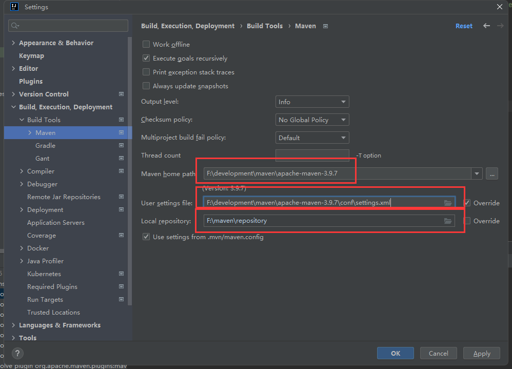

# 一、Maven概述

## 1.传统构建Java项目

在了解Maven之前，我们先来看看构建一个Java项目所需的步骤和资源。

1. **依赖包管理**：确定并引入所需的依赖包。例如，如果项目需要用到commons logging，我们需要下载并将commons logging的jar包放入classpath。手动管理这些依赖包可能会变得复杂且容易出错。
    
2. **项目目录结构**：需要规划项目的目录结构。例如，`src`目录用于存放Java源码，`resources`目录用于存放配置文件，`bin`目录用于存放编译生成的`.class`文件。维护这种结构需要一定的规范和组织。
    
3. **环境配置**：配置开发环境，例如确定JDK的版本、编译打包的流程、当前代码的版本号等。这些配置对于项目的正确构建和运行至关重要。
    
4. **编译与构建**：除了使用Eclipse等IDE进行编译外，还必须能通过命令行工具进行编译。这是为了确保项目能够在独立的服务器上进行编译、测试和部署。这些操作必须能够在没有IDE支持的情况下独立完成。

上述工作虽然并不难，但却非常琐碎且耗时。如果每一个项目都需要单独配置，难免会导致混乱和效率低下。

为了应对这些挑战，我们需要一个标准化的Java项目管理和构建工具。

## 2.Maven

Maven是基于POM概念，专门为Java项目打造的管理和构建工具，它的主要功能包括：

- **标准化的项目结构**：Maven提供了一套约定的项目结构，使得所有使用Maven的项目都有一致的目录布局和组织方式，简化了项目的维护和管理。

- **标准化的构建流程**：Maven定义了一套标准化的构建流程，包括编译、测试、打包、发布等步骤。这些步骤可以通过Maven命令一键执行，大大简化了构建过程。

- **依赖管理机制**：Maven提供了强大的依赖管理功能。通过在项目的`pom.xml`文件中声明依赖，Maven会自动下载并管理这些依赖包，解决了手动管理依赖的麻烦和错误风险。

## 3.Maven项目结构

一个使用Maven管理的普通的Java项目，它的目录结构默认如下：


项目的根目录`a-maven-project`是项目名，它有一个项目描述文件`pom.xml`，存放Java源码的目录是`src/main/java`，存放资源文件的目录是`src/main/resources`，存放测试源码的目录是`src/test/java`，存放测试资源的目录是`src/test/resources`，最后，所有编译、打包生成的文件都放在`target`目录里。这些就是一个Maven项目的标准目录结构。

## 4.Maven安装

> 参考：[maven的下载安装配置教程（详细图文） - 砰砰的猿 - 博客园 (cnblogs.com)](https://www.cnblogs.com/pengpengdeyuan/p/14217772.html)

## 5.仓库

默认的远程中央仓库：https://mvnrepository.com/，一般使用镜像源，如阿里云。

可以选择设置本地仓库，指远程仓库的一份资源缓存。


## 6.工程类型

### （1）pom.xml文件

`pom.xml`（Project Object Model）是Maven项目的核心配置文件，用于定义项目的基本信息、依赖关系、插件、构建配置等。

```xml
<?xml version="1.0" encoding="UTF-8"?>
<project xmlns="http://maven.apache.org/POM/4.0.0"
         xmlns:xsi="http://www.w3.org/2001/XMLSchema-instance"
         xsi:schemaLocation="http://maven.apache.org/POM/4.0.0 http://maven.apache.org/xsd/maven-4.0.0.xsd">
    
    <!-- 模型版本 -->
    <modelVersion>4.0.0</modelVersion>
    <!-- 项目组ID -->
    <groupId>com.lxy</groupId>
    <!-- 项目ID -->
    <artifactId>maven-study-all</artifactId>
    <!-- 项目版本 -->
    <version>1.0-SNAPSHOT</version>
    <!-- 项目属性配置 -->
    <properties>
        <!-- 编译器源版本 -->
        <maven.compiler.source>8</maven.compiler.source>
        <!-- 编译器目标版本 -->
        <maven.compiler.target>8</maven.compiler.target>
        <!-- 项目构建的源码编码 -->
        <project.build.sourceEncoding>UTF-8</project.build.sourceEncoding>
    </properties>

</project>

```


### （2）POM（Project Object Model）工程

- POM工程主要是作为一个==项目聚合的方式==。它通常不包含源代码，而是定义了一组模块（子项目），使得这些模块可以被一起构建。
- 通过一个单一的POM文件来管理多个模块或项目的依赖版本。
- POM工程的`packaging`类型在`pom.xml`中被设置为`pom`。

示例

```xml
<?xml version="1.0" encoding="UTF-8"?>
<project xmlns="http://maven.apache.org/POM/4.0.0"
         xmlns:xsi="http://www.w3.org/2001/XMLSchema-instance"
         xsi:schemaLocation="http://maven.apache.org/POM/4.0.0 http://maven.apache.org/xsd/maven-4.0.0.xsd">
    
    <modelVersion>4.0.0</modelVersion>  
    <groupId>com.lxy</groupId>
    <artifactId>beacon-cloud</artifactId>
    <version>1.0-SNAPSHOT</version>    
    <!-- 打包类型 -->
    <packaging>pom</packaging>
    
    <!-- 父项目配置 -->
    <parent>
        <groupId>org.springframework.boot</groupId>
        <artifactId>spring-boot-starter-parent</artifactId>
        <version>2.3.12.RELEASE</version>
        <!-- 相对路径 -->
        <relativePath />
    </parent>
    
    <!-- 项目属性配置 -->
    <properties>
        <spring.cloud-version>Hoxton.SR12</spring.cloud-version>
        <spring.cloud.alibaba-version>2.2.6.RELEASE</spring.cloud.alibaba-version>
    </properties>
    
    <!-- 依赖管理 -->
    <dependencyManagement>
        <dependencies>
            <dependency>
                <groupId>org.springframework.cloud</groupId>
                <artifactId>spring-cloud-dependencies</artifactId>               
                <!-- 依赖版本 -->
                <version>${spring.cloud-version}</version>                
                <!-- 依赖类型 -->
                <type>pom</type>                
                <!-- 依赖范围 -->
                <scope>import</scope>
            </dependency>
            <dependency>
                <groupId>com.alibaba.cloud</groupId>
                <artifactId>spring-cloud-alibaba-dependencies</artifactId>
                <version>${spring.cloud.alibaba-version}</version>
                <type>pom</type>
                <scope>import</scope>
            </dependency>
        </dependencies>
    </dependencyManagement>

</project>

```


### （3）JAR（Java Archive）工程

- JAR工程是最常见的Java项目类型之一，用于==生成Java库或应用程序==。
- 这种类型的项目包含Java类和其他资源（如图片、文本等），并将它们打包成`.jar`文件，这样可以轻松地被Java环境执行或作为库被其他项目引用。
- JAR工程的`packaging`类型在`pom.xml`中被设置为`jar`。

### （4）WAR（Web Application Archive）工程

- WAR工程用于==开发Java Web应用程序==。它包含Servlet、JSP、JavaScript、CSS、图像等Web资源。
- 与JAR相比，WAR包含了专门用于Web应用的结构和文件，如`WEB-INF`目录下的`web.xml`部署描述文件。
- 打包时，这些资源被打包成一个`.war`文件，可以被部署到任何Java EE兼容的Web服务器上（如Tomcat、Jetty等）。
- WAR工程的`packaging`类型在`pom.xml`中被设置为`war`。

## 7.工程关系

Maven工具基于POM模式实现的。在Maven中每个项目都相当于是一个对象，对象（项目）和对象（项目）之间是有关系的。关系包含了：依赖、继承、聚合，实现Maven项目可以更加方便的实现导jar包、拆分项目等效果。

### （1）依赖关系

Maven允许项目定义其他项目（或库）作为其依赖。通过声明依赖关系，Maven会自动下载并管理这些依赖项。例如，如果项目A依赖于库B和库C，Maven会自动下载B和C的jar包并将它们加入到项目A的classpath中。这极大地简化了依赖管理的复杂性和工作量。

```xml
<dependencies>
        <dependency>
            <groupId></groupId>
            <artifactId></artifactId>
            <version></version>
        </dependency>
    </dependencies>
```

### （2）继承关系

Maven允许项目从另一个项目继承配置。这种继承机制使得多个项目可以共享相同的配置，减少重复配置的工作量。例如，子项目可以继承父项目中定义的依赖和插件配置，从而实现配置的复用和集中管理。

```xml
<parent>
        <groupId></groupId>
        <artifactId></artifactId>
        <version></version>
    </parent>
```

### （3）聚合关系

Maven支持项目聚合（multi-module project），即一个父项目可以聚合多个子项目。这使得可以在一个父项目中管理多个相关子项目，方便进行整体构建和版本控制。例如，一个大型的企业级应用可以拆分为多个模块，每个模块对应一个子项目，由一个父项目统一管理。

```xml
<modules>
        <module></module>
        <module></module>
        <module></module>
    </modules>
```


# 二、IDEA集成Maven

> 前提：Maven已配置好环境变量，本地仓库、镜像源、JDK版本

创建一个Maven项目


目录结构如下：


设置下载的Maven，指定配置文件和本地仓库



# 三、插件（Plugins）

## 1. 编译器插件

Maven Compiler Plugin负责将Java源代码编译为字节码。它允许指定编译器版本、编码和其他编译选项。

示例配置：在pom.xml配置

```xml
<build>
    <plugins>
        <plugin>
            <groupId>org.apache.maven.plugins</groupId>
            <artifactId>maven-compiler-plugin</artifactId>
            <version>3.8.1</version>
            <configuration>
                <source>1.8</source> <!-- 源代码版本 -->
                <target>1.8</target> <!-- 目标字节码版本 -->
                <encoding>UTF-8</encoding> <!-- 源代码文件编码 -->
            </configuration>
        </plugin>
    </plugins>
</build>
```

也可以在setting,xml进行全局配置

```xml
 <profile>
                <id>jdk-1.8</id>
                <activation>
                                <activeByDefault>true</activeByDefault>
                                <jdk>1.8</jdk>
                </activation>
                <properties>
                        <!-- 配置编译器信息 -->
                        <maven.compiler.source>1.8</maven.compiler.source>
                        <maven.compiler.target>1.8</maven.compiler.target>
                        <maven.compiler.compilerVersion>1.8</maven.compiler.compilerVersion>
                </properties>
  </profile>
```

## 2. 资源拷贝插件

Maven Resources Plugin用于将资源文件（如配置文件、静态资源）从源码目录复制到目标目录。这在打包和部署时非常有用。

示例配置：

```xml
<build>
    <plugins>
        <plugin>
            <groupId>org.apache.maven.plugins</groupId>
            <artifactId>maven-resources-plugin</artifactId>
            <version>3.2.0</version>
            <executions>
                <execution>
                    <id>copy-resources</id>
                    <phase>process-resources</phase> <!-- 在资源处理阶段执行 -->
                    <goals>
                        <goal>copy-resources</goal>
                    </goals>
                    <configuration>
                        <outputDirectory>${project.build.directory}/classes</outputDirectory> <!-- 目标目录 -->
                        <resources>
                            <resource>
                                <directory>src/main/resources</directory> <!-- 资源文件目录 -->
                                <includes>
                                    <include>**/*</include> <!-- 包含所有资源文件 -->
                                </includes>
                            </resource>
                        </resources>
                    </configuration>
                </execution>
            </executions>
        </plugin>
    </plugins>
</build>
```

- `<phase>`：指定插件在构建生命周期的哪个阶段执行。
- `<outputDirectory>`：指定资源文件复制的目标目录。
- `<directory>`：指定资源文件的源目录。
- `<includes>`：指定要包含的资源文件模式。

## 3. Tomcat插件

Maven Tomcat Plugin用于将Web应用程序部署到Tomcat服务器。它可以在开发过程中简化部署和测试。

示例配置：

```xml
<build>
    <plugins>
        <plugin>
            <groupId>org.apache.tomcat.maven</groupId>
            <artifactId>tomcat7-maven-plugin</artifactId>
            <version>2.2</version>
            <configuration>
                <url>http://localhost:8080/manager/text</url> <!-- Tomcat管理URL -->
                <server>TomcatServer</server> <!-- 在settings.xml中配置的服务器 -->
                <path>/myapp</path> <!-- 部署路径 -->
            </configuration>
        </plugin>
    </plugins>
</build>
```

- `<url>`：指定Tomcat管理URL。
- `<server>`：在`settings.xml`文件中配置的服务器ID，用于身份验证。
- `<path>`：指定Web应用程序的部署路径。

通过使用这些插件，Maven可以自动化编译、资源管理和部署任务，提高开发和运维的效率。


