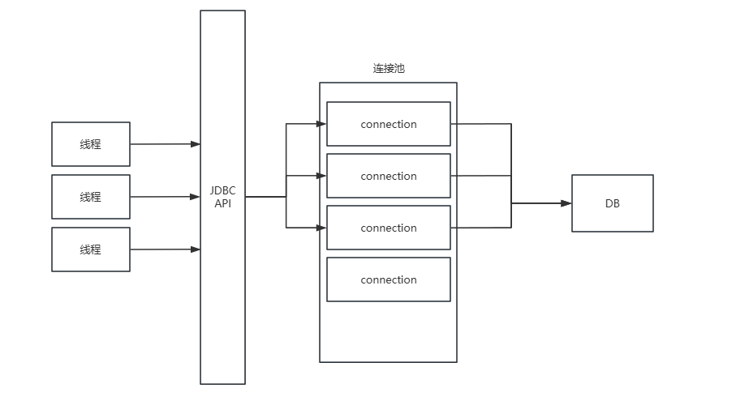

前言：在数字时代，数据库成为现代应用程序不可或缺的核心组成部分。不论是 Web 应用、移动应用还是桌面应用，它们几乎都需通过数据库来存储和检索数据。Java 通过 JDBC（Java Database Connectivity）提供了一种强大的与数据库交互的方式。本文将全面探讨 JDBC，从基础概念到实战编程示例，帮助您深入理解并有效使用 JDBC。

# 一、什么是 JDBC？

JDBC（Java Database Connectivity）是 Java 语言的一种数据库访问接口，它为不同类型的关系数据库提供了一套统一的访问方式。其核心设计理念在于提供一个独立于具体数据库实现的 API，使得 Java 应用可以与任何支持 JDBC 驱动的数据库交互。这种设计使开发者能编写独立于数据库的代码，极大提升了代码的可移植性和重用性。


## JDBC 架构

为了更好地理解 JDBC 的实际应用，我们首先需要了解其基础架构。JDBC 架构主要包括两部分：JDBC API 和 JDBC 驱动程序。

## JDBC API

JDBC API 是 Java 提供的一组接口和类，主要用于实现数据库连接和执行操作。这些接口和类被归纳在 `java.sql` 和 `javax.sql` 包中。

以下是 JDBC API 中的一些核心接口和类：

- `DriverManager`：负责管理数据库驱动程序的类，主要用于建立数据库连接。
- `Connection`：代表与数据库的连接，可以用来创建 `Statement` 对象。
- `Statement`：用于执行 SQL 查询的接口。
- `PreparedStatement`：继承自 `Statement`，用于执行预编译 SQL 查询，提高性能和安全性。
- `CallableStatement`：继承自 `PreparedStatement`，专用于执行数据库存储过程。
- `ResultSet`：表示 SQL 查询结果的接口，用于从数据库检索数据。

## JDBC 驱动程序

JDBC 驱动程序是由各个数据库供应商提供的，用于实现 JDBC API 的具体类库。每个数据库供应商都必须提供自己的 JDBC 驱动程序，以使 Java 应用能够与其数据库通信。

JDBC 驱动程序主要分为四种类型：

1. **JDBC-ODBC 桥接驱动程序**：通过 ODBC（Open Database Connectivity）桥接让 Java 应用连接到数据库。通常不推荐使用，因为它依赖于操作系统的 ODBC 驱动程序。
2. **本地 API 驱动程序**：利用数据库供应商的本地库连接数据库，每个平台都需要安装专门的驱动程序。
3. **网络协议驱动程序**：通过一个中间层服务器转发 JDBC 请求来与数据库通信。这种驱动程序通常完全用 Java 实现，无需在客户端安装特定的数据库驱动。
4. **纯 Java 驱动程序**：完全由 Java 编写，不依赖于本地库，是使用最广泛的 JDBC 驱动类型。

以上内容为您提供了关于 JDBC 的全面介绍，接下来的章节将通过具体的编程示例展示如何使用 JDBC。

# 二、JDBC 编程示例

在开始编程之前，确保您的开发环境已经配置好 IDEA 和 Maven。这两个工具将帮助我们更高效地管理项目和依赖。

## 引入 JDBC 依赖

首先，在项目的 `pom.xml` 文件中添加 `mysql-connector-j` 依赖项，这是 MySQL 的官方 JDBC 驱动。

使用 `mysql-connector-j` 而不是 `mysql-connector-java` 主要是出于命名一致性和更新策略的考虑以及Spring Boot 2.7.8 中 mysql-connector-java 不再由依赖管理来管理。

```xml
<dependency>
    <groupId>com.mysql</groupId>
    <artifactId>mysql-connector-j</artifactId>
    <version>8.3.0</version>
</dependency>
```

## 加载和注册 JDBC 驱动

在 Java 程序中，驱动的加载和注册是建立数据库连接的首要步骤。

```java
//加载驱动
Driver driver = new com.mysql.cj.jdbc.Driver();
//注册驱动
DriverManager.registerDriver(driver);
```

观察 `com.mysql.cj.jdbc.Driver` 类，发现它在内部通过静态代码块已经处理了自动注册：

```java
public class Driver extends NonRegisteringDriver implements java.sql.Driver {
    static {
        try {
            DriverManager.registerDriver(new Driver());
        } catch (SQLException e) {
            throw new RuntimeException("Can't register driver!");
        }
    }
}
```

因此，通常情况下，我们可以通过简单的 `Class.forName()` 来自动加载驱动，尤其是在新版 JDBC 中，这一步骤可能已被省略。

```java
Class.forName("com.mysql.cj.jdbc.Driver");
```

## 建立数据库连接

使用 `DriverManager.getConnection()` 方法来与数据库建立连接，这需要数据库的 URL、用户名和密码。

```java
String url = "jdbc:mysql://localhost:3306/数据库名";
String username = "用户名";
String password = "密码";
Connection conn = DriverManager.getConnection(url, username, password);
```

URL 格式解释：

- 协议：`jdbc:mysql`
- IP 地址：`localhost`
- 端口号：`3306`
- 数据库名：`mydb`
- 参数：
  - `useSSL=false`：指定连接时不使用 SSL 加密。
  - `useUnicode=true`：允许 JDBC 使用 Unicode 字符集。
  - `characterEncoding=UTF-8`：设置字符编码为 UTF-8。
  - `serverTimezone=Asia/Shanghai`：设置服务器时区为亚洲/上海。
  - `allowPublicKeyRetrieval=true`：允许从服务器检索公钥。


完整的连接字符串示例：

```java
jdbc:mysql://127.0.0.1:3306/mydb?useSSL=false&useUnicode=true&characterEncoding=UTF-8&serverTimezone=Asia/Shanghai&allowPublicKeyRetrieval=true
```

## 执行SQL 语句

创建 `Statement` 或 `PreparedStatement` 对象来执行 SQL 语句。

与普通的 `Statement` 相比，`PreparedStatement` 的主要优势在于提高性能和安全性，特别是在执行参数化查询时。这些查询是通过在 SQL 语句中使用占位符（通常是问号 `?`）来构建的，然后在执行前用实际的参数值替换这些占位符。

```java
Statement stmt = conn.createStatement();
PreparedStatement pstmt = conn.prepareStatement("SELECT * FROM 表名 WHERE 列名 = ?");
pstmt.setString(1, "某值");
```

封装了相关CURD的方法，并将结果返回`ResultSet`对象

```java
ResultSet rs = stmt.executeQuery("SELECT * FROM 表名");
int rowsAffected = stmt.executeUpdate("INSERT INTO 表名 (列1, 列2) VALUES (值1, 值2)");
```

在 `ResultSet` 中，使用 `next()` 遍历数据，并通过 `get` 方法检索数据。

```java
while (rs.next()) {
    String columnData = rs.getString("column_name");
    // 处理数据
}
```

## 清理资源&异常处理

操作完成后，应关闭所有资源，如 `ResultSet`、`Statement` 和 `Connection`。

在整个数据库操作过程中，应妥善处理 `SQLException` 异常，通常通过 `try-catch` 结构实现。

以上就是使用 JDBC 连接和操作 MySQL 数据库的完整过程。通过这个示例，您可以看到 JDBC 的强大功能和灵活性。在开发过程中，适当地使用这些技术可以大大提高您的开发效率和应用的稳定性。

# 三、JDBC API详解

## DriverManager

`DriverManager` 是 JDBC 的管理层，负责管理数据库驱动程序的列表。它可以动态加载数据库驱动，并为应用程序提供数据库连接。

**主要方法**：

- `getConnection(String url)`：尝试建立到给定数据库 URL 的连接。
- `getConnection(String url, Properties info)`：使用给定的属性尝试建立到数据库 URL 的连接。
- `getConnection(String url, String user, String password)`：使用用户名和密码尝试建立到数据库 URL 的连接。

## Connection

`Connection` 接口代表数据库上下文，即对数据库的连接。通过这个连接，应用程序可以执行SQL语句、管理事务等。

**主要方法**：

- `close()`：关闭数据库连接。
- `createStatement()`：创建一个 `Statement` 对象以发送 SQL 语句到数据库。
- `prepareCall(String sql)`：创建一个 `CallableStatement` 对象以调用数据库存储过程。
- `prepareStatement(String sql)`：创建一个 `PreparedStatement` 对象以发送参数化的 SQL 语句到数据库。
- `commit()`：提交当前事务。
- `rollback()`：回滚当前事务。
- `setAutoCommit(boolean autoCommit)`：设置此连接的自动提交模式。

## Statement

`Statement` 是用于执行静态 SQL 语句并返回它所生成结果的接口。

**主要方法**：

- `executeQuery(String sql)`：执行 SQL 查询并返回 `ResultSet`。
- `executeUpdate(String sql)`：执行 INSERT、UPDATE、或 DELETE 操作，返回受影响的行数。

## PreparedStatement

`PreparedStatement` 接口是 `Statement` 的子接口，它表示预编译的 SQL 语句。这种方式比 `Statement` 更有效，通常用于执行参数化的 SQL 查询。

**主要方法**：

**设置参数**

- `setInt(int parameterIndex, int x)`: 设置指定参数的值为 Java `int` 数据类型。
- `setString(int parameterIndex, String x)`: 设置指定参数的值为 Java `String` 数据类型。
- `setDouble(int parameterIndex, double x)`: 设置指定参数的值为 Java `double` 数据类型。
- `setDate(int parameterIndex, Date x)`: 设置指定参数的值为 Java `Date` 数据类型。
- `setObject(int parameterIndex, Object x)`: 设置指定参数的值为 Java `Object` 数据类型，这是一个通用的设置方法，可以用于各种数据类型。

**执行 SQL 语句**

- `execute()`: 执行任何类型的 SQL 语句。返回 `true` 如果第一个结果是一个 `ResultSet` 对象；返回 `false` 如果第一个结果是更新计数或者没有结果。
- `executeQuery()`: 执行 SQL 查询并返回 `ResultSet` 对象。
- `executeUpdate()`: 执行 SQL 语句，如 INSERT、UPDATE 或 DELETE；返回一个整数，表示受影响的行数。

**批量更新**

这些方法用于执行批处理命令，可以一次执行多个更新操作，提高执行效率：

- `addBatch()`: 将一组参数添加到此 `PreparedStatement` 对象的批处理命令中。
- `executeBatch()`: 执行批处理命令。

## ResultSet

`ResultSet` 接口表示数据库查询结果。它是执行查询后返回的一组数据，可以通过一系列的方法来访问和操作这些数据。

**主要方法**：

- `next()`：将光标从当前位置向下移动一行，用于遍历结果集。
- `close()`：关闭 `ResultSet` 对象，释放相关资源。
- `getInt(int colIndex)`, `getString(int colIndex)` ：获取当前行的指定列的值。

# 四、SQL注入

## 什么是SQL注入

在学习 JDBC 的基本用法后，我们常会发现，直接使用 `Statement` 执行 SQL 语句虽然简单，但隐藏着严重的安全隐患——SQL 注入。下面通过一个用户登录的实例来探讨这个问题。

假设有一个简单的用户登录功能，后端代码如下：

```java
public static Account getAccount(String userName, String passWord) {
    // 创建语句对象
    Statement statement = connection.createStatement();
    // 执行SQL语句
    ResultSet resultSet = statement.executeQuery("SELECT * FROM account WHERE username='" + userName + "' AND password='" + passWord + "'");
    while (resultSet.next()) {
        int id = resultSet.getInt("id");
        String username = resultSet.getString("username");
        String password = resultSet.getString("password");
        Account account = new Account(id, username, password);
        System.out.println(account);
    }
    return account;
}

public static void main(String[] args) {
    Scanner sc = new Scanner(System.in);
    System.out.print("输入账号:");
    String userName = sc.next();
    System.out.print("输入密码:");
    String passWord = sc.next();
    Account account = getAccount(userName, passWord);
    System.out.println(account == null ? "登录失败" : "登录成功");
}
```

在测试中，如果用户输入一个精心设计的用户名和密码，他们可以绕过登录验证，即使提供的凭据是错误的。这种情况说明登录功能形同虚设，背后的原因是 SQL 注入风险。攻击者可以通过在输入中包含 SQL 代码片段，破坏原有的 SQL 语句逻辑，从而执行恶意操作。


SQL 注入是一种代码注入技术，它利用了应用程序中的安全漏洞，允许攻击者将恶意的 SQL 代码插入后端数据库查询中。这种攻击可以用来绕过安全措施，访问、修改甚至删除数据库中的数据，有时甚至能够完全控制或破坏受影响的系统。

解决 SQL 注入的有效方法是使用 `PreparedStatement`。

## 预防SQL注入

`PreparedStatement` 是一种在执行 SQL 语句前预编译它们的方法。当你使用 `PreparedStatement` 时，SQL 语句在发送到数据库之前就已经编译了，只是留下了一些参数位置（用问号 `?` 表示），这些参数稍后会被安全地绑定到编译好的语句中。这就是为什么 `PreparedStatement` 可以有效防止 SQL 注入的原因：

- **参数隔离**：使用 `PreparedStatement` 时，所有的输入参数都是作为绑定值传递给已经预编译的 SQL 语句的。这些参数不会被直接解释为 SQL 代码的一部分，因此恶意的 SQL 代码注入到参数中也不会被执行。

- **转义处理**：当使用如 `setString()` 方法设置参数值时，任何可能破坏 SQL 查询结构的字符（如单引号）都会被自动转义。例如，如果用户输入包含单引号（如 O'Reilly），`PreparedStatement` 会自动将其转义，确保这个值不会改变 SQL 命令的结构，而是被视为普通字符处理。

以下是使用 `PreparedStatement` 改写上述登录功能的示例：

```java
public static Account getAccount(String userName, String passWord) {
    // 预编译 SQL 语句
    PreparedStatement pstmt = connection.prepareStatement("SELECT * FROM account WHERE username=? AND password=?");
    // 设置参数
    pstmt.setString(1, userName);
    pstmt.setString(2, passWord);
    // 执行查询
    ResultSet resultSet = pstmt.executeQuery();
    Account account = null;
    while (resultSet.next()) {
        int id = resultSet.getInt("id");
        String username = resultSet.getString("username");
        String password = resultSet.getString("password");
        account = new Account(id, username, password);
        System.out.println(account);
    }
    return account;
}
```

通过这种方式，我们可以确保应用程序的安全性，避免 SQL 注入风险，保护敏感数据不受攻击者侵害。

理解 SQL 注入的风险并采取适当的预防措施是每个开发者的责任。通过使用 `PreparedStatement`，我们不仅提升了应用程序的安全性，还增强了代码的健壮性和维护性。让我们在开发过程中始终保持警惕，防范潜在的安全威胁。

当我们在 Java 程序中使用 `PreparedStatement`，实际上是在利用数据库管理系统提供的预编译功能。

## 什么是预编译

预编译是许多关系数据库管理系统（例如 MySQL）提供的一项功能。预编译的 SQL 语句意味着 SQL 语句在第一次执行前，其结构已经被编译并优化了。这个过程中，SQL 语句被分析、编译，并有可能被缓存，以便后续的执行更为高效。

当 SQL 语句被预编译后，后续只需传入参数即可重复执行，这样做有几个好处：

- **性能提升**：由于 SQL 语句只需编译一次，后续的执行只需要传入不同的参数，减少了编译的时间，提高了执行效率。
- **安全性增强**：预编译的语句使用参数占位符，这样可以有效防止 SQL 注入攻击，因为外部输入被视为参数，而不是 SQL 代码的一部分。

`PreparedStatement` 是 JDBC API 提供的一个接口，它允许开发者利用上述的预编译语句的好处。当我们使用 `PreparedStatement` 时，实际上是在告诉 JDBC 驱动程序将这个 SQL 语句发送到数据库进行预编译。随后，可以多次执行这个语句，只需改变参数。

MySQL数据库`PreparedStatement`执行流程如下：

1. **预编译**：当创建一个 `PreparedStatement` 对象并指定一个 SQL 语句时，该语句被发送到数据库服务器进行预编译。这个步骤涉及解析 SQL 语句、进行语法检查、优化查询计划等。预编译的结果是一个已编译的查询计划，它被存储在数据库服务器上待后续使用。
2. **参数绑定**：在执行 `PreparedStatement` 时，您可以通过提供参数值来“填充” SQL 语句中的占位符（通常是问号 `?`）。这些参数不会重新解析 SQL 语句，因此不会改变查询结构或触发额外的编译过程。
3. **执行**：执行预编译的 SQL 语句时，数据库服务器可以直接使用之前创建的查询计划。由于省略了编译步骤，执行速度通常比普通的 `Statement` 快。

**注意**：从MySQL 8.0开始，查询缓存功能已被移除，因为在高并发场景下它可能导致性能问题。

# 五、高级应用

## 批处理

在数据库编程中，批处理是一种非常有效的技术，尤其适用于需要大量插入或更新操作的场景。使用 `PreparedStatement` 的批处理功能，可以在单次数据库会话中执行大量 SQL 语句，这不仅可以减少网络交互次数，还能显著提高整体的数据处理性能。

为了充分利用批处理的优势，首先需要确保在数据库连接 URL 中启用相关参数。例如，对于 MySQL，可以在连接字符串中添加 `&rewriteBatchedStatements=true` 参数来优化批处理操作。

假设我们需要向名为 `dept` 的表中插入 10628 条数据。以下是如何使用 `PreparedStatement` 进行批处理的步骤：

```java
// 创建 SQL 插入语句，使用占位符代表将要插入的字段
String sql = "INSERT INTO dept VALUES (DEFAULT, ?, ?)";
// 获取 PreparedStatement 对象
PreparedStatement preparedStatement = connection.prepareStatement(sql);

for (int i = 0; i < 10628; i++) {
    // 为每个占位符设置具体的值
    preparedStatement.setString(1, "name" + i);
    preparedStatement.setString(2, "local" + i);
    
    // 将当前设置的参数添加到批处理中
    preparedStatement.addBatch();
    
    // 每累积1000条命令后执行一次批处理
    if ((i % 1000) == 0) {
        // 执行批处理，并返回每条命令的执行结果
        int[] results = preparedStatement.executeBatch();
        // 清空当前批处理命令集，准备下一轮添加
        preparedStatement.clearBatch();
    }
}

// 执行最后一批数据（不足1000条的部分）
int[] finalResults = preparedStatement.executeBatch();
preparedStatement.clearBatch();
```

- **错误处理**：`executeBatch` 返回的数组中，每个元素对应一条 SQL 命令的执行结果。常见的返回值包括 `Statement.SUCCESS_NO_INFO`（-2，表示成功但没有具体信息）和 `Statement.EXECUTE_FAILED`（-3，表示执行失败）。应适当处理这些返回值，确保数据的完整性和一致性。
- **资源管理**：确保在数据处理完成后，及时关闭 `PreparedStatement` 和数据库连接，以释放系统资源。

## 事务

事务是数据库操作中非常关键的一个概念，用于确保数据的完整性和一致性。在 JDBC 中，事务处理是通过控制 SQL 语句的提交和回滚来实现的。下面，我们将通过两个示例详细介绍如何在 Java 中使用 JDBC 管理事务。

在 JDBC 中，默认情况下，每条 SQL 语句执行完毕后都会自动提交。如果想手动控制这个过程，首先需要关闭自动提交模式：

```java
connection.setAutoCommit(false);
```

### 示例：转账操作的事务管理

假设有一个转账操作，涉及到两个账户。为了保证操作的原子性，我们使用事务确保要么两个操作都成功，要么都不执行。

```java
try {
    connection = DriverManager.getConnection(url, user, password);
    // 取消自动提交
    connection.setAutoCommit(false);

    String sql = "UPDATE account SET money = money + ? WHERE username = ?";
    PreparedStatement preparedStatement = connection.prepareStatement(sql);

    // 转入操作
    preparedStatement.setInt(1, 50);
    preparedStatement.setString(2, "lisi");
    preparedStatement.executeUpdate();

    // 制造异常，模拟转账过程中可能出现的错误
    int a = 3 / 0; // 这将引发除零错误

    // 转出操作
    preparedStatement.setInt(1, -50);
    preparedStatement.setString(2, "zhangsan");
    preparedStatement.executeUpdate();

} catch (Exception e) {
    // 发生错误，回滚事务
    connection.rollback();
} finally {
    // 提交事务
    connection.commit();
    connection.close();
}
```

在长事务中，设置回滚点（Savepoint）可以非常有用。它允许你在事务的特定点创建一个标记，这样你可以只回滚到这个特定点，而不是整个事务。

### 示例：批量添加数据并设置回滚点

假设一个场景，我们需要批量添加 10628 个部门数据，但希望在出现异常时能够回滚到最近的安全状态。

```java
//存储回滚点
LinkedList<Savepoint> savepoints = new LinkedList<>();
try {
    connection = DriverManager.getConnection(url, user, password);
    connection.setAutoCommit(false);
    String sql = "INSERT INTO dept VALUES (DEFAULT, ?, ?)";
    PreparedStatement preparedStatement = connection.prepareStatement(sql);

    for (int i = 0; i < 10628; i++) {
        preparedStatement.setString(1, "name" + i);
        preparedStatement.setString(2, "local" + i);
        preparedStatement.addBatch();

        if ((i % 1000) == 0) {
            // 在每1000次执行前设置回滚点
            Savepoint sp = connection.setSavepoint();
            savepoints.add(sp);
            preparedStatement.executeBatch();
            preparedStatement.clearBatch();
        }

        // 制造异常
        if (i == 4000) {
            int a = 1 / 0; // 引发异常
        }
    }
    preparedStatement.executeBatch();
    preparedStatement.clearBatch();
} catch (Exception e) {
    // 回滚到最后一个安全的回滚点
    if (!savepoints.isEmpty()) {
        connection.rollback(savepoints.getLast());
    }
} finally {
    // 提交事务
    connection.commit();
}
```

在这个例子中，我们每1000条数据设置一个回滚点，当遇到异常时，可以选择回滚到最后一个回滚点，而不是回滚整个事务。这样，我们就能保留一部分成功的操作，而只撤销导致问题的部分操作。

通过这些示例，可以看出 JDBC 事务处理不仅提供了数据操作的安全性，还通过回滚点的使用提高了操作的灵活性。正确使用事务管理是保证数据库应用稳定、可靠的关键技术之一。

## DAO

DAO，即数据访问对象（Data Access Object），是一种设计模式，用于抽象和封装所有与数据源交互的操作。它将数据访问逻辑与业务逻辑分离，使得业务逻辑不依赖于数据访问逻辑。这样的设计可以使代码更加清晰、易于维护，并提高应用程序的灵活性。


DAO 通常会针对每个实体（或数据表）提供对应的 DAO 类。例如，对于一个名为 `User` 的数据表，通常会有一个名为 `UserDAO` 的类，包括如下方法：

- `addUser(User user)`：添加新用户
- `getUser(int userId)`：根据用户 ID 获取用户信息
- `listUser()`：获取一列用户信息
- `updateUser(User user)`：更新用户信息
- `deleteUser(int userId)`：删除用户

下面是一个员工管理系统的示例

### 实体类

```java
public class Emp implements Serializable {
    private Integer empno;
    private String ename;
    private String job;
    private Integer mgr;
    private Date hiredate;
    private Double sal;
    private Double comm;
    private Integer deptno;
}

```

```java
public class Dept implements Serializable {
    private Integer deptno;
    private String dname;
    private String loc;
}
```

### DAO层接口

```java
//部门
public interface DeptDao {
    List<Dept> listDept();
    int addDept(Dept dept);
}
//员工
public interface EmpDao {
    int addEmp(Emp emp);
    int deleteEmp(int empno);
    List<Emp> listEmps();
    int updateEmp(Emp emp);
}
```

### BaseDaoImpl

```java
public class BaseDaoImpl {
    private static String url="jdbc:mysql://localhost:3306/testdb?useSSL=false&useUnicode=true&characterEncoding=UTF-8&serverTimezone=Asia/Shanghai";
    private static String user="root";
    private static String password="root";
    public int baseUpdate(String sql,Object...args){
        Connection connection = null;
        PreparedStatement preparedStatement=null;
        ResultSet resultSet=null;
        int rows=0;
        try{
            connection = DriverManager.getConnection(url, user,password);
            preparedStatement = connection.prepareStatement(sql);
            for (int i = 1; i <=args.length ; i++) {
                preparedStatement.setObject(i,args[i-1]);
            }
            rows= preparedStatement.executeUpdate();

        }catch (Exception e){
            e.printStackTrace();
        }finally {
            if(null != resultSet){
                try {
                    resultSet.close();
                } catch (SQLException e) {
                    e.printStackTrace();
                }
            }
            if(null != preparedStatement){
                try {
                    preparedStatement.close();
                } catch (SQLException e) {
                    e.printStackTrace();
                }
            }
            if(null != connection){
                try {
                    connection.close();
                } catch (SQLException e) {
                    e.printStackTrace();
                }
            }
        }
        return rows;
    }
    public List baseQuery(Class clazz, String sql, Object ... args){
        Connection connection = null;
        PreparedStatement preparedStatement=null;
        ResultSet resultSet=null;
        ArrayList<Object> list = new ArrayList<>();
        try{
            connection = DriverManager.getConnection(url, user,password);
            preparedStatement = connection.prepareStatement(sql);
            for (int i = 1; i <=args.length ; i++) {
                preparedStatement.setObject(i,args[i-1]);
            }
            resultSet = preparedStatement.executeQuery();
            //设置属性可以访问
            Field[] fields = clazz.getDeclaredFields();
            for (Field field : fields) {
                field.setAccessible(true);
            }

            while (resultSet.next()){
                //通过反射创建对象,因此实体类必须有无参构造器
                Object o = clazz.newInstance();
                for(Field e:fields){
                    String fieldName = e.getName();
                    Object data = resultSet.getObject(fieldName);
                    //修改对象的属性
                    e.set(o,data);
                }
                list.add(o);
            }
        }catch (Exception e){
            e.printStackTrace();
        }finally {
            if(null != resultSet){
                try {
                    resultSet.close();
                } catch (SQLException e) {
                    e.printStackTrace();
                }
            }
            if(null != preparedStatement){
                try {
                    preparedStatement.close();
                } catch (SQLException e) {
                    e.printStackTrace();
                }
            }
            if(null != connection){
                try {
                    connection.close();
                } catch (SQLException e) {
                    e.printStackTrace();
                }
            }
        }
        return list;
    }
}
```

### DAO层实现类

```java
public class DeptDaoImpl extends BaseDao implements DeptDao {

    @Override
    public List<Dept> listDept() {
        String sql="select *from dept ";
        return baseQuery(Dept.class, sql);
    }
    @Override
    public int addDept(Dept dept) {
        String sql="insert into dept values(?,?,?)";
        return baseUpdate(sql,dept.getDeptno(),dept.getDname(),dept.getLoc());
    }
}
```

```java
public class EmpDaoImpl extends BaseDao implements EmpDao {
    public EmpDaoImpl() {
        super();
    }

    @Override
    public int addEmp(Emp emp) {
        String sql="insert into emp values (default,?,?,?,?,?,?,?)";
        return baseUpdate(sql, emp.getEname(),emp.getJob(),emp.getMgr(),emp.getHiredate(),emp.getSal(),emp.getComm(),emp.getDeptno());
    }

    @Override
    public int deleteByEmpno(int empno) {
       String sql="delete from emp where empno=?";
       return baseUpdate(sql,empno);
    }

    @Override
    public List<Emp> listEmps() {
        String sql="select *from emp";
        return baseQuery(Emp.class,sql);
    }

    @Override
    public int updateEmp(Emp emp) {
        String sql="update emp set ename =? ,job=?, mgr =?,hiredate =?,sal=?,comm=?,deptno=? where empno =?";
        return baseUpdate(sql, emp.getEname(),emp.getJob(),emp.getMgr(),emp.getHiredate(),emp.getSal(),emp.getComm(),emp.getDeptno(),emp.getEmpno());
    }
}
```

DAO 是一个非常强大的设计模式，广泛应用于各种规模的软件项目中。它帮助开发者组织和管理数据访问逻辑，提高了代码的可维护性和可测试性，是现代软件开发中不可或缺的一部分。

## 连接池

数据库连接池是一种资源管理技术，用于减少数据库操作中的开销和提高系统性能。连接池在应用程序启动时创建一定数量的数据库连接，并将这些连接保存在一个可用的池中。当应用程序需要进行数据库操作时，它会从池中借用一个连接，使用完毕后再归还给池，而不是每次使用后都关闭连接。

在传统的数据库连接方式中，每次操作数据库时，应用程序都需要：

1. 加载数据库驱动：`Class.forName("com.mysql.cj.jdbc.Driver")`。
2. 创建新的数据库连接：`DriverManager.getConnection(url, username, password)`。
3. 执行SQL语句。
4. 关闭数据库连接。

这种方式虽然简单直接，但在高并发场景下效率极低，因为每次操作都要进行连接的建立和断开，这不仅增加了延迟，也极大地消耗了系统资源。

数据库连接池在应用程序启动时预先创建并维护一定数量的数据库连接对象，这些连接对象被存储在一个连接池中，以备后续使用。

- **减少连接时间**：预先创建的连接减少了每次操作时建立和关闭连接所需的时间。
- **资源利用效率高**：重用数据库连接，避免了频繁创建和销毁连接所消耗的资源。
- **提高并发性能**：在高并发场景下，连接池可以有效管理连接，保证系统的稳定性和响应速度。

### 工作流程



1. **预先创建连接**：应用程序启动时，连接池根据配置预先建立一组数据库连接，这些连接处于待命状态。
2. **连接分配**：当应用程序发起数据库请求时，连接池会分配一个现有的空闲连接给该请求。这避免了每次请求都需要创建和销毁连接的开销。
3. **连接回收**：请求处理完毕后，应用程序通过调用 `close()` 方法并非真正关闭连接，而是将连接返回到连接池中。这样连接就可以被后续的请求重复使用。
4. **动态管理**：连接池可以根据实际的使用情况动态调整池中的连接数量。如果检测到高负载情况，连接池可以自动增加连接数，反之则减少。
5. **等待队列**：如果所有连接都在使用中，新的请求将等待直到有连接变为可用。大多数连接池实现都支持配置最大等待时间，超过该时间请求将被拒绝或抛出异常。

### Druid 连接池

Druid 是 Alibaba 开源的一个数据库连接池，被广泛用于在 Java 应用中管理数据库连接。它提供了强大的监控和扩展功能，比如 SQL 执行日志、详细的监控统计、数据库密码加密等。Druid 的性能稳定，是企业级应用常用的数据库连接池选择之一。

以下是一个使用 Druid 连接池的基本示例，演示如何配置和从池中获取连接。

首先，需要在项目的 `pom.xml` 文件中添加 Druid 的依赖：

```xml
<dependency>
    <groupId>com.alibaba</groupId>
    <artifactId>druid</artifactId>
    <version>1.2.8</version>  <!-- 使用最新版本 -->
</dependency>
```

接下来，配置 Druid 连接池并初始化：

```java
import com.alibaba.druid.pool.DruidDataSource;

import java.sql.Connection;
import java.sql.SQLException;

public class DruidDemo {
    public static void main(String[] args) {
        // 创建 Druid 连接池配置实例
        DruidDataSource dataSource = new DruidDataSource();
        
        // 设置基本连接属性
        dataSource.setUrl("jdbc:mysql://localhost:3306/yourdatabase");
        dataSource.setUsername("yourUsername");
        dataSource.setPassword("yourPassword");

        // 配置初始化大小、最小、最大
        dataSource.setInitialSize(5);
        dataSource.setMinIdle(5);
        dataSource.setMaxActive(20);

        // 配置获取连接等待超时的时间
        dataSource.setMaxWait(60000);

        // 配置间隔多久进行一次检测，检测需要关闭的空闲连接
        dataSource.setTimeBetweenEvictionRunsMillis(60000);

        // 配置连接在池中最小生存的时间
        dataSource.setMinEvictableIdleTimeMillis(300000);

        // 测试连接是否有效
        dataSource.setValidationQuery("SELECT 1");
        dataSource.setTestWhileIdle(true);
        dataSource.setTestOnBorrow(false);
        dataSource.setTestOnReturn(false);

        // 打开PSCache，并且指定每个连接上PSCache的大小
        dataSource.setPoolPreparedStatements(true);
        dataSource.setMaxPoolPreparedStatementPerConnectionSize(20);

        // 配置监控统计拦截的filters
        try {
            dataSource.setFilters("stat"); // 监控统计："stat"；防SQL注入："wall"；日志："log4j"
        } catch (SQLException e) {
            e.printStackTrace();
        }

        // 获取数据库连接
        try (Connection conn = dataSource.getConnection()) {
            // 执行数据库操作
            System.out.println("Successfully connected to the database.");
        } catch (SQLException e) {
            e.printStackTrace();
        }

        // 最后关闭连接池
        dataSource.close();
    }
}
```

在这个示例中，我们首先引入了 Druid 的 Maven 依赖，然后创建了一个 `DruidDataSource` 实例，并进行了详细的配置，包括连接信息、池大小、超时设置、验证查询等。此外，还开启了 SQL 监控功能。通过使用 `dataSource.getConnection()` 获取连接，演示了如何在实际应用中使用 Druid 连接池。最后，务必在应用结束时关闭连接池，以释放资源。


