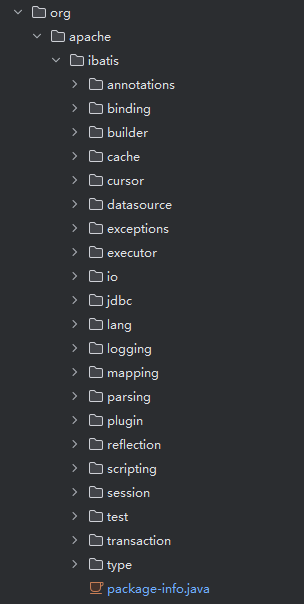
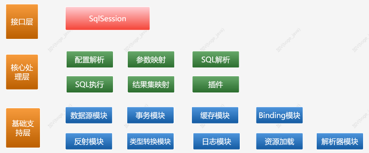
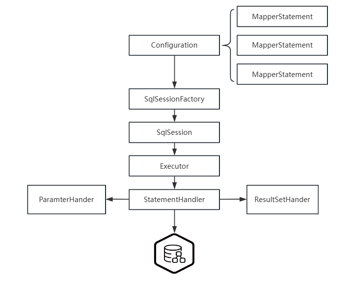
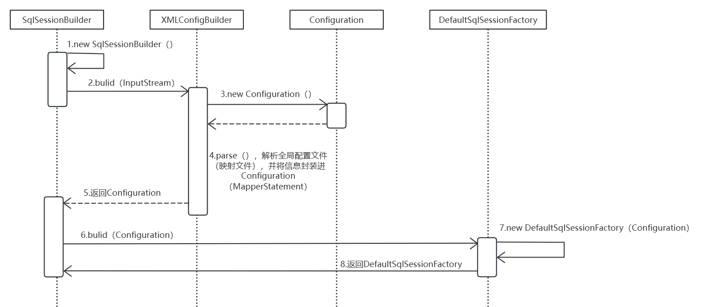
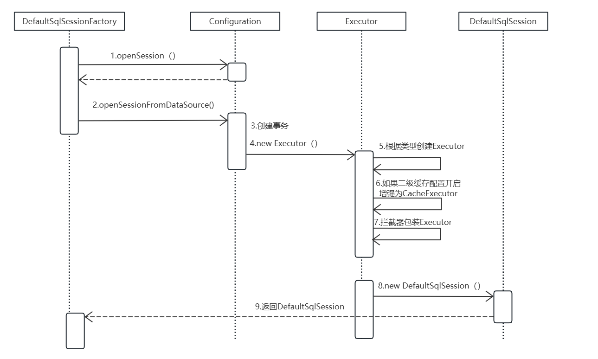
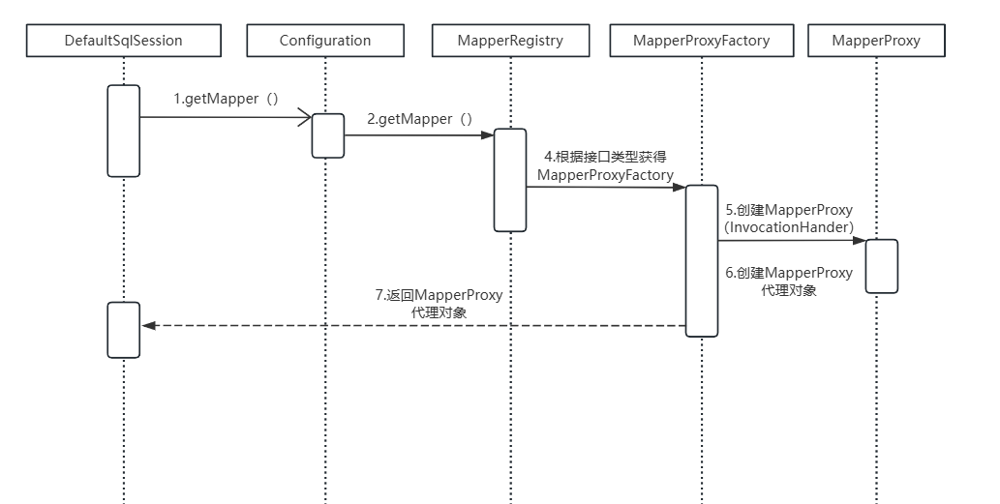

# 一、ORM框架

对象关系映射（ORM）框架的发展是现代软件开发中一个重要的进展，特别是在处理数据库和对象编程语言之间的不匹配问题（即所谓的"对象-关系不匹配"）时。从最初的简单库到今天的成熟框架，ORM技术已经在数据持久化和应用开发中扮演了核心角色。

## 1.ORM框架的发展

### （1）早期的ORM技术

ORM的概念在1990年代初开始获得关注，当时的主要问题是如何将在关系数据库中存储的数据转化为应用程序中使用的对象。最初的解决方案很大程度上依赖于手动编写代码来转换数据表中的行为对象，这一过程既繁琐又易于出错。

### （2）ORM框架的崛起

随着Java和.NET这样的平台的兴起，ORM框架开始逐渐流行。这些框架提供了自动化工具，帮助开发者减少手动处理数据库交互的工作量。例如：

- **Hibernate**：在Java社区，Hibernate成为最受欢迎的ORM框架之一。它提供了丰富的映射能力来处理复杂的关系数据，并支持延迟加载、缓存以及复杂查询功能，极大地简化了数据库操作。
- **Entity Framework**：作为.NET环境的一个回应，Entity Framework提供了一个广泛的模型来处理数据，并支持LINQ查询，使得.NET开发者能够以一种更自然的方式来处理数据库数据。
- **ActiveRecord**：在Ruby社区中，ActiveRecord作为Ruby on Rails框架的一部分，以其简单易用而著称，遵循“约定优于配置”的原则。

### （3）ORM框架的成熟与挑战

随着ORM技术的普及，开发者开始意识到它不仅仅是简化数据库编程的工具。高级功能如二级缓存、事务管理、多版本并发控制和自动迁移工具等，使得ORM框架成为企业应用中不可或缺的一部分。

然而，ORM框架也面临着一些批评和挑战，特别是在性能和复杂性管理方面：
- **性能问题**：ORM框架的抽象层可能隐藏了一些性能陷阱，如N+1查询问题、不恰当的数据抓取策略等。
- **复杂性和学习曲线**：虽然ORM框架简化了很多数据库操作，但它们自身的复杂性也要求开发者投入时间来学习如何正确使用。

## 2.JDBC

## 3.SpringJDBC

## 4.Hibernate

## 5.MyBatis

# 二、MyBatis核心应用

## 1.实际案例

### （1）环境准备

#### ① 导入依赖

```xml
<dependency>
    <groupId>org.mybatis</groupId>
    <artifactId>mybatis</artifactId>
    <version>3.5.4</version>
</dependency>
<dependency>
    <groupId>mysql</groupId>
    <artifactId>mysql-connector-java</artifactId>
    <version>8.0.11</version>
</dependency>
```

#### ② 实体类

```java
public class User {
    private Integer id;
    private String userName;
    private String realName;
    private String password;
    private Integer age;
    private Integer dId;
}
```

#### ③ 全局配置文件

```xml
<?xml version="1.0" encoding="UTF-8" ?>
<!DOCTYPE configuration PUBLIC "-//mybatis.org//DTD Config 3.0//EN" "http://mybatis.org/dtd/mybatis-3-config.dtd">
<configuration>

    <properties resource="db.properties"></properties>
    <settings>
        <!-- 打印查询语句 -->
        <setting name="logImpl" value="STDOUT_LOGGING" />
        <!-- 控制全局缓存（二级缓存），默认 true-->
        <setting name="cacheEnabled" value="false"/>
        <!-- 延迟加载的全局开关。当开启时，所有关联对象都会延迟加载。默认 false  -->
        <setting name="lazyLoadingEnabled" value="true"/>
        <!-- 当开启时，任何方法的调用都会加载该对象的所有属性。默认 false，可通过select标签的 fetchType来覆盖-->
        <setting name="aggressiveLazyLoading" value="true"/>
        <!--  Mybatis 创建具有延迟加载能力的对象所用到的代理工具，默认JAVASSIST -->
        <!--<setting name="proxyFactory" value="CGLIB" />-->
        <!-- STATEMENT级别的缓存，使一级缓存，只针对当前执行的这一statement有效 -->
        <!--
                <setting name="localCacheScope" value="STATEMENT"/>
        -->
        <setting name="localCacheScope" value="SESSION"/>
    </settings>

    <typeAliases>
        <typeAlias alias="user" type="com.boge.domain.User" />
    </typeAliases>

    <environments default="development">
        <environment id="development">
            <transactionManager type="JDBC"/><!-- 单独使用时配置成MANAGED没有事务 -->
            <dataSource type="POOLED">
                <property name="driver" value="${jdbc.driver}"/>
                <property name="url" value="${jdbc.url}"/>
                <property name="username" value="${jdbc.username}"/>
                <property name="password" value="${jdbc.password}"/>
            </dataSource>
        </environment>
    </environments>

    <mappers>
        <mapper resource="mapper/UserMapper.xml"/>
    </mappers>

</configuration>
```

#### ④ 映射文件

```xml
<?xml version="1.0" encoding="UTF-8"?>
<!DOCTYPE mapper PUBLIC "-//mybatis.org//DTD Mapper 3.0//EN" "http://mybatis.org/dtd/mybatis-3-mapper.dtd">
<mapper namespace="com.boge.mapper.UserMapper">
  <resultMap id="BaseResultMap" type="user">
    <id property="id" column="id" jdbcType="INTEGER"/>
    <result property="userName" column="user_name" jdbcType="VARCHAR" />
    <result property="realName" column="real_name" jdbcType="VARCHAR" />
    <result property="password" column="password" jdbcType="VARCHAR"/>
    <result property="age" column="age" jdbcType="INTEGER"/>
    <result property="dId" column="d_id" jdbcType="INTEGER"/>
  </resultMap>

  <select id="selectUserById" resultMap="BaseResultMap" statementType="PREPARED" >
        select * from t_user where id = #{id}
    </select>

  <!-- $只能用在自定义类型和map上 -->
  <select id="selectUserByBean"  parameterType="user" resultMap="BaseResultMap" >
        select * from t_user where user_name = '${userName}'
    </select>

  <select id="selectUserList" resultMap="BaseResultMap" >
        select * from t_user
    </select>
</mapper>
```

#### ⑤ 数据库属性文件

```properties
jdbc.driver=com.mysql.jdbc.Driver
jdbc.url=jdbc:mysql://localhost:3306/mybatisdb?characterEncoding=utf-8&serverTimezone=UTC
jdbc.username=root
jdbc.password=123456
```

### （2）传统开发

```java
@Test
public void test1() throws  Exception{
    // 1.获取配置文件
    InputStream in = Resources.getResourceAsStream("mybatis-config.xml");
    // 2.加载解析配置文件并获取SqlSessionFactory对象
    SqlSessionFactory factory = new SqlSessionFactoryBuilder().build(in);
    // 3.根据SqlSessionFactory对象获取SqlSession对象
    SqlSession sqlSession = factory.openSession();
    // 4.通过SqlSession中提供的 API方法来操作数据库
    List<User> list = sqlSession.selectList("com.boge.mapper.UserMapper.selectUserList");
    for (User user : list) {
        System.out.println(user);
    }
    // 5.关闭会话
    sqlSession.close();
}
```

### （3）代理模式开发

#### ① 接口声明

```java
public interface UserMapper {
    public List<User> selectUserList();
}
```

#### ② getMapper

```java
@Test
public void test2() throws Exception{
    // 1.获取配置文件
    InputStream in = Resources.getResourceAsStream("mybatis-config.xml");
    // 2.加载解析配置文件并获取SqlSessionFactory对象
    SqlSessionFactory factory = new SqlSessionFactoryBuilder().build(in);
    // 3.根据SqlSessionFactory对象获取SqlSession对象
    SqlSession sqlSession = factory.openSession();
    // 4.通过SqlSession中提供的 API方法来操作数据库
    UserMapper mapper = sqlSession.getMapper(UserMapper.class);
    List<User> list = mapper.selectUserList();
    for (User user : list) {
        System.out.println(user);
    }
    // 5.关闭会话
    sqlSession.close();
}
```

## 2.核心配置

### （1）全局配置文件

全局配置文件子元素结构如下：

- configuration（配置）
- properties（属性）
- settings（设置）
- typeAliases（类型别名）
- typeHandlers（类型处理器）
- objectFactory（对象工厂）
- plugins（插件）
- environments（环境配置）
  - environment（环境变量）
    - transactionManager（事务管理器）
    - dataSource（数据源）
- databaseIdProvider（数据库厂商标识）
- mappers（映射器）

#### ① configuration

这是配置文件的根节点，所有的配置项都包含在这里。

#### ② properties 

这部分用于定义外部配置文件的路径，或直接在此配置一些属性。可以在配置文件的其他部分通过 `${propertyName}` 的方式引用这里定义的属性值。

```xml
<properties resource="database.properties">
    <property name="username" value="root"/>
    <property name="password" value="secret"/>
</properties>
```

#### ③ settings

影响 MyBatis 全局行为的细粒度设置，例如缓存、懒加载等。

| 设置参数                         | 描述                                                                                                                                                                                                                                                     | 有效值                                           | 默认值                                                |
| -------------------------------- | :------------------------------------------------------------------------------------------------------------------------------------------------------------------------------------------------------------------------------------------------------- | :----------------------------------------------- | :---------------------------------------------------- |
| cacheEnabled                     | 全局地开启或关闭配置文件中的所有映射器已经配置的任何缓存。                                                                                                                                                                                               | true                                             | false                                                 |
| lazyLoadingEnabled               | 延迟加载的全局开关。当开启时，所有关联对象都会延迟加载。 特定关联关系中可通过设置fetchType属性来覆盖该项的开关状态。                                                                                                                                     | true                                             | false                                                 |
| aggressiveLazyLoading            | 当开启时，任何方法的调用都会加载该对象的所有属性。否则，每个属性会按需加载（参考lazyLoadTriggerMethods).                                                                                                                                                 | true                                             | false                                                 |
| multipleResultSetsEnabled        | 是否允许单一语句返回多结果集（需要兼容驱动）。                                                                                                                                                                                                           | true                                             | false                                                 |
| useColumnLabel                   | 使用列标签代替列名。不同的驱动在这方面会有不同的表现， 具体可参考相关驱动文档或通过测试这两种不同的模式来观察所用驱动的结果。                                                                                                                            | true                                             | false                                                 |
| useGeneratedKeys                 | 允许 JDBC 支持自动生成主键，需要驱动兼容。 如果设置为 true 则这个设置强制使用自动生成主键，尽管一些驱动不能兼容但仍可正常工作（比如 Derby）。                                                                                                            | true                                             | false                                                 |
| autoMappingBehavior              | 指定 MyBatis 应如何自动映射列到字段或属性。 NONE 表示取消自动映射；PARTIAL 只会自动映射没有定义嵌套结果集映射的结果集。 FULL 会自动映射任意复杂的结果集（无论是否嵌套）。                                                                                | NONE, PARTIAL, FULL                              | PARTIAL                                               |
| autoMappingUnknownColumnBehavior | 指定发现自动映射目标未知列（或者未知属性类型）的行为。 NONE: 不做任何反应WARNING: 输出提醒日志('org.apache.ibatis.session.AutoMappingUnknownColumnBehavior' 的日志等级必须设置为 WARN) FAILING: 映射失败 (抛出 SqlSessionException)                      | NONE, WARNING, FAILING                           | NONE                                                  |
| defaultExecutorType              | 配置默认的执行器。SIMPLE 就是普通的执行器；REUSE 执行器会重用预处理语句（prepared statements）； BATCH 执行器将重用语句并执行批量更新。                                                                                                                  | SIMPLE REUSE BATCH                               | SIMPLE                                                |
| defaultStatementTimeout          | 设置超时时间，它决定驱动等待数据库响应的秒数。                                                                                                                                                                                                           | 任意正整数                                       | Not Set (null)                                        |
| defaultFetchSize                 | 为驱动的结果集获取数量（fetchSize）设置一个提示值。此参数只可以在查询设置中被覆盖。                                                                                                                                                                      | 任意正整数                                       | Not Set (null)                                        |
| safeRowBoundsEnabled             | 允许在嵌套语句中使用分页（RowBounds）。如果允许使用则设置为false。                                                                                                                                                                                       | true                                             | false                                                 |
| safeResultHandlerEnabled         | 允许在嵌套语句中使用分页（ResultHandler）。如果允许使用则设置为false。                                                                                                                                                                                   | true                                             | false                                                 |
| mapUnderscoreToCamelCase         | 是否开启自动驼峰命名规则（camel case）映射，即从经典数据库列名 A_COLUMN 到经典 Java 属性名 aColumn 的类似映射。                                                                                                                                          | true\| false                                     | False                                                 |
| localCacheScope                  | MyBatis 利用本地缓存机制（Local Cache）防止循环引用（circular references）和加速重复嵌套查询。 默认值为 SESSION，这种情况下会缓存一个会话中执行的所有查询。 若设置值为 STATEMENT，本地会话仅用在语句执行上，对相同 SqlSession 的不同调用将不会共享数据。 | SESSION\| STATEMENT                              | SESSION                                               |
| jdbcTypeForNull                  | 当没有为参数提供特定的 JDBC 类型时，为空值指定 JDBC 类型。 某些驱动需要指定列的 JDBC 类型，多数情况直接用一般类型即可，比如 NULL、VARCHAR 或 OTHER。                                                                                                     | JdbcType 常量. 大多都为: NULL, VARCHAR and OTHER | OTHER                                                 |
| lazyLoadTriggerMethods           | 指定哪个对象的方法触发一次延迟加载。                                                                                                                                                                                                                     | 用逗号分隔的方法列表。                           | equals,clone,hashCode,toString                        |
| defaultScriptingLanguage         | 指定动态 SQL 生成的默认语言。                                                                                                                                                                                                                            | 一个类型别名或完全限定类名。                     | org.apache.ibatis.scripting.xmltags.XMLLanguageDriver |
| defaultEnumTypeHandler           | 指定 Enum 使用的默认 TypeHandler 。 (从3.4.5开始) 	一个类型别名或完全限定类名。                                                                                                                                                                          | org.apache.ibatis.type.EnumTypeHandler           |                                                       |
| callSettersOnNulls               | 指定当结果集中值为 null 的时候是否调用映射对象的 setter（map 对象时为 put）方法，这对于有 Map.keySet() 依赖或 null 值初始化的时候是有用的。注意基本类型（int、boolean等）是不能设置成 null 的。                                                          | true\| false                                     | false                                                 |
| returnInstanceForEmptyRow        | 当返回行的所有列都是空时，MyBatis默认返回null。 当开启这个设置时，MyBatis会返回一个空实例。 请注意，它也适用于嵌套的结果集 (i.e. collectioin and association)。（从3.4.2开始）                                                                           | true\| false                                     | false                                                 |
| logPrefix                        | 指定 MyBatis 增加到日志名称的前缀。                                                                                                                                                                                                                      | 任何字符串                                       | Not set                                               |
| logImpl                          | 指定 MyBatis 所用日志的具体实现，未指定时将自动查找。                                                                                                                                                                                                    | SLF4J                                            | LOG4J\| LOG4J2 \| JDK_LOGGING \| COMMONS_LOGGING\     |
| proxyFactory                     | 指定 Mybatis 创建具有延迟加载能力的对象所用到的代理工具。                                                                                                                                                                                                | CGLIB\                                           | JAVASSIST                                             |
| vfsImpl                          | 指定VFS的实现                                                                                                                                                                                                                                            | 自定义VFS的实现的类全限定名，以逗号分隔。        | Not set                                               |
| useActualParamName               | 允许使用方法签名中的名称作为语句参数名称。 为了使用该特性，你的工程必须采用Java 8编译，并且加上-parameters选项。（从3.4.1开始）                                                                                                                          | true\| false                                     | true                                                  |
| configurationFactory             | 指定一个提供Configuration实例的类。 这个被返回的Configuration实例用来加载被反序列化对象的懒加载属性值。 这个类必须包含一个签名方法static Configuration getConfiguration(). (从 3.2.3 版本开始)                                                           | 类型别名或者全类名.                              | Not set                                               |

####  ④ typeAliases

为 Java 类型设置一个短的名字，可以在 XML 映射文件中使用。并且预先定义好了很多类型别名，具体在`org.apache.ibatis.type.TypeAliasRegistry`类中，这也是可以使用基本类型别名的原因。

####  ⑤ typeHandlers

指定不同类型之间的转换规则，例如 Java 类型与数据库类型的转换,通过实现`TypeHandler`或继承`BaseTypeHandler`，实现自定义类型处理器。

```xml
<typeHandlers>
    <typeHandler handler="com.example.MyTypeHandler"/>
</typeHandlers>
```

#### ⑥ objectFactory

通过实现 `ObjectFactory` 或继承`DefaultObjectFactory`，可以自定义对象创建的过程。

```xml
<objectFactory type="com.example.MyObjectFactory"/>
```

####  ⑦ plugins

允许你插入自定义行为到 MyBatis 操作数据库的过程中，例如：拦截器。

```xml
<plugins>
    <plugin interceptor="com.example.MyPlugin">
        <property name="someProperty" value="100"/>
    </plugin>
</plugins>
```

#### ⑧ environments

配置不同环境下的数据库连接，可以定义多个环境。

```xml
<environments default="development">
    <environment id="development">
        <!--事务管理器-->
        <transactionManager type="JDBC"/>
        <!--数据源-->
        <dataSource type="POOLED">
            <property name="driver" value="com.mysql.jdbc.Driver"/>
            <property name="url" value="jdbc:mysql://localhost/mybatis"/>
            <property name="username" value="${username}"/>
            <property name="password" value="${password}"/>
        </dataSource>
    </environment>
</environments>
```

#### ⑨ mappers

指定 SQL 映射文件的位置，这些文件包含 SQL 语句和映射定义。

### （2）SQL 映射文件

SQL 映射文件子元素结构如下：

- `cache` – 该命名空间的缓存配置。
- `cache-ref` – 引用其它命名空间的缓存配置。
- `resultMap` – 描述如何从数据库结果集中加载对象，是最复杂也是最强大的元素。
- `parameterMap` – 老式风格的参数映射。此元素已被废弃，并可能在将来被移除！请使用行内参数映射。文档中不会介绍此元素。
- `sql` – 可被其它语句引用的可重用语句块。
- `insert` – 映射插入语句。
- `update` – 映射更新语句。
- `delete` – 映射删除语句。
- `select` – 映射查询语句。

#### ① **`cache`**
为当前命名空间配置缓存，提高查询效率，开启二级缓存。

```xml
<cache eviction="FIFO" flushInterval="60000" size="512" readOnly="true"/>
```

#### ② **`cache-ref`**
引用另一个命名空间的缓存配置，实现缓存共享。

```xml
<cache-ref namespace="com.example.otherMapper"/>
```

#### ③ **`resultMap`**
详细描述如何从数据库结果集映射到 Java 对象，支持复杂的数据结构。

```xml
<resultMap id="userResultMap" type="User">
  <id property="id" column="user_id" />
  <result property="username" column="username" />
  <association property="address" column="address_id" javaType="Address">
    <id property="id" column="address_id" />
    <result property="street" column="street" />
  </association>
</resultMap>
```

#### ④ **`sql`**
定义可重用的 SQL 代码片段，减少代码重复。

```xml
<sql id="userColumns">user_id, username, password, email</sql>
```

#### ⑤ **`insert`**
映射插入操作，可返回自动生成的键值。

```xml
<insert id="insertUser" useGeneratedKeys="true" keyProperty="id">
  INSERT INTO users (username, password, email) VALUES (#{username}, #{password}, #{email})
</insert>
```

#### ⑥ **`update`**
映射更新操作，支持动态 SQL。

```xml
<update id="updateUser">
  UPDATE users SET username = #{username}, password = #{password} WHERE id = #{id}
</update>
```

#### ⑦ **`delete`**
映射删除操作。

```xml
<delete id="deleteUser">
  DELETE FROM users WHERE id = #{id}
</delete>
```

#### ⑧ **`select`**
映射查询操作，可用于复杂的结果映射。

```xml
<select id="findUserById" resultMap="userResultMap">
  SELECT * FROM users WHERE id = #{id}
</select>
```

`select`属性如下：

| 属性            | 描述                                                         |
| :-------------- | :----------------------------------------------------------- |
| `id`            | 在命名空间中唯一的标识符，可以被用来引用这条语句。           |
| `parameterType` | 将会传入这条语句的参数的类全限定名或别名。这个属性是可选的，因为 MyBatis 可以通过类型处理器（TypeHandler）推断出具体传入语句的参数，默认值为未设置（unset）。 |
| `parameterMap`  | 用于引用外部 parameterMap 的属性，目前已被废弃。请使用行内参数映射和 parameterType 属性。 |
| `resultType`    | 期望从这条语句中返回结果的类全限定名或别名。 注意，如果返回的是集合，那应该设置为集合包含的类型，而不是集合本身的类型。 resultType 和 resultMap 之间只能同时使用一个。 |
| `resultMap`     | 对外部 resultMap 的命名引用。结果映射是 MyBatis 最强大的特性，如果你对其理解透彻，许多复杂的映射问题都能迎刃而解。 resultType 和 resultMap 之间只能同时使用一个。 |
| `flushCache`    | 将其设置为 true 后，只要语句被调用，都会导致本地缓存和二级缓存被清空，默认值：false。 |
| `useCache`      | 将其设置为 true 后，将会导致本条语句的结果被二级缓存缓存起来，默认值：对 select 元素为 true。 |
| `timeout`       | 这个设置是在抛出异常之前，驱动程序等待数据库返回请求结果的秒数。默认值为未设置（unset）（依赖数据库驱动）。 |
| `fetchSize`     | 这是一个给驱动的建议值，尝试让驱动程序每次批量返回的结果行数等于这个设置值。 默认值为未设置（unset）（依赖驱动）。 |
| `statementType` | 可选 STATEMENT，PREPARED 或 CALLABLE。这会让 MyBatis 分别使用 Statement，PreparedStatement 或 CallableStatement，默认值：PREPARED。 |
| `resultSetType` | FORWARD_ONLY，SCROLL_SENSITIVE, SCROLL_INSENSITIVE 或 DEFAULT（等价于 unset） 中的一个，默认值为 unset （依赖数据库驱动）。 |
| `databaseId`    | 如果配置了数据库厂商标识（databaseIdProvider），MyBatis 会加载所有不带 databaseId 或匹配当前 databaseId 的语句；如果带和不带的语句都有，则不带的会被忽略。 |
| `resultOrdered` | 这个设置仅针对嵌套结果 select 语句：如果为 true，将会假设包含了嵌套结果集或是分组，当返回一个主结果行时，就不会产生对前面结果集的引用。 这就使得在获取嵌套结果集的时候不至于内存不够用。默认值：`false`。 |
| `resultSets`    | 这个设置仅适用于多结果集的情况。它将列出语句执行后返回的结果集并赋予每个结果集一个名称，多个名称之间以逗号分隔。 |

## 3.高级应用

### （1）动态SQL

在 MyBatis 中，动态 SQL 是非常强大的功能，它允许构建灵活的 SQL 语句以应对不同的数据操作需求

- `if`
- `choose `
- `trim `
- `foreach`

#### ① **`if`**
`if` 元素用于在 SQL 语句中加入条件判断。根据条件是否满足，可以决定是否包含某部分 SQL 代码。这在需要根据不同的输入构建查询条件时特别有用。

**示例**：
在查询用户信息时，可以根据 `username` 是否提供来动态构建 WHERE 子句：

```xml
<select id="findUserByUsername" resultType="User">
    SELECT * FROM users
    <where>
        <if test="username != null and username != ''">
            username = #{username}
        </if>
    </where>
</select>
```

#### ② **`choose`**
`choose` 元素类似于 Java 中的 `switch` 语句，它允许从多个选项中选择一个来执行。结合 `when` 和 `otherwise` 子元素，可以根据条件选择性地构建 SQL 语句的一部分。

**示例**：
在查询订单时，可以根据不同的状态代码来动态调整查询条件：
```xml
<select id="findOrder" resultType="Order">
    SELECT * FROM orders
    <where>
        <choose>
            <when test="state == 'NEW'">
                state = 'NEW'
            </when>
            <when test="state == 'PENDING'">
                state = 'PENDING'
            </when>
            <otherwise>
                state = 'CLOSED'
            </otherwise>
        </choose>
    </where>
</select>
```

#### ③ **`trim`**
`trim` 元素用于动态添加或删除 SQL 语句的前缀、后缀或同时处理前后缀。这非常有用，尤其是在处理动态 `INSERT` 或 `UPDATE` 语句时，用于添加或移除逗号。

**示例**：
动态构建 UPDATE 语句，根据提供的参数决定更新哪些字段：

```xml
<update id="updateUser" parameterType="User">
    UPDATE users
    <set>
        <trim suffixOverrides=",">
            <if test="username != null">username = #{username},</if>
            <if test="email != null">email = #{email},</if>
        </trim>
    </set>
    WHERE id = #{id}
</update>
```

#### ④ **`foreach`**
`foreach` 元素用于遍历集合，并对每个元素执行 SQL 语句片段，常用于实现 IN 查询、批量插入和更新操作。

**示例**：
使用 IN 语句查询多个用户 ID：

```xml
<select id="findUsersByIds" resultType="User">
    SELECT * FROM users
    WHERE id IN
    <foreach item="id" collection="list" open="(" separator="," close=")">
        #{id}
    </foreach>
</select>
```

### （2）批量操作

### （3）关联查询

### （4）分页

### （5）MBG

### （6）通用Mapper

### （7）MyBatis-Plus

# 三、MyBatis核心工作原理

## 1.源码环境

> github仓库源码（注释）地址：https://github.com/AngryYYyyyy/study-note.git

将源码打包到本地仓库，并关联源码，这样就可以进行注释了。



## 2.三层划分



### （1）接口层

接口层是开发者与MyBatis交互最频繁的层面，主要涉及以下几个关键组件和功能：

- **`SqlSession`**：这是一个面向用户的接口，封装了对数据库操作的所有方法。它的实现类负责管理SQL命令的执行、事务的处理和对结果集的处理。
- **`Mapper`**：开发者定义的接口，通过XML或注解与SQL语句绑定。MyBatis使用动态代理技术来透明地将这些接口方法调用转换为数据库操作。

### （2）核心处理层



核心处理层是MyBatis的执行引擎，负责处理所有SQL操作的细节。主要功能包括：

1. **配置解析**：将全文配置文件、Mapper配置文件进行解析，生成访问入口。
2. **参数映射**：将方法调用中的参数转换为JDBC可以接受的形式，包括基本类型、Map或POJO。
3. **SQL解析**：解析映射文件中定义的SQL语句，实现包括条件判断、循环等动态SQL功能。
4. **SQL执行**：使用JDBC API执行SQL语句，这包括创建`PreparedStatement`，设置参数，执行查询或更新。
5. **结果映射**：将JDBC返回的`ResultSet`转换为Java对象，可以是简单的JavaBean、集合或复杂的嵌套对象。

此外，插件（如分页插件、权限插件等）也在这一层实现，通常通过拦截器（Interceptor）方式集成，以增强或修改SQL执行流程。

### （3）基础支持层

基础支持层提供了底层的、通用的技术支持和服务，这些功能确保核心层可以高效、稳定地运行。包括：

- **数据源管理**：管理数据库连接，包括连接的配置、获取、释放等。
- **事务管理**：处理事务的开启、提交和回滚。
- **缓存管理**：提供一级缓存和二级缓存支持，减少数据库访问次数，提高性能。
- **日志管理**：集成日志框架，方便跟踪执行过程和调试。
- **XML解析**：解析映射文件，将XML配置转化为内部配置对象。
- **反射、IO和其他工具**：提供反射机制操作对象，文件IO处理等。

这些组件确保MyBatis能够作为一个健壮的框架运行，在各种应用环境下提供稳定的数据访问服务。

## 3.核心对象

### （1）简单描述

#### ① Configuration
- **功能**：MyBatis的配置中心，包含所有配置信息。
- **关键部件**：
  - **MapperRegistry**：维护Mapper接口与代理对象的关系。
  - **TypeAliasRegistry**：管理类名与别名的对应，简化XML配置。
  - **TypeHandlerRegistry**：管理Java类型与数据库类型间的映射和转换。

#### ② SqlSession
- **功能**：提供执行SQL命令、获取Mapper及管理事务的接口，是与数据库交互的直接接口。
- **实现类**：**DefaultSqlSession**，封装了数据库操作的所有方法。

#### ③ Executor
- **功能**：负责SQL生成和执行，以及事务管理。
- **实现类**：
  - **SimpleExecutor**：每次操作创建新Statement。
  - **ReuseExecutor**：重用Statements。
  - **BatchExecutor**：批量更新。
  - **BaseExecutor**：提供缓存管理和延迟加载。

#### ④ StatementHandler
- **功能**：封装JDBC Statement的使用，负责SQL执行过程。
- **类型**：**SimpleStatementHandler**、**PreparedStatementHandler**、**CallableStatementHandler**。

#### ⑤ ParameterHandler
- **功能**：将参数转换成JDBC格式。
- **默认实现**：**DefaultParameterHandler**，解析和设置SQL参数。

#### ⑥ ResultSetHandler
- **功能**：将ResultSet转换成Java对象。
- **默认实现**：**DefaultResultSetHandler**，处理结果集映射。

#### ⑦ MapperProxy
- **功能**：生成Mapper接口的代理对象，将方法调用转为SQL命令。
- **生成方式**：**MapperProxyFactory**。

#### ⑧ MappedStatement
- **功能**：维护SQL映射的详细信息，包括SQL语句和参数结果映射。
- **组件**：**SqlSource** 和 **BoundSql**，负责生成可执行的SQL。

#### ⑨ SqlSessionFactory
- **功能**：创建和管理`SqlSession`的工厂。
- **重要性**：作为创建`SqlSession`的入口，持久存在整个应用周期内，通常实现为单例模式。

## 4.获取 `SqlSessionFactory`

首先解析配置信息并将其封装在`Configuration`对象中。这个过程涉及到读取和解析全局配置文件（通常是`mybatis-config.xml`）以及相关的映射文件（通常是`*Mapper.xml`文件）。完成这些步骤后，使用这个`Configuration`对象创建一个`DefaultSqlSessionFactory`实例，该实例随后用于生成`SqlSession`，通过`SqlSession`可以执行实际的数据库操作。

### （1）`SqlSessionFactoryBuilder`
这个类用于构建`SqlSessionFactory`实例。它使用配置文件来构建`SqlSessionFactory`。

```java
SqlSessionFactory factory = new SqlSessionFactoryBuilder().build(in);
```

`SqlSessionFactoryBuilder` 提供了多种`build`方法重载，以下是核心方法。

```java
public SqlSessionFactory build(InputStream inputStream, String environment, Properties properties) {
    try {
        // 创建 XMLConfigBuilder 对象，用于解析 mybatis-config.xml 配置文件。这个过程中会创建并初始化 Configuration 对象。
        XMLConfigBuilder parser = new XMLConfigBuilder(inputStream, environment, properties);
        // 解析配置文件并构建 Configuration 对象。此对象包含了 MyBatis 配置文件和映射文件中的所有配置信息。
        return build(parser.parse());
    } catch (Exception e) {
        throw ExceptionFactory.wrapException("Error building SqlSession.", e);
    } finally {
        ErrorContext.instance().reset();
        try {
            inputStream.close();
        } catch (IOException e) {
        }
    }
}
public SqlSessionFactory build(Configuration config) {
    // 使用解析得到的 Configuration 对象创建 DefaultSqlSessionFactory 实例。
    return new DefaultSqlSessionFactory(config);
}
```

### （2）`Configuration`
MyBatis的配置对象，包含了所有的设置信息，例如`MappedStatement`等。

```java
 protected final Map<String, MappedStatement> mappedStatements = new StrictMap<MappedStatement>("Mapped Statements collection")
      .conflictMessageProducer((savedValue, targetValue) ->
          ". please check " + savedValue.getResource() + " and " + targetValue.getResource());
```

### （3）`XMLConfigBuilder`
专门用于解析MyBatis的全局配置文件。它读取配置文件并构建`Configuration`对象。

```java
private XMLConfigBuilder(XPathParser parser, String environment, Properties props) {
    // 调用父类构造器，初始化一个新的Configuration对象。此步骤包括注册类型别名等预配置。
    super(new Configuration()); 
   
    ErrorContext.instance().resource("SQL Mapper Configuration");
    this.configuration.setVariables(props); 
    this.parsed = false; 
    this.environment = environment; 
    
    // 初始化XPath解析器，用于从XML文件中解析出配置信息。
    this.parser = parser; 
}
```

`XMLConfigBuilder`提供了`parse`方法

```java
public Configuration parse() {
    // 检查是否已解析过配置，确保每个实例只被解析一次。
    if (parsed) {
      throw new BuilderException("Each XMLConfigBuilder can only be used once.");
    }
    parsed = true;  
    // 开始解析configuration节点
    parseConfiguration(parser.evalNode("/configuration"));
    return configuration;  
}
/**
 * 解析全局配置文件，将配置信息加载到Configuration对象中。
 * @param root 配置文件的根节点
 */
private void parseConfiguration(XNode root) {
    try {
      // 解析<properties>标签，这是首先进行的，以确保所有属性都被加载。
      propertiesElement(root.evalNode("properties"));
      // 解析<settings>标签，这里定义了MyBatis的运行时行为。
      Properties settings = settingsAsProperties(root.evalNode("settings"));
      // 加载自定义的VFS实现。
      loadCustomVfs(settings);
      // 设置自定义日志实现。
      loadCustomLogImpl(settings);
      // 解析<typeAliases>标签，为Java类型设置别名。
      typeAliasesElement(root.evalNode("typeAliases"));
      // 解析<plugins>标签，注册拦截器插件。
      pluginElement(root.evalNode("plugins"));
      // 解析<objectFactory>标签，用于创建结果对象。
      objectFactoryElement(root.evalNode("objectFactory"));
      // 解析<objectWrapperFactory>标签，用于包装返回的对象。
      objectWrapperFactoryElement(root.evalNode("objectWrapperFactory"));
      // 解析<reflectorFactory>标签，用于反射操作。
      reflectorFactoryElement(root.evalNode("reflectorFactory"));
      // 应用<settings>配置到Configuration对象。
      settingsElement(settings);
      // 解析<environments>标签，配置数据库环境。
      environmentsElement(root.evalNode("environments"));
      // 解析<databaseIdProvider>标签，用于多数据库厂商支持。
      databaseIdProviderElement(root.evalNode("databaseIdProvider"));
      // 解析<typeHandlers>标签，配置类型处理器。
      typeHandlerElement(root.evalNode("typeHandlers"));
      // 解析<mappers>标签，加载SQL映射文件。
      mapperElement(root.evalNode("mappers")); // 将映射文件中的SQL语句和映射配置加载到Configuration对象中。
    } catch (Exception e) {
      // 在解析配置时发生异常，抛出更明确的错误信息。
      throw new BuilderException("Error parsing SQL Mapper Configuration. Cause: " + e, e);
    }
}
```

在解析<mappers>标签时，使用`mapperElement（）`方法，又构建了`XMLMapperBuilder`，用于解析映射器XML文件（通常是`*Mapper.xml`），并将解析后的SQL语句和映射配置封装到`MappedStatement`，并添加到`Configuration`对象中。

### （4）时序图



## 5.获取`SqlSession`

`DefaultSqlSessionFactory`提供了`openSession`接口生成`SqlSession`，首先涉及到使用`Configuration`对象中的设置来配置`Executor`，根据配置信息，可以选择不同类型的`Executor`，以适应不同的性能需求和操作特点。配置好的`Executor`随后与`Configuration`及其他可能的设置一起被封装在`DefaultSqlSession`实例中返回。

### （1）`DefaultSqlSessionFactory`

依赖于`Configuration`对象来获取数据库环境设置、映射器和其他配置信息。利用这些信息，`DefaultSqlSessionFactory`生成配置好的`SqlSession`。

```java
@Override
public SqlSession openSession() {
  // 从默认数据源打开一个SqlSession，使用配置中定义的默认Executor类型。
  // 默认情况下事务自动提交被关闭。
  return openSessionFromDataSource(configuration.getDefaultExecutorType(), null, false);
}

/**
 * 从数据源打开一个SqlSession。
 * @param execType 执行器的类型，指定如何创建Executor。
 * @param level 事务隔离级别，如果传入null，则使用数据源的默认隔离级别。
 * @param autoCommit 是否自动提交事务。如果为true，每个SQL语句后事务将自动提交。
 * @return 返回一个新的SqlSession实例。
 */
private SqlSession openSessionFromDataSource(ExecutorType execType, TransactionIsolationLevel level, boolean autoCommit) {
    Transaction tx = null;
    try {
      // 获取配置中设置的环境，环境包括数据源和事务工厂。
      final Environment environment = configuration.getEnvironment();
      // 从环境中获取事务工厂。
      final TransactionFactory transactionFactory = getTransactionFactoryFromEnvironment(environment);
      // 使用事务工厂，根据提供的数据源、隔离级别和自动提交设置，创建一个新的事务。
      tx = transactionFactory.newTransaction(environment.getDataSource(), level, autoCommit);
      // 创建一个Executor，它是基于提供的事务对象和指定的执行器类型。
      final Executor executor = configuration.newExecutor(tx, execType);
      // 返回一个新的DefaultSqlSession实例，它封装了配置、Executor和事务提交设置。
      return new DefaultSqlSession(configuration, executor, autoCommit);
    } catch (Exception e) {
      // 在打开会话失败的情况下，确保事务被正确关闭，防止资源泄漏。
      closeTransaction(tx);
      // 封装并抛出具体的异常信息，提供错误原因。
      throw ExceptionFactory.wrapException("Error opening session.  Cause: " + e, e);
    } finally {
      // 重置错误上下文，清除之前的状态，保持错误上下文的准确性。
      ErrorContext.instance().reset();
    }
}

```

`Configuration`中的`newExecutor()`方法创建`Executor`，根据执行器类型创建相应的Executor实例，如果启用了二级缓存，对Executor进行装饰，应用所有插件对Executor的增强。

```java
/**
 * 创建一个新的Executor对象，这是执行数据库命令的核心。
 * @param transaction 当前事务上下文
 * @param executorType 指定的执行器类型，如未指定则使用默认类型
 * @return 返回配置后的Executor实例
 */
public Executor newExecutor(Transaction transaction, ExecutorType executorType) {
    // 如果没有指定执行器类型，则使用配置中的默认类型。如果默认类型也未设置，使用SIMPLE类型。
    executorType = executorType == null ? defaultExecutorType : executorType;
    executorType = executorType == null ? ExecutorType.SIMPLE : executorType;

    Executor executor;

    // 根据执行器类型创建相应的Executor实例。
    if (ExecutorType.BATCH == executorType) {
        // BATCH类型执行器，对SQL语句执行进行批处理，以减少网络往返。
        executor = new BatchExecutor(this, transaction);
    } else if (ExecutorType.REUSE == executorType) {
        // REUSE类型执行器，重用Statement对象，减少对象的创建和销毁。
        executor = new ReuseExecutor(this, transaction);
    } else {
        // SIMPLE类型执行器，默认类型，每次操作都创建新的Statement对象。
        executor = new SimpleExecutor(this, transaction);
    }

    // 如果启用了二级缓存，对Executor进行装饰，增加缓存层。
    if (cacheEnabled) {
        // 使用装饰器模式增加缓存功能，改善查询性能。
        executor = new CachingExecutor(executor);
    }

    // 应用所有插件对Executor的增强，这可能包括性能监控、日志等插件。
    executor = (Executor) interceptorChain.pluginAll(executor);

    // 返回最终配置好的Executor实例。
    return executor;
}

```

### （2）`Executor`

`Executor`是接口，核心的数据库操作执行者。它封装了JDBC或任何其他数据库交互方式，确保SQL命令正确执行，同时管理事务。

```java
public interface Executor {
  // 表示没有结果处理的常量。
  ResultHandler NO_RESULT_HANDLER = null;

  /**
   * 执行更新操作（如INSERT、UPDATE、DELETE）。
   * @param ms 映射声明，定义了SQL语句及其配置。
   * @param parameter 传递给SQL语句的参数对象。
   * @return 影响的行数。
   * @throws SQLException 执行更新时发生错误。
   */
  int update(MappedStatement ms, Object parameter) throws SQLException;

  /**
   * 执行查询操作，返回对象列表。
   * @param ms 映射声明，用于查询。
   * @param parameter 查询使用的参数对象。
   * @param rowBounds 用于限制查询范围的RowBounds对象。
   * @param resultHandler 结果处理器，用于处理查询结果。
   * @param cacheKey 缓存键，用于标识查询缓存。
   * @param boundSql 绑定的SQL语句。
   * @return 查询结果列表。
   * @throws SQLException 执行查询时发生错误。
   */
  <E> List<E> query(MappedStatement ms, Object parameter, RowBounds rowBounds, ResultHandler resultHandler, CacheKey cacheKey, BoundSql boundSql) throws SQLException;

  /**
   * 执行查询操作，返回对象列表。
   * @param ms 映射声明，用于查询。
   * @param parameter 查询使用的参数对象。
   * @param rowBounds 用于限制查询范围的RowBounds对象。
   * @param resultHandler 结果处理器，用于处理查询结果。
   * @return 查询结果列表。
   * @throws SQLException 执行查询时发生错误。
   */
  <E> List<E> query(MappedStatement ms, Object parameter, RowBounds rowBounds, ResultHandler resultHandler) throws SQLException;

  /**
   * 执行查询操作，返回游标。
   * @param ms 映射声明，用于查询。
   * @param parameter 查询使用的参数对象。
   * @param rowBounds 用于限制查询范围的RowBounds对象。
   * @return 查询结果的游标。
   * @throws SQLException 执行查询时发生错误。
   */
  <E> Cursor<E> queryCursor(MappedStatement ms, Object parameter, RowBounds rowBounds) throws SQLException;

  /**
   * 执行批处理操作，通常用于批量更新。
   * @return 批处理结果的列表。
   * @throws SQLException 执行批处理时发生错误。
   */
  List<BatchResult> flushStatements() throws SQLException;

  /**
   * 提交事务，如果required为true则必须提交。
   * @param required 是否必须提交。
   * @throws SQLException 提交事务时发生错误。
   */
  void commit(boolean required) throws SQLException;

  /**
   * 回滚事务，如果required为true则必须回滚。
   * @param required 是否必须回滚。
   * @throws SQLException 回滚事务时发生错误。
   */
  void rollback(boolean required) throws SQLException;

  /**
   * 创建用于缓存的键。
   * @param ms 映射声明。
   * @param parameterObject 参数对象。
   * @param rowBounds RowBounds对象。
   * @param boundSql 绑定的SQL语句。
   * @return 缓存键对象。
   */
  CacheKey createCacheKey(MappedStatement ms, Object parameterObject, RowBounds rowBounds, BoundSql boundSql);

  /**
   * 检查指定的映射声明和缓存键是否已被缓存。
   * @param ms 映射声明。
   * @param key 缓存键。
   * @return 如果已缓存则返回true。
   */
  boolean isCached(MappedStatement ms, CacheKey key);

  /**
   * 清除本地一级缓存。
   */
  void clearLocalCache();

  /**
   * 延迟加载一级缓存中的数据。
   * @param ms 映射声明。
   * @param resultObject 结果对象。
   * @param property 属性名。
   * @param key 缓存键。
   * @param targetType

 目标类型。
   */
  void deferLoad(MappedStatement ms, MetaObject resultObject, String property, CacheKey key, Class<?> targetType);

  /**
   * 获取事务对象。
   * @return 当前的事务对象。
   */
  Transaction getTransaction();

  /**
   * 关闭执行器，如果forceRollback为true，则强制回滚未提交的事务。
   * @param forceRollback 是否强制回滚。
   */
  void close(boolean forceRollback);

  /**
   * 检查执行器是否已关闭。
   * @return 如果已关闭返回true。
   */
  boolean isClosed();

  /**
   * 设置执行器的包装器。
   * @param executor 要设置的执行器。
   */
  void setExecutorWrapper(Executor executor);
}
```

`BaseExecutor`是`Executor`的实现类，以下是其继承的子类：

- **SimpleExecutor**：每次操作都创建一个新的数据库连接。
- **ReuseExecutor**：复用数据库连接。
- **BatchExecutor**：支持批量更新操作以优化性能。

### （3）时序图



## 6.获取`Mapper`

### （1）`DefaultSqlSession`

`DefaultSqlSession`是`SqlSession`接口的一个实现，提供了执行SQL命令、获取Mapper、管理事务等功能。它是用户与数据库交互的主要接口。

在获取Mapper时，`DefaultSqlSession`使用配置中注册的`MapperRegistry`来查找和创建Mapper代理。

```java
//DefaultSqlSession
@Override
public <T> T getMapper(Class<T> type) {
    return configuration.getMapper(type, this);
}
```

```java
//Configuration
public <T> T getMapper(Class<T> type, SqlSession sqlSession) {
  return mapperRegistry.getMapper(type, sqlSession);
}
```

`MapperRegistry`这个类负责维护所有Mapper接口与其对应的代理工厂的映射关系。每一个Mapper接口都有一个相应的`MapperProxyFactory`。

```java
//Mapper接口与MapperProxyFactory映射表
private final Map<Class<?>, MapperProxyFactory<?>> knownMappers = new HashMap<>();

@SuppressWarnings("unchecked")
/**
 * 从注册表中获取指定Mapper接口的代理实例。
 * @param type Mapper接口的Class类型。
 * @param sqlSession 当前的SqlSession，它是执行数据库操作的会话。
 * @return 返回指定类型的Mapper接口的代理实例。
 * @throws BindingException 如果没有找到对应的Mapper接口或创建实例时发生错误。
 */
public <T> T getMapper(Class<T> type, SqlSession sqlSession) {
    // 从已知的Mapper注册表中获取对应的MapperProxyFactory。
    final MapperProxyFactory<T> mapperProxyFactory = (MapperProxyFactory<T>) knownMappers.get(type);
    if (mapperProxyFactory == null) {
        // 如果没有注册过这个Mapper接口，抛出绑定异常。
        throw new BindingException("Type " + type + " is not known to the MapperRegistry.");
    }
    try {
        // 使用得到的MapperProxyFactory来创建一个新的代理实例。
        return mapperProxyFactory.newInstance(sqlSession);
    } catch (Exception e) {
        throw new BindingException("Error getting mapper instance. Cause: " + e, e);
    }
}

```

### （2）`MapperProxyFactory`

`MapperProxyFactory`是一个工厂类，负责创建一个`MapperProxy`代理对象，该对象实现了Mapper接口，并能将接口方法调用转化为数据库操作。

这个工厂类使用JDK动态代理机制，在运行时创建实现了Mapper接口的代理对象。每次通过`SqlSession.getMapper`获取Mapper时，实际上是获取由这个工厂创建的代理对象。

```java
public class MapperProxyFactory<T> {

  /**
   * 代理工厂的构造函数参数，指定了要创建代理的Mapper接口。
   */
  private final Class<T> mapperInterface;
  
  /**
   * 方法缓存，用于存储映射的方法和对应的调用处理器，优化反射操作的性能。
   */
  private final Map<Method, MapperMethodInvoker> methodCache = new ConcurrentHashMap<>();

  /**
   * 构造函数，初始化一个新的MapperProxyFactory实例。
   * @param mapperInterface 要代理的Mapper接口的Class对象。
   */
  public MapperProxyFactory(Class<T> mapperInterface) {
    this.mapperInterface = mapperInterface;
  }

  /**
   * 获取当前代理工厂关联的Mapper接口Class对象。
   * @return 代理的Mapper接口Class对象。
   */
  public Class<T> getMapperInterface() {
    return mapperInterface;
  }

  /**
   * 获取当前代理工厂的方法缓存。
   * @return 包含方法和对应Invoker的映射关系的缓存。
   */
  public Map<Method, MapperMethodInvoker> getMethodCache() {
    return methodCache;
  }

  @SuppressWarnings("unchecked")
  /**
   * 利用Java动态代理机制创建实现了mapperInterface接口的代理对象。
   * @param mapperProxy 实现InvocationHandler接口的代理处理器。
   * @return 代理对象，它实现了mapperInterface接口。
   */
  protected T newInstance(MapperProxy<T> mapperProxy) {
    // 创建代理对象，该代理对象实现了指定的mapperInterface接口。
    return (T) Proxy.newProxyInstance(
      mapperInterface.getClassLoader(), // 使用mapper接口的类加载器
      new Class[] { mapperInterface },   // 代理类需要实现的接口列表
      mapperProxy                        // 调用处理器，负责处理接口方法的调用
    );
  }

  /**
   * 创建一个新的mapper代理实例。
   * @param sqlSession 当前操作数据库的会话。
   * @return 实现了mapperInterface接口的代理对象。
   */
  public T newInstance(SqlSession sqlSession) {
    // 创建MapperProxy对象，它是实现了InvocationHandler接口的代理处理器。
    final MapperProxy<T> mapperProxy = new MapperProxy<>(sqlSession, mapperInterface, methodCache);
    // 调用newInstance方法创建代理对象。
    return newInstance(mapperProxy);
  }

}

```

### （3）`MapperProxy`

`MapperProxy`是实现了`InvocationHandler`接口的代理类，用于拦截对Mapper接口方法的调用。

```java
private final Map<Method, MapperMethodInvoker> methodCache;

/**
 * 处理对Mapper接口方法的动态代理调用。
 * @param proxy 代理对象
 * @param method 被调用的方法
 * @param args 方法参数
 * @return 方法调用的结果
 * @throws Throwable 捕获并处理方法执行过程中抛出的所有异常
 */
@Override
public Object invoke(Object proxy, Method method, Object[] args) throws Throwable {
    try {
        // 如果是Object类的基本方法，直接在当前实例上执行，不进行数据库操作
        if (Object.class.equals(method.getDeclaringClass())) {
            return method.invoke(this, args);
        } else {
            // 如果是Mapper接口方法，通过缓存的Invoker执行SQL操作
            return cachedInvoker(method).invoke(proxy, method, args, sqlSession);
        }
    } catch (Throwable t) {
        // 对异常进行解包，重新抛出更具体的异常信息
        throw ExceptionUtil.unwrapThrowable(t);
    }
}

/**
 * 根据方法获取或创建相应的MapperMethodInvoker，该对象负责具体的SQL操作。
 * @param method Mapper接口中的方法
 * @return MapperMethodInvoker实例，负责执行具体的方法
 * @throws Throwable 如果创建Invoker过程中出现错误
 */
private MapperMethodInvoker cachedInvoker(Method method) throws Throwable {
    try {
        // 使用methodCache缓存方法执行器，避免重复创建执行器，提高性能
        return methodCache.computeIfAbsent(method, m -> {
            // 检查方法是否是接口默认方法
            if (m.isDefault()) {
                try {
                    // 根据Java版本使用不同的方法处理机制
                    if (privateLookupInMethod == null) {
                        return new DefaultMethodInvoker(getMethodHandleJava8(method));
                    } else {
                        return new DefaultMethodInvoker(getMethodHandleJava9(method));
                    }
                } catch (IllegalAccessException | InstantiationException | InvocationTargetException
                         | NoSuchMethodException e) {
                    throw new RuntimeException(e);
                }
            } else {
                // 对于普通方法，创建一个新的MapperMethod实例，并封装在PlainMethodInvoker中
                return new PlainMethodInvoker(new MapperMethod(mapperInterface, method, sqlSession.getConfiguration()));
            }
        });
    } catch (RuntimeException re) {
        // 如果从methodCache获取Invoker时发生错误，获取并抛出真正的原因
        Throwable cause = re.getCause();
        throw cause == null ? re : cause;
    }
}
```

### （4）时序图



## 7.`SQL`执行

（1）`MapperProxy`

（2）MapperMethod

（3）DefaultSqlSession

（4）BaseExecutor

（5）SimpleExecutor

（6）PreparedStatementHandler
