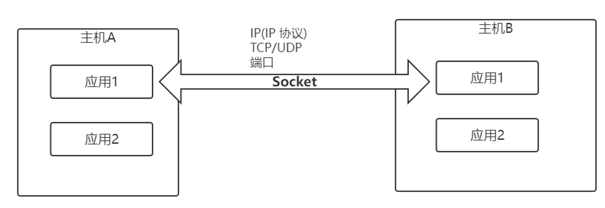
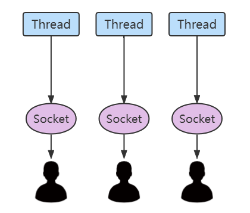
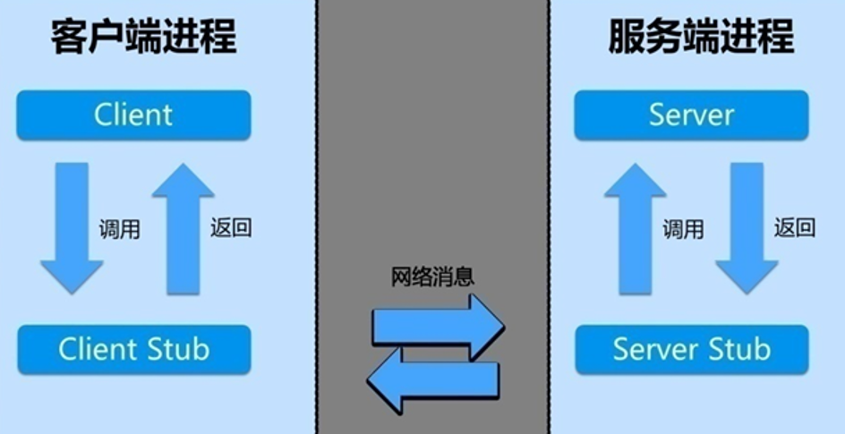
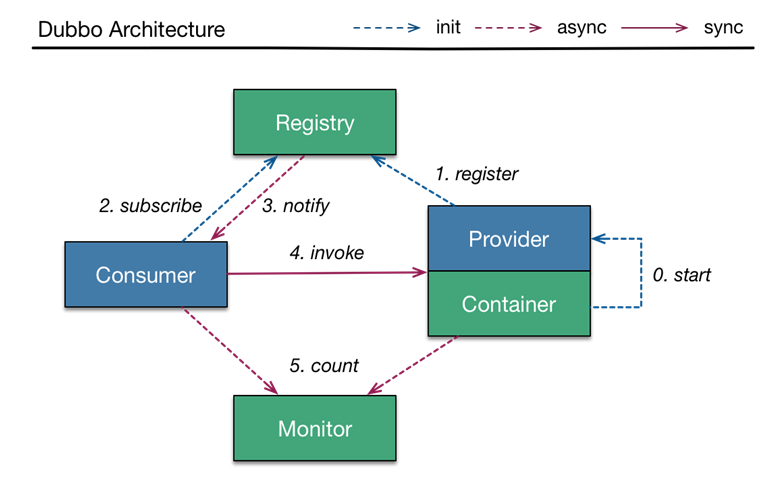
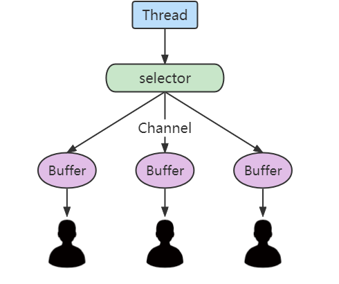
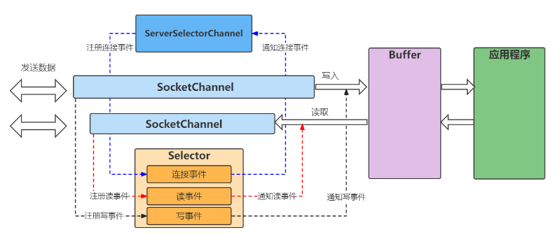
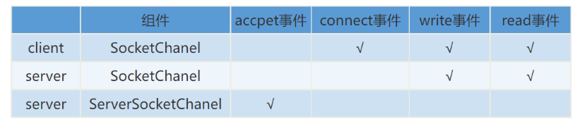
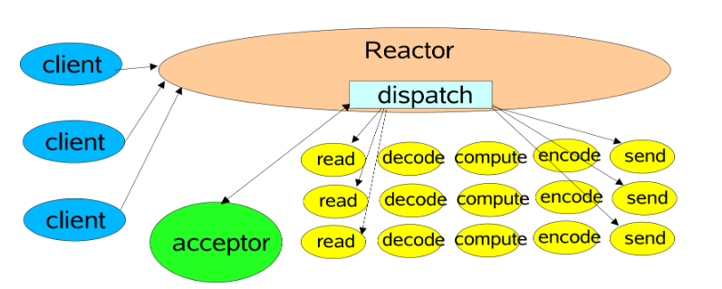
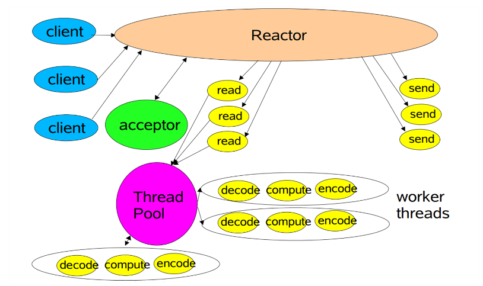
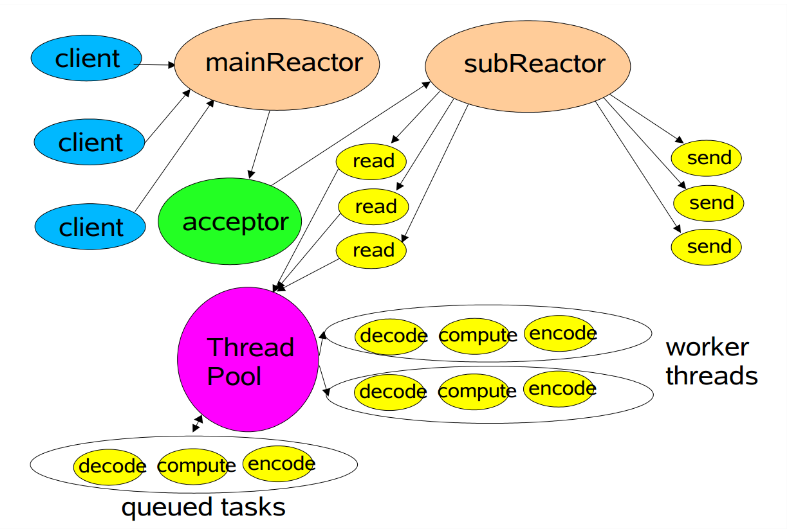

# 一、Java网络编程

## 1.前置知识

### （1）Socket 编程

Socket 是一种网络通信的端点，它能够使不同主机上的程序能够通过网络进行数据交换。在Java中，Socket编程主要是依靠`java.net.Socket`类及其相关类来实现的。它提供了必要的方法来连接、发送数据和接收数据。



在Java中，创建一个Socket连接通常包含以下步骤：

1. **创建Socket实例**：指定服务器的IP地址和端口号。
2. **打开输入/输出流**：使用Socket的输入输出流来接收和发送数据。
3. **通信**：通过读写数据流进行通信。
4. **关闭Socket**：完成通信后，应关闭Socket连接以释放资源。

**示例**

```java
import java.io.*;
import java.net.*;

public class ExampleClient {
    public static void main(String[] args) {
        try {
            Socket socket = new Socket("服务器IP", 端口号);
            PrintWriter out = new PrintWriter(socket.getOutputStream(), true);
            BufferedReader in = new BufferedReader(new InputStreamReader(socket.getInputStream()));

            out.println("Hello Server!");
            String response = in.readLine();
            System.out.println("服务器响应： " + response);

            out.close();
            in.close();
            socket.close();
        } catch (IOException e) {
            e.printStackTrace();
        }
    }
}
```

### （2）长连接和短链接

短连接操作包括连接、传输数据、然后关闭连接。这种类型的连接适用于那些只需少量数据交换的场景，比如HTTP请求。短连接的优点是管理起来简单，资源占用少，但频繁的连接和断开可能导致性能问题。

长连接会在数据传输结束后仍然保持连接状态，适用于需要频繁交换数据的应用，如实时通讯工具。长连接可以减少因频繁建立连接而产生的开销，但需要更多的资源来维持连接状态。

对于需要频繁、大量数据交换的应用，推荐使用长连接。

对于请求-响应模式的简单数据交换，使用短连接更为合适。

### （3）阻塞、非阻塞、同步、异步

- **阻塞 (Blocking)**:I/O操作（如读取文件或接收网络数据）会使调用线程停止执行，直到操作完成。在操作完成前，应用程序无法继续执行任何后续操作。
- **非阻塞 (Non-blocking)**:允许调用线程继续执行，即使数据还未准备好。如果数据未准备好，系统调用会立即返回一个错误，调用线程可以继续做其他工作，并定期检查I/O操作是否完成。
- **同步 (Synchronous)**:I/O操作的发起和完成都是由应用程序直接管理和控制的。无论是阻塞还是非阻塞，应用程序需要直接参与数据的读取或写入工作，即应用程序需要持续检查或等待操作系统的响应。
- **异步 (Asynchronous)**:允许应用程序发起I/O操作后立即继续执行后续代码。应用程序不需要直接参与数据的读取或写入，而是在I/O操作完成后通过状态、通知或回调来获取操作结果。

### （4）I/O模型

**BIO (Blocking I/O)**:

这是最传统的I/O模型，也是最简单的模型。在这个模型中，所有I/O操作（如读、写）都是阻塞的。服务器处理客户端请求时，通常每个客户端连接都需要一个线程，因此当并发用户数增多时，资源消耗较大，扩展性较差。

**NIO (Non-blocking I/O)**:

Java的NIO库引入了非阻塞模式，允许执行多路复用操作。这意味着单个线程可以管理多个输入和输出通道。它使用`Selector`对象检查一个或多个NIO通道（Channel），并能够检查哪个通道准备好了可进行读取或写入。这样做大大减少了系统对线程的需求。

**AIO (Asynchronous I/O)**:

Java 7引入了NIO的改进版本NIO.2，支持真正的异步I/O操作。AIO不需要线程持续查询通道中的数据是否准备好，而是采用了事件驱动模式，当数据准备好后，系统会自动触发一个回调函数。

## 2. BIO (Blocking I/O)

### （1）概述

BIO，即Blocking I/O，是一种同步并且阻塞的通信方式。在BIO模式下，当一个线程进行I/O操作如读写数据时，如果没有数据可用，该线程会被阻塞，直到数据准备就绪。这意味着在数据读写过程中，如果没有数据，线程就会一直等待，不做其他工作。




由于BIO在没有数据的情况下会导致线程阻塞，这种模式不适合处理大量并发连接，因为它会消耗大量的系统资源。然而，对于客户端数量较少且通信量不大的应用，BIO是一个简单而有效的解决方案。

### （2）JDK实现BIO案例

#### ① 客户端

```java
import java.io.*;
import java.net.InetSocketAddress;
import java.net.Socket;

public class Client {
    public static void main(String[] args) {
        //创建套接字
        Socket socket = new Socket();
        // 创建套接字地址，指定服务器的IP地址和端口号
        InetSocketAddress serverAddress = new InetSocketAddress("127.0.0.1", 8080);
        // 连接到服务器
        socket.connect(serverAddress);
        try (
             ObjectOutputStream oos = new ObjectOutputStream(socket.getOutputStream());
             ObjectInputStream ois = new ObjectInputStream(socket.getInputStream())) {
            
            
            
            // 向服务器发送消息
            oos.writeUTF("你好，世界！");
            oos.flush();

            // 接收服务器的响应并打印
            System.out.println("来自服务器的回复：" + ois.readUTF());
        } catch (IOException e) {
            e.printStackTrace();
        }
    }
}

```

#### ② 服务器端

```java
import java.io.*;
import java.net.InetSocketAddress;
import java.net.ServerSocket;
import java.net.Socket;

public class Server {
    public static void main(String[] args) {
        ServerSocket serverSocket = null;
        try {
            serverSocket = new ServerSocket();
            //绑定端口
            serverSocket.bind(new InetSocketAddress(8080));
            // 持续监听来自客户端的连接请求
            while (true) {
                new Thread(new ServerTask(serverSocket.accept())).start();
            }
        } catch (IOException e) {
            e.printStackTrace();
        } 
    }

    private static class ServerTask implements Runnable {
        private Socket socket;

        public ServerTask(Socket socket) {
            this.socket = socket;
        }

        @Override
        public void run() {
            try (ObjectInputStream ois = new ObjectInputStream(socket.getInputStream());
                 ObjectOutputStream oos = new ObjectOutputStream(socket.getOutputStream())) {
                 
                // 接收客户端发送的消息
                System.out.println("服务器收到: " + ois.readUTF());
                
                // 回复客户端
                oos.writeUTF("你好");
                oos.flush();
            } catch (IOException e) {
                e.printStackTrace();
            }
        }
    }
}

```

#### ③ 问题

在传统的BIO通信模型中，服务器通常由一个单独的Acceptor线程负责监听客户端的连接请求。当Acceptor线程接收到一个客户端的连接请求后，它会为每个客户端创建一个新的线程来处理该连接。这种处理方式允许服务器同时处理多个客户端请求，但每个请求都是独立的，使用单独的线程进行处理。这种模型是典型的一请求一应答模型，数据的读取和写入操作在各自的线程内阻塞进行，直到操作完成。

该模型的主要问题是缺乏弹性伸缩能力。随着客户端并发访问量的增加，服务器需要创建的线程数也会增加。在Java中，线程是相对昂贵的资源，大量线程的创建和销毁会导致系统资源的快速消耗，进而影响系统的性能。当并发访问量继续增大时，系统可能因资源耗尽而崩溃。

### （3）线程池优化

为了解决这一问题，可以采用所谓的“伪异步I/O模型”。这种模型通过使用线程池来管理线程，减少了线程创建和销毁的开销。线程池中的线程不会随着每个新的连接请求而创建或销毁，而是被重复利用来处理多个客户端的连接和请求。这不仅减少了资源消耗，还提高了响应速度。

虽然这种模型仍然使用同步阻塞I/O，也就是说，如果当前没有数据可读或可写，线程仍将阻塞等待，但它通过共享有限数量的线程来处理多个连接，从而在一定程度上缓解了资源压力，改善了系统的并发处理能力。

```java
import java.io.*;
import java.net.ServerSocket;
import java.net.Socket;
import java.net.InetSocketAddress;
import java.util.concurrent.ExecutorService;
import java.util.concurrent.Executors;

public class ServerPool {

    // 创建固定大小的线程池，大小为可用处理器的数量
    private static final ExecutorService executorService = Executors.newFixedThreadPool(
            Runtime.getRuntime().availableProcessors());

    public static void main(String[] args) throws IOException {
        // 创建服务器套接字
        ServerSocket serverSocket = new ServerSocket();
        // 绑定监听端口10001
        serverSocket.bind(new InetSocketAddress(10001));
        System.out.println("服务器启动中...");

        try {
            while (true) {
                // 接受客户端连接请求，并通过线程池分配新的线程来处理这个请求
                executorService.execute(new ClientHandlerTask(serverSocket.accept()));
            }
        } finally {
            serverSocket.close();  // 最终关闭服务器套接字
        }
    }

    // 客户端处理任务，实现为Runnable接口
    private static class ClientHandlerTask implements Runnable {

        private Socket socket;

        public ClientHandlerTask(Socket socket) {
            this.socket = socket;
        }

        @Override
        public void run() {
            try (ObjectInputStream inputStream = new ObjectInputStream(socket.getInputStream());
                 ObjectOutputStream outputStream = new ObjectOutputStream(socket.getOutputStream())) {

                // 从客户端读取数据
                String clientMessage = inputStream.readUTF();
                System.out.println("接收到客户端的消息: " + clientMessage);

                // 向客户端发送响应
                outputStream.writeUTF("Hello, " + clientMessage);
                outputStream.flush();
            } catch (Exception e) {
                e.printStackTrace();
            } finally {
                try {
                    // 关闭与客户端的连接
                    socket.close();
                } catch (IOException e) {
                    e.printStackTrace();
                }
            }
        }
    }
}

```


## 3. RPC (Remote Procedure Call)

### （1）概述

RPC允许程序调用另一台计算机上的程序，就像调用本地方法一样，使得程序员在进行分布式计算时，能够更加集中于逻辑的实现上。RPC隐藏了网络通信的细节，程序员不必直接处理网络交互的复杂性。

- **客户端**：客户端程序会调用本地的stub（存根），这个stub包装了客户端的参数，通过网络发送到服务器。
- **服务器**：服务器上有一个skeleton（骨架），它接收请求，解包数据，执行程序，再将结果返回给客户端。

**优势**

- **透明性**：对于开发者来说，远程调用和本地调用没有太大差别。
- **高效率**：可以实现快速的跨网络调用。

### （2）工作流程



1. **客户端调用Stub：**Client通过在本地调用方式调用 stub开始RPC过程。存根，也称为代理存根，将调用请求转换为网络消息。

2. **服务端Stub接收和解码：**服务端收到客户端发送的消息后，这些消息首先到达服务器端的Stub，解码收到的消息，即将网络消息转换回原始的方法调用请求，包括方法名和所需参数。

3. **执行本地服务：**根据解码结果，调用服务器上的本地实际服务。

4. **封装和发送结果：**本地服务将执行结果返回给Stub，将结果封装成网络消息，并通过网络发送回客户端。

5. **客户端存根接收和解码消息：**客户端Stub接收从服务器传回的消息，解码这些消息以提取执行结果。

### （3）实现RPC案例

这个例子会包含一个客户端、一个服务器端，并使用Java的Socket进行网络通信。我们会创建一个远程服务，比如一个简单的计算服务，允许客户端远程调用服务器上的方法来完成计算任务。

#### ① 接口定义
```java
public interface CalculatorService {
    Integer add(Integer a, Integer b);
}
```

#### ② 接口实现
```java
public class CalculatorServiceImpl implements CalculatorService {
    @Override
    public Integer add(Integer a, Integer b) {
        return a + b; // 执行加法运算并返回结果
    }
}
```

#### ③ 客户端
```java
import java.util.Scanner;

public class Client {
    public static void main(String[] args) {
        // 获取服务代理
        CalculatorService service = (CalculatorService) ClientStub.getStub(CalculatorService.class, "127.0.0.1", 10001);

        // 创建Scanner对象，用于从键盘读取输入
        Scanner scanner = new Scanner(System.in);

        while(true) {
            try {
                System.out.println("Enter the first number: ");
                int firstNumber = scanner.nextInt();  // 读取第一个整数

                System.out.println("Enter the second number: ");
                int secondNumber = scanner.nextInt();  // 读取第二个整数

                // 调用远程方法并获取结果
                Integer result = service.add(firstNumber, secondNumber);
                System.out.println("Result of " + firstNumber + " + " + secondNumber + " = " + result);
            } catch (Exception e) {
                System.out.println("Error: " + e.getMessage());
                scanner.nextLine();  // 清除输入错误
            }
        }
    }
}
```

#### ④ 客户端存根
```java
import java.io.*;
import java.lang.reflect.*;
import java.net.*;

public class ClientStub implements InvocationHandler {
    private String ip;
    private int port;
    private Class<?> serviceInterface;

    ClientStub(String ip, int port, Class<?> serviceInterface) {
        this.ip = ip;
        this.port = port;
        this.serviceInterface = serviceInterface;
    }

    public static Object getStub(Class<?> serviceInterface, String ip, int port) {
        // 动态创建代理实例
        return Proxy.newProxyInstance(
            serviceInterface.getClassLoader(), 
            new Class<?>[]{serviceInterface}, 
            new ClientStub(ip, port, serviceInterface)
        );
    }

    @Override
    public Object invoke(Object proxy, Method method, Object[] args) throws Throwable {
        // 建立连接
        Socket socket = new Socket(ip, port);
        try (ObjectOutputStream output = new ObjectOutputStream(socket.getOutputStream());
             ObjectInputStream input = new ObjectInputStream(socket.getInputStream())) {
            output.writeUTF(serviceInterface.getName()); // 发送接口名称
            output.writeUTF(method.getName()); // 发送方法名称
            output.writeObject(method.getParameterTypes()); // 发送方法参数类型
            output.writeObject(args); // 发送方法参数
            output.flush(); // 刷新输出流
            return input.readObject(); // 读取结果
        }
    }
}
```

#### ⑤ 服务器
```java
import java.io.*;
import java.net.*;
import java.lang.reflect.*;

public class Server {
    public static void main(String[] args) {
        try (ServerSocket serverSocket = new ServerSocket(10001)) { // 创建服务器Socket并绑定端口
            System.out.println("Server is running...");
            while (true) {
                // 持续监听并处理客户端请求
                new Thread(new ServerTask(serverSocket.accept())).start();
            }
        } catch (IOException e) {
            e.printStackTrace();
        }
    }

    private static class ServerTask implements Runnable {
        private Socket socket;

        public ServerTask(Socket socket) {
            this.socket = socket;
        }

        @Override
        public void run() {
            try (ObjectInputStream input = new ObjectInputStream(socket.getInputStream());
                 ObjectOutputStream output = new ObjectOutputStream(socket.getOutputStream())) {
                String className = input.readUTF(); // 读取接口名称
                Class<?> clazz = Class.forName(className);
                String methodName = input.readUTF(); // 读取方法名称
                Class<?>[] parameterTypes = (Class<?>[]) input.readObject(); // 读取方法参数类型
                Object[] parameters = (Object[]) input.readObject(); // 读取方法参数

                // 创建服务实例并调用相应方法
                Method method = clazz.getMethod(methodName, parameterTypes);
                if (clazz.isInterface()) {
                    clazz = CalculatorServiceImpl.class; // 如果是接口，则转为具体实现类
                }
                Object result = method.invoke(clazz.newInstance(), parameters);
                output.writeObject(result); // 发送调用结果
                output.flush();
            } catch (Exception e) {
                e.printStackTrace();
            }
        }
    }
}
```

### （4）RPC框架

#### ① Dubbo

Dubbo是一个高性能、轻量级的开源Java RPC框架，由阿里巴巴开发。它主要用于构建高性能和透明化的RPC远程服务调用，特别适用于构建大规模的服务治理场景如服务注册、发现和依赖管理。



**核心功能**：

- **服务注册与发现**：Dubbo支持多种注册中心，如Zookeeper、Nacos等，服务提供者注册其服务地址至注册中心，消费者从注册中心订阅所需服务。
- **负载均衡与容错**：提供多种负载均衡策略，并支持容错和自动故障转移。
- **调用监控与统计**：通过Dubbo-admin或其他监控系统实现调用的监控与统计。

#### ② Spring Cloud

Spring Cloud基于Spring Boot提供了一整套微服务解决方案，包括服务发现、配置管理、消息路由、负载均衡、断路器以及全局锁等功能。

**核心功能**：
- **广泛的服务支持**：提供从配置管理、服务发现到断路器等一系列微服务相关支持。
- **易于集成和扩展**：可以很容易地与现有的Spring应用集成，并且易于扩展。
- **多语言和多协议**：虽然Spring Cloud主要是用Java开发，但通过集成如Spring Cloud Gateway等组件，它可以支持RESTful API和其他多种协议。

#### ③ Dubbo vs Spring Cloud

- **性能与简洁性**：Dubbo在性能上通常优于Spring Cloud，因为它更轻量级，专注于服务治理。Spring Cloud提供了更全面的服务支持，但这也使得它更加复杂和重量级。
- **协议与多语言支持**：Spring Cloud在支持RESTful API和多语言上更具优势，更适合对外开放API和需要支持多种编程语言的环境。
- **服务全面性**：Spring Cloud提供了更加全面的微服务支持组件，适合需要这些功能的复杂应用场景。

**选择何种框架**依赖于具体的业务需求：

- 对于需要高性能、专注于Java的、内部微服务通信的场景，Dubbo可能是更好的选择。
- 对于需要全面的微服务支持、对外API或多语言支持的复杂应用，Spring Cloud可能更适合。


## 4.NIO

### （1）概述

Java NIO（Non-blocking IO），是指 JDK 提供的新API。从 JDK 1.4 开始，Java 提供了一系列改进的输入/输出的新特性，被统称为 NIO（即 New IO）。NIO 支持面向缓冲区的（Buffer-oriented）、基于通道的IO操作。NIO 提供了与传统IO模型中所不同的IO工作方式。

NIO 的核心在于：选择器（Selectors）、通道（Channels）、缓冲区（Buffers）。这三者的组合提高了IO操作的速度和效率。



### （2）三大核心组件



#### ① Selector（选择器）

选择器是 Java NIO 中能够检测一个或多个 NIO 通道，并能够知晓通道是否为诸如读取、写入等事件做好准备的组件。这种机制使得单个的线程可以管理多个输入和输出通道。因此，可以使用较少的线程来处理这些通道，相比传统的一个连接一个线程模型，资源利用率高很多。

- **事件订阅器**：应用程序可以指定它感兴趣的事件，通常是数据到达、连接开启等。当Selector发现某个注册的通道符合这个条件时，它会通知应用程序。
- **轮询代理器**：Selector可以不断检查注册的通道是否有某个事件就绪。
- **Channel容器管理机**：Selector内部会维护一个注册的通道集合，这些通道都是处于非阻塞模式下。

#### ② Channel（通道）

通道是对传统的流的改进，它可以通过基本的操作打开/关闭、读写。通道是双向的，可读可写，并且比流更能反映底层操作系统的真实情况。

- **SelectableChannel**：一个可以被选择器监控的通道必须是SelectableChannel的一个实例。
- **ServerSocketChannel**：可以监听新进来的TCP连接的通道，就像标准IO中的ServerSocket一样。
- **SocketChannel**：TCP网络数据的读写通道。
- **DatagramChannel**：能通过UDP读写网络中的数据通道。

所有数据的读写都先要经过 Buffer。

#### ③ Buffer（缓冲区）

缓冲区本质上是一个可以写入数据，然后可以从中读取数据的内存块。缓冲区是NIO中数据处理的中转池。所有数据的读写都通过 Buffer，它提供了对数据结构化访问以及维护读写位置等信息。

- **ByteBuffer**：最常用的缓冲区，处理字节数据。
- **CharBuffer**、**IntBuffer**、**DoubleBuffer** 等：其他基本类型的缓冲区支持，功能类似 ByteBuffer。

### （3）JDK实现NIO案例

#### ① 客户端

**连接服务器**：客户端通过 `SocketChannel.open(address)` 建立与服务器的连接，其中地址使用 `localhost` 和端口 `8080` 指定。

**用户输入**：程序使用 `Scanner` 类从控制台接收用户输入的字符串。

**发送数据**：输入的字符串被转换成字节后装入 `ByteBuffer`。通过已打开的 `SocketChannel`，使用 `write()` 方法发送数据到服务器。

**接收响应**：清空缓冲区以准备接收数据。使用 `SocketChannel.read(buffer)` 读取从服务器发送回的数据。

**处理服务器响应**：将响应数据（字节）转换成字符串，输出显示。

**关闭连接**：通信完成后，关闭 `SocketChannel`。

```java
import java.net.InetSocketAddress;
import java.nio.ByteBuffer;
import java.nio.channels.SocketChannel;
import java.util.Scanner;

public class Client {
    public static void main(String[] args) throws Exception {
        // 连接到服务器
        InetSocketAddress address = new InetSocketAddress("localhost", 8080);
        SocketChannel socketChannel = SocketChannel.open(address);
        System.out.println("Connected to Server...");

        // 通过控制台接收用户输入
        Scanner scanner = new Scanner(System.in);
        System.out.print("Enter a string: ");
        String message = scanner.nextLine();

        // 将字符串转换为ByteBuffer，并发送到服务器
        ByteBuffer buffer = ByteBuffer.wrap(message.getBytes());
        socketChannel.write(buffer);  

        // 准备读取服务器的响应
        buffer.clear();
        socketChannel.read(buffer);  
        String response = new String(buffer.array()).trim();  // 清除buffer周围的空格，并构造字符串
        System.out.println("Server response: " + response);

        // 关闭通道
        socketChannel.close();
    }
}
```

#### ② 服务器

**设置服务器通道和选择器**：打开 `ServerSocketChannel` 并设置为非阻塞模式。绑定服务器到指定端口（8080）并注册到选择器，监听接受（`ACCEPT`）事件。

**监听就绪事件**：服务器进入循环，使用 `selector.select()` 阻塞直到至少有一个通道就绪。获取所有就绪事件的键集 (`Set<SelectionKey>`), 并使用迭代器遍历这些事件。

**处理新的连接**：对于每一个就绪的接受（`ACCEPT`）事件，接受客户端连接。新的 `SocketChannel` 也被设置为非阻塞模式，并注册到选择器，监听读取（`READ`）事件。

**读取数据**：对于每一个就绪的读（`READ`）事件，从 `SocketChannel` 读取数据到 `ByteBuffer`。检查接收到的数据，若无效或为空则关闭连接，否则继续处理。

**响应客户端**：数据读取后，将 `ByteBuffer` 中的数据回写到 `SocketChannel`，实现简单的回声（echo）功能。清空缓冲区以备下次读写。

**关闭连接**：持续监听直到服务器被明确停止。关闭服务器 `ServerSocketChannel`。

```java
package nio;

import java.io.IOException;
import java.net.InetSocketAddress;
import java.nio.ByteBuffer;
import java.nio.channels.*;
import java.util.Iterator;
import java.util.Set;

public class Server {
    public static boolean started = true;

    public static void main(String[] args) throws IOException {
        // 工厂模式创建选择器
        Selector selector = Selector.open();
        // 创建服务器套接字通道
        ServerSocketChannel serverSocketChannel = ServerSocketChannel.open();
        //false非阻塞通道
        serverSocketChannel.configureBlocking(false);
        //绑定端口
        serverSocketChannel.socket().bind(new InetSocketAddress(8080));
        //注册到选择器，并选择关注的事件
        serverSocketChannel.register(selector, SelectionKey.OP_ACCEPT);

        // 服务器主循环
        while (started) {
            selector.select();  // 阻塞至有事件就绪
            Set<SelectionKey> selectionKeys = selector.selectedKeys();
            if (selectionKeys.isEmpty()) continue;
			//使用迭代器遍历
            Iterator<SelectionKey> iterator = selectionKeys.iterator();
            while (iterator.hasNext()) {
                SelectionKey selectionKey = iterator.next();
                //移除selectionKey，该事件已处理
                iterator.remove();
                // 处理连接事件
                if (selectionKey.isAcceptable()) {
                    SocketChannel socketChannel = serverSocketChannel.accept();
                    socketChannel.configureBlocking(false);
                    socketChannel.register(selector, SelectionKey.OP_READ);
                }
                // 处理读取事件
                if (selectionKey.isReadable()) {
                    handle(selectionKey);
                }
            }
        }
        serverSocketChannel.close();
    }

    private static void handle(SelectionKey selectionKey) throws IOException {
        SocketChannel socketChannel = (SocketChannel) selectionKey.channel();
        ByteBuffer buffer = ByteBuffer.allocate(1024);
        int read = socketChannel.read(buffer);
        if (read == -1) {
            socketChannel.close();
            System.out.println("Connection closed by client");
            return;
        }

        String receivedString = new String(buffer.array(), 0, read).trim();
        if (receivedString.isEmpty()) {
            started = false;
            socketChannel.close();
            System.out.println("Not a valid input, connection closed");
        } else {
            System.out.println("Received: " + receivedString);
            buffer.flip();
            socketChannel.write(buffer);
            buffer.clear();
        }
    }
}
```

### （4）SelectionKey

在 Java NIO 编程模型中，`SelectionKey` 封装了一个通道和选择器之间的关系。它表示通道在选择器上的注册状态，包括注册的事件和通道的就绪状态。通过使用选择器，一个单独的线程可以管理多个输入和输出通道，这是通过监听四种主要事件来实现的。

每种操作类型代表了不同的网络I/O活动：

1. **OP_READ（读）**
   
   操作系统的读缓冲区中有新的数据可读。通常，只有当读事件就绪时才进行读操作，这样可以有效地利用CPU资源，避免无数据可读时发生的无效操作。

2. **OP_WRITE（写）**
   
   操作系统的写缓冲区有足够的空间进行写操作。在大多数情况下，写缓冲区通常是可用的，因此不必常常注册此事件。然而，对于大量数据连续发送的场景（如文件下载服务），监控写就绪状态可以避免写操作的阻塞和CPU资源的浪费。

3. **OP_CONNECT（连接请求）**
   
   当客户端的 `SocketChannel` 成功连接到服务器端后就绪。此事件类型仅用于非阻塞的连接操作，是客户端特有的。

4. **OP_ACCEPT（接受连接）**
   
   当服务器Socket接受到客户端的连接请求时就绪。这是服务器特有的事件，用于监听新的客户端连接。



### （5）Reactor

#### ① 概述

Reactor 模式是一种事件处理模式，用于处理服务请求的传递。它的设计允许你以非阻塞的方式处理并发事件，通过一个或多个输入同时服务多个客户端请求。它的核心思想是通过一个中央处理机制来分发请求和处理完成事件，这种模式广泛应用于服务器的网络服务实现中。

通过指定的处理器（handler）来响应IO事件，这些事件可通过单线程或者多线程的方式来处理。这种模式常用于实现高性能网络服务器，如 Web 服务器、数据库服务器等。主要组件包括：

- **Reactor**：负责提供事件循环机制，监听事件，当事件发生时，分发给相应的处理器。
- **Handlers**：与事件相关联的处理器，负责处理非阻塞任务。
- **Synchronous Event Demultiplexer**：这是事件循环中用于等待事件的机制，如 `select()` 或 `poll()`。

#### ② 单线程 Reactor

在单线程 Reactor 模式中，所有的 I/O 事件处理和用户请求都在同一个线程中完成。这种模式简化了设计和调试过程，因为它避免了线程同步或并发执行的问题。适用于负载较轻的应用程序。



#### ③ 多线程 Reactor

在多线程模式中，主 Reactor 负责监听所有IO事件，并将事件分发给相应的处理器；每个处理器运行在独立的线程中，可以并行处理多个输入或请求。



#### ④ 主从多线程 Reactor

主从多线程模式在多线程的基础上进行了扩展，引入了多个 Reactor。通常一个主 Reactor 负责接收客户端连接，每个连接的读写请求则由多个从 Reactor 处理。

