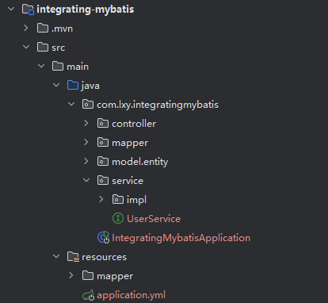
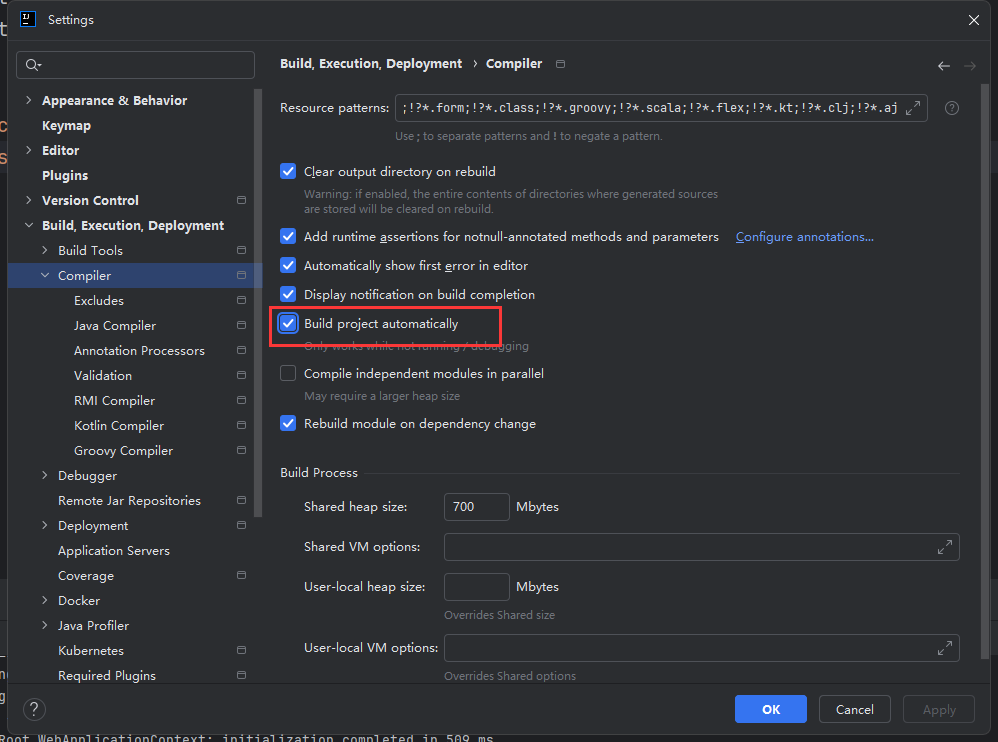
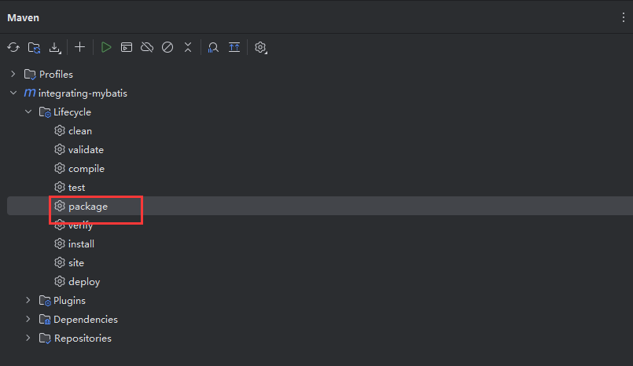
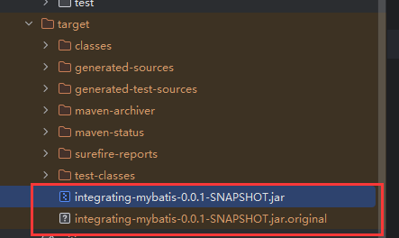
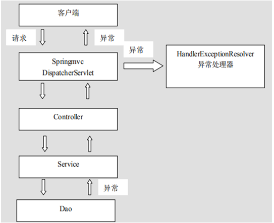

# 一、什么是Spring Boot

### （1）简介

Spring Boot 是一个基于 Java 的开源框架，用于创建企业级应用程序。它是由 Pivotal 团队所开发的，并且是 Spring 框架的一部分。Spring Boot 的设计目的是简化新 Spring 应用的初始搭建以及开发过程。

### （2）启动器

启动器（Starters）是 Spring Boot 的一个重要概念，它主要用于简化依赖管理，使得项目搭建更加快速和方便。启动器本质上是一组便利的依赖描述符，你可以在项目的 `pom.xml` 或 `build.gradle` 文件中加入这些启动器依赖项，以引入所需的库。

启动器旨在聚合常用的依赖库到一个单独的地方。这样，开发者在创建一个新的 Spring Boot 应用时，只需简单地添加一个或几个启动器依赖项，便能自动配置应用所需的 Spring 框架和第三方库。

Spring Boot 提供了多种启动器，覆盖了多数开发场景，例如：

- **spring-boot-starter-web**：用于构建 Web 应用，包括 RESTful 应用，使用 Spring MVC。自带 Tomcat 作为默认的嵌入式容器。
- **spring-boot-starter-data-jpa**：用于使用 Spring Data JPA 与数据库进行交互。
- **spring-boot-starter-test**：用于测试 Spring Boot 应用，包含了JUnit、Spring Test 等测试库。
- **spring-boot-starter-security**：用于添加安全性控制，支持使用 Spring Security。

通过这种方式，Spring Boot 能够利用自动配置的优势，减少手动配置的工作，加快开发进度。同时，这也体现了 Spring Boot 设计的理念——“约定优于配置”，使得开发者可以更专注于业务代码的编写。

### （3）主要特点

- 独立运行：Spring Boot 应用可以被打包成一个单一的可执行 JAR 文件，包含 Web 服务器，因此不需要外部的 Servlet 容器。
- 自动配置：Spring Boot 试图根据你添加的 jar 依赖自动配置你的 Spring 应用。例如，如果你的 classpath 下有 HSQLDB，并且你没有配置任何数据库连接，则 Spring Boot 会自动配置一个内存数据库。
- 起步依赖：Spring Boot 提供了一系列的“starter”依赖项，可以简化 Maven 或 Gradle 的配置。每一个起步依赖项都包含了所需的库，以便能够处理特定的技术栈。
- 监控：它提供了许多生产级别的特性，如指标、应用信息和应用健康监测。

# 二、项目搭建

## 1.创建项目

### （1）手动创建

在`pom.xml`中添加Spring Boot的父项目依赖和起步依赖

```xml
<?xml version="1.0" encoding="UTF-8"?>
<project xmlns="http://maven.apache.org/POM/4.0.0"
         xmlns:xsi="http://www.w3.org/2001/XMLSchema-instance"
         xsi:schemaLocation="http://maven.apache.org/POM/4.0.0 http://maven.apache.org/xsd/maven-4.0.0.xsd">
    <modelVersion>4.0.0</modelVersion>
    <!--继承父项目方式-->
    <parent>
        <groupId>org.springframework.boot</groupId>
        <artifactId>spring-boot-starter-parent</artifactId>
        <version>2.4.5</version>
    </parent>
    <groupId>com.msb</groupId>
    <artifactId>springboot01</artifactId>
    <version>1.0-SNAPSHOT</version>
    <dependencies>
        <dependency>
            <groupId>org.springframework.boot</groupId>
            <artifactId>spring-boot-starter-web</artifactId>
            <version>2.4.5</version>
        </dependency>
    </dependencies>
</project>
```

创建启动类

在Spring Boot应用程序中，==启动类是应用启动的入口==。这个类通过调用`SpringApplication.run()`方法来启动Spring应用的上下文。Spring Boot的启动类通常通过添加`@SpringBootApplication`注解来标记，这个注解是一个方便的注解，它包含了`@Configuration`、`@EnableAutoConfiguration`和`@ComponentScan`三个注解，这些注解共同启用了Spring Boot的自动配置和组件扫描功能。

```java
@SpringBootApplication // 标记为Spring Boot应用的启动入口
public class Application {

    public static void main(String[] args) {
        SpringApplication.run(Application.class, args); // 启动Spring应用
    }
}
```

**关键元素解释**

- **@SpringBootApplication**：标记主类为Spring Boot应用的启动类。该注解结合了以下三个注解的功能：
  - **@Configuration**：将该类标记为配置类，允许在其内部声明一些额外的@Bean注解，用于实例化Bean。
  - **@EnableAutoConfiguration**：==启用Spring Boot的自动配置机制==，根据项目中添加的jar依赖自动配置应用。
  - **@ComponentScan**：==启用组件扫描==，默认扫描与启动类同包以及子包下的所有组件（@Component、@Service、@Repository、@Controller等）。

- **SpringApplication.run()**：静态方法，==负责启动Spring应用的上下文（ApplicationContext）==。这个方法读取注解配置、启动Spring上下文，并执行Spring容器的初始化过程。它接受两个参数，第一个是启动类的类对象`Application.class`，第二个是main方法的参数`args`。

这种方式使得开发Spring应用变得非常简单，不需要传统的XML配置文件，也不需要配置复杂的Web应用服务器，就可以快速启动和开发基于Spring框架的应用程序。

### （2）IntelliJ IDEA

创建项目


设置WEB-INF


### （3）项目结构


## 2.项目配置

SpringBoot默认读取项目下名字为application开头的  yml yaml properties配置文件

### （1）properties配置

```properties
server.port=8080
spring.datasource.driver-class-name=
spring.datasource.url=
spring.datasource.name=
spring.datasource.password=
```

注意：这里的每一个. 都代表一个层级，转换成yml之后,使用缩进代表层级关系

### （2）yml配置

**基本格式要求**

- 大小写敏感
- 使用缩进代表层级关系
- 注意空格

```yml
server:
  port: 8080
spring:
  datasource:
    driver-class-name:
    url:
    name:
    password: 
```

### （3）优先级

**① 当前项目根目录下的 `/config` 子目录中（最高优先级）**

在这个位置，可以放置 `application.properties` 或 `application.yml` 文件。这种方式使得在不同环境下，通过修改外部配置而不是打包内部的配置，来快速适应环境变化。

- `./config/application.properties`
- `./config/application.yml`

**② 当前项目根目录中（次高优先级）**

直接在项目根目录下放置配置文件，适用于不需要区分多环境配置的简单项目。

- `./application.properties`
- `./application.yml`

**③ 项目的 resources 即 classpath 根路径下的 `/config` 目录中（一般优先级）**

在 `resources` 文件夹下创建一个 `config` 子目录，可以对不同的开发环境使用不同的配置，同时这些配置文件会被包含在最终的项目打包文件中。

- `resources/config/application.properties`
- `resources/config/application.yml`

**④ 项目的 resources 即 classpath 根路径中（最低优先级）**

放在 `resources` 目录下的配置文件是最基本的配置，通常用作默认配置。

- `resources/application.properties`
- `resources/application.yml`

通过这样的优先级设置，Spring Boot 允许开发者在开发、测试、生产等不同环境下灵活地覆盖和扩展配置，而无需改动原始代码或进行重新部署。这种灵活的配置管理大大简化了应用的部署和维护过程。

## 3.启动原理

**SpringApplication.run()的工作流程**

1. **创建`SpringApplication`对象**：基于传入的启动类（如`Application.class`），Spring Boot创建一个`SpringApplication`对象。
2. **推断应用的类型**：根据类路径上的内容（如是否存在Spring MVC或Spring WebFlux相关的类），推断应用是一个普通的Spring应用、一个Servlet Web应用还是一个反应式Web应用，并相应地设置应用上下文的类型。
3. **==加载配置==**：读取`application.properties`或`application.yml`文件中的配置、环境变量、命令行参数等，加载应用配置。配置的加载不仅限于 `application.properties` 或 `application.yml`。Spring Boot 也会考虑外部配置、命令行参数、系统属性以及其他 `PropertySource`。此外，`@PropertySource` 注解可以用来指定额外的配置文件。
4. **==初始化上下文==**：根据推断出的应用类型，创建并初始化`ApplicationContext`。这个过程包括注册配置类、初始化beans、处理自动配置等。在这一步中，Spring Boot 会应用自动配置，这是通过 `@EnableAutoConfiguration` 注解实现的。Spring Boot 的自动配置尝试根据添加的依赖自动配置您的 Spring 应用。例如，如果您添加了 `spring-boot-starter-web`，它会自动配置 Tomcat 和 Spring MVC。此外，所有的 `@Component`、`@Service`、`@Repository`、`@Controller` 等注解的 Bean 也会在这一步被扫描并注册到 Spring 容器中。
5. **启动Spring容器**：完成所有配置和初始化后，启动Spring容器。对于Web应用，这还包括启动内嵌的Servlet容器（如Tomcat）。
6. **运行应用**：应用上下文和Spring容器启动完成后，应用进入运行状态。对于Web应用，这时Web服务器开始监听HTTP请求。

总的来说，`SpringApplication.run()`不仅仅是读取应用配置，它是整个Spring Boot应用启动流程的核心，负责启动、配置和管理Spring应用的生命周期。

# 三、SpringBoot整合

## 1.MyBatis

### （1）搭建项目



### （2）导入依赖

```xml
<!--MyBatis-->
<dependency>
    <groupId>org.mybatis.spring.boot</groupId>
    <artifactId>mybatis-spring-boot-starter</artifactId>
    <version>3.0.3</version>
</dependency>
<!--MySQL Driver-->
<dependency>
    <groupId>com.mysql</groupId>
    <artifactId>mysql-connector-j</artifactId>
    <scope>runtime</scope>
</dependency>
```

一般来说会配合MyBatis-X自动生成entity、mapper、service，并且会使用lombok

```xml
<dependency>
    <groupId>org.projectlombok</groupId>
    <artifactId>lombok</artifactId>
</dependency>
```

### （3）配置文件

application.xml

```yml
spring:
  application:
    name: integrating-mybatis
  # 数据源配置
  datasource:
    url: jdbc:mysql://127.0.0.1:3306/mybatisdb?useSSL=false&useUnicode=true&characterEncoding=UTF-8&serverTimezone=Asia/Shanghai
    driver-class-name: com.mysql.cj.jdbc.Driver
    username: root
    password: root
#mybatis配置
mybatis:
  type-aliases-package: com.lxy.integratingmybatis.model.entity
  mapper-locations: classpath:mapper/*.xml
```

### （3）业务开发

#### 1）UserMapper接口

```java
@Mapper
public interface UserMapper  {
    @Insert("INSERT INTO user(id,name, age,email) VALUES(#{id},#{name},#{age}, #{email})")
    @Options(useGeneratedKeys = true, keyProperty = "id")
    void insertUser(User user);

    @Select("SELECT * FROM user WHERE id = #{id}")
    User selectUserById(Integer id);

    @Update("UPDATE user SET name = #{name}, age=#{age},email = #{email} WHERE id = #{id}")
    void updateUser(User user);

    @Delete("DELETE FROM user WHERE id = #{id}")
    int deleteUserById(Integer id);

    @Select("SELECT * FROM user")
    List<User> findAllUsers();
}
```

==注意==：UserMapper可以不添加@Mapper注解，但需要启动类添加了mapper扫描

`@Options(useGeneratedKeys = true, keyProperty = "id")`，MyBatis 知道在插入操作后从数据库中获取这个自动生成的 `id` 并将其设置到 `User` 实体的 `id` 属性上。这样，你的 Java 对象就有了数据库中对应记录的实际 `id`，便于后续的操作如更新或删除该记录。

#### 2）UserServiceImpl

```java
@Service
public class UserServiceImpl implements UserService {
    @Autowired
    private UserMapper userMapper;

    public User createUser(User user) {
        userMapper.insertUser(user);
        return user;  // Assume the user is returned with an ID if using an auto-increment field
    }

    public User getUserById(Integer id) {
        return userMapper.selectUserById(id);
    }

    public User updateUser(User user) {
        userMapper.updateUser(user);
        return user;
    }

    public boolean deleteUser(Integer id) {
        return userMapper.deleteUserById(id) > 0;
    }

    public List<User> getAllUsers() {
        return userMapper.findAllUsers();
    }
}
```

#### 3）UserController

```java
@RestController
@RequestMapping("/user")
public class UserController {
    @Autowired
    private UserService userService;

    // 创建用户
    @PostMapping
    public ResponseEntity<User> createUser(@RequestBody User user) {
        User newUser = userService.createUser(user);
        return new ResponseEntity<>(newUser, HttpStatus.CREATED);
    }

    // 读取用户
    @GetMapping("/{id}")
    public ResponseEntity<User> getUserById(@PathVariable Integer id) {
        User user = userService.getUserById(id);
        if (user != null) {
            return ResponseEntity.ok(user);
        } else {
            return ResponseEntity.notFound().build();
        }
    }

    // 更新用户
    @PutMapping
    public ResponseEntity<User> updateUser( @RequestBody User user) {
        User updatedUser = userService.updateUser(user);
        if (updatedUser != null) {
            return ResponseEntity.ok(updatedUser);
        } else {
            return ResponseEntity.notFound().build();
        }
    }

    // 删除用户
    @DeleteMapping("/{id}")
    public ResponseEntity<Void> deleteUser(@PathVariable Integer id) {
        boolean isDeleted = userService.deleteUser(id);
        if (isDeleted) {
            return ResponseEntity.ok().build();
        } else {
            return ResponseEntity.notFound().build();
        }
    }

    // 列出所有用户
    @GetMapping
    public ResponseEntity<List<User>> getAllUsers() {
        List<User> users = userService.getAllUsers();
        return ResponseEntity.ok(users);
    }
}
```

## 2.logback

Logback是由Log4j创始人设计的另一个开源日志框架，作为SLF4J的一个自然扩展，它被认为是==Log4j的一个改进版==，提供了更快的日志记录性能和更多的灵活配置选项。Logback被分为三个模块：logback-core, logback-classic 和 logback-access。logback-classic 完全实现了SLF4J API，因此可以直接替换其他基于SLF4J的日志系统，如log4j或java.util.logging。logback-access则提供了与Servlet容器集成的能力，用于HTTP访问日志的管理。

### （1）依赖

在Spring Boot项目中我们不需要额外的添加Logback的依赖，因为在spring-boot-starter或者spring-boot-starter-web中已经包含了Logback的依赖。

### （2）配置

classpath下创建logback.xml

```xml
<?xml version="1.0" encoding="UTF-8" ?>
 <configuration>
<!--定义日志文件的存储地址 勿在 LogBack 的配置中使用相对路径-->  
    <property name="LOG_HOME" value="${catalina.base}/logs/" />  
    <!-- 控制台输出 -->   
    <appender name="Stdout" class="ch.qos.logback.core.ConsoleAppender">
       <!-- 日志输出格式 -->  
        <layout class="ch.qos.logback.classic.PatternLayout">   
             <!--格式化输出：%d表示日期，%thread表示线程名，%-5level：级别从左显示5个字符宽度%msg：日志消息，%n是换行符--> 
            <pattern>%d{yyyy-MM-dd HH:mm:ss.SSS} [%thread] %-5level %logger{50} - %msg%n   
            </pattern>   
        </layout>   
    </appender>   
    <!-- 按照每天生成日志文件 -->   
    <appender name="RollingFile"  class="ch.qos.logback.core.rolling.RollingFileAppender">   
        <rollingPolicy class="ch.qos.logback.core.rolling.TimeBasedRollingPolicy">
            <!--日志文件输出的文件名-->
            <FileNamePattern>${LOG_HOME}/server.%d{yyyy-MM-dd}.log</FileNamePattern>   
            <MaxHistory>30</MaxHistory>
        </rollingPolicy>   
        <layout class="ch.qos.logback.classic.PatternLayout">  
            <!--格式化输出：%d表示日期，%thread表示线程名，%-5level：级别从左显示5个字符宽度%msg：日志消息，%n是换行符--> 
            <pattern>%d{yyyy-MM-dd HH:mm:ss.SSS} [%thread] %-5level %logger{50} - %msg%n   
            </pattern>   
       </layout> 
        <!--日志文件最大的大小-->
       <triggeringPolicy class="ch.qos.logback.core.rolling.SizeBasedTriggeringPolicy">
         <MaxFileSize>10MB</MaxFileSize>
       </triggeringPolicy>
    </appender>     
    <!-- 日志输出级别 -->
    <root level="info">   
        <appender-ref ref="Stdout" />   
        <appender-ref ref="RollingFile" />   
    </root>
    <logger name="com.lxy.mapper" level="DEBUG"></logger>
<!--日志异步到数据库 -->  
<!--<appender name="DB" class="ch.qos.logback.classic.db.DBAppender">
        日志异步到数据库 
        <connectionSource class="ch.qos.logback.core.db.DriverManagerConnectionSource">
           连接池 
           <dataSource class="com.mchange.v2.c3p0.ComboPooledDataSource">
              <driverClass>com.mysql.jdbc.Driver</driverClass>
              <url>jdbc:mysql://127.0.0.1:3306/databaseName</url>
              <user>root</user>
              <password>root</password>
            </dataSource>
        </connectionSource>
  </appender> -->
</configuration>
```

## 3.PageHelper

### （1）==实现原理==

1. **设置分页参数**：当调用`PageHelper.startPage(int pageNum, int pageSize)`方法时，PageHelper内部会将分页参数（页码和每页数量）保存到当前线程的`ThreadLocal`变量中。
2. **修改查询SQL**：PageHelper实现了MyBatis的`Interceptor`接口，通过拦截器机制，当执行数据库查询操作时，PageHelper会获取到当前线程的分页参数。根据获取到的分页参数，PageHelper动态地修改原始SQL语句，加入分页的SQL片段（如`LIMIT`和`OFFSET`子句），以实现数据库层面的分页功能。
3. **执行分页查询**：修改后的SQL语句被执行，数据库返回当前页的数据。
5. **清理分页参数**：查询完成后，通常在`finally`块中，PageHelper会清除`ThreadLocal`中存储的分页参数，避免对后续操作产生影响。

### （2）依赖

```xml
<dependency>
    <groupId>com.github.pagehelper</groupId>
    <artifactId>pagehelper-spring-boot-starter</artifactId>
    <version>1.4.1</version>
</dependency>
```

注意：低版本的pagehelper可能存在循环依赖

### （3）配置

SpringBoot会自动配置MyBatis分页。

### （4）业务

#### 1）Emp

```java
@Data
@AllArgsConstructor
@NoArgsConstructor
public class Emp {
    private Integer empno;
    private String ename;
    private String job;
    private Integer mgr;
    private Date hiredate;
    private Double sal;
    private Double comm;
    private Integer deptno;
}
```

#### 2）EmpMapper接口和EmpMapper.xml

```java
public interface EmpMapper {
    public List<Emp> selectAll();
}
```

```xml
<?xml version="1.0" encoding="UTF-8" ?>
<!DOCTYPE mapper
        PUBLIC "-//mybatis.org//DTD Mapper 3.0//EN"
        "http://mybatis.org/dtd/mybatis-3-mapper.dtd">
<mapper namespace="com.lxy.mapper.EmpMapper">
    <select id="selectAll" resultType="emp" >
        select * from emp
    </select>
</mapper>
```

注意：检查方法名保持一致

#### 3）EmpService接口和EmpServiceImpl

```java
public interface EmpService {
    public List<Emp> findByPage(Integer pageNum, Integer pageSize);
}
```

```java
@Service
public class EmpServiceImpl implements EmpService {
    @Autowired
    private EmpMapper empMapper;
    @Override
    public List<Emp> findByPage(Integer pageNum, Integer pageSize) {
        Page<Emp> page = PageHelper.startPage(pageNum, pageSize);
        List<Emp> list =empMapper.selectAll();
        // 方式1
        System.out.println("当前页:"+page.getPageNum());
        System.out.println("总页数"+page.getPages());
        System.out.println("页大小:"+page.getPageSize());
        System.out.println("总记录数:"+page.getTotal());
        System.out.println("当前页数据"+page.getResult());
        // 方式2
        PageInfo<Emp> pi =new PageInfo<>(list);
        System.out.println("当前页"+pi.getPageNum());
        System.out.println("总页数"+pi.getPages());
        System.out.println("页大小"+pi.getSize());
        System.out.println("总记录数"+pi.getTotal());
        System.out.println("当前页数据"+pi.getList());
        return list;
    }
}
```

注意：不要忘记@Service注解

#### 4）EmpController

```java
@Controller
@RequestMapping("/emp")
public class EmpController {
    @Autowired
    private EmpService empService;
    @RequestMapping("/findByPage/{pageNum}/{pageSize}")
    @ResponseBody
    public List<Emp> findByPage(@PathVariable("pageNum") Integer pageNum, @PathVariable("pageSize") Integer pageSize){
        return empService.findByPage(pageNum,pageSize);
    }
}
```

## 4.Druid

Alibaba Druid是一个高性能的数据库连接池，它提供了强大的监控和扩展功能，适用于大规模生产环境。Druid是在为了克服传统数据库连接池的一些限制和不足而设计的，特别是在高并发、高可用和高监控的场景下。Druid已经在多个大型互联网公司得到广泛应用，并被证明是非常可靠和高效的。

### （1）Druid的主要特性

1. **==强大的监控==**：Druid提供了详细的SQL监控，可以输出每条SQL的执行情况，包括执行时间、执行次数等。同时，它还支持数据库密码加密，确保安全性。

2. **高并发**：Druid内部使用了高效的锁机制，可以支持非常高的并发访问。

3. **扩展性**：Druid支持多种数据库，包括MySQL、Oracle、PostgreSQL等，几乎可以无缝替换其他数据库连接池。

4. **稳定性**：Druid通过内置的监控和自我诊断能力，可以有效地防止数据库连接泄露等问题，提高应用的稳定性。

5. **丰富的配置项**：Druid提供了丰富的配置项，允许开发者根据自己的需求灵活配置，如初始连接数、最大连接数、最小空闲连接数等。

### （2）依赖

```xml
<dependency>
    <groupId>com.alibaba</groupId>
    <artifactId>druid-spring-boot-starter</artifactId>
    <version>1.1.10</version>
</dependency>
```

### （3）配置

修改application.xml的spring配置

```yml
spring:
  datasource:
    # 使用阿里的Druid连接池
    type: com.alibaba.druid.pool.DruidDataSource
    driver-class-name: com.mysql.cj.jdbc.Driver
    # 填写你数据库的url、登录名、密码和数据库名
    url: jdbc:mysql://127.0.0.1:3306/mydb?useSSL=false&useUnicode=true&characterEncoding=UTF-8&serverTimezone=Asia/Shanghai
    username: root
    password: root
    druid:
      initial-size: 5
      min-idle: 5
      maxActive: 20
      # 配置获取连接等待超时的时间
      maxWait: 60000
      # 配置间隔多久才进行一次检测，检测需要关闭的空闲连接，单位是毫秒
      timeBetweenEvictionRunsMillis: 60000
      # 配置一个连接在池中最小生存的时间，单位是毫秒
      minEvictableIdleTimeMillis: 300000
      validationQuery: SELECT 1
      testWhileIdle: true
      testOnBorrow: false
      testOnReturn: false
      # 打开PSCache，并且指定每个连接上PSCache的大小
      poolPreparedStatements: true
      maxPoolPreparedStatementPerConnectionSize: 20
      # 配置监控统计拦截的filters，去掉后监控界面sql无法统计，'wall'用于防火墙
      filters: stat,wall,slf4j
      # 通过connectProperties属性来打开mergeSql功能；慢SQL记录
      connectionProperties: druid.stat.mergeSql\=true;druid.stat.slowSqlMillis\=5000
      # 配置DruidStatFilter
      web-stat-filter:
        enabled: true
        url-pattern: "/*"
        exclusions: "*.js,*.gif,*.jpg,*.bmp,*.png,*.css,*.ico,/druid/*"
      # 配置DruidStatViewServlet
      stat-view-servlet:
        url-pattern: "/druid/*"
        # IP白名单(没有配置或者为空，则允许所有访问)
        allow: 127.0.0.1,192.168.8.109
        # IP黑名单 (存在共同时，deny优先于allow)
        deny: 192.168.1.188
        #  禁用HTML页面上的“Reset All”功能
        reset-enable: false
        # 登录名
        login-username: admin
        # 登录密码
        login-password: 123456
```

注意：druid在datasource的下一级

### （4）测试

> [Druid Stat Index](http://localhost:8080/druid/index.html)


## 5.JSP

### （1）依赖

```xml
<!--JSP依赖-->
<dependency>
    <groupId>org.apache.tomcat.embed</groupId>
    <artifactId>tomcat-embed-jasper</artifactId>
    <scope>provided</scope>
</dependency>
```

### （2）配置

# 四、拓展

## 1.开发者工具包

Spring Boot 中的 `spring-boot-devtools`，这是一个为了提高在 Spring Boot 应用开发过程中的开发效率而设计的模块。`spring-boot-devtools` 提供了一系列便利功能，旨在减少在开发过程中的时间消耗，改善开发体验。

1. **自动重启**：`spring-boot-devtools` 包含一个类路径下资源改变时自动重启 Spring Boot 应用的功能。这意味着每次你修改代码后保存，Spring Boot 应用会自动重启，使改动立即生效。这个重启是通过使用两个类加载器实现的，以确保只有你的项目代码被重新加载，而不是所有的 jar 文件。
   
2. **实时重载（LiveReload）**：`devtools` 集成了 LiveReload 服务器，可以自动触发浏览器刷新。当你开启一个兼容 LiveReload 的浏览器插件时，每次应用重启或资源被修改时，浏览器页面会自动刷新。
   
3. **模板缓存禁用**：在开发时，默认禁用模板引擎（如 Thymeleaf, FreeMarker）的缓存，这意味着你可以修改页面模板后，直接刷新浏览器看到效果，无需重启应用。
   
4. **应用属性默认值**：`spring-boot-devtools` 自动应用一些开发时有用的 Spring Boot 配置，如开启调试模式等。
   
5. **远程开发**：如果你需要远程部署你的应用，`devtools` 也支持远程应用的快速开发。通过简单配置，可以支持远程应用的自动重启和 LiveReload。

要在你的 Spring Boot 项目中使用 `spring-boot-devtools`，你需要将其作为依赖添加到你的构建配置文件中。如果你使用 Maven，可以在 `pom.xml` 中添加如下依赖：

```xml
<dependencies>
    <dependency>
        <groupId>org.springframework.boot</groupId>
        <artifactId>spring-boot-devtools</artifactId>
        <scope>runtime</scope>
        <optional>true</optional>
    </dependency>
</dependencies>
```

- **部署到生产环境**：由于 `devtools` 旨在用于开发，它在默认情况下被标记为 `optional` 或使用 `developmentOnly` 依赖，因此在实际部署到生产环境时，这些依赖不会被实际包含在应用中。
- **性能影响**：虽然 `devtools` 提供了许多便利功能，但它们可能会影响应用的启动时间和性能。确保在性能测试时不包括这个库。

通过使用 `spring-boot-devtools`，开发者可以显著提高开发效率，特别是在进行 UI 和功能迭代时。

自动重启配置如下



## 2.打包





## 3.异常处理

在 Spring MVC 中，异常处理是一个核心功能，它允许开发者集中式地处理控制器、服务或数据访问层抛出的各种异常。Spring MVC 提供了多种方式来处理异常，使得你可以灵活地应对不同的异常情况。下面详细介绍你提到的四种常见的异常处理方法。




### （1）`@ExceptionHandler`

这是一个方法级别的注解，用于处理由相应的 `@Controller` 或 `@RestController` 内部抛出的特定类型的异常。这种方法允许你在同一个控制器内部处理异常，非常适合只影响一个控制器的局部异常处理。

**示例用法**：

```java
@RestController
public class UserController {

    @GetMapping("/users/{id}")
    public User getUserById(@PathVariable String id) {
        // 可能会抛出 UserNotFoundException
        return userService.findById(id);
    }

    @ExceptionHandler(UserNotFoundException.class)
    public ResponseEntity<String> handleUserNotFound(UserNotFoundException ex) {
        return new ResponseEntity<>(ex.getMessage(), HttpStatus.NOT_FOUND);
    }
}
```

### （2）`@ControllerAdvice`

这是一个类级别的注解，用于定义全局错误处理类。`@ControllerAdvice` 可以捕捉所有控制器抛出的指定类型的异常，通常和 `@ExceptionHandler` 一起使用。这适用于你希望跨多个控制器应用同一异常处理逻辑的情况。

**示例用法**：

```java
@ControllerAdvice
public class GlobalExceptionHandler {

    @ExceptionHandler(Exception.class)
    public ResponseEntity<String> handleAllExceptions(Exception ex) {
        return new ResponseEntity<>(ex.getMessage(), HttpStatus.INTERNAL_SERVER_ERROR);
    }

    @ExceptionHandler(UserNotFoundException.class)
    public ResponseEntity<String> handleUserNotFound(UserNotFoundException ex) {
        return new ResponseEntity<>(ex.getMessage(), HttpStatus.NOT_FOUND);
    }
}
```

### （3）`SimpleMappingExceptionResolver`

这是 Spring MVC 的一个旧式的异常解析器，通过在配置文件中定义异常和视图名称的映射来处理异常。它不像 `@ExceptionHandler` 和 `@ControllerAdvice` 那样灵活，但对于基于页面的应用来说，它允许将异常映射到视图名称上。

**配置示例**：

```xml
<bean class="org.springframework.web.servlet.handler.SimpleMappingExceptionResolver">
    <property name="exceptionMappings">
        <props>
            <prop key="java.lang.Exception">error</prop>
            <prop key="com.example.UserNotFoundException">userNotFound</prop>
        </props>
    </property>
</bean>
```

### （4）`HandlerExceptionResolver`

这是一个接口，定义了异常解析的策略。如果你想要实现自定义的异常处理逻辑，可以实现这个接口。`SimpleMappingExceptionResolver` 和 `@ExceptionHandler` 通过实现这个接口提供了异常处理。

**自定义实现示例**：

```java
public class MyExceptionResolver implements HandlerExceptionResolver {
    @Override
    public ModelAndView resolveException(HttpServletRequest request,
                                         HttpServletResponse response,
                                         Object handler, Exception ex) {
        // 自定义处理逻辑
        return new ModelAndView("errorPage");
    }
}
```

通过这些工具，Spring MVC 提供了从具体到全局的多层次异常处理机制，你可以根据应用的需要选择最合适的方法。

## 4.单元测试

在 Spring Boot 中，单元测试通常涉及对各个组件的独立测试，无需启动完整的应用程序或依赖外部配置。Spring Boot 提供了一些很有用的工具和注解来支持单元测试，主要使用 `JUnit` 和 `Mockito`，以及 Spring 的 `@WebMvcTest` 和 `@DataJpaTest` 等专用测试注解。以下是一些基本的指南和示例，帮助你开始使用 Spring Boot 进行单元测试：

确保你的 `pom.xml` 文件中包含了以下依赖（以 Maven 为例）：

```xml
<dependencies>
    <dependency>
        <groupId>org.springframework.boot</groupId>
        <artifactId>spring-boot-starter-test</artifactId>
        <scope>test</scope>
    </dependency>
</dependencies>
```

这个依赖包含了 JUnit、Spring Test、AssertJ、Hamcrest 和其他有用的库。

### （1）测试普通的 Spring 组件
例如，你有一个服务类 `BookService`，你可以这样测试它：

```java
import static org.mockito.Mockito.*;
import static org.junit.jupiter.api.Assertions.*;

import org.junit.jupiter.api.Test;
import org.mockito.InjectMocks;
import org.mockito.Mock;
import org.mockito.junit.jupiter.MockitoExtension;
import org.springframework.test.context.junit.jupiter.SpringExtension;
import org.junit.jupiter.api.extension.ExtendWith;

@ExtendWith(MockitoExtension.class)
public class BookServiceTest {

    @Mock
    private BookRepository bookRepository;

    @InjectMocks
    private BookService bookService;

    @Test
    public void testFindBookById() {
        when(bookRepository.findById(1L)).thenReturn(Optional.of(new Book(1L, "Spring in Action")));
        Book book = bookService.findBookById(1L);
        assertNotNull(book);
        assertEquals("Spring in Action", book.getTitle());
    }
}
```

### （2）测试 Spring MVC 控制器
如果你想测试一个 MVC 控制器，可以使用 `@WebMvcTest`。例如：

```java
import static org.springframework.test.web.servlet.request.MockMvcRequestBuilders.*;
import static org.springframework.test.web.servlet.result.MockMvcResultMatchers.*;
import static org.springframework.test.web.servlet.setup.MockMvcBuilders.*;

import org.junit.jupiter.api.Test;
import org.springframework.beans.factory.annotation.Autowired;
import org.springframework.boot.test.autoconfigure.web.servlet.WebMvcTest;
import org.springframework.boot.test.mock.mockito.MockBean;
import org.springframework.test.web.servlet.MockMvc;

@WebMvcTest(controllers = BookController.class)
public class BookControllerTest {

    @Autowired
    private MockMvc mockMvc;

    @MockBean
    private BookService bookService;

    @Test
    public void testGetBook() throws Exception {
        when(bookService.findBookById(1L)).thenReturn(new Book(1L, "Spring in Action"));

        mockMvc.perform(get("/books/1"))
                .andExpect(status().isOk())
                .andExpect(content().string(containsString("Spring in Action")));
    }
}
```

### （3）数据访问层测试
使用 `@DataJpaTest` 可以测试数据访问层（Repository）。例如：

```java
import org.springframework.beans.factory.annotation.Autowired;
import org.springframework.boot.test.autoconfigure.orm.jpa.DataJpaTest;
import org.springframework.boot.test.autoconfigure.orm.jpa.TestEntityManager;

@DataJpaTest
public class BookRepositoryTest {

    @Autowired
    private TestEntityManager entityManager;

    @Autowired
    private BookRepository bookRepository;

    @Test
    public void testFindByTitle() {
        Book book = new Book("Spring in Action");
        entityManager.persist(book);
        entityManager.flush();
        
        Book found = bookRepository.findByTitle("Spring in Action");
        assertEquals("Spring in Action", found.getTitle());
    }
}
```

`@SpringBootTest` 注解是 Spring Boot 提供的一个功能强大的测试注解，用于加载完整的应用程序上下文进行集成测试。这种测试通常会启动实际的 Spring 应用程序上下文，并模拟应用程序的行为，以确保各个组件能够整合在一起正常工作。

### （4）@SpringBootTest

使用 `@SpringBootTest` 进行测试时，可以通过 Spring Boot 的自动配置特性完全模拟应用程序的运行环境。这对于确保服务、控制器、数据库交互等组件在实际条件下的表现是正确的非常有帮助。

下面是一个使用 `@SpringBootTest` 的测试示例，展示如何测试整个 Spring 应用程序：

```java
import org.junit.jupiter.api.Test;
import org.springframework.beans.factory.annotation.Autowired;
import org.springframework.boot.test.context.SpringBootTest;
import org.springframework.boot.test.web.client.TestRestTemplate;
import org.springframework.boot.test.context.SpringBootTest.WebEnvironment;
import org.springframework.boot.web.server.LocalServerPort;
import org.springframework.http.HttpStatus;
import org.springframework.http.ResponseEntity;

@SpringBootTest(webEnvironment = WebEnvironment.RANDOM_PORT)
public class FullApplicationTest {

    @LocalServerPort
    private int port;

    @Autowired
    private TestRestTemplate restTemplate;

    @Test
    public void testHome() {
        ResponseEntity<String> response = restTemplate.getForEntity("http://localhost:" + port + "/", String.class);
        assertEquals(HttpStatus.OK, response.getStatusCode());
        assertTrue(response.getBody().contains("Welcome to the application"));
    }
}
```

在这个例子中，`@SpringBootTest` 注解用 `webEnvironment = WebEnvironment.RANDOM_PORT` 属性，这使得 Spring Boot 为测试启动一个真实的服务器，在一个随机端口上运行。

## 5.Bean管理

### （1）Bean 的定义
在 Spring 中，Bean 是由 Spring 容器创建、组装和管理的对象。这些 Bean 是 Spring 应用程序的主要构建块。

- 使用 `@Component` 注解直接标注类
- 使用 `@Service`、`@Repository` 等特定的注解标注类，这些是 `@Component` 的特化，用于不同的层次和用途
- 使用 `@Bean` 注解在配置类中方法上，显式地定义更复杂的 Bean
  - `@Configuration` 注解标识一个类作为配置类，可以包含一个或多个 `@Bean` 方法
  - 生命周期回调（如 `@PostConstruct` 和 `@PreDestroy`）可用于在 Bean 完成初始化之后或销毁之前执行代码

### （2）依赖注入
依赖注入允许对象定义它们依赖的其他对象（即“依赖”），而无需创建或管理它们。Spring 容器在运行时自动提供这些依赖。依赖注入主要有三种方式：

- 构造器注入：通过构造器参数传递依赖

- Setter 注入：通过 setter 方法传递依赖

- 字段注入：直接在字段上使用 `@Autowired` 注解

  `@Autowired` 注解可以用于字段、构造器、方法，它让 Spring 自动解析并注入依赖的 Bean。Spring 容器在创建 Bean、设置 Bean 依赖时，会自动查找并注入标注了 `@Autowired` 的依赖。

### （3）Bean 的作用域
Spring 支持多种 Bean 的作用域，定义了 Bean 的生命周期和可见性：
- `singleton`（默认）：每个 Spring 容器中只有一个 Bean 实例
- `prototype`：每次请求时都会创建一个新的 Bean 实例
- `request`：每个 HTTP 请求都会创建一个新的 Bean 实例
- `session`：每个 HTTP 会话都会创建一个新的 Bean 实例
- `globalSession`：在多个会话中共享的 Bean 实例，通常用于 Portlet 环境

## 6.拦截器

在 Spring Boot 中，拦截器（Interceptors）主要用于在请求处理的前后执行某些操作，类似于 Servlet 的 Filter，但提供了更细粒度的处理能力。拦截器可以访问执行的上下文，并在请求到达 Controller 之前、Controller 处理之后以及响应发送给客户端之前执行操作。

拦截器需要实现 `HandlerInterceptor` 接口，该接口包含三个方法：

1. **preHandle**：在 Controller 处理请求之前调用。返回 `true` 继续流程（如调用下一个拦截器或处理器），返回 `false` 则流程中断，Spring 不再调用其他的拦截器或处理器。
2. **postHandle**：在 Controller 处理请求之后，响应客户之前调用，可以操作 ModelAndView 对象。
3. **afterCompletion**：在整个请求结束之后调用，也就是在 DispatcherServlet 渲染了对应的视图之后执行（主要用于资源清理工作）。

下面是一个简单的拦截器示例：

```java
import org.springframework.web.servlet.HandlerInterceptor;
import org.springframework.web.servlet.ModelAndView;

import javax.servlet.http.HttpServletRequest;
import javax.servlet.http.HttpServletResponse;

public class MyInterceptor implements HandlerInterceptor {

    @Override
    public boolean preHandle(HttpServletRequest request, HttpServletResponse response, Object handler) throws Exception {
        // 在请求处理之前进行调用（Controller方法调用之前）
        System.out.println("Pre Handle method is Calling");
        return true;
    }

    @Override
    public void postHandle(HttpServletRequest request, HttpServletResponse response, Object handler, ModelAndView modelAndView) throws Exception {
        // 请求处理之后进行调用，但是在视图被渲染之前（Controller方法调用之后）
        System.out.println("Post Handle method is Calling");
    }

    @Override
    public void afterCompletion(HttpServletRequest request, HttpServletResponse response, Object handler, Exception ex) throws Exception {
        // 在整个请求结束之后调用，也就是在 DispatcherServlet 渲染了对应的视图之后执行（主要用于清理资源）
        System.out.println("Request and Response is completed");
    }
}
```

要使拦截器生效，需要在 Spring 配置中注册它。这通常在一个配置类中通过继承 `WebMvcConfigurer` 并重写 `addInterceptors` 方法来实现：

```java
import org.springframework.beans.factory.annotation.Autowired;
import org.springframework.context.annotation.Configuration;
import org.springframework.web.servlet.config.annotation.InterceptorRegistry;
import org.springframework.web.servlet.config.annotation.WebMvcConfigurer;

@Configuration
public class WebConfig implements WebMvcConfigurer {

    @Autowired
    private MyInterceptor myInterceptor;

    @Override
    public void addInterceptors(InterceptorRegistry registry) {
        registry.addInterceptor(myInterceptor).addPathPatterns("/**");
    }
}
```

在上述配置中，`addPathPatterns("/**")` 指定了拦截器将适用于所有的 URL 路径。你也可以使用 `excludePathPatterns` 来指定不需要拦截的路径。

## 7.注解

在 Spring Boot 和 Spring Framework 中，注解（Annotations）是用于提供元数据和配置信息的一种方式。这些注解有助于简化配置，并使得代码更加清晰易懂。下面是你列出的几个常用注解的详细介绍：

### （1）@SpringBootApplication
`@SpringBootApplication` 是一个方便的注解，它封装了以下三个注解：
- `@SpringBootConfiguration`：标识当前类为配置类，等同于 Spring 的 `@Configuration` 注解。
- `@EnableAutoConfiguration`：启用 Spring Boot 的自动配置机制。
- `@ComponentScan`：指定 Spring 去哪些路径查找组件，通常用于查找使用了 `@Component`、`@Service` 等注解的类。

这个注解通常用在应用的入口类上，如下所示：

```java
@SpringBootApplication
public class Application {
    public static void main(String[] args) {
        SpringApplication.run(Application.class, args);
    }
}
```

### （2）@Configuration
`@Configuration` 注解用于定义配置类，可替代 XML 文件。配置类可以包含一个或多个被 `@Bean` 注解的方法，这些方法将会生成 Spring 容器管理的 Bean。例如：

```java
@Configuration
public class MyConfig {
    @Bean
    public MyBean myBean() {
        return new MyBean();
    }
}
```

### （3）@Import
`@Import` 注解允许导入其他配置类或组件，这些组件然后可以被 Spring 容器自动检测和注册。例如：

```java
@Configuration
@Import({AnotherConfig.class})
public class AppConfig {
}
```

### （4）@Conditional
`@Conditional` 注解允许在满足特定条件的情况下，才执行某个操作或创建某个 Bean。它通常与 Condition 接口一起使用，你可以定义自己的条件逻辑。例如：

```java
@Configuration
public class ConditionalConfig {
    @Bean
    @Conditional(MyCondition.class)
    public MyBean myBean() {
        return new MyBean();
    }
}
```

### （5）@ImportResource
`@ImportResource` 用于导入 XML 配置文件，这对于需要整合传统 Spring 配置和基于 Java 的配置的应用很有用。例如：

```java
@Configuration
@ImportResource("classpath:config.xml")
public class XmlImportingConfiguration {
}
```

### （6）@ConfigurationProperties
`@ConfigurationProperties` 注解用于将配置文件的属性绑定到一个类的字段上。这使得使用外部配置数据更加方便。通常与 `@EnableConfigurationProperties` 注解一起使用，或者在类上直接使用 `@Component`。例如：

```java
@ConfigurationProperties(prefix = "myapp")
public class MyAppProperties {
    private String name;
    private int timeout;

    // getters and setters
}
```

这些注解是 Spring Boot 和 Spring Framework 提供的强大工具，可以显著简化应用程序的配置和管理。如果你有关于如何使用这些注解的具体问题或场景，可以随时提问。

## 8.静态资源

## 9.Junit5