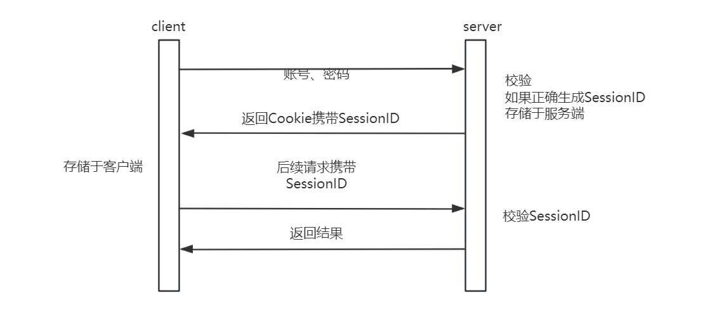
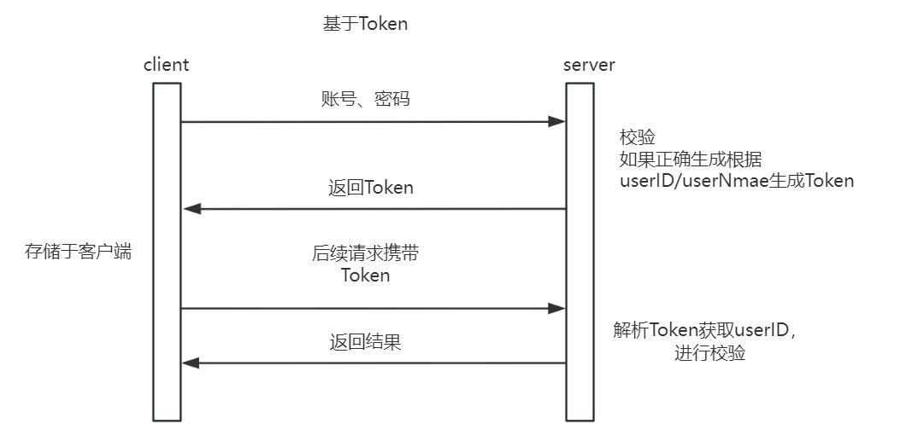
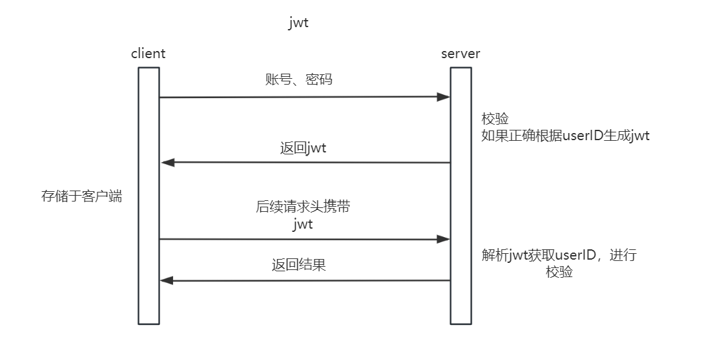
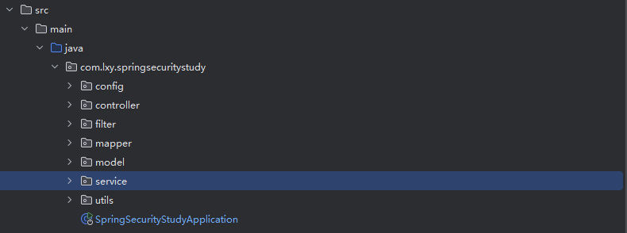
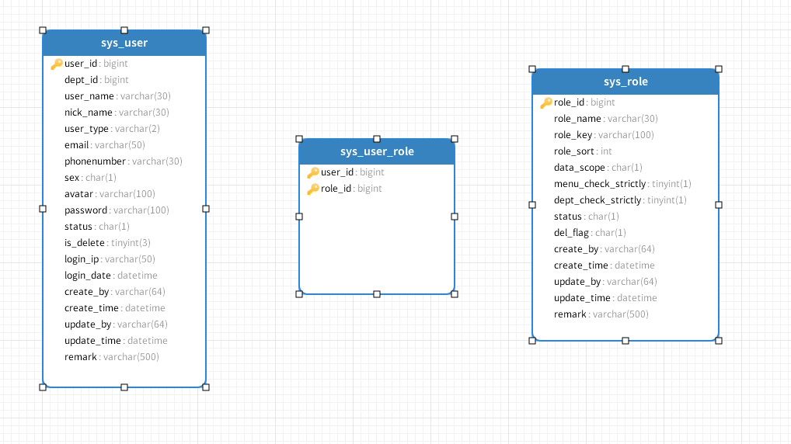

# 一、什么是Spring Security

Spring Security 是一个功能强大且高度可定制的身份验证和访问控制框架，它是 Spring 框架的一部分。它主要用于为 Java 应用程序提供安全保障。Spring Security 提供了全面的安全服务，主要包括认证和授权、攻击防护、以及在应用程序级别的安全配置。

## 1.**核心功能**

以下是 Spring Security 的一些核心功能：

认证（Authentication）：Spring Security 支持多种认证方式，如表单认证、LDAP、基于数据库的认证、OpenID、OAuth2 等。

授权（Authorization）：提供访问控制，可以细粒度地控制资源的访问权限。可以通过角色、权限等信息来决定是否允许对特定资源的访问。

防护攻击：提供防护措施，如防止会话固定攻击、点击劫持、跨站点请求伪造（CSRF）等。

Spring Security 通过一个过滤器链来提供安全控制，确保对于进入应用的请求都按照配置的安全策略进行处理。它也非常适合企业级应用，可以通过简单的配置来满足复杂的安全需求。

   - **认证**：Spring Security 支持多种身份验证方式，如表单登录、HTTP 基本认证、LDAP、OpenID、OAuth2 等。它通过一个认证管理器 `AuthenticationManager` 来统一管理这些认证过程。
   - **授权**：授权（authorization）可以基于角色（Role-based）或细粒度的权限（Permission-based）进行访问控制。Spring Security 提供了多种方法来限制对特定资源的访问，如使用注解、XML 配置或 Java 配置。
   - 安全管理

## 2.**Spring Security 的核心组件**

Spring Security 的核心组件主要可以分为以下几个部分：

### （1）认证（Authentication）

1. **AuthenticationManager**：负责处理认证请求。它是一个接口，其中最常用的实现是 `ProviderManager`，它协调多个 `AuthenticationProvider`。
   
2. **AuthenticationProvider**：用于实现具体的认证逻辑。Spring Security 支持多种认证方式，每种方式都可以有自己的 `AuthenticationProvider` 实现。
   
3. **UserDetailsService**：用于加载用户的详细信息。通常用于根据用户名获取用户的认证信息，如密码、授权角色等。
   
4. **UserDetails**：存储用户的详细信息，通常包括用户名、密码、权限列表等，用于认证和授权过程中。

### （2）授权（Authorization）

1. **SecurityContextHolder**：存储了当前线程的安全上下文（SecurityContext），其中包含了当前用户的详细信息。
   
2. **SecurityContext**：接口，定义了获取认证信息的方法。默认实现是 `SecurityContextImpl`。
   
3. **AccessDecisionManager**：决定是否可以访问特定资源。根据配置的授权策略来评估当前用户是否有权限执行某个操作。
   
4. **GrantedAuthority**：代表授权信息的接口，通常表现为用户的权限或角色标识。

### （3）过滤器（Filters）

1. **SecurityFilterChain**：一系列的 Spring Security 过滤器，每个请求都会通过这些过滤器进行必要的安全检查。
   
2. **UsernamePasswordAuthenticationFilter**、**BasicAuthenticationFilter** 等：根据不同的认证机制，Spring Security 提供了多种过滤器来处理对应的认证请求。

### （4）入口点（Entry Points）

1. **AuthenticationEntryPoint**：处理认证过程中的异常或失败。例如，当用户请求一个需要认证的资源而用户未认证时，它决定如何响应。
1. **AccessDeniedHandler：**处理授权过程中的异常或失败。当用户请求某个受保护的资源，但是由于权限不足被拒绝访问时，它决定如何响应。

### （5）HttpSecurity

在Spring Security 6.x版本中，`HttpSecurity`的配置方式有了一些更新，特别是在定义安全配置时采用了更现代的Java配置方法。以下是Spring Security 6.x中`HttpSecurity`的主要特性和配置方法的详细解析：

Spring Security 6.x推荐使用`SecurityFilterChain` bean来配置安全策略，而不是继承`WebSecurityConfigurerAdapter`。这一变化使得安全配置更加灵活，更易于集成和测试。

这是一个基本的`SecurityFilterChain`配置示例，演示了如何使用`HttpSecurity`：

```java
import org.springframework.context.annotation.Bean;
import org.springframework.security.config.annotation.web.builders.HttpSecurity;
import org.springframework.security.web.SecurityFilterChain;

@Bean
public SecurityFilterChain filterChain(HttpSecurity http) throws Exception {
    http
        .authorizeHttpRequests(authorize -> authorize
            .requestMatchers("/admin/**").hasRole("ADMIN")
            .anyRequest().authenticated()
        )
        .formLogin(withDefaults())
        .httpBasic(withDefaults());
    return http.build();
}
```

1. **认证入口点（Authentication Entry Points）**：
   - `httpBasic()`: 启用HTTP基础认证。
   - `formLogin()`: 启用表单登录。

2. **请求授权（Request Authorization）**：
   - `authorizeHttpRequests()`: 允许基于HttpServletRequest限制访问。
   - `antMatchers()`, `mvcMatchers()`: 指定URL模式以应用安全约束。

3. **会话管理（Session Management）**：
   - `sessionManagement()`: 配置会话固定保护，会话失效处理等。

4. **CSRF保护（Cross-Site Request Forgery Protection）**：
   - `csrf()`: 启用或禁用CSRF保护。

5. **跨域资源共享（CORS）**：
   - `cors()`: 配置跨域资源共享政策。

6. **例外处理（Exception Handling）**：
   - `exceptionHandling()`: 配置自定义的认证入口点和访问拒绝处理器。

7. **注销（Logout）**：
   - `logout()`: 配置注销行为，例如注销URL和注销成功后的重定向。

8. **重定向和转发（Redirection and Forwarding）**：
   - `redirectStrategy()`, `defaultSuccessUrl()`, `failureUrl()`: 配置成功或失败后的重定向策略。

Spring Security 6.x还支持许多高级安全特性，如OAuth2, OpenID Connect, SAML, 和多因素认证。这些特性通常需要更复杂的配置，涉及多个组件和外部服务。

通过这些核心组件，Spring Security 提供了一个既灵活又强大的安全框架，可以应用于各种大小和复杂度的 Java 应用程序中。这些组件协同工作，确保应用程序的安全性，防止未经授权的访问，并保护应用程序免受常见的安全威胁。

## 3.核心流程

Spring Security 的主要工作流程涵盖了从请求接收到处理完成的整个安全验证和授权过程。这个流程可以分为以下几个主要步骤：


### （1）请求拦截

当一个请求到达 Spring 应用程序时，首先被 Spring Security 的一系列过滤器链（Filter Chain）拦截。这些过滤器负责执行不同的安全检查，如身份验证、授权等。

### （2）身份验证

1. **身份验证请求**：过滤器识别出需要身份验证的请求（例如，通过用户名和密码的登录请求）。
   
2. **AuthenticationManager 处理**：请求被传递给 `AuthenticationManager`，它负责协调认证过程。`AuthenticationManager` 将使用适当的 `AuthenticationProvider` 来尝试认证用户。
   
3. **加载用户细节**：`AuthenticationProvider` 通常会使用 `UserDetailsService` 来加载用户的详细信息，例如用户名、密码和授权角色。
   
4. **认证决策**：如果用户的凭证有效，`AuthenticationProvider` 返回一个包含用户权限的 `Authentication` 对象。

### （3）建立安全上下文

一旦用户成功认证，`SecurityContextHolder` 会存储包含用户认证信息的 `SecurityContext`，使得这些信息可以在后续的请求处理中随时可用。

### （4）授权处理

1. **访问决策**：当请求尝试访问受保护的资源时，`AccessDecisionManager` 根据用户的认证信息（角色、权限等）决定是否允许访问。
   
2. **授权验证**：例如，访问某个特定的 HTTP 端点可能需要用户拥有特定的角色或权限。如果用户不满足这些条件，请求将被拒绝。

### （5）请求处理

如果请求被授权，它将继续沿着过滤器链传递至应用程序的其他部分，最终达到请求的目标资源。

### （6）异常处理

如果在认证或授权过程中出现问题，如用户名和密码不匹配、权限不足等，`AuthenticationEntryPoint` 或其他相关机制会介入处理，可能会导向错误页面或返回错误响应。

通过这个流程，Spring Security 确保了应用程序在处理每个请求时的安全性，无论是对用户身份的验证还是对其请求的授权。这种机制极大地增强了应用程序对各种安全威胁的防护能力。

# 二、快速入门

以 Spring Boot 项目为例，使用 Maven 进行依赖管理，本教程将引导你快速设置和测试 Spring Security。

## 导入依赖

首先，你需要在 Maven 的 `pom.xml` 文件中添加 Spring Security 的依赖：

```xml
<dependency>
    <groupId>org.springframework.boot</groupId>
    <artifactId>spring-boot-starter-security</artifactId>
</dependency>
```

这个依赖包含了启动 Spring Security 所需的所有基础设施和默认配置。

## 业务

创建一个简单的控制器 `HelloController`，该控制器包含一个 `hello` 接口，返回简单的字符串：

```java
@RestController
public class HelloController {
    @GetMapping("hello")
    public String hello() {
        return "hello";
    }
}
```

## 测试

默认情况下，Spring Security 会添加登录界面，并要求身份验证。进行如下操作测试：

启动应用，然后访问 `http://localhost:8080/hello`。

浏览器会自动重定向到登录页面 `http://localhost:8080/login`。


使用用户名 `user` 登录。登录密码会在应用启动时打印在控制台中。


登录成功后，将重定向回之前试图访问的 `/hello` 页面，显示 "hello"。


Spring Security 也提供了默认的登出功能：

访问 `http://localhost:8080/logout`。

应用会处理登出逻辑，并将用户重定向到登录页面，同时显示登出成功的提示。


# 三、认证

## 1.什么是Authentication

通俗地讲就是验证当前用户的身份，证明“你是你自己”（比如：你每天上下班打卡，都需要通过指纹打卡，当你的指纹和系统里录入的指纹相匹配时，就打卡成功）

互联网中的认证

* **用户名密码登录**
* **邮箱发送登录链接**
* **手机号接收验证码**

### （1）两种认证方式

#### 概念扫盲

在 Web 开发中，会话（Session）、Cookie 和令牌（Token）是三种常用的机制，用来在客户端和服务器之间保持状态和进行用户身份验证。

**Session**

   - **概念**：Session 是服务器端用来存储用户状态的一种方式。当用户与 Web 应用交互时，服务器可以为该用户会话创建一个唯一的会话标识符（Session ID）。
   - **使用方式**：Session ID 通常存储在用户的浏览器上，通过 Cookie 发送到浏览器，并在随后的请求中由浏览器返回给服务器。服务器利用这个 Session ID 来检索会话数据，比如用户的登录状态、购物车内容等。
   - **安全性**：Session 相对安全，因为具体的数据存储在服务器上。但 Session ID 需要通过网络传输，有可能被截获（如通过无安全措施的网络）。

**Cookie**

   - **概念**：Cookie 是服务器发送到用户浏览器并保存在本地的小块数据。它可以包含各种信息，比如用户偏好、Session ID 等。
   - **使用方式**：服务器通过 HTTP 响应头部的 Set-Cookie 指令向浏览器发送 Cookie。浏览器将 Cookie 保存，并在之后的每个请求中自动通过 Cookie HTTP 头部将其发送回服务器。
   - **安全性**：Cookie 可以被设置为仅在加密的 HTTPS 连接中传输（使用 Secure 属性），并可以被标记为 HttpOnly（使其无法通过客户端脚本访问），以提高安全性，防止XSS攻击。

**Token（令牌）**

> 访问资源接口（API）时所需要的资源凭证

   - **概念**：Token 是一种服务端生成的字符串，用于表示用户的认证信息。常见的令牌类型有 JWT（JSON Web Tokens）等。
   - **使用方式**：在用户登录成功后，服务器生成一个 Token 并发送给客户端。客户端将这个 Token 存储在本地（如在 localStorage 或 sessionStorage 中），并在之后的每个请求的 Authorization 头部中发送这个 Token。
   - **安全性**：Token 的安全性较高，因为它可以包含加密信息和过期时间。服务器不需要存储 Token 的状态，而是通过验证从客户端收到的 Token 来确认用户身份，这是一种无状态的验证方式。

它通常包括：

- **uid（用户唯一的身份标识）**：标识请求者的唯一ID。
- **time（时间戳）**：用于检测 Token 的新鲜度或过期状态。
- **sign（签名）**：Token 的前几位经过哈希算法压缩成的一定长度的十六进制字符串，用于验证 Token 的完整性和真实性。

Token特点：

* **服务端无状态化、可扩展性好**：服务端无需存储用户状态，便于横向扩展。
* **支持移动端设备**：Token 机制自然适合非浏览器环境。
* **安全**：通过使用签名和时间戳提高安全性。
* **支持跨程序调用**：Token 可以被不同的客户端程序所共享和使用。

这三种机制在 Web 开发中各有优势和应用场景：
- **Session** 更适用于需要服务器存储大量用户状态信息的情况。
- **Cookie** 是传统的保持用户状态和偏好的方式，但通常需要正确配置以保证安全。
- **Token** 提供了一种灵活、可扩展的用户认证方式，特别适合现代的 Web 应用和移动应用，可以跨域使用。

#### 基于Session

**认证流程**



在基于 Session 的认证中，认证流程通常包括以下几个步骤：

1. **用户登录：** 用户提交用户名和密码给服务器。
2. **服务器验证：** 当用户首次登录时，服务器验证用户的凭据（如用户名和密码），如果凭据正确，服务器将创建一个会话对象，这个会话对象存储在服务器的内存或其他存储介质中，并且会被赋予一个唯一的会话I。
3. **发送 Cookie：** 服务器向用户的浏览器发送一个 Cookie，通常包含一个唯一的 Session ID，但不包含敏感信息如用户名或密码。
4. **客户端存储和使用 Cookie：** 浏览器将 Cookie 存储起来，并在之后的每次请求中自动发送给服务器。
5. **服务器识别和响应：** 服务器接收请求并通过 Session ID 检索对应的 Session，以确定用户身份和权限，然后根据请求提供相应的服务。

**Session认证的问题**

尽管基于 Session 的认证机制广泛应用于多种 Web 应用程序中，但它也存在一些问题：

1. **分布式：** 当应用需要在多台服务器之间共享 Session 信息时，维护其一致性变得复杂。这可能需要额外的 Session 管理机制，如 Session 共享、持久化或使用中心化的 Session 存储。
2. **安全性：** Session 可能遭受会话劫持攻击，攻击者通过盗取或篡改用户的 Cookie 来获得未经授权的访问权限。此外，如果 Session 数据在服务器上被泄露，也可能导致安全问题。
3. **资源消耗：** 每个用户都会在服务器上创建一个 Session，这可能会导致服务器资源（如内存）的显著消耗，尤其是在大量用户访问的情况下。

#### 基于Token

**认证流程**



1. 客户端使用用户名和密码请求登录。
2. 服务端收到请求后验证用户名与密码，验证成功后，服务器基于用户的身份信息生成一个 Token。这个 Token 包含了用户的身份标识和其他声明（claims），并且通常会被加密和/或签名，并返回至服务端。
3. 客户端收到 Token 后，将其存储在本地。
4. 客户端在之后的每次请求中携带 Token 向服务端请求资源。
5. 服务端验证请求中的 Token，若验证成功，则返回所请求的数据。

**与Session区别**

- **无状态 vs. 有状态：** Token 认证是无状态的，服务器不需要存储用户的会话信息，这有助于减轻服务器的负担并简化扩展。而 Session 认证是有状态的，需要在服务器上存储用户的会话数据。
- **安全性：** Token 通常更安全，尤其是在使用 HTTPS 时，因为 Token 本身包含所有必要的用户信息，并且可以通过各种手段（如 JWT）进行安全加密。而 Session 可能面临会话劫持的风险。
- **可扩展性：** Token 方便在不同的系统和服务之间共享认证状态，特别适用于微服务架构和分布式系统。而 Session 则需要额外的机制来同步和管理会话状态，这在多服务器环境中可能比较复杂。
- **跨平台支持：** Token 更适合非浏览器环境，如移动应用和桌面应用，因为它们可以轻松地在 HTTP 头部携带 Token 进行请求。而 Session 依赖于 Cookie，主要适用于 Web 浏览器。

### （3）JWT

#### **什么是JWT**

**JWT (JSON Web Token)** 是一种基于 JSON 的开放标准（RFC 7519），用于创建访问令牌，允许系统在各方之间安全地传递信息。JWT 是目前非常流行的跨域认证解决方案，通过数字签名的方式，以JSON对象为载体，在用户和服务器之间传递安全可靠的信息。

#### **JWT 的结构**

JWT 主要包含三个部分，它们之间由点（`.`）分隔：

1. **Header（头部）**
   - 包含 Token 类型（通常是 JWT）和所使用的签名算法（例如 HMAC SHA256 或 RSA）。
   - 示例：`{"alg": "HS256", "typ": "JWT"}`。
2. **Payload（有效载荷）**
   - **Registered Claims（注册声明）**：这些声明不是必须的，但它们是预定义的，推荐使用以提供一致的、互操作的 JWT。它们包括：
     - `iss`（Issuer）：发行者
     - `sub`（Subject）：主题
     - `aud`（Audience）：观众
     - `exp`（Expiration Time）：过期时间
     - `nbf`（Not Before）：生效时间
     - `iat`（Issued At）：发行时间
     - `jti`（JWT ID）：JWT 的唯一身份标识
   - **Public Claims（公共声明）**：可以自由定义的声明，通常用于共享信息。为了避免冲突，它们应当在 IANA JSON Web Token Registry 中注册，或包含一个包含碰撞防止命名空间的名称。
   - **Private Claims（私有声明）**：这些是发送方和接收方之间共享的声明，不需要注册，可以自由使用。这类声明用于携带与业务逻辑相关的信息。
3. **Signature（签名）**
   - 使用 Header 中指定的算法和密钥对 Header 和 Payload 进行签名。这是为了验证消息的发送者是谁，以及确保消息在途中未被篡改。
   - 例如，如果使用的是 HMAC SHA256 算法：`HMACSHA256(base64UrlEncode(header) + "." + base64UrlEncode(payload), secret)`。

#### **JWT 认证流程**



1. 用户认证请求：用户提交用户名和密码并使用HTTPS进行传输，确保敏感信息在互联网传输过程中不被嗅探或窃取。

2. 服务端生成并发送JWT：服务端接收到用户名和密码后，首先进行验证，验证成功后，选择必要的用户信息（如用户ID），并将这些信息放入JWT的Payload中，发送JWT给客户端。
3. 客户端发送请求：在发起请求时，客户端需要在HTTP请求的Header中包含JWT。通常放在`Authorization`字段，格式为`Bearer <token>`。这种方式有助于解决跨站请求伪造（CSRF）的问题，因为JWT只通过HTTP头部传输，不会像某些Cookie那样自动发送。并且开发者可以直接访问这些存储来获取或设置 Token，无需复杂的后端逻辑来处理发送和接收 Cookie。

4. 服务端验证JWT：客户端接收到请求后，首先检查HTTP头部的`Authorization`字段是否包含JWT。

   - 检查签名的正确性，确保JWT未被篡改。

   - 验证Token的有效性，如是否已过期。

   - 确认Token的接收方是否正确。

5. 授权与响应：一旦JWT验证成功，服务端将使用JWT中的信息执行请求的业务逻辑，并返回相应的结果。如果用户需要登出，应删除存储的JWT，确保退出登录状态。

#### JJWT（Java JWT）实战

> 官方文档：[jwtk/jjwt: Java JWT: JSON Web Token for Java and Android (github.com)](https://github.com/jwtk/jjwt)

##### 导入依赖

```xml
<dependency>
    <groupId>io.jsonwebtoken</groupId>
    <artifactId>jjwt</artifactId>
    <version>0.9.1</version>
</dependency>
```

注意：从 Java 9 开始，`javax.xml.bind` 模块不再包含在 JDK 的标准库中，如果使用高版本的JDK，需要额外添加依赖

```xml
<!-- 添加 JAXB API -->
<dependency>
    <groupId>javax.xml.bind</groupId>
    <artifactId>jaxb-api</artifactId>
    <version>2.3.1</version>
</dependency>
<!-- 添加 JAXB 核心实现 -->
<dependency>
    <groupId>org.glassfish.jaxb</groupId>
    <artifactId>jaxb-runtime</artifactId>
    <version>2.3.2</version>
</dependency>
```

##### JWTUtils

```java
/**
 * JWT工具类，用于生成和解析JSON Web Tokens（JWT）。
 * 本类提供了根据指定用户名和过期时间生成JWT令牌的方法，
 * 以及解析令牌以提取信息的方法。
 */
public class JWTUtils {

    // 用于签名JWT令牌的密钥。请将"your_secret_key"替换为一个强大的、私有的密钥。
    private static final String SECRET_KEY = "your_secret_key";

    /**
     * 生成JWT令牌。
     * @param username 用户名，通常是用户的唯一标识。
     * @param expirationMillis 令牌过期时间，以毫秒为单位。
     * @return 生成的JWT令牌字符串。
     */
    public static String createToken(String userId, long expirationMillis) {
        long nowMillis = System.currentTimeMillis();
        Date now = new Date(nowMillis);
        return Jwts.builder()
                .setSubject(userId) // 设置主题，即令牌的所有者。
                .setIssuedAt(now)     // 设置令牌的签发时间。
                .setExpiration(new Date(nowMillis + expirationMillis)) // 设置令牌的过期时间。
                .signWith(SignatureAlgorithm.HS256, SECRET_KEY) // 使用HS256算法和密钥进行签名。

                .compact();
    }

    /**
     * 解析JWT令牌。
     * @param token 要解析的JWT令牌字符串。
     * @return Claims对象，包含令牌中的声明信息。
     * @throws io.jsonwebtoken.JwtException 如果令牌无效或解析过程中出现问题。
     */
    public static Claims parseToken(String token) {
        return Jwts.parser()
                .setSigningKey(SECRET_KEY) // 设置用于解析JWT的签名密钥。
                .parseClaimsJws(token)    // 解析传入的令牌。
                .getBody();
    }
}
```

##### 测试

```java
@SpringBootTest
class JWTUtilsTest {

    @Test
    @WithMockUser(username="admin", roles={"ADMIN"})
    void jwt() {
        String token = JWTUtils.createToken("Angryyyyy",1000000);
        System.out.println(token);
        Claims parse = JWTUtils.parseToken(token);
        System.out.println(parse);
    }
}
```

## 2.认证流程

### （1）核心流程


1. Spring Security 是一个功能强大且高度可定制的认证和访问控制框架，是保护基于Spring的应用程序的事实上的标准。用户使用用户名和密码登录时，Spring Security 的认证流程可以分为以下几个关键步骤：

2. 登录请求：用户在前端表单输入用户名和密码，提交登录请求。
3. 身份验证过滤：`UsernamePasswordAuthenticationFilter` 捕获登录请求（通常是一个POST请求到`/login`）。这个过滤器截取登录请求并尝试从中提取用户名和密码。
4. 创建认证令牌：过滤器将提取的用户名和密码封装到一个`UsernamePasswordAuthenticationToken`（未认证）中，然后将其传递给`AuthenticationManager`。
5. 认证管理
   - `AuthenticationManager` 接收到`Authentication`对象后，使用配置的`AuthenticationProvider`进行认证。
   - `AuthenticationProvider`通常会调用`UserDetailsService`来获取数据库、LDAP或其他服务中存储的用户详细信息。
   - `UserDetailsService`加载用户详细信息（如用户名、密码和权限）并返回一个`UserDetails`实例。
6. 密码校验：一旦获取到`UserDetails`，`AuthenticationProvider`会使用`PasswordEncoder`来比较存储的密码与用户输入的密码。
7. 认证成功或失败
   - 如果密码匹配，`AuthenticationProvider`将返回一个已认证的`UsernamePasswordAuthenticationToken`，表示认证成功。
   - 如果认证失败（如密码不匹配或用户不存在等），则会抛出相应的异常。
8. 安全上下文：认证成功后，认证对象会被存储在`SecurityContextHolder`中的`SecurityContext`里，供后续的请求进行安全检查和使用。
9. 后处理：可以配置一些额外的过滤器处理认证成功或失败后的逻辑，如重定向到不同的页面或记录认证日志。

这是一个高层次的概览，具体实现可能根据你的应用配置和需求有所不同。在实际开发中，你可以通过自定义`UserDetailsService`，实现特定的认证策略，或者调整密码加密的方法，以适应不同的安全需求。

### （2）核心组件

Spring Security 的身份验证体系中包含了一系列核心组件，它们共同工作以提供强大的安全保障。这些组件包括各种过滤器、管理器、提供者以及用户详细信息服务。


#### **AbstractAuthenticationProcessingFilter**

这是一个抽象基类，用于处理基于表单的登录请求。它封装了身份验证流程的通用逻辑，包括尝试身份验证、成功或失败后的处理。实现此类的具体子类会根据不同类型的认证方式进行具体的认证逻辑实现。

`UsernamePasswordAuthenticationFilter`是 `AbstractAuthenticationProcessingFilter` 的一个具体实现，用于处理基于用户名和密码的身份验证请求。此过滤器获取 HTTP 请求中的用户名和密码，创建一个 `UsernamePasswordAuthenticationToken`，并将其传递给配置的 `AuthenticationManager` 来进行认证。

#### **AuthenticationManager**

它是一个接口，定义了认证的方法。`AuthenticationManager` 最常见的实现是 `ProviderManager`，负责协调多个 `AuthenticationProvider`。`ProviderManager` 会依次尝试每一个配置的提供者，直到其中一个能够处理提供的认证令牌或者全部尝试失败。

#### **AbstractUserDetailsAuthenticationProvider**

这是 `AuthenticationProvider` 的一个抽象实现，专门用于处理基于用户详细信息的服务的认证请求。它通过 `UserDetailsService` 来获取用户的详细信息，并进行相应的认证逻辑。

`DaoAuthenticationProvider`是 `AbstractUserDetailsAuthenticationProvider` 的一个具体实现，它通过 `UserDetailsService` 获取用户详细信息，并使用密码比较器验证用户提供的密码是否正确。

#### **UserDetailsService**

这是一个接口，用于加载用户特定的数据。它只有一个方法 `loadUserByUsername(String username)`，该方法根据用户名查找并返回用户的详细信息。实现这个接口的类需要提供用户存储机制。

`InMemoryUserDetailsManager`是 `UserDetailsService` 的一个实现，它使用内存来存储用户信息。这通常用于测试或小规模应用中，因为它不需要外部存储，而是将所有用户详细信息直接存储在内存中。

### （5）自定义用户认证

在使用 Spring Security 构建安全的应用程序时，自定义用户认证是一个常见需求。通过实现 `UserDetailsService` 和 `UserDetails` 接口，开发者可以灵活地定义如何从数据源中检索用户信息，并将这些信息转换成 Spring Security 能理解的格式。

#### 实现UserDetails接口

为了使自定义的用户信息符合 Spring Security 的要求，需要创建一个 `LoginUser` 类，它实现了 `UserDetails` 接口。这个类将封装用户信息，并提供 Spring Security 需要的用户状态方法。

> 权限暂不做处理

```java
/**
 * @Author ：AngryYYYYYY
 * @Date ：Created in 2024/8/19 20:59
 * @Description：用户登录信息封装类，实现了 Spring Security 的 UserDetails 接口，用于存储用户的认证和授权信息。
 */
@Data
public class LoginUser implements UserDetails {
    private User user;  // 用户实体对象，用于获取用户详细信息

    /**
     * 构造函数，接收一个用户实体作为参数。
     * @param user 用户实体对象
     */
    public LoginUser(User user) {
        this.user = user;
    }

    /**
     * 获取用户的权限列表。
     * @return 用户的权限集合，当前实现返回一个空列表。
     */
    @Override
    public Collection<? extends GrantedAuthority> getAuthorities() {
        return List.of();  // 返回空的权限列表
    }

    /**
     * 获取用户的密码。
     * @return 用户密码
     */
    @Override
    public String getPassword() {
        return user.getPassword();
    }

    /**
     * 获取用户的用户名。
     * @return 用户名
     */
    @Override
    public String getUsername() {
        return user.getUserName();
    }

    /**
     * 账户是否未过期。
     * @return true 表示未过期
     */
    @Override
    public boolean isAccountNonExpired() {
        return true;
    }

    /**
     * 账户是否未锁定。
     * @return true 表示未锁定
     */
    @Override
    public boolean isAccountNonLocked() {
        return true;
    }

    /**
     * 凭证是否未过期。
     * @return true 表示凭证未过期
     */
    @Override
    public boolean isCredentialsNonExpired() {
        return true;
    }

    /**
     * 用户是否启用。
     * @return true 表示启用
     */
    @Override
    public boolean isEnabled() {
        return true;
    }
}

```

#### 实现 UserDetailsService 接口

下面的代码示例展示了如何自定义 `UserDetailsService`。通过重写 `loadUserByUsername` 方法，我们可以根据用户名从数据库中查询用户信息，并将其封装为 Spring Security 所需的 `UserDetails` 对象。

```java
/**
 * 自定义用户详情服务实现，用于根据用户名加载用户详细信息。
 * @Author ：AngryYYYYYY
 * @Date ：Created in 2024/8/19 21:09
 * @Description：通过数据库查询用户信息，如果用户存在则返回用户详情，否则抛出异常。
 */
@Service
public class UserDetailsServiceImpl implements UserDetailsService {

    @Autowired
    private UserMapper userMapper;  // 用户数据库映射器，用于执行数据库查询

    /**
     * 根据用户名加载用户的详细信息。
     * @param username 用户输入的用户名
     * @return UserDetails 用户详细信息
     * @throws UsernameNotFoundException 如果用户名不在数据库中，则抛出此异常
     */
    @Override
    public UserDetails loadUserByUsername(String username) throws UsernameNotFoundException {
        // 创建查询包装器，设置查询条件为用户名匹配
        QueryWrapper<User> wrapper = new QueryWrapper<>();
        wrapper.eq("user_name", username);

        // 从数据库中查询用户
        User user = userMapper.selectOne(wrapper);

        // 检查是否找到用户，如果没有找到则抛出异常
        if (Objects.isNull(user)) {
            throw new UsernameNotFoundException("未找到该用户");
        }

        // 如果找到用户，则返回封装在 LoginUser 类中的用户详情
        return new LoginUser(user);
    }
}


```

### （6）密码加密

在现代应用中，密码安全是不可忽视的一环。Spring Security 提供了 `BCryptPasswordEncoder`，一个基于 bcrypt 算法的密码加密工具，它帮助开发者安全地存储用户密码。

* `encode(CharSequence rawPassword)`：对原始密码进行加密处理，并返回加密后的密码字符串。
* `matches(CharSequence rawPassword, String encodedPassword)`：对比原始密码和加密后的密码是否匹配。

```java
/**
 * Spring Security配置类，用于配置安全性和身份验证参数。
 * @Author ：AngryYYYYYY
 * @Date ：Created in 2024/8/1 15:51
 * @Description：定义了安全配置，包括密码编码器、会话管理、授权请求配置以及添加自定义JWT认证过滤器。
 */
@Configuration
public class SecurityConfig {
    /**
     * 配置密码编码器。
     * 使用 BCryptPasswordEncoder 来安全地加密密码。
     * @return 返回 BCryptPasswordEncoder 实例，用于密码加密。
     */
    @Bean
    public PasswordEncoder passwordEncoder() {
        return new BCryptPasswordEncoder();
    }
}
```

## 3.基于jwt的自定义认证方式

### （1）项目搭建

#### 项目结构



#### 导入依赖

```xml
<dependency>
    <groupId>org.springframework.boot</groupId>
    <artifactId>spring-boot-starter-security</artifactId>
</dependency>
<dependency>
    <groupId>org.springframework.boot</groupId>
    <artifactId>spring-boot-starter-web</artifactId>
</dependency>
<dependency>
    <groupId>org.projectlombok</groupId>
    <artifactId>lombok</artifactId>
    <optional>true</optional>
</dependency>
<!-- 用于生成jwt -->
<dependency>
    <groupId>io.jsonwebtoken</groupId>
    <artifactId>jjwt</artifactId>
    <version>0.9.1</version>
</dependency>
<!-- 添加 JAXB API -->
<dependency>
    <groupId>javax.xml.bind</groupId>
    <artifactId>jaxb-api</artifactId>
    <version>2.3.1</version>
</dependency>
<!-- 添加 JAXB 核心实现 -->
<dependency>
    <groupId>org.glassfish.jaxb</groupId>
    <artifactId>jaxb-runtime</artifactId>
    <version>2.3.2</version>
</dependency>
<dependency>
    <groupId>com.baomidou</groupId>
    <artifactId>mybatis-plus-spring-boot3-starter</artifactId>
    <version>3.5.7</version>
</dependency>
<dependency>
    <groupId>com.mysql</groupId>
    <artifactId>mysql-connector-j</artifactId>
</dependency>
<dependency>
    <groupId>org.springframework.boot</groupId>
    <artifactId>spring-boot-starter-data-redis</artifactId>
</dependency>
<!-- 用于序列化redis -->
<dependency>
    <groupId>com.alibaba</groupId>
    <artifactId>fastjson</artifactId>
    <version>2.0.0</version>
</dependency>
```

#### 工具类

##### FastJsonJsonRedisSerializer

```java
/**
 * @Author ：AngryYYYYYY
 * @Date ：Created in 2024/8/19 22:00
 * @Description：Redis使用FastJson进行序列化
 */
public class FastJsonJsonRedisSerializer<T> implements RedisSerializer<T> {
    private final Class<T> clazz;

    public FastJsonJsonRedisSerializer(Class<T> clazz) {
        super();
        this.clazz = clazz;
    }

    @Override
    public byte[] serialize(T t) throws SerializationException {
        if (t == null) {
            return new byte[0];
        }
        return JSON.toJSONString(t, JSONWriter.Feature.WriteClassName).getBytes(StandardCharsets.UTF_8);
    }

    @Override
    public T deserialize(byte[] bytes) throws SerializationException {
        if (bytes == null || bytes.length <= 0) {
            return null;
        }
        String str = new String(bytes, StandardCharsets.UTF_8);
        return JSON.parseObject(str, clazz, JSONReader.Feature.SupportAutoType);
    }
}
```

##### JwtUtils

```java
/**
 * JWT工具类，用于生成和解析JSON Web Tokens（JWT）。
 * 本类提供了根据指定用户名和过期时间生成JWT令牌的方法，
 * 以及解析令牌以提取信息的方法。
 */
public class JwtUtils {

    // 用于签名JWT令牌的密钥。请将"your_secret_key"替换为一个强大的、私有的密钥。
    private static final String SECRET_KEY = "your_secret_key";
    //毫秒转分钟
    private static final long MINUTES = 1000*60;
    //默认过期时间30分钟
    private static final long EXPIRED_TIME = 30*MINUTES;

    /**
     * 生成JWT令牌。
     * @param userId 用户id，通常是用户的唯一标识。
     * @return 生成的JWT令牌字符串。
     */
    public static String createToken(String userId) {
        return createToken(userId,EXPIRED_TIME);
    }
    /**
     * 生成JWT令牌。
     * @param userId 用户id，通常是用户的唯一标识。
     * @param expirationMillis 令牌过期时间，以毫秒为单位。
     * @return 生成的JWT令牌字符串。
     */
    public static String createToken(String userId, long expirationMillis) {
        long nowMillis = System.currentTimeMillis();
        Date now = new Date(nowMillis);


        return Jwts.builder()
                .setSubject(userId) // 设置主题，即令牌的所有者。
                .setIssuedAt(now)     // 设置令牌的签发时间。
                .setExpiration(new Date(nowMillis + expirationMillis)) // 设置令牌的过期时间。
                .signWith(SignatureAlgorithm.HS256, SECRET_KEY) // 使用HS256算法和密钥进行签名。

                .compact();
    }

    /**
     * 解析JWT令牌。
     * @param token 要解析的JWT令牌字符串。
     * @return Claims对象，包含令牌中的声明信息。
     * @throws io.jsonwebtoken.JwtException 如果令牌无效或解析过程中出现问题。
     */
    public static Claims parseToken(String token) {
        return Jwts.parser()
                .setSigningKey(SECRET_KEY) // 设置用于解析JWT的签名密钥。
                .parseClaimsJws(token)    // 解析传入的令牌。
                .getBody();
    }
}


```

##### RedisCache

```java
/**
 * spring redis 工具类
 */
@SuppressWarnings(value = {"unchecked", "rawtypes"})
@Component
public class RedisCache {
    @Autowired
    public RedisTemplate redisTemplate;

    /**
     * 缓存基本的对象，Integer、String、实体类等
     *
     * @param key   缓存的键值
     * @param value 缓存的值
     */
    public <T> void setCacheObject(final String key, final T value) {
        redisTemplate.opsForValue().set(key, value);
    }

    /**
     * 缓存基本的对象，Integer、String、实体类等
     *
     * @param key      缓存的键值
     * @param value    缓存的值
     * @param timeout  时间
     * @param timeUnit 时间颗粒度
     */
    public <T> void setCacheObject(final String key, final T value, final Integer timeout, final TimeUnit timeUnit) {
        redisTemplate.opsForValue().set(key, value, timeout, timeUnit);
    }

    /**
     * 设置有效时间
     *
     * @param key     Redis键
     * @param timeout 超时时间
     * @return true=设置成功；false=设置失败
     */
    public boolean expire(final String key, final long timeout) {
        return expire(key, timeout, TimeUnit.SECONDS);
    }

    /**
     * 设置有效时间
     *
     * @param key     Redis键
     * @param timeout 超时时间
     * @param unit    时间单位
     * @return true=设置成功；false=设置失败
     */
    public boolean expire(final String key, final long timeout, final TimeUnit unit) {
        return redisTemplate.expire(key, timeout, unit);
    }

    /**
     * 获得缓存的基本对象。
     *
     * @param key 缓存键值
     * @return 缓存键值对应的数据
     */
    public <T> T getCacheObject(final String key) {
        ValueOperations<String, T> operation = redisTemplate.opsForValue();
        return operation.get(key);
    }

    /**
     * 删除单个对象
     *
     * @param key
     */
    public boolean deleteObject(final String key) {
        return redisTemplate.delete(key);
    }

    /**
     * 删除集合对象
     *
     * @param collection 多个对象
     * @return
     */
    public long deleteObject(final Collection collection) {
        return redisTemplate.delete(collection);
    }

    /**
     * 缓存List数据
     *
     * @param key      缓存的键值
     * @param dataList 待缓存的List数据
     * @return 缓存的对象
     */
    public <T> long setCacheList(final String key, final List<T> dataList) {
        Long count = redisTemplate.opsForList().rightPushAll(key, dataList);
        return count == null ? 0 : count;
    }

    /**
     * 获得缓存的list对象
     *
     * @param key 缓存的键值
     * @return 缓存键值对应的数据
     */
    public <T> List<T> getCacheList(final String key) {
        return redisTemplate.opsForList().range(key, 0, -1);
    }

    /**
     * 缓存Set
     *
     * @param key     缓存键值
     * @param dataSet 缓存的数据
     * @return 缓存数据的对象
     */
    public <T> long setCacheSet(final String key, final Set<T> dataSet) {
        Long count = redisTemplate.opsForSet().add(key, dataSet);
        return count == null ? 0 : count;
    }

    /**
     * 获得缓存的set
     *
     * @param key
     * @return
     */
    public <T> Set<T> getCacheSet(final String key) {
        return redisTemplate.opsForSet().members(key);
    }

    /**
     * 缓存Map
     *
     * @param key
     * @param dataMap
     */
    public <T> void setCacheMap(final String key, final Map<String, T> dataMap) {
        if (dataMap != null) {
            redisTemplate.opsForHash().putAll(key, dataMap);
        }
    }

    /**
     * 获得缓存的Map
     *
     * @param key
     * @return
     */
    public <T> Map<String, T> getCacheMap(final String key) {
        return redisTemplate.opsForHash().entries(key);
    }

    /**
     * 往Hash中存入数据
     *
     * @param key   Redis键
     * @param hKey  Hash键
     * @param value 值
     */
    public <T> void setCacheMapValue(final String key, final String hKey, final T value) {
        redisTemplate.opsForHash().put(key, hKey, value);
    }

    /**
     * 获取Hash中的数据
     *
     * @param key  Redis键
     * @param hKey Hash键
     * @return Hash中的对象
     */
    public <T> T getCacheMapValue(final String key, final String hKey) {
        HashOperations<String, String, T> opsForHash = redisTemplate.opsForHash();
        return opsForHash.get(key, hKey);
    }

    /**
     * 获取多个Hash中的数据
     *
     * @param key   Redis键
     * @param hKeys Hash键集合
     * @return Hash对象集合
     */
    public <T> List<T> getMultiCacheMapValue(final String key, final Collection<Object> hKeys) {
        return redisTemplate.opsForHash().multiGet(key, hKeys);
    }

    /**
     * 获得缓存的基本对象列表
     *
     * @param pattern 字符串前缀
     * @return 对象列表
     */
    public Collection<String> keys(final String pattern) {
        return redisTemplate.keys(pattern);
    }
}
        

```

#### 配置

##### application.yml

```yml
spring:
  application:
    name: springsecurity-study
  # datasource
  datasource:
    url: jdbc:mysql://127.0.0.1:3306/community_management_system?useSSL=false&useUnicode=true&characterEncoding=UTF-8&serverTimezone=Asia/Shanghai
    driver-class-name: com.mysql.cj.jdbc.Driver
    username: root
    password: root
# mybatis-plus
mybatis-plus:
  type-aliases-package: com.lxy.springsecuritystudy.model.entity
  mapper-locations: classpath:mapper/*.xml


```

##### RedisConfig

```java
/**
 * @Author ：AngryYYYYYY
 * @Date ：Created in 2024/8/19 21:58
 * @Description：
 */
@Configuration
public class RedisConfig {
    @Bean
    public RedisTemplate<Object, Object> redisTemplate(RedisConnectionFactory connectionFactory) {
        RedisTemplate<Object, Object> template = new RedisTemplate<>();

        // 配置连接工厂
        template.setConnectionFactory(connectionFactory);

        // 使用FastJsonJsonRedisSerializer来序列化和反序列化Redis的value值
        FastJsonJsonRedisSerializer<Object> serializer = new FastJsonJsonRedisSerializer<>(Object.class);

        // Redis中存储的value值采用JSON序列化
        template.setValueSerializer(serializer);

        // Redis中的key值使用StringRedisSerializer来序列化和反序列化
        template.setKeySerializer(new StringRedisSerializer());

        // 初始化RedisTemplate的一些参数设置
        template.afterPropertiesSet();

        return template;
    }
}
```

### （2）自定义用户认证

### （3）加密

### （4）登录

自定义登录流程通常包括创建一个接口用于接收用户登录请求，并处理这些请求。关键步骤包括使用 `AuthenticationManager` 进行用户认证，并在认证成功后生成 JWT 作为认证后的令牌。

```java
@RestController
public class LoginController {

    @Autowired
    private LoginService loginService;

    /**
     * 处理用户登录请求。
     * 用户通过提交用户名和密码来请求登录，如果认证成功，返回一个JWT令牌。
     * @param user 用户登录信息，封装在 User 对象中
     * @return ResponseEntity 返回包含JWT令牌的响应实体
     */
    @PostMapping("/login")
    public ResponseEntity<?> login(@RequestBody User user) {
        try {
            // 调用登录服务，进行用户认证，并接收返回的JWT令牌
            String jwt = loginService.login(user);

            // 检查JWT是否成功生成
            if (jwt == null || jwt.isEmpty()) {
                // 未认证成功，返回401状态码
                return ResponseEntity.status(HttpStatus.UNAUTHORIZED).body("Authentication failed");
            }

            // 创建响应实体，包含JWT令牌，并返回
            return ResponseEntity.ok(jwt);
        } catch (Exception e) {
            // 处理异常情况，返回500状态码
            return ResponseEntity.status(HttpStatus.INTERNAL_SERVER_ERROR).body("Internal server error");
        }
    }
}
```

登录服务 `LoginServiceImpl` 负责具体的用户认证逻辑，包括调用 `AuthenticationManager`，生成 JWT，并将用户信息存储至 Redis，以便后续授权。

```java
/**
 * 登录服务实现类，提供了基于用户名和密码的用户认证方法，并通过 JWT 管理会话。
 * @Author AngryYY
 * @description 自定义认证实现，验证登录凭证并使用 JWT 管理会话。
 * @createDate 2024-08-19 19:54:19
 */
@Service
public class LoginServiceImpl implements LoginService {

    @Autowired
    private AuthenticationManager authenticationManager;  // 管理用户认证的对象

    @Autowired
    private RedisCache redisCache;  // 用于存储用户会话信息的 Redis 缓存

    @Autowired
    private UserMapper userMapper;  // 用户数据访问对象

    /**
     * 处理登录请求，通过认证用户并返回一个 JWT 令牌。
     * @param user 要认证的用户，包含用户名和密码。
     * @return String 如果认证成功，返回 JWT 令牌。
     */
    @Override
    public String login(User user) {
        // 尝试使用提供的用户名和密码进行认证
        Authentication authentication = authenticationManager.authenticate(
                new UsernamePasswordAuthenticationToken(user.getUserName(), user.getPassword()));

        // 检查认证结果，如果认证失败则抛出异常
        if (Objects.isNull(authentication)) {
            throw new RuntimeException("登录失败");
        }


        // 认证成功生成并返回 JWT
        String uuid = UUIDUtils.simpleUUID();
        String jwt = JwtUtils.createToken(uuid);

        // 将用户详情存储在 Redis 中，以便通过 JWT 管理会话
        LoginUser loginUser = (LoginUser) authentication.getPrincipal();
        String redisKey = "login:" + uuid;
        redisCache.setCacheObject(redisKey, loginUser);

        return jwt;
    }
}
```

`UsernamePasswordAuthenticationToken` 是 Spring Security 中用于表示用户认证信息的一个类。它通常在用户登录过程中使用，以存储和传递用户的认证信息。该类有几个构造方法，其中一个常用的构造方法接收三个参数：

1. **Principal**: 这个参数通常表示用户的身份。在大多数情况下是用户的整个对象。
2. **Credentials**: 这个参数用于表示用户的凭据，通常是密码。在验证用户身份后，为了安全起见，通常会将凭据从内存中清除或设置为 `null`。
3. **Authorities**: 这个参数是一个 `Collection`，包含了用户所拥有的权限。这些权限通常用于决定用户可以访问应用中的哪些功能。这些权限（或角色）是 `GrantedAuthority` 对象的集合。

在 `SecurityConfig` 类中配置 Spring Security 的安全措施，允许对登录接口的匿名访问，并设置其他接口的安全要求。

并配置 AuthenticationManager Bean，用于处理实际的认证。

```java
/**
 * Spring Security配置类，用于配置安全性和身份验证参数。
 * @Author ：AngryYYYYYY
 * @Date ：Created in 2024/8/1 15:51
 * @Description：定义了安全配置，包括密码编码器、会话管理、授权请求配置以及添加自定义JWT认证过滤器。
 */
@Configuration
public class SecurityConfig {
    @Autowired
    private JwtAuthenticationTokenFilter jwtAuthenticationTokenFilter;  // JWT身份验证过滤器，用于拦截请求并进行身份验证

    /**
     * 配置密码编码器。
     * 使用 BCryptPasswordEncoder 来安全地加密密码。
     * @return 返回 BCryptPasswordEncoder 实例，用于密码加密。
     */
    @Bean
    public PasswordEncoder passwordEncoder() {
        return new BCryptPasswordEncoder();
    }

    /**
     * 定义并配置 SecurityFilterChain，用于处理HTTP安全性。
     * @param http HttpSecurity配置对象，用于定义请求的安全处理。
     * @return SecurityFilterChain 实例，表示配置好的HTTP安全链。
     * @throws Exception 抛出异常，如果配置过程中出现错误。
     */
    @Bean
    public SecurityFilterChain filterChain(HttpSecurity http) throws Exception {
        http
                // 禁用 CSRF 防护，适用于无状态的API服务
                .csrf(AbstractHttpConfigurer::disable)

                // 配置会话管理策略，STATELESS表示不使用HTTPSession进行会话管理
                .sessionManagement(session -> session.sessionCreationPolicy(SessionCreationPolicy.STATELESS))

                // 配置授权请求，定义哪些URL路径应该被保护
                .authorizeHttpRequests(authorization -> authorization
                        .requestMatchers(HttpMethod.POST, "/login").permitAll()  // 允许所有用户访问登录接口
                        .anyRequest().authenticated()  // 其他所有请求都需要认证
                )

                // 在用户名密码认证过滤器之前添加自定义JWT过滤器，用于验证JWT令牌
                .addFilterBefore(jwtAuthenticationTokenFilter, UsernamePasswordAuthenticationFilter.class);

        return http.build();
    }

    /**
     * 配置 AuthenticationManager Bean，用于处理实际的认证。
     * @param authenticationConfiguration 认证配置，由Spring Security提供
     * @return 返回配置好的 AuthenticationManager 实例。
     * @throws Exception 抛出异常，如果认证管理器配置失败。
     */
    @Bean
    public AuthenticationManager authenticationManager(AuthenticationConfiguration authenticationConfiguration) throws Exception {
        return authenticationConfiguration.getAuthenticationManager();
    }
}
```

### （5）自定义过滤器

在用户成功登录并获取JWT之后，每次请求都需要验证JWT的有效性。认证过滤器的任务是从请求中提取JWT，验证它，并从中提取用户信息，然后将其存储在`SecurityContextHolder`中，以供后续请求使用。

这个过滤器将继承`OncePerRequestFilter`类，确保在每次请求中只调用一次过滤器。它的主要职责是解析JWT，从中提取用户ID，并使用这个ID从Redis中获取用户详细信息。

```java
/**
 * 自定义 JWT 认证过滤器，用于验证请求中的 JWT 并从 Redis 加载用户详情，确保用户请求的合法性。
 * @author spikeCong
 * @date 2023/4/25
 */
@Component
public class JwtAuthenticationTokenFilter extends OncePerRequestFilter {

    @Autowired
    private RedisCache redisCache; // Redis 缓存服务，用于存取用户认证信息

    /**
     * 对每个请求执行一次 JWT 认证逻辑。
     * @param request 请求对象
     * @param response 响应对象
     * @param filterChain 过滤器链
     * @throws ServletException, IOException
     */
    @Override
    protected void doFilterInternal(HttpServletRequest request, HttpServletResponse response, FilterChain filterChain) throws ServletException, IOException {

        // 从请求头获取 JWT
        String token = request.getHeader("token");

        // 如果 token 为空，则继续处理请求链中的下一个过滤器
        if (!StringUtils.hasText(token)) {
            filterChain.doFilter(request, response);
            return;
        }

        // 解析 JWT 获取用户 ID
        String userId;
        try {
            Claims claims = JwtUtils.parseToken(token);
            userId = claims.getSubject();
        } catch (Exception e) {
            throw new RuntimeException("非法 token");
        }

        // 从 Redis 获取用户信息
        String redisKey = "login:" + userId;
        LoginUser loginUser = redisCache.getCacheObject(redisKey);
        if (Objects.isNull(loginUser)) {
            throw new throw new AuthenticationException("用户未登录");
        }

        // 构造认证对象并设置到 SecurityContext 中
        UsernamePasswordAuthenticationToken authenticationToken = new UsernamePasswordAuthenticationToken(loginUser, null, loginUser.getAuthorities());
        SecurityContextHolder.getContext().setAuthentication(authenticationToken);

        // 继续执行过滤链中的下一个过滤器
        filterChain.doFilter(request, response);
    }
}

```

过滤器需要在`SecurityConfig`中注册，以确保它被包括在Spring Security的过滤器链中。这通常是通过`addFilterBefore`方法完成的，它确保自定义过滤器在`UsernamePasswordAuthenticationFilter`之前执行。

### （6）注销

在使用JWT和Redis进行用户会话管理的应用中，定义一个退出登录接口主要涉及删除Redis中存储的用户会话数据。这样做确保即使JWT仍在有效期内，也不会被后续请求所使用，因为相关的会话已经被标记为无效。

当使用无状态的认证机制（如基于JWT的认证）时，每次请求都需要重新认证。这意味着`SecurityContextHolder`会在每次请求开始时被设置，并在请求结束时清理。因此，即使在当前会话中清除了`SecurityContextHolder`，这对于无状态认证机制来说并不是必需的，因为它每次都不会携带之前的认证信息。

**LoginController**

定义一个GET请求的退出登录接口，当调用此接口时，触发登录服务的`logout`方法。

```java
@RestController
public class LoginController {

    @Autowired
    private LoginService loginService;

     /**
     * 退出登录接口，删除用户会话
     * @return 返回注销操作结果
     */
    @GetMapping("/logout")
    public ResponseEntity<?> logout() {
        try {
            // 尝试执行注销逻辑
            if (loginService.logout()) {
                // 注销成功，返回成功响应
                return ResponseEntity.ok().body("注销成功");
            } else {
                // 注销逻辑执行了，但未达到预期效果，可能是因为用户已经处于未登录状态
                return ResponseEntity.badRequest().body("注销失败，用户可能已经是未登录状态");
            }
        } catch (Exception e) {
            // 注销过程中发生异常，返回内部服务器错误响应
            return ResponseEntity.status(HttpStatus.INTERNAL_SERVER_ERROR).body("服务器内部错误，注销失败");
        }
    }
}
```

**LoginServiceImpl **

服务实现类中包括从`SecurityContextHolder`获取当前用户的认证信息，并使用此信息来从Redis中删除用户的会话数据。

```java
@Service
public class LoginServiceImpl implements LoginService {

    @Autowired
    private RedisCache redisCache;

    @Override
    public boolean logout() {
        // 获取当前用户的认证信息
        Authentication authentication = SecurityContextHolder.getContext().getAuthentication();

        // 检查是否存在认证信息，如果不存在或主体为空，则抛出异常
        if (authentication == null || authentication.getPrincipal() == null) {
            throw new RuntimeException("用户未登录或已过期");
        }

        // 从认证信息中获取当前登录的用户详情
        LoginUser loginUser = (LoginUser) authentication.getPrincipal();
        Long userId = loginUser.getUser().getUserId();

        // 删除Redis中存储的用户信息，通过用户ID构建Redis的键名
        boolean isDeleted = redisCache.deleteObject("login:" + userId);

        // 清除SecurityContextHolder中的认证信息，确保注销完全
        SecurityContextHolder.clearContext();

        // 返回Redis删除操作的结果，如果成功删除，则返回true，否则返回false
        return isDeleted;
    }

}
```

# 四、授权

## 1.什么是authorization

授权是信息安全中的一个核心概念，其目的是确保只有得到授权的用户或系统才能访问资源或执行操作。授权过程通常在认证（Authentication）之后进行，认证是用来验证用户的身份，例如通过用户名和密码。一旦用户的身份得到认证，系统就会进行授权，根据用户的权限决定他们可以访问哪些资源或执行哪些操作。

### （1）Authorize HTTP Request

### （2）Method Security

#### `@EnableMethodSecurity`

在`SecurityConfig`类中添加`@EnableMethodSecurity`注解，以启用方法级的安全性设置。

```java
@EnableMethodSecurity
public class SecurityConfig {}
```

#### `@PreAuthorize`

`@PreAuthorize` 是 Spring Security 提供的一种注解，用于方法安全，它允许在方法调用之前基于表达式的条件来进行访问控制。这种权限控制的方法特别适合细粒度的安全需求，例如对特定方法的访问进行限制。下面详细介绍 `@PreAuthorize` 的用法，特别是和 `hasAuthority`, `hasAnyAuthority`, `hasRole`, `hasAnyRole` 这些常用方法的结合。

`@PreAuthorize` 注解可以放在方法上，用来决定一个方法是否应该被执行。它可以使用表达式语言来描述安全要求，常见的表达式包括：

- **`hasAuthority(String authority)`**：
  检查当前用户是否有指定的权限（authority）。权限通常是用户进行操作所必需的，不同于角色，它可以是更细粒度的控制。

- **`hasAnyAuthority(String... authorities)`**：
  检查当前用户是否具有列出的任何权限。如果用户拥有参数中任意一个指定的权限，表达式结果为真。

- **`hasRole(String role)`**：
  检查当前用户是否有指定的角色。在使用时，Spring Security 会默认在角色名前添加前缀 “ROLE_”。因此如果你指定 `hasRole('ADMIN')`，实际上它会检查 `ROLE_ADMIN`。

- **`hasAnyRole(String... roles)`**：
  类似于 `hasAnyAuthority`，检查当前用户是否拥有列出的任何角色中的一个。

以下是一个使用 `@PreAuthorize` 的示例，演示了如何在实际代码中使用这些表达式：

```java
import org.springframework.security.access.prepost.PreAuthorize;

public class UserService {

    @PreAuthorize("hasRole('ADMIN')")
    public void deleteUser(Long id) {
        // 代码逻辑，只有 ADMIN 角色的用户才能执行此方法
    }

    @PreAuthorize("hasAnyRole('ADMIN', 'EDITOR')")
    public void editUser(Long id) {
        // 代码逻辑，ADMIN 或 EDITOR 角色的用户都可以执行此方法
    }

    @PreAuthorize("hasAuthority('WRITE_PRIVILEGES')")
    public void writePost() {
        // 代码逻辑，要求用户具有 WRITE_PRIVILEGES 权限
    }

    @PreAuthorize("hasAnyAuthority('READ_PRIVILEGES', 'WRITE_PRIVILEGES')")
    public void readPost() {
        // 代码逻辑，用户具有 READ_PRIVILEGES 或 WRITE_PRIVILEGES 中的任意一个权限时可以执行
    }
}
```

- 使用 `@PreAuthorize` 时需要确保启用了方法安全性配置。在 Spring 配置中可以通过 `@EnableGlobalMethodSecurity(prePostEnabled = true)` 来启用。
- `@PreAuthorize` 可以与 `@PostAuthorize`, `@PreFilter`, `@PostFilter` 等注解一起使用，提供更复杂的安全策略。

### （3）RBAC

RBAC 是一种非常流行的授权模型，它简化了权限管理。在这个模型中，权限不是直接分配给用户，而是分配给角色，用户通过成为角色的一部分来继承这些权限。这种模式的优势在于：

- **简化管理**：管理者只需关心角色的权限设置，而不是每个个体用户的权限。
- **提高安全性**：通过严格定义角色和相关权限，可以减少不必要的权限赋予。
- **易于扩展**：随着组织的发展，可以轻松添加新的角色或修改现有角色的权限，而不需要重新配置每个用户。

RBAC 特别适用于用户基数大且角色定义明确的组织，如企业、政府机构等。在设计系统时，通常需要仔细定义角色和权限，以确保既满足业务需求，又不妨碍系统的安全性和管理效率。

通过这些概念和机制的正确实施，组织可以有效地控制对敏感信息和关键资源的访问，从而保护数据不受未授权的使用或泄露。

基于RBAC模型，需要在数据库中存储用户、角色和权限数据，并能够检索一个用户的所有权限。



## 2.授权流程

在Spring Security中，授权的基本流程涉及几个关键组件和步骤。这个流程确保了只有具有相应权限的用户能够访问应用中的受保护资源。

1. 用户认证：授权之前，首先要完成用户的认证。用户提供凭据（如用户名和密码），系统验证这些凭据是否与存储在安全数据源（如数据库）中的凭据匹配。

2. 加载用户权限：一旦用户成功认证，系统会加载该用户的权限或角色。这些权限可能直接关联到用户，也可能通过用户所属的角色间接关联。

3. 请求拦截：用户发起请求访问资源时，Spring Security的过滤器链会拦截这个请求。过滤器链是一系列的过滤器，负责不同的安全功能，如身份验证、授权检查等。

4. 授权决策：请求被拦截后，`AccessDecisionManager` 负责做出授权决策。它会根据用户的权限、请求所需的权限（通常由配置或注解指定，如 `@PreAuthorize`），以及可能的其他因素（如IP地址、时间等）来决定是否允许访问。

5. 访问控制：如果 `AccessDecisionManager` 判断用户拥有足够的权限，请求就会被允许继续执行，用户可以访问请求的资源。如果权限不足，用户会收到一个错误消息，通常是403 Forbidden错误，表示没有访问权限。

6. 处理完成：一旦授权决策完成，后续的过滤器会继续处理请求，最终将控制权交给应用程序的业务逻辑。

授权是确保应用安全的关键环节，涉及到的组件和流程在不同的应用和配置中可能有所变化，但基本原理保持一致。如果你需要进一步的细节或具体的帮助，请随时提问。

## 3.自定义授权

在Spring Security框架中，自定义授权是通过设置访问特定资源所需的权限来实现的。这一过程涉及使用注解来声明方法级的安全要求，以及通过角色基于访问控制（RBAC）模型来管理用户权限。

### （1）基于RBAC的库表设计

从数据库获取用户的角色信息

```java
@Mapper
public interface UserMapper extends BaseMapper<User> {
    /**
     * 通过用户ID查询对应的角色键值。
     * 此方法通过联表查询在sys_user, sys_user_role, 以及sys_role中获取指定用户的角色键值。
     * 
     * @param userId 用户的唯一标识ID
     * @return 返回对应用户的角色键值，如果没有找到对应数据则返回null
     */
    @Select("SELECT r.role_key FROM sys_user u INNER JOIN sys_user_role ur ON u.user_id = ur.user_id INNER JOIN sys_role r ON ur.role_id = r.role_id WHERE u.user_id = #{userId}")
    String getRoleKeyForUser(Long userId);
}
```

### （2）设置资源访问的权限

在控制器中，可以使用`@PreAuthorize`注解来定义哪些权限的用户可以访问特定的方法。

```java
@RestController
public class HelloController {
    @PreAuthorize("hasRole('admin')")
    @GetMapping("/hello")
    public String hello() {
        return "hello";
    }
}
```

### （3）封装权限

在`UserDetailsServiceImpl`中，从数据库查询用户权限，并将这些权限信息封装到`LoginUser`对象中。`LoginUser`对象应该实现`UserDetails`接口，提供权限信息的集合供Spring Security使用。

```JAVA
/**
 * 自定义用户详情服务实现，用于根据用户名加载用户详细信息。
 * @Author ：AngryYYYYYY
 * @Date ：Created in 2024/8/19 21:09
 * @Description：通过数据库查询用户信息，如果用户存在则返回用户详情，否则抛出异常。
 */
@Service
public class UserDetailsServiceImpl implements UserDetailsService {
		//.....
        //从数据库中查询用户的权限信息
        List<String> roles = userMapper.getRolesForUser(user.getUserId());

        // 如果找到用户，则返回封装在 LoginUser 类中的用户详情
        return new LoginUser(user,roles);
    }
}
```

 如果SpringSecurity想要获取用户权限信息,其实最终要调用 getAuthorities()方法,所以要在这个方法中将查询到的权限信息进行转换,转换另一个List集合,其中保存的数据类型是 GrantedAuthority 类型。这是一个接口,我们用它的这个实现`SimpleGrantedAuthority`。

```java
/**
 * 用户登录信息封装类，实现了 Spring Security 的 UserDetails 接口，用于存储用户的认证和授权信息。
 *
 * @Author ：AngryYYYYYY
 * @Date ：Created in 2024/8/19 20:59
 * @Description：包含用户实体和用户权限列表，提供用户认证时的基本信息。
 */
@Data
public class LoginUser implements UserDetails {
    private User user;  // 用户实体对象，用于获取用户详细信息
    List<String> roles; // 用户拥有的角色列表
    //authorities集合不需要序列化,只需要序列化permissions集合即可
    private transient List<SimpleGrantedAuthority> authorities;
    /**
     * 构造函数，接收一个用户实体和角色列表作为参数。
     *
     * @param user  用户实体对象
     * @param roles 角色列表
     */
    public LoginUser(User user, List<String> roles) {
        this.user = user;
        this.roles = roles;
        this.authorities = roles != null ? roles.stream()
            .map(role -> new SimpleGrantedAuthority("ROLE_" + role))
            .collect(Collectors.toList()) : null;
    }


    /**
     * 获取用户的权限列表。
     *
     * @return 用户的权限集合，如果用户无角色，则返回空列表。
     */
    @Override
    public Collection<? extends GrantedAuthority> getAuthorities() {
        return authorities == null ? Collections.emptyList() : authorities;
    }
    //......
}

```

注意：

**角色命名约定**：Spring Security 有一个特定的角色命名约定，即角色名称应以 "ROLE_" 作为前缀。因此，如果你在 `@PreAuthorize` 中使用 `hasRole('admin')`，你需要确保传递给 `SimpleGrantedAuthority` 的字符串是 "ROLE_admin"，而不仅仅是 "admin"。

在`JwtAuthenticationTokenFilter`过滤器中，设置当前用户的权限信息到`SecurityContextHolder`，以便后续的请求能够进行权限验证。

```java
UsernamePasswordAuthenticationToken authenticationToken =
     new UsernamePasswordAuthenticationToken(loginUser, null, loginUser.getAuthorities());
 SecurityContextHolder.getContext().setAuthentication(authenticationToken);
```

# 五、自定义异常处理

### （1）ExceptionTranslationFilter

`ExceptionTranslationFilter` 是 Spring Security 框架中的一个关键过滤器，用于处理请求过程中抛出的异常，并将其转化为合适的响应。它的主要作用是保护应用程序中受保护资源的访问，并根据用户的身份进行适当的响应。

**当 Spring Security 抛出异常时，**`ExceptionTranslationFilter` 将会捕获该异常并根据异常类型去判断是认证失败还是授权失败出现的异常。然后根据 Spring Security 的配置进行处理。

* **如果是认证过程中出现的异常会被封装成** `AuthenticationException` , 然后调用**AuthenticationEntryPoint**对象的方法去进行异常处理。
* **如果是授权过程中出现的异常会被封装成** `AccessDeniedException` , 然后调用**AccessDeniedHandler**对象的方法去进行异常处理。

### （2）AuthenticationEntryPoint

`AuthenticationEntryPoint` 是 Spring Security 中用于处理未经身份验证的用户访问受保护资源时的异常的接口。

**通过实现 **`AuthenticationEntryPoint` 接口，我们可以自定义未经身份验证的用户访问需要认证的资源时应该返回的响应。

```java
/**
 * 自定义认证入口点，用于处理需要认证的请求但用户未认证的情况。
 * 当访问需要认证的资源而用户未登录时，此入口点将被调用。
 *
 * @author AngryYYYYYY
 * @date 2024/08/20
 */
@Component
public class CustomAuthenticationEntryPoint implements AuthenticationEntryPoint {

    /**
     * 在用户未认证的情况下启动认证过程或返回相应的错误信息。
     * 当访问被保护的资源而用户未经认证时，该方法会被触发。
     *
     * @param request  表示客户端请求的 HttpServletRequest 对象
     * @param response 表示服务端响应的 HttpServletResponse 对象
     * @param authException 认证失败时抛出的异常
     * @throws IOException 可能抛出的 IO 异常，通常是由于响应写入失败
     */
    @Override
    public void commence(HttpServletRequest request, HttpServletResponse response,
                         AuthenticationException authException) throws IOException {
        response.sendError(HttpServletResponse.SC_UNAUTHORIZED, "Unauthorized - Please login.");
    }
}
```

### （3）AccessDeniedHandler

在 Spring Security 中，当用户请求某个受保护的资源，但是由于权限不足或其他原因被拒绝访问时，Spring Security 会调用`AccessDeniedHandler` 来处理这种情况。

通过自定义实现 `AccessDeniedHandler` 接口，并覆盖 `handle` 方法，我们可以自定义处理用户被拒绝访问时应该返回的响应。

```java
/**
 * 自定义访问拒绝处理器，用于处理授权失败的请求。
 * 当用户尝试访问无权访问的资源时，此处理器将被调用。
 *
 * @author AngryYYYYYY
 * @date 2024/08/20
 */
@Component
public class CustomAccessDeniedHandler implements AccessDeniedHandler {

    /**
     * 处理访问被拒绝的情况，返回适当的错误信息。
     * 当用户已经认证但没有足够权限访问特定资源时，该方法会被触发。
     *
     * @param request  表示客户端请求的 HttpServletRequest 对象
     * @param response 表示服务端响应的 HttpServletResponse 对象
     * @param accessDeniedException 授权失败时抛出的异常
     * @throws IOException 可能抛出的 IO 异常，通常是由于响应写入失败
     */
    @Override
    public void handle(HttpServletRequest request, HttpServletResponse response,
                       AccessDeniedException accessDeniedException) throws IOException {
        response.sendError(HttpServletResponse.SC_FORBIDDEN, "Access Denied - You are not allowed to access this resource.");
    }
}
```

### （4）SecurityConfig

先注入对应的处理器，然后使用HttpSecurity对象的方法去进行配置

```java
@Configuration
@EnableWebSecurity
@EnableMethodSecurity
public class SecurityConfig {
    private CustomAccessDeniedHandler customAccessDeniedHandler;//自定义权限异常响应处理
    @Autowired
    private CustomAuthenticationEntryPoint customAuthenticationEntryPoint;//自定义认证异常响应处理

    /**
     * 定义并配置 SecurityFilterChain，用于处理HTTP安全性。
     * @param http HttpSecurity配置对象，用于定义请求的安全处理。
     * @return SecurityFilterChain 实例，表示配置好的HTTP安全链。
     * @throws Exception 抛出异常，如果配置过程中出现错误。
     */
    @Bean
    public SecurityFilterChain filterChain(HttpSecurity http) throws Exception {
        http
                //配置异常处理器
                .exceptionHandling(exception -> exception.authenticationEntryPoint(customAuthenticationEntryPoint).accessDeniedHandler(customAccessDeniedHandler));

        return http.build();
    }
}
```

# 六、自定义认证处理

## 1.为什么还要自定义认证处理

认证异常处理器，特别是在Spring Security中通常被称为“认证入口点”（Authentication Entry Point），主要处理那些需要认证的请求，但用户尚未登录的情况。例如，如果一个未认证的用户尝试访问一个需要认证的资源，认证异常处理器会被触发来处理这种情况，通常是通过发送一个HTTP 401响应或重定向到登录页面。

认证成功处理器在用户成功通过身份验证后被调用。它定义了认证成功后的行为，比如重定向到一个特定页面、记录审计事件、更新用户的最后登录时间或生成并返回令牌（如JWT）。

认证失败处理器在用户身份验证失败时触发。例如，当用户提供错误的用户名或密码时，这个处理器定义了如何响应这种情况，比如记录失败尝试、发送一个错误信息或进行其他安全措施。

总结来说，虽然认证异常处理器负责处理未认证的请求，成功和失败处理器则分别管理认证成功和失败的后续行为。这三者共同提供了一个全面的、可高度定制的认证管理机制，适用于各种复杂和多变的安全需求场景。

## 2.自定义认证成功处理器

在前后端分离的应用中，通常不需要在认证成功后进行页面跳转，而是需要返回JSON数据。自定义 `AuthenticationSuccessHandler` 允许开发者在用户成功登录后执行自定义逻辑，如返回一个包含状态和消息的JSON响应。

一般来说，认证成功的响应由控制器进行控制，而非自定义的认证成功处理器。

```java
/**
 * 自定义认证成功处理器，用于处理用户认证成功后的操作。
 * 当用户在前后端分离的应用中成功登录时，该处理器将被调用。
 * 它返回一个包含用户主要信息的JSON格式响应。
 *
 * @author AngryYYYYYY
 */
public class CustomAuthenticationSuccessHandler implements AuthenticationSuccessHandler {

    private final ObjectMapper objectMapper = new ObjectMapper();

    /**
     * 在认证成功后被调用，用于处理成功后的逻辑。
     * 该方法设置响应的状态码为200（OK），并将认证对象的主要信息转换为JSON格式输出。
     *
     * @param request 表示客户端请求的HttpServletRequest对象。
     * @param response 表示服务端响应的HttpServletResponse对象。
     * @param authentication 表示认证成功后的认证信息对象。
     * @throws IOException 如果处理响应输出时发生IO异常。
     */
    @Override
    public void onAuthenticationSuccess(HttpServletRequest request, HttpServletResponse response, Authentication authentication) throws IOException {
        response.setStatus(HttpServletResponse.SC_OK);
        response.setContentType("application/json");
        // 将authentication对象中的主要信息转为JSON格式，并写入响应体
        response.getWriter().write(objectMapper.writeValueAsString(authentication.getPrincipal()));
    }
}
```

## 3.自定义认证失败处理器

同样地，自定义 `AuthenticationFailureHandler` 允许在用户登录失败时执行自定义操作，例如返回一个错误消息和状态码的JSON响应。

由于我们使用的是基于Jwt的自定义认证过滤器，因此我们我们可以在`JwtAuthenticationTokenFilter`中进行一些失败响应。

```java
/**
 * 自定义认证失败处理器，用于处理认证过程中发生的失败。
 * 在用户认证失败时，该处理器被触发，并返回一个JSON格式的错误响应。
 * 这对于前后端分离的应用尤其有用，前端应用能够根据返回的JSON消息显示适当的错误信息。
 *
 * @author AngryYYYYYY
 */
public class CustomAuthenticationFailureHandler implements AuthenticationFailureHandler {

    private final ObjectMapper objectMapper = new ObjectMapper();

    /**
     * 在用户认证失败时被调用，用于处理认证失败的情况。
     * 该方法设置响应的状态码为401（Unauthorized），并将错误信息转换为JSON格式输出。
     *
     * @param request 表示客户端请求的HttpServletRequest对象。
     * @param response 表示服务端响应的HttpServletResponse对象。
     * @param exception 表示认证过程中抛出的异常，包含错误详情。
     * @throws IOException 如果处理响应输出时发生IO异常。
     */
    @Override
    public void onAuthenticationFailure(HttpServletRequest request, HttpServletResponse response, AuthenticationException exception) throws IOException {
        response.setStatus(HttpServletResponse.SC_UNAUTHORIZED);
        response.setContentType("application/json");
        // 输出错误信息，将异常消息封装到JSON格式中，提供给前端详细的错误描述
        response.getWriter().write(objectMapper.writeValueAsString("Error: " + exception.getMessage()));
    }
}
```

添加至过滤器

```java
/**
     * 对每个请求执行一次 JWT 认证逻辑。
     *
     * @param request     请求对象
     * @param response    响应对象
     * @param filterChain 过滤器链
     * @throws ServletException, IOException
     */
    @Override
    protected void doFilterInternal(HttpServletRequest request, HttpServletResponse response, FilterChain filterChain) throws ServletException, IOException {

        // 从请求头获取 JWT
        String token = request.getHeader("token");

        // 如果 token 为空，则继续处理请求链中的下一个过滤器
        if (!StringUtils.hasText(token)) {
            filterChain.doFilter(request, response);
            return;
        }
        try {
            // 解析 JWT 获取用户 ID
            Claims claims = JwtUtils.parseToken(token);
            String userId = claims.getSubject();

            // 从 Redis 获取用户信息
            String redisKey = "login:" + userId;
            LoginUser loginUser = redisCache.getCacheObject(redisKey);
            if (Objects.isNull(loginUser)) {
                throw new AuthenticationException("用户登录过期") {
                };
            }

            Authentication authenticationToken = new UsernamePasswordAuthenticationToken(loginUser, null, loginUser.getAuthorities());
            SecurityContextHolder.getContext().setAuthentication(authenticationToken);

        } catch (AuthenticationException e) {
            // 使用失败处理器来处理异常
            failureHandler.onAuthenticationFailure(request, response, e);
        } finally {
            filterChain.doFilter(request, response);
        }
    }
```


# 七、跨域配置

### （1）概述 

跨域资源共享（Cross-Origin Resource Sharing, CORS）是一种安全机制，它允许或限制网页上的资源（如JavaScript）能否被不同域（Origin）的其他网页访问。例如，如果一个网页试图从另一个不同源的服务器请求资源，那么这种请求就属于跨域请求。

默认情况下，浏览器的同源策略（Same-Origin Policy）会阻止网页读取或修改不同源网页的内容，这是为了防止恶意网站读取另一个网站上的敏感数据。CORS 通过HTTP头部中的一系列规则（如`Access-Control-Allow-Origin`），允许网站管理员定义哪些外部域可以访问该网站上的资源。

CORS的实现方式主要是通过HTTP头部来实现的，浏览器会在请求中添加一些自定义的HTTP头部，告诉服务器请求的来源、目标地址等信息。服务器在接收到请求后，会根据请求头中的信息来判断是否允许跨域请求，并在响应头中添加一些自定义的HTTP头部，告诉浏览器是否允许请求、允许哪些HTTP方法、允许哪些HTTP头部等信息。

在响应头中添加以下字段，可以解决跨域问题:

* `access-control-allow-origin` : 该字段是必须的。它的值要么是请求时 `Origin`字段的值，要么是一个 `*`，表示接受任意域名的请求。
* `access-control-allow-credentials` : 该字段可选。它的值是一个布尔值，表示是否允许发送Cookie。默认情况下，Cookie不包括在CORS请求之中。设为 `true`，即表示服务器明确许可，Cookie可以包含在请求中，一起发给服务器。这个值也只能设为 `true`，如果服务器不要浏览器发送Cookie，删除该字段即可
* `Access-Control-Allow-Methods` : 该字段必需，它的值是逗号分隔的一个字符串，表明服务器支持的所有跨域请求的方法。注意，返回的是所有支持的方法，而不单是浏览器请求的那个方法。这是为了避免多次"预检"请求。

其实最重要的就是 `access-control-allow-origin` 字段，添加一个 * ，允许所有的域都能访问

### （2）跨站请求伪造 (CSRF)

### （3）整合SpringBoot

在SpringBoot项目中只需要编写一个配置类使其实现WebMvcConfigurer接口并重写其addCorsMappings方法即可。

```java
 @Configuration
 public class CorsConfig implements WebMvcConfigurer {
 
     @Override
     public void addCorsMappings(CorsRegistry registry) {
         // 设置允许跨域的路径
         registry.addMapping("/**")
                 // 设置允许跨域请求的域名
                 .allowedOriginPatterns("*")
                 // 是否允许cookie
                 .allowCredentials(true)
                 // 设置允许的请求方式
                 .allowedMethods("GET", "POST", "DELETE", "PUT")
                 // 设置允许的header属性
                 .allowedHeaders("*")
                 // 跨域允许时间
                 .maxAge(3600);
     }
 }
```

也可以通过使用 `@CrossOrigin` 注解来解决跨域问题

```java
 @RestController
 public class MyController {
     
     @CrossOrigin(origins = "http://localhost:8080")
     @GetMapping("/my-endpoint")
     public String myEndpoint() {
         // ...
     }
 }
```

`@CrossOrigin` 注解的 `origins` 参数指定了允许访问该接口的域名。在上面的例子中，只有来自 `http://localhost:8080` 域名的请求才能访问 `myEndpoint` 接口。

### （4）整合SpringSecurity

由于我们的资源都会受到SpringSecurity的保护，所以想要跨域访问还要让SpringSecurity运行跨域访问。

```java
 //该方法用于配置 HTTP 请求的安全处理
 @Override
 protected void configure(HttpSecurity http) throws Exception {
     http
         //关闭csrf
         .csrf().disable()
         //不会创建会话，每个请求都将被视为独立的请求。
         .sessionManagement().sessionCreationPolicy(SessionCreationPolicy.STATELESS)
         .and()
         //定义请求授权规则
         .authorizeRequests()
         // 对于登录接口 允许匿名访问
         .antMatchers("/user/login").anonymous()
         // 除上面外的所有请求全部需要鉴权认证
         .anyRequest().authenticated();
 
     //将自定义认证过滤器,添加到过滤器链中
     http.addFilterBefore(jwtAuthenticationTokenFilter, UsernamePasswordAuthenticationFilter.class);
 
     //配置异常处理器
     http.exceptionHandling()
         //配置认证失败处理器
         .authenticationEntryPoint(authenticationEntryPoint)
         //配置授权失败处理器
         .accessDeniedHandler(accessDeniedHandler);
 
     //允许跨域
     http.cors();
 }
```


# 八、拓展

## 1.图形验证码

在用户登录时，一般都会要求用户输入验证码，`Spring Security`默认没有实现图形验证码的功能，所以需要我们自己实现。

#### （1）**自定义图形验证码的过滤器 `ImageCodeValidateFilter`**

在 `UsernamePasswordAuthenticationFilter` 过滤器之前校验图形验证码的正确性。

- 检查是否为POST方式的提交请求。
- 对于符合条件的请求，验证用户输入的验证码与服务器保存的验证码是否匹配。
- 验证失败抛出自定义的 `ValidateCodeException`（继承自 `AuthenticationException`）。

#### （2）**验证码的生成和验证机制**

图形验证码包含两部分：图片和文字验证码。

- 使用全局缓存（如Redis）存储验证码，以保证验证码的唯一性和时效性。
- 生成验证码同时创建一个唯一的验证码ID（codeId），将验证码和codeId保存到缓存中。
- 前端在请求验证码时获取codeId，并在提交表单时一同发送给后端进行验证。

#### （3）**后端响应验证码**

**Base64编码**：

- 生成的图形验证码图片使用Base64编码后传送给前端，避免直接传输图片文件。
- Base64编码方便在HTTP环境中传输，且易于在前端直接显示。

#### （4）案例

**导入easy-captcha库**：这个库用于生成图形验证码，非常方便集成和使用。

```xml
<dependency>
    <groupId>com.github.whvcse</groupId>
    <artifactId>easy-captcha</artifactId>
    <version>1.6.2</version>
</dependency>
```

**`CaptchaController`**：负责生成验证码和将验证码信息（包括验证码图片和唯一标识）存储到Redis缓存中。验证码的唯一标识（UUID）和对应的验证码值存储在Redis中，以便验证时使用。

通过将图形验证码的图片以Base64编码的方式发送到前端，同时提供一个唯一标识（UUID），前端在提交登录表单时需回传此UUID，以供后端校验。

```java
 @RestController
 public class CaptchaController {
 
 
     @Autowired
     private RedisCache redisCache;
 
     /**
      * 生成验证码
      * @param response
      * @return: com.mashibing.springsecurity_example.common.ResponseResult
      */
     @GetMapping("/captchaImage")
     public ResponseResult getCode(HttpServletResponse response){
         SpecCaptcha specCaptcha = new SpecCaptcha(130, 48, 4);
 
         //生成验证码,及验证码唯一标识
         String uuid = UUID.randomUUID().toString().replaceAll("-", "");
         String key = Constants.CAPTCHA_CODE_KEY + uuid;
         String code = specCaptcha.text().toLowerCase();
 
         //保存到redis
         redisCache.setCacheObject(key,code,1000, TimeUnit.SECONDS);
 
         //创建map
         HashMap<String,Object> map = new HashMap<>();
         map.put("uuid",uuid);
         map.put("img",specCaptcha.toBase64());
 
         return new ResponseResult(200,"验证码获取成功",map);
     }
 }
```

**`LoginBody`**：定义了登录时需要的数据结构，包括用户名、密码、验证码及其唯一标识。

```java
 /**
  * 用户登录对象
  * @author spikeCong
  * @date 2023/4/30
  **/
 public class LoginBody {
 
     /**
      * 用户名
      */
     private String userName;
 
     /**
      * 用户密码
      */
     private String password;
 
     /**
      * 验证码
      */
     private String code;
 
     /**
      * 唯一标识
      */
     private String uuid = "";
 
     public String getUserName() {
         return userName;
     }
 
     public void setUserName(String userName) {
         this.userName = userName;
     }
 
     public String getPassword() {
         return password;
     }
 
     public void setPassword(String password) {
         this.password = password;
     }
 
     public String getCode() {
         return code;
     }
 
     public void setCode(String code) {
         this.code = code;
     }
 
     public String getUuid() {
         return uuid;
     }
 
     public void setUuid(String uuid) {
         this.uuid = uuid;
     }
 }
```

`LoginController`处理登录请求，调用`LoginService`进行实际的登录逻辑。

```java
 /**
      * 登录方法
      *
      * @param loginBody 登录信息
      * @return 结果
      */
 @PostMapping("/user/login")
 public ResponseResult login(@RequestBody LoginBody loginBody)
 {
     // 生成令牌
     String token = loginService.login(loginBody.getUserName(), loginBody.getPassword(), loginBody.getCode(),
                                       loginBody.getUuid());
 
     Map<String,Object> map = new HashMap<>();
     map.put("token",token);
     return new ResponseResult(200,"登录成功",map);
 }
```

`LoginService`实现具体的登录逻辑，包括验证码的校验、用户认证和JWT令牌的生成。

```java
 public interface LoginService {
     String login(String username, String password, String code, String uuid);
 }
```

在`LoginService`中，登录前首先检查验证码是否正确，包括验证码的存在性和匹配性。

如果验证码不正确，抛出自定义的`CaptchaNotMatchException`。

```java
 @Service
 public class LoginServiceImpl implements LoginService {
 
     @Autowired
     private AuthenticationManager authenticationManager;
 
     @Autowired
     private RedisCache redisCache;
 
     /**
      * 带验证码登录
      * @param username
      * @param password
      * @param code
      * @param uuid
      * @return: java.lang.String
      */
     @Override
     public String login(String username, String password, String code, String uuid) {
 
         //从redis中获取验证码
         String verifyKey = Constants.CAPTCHA_CODE_KEY + uuid;
         String captcha = redisCache.getCacheObject(verifyKey);
         redisCache.deleteObject(captcha);
 
         if (captcha == null || !code.equalsIgnoreCase(captcha)){
             throw new CaptchaNotMatchException("验证码错误!");
         }
 
         // 该方法会去调用UserDetailsServiceImpl.loadUserByUsername
         Authentication authentication = authenticationManager
                 .authenticate(new UsernamePasswordAuthenticationToken(username, password));
 
 
         //如果认证通过,使用userId生成一个JWT,并将其保存到 ResponseResult对象中返回
         //获取经过身份验证的用户的主体信息
         LoginUser loginUser = (LoginUser) authentication.getPrincipal();
 
         //获取到userID 生成JWT
         String userId = loginUser.getSysUser().getUserId().toString();
         String jwt = JwtUtil.createJWT(userId);
 
         //将用户信息存储在Redis中，在下一次请求时能够识别出用户,userid作为key
         redisCache.setCacheObject("login:"+userId,loginUser);
 
         //封装ResponseResult,并返回
         return jwt;
     }
 }
```

`CaptchaNotMatchException`继承自`AuthenticationException`，用于处理验证码验证失败的情况。

```java
 public class CaptchaNotMatchException extends AuthenticationException {
 
     public CaptchaNotMatchException(String msg) {
         super(msg);
     }
 
     public CaptchaNotMatchException(String msg, Throwable cause) {
         super(msg, cause);
     }
 }
```

在Spring Security的配置类中，确保登录接口和验证码获取接口可以匿名访问。

```java
 // 对于登录接口 允许匿名访问
 .mvcMatchers("/user/login","/captchaImage").anonymous()
```

`mvcMatchers` vs `antMatchers`

使用`mvcMatchers`提供更加严密的URL匹配，增加安全性和灵活性。


