①②③④⑤⑥⑦⑧⑨⑩

# 一、线程基础

## 1.基础概念

### （1）进程与线程

#### ① 进程
进程是操作系统进行资源分配的基本单位，也是程序的一次动态执行过程。它是系统运行程序的基础，可以被看作是一个应用或程序的运行实例。每个进程都拥有独立的代码和数据空间（进程上下文），进程间通过进程间通信（IPC）机制进行通信。

#### ② 线程
线程是操作系统能够进行运算调度的最小单位，它被包含在进程中，是进程中的实际运作单位。一条线程指的是进程中一个单一顺序的控制流程。与进程相比，线程间的数据共享更容易，开销更小，可以访问进程的数据空间，线程之间的切换比进程间的切换成本要低。

#### ③ 进程与线程的关系
- **独立性**：进程是独立运行和资源分配的基本单位，一个进程崩溃后，在保护模式下不会影响到其他进程，而线程作为进程的一部分，同一进程内的线程崩溃可能会影响到整个进程。
- **资源共享**：同一进程内的多个线程可以共享进程的资源如内存数据等，而不同进程之间的资源默认是不能共享的。
- **通信**：线程之间的通信比进程间通信更简单，效率更高，因为线程可以直接读写进程数据段（如全局变量）来进行通信。

### （2）多线程

多线程是指在单个程序中可以同时运行多个线程执行不同的任务。多线程编程的主要目的是提升程序的运行效率，充分利用CPU的运算能力。

**多线程的挑战**

- **线程安全问题**：多个线程访问共享资源时可能会造成数据不一致，甚至可能出现死锁等问题。
- **性能损耗**：线程数量特别多的情况下，CPU在切换线程上下文时，会有很大的消耗。

### （3）串行、并行、并发

#### ① 串行（Serial）
串行处理是指任务一个接一个地执行，每个任务都必须完成后，下一个任务才能开始。在串行执行中，任务的执行顺序是固定的，不会有多个任务同时进行。这种方式简单易理解，但可能无法充分利用现代多核处理器的计算能力，尤其是在处理大量数据或复杂计算时。

#### ② 并行（Parallel）
并行处理指的是多个任务在同一时间被多个处理单元同时执行。并行可以显著提高处理效率和速度，特别是在多核或多处理器的计算系统中。并行处理通常用于科学计算、大数据处理等需要大量计算资源的场景。

#### ③ 并发（Concurrency）
并发是指系统能够处理多个任务的能力，这些任务可能不是真正同时执行，但由于任务执行中的交替，给用户一个同时执行的印象。并发适用于处理多个同时发生的事件或任务，例如，在Web服务器中同时处理多个客户端请求。并发可以在单核处理器上通过任务切换来实现，也可以在多核处理器上通过真正的同时执行来实现。

### （4）同步异步、阻塞非阻塞

#### ① 同步（Synchronous）与异步（Asynchronous）
- **同步操作**：在同步操作中，调用者需要主动查看任务的执行情况。同步操作简化了程序的执行和状态管理，但可能会导致效率降低，因为执行流程需要等待操作完成。
- **异步操作**：异步操作允许任务的发起和完成是分离的，调用者不必主动查询任务的执行情况。异步操作通常通过回调、事件、信号等机制来处理操作的完成，适合于I/O密集型或需要高响应性的应用。

#### ② 阻塞（Blocking）与非阻塞（Non-blocking）
- **阻塞调用**：在阻塞调用中，调用者等待操作如I/O操作完成后，程序才继续向下执行。阻塞调用简化了程序流程的控制，但在操作等待期间，资源的利用效率可能较低。
- **非阻塞调用**：非阻塞调用不会等待操作完成即返回，使得调用者可以执行其他操作，而不是空闲等待。这种方式提高了程序在等待I/O或其他资源时的效率和响应性。

## 2.线程的创建

### （1）Thread

`Thread`是Java中表示线程的一个类。创建一个新的线程可以通过继承`Thread`类并重写其`run()`方法来实现。一旦线程类被定义，你可以创建该类的实例，并调用其`start()`方法来启动线程。

**示例**

```java
class MyThread extends Thread {
    @Override
    public void run() {
        System.out.println("Thread is running.");
    }
}

public class TestThread {
    public static void main(String[] args) {
        MyThread t = new MyThread();
        t.start();
    }
}
```

### （2）Runnable

`Runnable`接口是另一种创建线程的方式。它包含一个无参数的方法`run()`。实现`Runnable`接口比扩展`Thread`类更灵活，因为它允许类继承其他类并实现`Runnable`接口，实现多线程。

```java
class MyRunnable implements Runnable {
    @Override
    public void run() {
        System.out.println("Runnable is running.");
    }
}

public class TestRunnable {
    public static void main(String[] args) {
        MyRunnable myRunnable = new MyRunnable();
        Thread thread = new Thread(myRunnable);
        thread.start();
        //匿名内部类
        new Thread(new Runnable() {
            @Override
            public void run() {
                System.out.println("Runnable is running.");
            }
        }).start();
        //lambda
        new Thread(()->{System.out.println("Runnable is running.");}).start();
    }
}
```

### （3）Callable

`Callable`接口与`Runnable`相似，但它可以返回一个结果并能抛出异常。`Callable`通常与`FutureTask`一起使用，它可以把`Callable`转换成`Future`和`Runnable`，并且可以被线程执行。

**示例**

```java
import java.util.concurrent.Callable;
import java.util.concurrent.FutureTask;

class MyCallable implements Callable<Integer> {
    public Integer call() throws Exception {
        System.out.println("Callable is running.");
        return 123;
    }
}

public class TestCallable {
    public static void main(String[] args) throws Exception {
        MyCallable myCallable = new MyCallable();
        FutureTask<Integer> task = new FutureTask<>(myCallable);
        Thread thread = new Thread(task);
        thread.start();
        System.out.println("Result from Callable: " + task.get());
    }
}
```

### （4）线程池

线程池（Thread Pool）是一种基于池化技术的线程使用和管理方法。其基本思想是预先创建一定数量的线程，并将它们保存在一个容器中。当有任务来时，可以直接使用这些预创建的线程，执行完任务后，线程不会销毁，而是可以被再次利用来执行其他任务。

## 3.线程的使用

### （1）线程的状态

Java线程在其生命周期中可以处于以下几种状态：

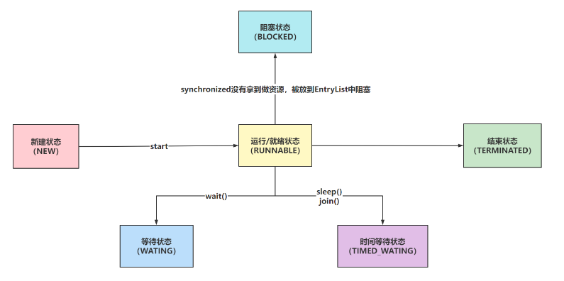

 **新建（New）**：线程对象已被创建，但尚未调用`start()`方法。

**可运行（Runnable）**：线程已经启动，并且正在JVM中执行，但它可能正在等待操作系统的其他资源。

**阻塞（Blocked）**：线程被阻塞，正在等待锁，以进入或重新进入一个同步的块/方法。

 **等待（Waiting）**：线程通过调用`wait()`、`join()`或`LockSupport.park()`进入等待状态。在其他线程调用`notify()`或`notifyAll()`方法，或者被中断，或者特定时间的等待已经结束之前，该线程不会执行。

**计时等待（Timed_Waiting）**：线程在指定的时间内等待另一个线程的动作。可以通过`sleep()`、`wait()`、`join()`或`LockSupport.parkNanos()/parkUntil()`方法实现。

 **终止（Terminated）**：线程的`run()`方法已经执行完毕，或者线程被中断或出现异常导致结束。

### （2）线程的常用方法

#### ① `Thread.currentThread()`
`Thread.currentThread()`是一个静态方法，它返回当前正在执行的线程对象的引用。这个方法非常有用，特别是在你需要获取执行当前代码段的线程的信息时。

#### ② `getName()`
`getName()`方法返回线程的名称。线程的名称在创建时可以指定，也可以后续通过`setName()`方法更改。获取线程名称可以帮助在调试过程中识别不同的线程。

#### ③ `setPriority()`
`setPriority(int newPriority)`方法用来设置线程的优先级。线程优先级是从`Thread.MIN_PRIORITY`（最低，值为1）到`Thread.MAX_PRIORITY`（最高，值为10）的整数值。在调度线程时，优先级高的线程比优先级低的线程有更高的概率先获得执行。

#### ④ `join()`
`join()`方法用于让一个线程等待另一个线程完成。当你在当前线程中调用另一个线程的`join()`方法时，当前线程将暂停执行直到被`join()`方法调用的线程结束为止。

```java
public static void main(String[] args) {
        Thread t1=new Thread(()->{
            for (int i = 1; i <= 5; i++) {
                try {
                    Thread.sleep(500);
                    System.out.println(Thread.currentThread().getName() + " i = " + i);
                } catch (InterruptedException e) {
                    e.printStackTrace();
                }
            }
        },"MyThread");
        t1.start();
        try {
            t1.join();  // Main thread waits until t1 finishes.
        } catch (InterruptedException e) {
            e.printStackTrace();
        }
        System.out.println("Main thread exit");
    }
```

#### ⑤ `interrupt()`
`interrupt()`方法用于中断线程。如果该线程处于阻塞、限时等待或无限等待状态，那么它将抛出`InterruptedException`，退出这些状态。

#### ⑥ `notify()`, `notifyAll()`, `wait()`
这三个方法是用于线程间的协调和通信：
- `wait()`使当前线程进入等待状态直到其他线程调用同一对象的`notify()`或`notifyAll()`方法。
- `notify()`唤醒在此对象监视器上等待的单个线程。
- `notifyAll()`唤醒在此对象监视器上等待的所有线程。

**示例**

```java
class WaitNotifyExample {
    private static final Object lock = new Object();

    private static class ThreadA extends Thread {
        public void run() {
            synchronized (lock) {
                System.out.println("ThreadA is waiting to get lock");
                try {
                    lock.wait();
                } catch (InterruptedException e) {
                    e.printStackTrace();
                }
                System.out.println("ThreadA has woken up");
            }
        }
    }

    private static class ThreadB extends Thread {
        public void run() {
            synchronized (lock) {
                try {
                    Thread.sleep(1000); // Just to ensure Thread A starts waiting
                } catch (InterruptedException e) {
                    e.printStackTrace();
                }
                System.out.println("ThreadB is waking up all waiting threads");
                lock.notify();  // Would wake up Thread A
                // lock.notifyAll(); // Use this if you want to wake all waiting threads
            }
        }
    }

    public static void main(String[] args) {
        new ThreadA().start();
        new ThreadB().start();
    }
}

```


#### ⑦ `setDaemon()`
`setDaemon(boolean on)`方法用于将线程设置为守护线程。守护线程是程序运行时在后台提供服务的线程，如垃圾回收线程。当程序中只剩下守护线程时，Java虚拟机将退出。

#### ⑧ `Thread.sleep()`
`sleep(long millis)`方法使当前正在执行的线程暂停指定的毫秒数。这是一个静态方法，一旦执行，它会暂停当前线程的执行，并不影响其他线程。

#### ⑨ `Thread.yield()`
`yield()`是一个静态方法，它使当前线程让步，暂停执行，允许其他线程获得执行机会。然而，具体的实现依赖于操作系统提供的线程调度算法，调用`yield()`的效果可能会有所不同。

### （3）线程的结束方式

#### ① 自然结束
线程的`run()`方法执行完毕后自然结束。

#### ② 使用中断
调用线程的`interrupt()`方法来请求中断线程，线程需要定期检查中断标志位，以响应中断。

#### ③ 使用标志
设置一个布尔标志位，线程定期检查该标志以决定是否退出。

**示例**

```java
class ControlledStop implements Runnable {
    private boolean isRunning = true;

    public void stop() {
        isRunning = false;
    }

    public void run() {
        while (isRunning) {
            // 执行任务
            try {
                Thread.sleep(1000);
            } catch (InterruptedException e) {
                System.out.println("Thread was interrupted, Failed to complete operation");
                stop();
            }
        }
    }
    public static void main(String[] args) {
        // 使用：
        ControlledStop cs = new ControlledStop();
        Thread t = new Thread(cs);
        t.start();
        // 当需要停止线程时
        //cs.stop();//修改标志位
        t.interrupt();//中断
    }
}
```

# 二、并发编程三大特性

并发编程中的三大特性包括原子性、可见性和有序性。这些特性是确保多线程程序正确执行的关键因素。在本节中，我们将重点讨论原子性及其相关实现机制。

## 1.原子性

### （1）概述

原子性是指在一系列操作中，要么所有的操作全部完成，要么全都不完成，不会出现操作中断的情况，即使中途发生线程切换，操作也不会停留在中间某个步骤，总是完整执行。在多线程环境中，原子性是保证数据一致性和完整性的重要特性。

根据JMM，所有的变量都存储在主内存（主内存对应于计算机的物理内存）中。每个线程还有自己的工作内存（对应于CPU的寄存器或高速缓存），它保存了该线程使用到的变量的副本。这意味着线程对变量的所有操作（读取、赋值等）都必须在工作内存中进行，之后可能会再同步回主内存中。

```java
private static int count=0;
    public static void main(String[] args) throws InterruptedException {
        new Thread(()->{
            for(int i=0;i<100;i++) {
                try {
                    Thread.sleep(10);
                } catch (InterruptedException e) {
                    throw new RuntimeException(e);
                }
                count++;
            }
        }).start();
        for(int i=0;i<100;i++) {
            Thread.sleep(10);
            count++;
        }
        //并发情况下，count并不为200
        System.out.println(count);
    }
```

但在这一过程中并不是原子性的，会造成数据不一致问题，可以采取以下措施，将同步变为原子性操作。

### （2）synchronized

`synchronized`关键字是Java中用于实现方法或代码块同步的基本工具，它保证了只有一个线程可以执行一个对象或类的某个特定区域的代码。

```java
public class TestSyn {
    public static Integer count=0;
    public static void main(String[] args) throws InterruptedException {
        Thread t1=new Thread(()->{
            for (int i = 0; i < 10000; i++) {
                synchronized (TestSyn.class) {
                    count++;
                }
            }
        });
        t1.start();
        for (int i = 0; i < 10000; i++) {
            synchronized (TestSyn.class) {
                count++;
            }
        }
        /*等待t1线程完成*/
        t1.join();
        System.out.println(count);
    }
}
```


### （3）CAS

CAS（Compare-and-Swap）是一种==无锁的同步策略==。

CAS操作涉及三个操作数：

- **内存位置V**：需要更新的变量的内存地址。
- **预期原值A**：预期内存位置V中的值。
- **新值B**：如果位置V中的值与预期值A相匹配，希望更新为的新值。

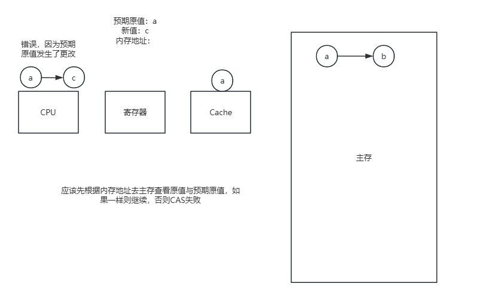

CAS操作的工作流程如下：

1. 首先，它比较内存位置的当前值（V）与预期的原值（E）。
2. 如果这两个值相等，意味着自上次读取该内存位置以来没有其他线程修改过它，CAS操作就会将该内存位置更新为新值（N）。
3. 如果当前值（V）与预期的原值（E）不相等，意味着其他线程已经修改了该内存位置，CAS操作会失败，不会更新内存位置的值。

Java的原子包`java.util.concurrent.atomic`提供了基于CAS实现的类，如`AtomicInteger`。

```java
public class CAS {
    public static  AtomicInteger count = new AtomicInteger(0);
    public static void main(String[] args) throws InterruptedException {
        Thread t1=new Thread(()->{
            for (int i = 0; i < 10000; i++) {
                count.incrementAndGet();
            }
        });
        t1.start();
        for (int i = 0; i < 10000; i++) {
            count.incrementAndGet();
        }
        /*等待t1线程完成*/
        t1.join();
        System.out.println(count.get());
    }
}
```

**问题**

- **ABA问题**：如果一个位置的值原来是A，后来被改成B，再改回A，那么使用CAS进行检查时会认为它从未被改变。这种情况下，CAS操作不能正确地反映出内存位置的变化历史。
- **自旋时间长**：在高竞争的环境中，CAS可能需要多次尝试才能成功更新变量，这可能导致效率低下。

### （4）Lock锁

Java中的`Lock`接口提供了比`synchronized`更复杂的锁操作。它允许更灵活的结构，可以有不同的锁获取和释放策略。

```java
public class TestLock {
    public static Integer count=0;
    public static void main(String[] args) throws InterruptedException {
        ReentrantLock lock = new ReentrantLock();
        Thread t1=new Thread(()->{
            for (int i = 0; i < 10000; i++) {
                lock.lock();
                count++;
                lock.unlock();
            }
        });
        t1.start();
        for (int i = 0; i < 10000; i++) {
            lock.lock();
            count++;
            lock.unlock();
        }
        /*等待t1线程完成*/
        t1.join();
        System.out.println(count);
    }
}
```

### （5）ThreadLocal

`ThreadLocal` 是 Java 中提供线程局部变量的一个机制，它允许每个线程都创建一个变量的副本，使得每个线程可以访问自己独立的变量副本。通过这种方式，`ThreadLocal` 能够保证线程安全，因为每个线程都只能访问和修改自己的局部副本，而不会影响到其他线程的变量副本。

**主要方法**

- **get()**：返回当前线程对应的变量副本的数值。
- **set(T value)**：将当前线程的局部变量副本设置为指定的值。
- **remove()**：移除当前线程的局部变量副本，防止内存泄露。

`ThreadLocal`的实现依赖于 `ThreadLocalMap`，这是一个特殊类型的映射，用于存储线程特有的数据。

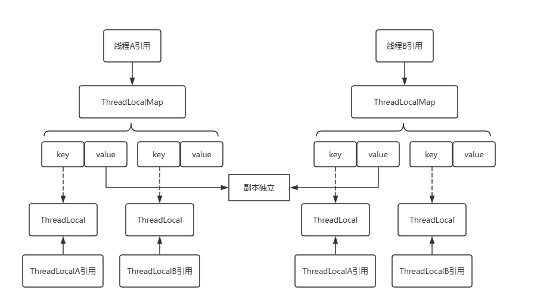

1. **ThreadLocalMap**: 每个 `Thread` 对象内部都有一个 `ThreadLocal.ThreadLocalMap`，这是 `ThreadLocal` 的内部类。`ThreadLocalMap` 使用 `ThreadLocal` 对象作为键（key），线程局部变量作为值（value）。
2. **Entry数组**: `ThreadLocalMap` 基于一个 `Entry[]` 数组实现，其中每个 `Entry` 是 `ThreadLocalMap` 的一个内部类，它继承自 `WeakReference<ThreadLocal<?>>`。这意味着每个键是对 `ThreadLocal` 对象的弱引用。

**示例**

```java
public class TestThreadLocal {
    /*创建线程独立的副本*/
    private static ThreadLocal<Integer> threadLocalCount=ThreadLocal.withInitial(() -> 0);
    static class Run implements Runnable {
        @Override
        public void run() {
            Integer count = threadLocalCount.get();
            for (int i = 0; i < 10000; i++) {
                threadLocalCount.set(++count);
                System.out.println(Thread.currentThread().getName()+":"+threadLocalCount.get());
            }
            /*避免内存泄露*/
            threadLocalCount.remove();
        }
    }

    public static void main(String[] args) {
        new Thread(new Run()).start();
        new Thread(new Run()).start();
    }
}
```

 **`ThreadLocalMap` 内存泄露问题**

- **key**： `ThreadLocalMap` 的键是 `ThreadLocal` 对象的弱引用。使用弱引用的原因是允许 `ThreadLocal` 对象在不再被其他地方引用时可以被垃圾收集器回收，即便它还作为 `ThreadLocalMap` 的键。
- **value**：如果不适当地管理（如未调用 `remove()` 方法），那么长时间运行的线程可能会导致旧的 `ThreadLocal` 变量副本（value）不被回收，从而引起内存泄漏。

## 2.可见性

### （1）概述

可见性是并发编程中的一个核心概念，指的是当一个线程修改了某个变量的值，其他线程能够立即得知这个修改。在多线程环境中，由于存在多级缓存和编译器优化的原因，一个线程对共享变量的修改可能不会立即反映到主内存中，从而导致其他线程看到的还是旧值。如果没有适当的同步处理，这种情况就会导致程序出现错误的行为。
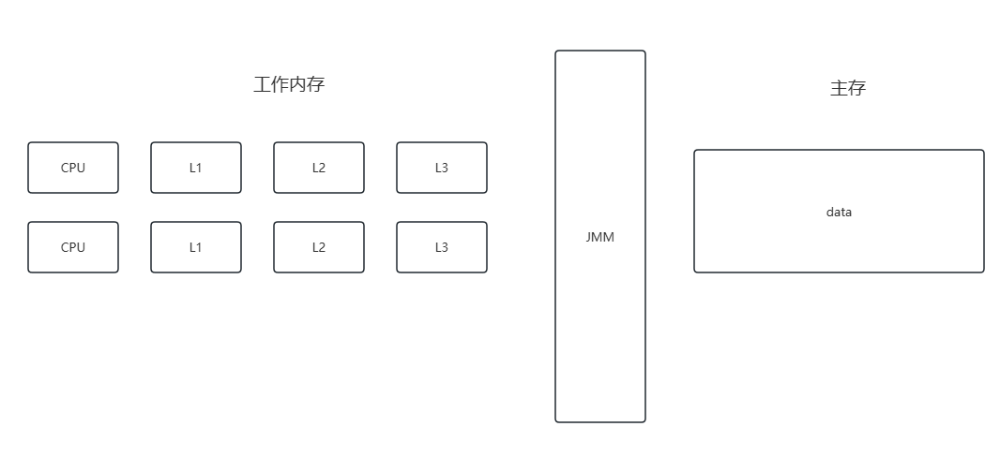

### （2）解决

在Java中，可以通过几种方式来确保变量的可见性：

- **volatile关键字**：被声明为`volatile`的变量可以确保每次读取变量时都从主内存中进行，每次写入时也都会写到主内存中。
- **synchronized关键字**：进入`synchronized`同步块时，会清空工作内存中的共享变量值，从而强制从主内存中重新读取最新的值。退出同步块时，会将在同步块内修改过的变量刷新回主内存。
- **final关键字**：被`final`修饰的字段，一旦被初始化后其值就不会被修改，因此总是可见的，前提是构造对象时没有发生`this`逃逸（即在对象构造完全完成前，`this`引用没有逃逸出去，被其他线程访问到）。

## 3.有序性

### （1）概述

有序性在并发编程中指的是程序执行的顺序按照代码的先后顺序执行，以保证程序的正确性。在单线程环境下，程序的执行看起来是顺序的，但在多线程环境下，由于线程交错执行和编译器优化，代码的执行顺序可能会与编写的顺序不同。

```java
public class Singleton {
    //DCL
    private static volatile Singleton instance;
    private Singleton() {}
    public static Singleton getInstance() {
        if (instance == null) {
            synchronized (Singleton.class) {
                if (instance == null) {
                    instance = new Singleton();
                }
            }
        }
    }
}

```

### （2）解决

为了在Java中保证操作的有序性，可以使用以下机制：

- **volatile关键字**：`volatile`不仅确保变量的可见性，还可以防止指令重排。编译器和处理器在遇到`volatile`变量时，会在读写操作前后添加内存屏障，防止指令的重排序。
- **synchronized关键字**：`synchronized`提供了一种锁机制，能够保证锁内的语句块在单个线程内的执行是有序的。同时，它还保证了进入和退出同步代码块时，变量的写入和读取都是有序的。
- **Lock接口**：Java的`java.util.concurrent.locks.Lock`框架提供的锁机制也保证了持有锁期间，操作的有序性。

确保锁的使用方式是非常关键的，可以根据你的请求对笔记格式进行调整和完善。这里是根据你提供的格式要求，重新整理的关于锁的分类笔记。

# 三、锁

## 1.锁的分类

### （1）可重入锁、不可重入锁

- **可重入锁**：允许同一个线程多次获取同一把锁。适用于递归函数或者多个函数间需要重复使用同一把锁的情况。
- **不可重入锁**：锁只能被一个线程获取一次，即使是同一个线程再次获取也会被阻塞。如果不小心再次请求已持有的锁，可能会导致死锁。

### （2）乐观锁、悲观锁

- **乐观锁（Optimistic Lock）**：假设在实际提交更改之前不会发生冲突，获取不到锁资源，可以再次让CPU调度，重新尝试获取锁资源。常见于数据库管理系统中的无锁设计，如使用CAS操作。
- **悲观锁（Pessimistic Lock）**：假设冲突很可能发生，获取不到锁资源时，会将当前线程挂起，线程挂起会涉及到用户态和内核的态的切换，而这种切换是比较消耗资源的。

### （3）公平锁、非公平锁

-  **公平锁（Fair Lock）**：锁按照请求的顺序来分配，先来先服务。避免饿死（某些线程可能永远获取不到锁）。
- **非公平锁（Non-fair Lock）**：锁可以不按请求的顺序分配，允许"插队"。通常具有更好的性能。

### （4） 互斥锁、共享锁

-  **互斥锁（Mutex Lock）**：一次只允许一个线程持有某个特定的锁，保护资源不被多个线程同时访问。保护非线程安全的资源或代码区域。
- **共享锁（Shared Lock）**：允许多个线程同时获取锁，但通常是为了读取操作而设计。适合于读多写少的场景，如数据库中的共享锁定。

## 2. synchronized

### （1）类锁、对象锁

#### ① 类锁
类锁是指锁定一个类的Class对象，通常用于静态方法或者静态变量上。当一个线程访问同步的静态方法时，它锁住的是这个类的Class对象。由于静态成员属于类级别，类锁确保一次只有一个线程能执行类的静态同步方法。

```java
public class MyClass {
    public static synchronized void method() {
        // 同步的静态方法
    }
    public void method1() {
        synchronized (MyClass.class) {
            // 同步代码块
        }
    }
}
```

#### ② 对象锁
对象锁是指锁定一个实例对象，适用于非静态同步方法和同步块。每个实例对象的对象锁互不干扰。当一个线程执行对象的同步方法时，它锁住的是调用该方法的对象。

```java
public class MyClass {
    public synchronized void method() {
        
    }
    public void method1() {
        synchronized (this) {
            // 同步代码块
        }
    }
}
```

### （2）锁升级

在 Java 中，`synchronized` 是基于对象的内部锁机制来实现同步的。为了优化性能，Java 虚拟机（JVM）采用了锁升级的技术，逐步从偏向锁到轻量级锁再到重量级锁。

#### ① Java对象头和Mark Word
Java中每个对象在堆内存中都有一个对象头，其中`Mark Word` 是实现锁升级的关键，它标记了对象当前的锁状态。

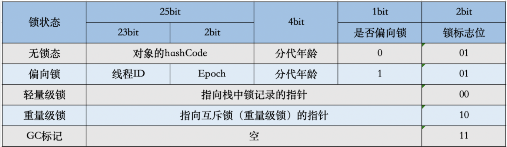

JVM对synchronized做了一定的优化

- 锁消除：如果确定一段代码中的锁使用不可能被其他线程共享，那么这个锁是不必要的，可以安全地消除。例如，在编译期间，如果JVM检测到一个锁仅仅用于对象内部，并且这个对象的引用没有逃逸出当前的方法，那么JVM可以决定消除这个锁。
- 锁膨胀：如果JVM检测到一系列的连续锁操作仅作用于同一个对象，它会扩大锁的范围，将多个锁操作合并为一个较大范围的锁操作，从而减少锁请求的频率。这通常出现在循环中频繁加锁和解锁同一个对象的情况。
- 锁升级：

#### ② 锁的状态和升级过程

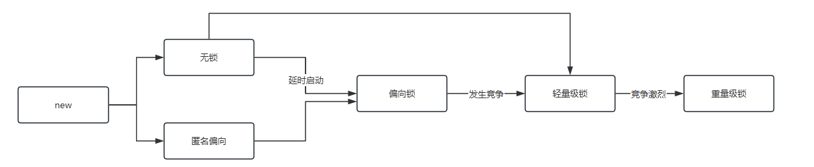

1. **无锁状态/匿名偏向**：当没有线程同步访问某个对象时，对象处于无锁状态。
2. **偏向锁（Biased Locking）**：
   - 为了减少无竞争情况下的同步开销，JVM 允许对象进入偏向模式，即偏向第一个获得它的线程。
   - 当偏向锁被激活时，`Mark Word` 被设置为偏向状态，并且记录下获取它的线程ID。
   - 如果同一个线程再次请求这个锁，无需进行任何同步操作，直接进入方法。
   - 如果其他线程请求这个锁，会基于CAS的方式尝试替换线程ID。
   - 如果成功，当前线程获得锁；如果失败，偏向锁将会升级为轻量级锁。
3. **轻量级锁**：
   - 轻量级锁通过在当前线程的栈帧中创建一个锁记录（Lock Record）来实现。
   - 锁记录中存储了锁对象原来的 `Mark Word`，并频繁地尝试使用 CAS 操作将Lock Record指向自己的锁记录，采用的是自适应自旋锁的方法。
   - 如果成功，当前线程获得锁；如果CAS多次失败，表明锁竞争激烈，此时轻量级锁会升级为重量级锁。
4. **重量级锁**：
   - 重量级锁通过操作系统的互斥量来实现，每个对象的 `Mark Word` 指向一个重量级锁（如互斥量）。
   - 重量级锁最耗性能，因为线程挂起会涉及到操作系统的线程调度和上下文切换。

#### ③ 偏向锁的优化

当另一个线程尝试获取已被偏向的锁时，需要进行偏向锁的撤销。撤销偏向锁涉及到重置对象头的标记，并在全局安全点（STW，Stop-The-World）进行，这是因为需要确保涉及该锁的所有线程都在一个可预测的状态。这是一个成本相对较高的操作，因此在高并发场景下，偏向锁可能不是最佳选择。

JVM默认在启动后大约4秒钟后开启偏向锁，这个延迟是因为JVM启动初期，通常会有大量的类加载和初始化工作，这些操作涉及大量的同步，可能会导致频繁的偏向锁撤销。如果在这个阶段开启偏向锁，可能会引入不必要的性能开销。通过延迟开启偏向锁，JVM可以在启动时期避免这种开销。

在Java应用中，可以通过JVM启动参数来调整偏向锁的行为：

- `-XX:+UseBiasedLocking`：启用偏向锁（默认开启）。
- `-XX:BiasedLockingStartupDelay=0`：设置偏向锁延迟开启的时间。

### （3）ObjectMonitor

> 参考：[从jvm源码看synchronized - unbelievableme - 博客园 (cnblogs.com)](https://www.cnblogs.com/kundeg/p/8422557.html)

在Java中，`ObjectMonitor`是与每个对象关联的监视器锁的具体实现。这种监视器锁是Java实现同步的关键机制之一。

#### ① 核心属性

- **Owner**：持有当前锁的线程。在任何时刻，只有一个线程可以成为锁的持有者。
- **Entry Set**：试图获取锁但未成功的线程集合。这些线程会进入阻塞状态，等待锁被释放。
- **Wait Set**：调用了该对象的`wait()`方法的线程集合。这些线程在等待被`notify()`或`notifyAll()`方法唤醒。

#### ② 加锁流程

当一个线程尝试获取一个对象的内部锁（通过进入一个`synchronized`块或方法）时，其流程如下：

1. **检查锁状态**：首先检查锁是否被其他线程持有。
2. **尝试获取锁**：如果锁未被持有，当前线程将设置自己为锁的持有者，并将重入次数设置为1。
   - **锁的重入**：如果锁已被当前线程持有，重入次数增加。
   - **等待锁释放**：如果锁被另一个线程持有，当前线程将被加入到Entry Set中，并进入阻塞状态直到锁被释放。

3. **再次尝试获取锁**：当锁的持有者释放锁，它会检查Entry Set，这些线程将再次尝试获取锁。

#### ③ 源码分析

##### ObjectMonitor 构造器

> [jdk8u/jdk8u/hotspot: 69087d08d473 src/share/vm/runtime/objectMonitor.hpp (openjdk.org)](https://hg.openjdk.org/jdk8u/jdk8u/hotspot/file/69087d08d473/src/share/vm/runtime/objectMonitor.hpp)
>
> [jdk8u/jdk8u/hotspot: 69087d08d473 src/share/vm/runtime/objectMonitor.cpp (openjdk.org)](https://hg.openjdk.org/jdk8u/jdk8u/hotspot/file/69087d08d473/src/share/vm/runtime/objectMonitor.cpp)

```java
ObjectMonitor() {
    _header       = NULL;   // MarkWord 存储，用于对象头的管理
    _count        = 0;      // 竞争锁的线程个数
    _waiters      = 0;      // 调用wait()方法后进入等待状态的线程个数
    _recursions   = 0;      // 记录当前锁的重入次数
    _object       = NULL;   // 关联的Java对象
    _owner        = NULL;   // 持有锁的线程
    _WaitSet      = NULL;   // 存储调用wait()后进入等待状态的线程信息，是一个双向链表
    _WaitSetLock  = 0;      // 管理WaitSet的锁状态
    _Responsible  = NULL;   // 负责清理的线程（在垃圾回收中可能会用到）
    _succ         = NULL;   // 指向下一个请求锁的线程
    _cxq          = NULL;   // 竞争队列，存储未能获取锁的线程，是一个单向链表
    FreeNext      = NULL;   // 用于内部管理的自由列表
    _EntryList    = NULL;   // 存储可能从_waitSet被唤醒或从_cxq移至此的线程列表
    _SpinFreq     = 0;      // 自旋尝试次数
    _SpinClock    = 0;      // 自旋锁的计时器
    OwnerIsThread = 0;      // 指示锁的持有者是否为线程
    _previous_owner_tid = 0; // 上一个持有者的线程ID
}
```

##### enter 方法

尝试获取锁，如果不能立即获取，则进入等待状态。
```java
// monitorenter指令的实现入口
void ATTR ObjectMonitor::enter(TRAPS) {
  // Self引用当前尝试获取锁的线程
  Thread * const Self = THREAD;
  void * cur;

  // 尝试使用CAS操作将_owner从NULL修改为Self
  // 如果_owner原来是NULL，cur将得到NULL，表示锁未被持有
  cur = Atomic::cmpxchg_ptr(Self, &_owner, NULL);

  // 检查CAS操作的结果，如果原值为NULL，则成功获取锁
  if (cur == NULL) {
    // 断言：_recursions应为0（没有重入），_owner应为当前线程
    assert(_recursions == 0, "invariant");
    assert(_owner == Self, "invariant");
    return;  // 锁获取成功，退出方法
  }

  // 如果返回值为Self，表示当前线程已持有锁，发生重入
  if (cur == Self) {
    _recursions++;  // 增加重入计数
    return;  // 处理完成，退出方法
  }

  // 如果当前线程已经持有其他锁（可能是轻量级锁升级而来）
  if (Self->is_lock_owned((address)cur)) {
    assert(_recursions == 0, "internal state error");
    _recursions = 1;
    _owner = Self;
    OwnerIsThread = 1;
    return;  // 锁升级成功，退出方法
  }

  // 设置_Stalled标志，表示当前线程正在等待获取锁
  assert(Self->_Stalled == 0, "invariant");
  Self->_Stalled = intptr_t(this);

  // 尝试自旋获取锁，如果成功则退出
  if (Knob_SpinEarly && TrySpin(Self) > 0) {
    assert(_owner == Self, "invariant");
    assert(_recursions == 0, "invariant");
    assert(((oop)(object()))->mark() == markOopDesc::encode(this), "invariant");
    Self->_Stalled = 0;
    return;
  }

  // 如果到达这里，表示没有成功获取锁，需要进一步处理竞争
  assert(_owner != Self, "invariant");
  assert(_succ != Self, "invariant");
  assert(Self->is_Java_thread(), "invariant");
  JavaThread * jt = (JavaThread *) Self;
  assert(!SafepointSynchronize::is_at_safepoint(), "invariant");
  assert(jt->thread_state() != _thread_blocked, "invariant");
  assert(this->object() != NULL, "invariant");
  assert(_count >= 0, "invariant");

  // 增加等待锁的线程计数
  Atomic::inc_ptr(&_count);

  // 设置当前线程为等待状态，并处理各种监控和追踪
  {
    JavaThreadBlockedOnMonitorEnterState jtbmes(jt, this);
    Self->set_current_pending_monitor(this);
    DTRACE_MONITOR_PROBE(contended__enter, this, object(), jt);
    if (JvmtiExport::should_post_monitor_contended_enter()) {
      JvmtiExport::post_monitor_contended_enter(jt, this);
    }

    OSThreadContendState osts(Self->osthread());
    ThreadBlockInVM tbivm(jt);

    // 循环尝试获取锁，直到成功或线程挂起
    for (;;) {
      jt->set_suspend_equivalent();
      EnterI(THREAD);  // 执行加入等待队列的逻辑

      if (!ExitSuspendEquivalent(jt)) break;

      _recursions = 0;
      _succ = NULL;
      exit(false, Self);

      jt->java_suspend_self();
    }
    Self->set_current_pending_monitor(NULL);
  }

  // 减少等待锁的线程计数
  Atomic::dec_ptr(&_count);
  assert(_count >= 0, "invariant");
  Self->_Stalled = 0;

  assert(_recursions == 0, "invariant");
  assert(_owner == Self, "invariant");
  assert(_succ != Self, "invariant");
  assert(((oop)(object()))->mark() == markOopDesc::encode(this), "invariant");

  // 通知监控事件锁已被成功获取
  DTRACE_MONITOR_PROBE(contended__entered, this, object(), jt);
  if (JvmtiExport::should_post_monitor_contended_entered()) {
    JvmtiExport::post_monitor_contended_entered(jt, this);
  }

  // 如果需要，记录锁的获取事件
  if (event.should_commit()) {
    event.set_previousOwner((uintptr_t)_previous_owner_tid);
    event.commit();
  }

  // 如果存在，更新锁竞争尝试的计数器
  if (ObjectMonitor::_sync_ContendedLockAttempts != NULL) {
    ObjectMonitor::_sync_ContendedLockAttempts->inc();
  }
}
```

##### EnterI方法

enter操作拿锁失败

```java
// 前面enter操作拿锁失败，走这
void ATTR ObjectMonitor::EnterI (TRAPS) {
    // Self是当前抢锁线程
    Thread * Self = THREAD ;
    assert (Self->is_Java_thread(), "invariant") ;
    assert (((JavaThread *) Self)->thread_state() == _thread_blocked   , "invariant") ;

    // 执行一次CAS尝试拿锁
    if (TryLock (Self) > 0) {
        // 拿锁成功
        assert (_succ != Self              , "invariant") ;
        assert (_owner == Self             , "invariant") ;
        assert (_Responsible != Self       , "invariant") ;
        // 告辞！
        return ;
    }

    DeferredInitialize () ;

    // 再次基于自旋的形式拿锁
    if (TrySpin (Self) > 0) {
        // 拿锁成功
        assert (_owner == Self        , "invariant") ;
        assert (_succ != Self         , "invariant") ;
        assert (_Responsible != Self  , "invariant") ;
        // 告辞！
        return ;
    }

    assert (_succ  != Self            , "invariant") ;
    assert (_owner != Self            , "invariant") ;
    assert (_Responsible != Self      , "invariant") ;

    // 拿锁失败，将线程Self封装为ObjectWaiter对象，也就是node
    ObjectWaiter node(Self) ;
    Self->_ParkEvent->reset() ;
    node._prev   = (ObjectWaiter *) 0xBAD ;
    // 将node状态设置为cxq，代表一会要扔到_cxq单向链表里！
    node.TState  = ObjectWaiter::TS_CXQ ;

    ObjectWaiter * nxt ;
    for (;;) {
        node._next = nxt = _cxq ;
        // 基于CAS的方式，将封装好的Node，扔到cxq的后面
        if (Atomic::cmpxchg_ptr (&node, &_cxq, nxt) == nxt) break ;

        // 没扔进去，再挣扎一下，尝试拿个锁
        if (TryLock (Self) > 0) {
            // 拿锁成功
            assert (_succ != Self         , "invariant") ;
            assert (_owner == Self        , "invariant") ;
            assert (_Responsible != Self  , "invariant") ;
            // 告辞！
            return ;
        }
    }

    if ((SyncFlags & 16) == 0 && nxt == NULL && _EntryList == NULL) {
        Atomic::cmpxchg_ptr (Self, &_Responsible, NULL) ;
    }


    TEVENT (Inflated enter - Contention) ;
    int nWakeups = 0 ;
    int RecheckInterval = 1 ;

    for (;;) {
        // 再挣扎一下。
        if (TryLock (Self) > 0) break ;
        assert (_owner != Self, "invariant") ;

        if ((SyncFlags & 2) && _Responsible == NULL) {
           Atomic::cmpxchg_ptr (Self, &_Responsible, NULL) ;
        }

        // 如果前面挣扎失败，这里就会涉及到线程的挂起！
        if (_Responsible == Self || (SyncFlags & 1)) {
            TEVENT (Inflated enter - park TIMED) ;
            Self->_ParkEvent->park ((jlong) RecheckInterval) ;
            RecheckInterval *= 8 ;
            if (RecheckInterval > 1000) RecheckInterval = 1000 ;
        } else {
            TEVENT (Inflated enter - park UNTIMED) ;
            Self->_ParkEvent->park() ;
        }

        // 到这就是被唤醒了，抢锁！
        if (TryLock(Self) > 0) break ;

        TEVENT (Inflated enter - Futile wakeup) ;
        if (ObjectMonitor::_sync_FutileWakeups != NULL) {
           ObjectMonitor::_sync_FutileWakeups->inc() ;
        }
        ++ nWakeups ;

        if ((Knob_SpinAfterFutile & 1) && TrySpin (Self) > 0) break ;

        if ((Knob_ResetEvent & 1) && Self->_ParkEvent->fired()) {
           Self->_ParkEvent->reset() ;
           OrderAccess::fence() ;
        }
        if (_succ == Self) _succ = NULL ;

        OrderAccess::fence() ;
    }

    assert (_owner == Self      , "invariant") ;
    assert (object() != NULL    , "invariant") ;

    UnlinkAfterAcquire (Self, &node) ;
    if (_succ == Self) _succ = NULL ;

    assert (_succ != Self, "invariant") ;
    if (_Responsible == Self) {
        _Responsible = NULL ;
        OrderAccess::fence(); // Dekker pivot-point
    }
    if (SyncFlags & 8) {
       OrderAccess::fence() ;
    }
    return ;
}
```

##### exit方法

```java
// 当前线程试图进入monitor时调用的方法
void ATTR ObjectMonitor::EnterI(TRAPS) {
    // Self代表当前尝试获取锁的线程
    Thread * Self = THREAD;
    // 确保Self是Java线程，并且当前状态为_blocked
    assert(Self->is_Java_thread(), "invariant");
    assert(((JavaThread *) Self)->thread_state() == _thread_blocked, "invariant");

    // 尝试通过TryLock函数获取锁
    if (TryLock(Self) > 0) {
        // 如果成功获取锁，进行必要的断言检查，然后直接返回
        assert(_succ != Self, "invariant");
        assert(_owner == Self, "invariant");
        assert(_Responsible != Self, "invariant");
        return;
    }

    // 如果TryLock失败，进行一些初始化操作（这里未展示DeferredInitialize具体内容）
    DeferredInitialize();

    // 再次尝试通过自旋锁获取锁
    if (TrySpin(Self) > 0) {
        // 如果自旋锁成功，进行断言检查，并返回
        assert(_owner == Self, "invariant");
        assert(_succ != Self, "invariant");
        assert(_Responsible != Self, "invariant");
        return;
    }

    // 如果自旋锁也失败，准备将当前线程加入等待队列
    assert(_succ != Self, "invariant");
    assert(_owner != Self, "invariant");
    assert(_Responsible != Self, "invariant");

    // 创建一个ObjectWaiter对象，准备将其加入等待队列
    ObjectWaiter node(Self);
    Self->_ParkEvent->reset(); // 重置线程的park事件
    node._prev = (ObjectWaiter *) 0xBAD; // 设置前驱节点为一个无效值作为标记
    node.TState = ObjectWaiter::TS_CXQ; // 设置节点的状态为等待队列状态

    ObjectWaiter * nxt;
    for (;;) {
        node._next = nxt = _cxq; // 准备将node加入到_cxq队列
        // 使用CAS操作将节点加入到等待队列
        if (Atomic::cmpxchg_ptr(&node, &_cxq, nxt) == nxt) break;

        // 如果CAS操作失败，再次尝试获取锁
        if (TryLock(Self) > 0) {
            assert(_succ != Self, "invariant");
            assert(_owner == Self, "invariant");
            assert(_Responsible != Self, "invariant");
            return;
        }
    }

    // 设置责任线程
    if ((SyncFlags & 16) == 0 && nxt == NULL && _EntryList == NULL) {
        Atomic::cmpxchg_ptr(Self, &_Responsible, NULL);
    }

    // 纪录事件
    TEVENT(Inflated enter - Contention);
    int nWakeups = 0;
    int RecheckInterval = 1;

    // 进入一个循环，不断尝试获取锁，如果失败则进入等待状态
    for (;;) {
        if (TryLock(Self) > 0) break;
        assert(_owner != Self, "invariant");

        // 设置责任线程，用于管理锁的释放和通知
        if ((SyncFlags & 2) && _Responsible == NULL) {
           Atomic::cmpxchg_ptr(Self, &_Responsible, NULL);
        }

        // 根据是否有责任线程和标志位决定线程挂起的方式
        if (_Responsible == Self || (SyncFlags & 1)) {
            TEVENT(Inflated enter - park TIMED);
            Self->_ParkEvent->park((jlong)RecheckInterval);
            RecheckInterval *= 8;
            if (RecheckInterval > 1000) RecheckInterval = 1000;
        } else {
            TEVENT(Inflated enter - park UNTIMED);
            Self->_ParkEvent->park();
        }

        // 被唤醒后尝试重新获取锁
        if (TryLock(Self) > 0) break;

        TEVENT(Inflated enter - Futile wakeup);
        if (ObjectMonitor::_sync_FutileWakeups != NULL) {
           ObjectMonitor::_sync_FutileWakeups->inc();
        }
        ++nWakeups;

        // 自旋锁尝试
        if ((Knob_SpinAfterFutile & 1) && TrySpin(Self) > 0) break;

        // 重置事件
        if ((Knob_ResetEvent & 1) && Self->_ParkEvent->fired()) {
           Self->_ParkEvent->reset();
           OrderAccess::fence();
        }
        if (_succ == Self) _succ = NULL;

        OrderAccess::fence();
    }

    assert(_owner == Self, "invariant");
    assert(object() != NULL, "invariant");

    // 获取锁后，断开与等待队列的链接
    UnlinkAfterAcquire(Self, &node);
    if (_succ == Self) _succ = NULL;

    assert(_succ != Self, "invariant");
    if (_Responsible == Self) {
        _Responsible = NULL;
        OrderAccess::fence(); // 确保内存屏障，避免内存重排序
    }
    if (SyncFlags & 8) {
       OrderAccess::fence();
    }
    return;
}

```

## 3.ReentratLock

### （1）与synchronized对比

ReentrantLock是一个基于AQS实现的类，提供了更加灵活的方法，如公平锁、非公平锁、条件变量、延迟等待等，并且在竞争激烈的情况下，效率比synchronized高。

而synchronized是关键字，基于ObjectMonitor实现，可以进行锁升级。

### （2）AQS概述

AQS（AbstractQueuedSynchronizer）是 Java 中实现锁和其他同步器的一个框架。这个框架通过使用一个单一的整数（int）状态变量来表示同步状态，并通过一个内部的 FIFO 队列来管理那些等待访问共享资源的线程。

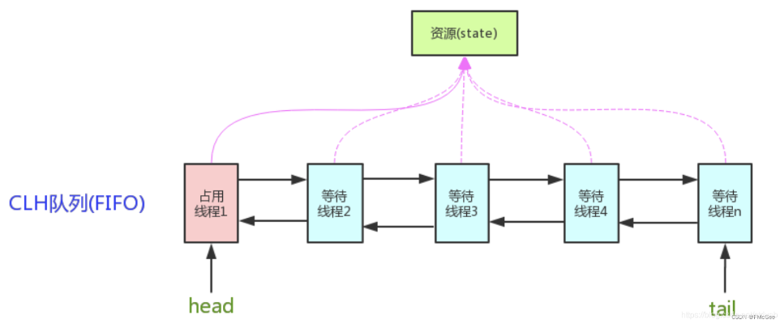

#### ① **核心组件**

-  **State**：这是一个整数变量，用于表示同步器的状态。不同的同步器可以赋予这个状态不同的含义，例如，对于 ReentrantLock，状态可能表示锁的持有计数。
-  **AQS队列**：当线程尝试获取锁失败时，它们会被加入到一个同步队列中。队列是一个 FIFO 队列，并且底层为双向链表，保证了第一个请求资源的线程将是第一个获取资源的线程（公平锁情况下）。

#### ②  Node数据结构

```java
static final class Node {
    /** 表示节点在共享模式下等待的标记 */
    static final Node SHARED = new Node();
    /** 表示节点在独占模式下等待的标记 */
    static final Node EXCLUSIVE = null;

    /** waitStatus 值表示线程已取消 */
    static final int CANCELLED =  1;
    /** waitStatus 值表示后继节点的线程需要被唤醒 */
    static final int SIGNAL    = -1;
    /** waitStatus 值表示线程正在等待条件 */
    static final int CONDITION = -2;
    /**
     * waitStatus 值表示下一次共享获取应该无条件传播
     */
    static final int PROPAGATE = -3;

    /**
     * 状态字段，只能取以下值：
     *   SIGNAL:     这个节点的后继者将被（或很快被）
     *               阻塞（通过park），因此当前节点在释放或
     *               取消时必须唤醒其后继者。为避免竞态条件，
     *               获取方法必须首先表明它们需要一个信号，
     *               然后重新尝试原子获取，如果失败，则阻塞。
     *   CANCELLED:  这个节点因超时或中断而被取消。
     *               节点一旦进入此状态将永不改变。特别是，
     *               拥有被取消节点的线程将不再阻塞。
     *   CONDITION:  这个节点当前在条件队列上。
     *               它将不会被用作同步队列节点
     *               直到被转移，届时状态将被设置为0。
     *               （此处使用此值与字段的其他用途无关，
     *               但简化了机制。）
     *   PROPAGATE:  应该将共享释放传播给其他节点。
     *               这在doReleaseShared中设置（仅限头节点），
     *               以确保传播继续，即使其他操作已
     *               干预。
     *   0:          无上述任何状态
     *
     * 这些值按数值排列以简化使用。
     * 非负值意味着节点不需要发出信号。因此，大多数代码
     * 不需要检查特定的值，只需检查符号。
     *
     * 该字段对于普通同步节点初始化为0，对于条件节点初始化为CONDITION。
     * 使用CAS修改（或在可能的情况下，使用无条件的易失性写入）。
     */
    volatile int waitStatus;

    /**
     * 链接到前驱节点，当前节点/线程依赖于前驱节点
     * 来检查waitStatus。在入队时分配，并且仅在出队时
     * 变为null（为了GC）。此外，在取消前驱后，我们会
     * 在查找未取消的节点时进行短路，总会存在未取消的节点，
     * 因为头节点从未被取消：一个节点只有在成功获取后才成为头节点。
     * 被取消的线程从未成功获取，且一个线程只取消自己，不取消任何其他节点。
     */
    volatile Node prev;

    /**
     * 链接到后继节点，当前节点/线程在释放时唤醒此节点。
     * 在入队时分配，当绕过被取消的前驱时调整，并且在出队时变为null（为了GC）。
     * 入队操作在附加后才分配前驱的next字段，
     * 因此看到一个null的next字段并不必然意味着
     * 节点在队列末尾。然而，如果next字段看似为null，
     * 我们可以从尾部扫描prev来复检。被取消节点的next字段被设置
     * 指向节点本身而不是null，以简化isOnSyncQueue的处理。
     */
    volatile Node next;

    /**
     * 入队此节点的线程。在构造时初始化，使用后变为null。
     */
    volatile Thread thread;

    /**
     * 链接到下一个等待条件的节点，或特殊值SHARED。
     * 因为只有在独占模式下才能访问条件队列，我们只需要一个简单的
     * 链表来保存节点，当它们在条件上等待时。然后它们被转移到队列中
     * 以重新获取。并且因为条件只能是独占的，我们通过使用特殊值来指示共享模式
     * 来节省一个字段。
     */
    Node nextWaiter;

    /**
     * 如果节点在共享模式下等待，则返回true。
     */
    final boolean isShared() {
        return nextWaiter == SHARED;
    }

    /**
     * 返回前一个节点，如果为空则抛出NullPointerException。
     * 当前驱不能为null时使用。虽然可以省略null检查，
     * 但它存在是为了帮助VM。
     *
     * @return 这个节点的前一个节点
     */
    final Node predecessor() throws NullPointerException {
        Node p = prev;
        if (p == null)
            throw new NullPointerException();
        else
            return p;
    }

    Node() {    // 用于建立初始头节点或SHARED标记
    }

    Node(Thread thread, Node mode) {     // 由addWaiter使用
        this.nextWaiter = mode;
        this.thread = thread;
    }

    Node(Thread thread, int waitStatus) { // 由Condition使用
        this.waitStatus = waitStatus;
        this.thread = thread;
    }
}

```

#### ③  ConditionObject

```java

```

#### ④ 常用方法

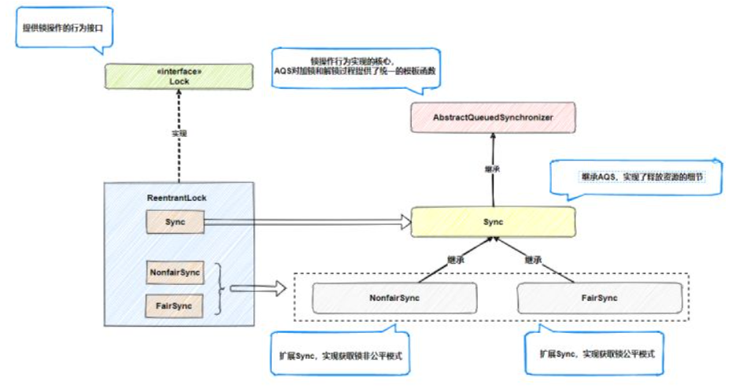

acquire（）、addWaiter、acquireQuene（）

### （3）加锁源码剖析

#### ①` lock()`

调用此方法时，线程将持续尝试获取锁，直到成功为止。如果锁已被其他线程占用，则当前线程将被阻塞直到锁被释放。

`lock()` 方法设计为不响应中断，即使在等待期间线程的中断状态被设置，它也不会中断等待过程。因此对于`cancelAcquire()`主要是`lockInterruptibly()`应用的。

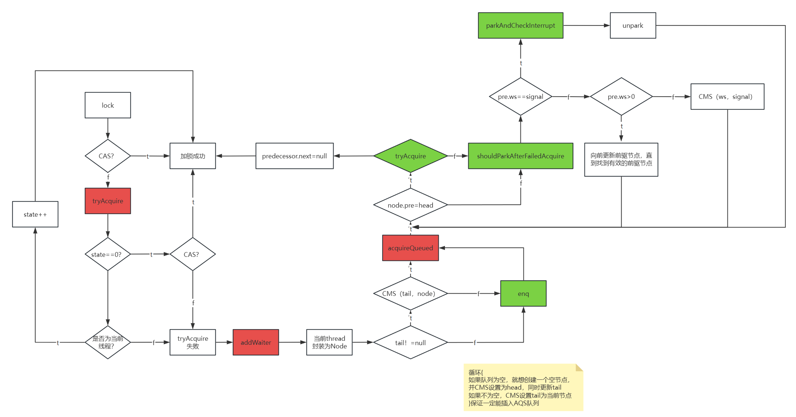

以非公平锁为例分析：

##### `lock()` 

```java
// ReentrantLock使用Sync抽象内部类的lock方法来获取锁
public void lock() {
    sync.lock();  // 调用具体的同步控制类（Sync的子类）的lock方法
}

static final class NonfairSync extends Sync {
    private static final long serialVersionUID = 7316153563782823691L;

    /**
     * 执行加锁操作。尝试立即获取锁，如果失败，则回退到常规的获取方式。
     */
    final void lock() {
        // 尝试将同步状态从0改为1，即尝试获取锁
        if (compareAndSetState(0, 1))  // 如果当前锁未被占用（状态为0），则尝试设置为1
            setExclusiveOwnerThread(Thread.currentThread());  // 设置当前线程为独占锁的线程
        else
            acquire(1);  // 如果直接尝试获取锁失败，则通过acquire方法按照正常的锁获取流程进行
    }

    /**
     * 尝试获取锁的实现。该方法由tryAcquire方法调用。
     *
     * @param acquires 要获取的锁的数量，这里传入1，表示尝试获取一次锁
     * @return 如果成功获取锁，则返回true；否则返回false。
     */
    protected final boolean tryAcquire(int acquires) {
        return nonfairTryAcquire(acquires);  // 调用非公平的尝试获取锁的方法
    }
}

```

##### `acqurie()`

```java
/**
 * 尝试获取资源，如果失败，则进入等待队列，并可能导致当前线程阻塞。
 * 
 * @param arg 请求的资源数量；对于大多数同步器来说，这个值是1。
 */
public final void acquire(int arg) {
    // 首先尝试直接获取资源
    if (!tryAcquire(arg) &&   // 如果直接尝试获取资源失败
        acquireQueued(addWaiter(Node.EXCLUSIVE), arg))  // 则将当前线程加入等待队列，等待获取资源
        selfInterrupt();  // 如果在等待获取资源时被中断，恢复中断状态
}
```

**`tryAcquire(arg)`**：

- 这是一个抽象方法，由子类具体实现。它尝试非阻塞地获取资源。如果成功，返回`true`；如果失败，返回`false`。

**`addWaiter(Node.EXCLUSIVE)`**：

- 此方法将当前线程包装成一个新的节点（Node），并将其添加到同步队列的末尾。
- `Node.EXCLUSIVE`表示这个节点是以独占模式等待的。

**`acquireQueued(Node node, int arg)`**：

- 这个方法将当前线程（已封装成节点）置于等待队列中，直到获取到资源为止。
- 如果在等待过程中，线程被中断过，则返回`true`。

**`selfInterrupt()`**：

- 如果`acquireQueued`方法返回`true`，表示线程在阻塞状态下被中断过，那么`selfInterrupt()`方法将再次中断该线程。这是为了保持中断状态的一致性，确保上层调用者能够感知到中断发生。

##### `nonfairTryAcquire()`

```java
/**
 * 非公平的尝试获取锁的实现。
 *
 * @param acquires 请求的资源数量，通常是1。
 * @return 如果成功获取锁，返回true；否则返回false。
 */
final boolean nonfairTryAcquire(int acquires) {
    final Thread current = Thread.currentThread();  // 获取当前线程
    int c = getState();  // 获取当前锁的状态

    // 如果锁是空闲的
    if (c == 0) {
        // 使用CAS操作尝试将状态从0设置为acquires，如果成功，即获取了锁
        if (compareAndSetState(0, acquires)) {
            setExclusiveOwnerThread(current);  // 设置当前线程为锁的独占所有者
            return true;  // 返回true，表示锁已被当前线程成功获取
        }
    }
    // 如果当前线程已经持有锁
    else if (current == getExclusiveOwnerThread()) {
        int nextc = c + acquires;  // 计算新的锁状态
        if (nextc < 0) // 检查溢出，如果acquires太大，可能导致整型溢出
            throw new Error("Maximum lock count exceeded");  // 抛出错误，表示锁的计数超过最大值
        setState(nextc);  // 设置新的锁状态
        return true;  // 返回true，表示锁的重入成功
    }
    return false;  // 如果不满足上述条件，返回false，表示锁获取失败
}

```

##### `addWaiter()`

```java
/**
 * 将当前线程封装成一个节点，并将其添加到等待队列的尾部。
 *
 * @param mode 节点的模式，EXCLUSIVE 或 SHARED
 * @return 创建并添加的节点
 */
private Node addWaiter(Node mode) {
    // 创建一个新的节点，封装当前线程和指定的模式
    Node node = new Node(Thread.currentThread(), mode);

    // 尝试快速路径添加节点到队列尾部；如果失败则退回到完整的入队操作
    Node pred = tail;  // 获取队列当前的尾节点
    if (pred != null) {  // 如果队列非空
        node.prev = pred;  // 设置新节点的前驱为当前的尾节点
        if (compareAndSetTail(pred, node)) {  // 原子操作，尝试将尾节点更新为新节点
            pred.next = node;  // 将新节点链接到原尾节点的后面
            return node;  // 返回新创建的节点
        }
    }
    enq(node);  // 如果快速路径失败，执行完整的入队操作
    return node;  // 返回新创建的节点
}

```

##### `enq()`

```java
/**
 * 将节点稳定地添加到同步队列的尾部。
 *
 * @param node 要添加的节点
 * @return 新的尾节点之前的节点，通常是添加操作之前的尾节点
 */
private Node enq(final Node node) {
    for (;;) {  // 无限循环直到成功添加节点
        Node t = tail;  // 获取当前的尾节点
        if (t == null) { // 如果尾节点不存在，说明队列还未初始化
            // 尝试将头节点初始化为一个新的空节点
            if (compareAndSetHead(new Node())) 
                tail = head;  // 将尾节点也指向新创建的头节点
        } else {
            node.prev = t;  // 将待添加的节点的前驱设置为当前尾节点
            // 尝试通过CAS操作将尾节点设置为新节点
            if (compareAndSetTail(t, node)) {
                t.next = node;  // 如果成功，更新当前尾节点的next引用指向新节点
                return t;  // 返回更新前的尾节点
            }
        }
    }
}

```

##### `acquireQueued()`

```java
/**
 * 在同步队列中获取资源，如果获取失败则等待。
 *
 * @param node 当前线程的节点
 * @param arg 请求的资源数量
 * @return 如果在获取过程中线程被中断，则返回true；否则返回false。
 */
final boolean acquireQueued(final Node node, int arg) {
    boolean failed = true;  // 标记获取锁是否失败
    try {
        boolean interrupted = false;  // 标记线程是否被中断
        for (;;) {  // 无限循环尝试获取资源
            final Node p = node.predecessor();  // 获取当前节点的前驱节点
            if (p == head && tryAcquire(arg)) {  // 如果当前节点的前驱是头节点且尝试获取锁成功
                setHead(node);  // 将当前节点设置为头节点
                p.next = null; // 帮助垃圾回收，断开原头节点与当前节点的连接
                failed = false;  // 更新失败标记为false，表示获取成功
                return interrupted;  // 返回是否被中断
            }
            //不是头节点或者CAS失败
            // 判断是否应该挂起线程
            if (shouldParkAfterFailedAcquire(p, node) &&
                parkAndCheckInterrupt())  // 置线程为等待状态，并检查是否被中断
                interrupted = true;  // 如果被中断，更新中断标记为true
        }
    } finally {
        if (failed)  // 如果最终失败
            cancelAcquire(node);  // 取消获取，清理节点
    }
}
```

##### `shouldParkAfterFailedAcquire()`

```java
/**
 * 在尝试获取资源失败后判断当前线程是否应该挂起（park）。
 *
 * @param pred 前驱节点
 * @param node 当前节点
 * @return 如果当前节点应该挂起，返回 true；否则返回 false。
 */
private static boolean shouldParkAfterFailedAcquire(Node pred, Node node) {
    int ws = pred.waitStatus;  // 获取前驱节点的等待状态
    if (ws == Node.SIGNAL)
        /*
         * 如果前驱节点的状态为 SIGNAL，这意味着前驱节点已经在释放资源时通知后续节点，
         * 因此当前节点可以安全地挂起。
         */
        return true;
    if (ws > 0) {
        /*
         * 如果前驱节点的状态为取消（CANCELLED），则需要跳过已取消的前驱节点，
         * 直到找到一个有效的前驱节点。
         */
        do {
            node.prev = pred = pred.prev;  // 向前遍历，跳过取消状态的节点
        } while (pred.waitStatus > 0);
        pred.next = node;  // 将当前节点链接到新找到的有效前驱节点
    } else {
        /*
         * 如果前驱节点的状态为 0 或 PROPAGATE，设置前驱节点的状态为 SIGNAL。
         * 这表示前驱节点在释放资源时需要通知当前节点，但当前节点暂时不挂起，
         * 调用者需要再次尝试获取资源，以确保在挂起前无法获取资源。
         */
        compareAndSetWaitStatus(pred, ws, Node.SIGNAL);
    }
    return false;  // 返回 false，表示当前节点不应立即挂起
}
```

##### `cancelAcquire()`

```java
private void cancelAcquire(Node node) {
    // 如果传入的节点为空，则直接返回，避免空指针异常。
    if (node == null)
        return;

    // 清除节点中的线程引用，防止潜在的内存泄露。
    node.thread = null;

    // 遍历前驱节点，跳过所有已标记为取消状态的节点。
    // 这一步确保在接下来的操作中，node的前驱是一个有效且未取消的节点。
    Node pred = node.prev;
    while (pred.waitStatus > 0)
        node.prev = pred = pred.prev;

    // predNext 用来记录pred节点的后继，这是我们准备断开连接的节点。
    // CAS操作（compareAndSetNext）将在后续使用这个变量。
    Node predNext = pred.next;

    // 将当前节点标记为已取消。这一操作无需CAS，因为当前线程独自负责此节点。
    node.waitStatus = Node.CANCELLED;

    // 如果当前节点是尾节点，则尝试直接从队列中移除。
    // 使用CAS操作确保只有在节点仍然是尾节点时才进行移除。
    if (node == tail && compareAndSetTail(node, pred)) {
        compareAndSetNext(pred, predNext, null);
    } else {
        // 如果当前节点的前驱节点处于等待信号状态，或者可以安全地将其状态设置为等待信号，
        // 则尝试连接前驱节点到当前节点的后继节点，以保持队列的连贯性。
        int ws;
        if (pred != head &&
            ((ws = pred.waitStatus) == Node.SIGNAL ||
             (ws <= 0 && compareAndSetWaitStatus(pred, ws, Node.SIGNAL))) &&
            pred.thread != null) {
            Node next = node.next;
            if (next != null && next.waitStatus <= 0)
                compareAndSetNext(pred, predNext, next);
        } else {
            // 如果无法直接连接到后继节点，则通过unparkSuccessor唤醒后继线程，
            // 以便它可以继续处理其自身的状态。
            unparkSuccessor(node);
        }

        // 为了帮助垃圾收集，将node的next指向自己，从而断开与其他节点的连接。
        node.next = node; // 帮助GC
    }
}

```

#### ②` tryLock()`

此方法提供了非阻塞的尝试获取锁的方式。它会立即返回一个布尔值，表示是否成功获取锁。

` tryLock()`仅仅是调用了非公平锁。

```java
public boolean tryLock() {
    return sync.nonfairTryAcquire(1);
}
```

 主要关注`tryLock(long time, TimeUnit unit)`

##### `tryLock（）`

```java
public boolean tryLock(long timeout, TimeUnit unit)
        throws InterruptedException {
    return sync.tryAcquireNanos(1, unit.toNanos(timeout));
}
```

##### `tryAcquireNanos（）`

```java
public final boolean tryAcquireNanos(int arg, long nanosTimeout)
        throws InterruptedException {
    // 检查当前线程在尝试获取资源之前是否已被中断。
    if (Thread.interrupted())
        throw new InterruptedException();  // 如果已中断，则抛出InterruptedException异常
    
    // 尝试获取资源，不等待。
    // tryAcquire(arg) 是一个尝试立即获取资源的方法，如果资源可用并且立即可获得，则返回true。
    return tryAcquire(arg) || 
           // 如果立即获取失败，将执行带有纳秒级超时的获取操作。
           // doAcquireNanos(arg, nanosTimeout) 方法会阻塞当前线程直到资源可用或超时，或线程被中断。
           doAcquireNanos(arg, nanosTimeout);
}

```

##### `doAcquireNanos()`

```java
private boolean doAcquireNanos(int arg, long nanosTimeout)
        throws InterruptedException {
    // 如果超时时间小于或等于0，直接返回false，不再尝试获取锁。
    if (nanosTimeout <= 0L)
        return false;

    // 计算截止时间
    final long deadline = System.nanoTime() + nanosTimeout;

    // 将当前线程封装成节点，并添加到等待队列的尾部
    final Node node = addWaiter(Node.EXCLUSIVE);

    // 标记操作是否失败，初始化为true
    boolean failed = true;

    try {
        // 无限循环，尝试获取资源
        for (;;) {
            // 获取当前节点的前驱节点
            final Node p = node.predecessor();
            // 如果前驱是头节点，并且尝试获取锁成功
            if (p == head && tryAcquire(arg)) {
                // 将当前节点设置为头节点
                setHead(node);
                // 将前驱节点的next引用清空，帮助垃圾回收
                p.next = null;
                failed = false; // 设置操作成功
                return true;
            }
            // 计算剩余超时时间
            nanosTimeout = deadline - System.nanoTime();
            // 如果时间已经小于等于0，返回false，表示获取失败
            if (nanosTimeout <= 0L)
                return false;
            // 如果应该挂起当前线程并且剩余时间足够长
            if (shouldParkAfterFailedAcquire(p, node) && nanosTimeout > spinForTimeoutThreshold)
                LockSupport.parkNanos(this, nanosTimeout); // 挂起当前线程指定的纳秒数
            // 如果线程在挂起时被中断，抛出InterruptedException
            if (Thread.interrupted())
                throw new InterruptedException();
        }
    } finally {
        // 如果获取失败，取消当前节点的获取操作
        if (failed)
            cancelAcquire(node);
    }
}

```


#### ③` lockInterruptibly()`

该方法允许在等待锁的过程中响应中断。如果线程在获取锁时被中断，则会抛出 InterruptedException。

##### `lockInterruptibly() `

```java
public void lockInterruptibly() throws InterruptedException {
    sync.acquireInterruptibly(1);
}
```

##### `acquireInterruptibly()`

```java
public final void acquireInterruptibly(int arg)
        throws InterruptedException {
    if (Thread.interrupted())
        throw new InterruptedException();
    if (!tryAcquire(arg))
        doAcquireInterruptibly(arg);
}
```

##### `doAcquireInterruptibly()`

```java
private void doAcquireInterruptibly(int arg)
        throws InterruptedException {
    // 创建一个新的节点，设置为独占模式，添加到等待队列尾部
    final Node node = addWaiter(Node.EXCLUSIVE);
    
    // 设置失败标记为true
    boolean failed = true;
    try {
        // 无限循环，尝试获取资源
        for (;;) {
            // 获取当前节点的前驱节点
            final Node p = node.predecessor();
            // 如果前驱节点是头节点，尝试获取资源
            if (p == head && tryAcquire(arg)) {
                // 成功获取后，设置当前节点为新的头节点
                setHead(node);
                // 清除原头节点的next引用，帮助垃圾回收
                p.next = null;
                // 设置失败标记为false，表示成功获取资源
                failed = false;
                return;
            }
            // 如果应该挂起等待并且线程在挂起时被中断，则抛出中断异常
            if (shouldParkAfterFailedAcquire(p, node) &&
                parkAndCheckInterrupt())
                throw new InterruptedException();
        }
    } finally {
        // 如果最终失败（仍未获取到资源），取消此次获取尝试
        if (failed)
            cancelAcquire(node);
    }
}
```

### （4）解锁源码剖析

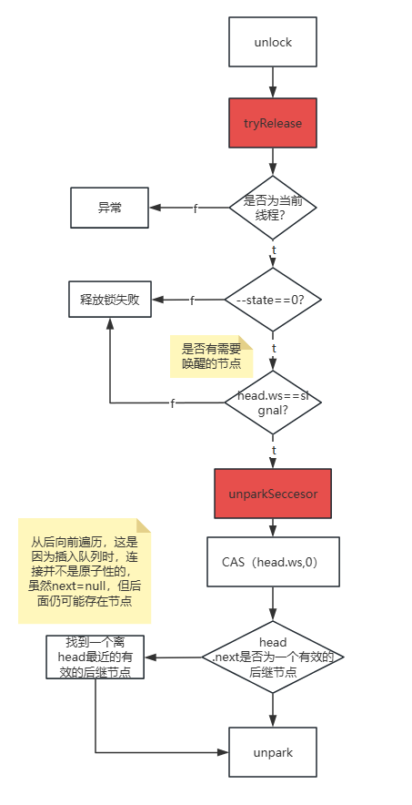

#### ① `unlock()`

```java
public void unlock() {
    sync.release(1);
}
```

#### ② `release()`

```java
public final boolean release(int arg) {
    // 尝试释放锁或减少持有的状态。arg通常表示释放的数量，具体由子类实现的tryRelease方法定义。
    if (tryRelease(arg)) {
        // 如果释放成功，则获取同步队列中的头节点。
        Node h = head;

        // 检查头节点是否有必要唤醒后继节点。
        if (h != null && h.waitStatus != 0)
            // 如果头节点需要唤醒后继节点，调用unparkSuccessor(h)来唤醒它。
            unparkSuccessor(h);

        // 释放操作成功，返回true。
        return true;
    }

    // 如果释放操作失败（tryRelease返回false），返回false。
    return false;
}

```

#### ③ `tryRelease()`

```java
protected final boolean tryRelease(int releases) {
    // 通过从当前状态减去指定的释放量来计算新的状态。
    int c = getState() - releases;

    // 检查当前线程是否真的是锁的持有者。
    if (Thread.currentThread() != getExclusiveOwnerThread())
        throw new IllegalMonitorStateException();
        // 如果不是持有者，则抛出异常。这个检查确保只有最初获取锁的线程才能释放它，
        // 这是可重入锁的一个典型限制。

    // 标志位，用来指示锁是否完全释放。
    boolean free = false;

    // 检查新状态是否表明所有的锁都已释放（状态为0）。
    if (c == 0) {
        free = true; // 如果是0，设置free为true，表示锁已完全释放。
        setExclusiveOwnerThread(null); // 将持有锁的线程设置为null。
    }

    // 设置锁的新状态。
    setState(c);
    return free; // 返回是否完全释放了锁。
}

```

####  ④ `unparkSuccessor()`

```java
private void unparkSuccessor(Node node) {
    // 获取节点的等待状态
    int ws = node.waitStatus;
    // 如果等待状态为负（表示需要信号），尝试将其设置为0
    if (ws < 0)
        compareAndSetWaitStatus(node, ws, 0);

    // 获取当前节点的下一个节点
    Node s = node.next;
    // 如果下一个节点不存在或下一个节点的等待状态被取消（状态值大于0）
    if (s == null || s.waitStatus > 0) {
        s = null;
        // 从尾部开始向前遍历，直到当前节点，寻找第一个等待状态不被取消的节点
        for (Node t = tail; t != null && t != node; t = t.prev)
            if (t.waitStatus <= 0)
                s = t;
    }
    // 如果找到了合适的后继节点，唤醒该节点代表的线程
    if (s != null)
        LockSupport.unpark(s.thread);
}

```

### （5）并发中断情况分析

> [AQS核心流程解析-cancelAcquire方法-CSDN博客](https://blog.csdn.net/IToBeNo_1/article/details/123506221)

tail中断

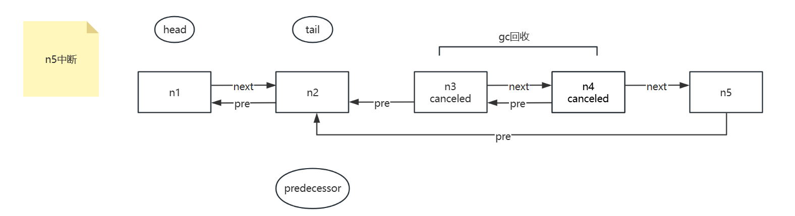

中间节点中断

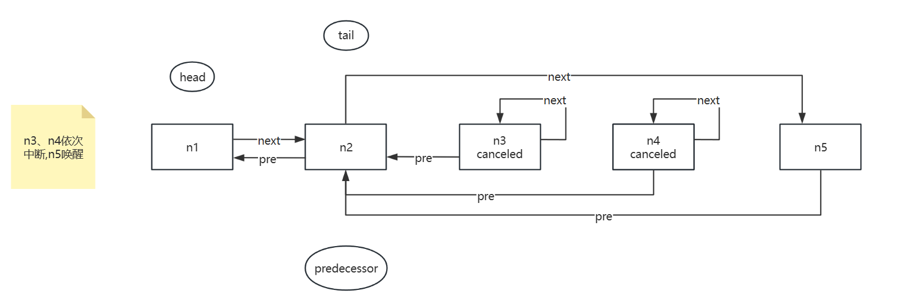


head节点中断

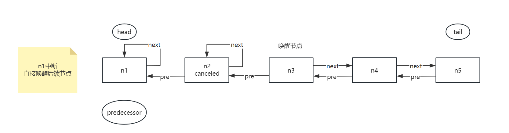

### （6）Condition

#### ① Condition概述

Condition（条件变量）是一种同步机制，主要用于多线程编程中，用于在某些条件成立之前阻塞线程的执行，当条件成立时则通知被阻塞的线程继续执行。

```java
public class TestReentrantLock {
    public static void main(String[] args) throws InterruptedException {
        ReentrantLock lock = new ReentrantLock();
        Condition condition = lock.newCondition();
        new Thread(()->{
            lock.lock();
            try{
                for (int i = 0; i < 100; i++) {
                    System.out.println(Thread.currentThread().getName()+":" +i);
                    if(i==50){
                        condition.await();
                    }
                }
            } catch (InterruptedException e) {
                throw new RuntimeException(e);
            } finally {
                lock.unlock();
            }
        }).start();
        Thread.sleep(10);
        lock.lock();
        try{
            for (int i = 0; i < 100; i++) {
                System.out.println(Thread.currentThread().getName()+":" +i);
            }
            condition.signal();
        }finally {
            lock.unlock();
        }
    }
}
```

#### ② 初步分析

Condition 的实现基于 `AbstractQueuedSynchronizer` (AQS) 提供的支持，通过使用一个内部的 `ConditionObject` 来具体实现条件等待和通知的功能。在 Java 的 `ReentrantLock` 类中，`Condition` 是通过调用 `newCondition()` 方法来创建的，返回一个 `ConditionObject` 实例。

##### ObjectCondition 关键属性

1. **Node firstWaiter**：指向等待队列的第一个节点，该队列是一个类型为 `Node` 的单向链表。
2. **Node lastWaiter**：指向等待队列的最后一个节点，用于快速添加新的等待者。
3. **int REINTERRUPT**：在 `await()` 方法结束时，如果发现当前线程在等待过程中被中断过，则重新设置中断状态。
4. **int THROW_IE**：如果线程在进入 `await()` 方法时已经被设置了中断状态，或者在等待时被中断，则抛出 `InterruptedException`。

##### Node 类关键属性

- **Node nextWaiter**：用于链接下一个在条件队列中等待的 `Node`。
- **int CONDITION**：一个标记，用来指示该 `Node` 是属于条件等待队列。

##### 大致流程

当线程调用 `ConditionObject` 的 `await()` 方法时，会执行以下步骤：

1. **添加到等待队列**：当前线程所在的节点会被加入到由 `firstWaiter` 和 `lastWaiter` 维护的等待队列中。如果队列为空，则此节点同时是 `firstWaiter` 和 `lastWaiter`；如果不为空，则加入队列尾部，并更新 `lastWaiter`。

2. **释放锁并等待**：线程释放它持有的锁，并进入等待状态，直到被通知或中断。线程会通过 `LockSupport.park(this)` 被挂起。

3. **被唤醒后的处理**：一旦被 `signal()` 或 `signalAll()` 方法唤醒，或者线程被中断，它会尝试重新获得在 `await()` 方法中释放的锁，如果失败则重新放入AQS队列。如果在等待期间线程被中断，它会根据中断类型（REINTERRUPT 或 THROW_IE）处理中断。

4. **移出等待队列**：一旦线程重新获得锁并从 `await()` 方法返回，它的节点将从等待队列中或AQS队列移除。

#### ③ await源码分析

`await`方法是Condition对象中最关键的部分之一。它的主要作用是使当前线程等待，直到其他线程通知或中断。

```java
public final void await() throws InterruptedException {
    if (Thread.interrupted())
        throw new InterruptedException();
    Node node = addConditionWaiter();
    int savedState = fullyRelease(node);
    int interruptMode = 0;
    while (!isOnSyncQueue(node)) {
        LockSupport.park(this);
        if ((interruptMode = checkInterruptWhileWaiting(node)) != 0)
            break;
    }
    if (acquireQueued(node, savedState) && interruptMode != THROW_IE)
        interruptMode = REINTERRUPT;
    if (node.nextWaiter != null) // clean up if cancelled
        unlinkCancelledWaiters();
    if (interruptMode != 0)
        reportInterruptAfterWait(interruptMode);
}
```

#### ④ signal源码分析

`signal`方法的作用是唤醒一个在Condition上等待的线程。其源码分析显示，它首先检查当前线程是否持有相关的锁，然后从等待队列中选择一个线程，将其转移到同步队列中以准备获取锁。

## 4.ReentrantReadWriteLock

### （1）为什么出现读写锁

读写锁（ReentrantReadWriteLock）是为了解决多线程环境下，读操作和写操作对资源的不同需求而设计的。在多线程编程中，读操作通常不会改变数据，而写操作会修改数据。如果使用传统的互斥锁（如ReentrantLock），则读操作和写操作都需要独占锁，这限制了并发性，特别是在读操作远多于写操作的场景中，使用互斥锁会大大降低程序的效率。

读写锁允许多个线程同时进行读操作，只要没有线程在进行写操作。这样可以提高程序处理读密集型任务时的并发性能。同时，在写操作必须独占资源时，读写锁也能保证数据的一致性和安全性。

### （2）读写锁的实现原理

读写锁的实现原理基于两种状态的锁：读锁和写锁。它们的基本工作机制如下：

- **读锁（共享锁）**：当一个线程获取读锁后，其他线程可以继续获取读锁，实现共享访问。只有当没有线程持有读锁时，写锁才可以被获取。这允许多个读线程同时访问，但保证在执行写操作时，没有其他读或写线程干扰，从而维护数据一致性。

- **写锁（独占锁）**：当一个线程获取写锁后，其他线程无论是读操作还是写操作，都不能获取锁。这确保了写操作的独占性，防止数据在写入时被其他线程读取或修改，从而避免数据竞争和不一致。

在Java中，`ReentrantReadWriteLock`提供了读锁和写锁的具体实现。它还支持重入性，即线程可以重复获取已经持有的锁。这是通过分别维护读锁持有计数和写锁持有计数来实现的。当线程首次获取写锁时，JVM会记录锁的持有者和持有次数；如果同一个线程再次请求写锁，计数会增加，释放锁时计数减少，直到计数为零，锁被完全释放。读锁也类似，但它允许多个线程同时增加计数。

通过这种方式，`ReentrantReadWriteLock`允许在高并发读的场景下提高性能，同时保证写操作的安全性和一致性。

### （3）写锁源码分析

### （4）读锁源码分析


