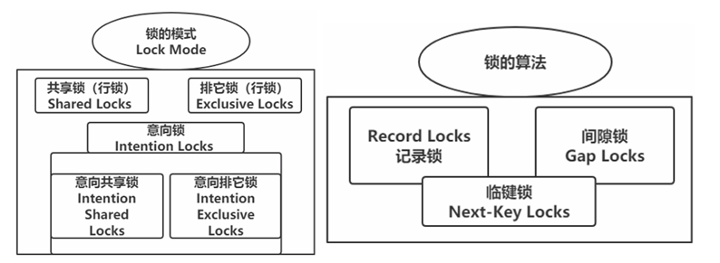
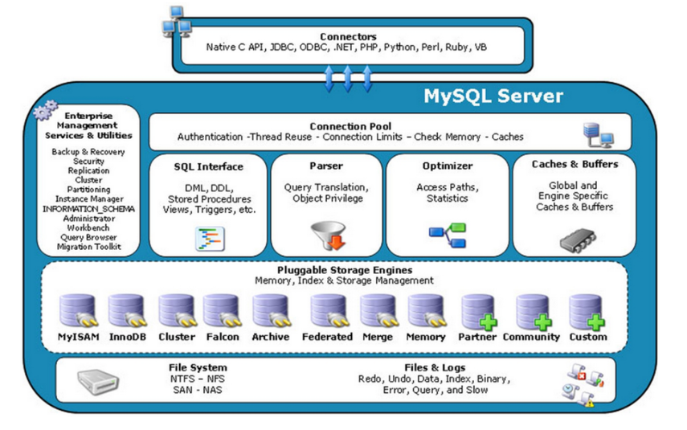

①②③④⑤⑥⑦⑧⑨⑩

# 一、数据库基础

## 1. 范式

### （1）概述

范式是数据库设计中用于减少数据冗余和提高数据整合性的一种方法。通过应用不同级别的范式规则，可以优化表的结构，确保数据的一致性和可维护性。

### （2）三大范式

#### ① 第一范式（1NF）

- **定义**：第一范式要求表的每个字段都是不可分割的最小数据单位。
- **理解**：第一范式强调数据表的原子性，是数据库设计的基础。例如，一张包含`name-age`列的表不符合1NF，因为该列包含了两个属性。将其拆分为`name`和`age`两列，使表符合第一范式。
- **详细要求**：
  1. 确保每一列的原子性，不可再分。
  2. 合并属性相似或相同的列，避免数据冗余。
  3. 每列由基本数据类型组成。
  4. 表结构简单，呈现为二维表。

#### ② 第二范式（2NF）

- **定义**：建立在1NF基础上，要求所有非键属性完全依赖于整个主键（不仅是主键的一部分）。
- **理解**：如果某属性只依赖主键的一部分，该属性应与主键的这一部分分离，形成新的实体。新实体与原实体之间形成一对多关系。

#### ③ 第三范式（3NF）

- **定义**：在2NF基础上进一步要求，表中的任何非主键属性不能依赖于其他非主键属性。
- **理解**：每个非键属性必须直接依赖主键，不通过其他字段间接依赖。

根据您的笔记内容，以下是修饰后的版本，保持了您指定的格式：

### （3）反范式设计

尽管范式化设计旨在减少数据冗余并提高数据完整性，但完全符合范式的设计并非没有缺点。在实际业务中，经常需要进行大量的表关联查询，如果表结构高度范式化，这些关联操作可能会显著影响查询性能。

**反范式化设计的核心思想：**

1. 适当违反范式化设计的原则，以提升性能和读取效率。
2. 允许存在一定程度的数据冗余，以优化查询性能。

简而言之，反范式化是通过牺牲存储空间来换取时间效率。

### （4）范式化与反范式化的比较


1. **更新性能**：范式化设计中，更新操作通常更快，因为涉及的字段较少。
2. **数据冗余**：高度范式化的设计几乎不包含重复数据，更新时需要修改的数据更少。
3. **内存占用**：范式化的表通常更小，因此占用的内存也较少。
4. **查询复杂性**：范式化设计需要频繁的表关联，使得即使是中等复杂度的查询也可能需要至少一次关联，这增加了查询的复杂性。
5. **索引策略**：范式化可能导致原本可以在同一表中共享同一索引的列被分散到不同表中，从而降低索引效率。

反范式化设计通常在需要优化读取性能的大型读取密集型系统中更为常见，而范式化设计适用于更新操作频繁、数据冗余和一致性要求高的应用环境。每种设计方法都有其适用场景和优缺点，选择合适的设计策略需要根据具体业务需求和系统特性来决定。

### （5）反范式应用

#### ① 缓存与汇总数据

**缓存**: 从其他表简单获取并存储的数据，例如，将父表中的数据冗余到子表中。一个常见的例子是将分类信息冗余存放在商品表中。

**汇总**: 指保存使用 `GROUP BY` 语句聚合的数据的表。例如，可以通过对每个用户发送的消息进行计数来显示每个用户发送的消息数量，或者在用户表中添加一个专门的列来存储消息计数，每当用户发送新消息时，更新这一计数。

在管理缓存和汇总表时，通常采用实时维护或定期重建两种方式：
- **缓存表** 通常采用实时更新，确保数据的实时准确性。
- **汇总表** 则更倾向于定期重建，通过定时任务更新数据。

#### ② 计数器表设计

计数器表在Web应用中极为常见，用于记录例如网站点击数、用户朋友数、文件下载次数等。在高并发环境下，优化计数器表的设计至关重要。

**问题**：如果一个计数器表只包含一个记录网站点击次数的行，每次点击更新时都需要在这条记录上加锁，这会导致事务只能串行执行，极大限制并发能力。

**改进方案**：

- 将计数器分布在多行中，以减少锁的竞争。
- 引入“槽”字段，预先在表中增加多行（例如100行），每次更新时随机选择一个槽进行更新。

这种设计可以显著提高系统的处理能力和响应速度，是反范式设计中一种典型的优化策略。

## 2.字段数据类型

### （1）字段优化原则

**最小数据类型**

在选择数据类型时，原则上应选择能够正确存储数据的最小数据类型。较小的数据类型在存储和处理时通常更加高效，因为它们占用的磁盘、内存和CPU缓存较少，同时在处理时也需要更少的CPU周期。

**实例**：如果一个字段可以用字符串类型也可以用整型表示，应优先选择整型。这是因为字符串类型涉及字符集和校对规则，处理起来更为复杂。

**尽量避免NULL**

在大多数情况下，建议将列定义为NOT NULL，除非必须存储NULL值。包含可为NULL的列的查询在MySQL中更难以优化，因为这种列的索引、索引统计和值比较更为复杂。此外，可为NULL的列在存储上也需占用更多空间，且在MySQL中需要特殊处理。

在建立索引时，尤其应避免列设定为可为NULL，因为每个索引记录都会额外占用一个字节空间。尽管将可为NULL的列改为NOT NULL可能带来的性能提升不大，因此在现有的schema中进行这种调整可能不是优先考虑的事项，除非确认这会引起性能问题。

以下是您的笔记内容的修饰版本，按照您指定的格式：

### （2）整数类型

在MySQL中，可以选择多种整数类型来存储数据，包括：`TINYINT`, `SMALLINT`, `MEDIUMINT`, `INT`, `BIGINT`。它们分别使用8, 16, 24, 32, 64位存储空间，相当于1、2、3、4、8个字节。整数类型还可以选择是否使用`UNSIGNED`属性，这个属性表明该类型不允许负值，大致可以将正数的上限提高一倍。例如，`TINYINT UNSIGNED`的存储范围是0到255，而普通的`TINYINT`的范围是-128到127。

有符号和无符号整数类型占用相同的存储空间，并具有相同的性能表现，因此可根据实际需求选择适当的类型。

需要注意的是，`integer`和`int`在MySQL中存储大小和性能上没有区别，二者的命名只是为了在业务逻辑上区分使用。

关于整数类型的宽度指定，如`INT(11)`，对于大多数应用而言，这个宽度定义并无实际意义，它并不限制值的合法范围，只是规定了MySQL的某些交互工具用来显示字符的个数。例如，在MySQL命令行客户端中，无论是`INT(1)`还是`INT(20)`，其存储和计算行为是相同的。

### （3）实数类型

实数类型包括带有小数部分的数字。MySQL支持两类实数存储方式：精确的`DECIMAL`类型和不精确的浮点类型`FLOAT`与`DOUBLE`。

- `DECIMAL`类型用于存储需要精确小数处理的场景，如财务计算。它本质上以字符串形式存储，因此CPU不支持对`DECIMAL`的直接计算，而是依赖MySQL自身实现的高精度计算。
- 浮点类型`FLOAT`和`DOUBLE`则由CPU直接支持运算，这使得浮点运算速度更快。`FLOAT`使用4个字节存储，而`DOUBLE`使用8个字节，提供了比`FLOAT`更高的精度和更大的数值范围。
- 相较之下，`DECIMAL`在存储相同范围的值时通常占用更多空间。

**选择标准**：
- 在不需要高精度且优先考虑运算速度的场合，应选择`FLOAT`或`DOUBLE`。
- 只有在需要对小数进行精确计算的情况下，比如财务或金融数据，才推荐使用`DECIMAL`。

在数据量大且要求高精度的情况下，可以考虑使用`BIGINT`替代`DECIMAL`。例如，要求精确到万分之一的财务数据可以将所有金额乘以一百万后存储在`BIGINT`中，这样既避免了浮点数的计算不精确问题，也减少了使用`DECIMAL`的计算代价。

### （4）字符类型

MySQL支持多种字符串类型，主要包括`VARCHAR`和`CHAR`类型、`BLOB`和`TEXT`类型、`ENUM`（枚举）和`SET`（集合）类型。

#### ① VARCHAR

`VARCHAR`是用于存储可变长度字符串的数据类型，非常适合存储长度不一的文本。它只使用必要的空间来存储数据（例如，较短的字符串使用较少的空间）。`VARCHAR`类型在内部使用1或2个额外字节来记录字符串的实际长度：如果最大长度小于或等于255字节，则使用1个字节；如果超过255字节，则使用2个字节。

`VARCHAR`类型的一个优势是它节省了存储空间，这有助于提升性能。然而，在进行`UPDATE`操作时，如果新的字符串比旧的更长，可能需要在存储上进行额外的调整，如`MyISAM`会将行拆成片段存储，而`InnoDB`可能需要分裂页。

#### ② CHAR

`CHAR`是一种定长类型，MySQL会为`CHAR`字段预分配足够的空间来存储定义的最大长度。`CHAR`类型存储时会删除所有末尾空格，并根据需要使用空格填充，以便进行比较。

##### 如何选择CHAR与VARCHAR？

- **VARCHAR** 适合用于列的最大长度远大于平均长度，或者列很少更新的场景。如果使用复杂的字符集（如UTF-8），每个字符占用不同字节数，也推荐使用`VARCHAR`。
  
- **CHAR** 适合存储长度相对固定的短字符串，或所有值几乎都是同一长度的场景。例如，存储MD5加密的密码非常适合使用`CHAR`，因为它是固定长度的。对于经常更新的数据，`CHAR`也比`VARCHAR`更合适，因为定长的`CHAR`类型不易产生碎片。

对于非常短的字符串，如用`CHAR(1)`存储只有`Y`和`N`的值，在单字节字符集中只需要一个字节，而`VARCHAR(1)`需要两个字节，因为还有一个记录长度的额外字节。

##### 关于VARCHAR长度选择

选择`VARCHAR(5)`和`VARCHAR(200)`存储"hello"虽然在磁盘空间上开销相同，但更短的列在内存使用上更为高效。MySQL在处理这些类型时，尤其是在使用内存临时表进行排序或操作时，会因为更长的列分配更多的内存，从而影响性能。因此，最佳策略是只分配实际需要的空间，避免不必要的资源消耗。

#### ③ BLOB和TEXT类型

`BLOB`和`TEXT`是专为存储大量数据设计的字符串数据类型。`BLOB`用于存储二进制数据，而`TEXT`用于存储文本数据。两者的主要区别在于`BLOB`没有字符集和排序规则，而`TEXT`具有字符集和排序规则。

在MySQL中，`BLOB`和`TEXT`类型的处理与其他数据类型不同。每个`BLOB`或`TEXT`值被视为一个独立的对象，通常需要特殊的存储处理。对于过大的`BLOB`或`TEXT`数据，`InnoDB`存储引擎会使用专门的外部存储区域进行存储，并在行内用1到4个字节存储一个指向实际数据的指针。

使用`BLOB`和`TEXT`类型时需谨慎：

1. **避免使用**：`BLOB`和`TEXT`值可能会引起性能问题，因此在设计数据库时应尽可能避免使用这些类型。
   
2. **列隔离**：如果必须使用，建议将`BLOB`或`TEXT`列分离到独立的表中，以提高性能和管理的灵活性。

3. **查询限制**：避免在不必要时检索大型的`BLOB`或`TEXT`值。例如，使用`SELECT *`查询可能会无意中在网络上传输大量数据。建议使用索引列进行搜索，确定需要的数据行后，再从这些行中检索`BLOB`或`TEXT`值。

4. **合成索引**：为了提高大文本字段的查询性能，可以使用合成索引。这涉及到根据大文本字段内容生成的散列值，并将这个散列值存储在单独的列中。然后，可以通过搜索这些散列值来定位数据行。注意，这种方法仅适用于需要精确匹配的查询，因为散列值不适合范围搜索操作。散列值可以通过`MD5`、`SHA1`、`CRC32`或自定义逻辑生成。

这些策略有助于在使用`BLOB`和`TEXT`类型时，平衡性能与存储需求，尽量减少它们对数据库性能的负面影响。

### （5）枚举类型

枚举类型（`ENUM`）是MySQL中用于表示固定字符串集的一种数据类型。当表中的字段只能取固定几个字符串值时，使用枚举类型可以有效减少数据存储空间。MySQL非常高效地处理枚举类型，根据枚举值的数量，内部存储可能仅占用一个或两个字节。在内部，MySQL将枚举值的每个可能项保存为整数，这可以显著减小表的存储大小。

例如，创建一个包含枚举类型的表可以如下操作：

```sql
CREATE TABLE enum_test(
  e ENUM('fish', 'apple', 'dog') NOT NULL
);

INSERT INTO enum_test(e) VALUES ('fish'), ('apple'), ('dog');
```

在使用枚举类型时，需要注意以下几点：

1. **避免使用数字作为枚举常量**：由于枚举列实际上是以整数形式存储的，使用数字作为枚举常量（如`ENUM('1', '2', '3')`）可能导致混淆。这是因为当枚举值被解释为整数时，可能不会如预期那样反映其原始的字符串形式。

2. **定义顺序的重要性**：枚举字段的排序是按照它们在枚举定义中的位置（即内部整数值）进行的，而不是按照字符串值。因此，定义枚举时应按照你需要的排序顺序排列字符串。

这些指导原则可以帮助你在使用枚举类型时避免常见的陷阱，并确保数据以最有效的方式存储和处理。

## 3. 命名规范

### （1）可读性原则

数据库、表、字段的命名应遵循可读性原则，避免或减少使用缩写。命名应直接反映其代表的实体或功能：

- **数据库名**：应与应用名称尽量保持一致。
- **表名**：应体现表中存储的数据内容，建议采用“业务名称_表的作用”的格式。
- **字段名**：表达布尔值（是/否）的字段，建议使用`is_xxx`的格式，数据类型为`unsigned tinyint`（1表示是，0表示否）。
- **存储过程名**：应清晰反映其功能。

### （2）命名约定

- **使用小写字母和数字**：表名和字段名必须使用小写字母或数字，且不得以数字开头。
- **避免使用双下划线**：禁止在两个下划线之间只出现数字。
- **大小写敏感性**：由于MySQL在Windows下不区分大小写，而在Linux下默认区分大小写，建议统一使用小写字母来避免跨平台兼容性问题。

### （3）表名单数形式

- **避免复数形式**：表名应使用单数形式，以确保一致性和避免混淆。

### （4）避免使用保留字

- **禁用保留字**：在命名数据库、表或字段时，不应使用SQL保留字，如`desc`、`range`、`match`等，以防止造成语法错误或冲突。

### （6）索引命名

- **主键索引**：命名为`pk_字段名`。
- **唯一索引**：命名为`uk_字段名`。
- **普通索引**：命名为`idx_字段名`。

遵守这些命名规范有助于维护数据库的清晰结构，提高代码的可读性和可维护性，同时避免在多平台部署时遇到不必要的问题。

## 4.B+树

> 数据结构可视化工具：[数据结构可视化 --- Data Structure Visualization (usfca.edu)](https://www.cs.usfca.edu/~galles/visualization/Algorithms.html)

### （1）概述

B+树（Balance）是关系型数据库中最常用且最有效的索引结构。B+树起源于平衡二叉树，但本身是一个多叉树。


B+树的主要特征包括：

1. **树的高度**：与拥有相同节点数量的平衡二叉树相比，B+树的高度要低很多，这减少了查找时需要的磁盘I/O操作数量。

2. **节点结构**：非叶子节点仅存储键值和指向子节点的指针，不直接存储数据。这种结构有助于提高索引的存储效率。

3. **叶子节点**：叶子节点存储实际的数据记录，并且数据记录在叶子节点内部以及叶子节点之间都是有序排列的。叶子节点按键值的顺序串联起来，便于范围查询。

4. **节点连接**：相邻的叶子节点通过指针相连，这使得范围访问变得更加高效。

一棵m阶的B+树的详细定义如下：

- 每个节点最多包含m个元素。
- 除根节点外，每个节点至少包含(m/2)个元素。
- 如果根节点不是叶节点，那么它至少有两个子节点。
- 所有叶子节点都位于同一层。
- 非叶子节点仅存放键和指向孩子节点的指针，而实际的记录只存储在叶子节点中。
- 一个有k个孩子节点的非叶子节点含有(k-1)个键，且按升序排列。
- 任何键的左子树中的所有键都比该键小，右子树的所有键都大于或等于该键（与二叉排序树的特性相同）。
- 相邻叶子节点之间通过指针连接。

这些特性使得B+树在数据库索引应用中非常高效，特别是在处理大量数据时的查询优化上有显著优势。

### （2）B+树、B树、B*树

#### **① B树**


- **数据存储**：在B树中，数据可以存储在所有节点上，包括叶子节点和非叶子节点。这意味着数据和键值（Key）可以在树的任何位置找到。
- **结构特点**：B树的每个节点最多含有m个子节点（m阶），每个节点保存k个键（k<m），以及k+1个指向子节点的指针。
- **查找效率**：查找某个键时，可能需要访问树的多层结构，从根节点开始，直至找到该键所在的节点。

#### **② B+树**


- **数据存储**：在B+树中，所有的数据记录仅存储于叶子节点，而内部节点仅存储键值信息，这有助于减少访问磁盘的次数，因为内部节点更小，可以加载更多的键。
- **链表结构**：所有叶子节点形成一个链表，便于进行全范围扫描。在MySQL实现中，这种链表是双向的，即每个节点都有指向前一个和后一个节点的指针，这增加了双向遍历的灵活性。
- **高效范围查询**：由于所有数据都存储在叶子节点的链表中，进行范围查询（如查找一个区间内的所有值）时非常高效。

#### ③ B*树

- **B*树**是B+树的变体，在B+树的基础上增加了非叶子节点间的指针，使得非叶子节点也形成了一个链式结构。
- **优化空间利用**：在B*树中，非叶子节点的分裂规则是当节点满时，将节点中的一部分键值移动到相邻节点（如果有空间的话），只有在相邻节点也满时才进行分裂，这样可以更高效地使用空间。
- **应用**：B*树由于其高效的空间利用率，被用于某些特定的数据库实现中，如Oracle数据库。

这些树结构在数据库索引设计中非常关键，它们帮助数据库管理系统有效地执行查找和范围查询，同时优化存储空间和查询速度。

### （3）MySQL使用B+树

关系型数据库广泛采用B+树作为索引结构，这与磁盘的物理特性密切相关。为了提高效率，关键是要尽量减少磁盘I/O操作。磁盘通常不是按需读取单个字节，而是采用**预读**技术，即使只需要一个字节，磁盘也会从当前位置开始顺序读取一定长度的数据到内存中。预读的长度通常以页（page）为单位，页是计算机存储管理的基本单位，通常大小为4KB。

磁盘的预读特性意味着，如果将B+树的每个节点大小设置为与页大小相匹配或是其整数倍（例如InnoDB的默认节点大小为16KB），可以在每个节点中存储大量的键值。例如，如果每个键占用8字节，一个16KB的节点可以存储大约2000个键。这种设计允许B+树具有非常高的扇出（fanout），通常超过100，意味着在查找记录时能够显著减少I/O操作的次数。

- 扇出是指一个非叶节点包含的指向子节点的指针数量，直接影响树的高度和查找效率。由于B+树的高扇出，数据库系统可以在减少几次磁盘访问的情况下从根节点到达所需的叶子节点。

B+树的特点包括：

- **数据和索引分离**：所有的记录数据只存储在叶子节点上，而非叶子节点仅存储索引键和指向子节点的指针。这种结构使得非叶子节点更小，能够加载更多的索引键，进一步减少访问磁盘的次数。
- **顺序读写优化**：叶子节点中的记录按索引键的顺序排列，并且以双向链表的形式相连。这不仅优化了范围查询的效率，还确保了相邻的节点数据在磁盘上也有可能物理相邻，从而充分利用磁盘的顺序读写特性。

# 二、索引

## 1.概述

索引是数据库中用于提高查询效率的数据结构。简单来说，**索引是一种特殊的数据结构**，它存储在数据库的一个表中，以使数据检索更快。InnoDB存储引擎支持多种类型的索引，最常见的包括：B+树索引、全文索引和哈希索引。

尽管哈希表是一种高效的数据结构，通常用于快速数据检索，但它并不适合用作数据库索引的主要结构，原因包括：

1. **范围查询的限制**：哈希表主要支持精确匹配查询，不适用于范围查找。数据库查询往往需要执行范围搜索，如查找某个区间内的值，这是哈希索引无法有效支持的。

2. **排序困难**：当查询需要按某个字段排序输出时（如使用`ORDER BY`），哈希索引无法直接支持这一操作。哈希索引的本质是将键值通过哈希函数转换为哈希值，这些哈希值的顺序与原始键值的逻辑顺序无关，因此无法用于排序。

3. **组合索引的局限性**：对于组合索引（如索引涵盖字段a、b、c），如果查询仅涉及前两个字段（a和b），B+树索引可以利用这部分索引进行查询。但如果使用哈希索引，通常需要将所有参与索引的字段合并后进行哈希，这样就无法只使用部分字段来利用索引。

4. **大数据量下的冲突问题**：当数据量庞大时，哈希表的冲突概率增加，这会影响哈希索引的效率。虽然可以通过扩展哈希表或使用更复杂的哈希函数来减少冲突，但这会增加计算成本，并可能降低数据检索的速度。

因此，尽管哈希索引在特定场景下（如精确查找小数据集）可以提供极快的查询性能，但由于上述限制，在数据库系统中，特别是需要高效支持复杂查询和大数据集的场景下，更倾向于使用B+树等更为灵活的索引结构。

## 2. B+树索引

### （1）聚簇索引

聚簇索引不仅是一个索引结构，而且决定了表中数据行的物理存储顺序。在聚簇索引中，数据实际存放在索引的叶子节点上，这意味着表数据和索引成为了一个不可分割的整体。因此，一个表只能有一个聚簇索引。

对于InnoDB引擎，主键索引自动成为聚簇索引。如果没有明确指定主键，MySQL会选择第一个唯一索引（非空）作为聚簇索引。如果表没有任何唯一索引，InnoDB会自动生成一个隐藏的行ID作为聚簇索引。


聚簇索引的优势在于可以提高数据访问的效率，因为常常访问的数据和键值紧密存储在一起。然而，如果表经常发生插入或删除操作，聚簇索引可能导致数据页分裂，影响性能。

### （2）辅助索引

辅助索引（也称为非聚簇索引或二级索引）在InnoDB中是与聚簇索引分开存储的。辅助索引的叶节点不直接存储行数据本身，而是存储索引键值和相应行的主键值。

在执行查询时，如果使用辅助索引检索数据，数据库可能需要进行两次查找：首先在辅助索引中找到对应的主键，然后使用这个主键在聚簇索引中找到实际的数据。这种操作被称为“回表”。

辅助索引可以提高查询效率，特别是对那些不需要访问所有数据列的查询。但是，每个辅助索引都增加了额外的存储需求，并可能在数据修改时导致额外的维护成本。

### （3）回表

回表是一个过程，涉及在辅助索引查询中使用索引键值查询到主键，然后再使用这个主键去聚簇索引中查询完整的数据行。这是必要的因为辅助索引只存储了行的主键而不是完整的数据。

回表过程会增加查询成本，因为它通常需要进行两次索引查找：一次在辅助索引上，一次在聚簇索引上。这使得辅助索引的查询效率通常低于直接通过聚簇索引查询。因此，设计索引时，需要权衡索引带来的查询优化与其维护及性能开销。

### （4）联合索引

联合索引，也称为复合索引，是在多个列上同时建立的索引。在MySQL中，联合索引按照索引中的列顺序存储键值。这种索引可以极大地提升多个列参与查询条件时的查询性能。

**工作原理：**

当创建如`(a, b, c)`的联合索引时，MySQL会首先根据列`a`的值排序，当列`a`的值相同时，再根据列`b`的值排序，以此类推。这样，如果查询条件包含列`a`，或者列`a`和列`b`，甚至是所有三列，联合索引都能有效地支持查询。然而，如果查询仅涉及列`b`和列`c`，而不涉及列`a`，那么这个索引就不会被利用。

**最左前缀原则：**

联合索引遵循最左前缀原则，即MySQL可以使用索引的最左边的一个或多个列。查询条件需要以索引定义的顺序来使用索引中的列。

联合索引非常适合那些经常一起查询的列。正确地创建联合索引可以减少查询中的排序和临时表的使用，从而提高查询效率。

### （5）覆盖索引

覆盖索引是指一个索引包含了查询中需要的所有数据。简而言之，如果一个查询能够仅通过索引中的信息完成，而不必回表到原始数据行，那么这个索引就是覆盖索引。

**优点：**
1. **性能提升**：由于数据文件本身没有被访问，查询速度可以显著提升，尤其是对于大数据量的表。
2. **减少I/O**：因为所有需要的数据都在索引中，数据库引擎不需要执行额外的I/O操作去数据文件中检索数据。

**适用场景：**

覆盖索引尤其适用于查询中涉及多个列但实际输出的列不多的情况。例如，如果某查询只需要输出用户的ID和用户名，而这两列已经在一个索引中，就可以仅通过索引来获取这些信息，无需访问表中的其他数据。

**检测方法：**

在MySQL中，可以通过`EXPLAIN`命令的输出来检查查询是否使用了覆盖索引。如果`Extra`列显示为`Using index`，这表明查询是一个覆盖索引查询。

## 3.哈希索引

在InnoDB存储引擎中，除了标准的B+树索引之外，还存在一种特别的索引类型称为自适应哈希索引（Adaptive Hash Index，AHI）。这种索引旨在提高频繁访问数据的查询效率。

自适应哈希索引是由InnoDB自动创建和管理的，它通过监控对表的查询操作来决定哪些键值对会受益于哈希索引。当系统检测到某些索引被频繁查询时，它会将这些热点数据的索引转换成哈希索引，从而加快数据检索速度。

**工作原理**

- **自动监控**：InnoDB会持续监控查询模式，识别哪些索引经常被访问。
- **创建哈希索引**：对于那些被频繁访问的索引，InnoDB会在内部自动创建对应的哈希索引。
- **快速定位数据**：通过哈希索引，InnoDB可以几乎立即定位到数据的具体位置，这比在B+树中逐级查找要快得多。

在传统的B+树索引中，查找数据可能需要3到4次磁盘I/O，这是因为B+树的高度通常为3或4层。而通过自适应哈希索引，InnoDB可以直接通过哈希值定位数据，大幅减少查询所需的时间。

**哈希函数和冲突解决**

- **哈希函数**：InnoDB使用除法散列法来计算哈希值。
- **冲突解决**：当两个或多个键产生相同的哈希值时，InnoDB使用链表方式解决哈希冲突。

尽管自适应哈希索引能显著提高等值查询的性能，但它们仅适用于等值查询（如`SELECT * FROM table WHERE column = value`）：

- **等值查询**：哈希索引非常适合处理形如`column = value`的查询。
- **非范围查询**：对于需要执行范围查询的情况，哈希索引无法提供支持，因为哈希索引不保留数据的顺序信息。

自适应哈希索引是完全由InnoDB内部管理的，用户无法直接创建、修改或删除这类索引。这种索引的存在完全取决于InnoDB的内部算法和当前的数据库使用模式。

总结来说，自适应哈希索引是InnoDB优化读取性能的一个高级特性，它能在数据库层面自动优化频繁查询的响应时间，适用于读密集型应用中频繁访问的数据。

## 4.全文索引

全文检索（Full-Text Search, FTS）是一种强大的技术，能够在大量文本中快速查找包含特定关键字的文档。这种技术特别适用于搜索包含大量文本的数据库，如图书、文章集合或网页内容。全文检索的核心在于倒排索引（Inverted Index），这是一种索引方法，它将文档中的关键词映射回包含它们的文档。

倒排索引记录了每个关键词出现在哪些文档中。具体来说，对于每个关键词，索引会列出所有包含该词的文档，通常这些信息会与关键词的出现频率和位置信息一起存储，从而支持复杂的搜索查询，如邻近搜索或短语搜索。

在实际应用中，比如一个数据库保存了唐宋时期的诗词，用户可能想根据某些词或短语来查找诗词。传统的`LIKE '%keyword%'`查询非常低效，因为它需要扫描整个文本字段，逐条比对文本。全文检索通过创建倒排索引，极大地提高了搜索效率。

从MySQL 5.6开始，InnoDB引擎支持了全文检索，允许用户在创建表时使用`FULLTEXT`类型的索引来优化文本搜索查询。然而，MySQL的全文索引功能相比专门的搜索引擎如Elasticsearch、Solr（这些基于Apache Lucene）可能功能较弱，主要因为：

1. **限制较多**：MySQL的全文索引每张表只能有一个，且对非西欧语言的支持较弱。
2. **性能**：虽然InnoDB的全文检索足以应对一些基本需求，但在处理大规模文本数据时，其性能和可扩展性不如专门的搜索引擎。

如果设计一个唐宋诗词的数据库，可以这样优化：

1. **建立全文索引**：在诗词全文上建立全文索引，以便快速搜索包含特定关键词的诗句。
2. **使用倒排索引表**：为了处理如“包含某字”的查询，可以创建一个额外的表来存储每个关键字及其出现在哪些诗句中的信息。

```sql
-- 创建一个名为 poems 的表来存储诗词信息
CREATE TABLE poems (
    id INT AUTO_INCREMENT PRIMARY KEY,  -- 主键，自增的诗词ID
    dynasty VARCHAR(10),                -- 朝代
    author VARCHAR(100),                -- 作者名称
    title VARCHAR(255),                 -- 诗词标题
    content TEXT,                       -- 诗词内容
    FULLTEXT(content)                   -- 对 content 列创建全文索引
) ENGINE=InnoDB;                        -- 使用 InnoDB 存储引擎

-- 查询包含“望”字的诗词
-- 使用全文索引进行搜索
SELECT title, content FROM poems
WHERE MATCH(content) AGAINST('+望' IN BOOLEAN MODE); 
-- 此查询会返回所有在 content 字段中包含“望”字的诗词的标题和内容
-- '+' 表示词语“望”必须出现在 content 中
-- BOOLEAN MODE 指定使用布尔全文搜索模式
```

全文检索为文本密集型应用提供了高效的搜索功能，尽管MySQL支持基本的全文检索，对于更复杂或数据量更大的全文搜索需求，可能需要考虑使用专门的搜索引擎。对于中文等需要分词处理的语言，这些工具通常提供更高级的分析和搜索功能。

## 5.高性能的索引创建策略

### （1）索引列的选择

在创建索引时，选择具有高选择性的列至关重要。索引的选择性是指唯一值的数量（即基数或cardinality）与表中记录总数（N）的比例。这个比例范围从1/N到1，其中1表示每个索引值都是唯一的，这样的索引选择性最优。

高选择性的索引能够极大地提升查询效率，因为它可以在查询过程中排除更多的数据行，从而减少需要处理的数据量。例如，一个包含个人身份证号的列将是一个选择性很高的索引，因为每个值都是唯一的。

相反，如果一个列中的数据重复率很高（如性别字段），这样的索引选择性较低。在这种情况下，即使使用索引，查询效率也不会显著提高，因为索引无法有效地减少搜索范围。

### （2）索引列的类型

在定义数据表时，选择合适的数据类型对性能有重要影响。整数类型如TINYINT、MEDIUMINT、INT、BIGINT占用的存储空间及其可以表示的数据范围是不同的。在可能的情况下，应选择尽可能小的数据类型，这不仅可以加快CPU的比较操作速度，还能减少索引占用的存储空间，从而在数据库的数据页中存储更多的记录。

这种策略对于主键尤其重要，因为主键不仅会存储在聚集索引中，还会在所有二级索引中重复出现。使用较小的数据类型作为主键可以节省大量的存储空间和I/O资源，从而提高整体数据库性能。

### （3）前缀索引

对于BLOB、TEXT或者非常长的VARCHAR字段，MySQL无法对其完整长度建立索引。在这种情况下，可以建立前缀索引，这种索引只索引字段的一部分。

**语法示例：**

```sql
ALTER TABLE tableName ADD KEY (column(10));
```
这里的`10`表示索引的前10个字符。

**前缀索引的缺点：**

虽然前缀索引可以减少索引的大小并提高处理速度，但它也有局限性：MySQL无法利用前缀索引来进行ORDER BY或GROUP BY操作，也无法进行覆盖扫描。

有时候，如在处理电子邮件地址或某些特定格式的数据时，后缀索引也是有用的。虽然MySQL原生不支持后缀索引，但可以通过将字符串反转并建立基于反转字符串的前缀索引来实现相似功能。这种索引的维护可以通过触发器或应用程序代码来实现。

### （4）搜索、排序或分组的索引策略

创建索引的目的主要是提升数据库查询的性能，尤其是对于经常需要搜索、排序或分组的操作。合理的索引策略可以极大地加快这些操作的处理速度。下面是一些关于如何为这些操作创建索引的策略：

#### ①WHERE 子句的索引

为经常出现在WHERE子句中的列创建索引是提高查询性能的常用方法。当你预测某些列会频繁用于过滤记录时，为这些列创建索引可以加快查询速度，因为索引可以帮助数据库快速定位到那些满足条件的记录。

#### ②连接子句的索引

在进行表连接操作时，连接条件中使用的列应该有索引。这样可以快速匹配来自不同表的记录，特别是在处理大量数据的连接查询时，索引可以显著减少查询时间。

#### ③ORDER BY 和 GROUP BY 子句的索引

为出现在ORDER BY或GROUP BY子句中的列创建索引可以加快排序和分组操作。数据库可以直接利用索引的顺序，避免额外的排序步骤，从而提高查询效率。

如果一个查询涉及到多列排序或分组，可以考虑创建复合索引。复合索引包含了多个列，顺序与查询中ORDER BY或GROUP BY的顺序相对应。

### （5）多列索引

#### ①索引列的顺序问题

多列索引的列顺序非常关键，因为在一个多列B-Tree索引中，数据首先按照索引的最左列进行排序，然后是第二列，依此类推。因此，索引的扫描可以按照升序或降序进行，以满足精确符合列顺序的ORDER BY、GROUP BY和DISTINCT等子句的查询需求。

#### ②选择性最高的列优先

一个经验法则是将选择性最高的列放到索引的最前列。选择性高的列意味着该列在查询中作为过滤条件时能够排除更多的数据行，从而提高查询效率。这是在不需要考虑排序和分组时的优先策略。

#### ③根据查询调整索引列顺序

实际应用中，可能需要根据那些运行频率最高的查询来调整索引列的顺序，尤其是排序和分组操作。性能优化不仅依赖于索引列的选择性，还与查询条件的具体情况密切相关。

#### ④使用不同顺序的索引

在优化性能时，有时需要使用相同的列但顺序不同的索引来满足不同类型的查询需求，确保每种查询都能得到最优的执行效率。

### （6）三星索引

#### ①一星索引

一星索引指的是索引能将相关记录放到一起，使得必须扫描的索引片宽度尽可能缩短，也就是索引的扫描范围越小越好。

#### ②二星索引（排序星）

如果查询需要排序、GROUP BY或ORDER BY，且查询所需的顺序与索引一致，那么可以直接使用索引的有序性，而无需再进行排序，这是二星索引的标准。

#### ③三星索引（宽索引星）

三星索引是最优的索引，包含了查询中需要的所有列，从WHERE子句到SELECT子句。这种覆盖索引使得查询无需回表，直接通过索引即可获取所需数据，极大地减少了IO请求次数和查询步骤。

### （7）三星索引实践

实现三星索引的关键在于精确理解查询需求并优化索引以满足这些需求。下面是几个步骤，可以帮助在实际数据库操作中有效地实现三星索引：

#### ①分析查询模式

首先，需要分析应用程序中的主要查询模式。查看哪些查询最为频繁，这些查询的WHERE子句、SELECT子句，以及可能的排序（ORDER BY）和分组（GROUP BY）操作。理解这些查询模式是创建有效索引的基础。

#### ②确定索引的列

根据分析得出的数据，确定哪些列应该被包含在索引中。优先考虑那些在WHERE子句中用于过滤数据的列，然后是SELECT子句中的列，最后是ORDER BY或GROUP BY中的列。

#### ③优化索引顺序

索引的列顺序应该根据查询条件来优化。通常，将选择性最高的列（即能够排除最多数据的列）放在索引的前面。然后，考虑排序和分组的需求，确保索引能够按照查询中的顺序提前排序数据，从而避免额外的排序过程。

#### ④创建覆盖索引

尽可能创建覆盖索引，即索引包含了查询中需要的所有数据列。这种索引能够让数据库引擎仅通过索引就能返回查询结果，极大地减少了对磁盘的访问次数和提高了查询速度。

**示例：**

假设有一个经常执行的查询，它需要从客户表中选择客户的名称和联系信息，根据城市进行过滤，然后按照客户的注册日期排序：

```sql
SELECT customerName, contact, city, registrationDate
FROM customers
WHERE city = 'New York'
ORDER BY registrationDate DESC;
```

为了为这个查询创建一个三星索引，我们可以按以下方式定义索引：

```sql
CREATE INDEX idx_three_star ON customers(city, registrationDate DESC, customerName, contact);
```

这个索引首先按城市过滤（高选择性），然后保证了数据按注册日期的降序排序，同时还包含了查询所需的所有其他列，从而实现了一个覆盖索引。

#### ⑤监测和调整

创建索引后，监控其性能以及它对其他数据库操作的影响。索引虽然可以提高查询效率，但也可能会降低插入、更新和删除操作的速度。如果必要，根据实际情况调整索引的结构和列顺序，以达到最佳性能平衡。

通过这些步骤，可以在实际应用中有效地实施三星索引，优化数据库的性能和响应速度。

# 三、性能优化

## 1.调优金字塔

很明显从图上可以看出，越往上走，难度越来越高，收益却是越来越小的。

对于**架构调优**，在系统设计时首先需要充分考虑业务的实际情况，是否可以把不适合数据库做的事情放到数据仓库、搜索引擎或者缓存中去做；然后考虑写的并发量有多大，是否需要采用分布式；最后考虑读的压力是否很大，是否需要读写分离。对于核心应用或者金融类的应用，需要额外考虑数据安全因素，数据是否不允许丢失。所以在进行优化时，首先需要关注和优化的应该是架构，如果架构不合理，即使是DBA能做的事情其实是也是比较有限的。

对于**MySQL调优**，需要确认业务表结构设计是否合理，SQL语句优化是否足够，该添加的索引是否都添加了，是否可以剔除多余的索引等等

比如**硬件和OS调优**，需要对硬件和OS有着非常深刻的了解，仅仅就磁盘一项来说，一般非DBA能想到的调整就是SSD盘比用机械硬盘更好。DBA级别考虑的至少包括了，使用什么样的磁盘阵列（RAID）级别、是否可以分散磁盘IO、是否使用裸设备存放数据，使用哪种文件系统（目前比较推荐的是XFS），操作系统的磁盘调度算法选择，是否需要调整操作系统文件管理方面比如atime属性等等。

## 2.查询性能优化

### （1）查询性能低下的原因

查询性能低下通常由于访问了过多的数据。优化这类查询主要集中在减少访问的数据量。以下是一些常见的导致查询性能低下的原因：

#### ① 请求多余的数据

这是查询性能低下的一个常见原因。包括以下几个方面：

**a. 查询了不必要的记录**

有时候，查询条件设置不当，可能会返回更多的记录。例如，WHERE 子句的条件过于宽松，或者查询中缺乏适当的过滤，导致返回大量不需要的记录。

**b. 总是取出全部列**

即使只需要几个字段，也请求了表中的所有列。这种情况通常出现在使用 `SELECT *` 而不是指定具体列的查询中。这不仅增加了数据传输的负载，还可能引起不必要的磁盘I/O操作。

**c. 重复查询相同的数据**

在多个查询中反复请求相同的数据，尤其是在应用程序的不同部分独立执行相似的查询时。这不仅消耗CPU和内存资源，也可能导致缓存效率低下。

优化这些问题的方法包括精确定义查询条件，只请求必要的列，以及使用缓存策略来减少数据库的访问频率。

#### ② 扫描额外的记录

在确认查询只返回必要的数据之后，下一步是检查是否扫描了过多的数据。对于MySQL来说，衡量查询开销的三个基本指标是：**响应时间**、**扫描的行数**和**返回的行数**。这些指标大致反映了MySQL在执行查询时需要处理的数据量，并可以用来估算查询的执行时间。这些指标通常会记录在MySQL的慢日志中，检查慢日志是发现扫描行数过多的查询的一个好方法。

**响应时间**由两部分组成：服务时间和排队时间。服务时间是数据库处理查询实际花费的时间。排队时间是查询因等待某些资源（如I/O完成或行锁等）而未能立即执行的时间。

**扫描的行数与返回的行数**的分析对于评估查询效率至关重要。理想情况下，扫描的行数应该与返回的行数相同。但在实践中，特别是在进行关联查询时，可能需要扫描多行才能生成结果集中的一行。扫描行数与返回行数的比率通常很低，一般在1:1到10:1之间，但有时这个比率可能非常大。

**访问类型**也是评估查询成本的重要方面。MySQL有多种数据访问方法，从全表扫描到索引扫描、范围扫描、唯一索引查询、常数引用等，这些方法在EXPLAIN语句的type列中有所反映。知道这些访问类型及其对应的数据扫描行数，可以帮助优化查询。

如果查询不能找到合适的访问类型，通常的解决方案是添加适当的索引。索引能使MySQL以最高效、扫描行数最少的方式找到所需记录。

**优化具有高扫描行数的查询的方法**：

1. **使用索引覆盖扫描**：将所有需要的列都包含在索引中，这样存储引擎就无需回到数据表中获取对应的行，从而可以直接返回结果。
   
2. **改变库表结构**：例如，使用单独的汇总表来存储频繁查询的数据，减少查询时需要处理的数据量。

3. **重写查询**：修改查询的方式，让MySQL优化器能够以更有效的方法执行查询，例如调整JOIN的顺序、优化WHERE子句中的条件等。

通过这些技巧，可以显著减少查询必须扫描的数据量，从而提高查询性能。

### （2）慢查询日志

慢查询日志是MySQL用于记录执行时间超过预设阈值的SQL语句的功能，它是优化数据库性能的一个重要工具。默认情况下，慢查询日志是关闭的，但可以通过以下步骤启用并配置它。

要开启慢查询日志功能，需要修改MySQL的配置文件（通常是`my.cnf`或`my.ini`），在该文件中设置以下参数：

```sql
[mysqld]
slow_query_log = 1
slow_query_log_file = /path/to/your/log-file
long_query_time = 10
log_queries_not_using_indexes = 1
```

**参数说明：**

- **slow_query_log**: 设置为1以开启慢查询日志。
- **slow_query_log_file**: 指定慢查询日志的存储路径及文件名。
- **long_query_time**: 设置为查询执行的时间阈值（单位为秒）。如果查询执行时间超过这个值，就会被记录在慢查询日志中。默认值通常为10秒。
- **log_queries_not_using_indexes**: 设置为1时，任何未使用索引的查询也会被记录在慢查询日志中，即使其执行时间未达到`long_query_time`设定的阈值。

一旦慢查询日志启用，你可以使用多种工具来分析这些日志，以识别性能瓶颈和优化查询。一些常用的工具包括：

- **mysqldumpslow**: MySQL自带的工具，可以用来分析慢查询日志并汇总最慢的查询。
- **Percona Toolkit**: 提供了`pt-query-digest`工具，它比`mysqldumpslow`提供了更详细的分析和更灵活的报告选项。

假设你已经设置并生成了慢查询日志，可以使用`mysqldumpslow`命令来分析这些日志：

```bash
mysqldumpslow -s t -t 10 /path/to/your/log-file
```

**参数说明：**

- **-s t**: 按照查询时间排序。
- **-t 10**: 显示前10条最慢的查询。

在开启慢查询日志时，要注意对性能的影响。尽管慢查询日志对于发现和优化慢查询非常有用，但记录这些信息可能会轻微增加服务器的负载。因此，通常建议在非生产环境中进行详尽的测试，或者在生产环境中仅在必要时临时启用。

### （3）Explain执行计划

#### ① 什么是执行计划

在MySQL中，执行计划是查询优化器生成的一个方案，显示了如何执行数据库查询。优化器评估多种可能的查询路径，并选择成本最低的那一个。执行计划包括了多表连接的顺序、各表的访问方法等关键信息，从而决定了查询的执行方式。

#### ② Explain

使用EXPLAIN语句，可以查看MySQL如何执行特定的SQL查询，特别是它如何访问表中的行，是否使用了索引，以及联接的类型等。这对于分析并优化数据库查询性能非常有帮助。EXPLAIN提供的信息包括：

- **表的读取顺序**：显示了表在查询中的处理顺序。
- **数据读取操作的类型**：如全表扫描、索引扫描、范围扫描等。
- **可用的索引**：显示查询中可能使用的所有索引。
- **实际使用的索引**：显示查询实际使用的索引。
- **表之间的引用**：展示表在多表查询中如何相互关联。
- **每张表查询的行数**：优化器估计为了生成结果集需要检查的行数。

使用EXPLAIN可以帮助我们理解和优化查询，例如，确定是否需要添加或修改索引来改进查询性能。

假设我们有一个简单的查询语句，想查看其执行计划，可以这样写：

```sql
EXPLAIN SELECT * FROM table1;
```

这条EXPLAIN语句会输出一个结果集，其中包含上述各项指标。这些指标提供了关于MySQL如何处理这个查询的详细信息，帮助开发者和数据库管理员优化查询性能。

**分析EXPLAIN输出**

- **id**：查询的序列号，表示查询中操作的执行顺序。
- **select_type**：查询的类型，比如简单查询（SIMPLE）、联接查询（JOIN）等。
- **table**：输出行所针对的表名。
- **type**：访问类型，是决定查询速度的重要因素。通常，range比index快，index比ALL快。
- **possible_keys**：显示可能应用在这张表上的索引。
- **key**：实际使用的索引。如果没有选择索引，值是NULL。
- **key_len**：使用的索引的长度。在索引选择中，长度越长越好。
- **ref**：显示索引的哪一列被使用了，如果可能的话，是一个常数。
- **rows**：根据表统计信息及索引选择，估计需要检查的行数。
- **Extra**：包含不适合在其他列中显示的额外信息，如“Using index”。

通过详细分析这些信息，可以调整查询语句或索引策略，优化数据库的性能。

#### ④ type

在MySQL的执行计別中，`type`列非常关键，它表示MySQL执行查询时选择的访问类型。这个类型指示了查询的效率，显示MySQL如何访问表中的数据。下面是`type`列可能出现的值，按性能从最好到最坏排序：

1. **system**：这是特殊的const类型，仅当表中只有一行时出现。此时，MySQL能够在初始化时就优化查询，因为整个表就是一行数据。

2. **const**：当查询的结果能够在优化阶段就确定为一个常量时使用。例如，通过主键或唯一索引查询单个行的情况。因为只返回一行数据，所以非常快。

3. **eq_ref**：在连接查询中，当对于前表的每一个行，后表只有一行匹配时（使用主键或唯一索引），这种类型最常见于多表JOIN操作，每次JOIN操作都能精确地定位到单一行记录。

4. **ref**：这种类型类似于eq_ref，但区别在于JOIN或WHERE条件中使用的索引不是唯一索引，也就是说，对于前表的每个行，后表可能有多个行匹配，但都能通过索引快速定位。

5. **range**：只检索给定范围内的行，使用一个索引来选择行。常见于使用BETWEEN、<、>、IN等操作符的查询。这种方式比全表扫描要好，因为它只需要扫描索引树的一部分。

6. **index**：此访问类型仅扫描索引树。虽然比ALL要快，因为避免了访问表的数据行，但比range类型要慢，因为它扫描的是整个索引。

7. **ALL**：最低效的访问类型，进行全表扫描，检查表中的每一行，看它是否符合WHERE子句的条件。尽量避免这种类型的查询，因为它会非常慢，尤其是对于大表。

为了优化查询，应该力求使查询至少达到`range`级别，更好的目标是达到`ref`或更高级别。使用合适的索引是提高查询性能，优化访问类型的关键策略。通过调整表结构或重写查询，可以改进查询的`type`，从而提高数据库的查询效率。

### （4）查询优化器

MySQL查询优化器是负责生成最有效执行计划的组件。查询优化器的工作是非常复杂的，涉及多个阶段，每个阶段都是为了确保查询以最高效的方式执行。


1. **查询缓存**：MySQL首先检查查询缓存，如果查询结果已经在缓存中并且表没有更新，它会直接返回缓存中的结果，跳过后续的所有步骤。这可以显著加快响应时间，尤其是对于重复执行的相同查询。然而，从MySQL 8.0开始，查询缓存功能已被废弃，因为在高并发环境中它可能导致性能问题。

2. **解析查询**：查询被解析成一个内部数据结构，通常是一个解析树。这一阶段涉及到SQL语句的语法和语义分析，确保SQL语句是合法的，并且构建出可执行的结构。解析器会分解SQL语句，识别出各个组成部分，如关键字、表名、列名等。

3. **优化过程**：这是查询优化器的核心部分，包括重写查询、选择合适的索引、决定表的连接顺序等。这一阶段涉及到深度的成本分析，优化器将尝试多种可能的执行计划，根据成本估算模型选择成本最低的一个。优化过程包括但不限于：

   ​	**查询重写**：优化器可能会自动重写查询，以更有效的形式执行。例如，将子查询转换为连接查询。

   ​	**索引选择**：根据可用索引和查询条件，优化器决定使用哪些索引。

   ​	**连接顺序**：在涉及多个表的查询中，确定哪个表先读取，哪个表后读取是至关重要的，优化器会评估不同的连接顺序以找到最佳方案。

   ​	**读取顺序**

4. **查询执行计划的生成**：最终生成一个查询执行计划，这个计划指导MySQL如何执行SQL查询。

5. **存储引擎的反馈**：优化器在优化查询时，还会与存储引擎进行交互，询问存储引擎关于数据的物理存储细节，如数据页的分布、索引的统计信息等。这些信息对于选择最优的查询路径至关重要。

通过这些步骤，查询优化器能够确定最有效的执行方式，最小化查询的响应时间和资源消耗。对于数据库管理员和开发人员来说，理解优化器的工作方式对于写出高效的SQL语句和调优现有查询至关重要。

## 3.高性能的索引使用策略

### （1）不在索引列上做任何操作

为了确保MySQL可以有效地使用索引，重要的是不对索引列进行任何操作，如函数调用、计算或转换。当索引列被包含在表达式或作为函数参数时，MySQL可能无法利用已有的索引。保持索引列的“独立性”可以确保查询性能最优化。

```sql
-- 错误示例：在索引列上使用函数
SELECT * FROM users WHERE DATE(created_at) = '2022-01-01';

-- 正确示例：直接使用索引列
SELECT * FROM users WHERE created_at >= '2022-01-01' AND created_at < '2022-01-02';

```

### （2）尽量全值匹配

当存在联合索引时，尽量使用全值匹配，即查询条件涵盖索引中的所有列。这样做可以最大限度地利用索引的优势，减少查询的数据范围，提高查询效率。

```sql
-- 假设在firstName和lastName上有联合索引
-- 错误示例：只使用了联合索引的一部分
SELECT * FROM users WHERE firstName = 'John';

-- 正确示例：全值匹配联合索引
SELECT * FROM users WHERE firstName = 'John' AND lastName = 'Doe';

```

### （3）最佳左前缀法则

在使用联合索引时，应遵循最左前缀法则。这意味着查询条件应从索引的最左列开始，并且按顺序使用索引列，不应跳过任何列。这是因为MySQL的索引是按照从左到右的顺序建立的，如果查询条件中缺少最左边的列，那么索引的效率会大打折扣。

```sql
-- 假设有一个联合索引(first_name, last_name, email)
-- 错误示例：跳过了中间的last_name列
SELECT * FROM users WHERE first_name = 'John' AND email = 'john@example.com';

-- 正确示例：按索引顺序提供条件
SELECT * FROM users WHERE first_name = 'John' AND last_name = 'Doe' AND email = 'john@example.com';

```

### （4）范围条件放最后

在使用联合索引进行查询时，应将范围条件放在最后。如果索引的最左列是精确匹配，而右侧的列是范围查询，这样可以保证MySQL仍能有效地使用索引。如果在中间的某个列上进行范围查询，则后续列的索引将无法被利用。

```sql
-- 假设有一个联合索引(endDate，startDate )
-- 错误示例：将范围条件放在第一位
SELECT * FROM events WHERE startDate > '2022-01-01' AND endDate = '2022-01-02';

-- 正确示例：范围条件放在最后
SELECT * FROM events WHERE endDate = '2022-01-02' AND startDate > '2022-01-01';

```

### （5）覆盖索引

覆盖索引是一种非常强大的工具，它指的是索引包含了查询中需要的所有字段，因此查询操作只需访问索引而不必回表查询数据。这大大减少了数据访问量，对于I/O密集型应用尤其有益。覆盖索引可以极大地减少磁盘I/O需求并提高查询速度，尤其是在使用InnoDB存储引擎时，由于其二级索引中包含了主键值，使得覆盖索引的效果更加显著。

```sql
-- 假设有一个覆盖索引(userId, userName, userEmail)
-- 错误示例：查询列不完全由索引覆盖
SELECT userId, userName, userAge FROM users WHERE userId = 101;

-- 正确示例：查询列完全由索引覆盖
SELECT userId, userName, userEmail FROM users WHERE userId = 101;

```

### （6）不等于要慎用

在MySQL中，使用`!=`或`<>`条件时，通常无法有效利用索引，因为这些操作要求检查除特定值之外的所有记录，导致全表扫描。

```sql
-- 错误示例：使用不等于操作
SELECT * FROM users WHERE age != 25;

-- 更优化的做法是改变查询方式，避免使用不等于
SELECT * FROM users WHERE age < 25 OR age > 25;
```

### （7）Null/Not Null影响

设计表时，应尽量避免列声明为可为null，因为null值的处理通常会使索引效率降低，尤其是在复合索引中。

```sql
-- 错误示例：含有NULL值的列可能不会被有效索引
SELECT * FROM users WHERE email IS NULL;

-- 优化策略：尽量保证字段非NULL，或者使用默认值代替NULL
```

### （8）like查询的影响

使用`LIKE`查询且通配符（`%`）位于开头时，索引无法使用，导致全表扫描。

使用覆盖索引可以改善这个问题。

```sql
-- 错误示例：以通配符开头
SELECT * FROM users WHERE username LIKE '%smith';

-- 正确示例：通配符不在开头
SELECT * FROM users WHERE username LIKE 'smith%';
```

### （9）字符类型加引号

在进行字符类型字段的查询时，若不加引号，MySQL可能不识别为字符串查询，从而导致索引失效。

```sql
-- 错误示例：未加引号
SELECT * FROM users WHERE username = 12345;

-- 正确示例：加上单引号
SELECT * FROM users WHERE username = '12345';
```

### （10）or的影响

使用`OR`条件时，如果查询的列涉及多个索引，通常MySQL无法同时利用这些索引，可能会回退到全表扫描。

```sql
-- 错误示例：使用OR条件连接多个列
SELECT * FROM users WHERE username = 'smith' OR email = 'smith@example.com';

-- 更优化的做法：可能需要重新设计查询或使用UNION来改善性能
SELECT * FROM users WHERE username = 'smith'
UNION
SELECT * FROM users WHERE email = 'smith@example.com';
```

### （11）使用索引来优化排序和分组

MySQL可以使用索引来优化排序操作，但仅当`ORDER BY`的列完全匹配索引的顺序，并且所有列的排序方向相同时。

```sql
-- 假设有一个索引定义为（lastName, firstName）
-- 正确示例：使用索引排序
SELECT lastName, firstName FROM users ORDER BY lastName, firstName;

-- 错误示例：顺序不匹配索引
SELECT lastName, firstName FROM users ORDER BY firstName, lastName;
```

### （12）按主键顺序插入记录

最好避免随机的（不连续且值的分布范围非常大）聚簇索引，特别是对于I/O密集型的应用。例如，从性能的角度考虑，使用UUID来作为聚簇索引则会很糟糕，它使得聚簇索引的插入变得完全随机，这是最坏的情况，使得数据没有任何聚集特性。

最简单的方法是使用AUTO_INCREMENT自增列。这样可以保证数据行是按顺序写入，对于根据主键做关联操作的性能也会更好。

注意到向UUID主键插入行不仅花费的时间更长，而且索引占用的空间也更大。这一方面是由于主键字段更长﹔另一方面毫无疑问是由于页分裂和碎片导致的。

因为主键的值是顺序的，所以InnoDB把每一条记录都存储在上一条记录的后面。当达到页的最大填充因子时(InnoDB默认的最大填充因子是页大小的15/16，留出部分空间用于以后修改)，下一条记录就会写入新的页中。一旦数据按照这种顺序的方式加载,主键页就会近似于被顺序的记录填满,这也正是所期望的结果。

如果新行的主键值不一定比之前插入的大，所以InnoDB无法简单地总是把新行插入到索引的最后，而是需要为新的行寻找合适的位置-—通常是已有数据的中间位置——并且分配空间。这会增加很多的额外工作，并导致数据分布不够优化。下面是总结的一些缺点:

写入的目标页可能已经刷到磁盘上并从缓存中移除，或者是还没有被加载到缓存中，InnoDB在插入之前不得不先找到并从磁盘读取目标页到内存中。这将导致大量的随机IO。

因为写入是乱序的，InnoDB不得不频繁地做页分裂操作，以便为新的行分配空间。页分裂会导致移动大量数据，一次插入最少需要修改三个页而不是一个页。

所以使用InnoDB时应该尽可能地按主键顺序插入数据，并且尽可能地使用单调增加的聚簇键的值来插入新行。

### （13）优化Count查询

首先要注意，COUNT()是一个特殊的函数，有两种非常不同的作用:它可以统计某个列值的数量，也可以统计行数。

在统计列值时要求列值是非空的（不统计NULL)。

COUNT()的另一个作用是统计结果集的行数。常用的就是就是当我们使用COUNT(*)。实际上，它会忽略所有的列而直接统计所有的行数。

通常来说，COUNT()都需要扫描大量的行（意味着要访问大量数据）才能获得精确的结果，因此是很难优化的。在MySQL层面能做的基本只有索引覆盖扫描了。如果这还不够,就需要考虑修改应用的架构，可以用估算值取代精确值，可以增加汇总表，或者增加类似Redis这样的外部缓存系统。

### （14）优化limit分页

在系统中需要进行分页操作的时候，我们通常会使用LIMIT加上偏移量的办法实现，同时加上合适的ORDER BY子句。

一个非常常见又令人头疼的问题就是，在偏移量非常大的时候

优化此类分页查询的一个最简单的办法是

会先查询翻页中需要的N条数据的主键值，然后根据主键值回表查询所需要的N条数据，在此过程中查询N条数据的主键id在索引中完成，所以效率会高一些。

# 四、事务

## 1.事务概述

事务是数据库管理系统执行过程中的一个逻辑单位，由一个或多个SQL语句组成。事务在数据库系统中非常重要，因为它保证了数据操作的完整性和一致性。

### （1）为什么需要事务

事务的主要目的是为了确保数据的完整性和一致性，即使在面对并发操作或系统故障的情况下。事务确保了一组操作要么完全成功，要么完全失败，这对于保持数据库状态的准确性和可靠性是必要的。例如，在银行系统中，从一个账户向另一个账户转账的操作，必须确保资金从一个账户正确扣除并且相应地添加到另一个账户，事务帮助实现了这种操作的完整性。

### （2）事务特性

事务的四大特性通常被称为ACID特性：

**原子性（Atomicity）**：事务中的所有操作要么全部完成，要么全部不执行，不会结束在中间某个环节。事务在执行过程中发生错误会被回滚（Rollback）到事务开始前的状态，就像这些操作从未被执行过一样。

 **一致性（Consistency）**：事务必须使数据库从一个一致性状态转换到另一个一致性状态。一致性状态的定义基于业务规则，事务在完成时保证所有的数据规则都应用成功，从而保持数据的准确性和完整性。

 **隔离性（Isolation）**：通常情况下，一个事务所做的修改在最终提交之前，对其他事务是不可见的。隔离性可以防止多个事务同时执行时由于交叉执行导致数据不一致。

 **持久性（Durability）**：一旦事务提交，则其所做的修改会永久保存在数据库中，即使系统发生故障也不会丢失。

### （3）事务引发的问题

事务在解决操作级别的问题时，也可能引入一些复杂性，主要体现在以下几种问题：

- **脏读（Dirty Read）**：一个事务读取了另一个事务未提交的数据。如果那个事务回滚，读取的数据就是无效的。
  
- **不可重复读（Non-Repeatable Read）**：在同一事务中，多次读取同一数据集合时，由于其他事务的更新操作，后续读取的数据可能与前面的不一致。
  
- **幻读（Phantom Read）**：一个事务重新执行一个查询，返回一组符合查询条件的行，发现有些行以前没有但现在出现，或者以前有但现在没有了。这是由于其他事务插入或删除了数据行造成的。

### （4）隔离级别

为了解决上述问题，SQL标准定义了几种事务隔离级别，不同的隔离级别对性能和并发操作的影响程度不同：

- **读未提交（Read Uncommitted）**：允许事务读取未被其他事务提交的修改，可能导致脏读。
- **读已提交（Read Committed）**：保证一个事务只能读取已经被其他事务提交的修改，可以避免脏读，但是不可重复读仍可能发生。
- **可重复读（Repeatable Read）**：确保在同一事务中多次读取同一数据结果相同，避免了不可重复读，但幻读仍可能发生。
- **串行化（Serializable）**：最高的隔离级别，强制事务串行执行，避免了脏读、不可重复读和幻读，但可能会导致性能问题。

根据应用的具体需求和数据的重要性，开发者可以选择适当的隔离级别来平衡性能和数据完整性。

## 2.MySQL事务应用

### （1）事务基本语法

在MySQL中，事务的控制主要通过以下几个基本语句来实现：

- **事务开始（START TRANSACTION 或 BEGIN）**：这两个命令都用于启动一个新的事务。`BEGIN` 是 `START TRANSACTION` 的简写形式。

  ```sql
  START TRANSACTION;
  ```

  或

  ```sql
  BEGIN;
  ```

- **事务回滚（ROLLBACK）**：如果在事务执行过程中遇到错误或者需要主动放弃修改，可以使用 `ROLLBACK` 命令来撤销所有未提交的更改，回到事务开始时的状态。

  ```sql
  ROLLBACK;
  ```

- **事务提交（COMMIT）**：当事务中的所有操作都成功完成后，使用 `COMMIT` 命令将所有更改永久保存到数据库中。

  ```sql
  COMMIT;
  ```

### （2）保存点

保存点允许在事务中创建一个可回滚的点，这使得可以部分撤销事务中的操作而不是全部撤销。保存点非常适合处理复杂的事务逻辑，可以在事务执行的特定阶段放置一个标记，以便在需要时回滚到该点。

- **设置保存点（SAVEPOINT）**：

  ```sql
  SAVEPOINT savepoint_name;
  ```

- **回滚到保存点（ROLLBACK TO SAVEPOINT）**：

  ```sql
  ROLLBACK TO SAVEPOINT savepoint_name;
  ```

- **释放保存点（RELEASE SAVEPOINT）**：删除一个保存点。如果事务提交，所有的保存点自动被释放。

  ```sql
  RELEASE SAVEPOINT savepoint_name;
  ```

### （3）隐式提交

某些SQL语句在执行时会自动触发事务的提交，这称为隐式提交。这意味着，如果在一个事务中执行了这类命令，当前的事务会自动结束，并提交所有更改。常见的触发隐式提交的语句包括`ALTER TABLE`, `CREATE INDEX`, `DROP DATABASE` 等。

### （4）设置隔离级别

在MySQL中，可以通过`SET TRANSACTION`语句设置事务的隔离级别，以控制事务的并发访问特性。隔离级别的设置会影响数据的可见性和事务的并发行为。

- **设置事务的隔离级别**：

  ```sql
  SET TRANSACTION ISOLATION LEVEL level_name;
  ```

  其中`level_name`可以是以下任一项：
  - `READ UNCOMMITTED`
  - `READ COMMITTED`
  - `REPEATABLE READ`
  - `SERIALIZABLE`

  示例：

  ```sql
  SET TRANSACTION ISOLATION LEVEL SERIALIZABLE;
  ```

这些功能和语法的应用使MySQL在处理需要保证数据完整性和一致性的应用场景中表现出色。

## 3.MVCC

### （1）版本链

多版本并发控制（MVCC）是InnoDB存储引擎用于提高数据库读取性能和并发性的重要技术。MVCC允许在执行读操作时不锁定资源，从而在高并发环境下减少锁的竞争。在InnoDB中，每条记录在修改时都会在隐藏的列中记录额外的信息，这些信息对实现MVCC至关重要。

每当一条记录被更新时，InnoDB存储引擎的操作步骤如下：

1. **trx_id（事务ID）**: 每次对记录的修改都会记录当前事务的ID。这个ID反映了修改该记录的事务的唯一性和顺序。

2. **roll_pointer（回滚指针）**: 此隐藏列指向undo日志中该记录之前版本的信息。undo日志记录了之前的数据值，允许在事务失败或回滚时恢复旧值。

3. **undo日志**: undo日志是实现事务原子性的关键。每次记录的修改都对应至少一条undo日志记录，这些日志记录了旧的记录值，并按照产生的顺序编号。

随着记录被反复更新，每次修改都会生成新的版本并将其添加到版本链的头部。因此，版本链实际上是通过roll_pointer形成的一个链表，链表的每一个节点都包含了记录的一个历史版本。

### （2）ReadView

在InnoDB中，ReadView是MVCC实现中的核心组件之一，用于处理不同隔离级别下的数据可见性问题。ReadView主要用于确定在执行SELECT语句时哪些数据版本对当前事务是可见的。这个机制是理解READ COMMITTED和REPEATABLE READ隔离级别差异的关键。

ReadView包括以下四个主要内容：

1. **m_ids (活跃事务ID列表)**：这是当前系统中所有未提交事务的事务ID列表。这些事务可能对数据库中的数据行进行了修改。

2. **min_trx_id (最小事务ID)**：这是在生成ReadView时活跃的读写事务中最小的事务ID。它帮助判断哪些早期版本的数据行可以被当前事务看到。

3. **max_trx_id (下一个事务ID)**：这是系统将要分配给下一个新事务的ID。这个ID帮助判断哪些数据修改是在当前事务开始后发生的，因此对当前事务不可见。

4. **creator_trx_id (创建者事务ID)**：这是生成该ReadView的事务的ID。这个ID有助于解决当前事务自己对数据所做修改的可见性问题。

当一个事务执行SELECT语句时，InnoDB需要确定每条数据行的哪个版本对该事务可见。ReadView通过以下步骤实现这一目标：

- 如果数据行的最新版本的trx_id小于min_trx_id，意味着该版本是在ReadView生成之前就已经提交的，因此对当前事务可见。

- 如果数据行的最新版本的trx_id大于或等于max_trx_id，意味着该版本是在当前事务之后才创建的，因此对当前事务不可见。

- 如果数据行的trx_id在min_trx_id和max_trx_id之间，需要进一步查看该trx_id是否在m_ids列表中：
  - 如果在m_ids中，说明对应的事务还未提交，该版本对当前事务不可见。
  - 如果不在m_ids中，说明对应的事务已经提交，该版本对当前事务可见。

### （3）READ COMMITTED

**Read Committed** 是一个常用的事务隔离级别，提供了中等级别的隔离。在这个级别下，一个事务中的SELECT语句只能看到其他事务已经提交的修改。这意味着，一个事务在执行期间可能多次执行同一查询，却得到不同的结果，因为其它事务可能在此期间提交了更新。这个级别解决了脏读的问题，但不可重复读和幻读仍然可能发生。

- **特点**：
  - 防止了脏读（Dirty Reads）：不能读取未提交的数据。
  - 允许不可重复读（Non-repeatable reads）：同一事务的不同查询可以返回不同数据。
  - 可能出现幻读（Phantom reads）。

- **工作方式**：在Read Committed隔离级别下，每次执行查询时，InnoDB都会生成一个新的ReadView。这意味着查询只能看到在查询执行时刻之前已经提交的事务所做的更改。

### （4）REPEATABLE READ

**Repeatable Read** 是MySQL的默认事务隔离级别，提供较高的数据一致性保障。在这个级别下，一个事务中的查询可以多次执行，但始终返回第一次查询时的数据快照。这个级别解决了脏读和不可重复读的问题，但在标准SQL中，幻读仍然可能发生。然而，由于MySQL的InnoDB存储引擎使用了独特的锁定读和MVCC机制，它在实践中也能有效防止幻读。

- **特点**：
  - 防止了脏读和不可重复读。
  - 在MySQL的InnoDB引擎中，通过Next-Key Locks也大部分防止了幻读。
  - 提供了一致性查询视图（Consistent Nonlocking Reads），事务中的所有读取查询都看到事务开始时刻的数据快照。

- **工作方式**：在Repeatable Read隔离级别下，事务开始时创建一个ReadView，并在整个事务期间重复使用这个ReadView。这确保了事务内的查询返回一致的结果，即使其他事务已经提交了修改。

**总结**：
- **Read Committed** 和 **Repeatable Read** 主要的区别在于如何处理事务中的查询一致性和何时生成ReadView。
- 在 **Read Committed** 级别，每次查询都可能见到不同的数据状态，因为它允许查询见到在事务外提交的数据改变。
- 在 **Repeatable Read** 级别，事务看到的是一个稳定的数据快照，保证了查询结果的一致性，即使外部事务已经提交了新的更改。

### （5）幻读问题

1. **事务T1** 开始时进行了一次查询：

   T1开始时，创建一个ReadView。这个ReadView中包含了事务开始时刻数据库中所有已提交事务的最新视图。

   ```sql
   SELECT * FROM teacher WHERE number = 30;
   ```
   这时没有找到任何记录，因为还没有number = 30的记录存在。

2. **事务T2** 接着插入了一条新记录：
   ```sql
   INSERT INTO teacher VALUES(30, '豹', '数据湖');
   ```
   该记录的 `trx_id` 被设置为T2的事务ID，并提交。

3. 回到 **事务T1**，执行更新操作：
   ```sql
   UPDATE teacher SET domain = 'RocketMQ' WHERE number = 30;
   ```
   即使这条记录在T1的原始ReadView中不可见，UPDATE操作仍会尝试锁定并更新所有匹配该条件的行。

   此时，由于T2已经提交了新记录，该记录在物理上存在于表中，且没有与任何未完成的事务关联（即T2已提交），因此T1可以锁定并更新它。

   此操作将记录的`trx_id`更新为T1的事务ID，使该记录成为T1的一部分。

4. 当T1再次查询同样的条件时：
   ```sql
   SELECT * FROM teacher WHERE number = 30;
   ```
   由于T1已经修改了这条记录，其 `trx_id` 更新为T1的事务ID，这使得T1现在能够“看到”这条记录，因为它现在匹配T1的ReadView中的可见性条件。

**为什么发生这种情况**

- **MVCC和锁的不同机制**：MVCC通过创建ReadView来保证SELECT语句的一致性视图，但这不影响数据库中实际存在的数据。而UPDATE或DELETE语句会尝试对匹配的数据行加锁，这包括那些在事务开始后插入并已提交的行。
- **ReadView的限制**：ReadView确保事务可以一致地看到事务开始时刻的数据快照，但不阻止事务修改在其执行期间由其他事务提交的数据。因此，如果一个事务在另一个事务提交新记录后执行UPDATE或DELETE，它将能够修改这些新的行。

# 五、锁

## 1.并发事务

**读操作**：采用多版本并发控制（MVCC）来提高并发性，不同的事务可以看到自己版本的数据，这样读操作通常不需要加锁。

**写操作**：进行加锁以确保数据的一致性和隔离性。当一个事务对数据进行修改时，会对所涉及的数据加上排他锁，阻止其他事务的写入。

## 2.锁的分类



### （1）锁的模式

**共享锁（S锁）**：允许持有锁的事务读取一行数据。

**排他锁（X锁）**：允许持有锁的事务更新或删除一行数据。

**意向锁**：是一种表级锁，用于表明某个事务打算在表中的行上加共享锁或排他锁。这种锁有两种类型，意向共享锁（IS锁）和意向排他锁（IX锁）。

### （2）锁的算法

**记录锁**：直接锁定目标数据行。

**间隙锁**：锁定一个范围，但不包括记录本身，防止其他事务在范围内插入数据。

**临键锁（Next-Key锁）**：是记录锁和间隙锁的组合，锁定一个范围并包括记录本身，常用于防止幻读。

### （3）锁的粒度

#### ① 表锁和行锁

- 表锁：锁定整个表，简单快速，但会限制对表的其他访问，适用于低并发或全表操作。
- 行锁：锁定单独的一行或几行，适用于高并发环境，因为影响范围小，允许更多的事务并发执行。

|          | 表锁 | 行锁 |
| -------- | ---- | ---- |
| 锁定粒度 | 大   | 小   |
| 加锁效率 | 高   | 低   |
| 冲突概率 | 高   | 低   |
| 并发性能 | 低   | 高   |

#### ② 表级别S锁

共享表锁允许事务读取整个表，但阻止其他事务获取对表的排他锁。

#### ③ 表级别X锁

排他表锁阻止其他事务读取或修改整个表。

### （4）意向锁

意向锁是一种表级别的锁，用于声明事务对行级锁的意图：

- 意向共享锁（IS锁）
  - 在事务尝试对某条记录加共享锁（S锁）前，需要先在表级别加上IS锁。
  - 这表明事务意图读取表中的一部分数据，并将对具体记录加共享锁。
- 意向独占锁（IX锁）
  - 在事务尝试对某条记录加排他锁（X锁）前，需要先在表级别加上IX锁。
  - 这表明事务意图修改表中的一部分数据，并将对具体记录加排他锁。

### （5）死锁

## 3.锁定读

### （1）LBCC（基于锁的并发控制）
锁定读也称为当前读，是因为它读取的是记录的最新版本，并且对这些记录加锁，阻止其他事务对同一记录进行修改，从而维护了事务的一致性和隔离性。在InnoDB中，这种锁定读的操作包括：

- **SELECT...LOCK IN SHARE MODE**：加共享锁，其他事务可以读但不能写。
- **SELECT...FOR UPDATE**：加排他锁，其他事务既不能读也不能写。
- **UPDATE、DELETE**：自动加排他锁。
- **INSERT**：通常视为加独占锁，仅当前事务可以操作。

这些操作都是当前读，因为它们都需要访问最新的数据状态，并在必要时加锁以防止数据在多个事务间发生冲突。

- **共享锁示例**：
  
  ```sql
  SELECT * FROM test LOCK IN SHARE MODE;
  ```
  这个命令对选中的行加上共享锁，允许其他事务读取这些行，但不允许修改直到当前事务完成。
  
- **排他锁示例**：
  ```sql
  SELECT * FROM test FOR UPDATE;
  ```
  这个命令对选中的行加上排他锁，阻止其他事务读取或修改这些行，直到当前事务完成。

这些命令是处理高并发数据库操作时非常重要的工具，能够有效避免数据在并发修改时出现的不一致问题。通过使用这些锁定读的命令，可以确保在事务处理过程中数据的准确性和完整性。

### （2）写操作

**DELETE：**
- 执行DELETE操作时，InnoDB首先在B+树中定位到目标记录。定位过程中涉及到当前读，因此会对记录加排他锁（X锁）。
- 完成锁定后，InnoDB执行所谓的"delete mark"操作，即标记该记录为删除，而非立即物理删除。这样做的目的是优化性能并支持MVCC。

**INSERT：**
- 在INSERT操作中，通常不会显式加锁。InnoDB利用一种称为"隐式锁"的机制来保护新插入的记录，在事务提交前，其他事务无法访问这条新记录。
- 特定情况下，如存在外键约束或唯一索引，INSERT操作可能会触发锁的获取，以保护数据的完整性和避免冲突。

**UPDATE：**
- **键值未改变，被更新列存储空间未变**：首先在B+树中定位到记录，并获取X锁，然后在原位置修改记录。这种情况下，UPDATE操作涉及当前读和锁定，保证了数据修改的原子性和隔离性。
- **键值未改变，至少一个列存储空间变化**：类似于执行DELETE后的INSERT。首先删除旧记录（加入垃圾链表），然后插入新记录。新记录受隐式锁保护，而旧记录删除过程中会有X锁保护。
- **键值改变**：这种情况比单纯的非键值字段修改更复杂，因为它可能涉及到索引的重建或重排序，对数据库性能的影响也更大。

## 4.MySQL中的锁

### （1）其他存储引擎中的锁

- **MyISAM**：
  - MyISAM使用表级锁，不支持事务。表级锁的实现比行锁简单，锁定开销小，但并发性能较低。
  - **Concurrent Inserts**：MyISAM的一个特点是支持在表被读取的同时进行记录的插入，这主要适用于表的末尾添加新数据。此特性使得读操作不会阻塞插入操作，适合读多写少的应用场景。
  
- **MEMORY**：
  - MEMORY存储引擎同样使用表级锁，但数据存储在内存中，因此访问速度极快。由于存储在RAM中，数据在数据库服务器重启后不会保留。
  - 适合临时数据存储，如临时表，但同样因为只有表锁，其写操作的并发能力受限。

- **MERGE**：
  - MERGE存储引擎实际上是一种将多个MyISAM表作为一个虚拟表来操作的机制，它本身并不存储数据，而是引用其他MyISAM表的数据。
  - 使用MERGE可以方便地管理和查询分布在多个表中的数据，但因为依赖的是MyISAM的锁机制，所以同样只支持表级锁。

### （2）InnoDB表级锁

#### ① S锁、X锁、元数据锁

对于普通的DML操作（如SELECT、INSERT、DELETE、UPDATE），InnoDB通常不会加表级的共享锁（S锁）或排他锁（X锁）。这些操作主要依赖行级锁来控制并发，从而提高性能。

DDL操作（如ALTER TABLE、DROP TABLE）则不同，因为它们需要修改表的结构，所以必须阻塞对表的所有并发DML操作，以保证数据结构的一致性。这是通过元数据锁（MDL）实现的，确保在修改表结构期间不会有其他操作干扰。

**元数据锁（MDL）**：

- MDL是MySQL Server层提供的锁，用于管理对数据库对象（如表）的访问，防止DDL操作与DML操作之间的冲突。
- 在执行任何表操作之前，MySQL会自动获取相应的MDL，无需用户干预。这确保了在表结构被修改时，不会有新的DML操作开始。

尽管InnoDB支持LOCK TABLES语法来手动加表级锁，但在大多数情况下，这并不推荐使用，尤其是在高并发的环境中。使用LOCK TABLES可能会显著降低数据库的并发性能。

```sql
LOCK TABLES t READ;  // 加表级别的S锁
LOCK TABLES t WRITE; // 加表级别的X锁
```

这些锁主要用于非事务性的存储引擎（如MyISAM），在使用InnoDB时，更推荐依赖其内部的行级锁和事务机制。

#### ② IS锁、IX锁

**意向共享锁（IS锁）** 和 **意向独占锁（IX锁）** 主要用于优化锁定的过程，减少对数据库进行全表扫描的需求，以查看是否存在某种类型的锁。意向锁是表级锁，它们表示事务对行级锁的意图：

- **IS锁**：当事务打算在一或多行数据上加共享锁时，在表级别先加IS锁。
- **IX锁**：当事务打算在一或多行数据上加排他锁时，在表级别先加IX锁。

这些锁确保在事务尝试对表中的行加锁前，数据库能快速判断出是否有兼容的锁存在，从而提高效率。事务只有在表上设置了相应的意向锁后，才能继续在行上加锁。

#### ③ AUTO-INC锁

对于处理AUTO_INCREMENT属性的列，InnoDB提供了两种不同的锁策略来保证递增值的正确分配和性能优化：

1. **AUTO-INC锁**：这是一个表级锁，适用于无法预先确定将要插入的记录数量的情况（如通过INSERT ... SELECT等操作）。在插入操作开始时加锁，直到操作完成后释放，确保事务期间分配的AUTO_INCREMENT值是连续的。
   
2. **轻量级锁**：用于可以预先知道插入记录数量的场景（如普通的INSERT操作）。锁只在生成AUTO_INCREMENT值时短暂持有，之后立即释放，这样可以减少锁定时间，提高性能。

这两种锁的使用取决于`innodb_autoinc_lock_mode`系统变量的配置：
- **模式0**：总是使用AUTO-INC锁。
- **模式1**：总是使用轻量级锁。
- **模式2**：混合使用，基于插入操作的具体情况自动选择。

对于需要确保主从一致性的场景，通常建议设置`innodb_autoinc_lock_mode`为0或1，以避免潜在的复制冲突和数据不一致问题。

你的描述关于InnoDB中的行级锁已经很详细了，下面我将进一步展开和精确化这些信息，以便更深入地理解这些概念。

### （3）InnoDB中行级锁


#### 锁的类型
##### ① Record Locks
- - 

##### ② Gap Locks
- **间隙锁（Gap Locks）**：

#### 锁策略的选择
- InnoDB的锁策略取决于多种因素，包括但不限于使用的SQL命令、事务的隔离级别、数据的分布以及是否存在外键约束等。了解和合理利用这些锁机制可以显著提升数据库的性能和并发处理能力。

通过这些锁机制，InnoDB能够提供高效且可靠的数据访问控制，尤其是在高并发环境中。理解和适当应用这些概念将有助于优化数据库操作和提高应用的稳定性和效率。

### （3）InnoDB中行级锁

#### ① 机制

InnoDB使用行级锁（也称记录锁）和间隙锁来管理数据的并发访问。行级锁在InnoDB中特别强调通过索引来实现，这种机制具体表现如下：

InnoDB的行锁是基于索引实现的。只有当操作使用索引时，InnoDB才真正实施行级锁；否则，它会回退到使用更粗粒度的表锁。这意味着，如果执行计划选择了全表扫描而不是索引查找，即使查询条件中使用了索引列，InnoDB也可能不使用行级锁。

#### ②**Record Locks**

直接锁定数据记录本身，确保其他事务不能修改被锁定的记录。记录锁可以是共享锁（S锁）或排他锁（X锁）。

- **共享锁（S锁）**：允许事务读取一条记录，而防止其他事务对同一记录进行写操作。
- **排他锁（X锁）**：确保事务可以独占地修改或删除一条记录，阻止其他事务读取或修改该记录。

#### ③ **Gap Locks**

不是锁定记录本身，而是锁定索引记录之间的间隙。这种锁防止其他事务在间隙中插入新的记录，是解决幻读问题的一种机制。

主要在REPEATABLE READ隔离级别下使用，用于防止幻读现象，即在一个事务中多次读取同一范围的数据，保证返回结果的一致性。间隙锁通过锁定记录之间的“空隙”，防止在两次查询之间插入新行，从而确保事务的可重复读。

# 六、体系架构

## 1.MySQL的分支

### （1）Drizzle

Drizzle 是从 MySQL 派生出来的一个完全开源的数据库产品，它并不保持与 MySQL 的兼容性。Drizzle 对 MySQL 的架构进行了大幅修改，甚至在 SQL 语法层面也做了重大改动。它的设计目标是为了提高可用性和性能，特别是在多核、64位和云计算环境中。Drizzle 去除了许多在 MySQL 中表现不佳的功能，对核心代码进行了优化，甚至采用了 C++ 进行重写，以适应高负载和大数据量的服务器需求。

### （2）MariaDB

MariaDB 由 MySQL 的创始人 Monty Widenius 在离开 Sun 公司后创建，旨在继续社区驱动的开发方式。MariaDB 是 MySQL 的一个分支，兼容 MySQL 的所有功能，并加入了更多的新特性和改进，使其成为 MySQL 的超集。MariaDB 的许多企业用户，如 Google、Facebook 和 Wikipedia，表明了其广泛的市场接受度。虽然 MariaDB 是由非营利组织驱动的，但它的开发和维护依然活跃，保持了高水平的创新和技术支持。

### （3）Percona Server

Percona Server 是由知名的 MySQL 咨询公司 Percona 开发的，该公司由《高性能 MySQL》的作者之一创立。Percona Server 与 MySQL 完全兼容，不需要修改任何代码即可从 MySQL 切换到 Percona Server。Percona Server 专注于提供更高的性能、更好的监控工具和更灵活的操作特性。它在性能优化、监控以及可管理性方面进行了大量增强，特别是在 InnoDB 的处理上。许多在 Percona Server 中推出的创新特性，后来都被并入了 MySQL 的官方版本。

### （4）PostgreSQL

虽然 PostgreSQL 不是 MySQL 的一个分支，它是另一个非常流行的开源关系数据库管理系统。PostgreSQL 以其高度的可扩展性和标准的遵从性而著称，被许多开发者视为最先进的开源数据库之一。PostgreSQL 在高并发和高可靠性需求的应用中表现优异，同时在 GIS 数据处理等特定领域表现出色，拥有比 MySQL 更丰富的数据类型支持。

### （5）SQLite

SQLite 是一个轻量级的数据库引擎，广泛应用于嵌入式系统和小型项目中。它不需要一个独立的服务器进程或系统管理员的干预，可以与应用程序一起直接编译进产品。SQLite 支持 ACID 事务，其简单和自足的特性使得它非常适合移动应用、桌面应用和物联网设备。

这些 MySQL 分支和相关的数据库产品各有其特定的优势和适用场景，选择哪个产品取决于具体的业务需求和技术要求。

## 2.MySQL体系架构

### （1）总体架构

MySQL的体系架构设计为多层结构，每层负责不同的任务，确保数据库的高效运行。以下是MySQL体系结构的关键组件：



- **连接池**：连接池负责管理数据库的用户连接、管理连接的生命周期、以及优化连接的重用。连接池减少了频繁建立或关闭连接的开销，从而提高系统资源的使用效率和响应速度。
  
- **管理工具和服务**：包括用于配置、监控、备份和恢复的各种工具和服务。这些工具和服务使数据库管理员能够维护数据库的健康状态，执行性能优化和故障诊断。
  
- **SQL接口**：用户和应用程序与MySQL数据库交互的主要接口。它接收SQL命令并返回查询结果。
  
- **解析器**：解析器负责解析SQL语句，将其转换成数据库能理解的格式。解析过程包括词法分析和语法分析。
  
- **优化器**：优化器负责查询的优化处理。它分析多种可能的执行计划，并选择一种成本最低（预计最快）的执行计划。
  
- **缓存器**：缓存器主要负责缓存执行过的查询及其结果，以加快相同或类似查询的执行速度。当数据被更新时，相关的缓存会被清除或更新。
  
- **存储引擎**：存储引擎负责MySQL中数据的存储和提取。不同的存储引擎支持不同的功能和性能优化，如InnoDB支持事务、行级锁定和外键。
  
- **文件系统**：文件系统是存储引擎在硬盘上管理数据文件和索引文件的方式。它决定了数据如何被存储在磁盘上，以及如何进行高效的数据读取和写入。

这种分层架构不仅确保了MySQL的灵活性和扩展性，还允许在不影响其他层的情况下，独立优化或替换某一层。

### （2）存储引擎层

#### ① 概述

MySQL 的插件式存储引擎是其最显著的特点之一，这种架构允许开发者根据需要选择不同的存储引擎，每种存储引擎都有其特定的优化和用途。这种灵活性是由 MySQL 的存储引擎 API 实现的，它为开发者提供了在 MySQL 中添加自定义存储引擎的能力。

存储引擎独立于数据库的其他管理系统组件，如 SQL 解析器和优化器，这意味着不同的存储引擎可以在同一个 MySQL 实例中并存，每个表可以根据其特定需求选择不同的存储引擎。这种模式非常适合于开发者和数据库管理员，因为他们可以为特定应用案例选择最合适的存储技术。

#### ② MySQL官方引擎

##### InnoDB存储引擎

InnoDB 是 MySQL 的默认存储引擎，支持 ACID 事务处理，具有行级锁定、外键约束和崩溃恢复能力，非常适合处理大量的短期事务。InnoDB 引擎优化了读写性能，特别是在多核处理器和大内存环境下。它的设计目标是最大限度地减少处理高并发事务时的锁竞争。

##### MyISAM存储引擎

MyISAM 曾经是 MySQL 的默认存储引擎，支持全文索引和压缩，适合于只读或读多写少的应用场景。MyISAM 的主要缺点是不支持事务处理和崩溃恢复，使用表级锁，这可能在高并发环境下成为性能瓶颈。

##### Merge MyISAM

Merge MyISAM 允许多个 MyISAM 表作为一个逻辑单元操作，这些表必须有相同的表结构。这主要用于管理大量的分散数据，如日志文件。

##### Archive引擎

Archive 专门用于存储大量的归档数据，如日志数据。它使用压缩技术来减少存储空间需求，但不支持索引，每次查询都需要全表扫描。

##### Blackhole引擎

Blackhole 引擎接收数据，但不存储任何信息，所有插入的数据都会被丢弃。这主要用于复制数据流的场景，例如在主从复制设置中作为中继服务器。

##### CSV引擎

CSV 引擎允许数据以 CSV 格式存储，这使得表可以与其他应用程序如电子表格软件直接交换数据，但它不支持索引。

##### Federated引擎

Federated 存储引擎允许表接入远程 MySQL 服务器上的表，使得可以在一个查询中合并多个数据库服务器上的数据。

##### Memory引擎

Memory（以前称为 HEAP）存储引擎创建的表数据存储在内存中，适用于需要快速访问的数据。但是，它们在 MySQL 服务器重启后不会持久化存储。

##### NDB集群（MySQL Cluster）

NDB（Network DataBase）是 MySQL Cluster 的存储引擎，提供高可用性和数据冗余。适合需要高事务吞吐量和实时性要求的应用，特别是在电信行业。

#### ③ 第三方引擎

**Percona的 XtraDB存储引擎**

基于InnoDB引擎的一个改进版本，已经包含在Percona Server和 MariaDB中，它的改进点主要集中在性能、可测量性和操作灵活性方面。XtraDB可以作为InnoDB的一个完全的替代产品，甚至可以兼容地读写InnoDB的数据文件，并支持InnoDB的所有查询。

**TokuDB引擎**

使用了一种新的叫做分形树(Fractal Trees)的索引数据结构。该结构是缓存无关的，因此即使其大小超过内存性能也不会下降，也就没有内存生命周期和碎片的问题。TokuDB是一种大数据（Big Data)存储引擎，因为其拥有很高的压缩比，可以在很大的数据量上创建大量索引。现在该引擎也被Percona公司收购。

**Tips**  **：** 分形树，是一种写优化的磁盘索引数据结构。  分形树的写操作（Insert/Update/Delete）性能比较好，同时它还能保证读操作近似于B+树的读性能。据测试结果显示， TokuDB分形树的写性能优于InnoDB的B+树，读性能略低于B+树。分形树核心思想是利用节点的MessageBuffer缓存更新操作，充分利用数据局部性原理，将随机写转换为顺序写，这样极大的提高了随机写的效率。

**Infobright**

MySQL默认是面向行的，每一行的数据是一起存储的，服务器的查询也是以行为单位处理的。而在大数据量处理时，面向列的方式可能效率更高，比如HBASE就是面向列存储的。

Infobright是最有名的面向列的存储引擎。在非常大的数据量（数十TB)时，该引擎工作良好。Infobright是为数据分析和数据仓库应用设计的。数据高度压缩，按照块进行排序，每个块都对应有一组元数据。在处理查询时，访问元数据可决定跳过该块，甚至可能只需要元数据即可满足查询的需求。但该引擎不支持索引，不过在这么大的数据量级，即使有索引也很难发挥作用，而且块结构也是一种准索引 (quasi-index)。Infobright需要对MySQL服务器做定制，因为一些地方需要修改以适应面向列存储的需要。如果查询无法在存储层使用面向列的模式执行，则需要在服务器层转换成按行处理，这个过程会很慢。Infobright有社区版和商业版两个版本。

#### ④ 引擎转换方法

转换 MySQL 表的存储引擎可以通过几种方法实现，每种方法都有其适用场景和潜在的影响。

**ALTER TABLE**

这是最直接的方法，适用于直接在现有表上更改存储引擎，语法如下：

```sql
ALTER TABLE mytable ENGINE = InnoDB;
```

这个操作的效率和表的大小密切相关，因为 MySQL 需要重新写整个表的数据到新的存储引擎格式中。在这个过程中，会对原表加读锁，这意味着在转换期间，表对于写操作是不可用的。

**导出与导入**

这种方法通过使用 `mysqldump` 工具导出表的数据到一个文件，然后修改该文件中的 `CREATE TABLE` 语句来更改存储引擎，接着重新导入数据。步骤如下：

1. 使用 mysqldump 导出数据：
   ```bash
   mysqldump -u username -p database_name table_name > dump.sql
   ```
2. 编辑 `dump.sql` 文件，修改 `CREATE TABLE` 语句中的存储引擎。
3. 导入修改后的数据文件：
   ```bash
   mysql -u username -p database_name < dump.sql
   ```

这种方法可以在不影响原表的情况下测试新的存储引擎，但同样会在导入数据时暂时占用大量的系统资源。

**CREATE 和 SELECT**

这种方法涉及创建一个新表，并将旧表的数据插入到新表中。这可以通过以下步骤完成：

```sql
CREATE TABLE innodb_table LIKE myisam_table;
ALTER TABLE innodb_table ENGINE = InnoDB;
INSERT INTO innodb_table SELECT * FROM myisam_table;
```

如果表数据量较大，这种方法允许更细粒度的控制，例如可以分批导入数据，每批导入后执行提交，从而减轻对系统资源的压力。

#### ⑤ MyISAM和InnoDB比较


### （3）文件系统

#### ① bin目录

`bin`目录包含了MySQL服务器和客户端程序的所有可执行文件。这包括 `mysqld`（MySQL服务器）和各种实用工具，如 `mysql`（命令行客户端）、`mysqldump`（数据库备份工具）、`mysqladmin`（数据库管理工具）等。

通常情况下，当需要启动、停止或管理MySQL服务时，你会需要使用到这个目录下的工具。例如，使用 `mysqld_safe` 或直接的 `mysqld` 来启动MySQL服务器。

为了方便使用，管理员通常会将此目录添加到系统的 `PATH` 环境变量中，这样可以从任何位置调用这些工具。

#### ② 启动选项与参数

- **配置文件**：MySQL服务器的启动和操作可以通过多种方式配置，最常见的是使用配置文件 `my.cnf` 或 `my.ini`（依操作系统而异）。这些文件通常位于 `/etc`、`/etc/mysql` 或 `C:\Program Files\MySQL\MySQL Server x.x` 等目录。
  
- **常用启动参数**：
  - `--defaults-file`：指定配置文件的位置。
  - `--port=3306`：设置MySQL服务端口，3306是默认端口。
  - `--datadir=/var/lib/mysql`：指定数据目录，用于存储数据库文件。
  - `--socket=/var/run/mysqld/mysqld.sock`：指定socket文件的位置，用于本地通信。
  - `--log-error=/var/log/mysql/error.log`：指定错误日志文件的路径。
  - `--innodb_buffer_pool_size=1G`：为InnoDB存储引擎设置缓冲池大小。
  - `--max_connections=150`：设置服务器能够同时处理的最大连接数。

- **启动过程**：在启动MySQL服务器时，可以通过命令行直接传递这些参数，或者更常见的做法是将它们放在配置文件中。MySQL服务启动时会读取这些参数，根据这些参数来配置其运行环境。
  
- **修改和应用**：
  - 修改配置文件后，需要重启MySQL服务来使更改生效。在不同的操作系统上，重启MySQL的命令可能会有所不同，通常在Linux系统中可以使用如下命令：
    ```bash
    sudo systemctl restart mysql
    ```
  - 或者在较老的系统中，可能需要使用 `service` 命令：
    ```bash
    sudo service mysql restart
    ```

了解这些基础目录和启动参数对于进行高级数据库管理和故障排查是非常有帮助的。正确配置和优化这些参数可以显著提升MySQL服务器的性能和稳定性。

#### ③ 数据目录

MySQL的数据目录（ `datadir` ）是其存储所有数据库文件的中心位置。可以通过以下命令查看当前设置的数据目录：

```sql
SHOW VARIABLES LIKE 'datadir';
```

在数据目录中，每个数据库对应一个子目录。当你使用 `CREATE DATABASE` 语句创建新数据库时，MySQL在数据目录下创建一个与数据库同名的文件夹。

- **db.opt 文件**：该文件存储了数据库的默认字符集和校对规则等信息。

对于表的数据，MySQL根据使用的存储引擎在文件系统中有不同的表示方法：

##### InnoDB 存储引擎
- **系统表空间（System Tablespace）**：默认情况下，InnoDB 使用名为 `ibdata1` 的文件作为系统表空间存储表数据和索引。这个文件位于数据目录下，可以扩展大小以适应数据增长。
- **独立表空间（File-per-table Tablespace）**：从 MySQL 5.6.6 开始，默认为每个表创建独立的表空间，表数据存储在 `表名.ibd` 文件中。这使得每个表的数据管理更加灵活。

##### MyISAM 存储引擎
- MyISAM 将数据和索引存储在两个独立的文件中：
  - **数据文件**：文件名为 `表名.MYD`。
  - **索引文件**：文件名为 `表名.MYI`。

无论是 InnoDB 还是 MyISAM，表结构的定义都存储在 `表名.frm` 文件中。这个文件包含了表的结构信息，如列、数据类型、索引等。

除了系统表空间和独立表空间，InnoDB 还支持以下表空间类型：

- **通用表空间（General Tablespace）**：可以容纳多个表的表空间，有利于管理大量小表而不想创建过多的 `.ibd` 文件。
- **Undo 表空间（Undo Tablespace）**：专门用于存储撤销信息，帮助数据库在事务失败后回滚到正确状态。
- **临时表空间（Temporary Tablespace）**：用于存储临时表和一些内部操作的中间结果。

了解这些文件和目录的存在和功能对于数据库的管理和优化至关重要。例如，将独立表空间的文件放在不同的物理磁盘上，可以改善大型表的I/O性能。此外，定期清理不必要的 `.ibd` 文件和优化表结构，可以帮助维持服务器的健康状态。

MySQL 的数据组织方式使数据库管理员能够根据具体需求调整存储策略，从而最大限度地提高数据库的性能和可靠性。

#### ④ 日志文件

在MySQL的运行过程中，会生成多种日志文件，这些日志对于数据库的维护、性能调优、故障恢复和审计都非常重要。

##### 错误日志（Error Log）

错误日志记录了MySQL启动、运行或停止时产生的错误信息。这些信息对于诊断问题和确保数据库正常运行至关重要。

查看错误日志文件位置的命令：
```sql
SHOW VARIABLES LIKE 'log_error';
```

##### 慢查询日志（Slow Query Log）

慢查询日志用于记录执行时间超过`long_query_time`值的查询。这对于发现低效的查询并进行优化是非常有用的。

查看慢查询日志是否开启及其相关设置：
```sql
SHOW VARIABLES LIKE 'slow_query_log';
SHOW VARIABLES LIKE 'long_query_time';
SHOW VARIABLES LIKE 'log_queries_not_using_indexes';
SHOW VARIABLES LIKE 'slow_query_log_file';
```

开启慢查询日志：
```sql
SET GLOBAL slow_query_log = 1;
SET GLOBAL long_query_time = X;  // X 是希望设定的时间阈值，单位是秒。
```

##### 查询日志（General Query Log）

查询日志记录了所有对MySQL服务器的请求，可以用于审计和监测所有数据库活动。

查看查询日志的状态和设置：
```sql
SHOW VARIABLES LIKE 'general_log';
SHOW VARIABLES LIKE 'general_log_file';
```

开启或关闭查询日志：
```sql
SET GLOBAL general_log = 1;  // 开启
SET GLOBAL general_log = 0;  // 关闭
```

##### 二进制日志（Binary Log）

二进制日志记录了导致数据库变更的所有操作，主要用于复制和数据恢复。记录的是DDL和DML语句，但不包括SELECT和SHOW等操作。

查看二进制日志是否开启：
```sql
SHOW VARIABLES LIKE 'log_bin';
```

配置二进制日志，通常在`my.cnf`或`my.ini`配置文件中设置：
```plaintext
[mysqld]
log-bin=mysql-bin  # 开启二进制日志，指定日志文件名前缀
server-id=1  # 设置MySQL服务器的唯一ID
```

二进制日志对MySQL的性能影响较小，但对于维持数据的完整性和复制功能非常关键。

##### Redo日志和Undo日志（InnoDB专有）

- **Redo日志**：帮助数据库在系统崩溃后恢复到正确状态。Redo日志记录了开始修改数据之前的数据状态。
- **Undo日志**：存储了数据被修改前的旧值，可以用来在事务回滚时恢复数据。

配置和管理这些日志文件对于保证数据库的性能、可用性和一致性非常关键。合理地配置和监控这些日志，可以帮助数据库管理员有效地管理数据库系统，及时响应和解决可能出现的问题。

## 3.MySQL系统库

MySQL中包含几个内建的系统数据库，每个数据库都承担着特定的功能，对于数据库的管理、监控、维护等都非常重要。

### （1）`performance_schema`
`performance_schema` 是一个特殊的数据库，用于存储服务器性能数据。它提供了访问服务器内部执行细节的方式，无需修改服务器的源代码或使用外部工具。这些数据有助于监控查询和服务器操作的性能，进而诊断系统或查询性能问题。

- **主要内容**：
  - **监控指标**：如文件I/O、锁等待、SQL执行统计。
  - **资源使用**：如内存、CPU的使用情况。
  - **服务器活动**：如活跃的线程、正在执行的语句。

- **配置**：
  `performance_schema` 默认开启，但可以通过调整 `my.cnf`（或 `my.ini`）中的 `performance_schema` 参数进行启用或禁用。

### （2）`information_schema`
`information_schema` 提供了关于数据库的元数据，如数据库的结构和布局信息，包括数据库、表、列、索引、存储过程等的详细信息。这是一个只读数据库。

- **主要内容**：
  - **TABLES**：包含数据库中所有表的信息。
  - **COLUMNS**：包含表中所有列的信息。
  - **STATISTICS**：包含索引的信息。
  - **VIEWS**：存储视图的详细信息。

- **使用**：
  可以通过标准的SQL查询来访问这些信息，例如：
  ```sql
  SELECT * FROM information_schema.TABLES WHERE TABLE_SCHEMA = 'mydatabase';
  ```

### （3）`sys`
`sys` 数据库是一个方便管理员和开发者查看和理解 MySQL 性能数据的工具。它通过简化 `performance_schema` 和 `information_schema` 的数据表示，提供了更易于阅读和分析的视图和函数。

- **主要内容**：
  - **视图**：简化对性能相关数据的查询，如 `schema_table_statistics` 显示各表的性能统计。
  - **函数**：辅助分析性能数据，如格式化输出或计算。

- **配置**：
  `sys` 默认安装在 MySQL 5.7 及以上版本，通过 `mysql_upgrade` 可以在旧版本中安装或更新。

### （4）`mysql`
`mysql` 数据库是系统的核心，包含了用户权限、系统权限、插件、存储过程等关键系统数据。

- **主要内容**：
  - **用户和权限**：`user`、`db`、`tables_priv` 等表存储用户访问权限数据。
  - **系统变量和状态信息**：`global_variables`、`global_status` 等表。
  - **服务器日志**：`general_log` 和 `slow_log` 表，如果相应的日志被激活。
  
- **安全注意事项**：
  直接编辑 `mysql` 数据库的表格时需要非常小心，因为错误的修改可能会导致权限问题或服务中断。

了解这些系统库的结构和功能对于进行高级数据库操作、优化和维护是非常重要的。正确使用这些工具可以极大地提高数据库的管理效率和系统性能。
