# 一、Redis简介

## 1.概述

Redis（Remote Dictionary Server，远程字典服务器）是一个开源的、高性能的键值对数据库。它通常被用作数据结构服务器，因为它可以存储多种类型的数据结构如字符串、哈希、列表、集合、有序集合等。

Redis的一些==主要特点==包括：

- **内存存储**：Redis将所有数据保存在内存中，访问速度非常快，是一种高性能的解决方案。虽然主要是基于内存，但它也提供持久化功能，以确保数据在服务器重启后也能得到保存。
- **原子操作**：Redis的所有操作都是原子性的，这意味着在执行过程中不会被其他操作中断。
- **丰富的数据类型**：Redis不仅仅支持简单的键值类型，还支持更复杂的数据结构如列表、集合、有序集合、哈希表等。
- **支持持久化**：Redis提供两种持久化方法：RDB（Redis Database）和AOF（Append Only File）。RDB是定期进行的快照存储，而AOF记录每次写操作，可以提供更完整的数据安全。
- **高可靠**：主从复制、哨兵、集群，实现数据的高可用性和冗余。

Redis 由于其高性能和灵活性，被广泛应用于多种不同的场景，其中包括：

- **缓存系统**：作为内存中的数据存储，Redis 可以极大地减少数据库的访问次数，提高应用的响应速度。常见的用途包括缓存网页、数据库查询结果等。
- **消息队列系统（Message Queues）**：Redis 的发布/订阅模式支持消息队列的实现，可以用于异步处理任务，比如电子邮件发送、订单处理等。
- **排行榜和计数器**：利用 Redis 的有序集合（sorted sets），可以方便地实现实时排行榜系统，如游戏排名、网站流量统计等。Redis 的原子操作也非常适合用来做计数器应用，如网站访问计数、在线用户数等。
- **地理空间数据处理**：Redis 的地理空间索引支持可以用来存储地理信息数据，并进行范围查询、半径查询等操作，适用于位置基服务、地图信息服务等。
- **分布式锁**：在多处理器的环境中，Redis 可以用来实现分布式锁，确保资源在同一时间只被一个进程使用。

## 2.两大维度，三大主线

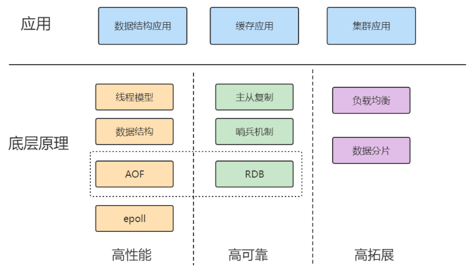

## 3.全局命令

### （1）keys 

`keys` 命令用于查找所有匹配给定模式的键。它通过通配符来筛选符合条件的键，如 `keys user:*` 会找到所有以 "user:" 为前缀的键。这个命令在大型数据库中使用需要小心，因为它可能会扫描数据库中的所有键，从而造成性能问题。

**示例**：

```plaintext
keys user:*
```

### （2）dbsize 

`dbsize` 命令用来返回当前数据库的键总数，可以快速了解数据库的规模。

**示例**：
```plaintext
dbsize
```

### （3）exists 

`exists` 命令用来检查一个或多个键是否存在。它返回存在键的数量，这是一种快速确认键存在与否的方法。

**示例**：

```plaintext
exists key1 key2 key3
```

### （4）persist 

`persist` 命令用于移除给定键的过期时间，使其成为一个持久键，不会因时间到期而被自动删除。

**示例**：
```plaintext
persist key1
```

### （5）type 

`type` 命令返回指定键存储值的数据类型，如字符串（string）、列表（list）、集合（set）等。

**示例**：

```plaintext
type key1
```

### （6）rename 

`rename` 命令用于将一个键重命名为另一个键名。如果新键名已经存在，它会被旧键值覆盖。

**示例**：
```plaintext
rename oldKey newKey
```

### （7）del 

`del` 命令用于删除一个或多个键及其关联的值。它返回被删除键的数量。

**示例**：
```plaintext
del key1 key2 key3
```

### （8）expire 

`expire` 命令设置键的过期时间，单位是秒。当键过期后，它会被自动从数据库中删除。

**示例**：
```plaintext
expire key1 300
```

### （9）pexpire 

`pexpire` 命令与 `expire` 类似，不过它设置的过期时间单位是毫秒。

**示例**：
```plaintext
pexpire key1 15000
```

### （10）pexpireat 

`pexpireat` 命令设置键在指定的Unix时间戳（毫秒）后过期。

**示例**：
```plaintext
pexpireat key1 1590165655000
```

### （11）ttl 查看键的过期时间

`ttl` 命令返回键的剩余生存时间（秒）。如果键未设置过期时间，返回 `-1`；如果键已过期，则返回 `-2`。

**示例**：

```plaintext
ttl key1
```

# 二、五大数据类型

## 1.字符串（String）

### （1）常用命令

#### ① set 
`set` 命令用于设置键的值。命令选项包括：
- `ex`：为键设置秒级过期时间
- `px`：为键设置毫秒级过期时间
- `nx`：只有键不存在时，才能设置成功
- `xx`：只有键存在时，才能设置成功，用于更新键的值

**示例**：
```plaintext
set key1 value ex 10 nx
set key2 value px 5000 xx
```

#### ② setex
`setex` 命令用于设置键的值，并为键设置秒级过期时间，其作用等同于 `set` 命令的 `ex` 选项。

**示例**：
```plaintext
setex key3 60 value3
```

#### ③ setnx
`setnx` 命令用于设置键的值，只有键不存在时，才能设置成功，其作用等同于 `set` 命令的 `nx` 选项。

**示例**：
```plaintext
setnx key4 value4
```

#### ④ get
`get` 命令用于获取键的值。如果键不存在，则返回 `nil`。

**示例**：
```plaintext
get key1
```

#### ⑤ mset
`mset` 命令用于同时设置一个或多个键值对。

**示例**：
```plaintext
mset key1 value1 key2 value2 key3 value3
```

#### ⑥ mget
`mget` 命令用于同时获取一个或多个键的值。

**示例**：
```plaintext
mget key1 key2 key3
```

#### ⑦ getset
`getset` 命令用于设置键的值，并返回键的旧值。

**示例**：
```plaintext
getset key1 newValue
```

#### ⑧ incr
`incr` 命令用于将键的整数值增加1。如果键不存在，它会被设置为0然后执行增加操作。如果键的值不是整数，执行命令时会报错。

**示例**：

```plaintext
incr keyCount
```

#### ⑨ incrby
`incrby` 命令用于将键的整数值增加指定的量。

**示例**：
```plaintext
incrby keyCount 10
```

#### ⑩ decr
`decr` 命令用于将键的整数值减少1。如果键不存在，它会被设置为0然后执行减少操作。如果键的值不是整数，执行命令时会报错。

**示例**：
```plaintext
decr keyCount
```

#### ⑪ decrby
`decrby` 命令用于将键的整数值减少指定的量。

**示例**：
```plaintext
decrby keyCount 5
```

#### ⑫ incrbyfloat
`incrbyfloat` 命令用于将键的浮点数值增加指定的量。

**示例**：
```plaintext
incrbyfloat keyAmount 3.5
```

#### ⑬ append
`append` 命令用于在键的现有值后面追加给定的值。如果键不存在，它会被创建并赋空字符串，然后执行追加操作。

**示例**：
```plaintext
append key1 "ExtraData"
```

#### ⑭ strlen
`strlen` 命令用于返回键的值的长度。如果键不存在，则返回0。

**示例**：
```plaintext
strlen key1
```

#### ⑮ setrange
`setrange` 命令用于设置键值中从指定偏移开始的部分，替换成给定字符串。如果键原本不存在，它先被初始化为一个长度等于偏移的空字符串，然后进行设置。

**示例**：
```plaintext
setrange key1 6 "World"
```

#### ⑯ getrange
`getrange` 命令用于获取键值的子字符串，从指定的开始偏移到结束偏移（包含）。偏移量可以是负数，表示从字符串末尾开始计算。

**示例**：
```plaintext
getrange key1 0 -1
```

### （2）性能分析

大多数字符串命令如 `set`、`get`、`incr` 等操作具有 O(1) 的时间复杂度，因为它们可以直接通过键快速访问或修改数据，速度非常快。

命令如 `del`、`mset`、`mget` 支持多键的批量操作，这些命令的时间复杂度为 O(n)，即与操作的键的数量成线性关系。

`getrange` 命令的时间复杂度与操作的字符串的长度相关，也是 O(n)，因为需要遍历字符串的部分或全部以执行操作。

## 2.哈希

### （1）常用命令

#### ① hset
`hset` 命令用于在哈希表中设置字段和值。

**示例**：
```plaintext
hset myhash field1 "Hello"
```

#### ② hsetnx
`hsetnx` 命令用于只在哈希表的指定字段不存在时，设置该字段的值。

**示例**：
```plaintext
hsetnx myhash field1 "World"
```

#### ③ hget
`hget` 命令用于获取哈希表中指定字段的值。

**示例**：
```plaintext
hget myhash field1
```

#### ④ hdel
`hdel` 命令用于删除哈希表中的一个或多个字段，返回删除字段的数量。

**示例**：
```plaintext
hdel myhash field1 field2
```

#### ⑤ hlen
`hlen` 命令用于获取哈希表中字段的数量。

**示例**：
```plaintext
hlen myhash
```

#### ⑥ hmset
`hmset` 命令用于同时设置哈希表中多个字段的值。

**示例**：
```plaintext
hmset myhash field1 "Hello" field2 "World"
```

#### ⑦ hmget
`hmget` 命令用于同时获取哈希表中多个字段的值。

**示例**：
```plaintext
hmget myhash field1 field2
```

#### ⑧ hexists
`hexists` 命令用于判断哈希表中一个字段是否存在。

**示例**：
```plaintext
hexists myhash field1
```

#### ⑨ hkeys
`hkeys` 命令用于获取哈希表中所有字段名。

**示例**：
```plaintext
hkeys myhash
```

#### ⑩ hvals
`hvals` 命令用于获取哈希表中所有值。

**示例**：
```plaintext
hvals myhash
```

#### ⑪ hgetall
`hgetall` 命令用于获取哈希表中所有字段和值。

**示例**：
```plaintext
hgetall myhash
```

#### ⑫ hincrby
`hincrby` 命令用于对哈希表中的字段值执行增加操作。

**示例**：
```plaintext
hincrby myhash field1 2
```

#### ⑬ hstrlen
`hstrlen` 命令用于获取哈希表中某个字段值的长度。

**示例**：
```plaintext
hstrlen myhash field1
```

### （2）性能分析

`hdel`, `hmget`, `hmset` 这些命令的时间复杂度与它们操作的字段数 (`k`) 直接相关，表现为 `O(k)`。这意味着操作的成本随着字段数量的增加而线性增长。`hkeys`, `hgetall`, `hvals` 这些命令的时间复杂度与哈希表中存储的字段总数 (`N`) 相关，表现为 `O(N)`。当字段数量非常多时，这些命令可能会导致性能问题。其他哈希命令如 `hget`, `hset`, `hexists` 等，通常具有 `O(1)` 的时间复杂度，表明它们的执行时间是常数级别的，与字段数无关。

使用 `hgetall` 命令时需谨慎，尤其是在哈希表元素众多时。该命令可以一次性返回所有字段及其值，但如果元素数量庞大，可能会导致 Redis 服务的短暂阻塞。如果不需要获取所有字段和值，推荐使用 `hmget` 来获取特定几个字段的值，这样可以明显减少数据处理量和提高效率。

在必须要遍历大量数据的场景下，建议使用 `hscan` 命令。`hscan` 提供了一种遍历哈希键中所有字段的方式，同时避免了一次性加载大量数据带来的风险。`hscan` 是一个渐进式迭代器，不会阻塞服务器，适用于处理大数据集。

## 3. 列表


### （1）常用命令

#### ① lpush
`lpush` 命令用于将一个或多个值插入到列表的左端。

**示例**：
```plaintext
lpush mylist a b c d  # 结果: d->c->b->a
```

#### ② rpush
`rpush` 命令用于将一个或多个值插入到列表的右端。

**示例**：
```plaintext
rpush mylist a b c d  # 结果: a->b->c->d
```

#### ③ linsert
`linsert` 命令用于在列表的指定元素前或后插入新元素。

**示例**：
```plaintext
linsert mylist BEFORE "b" "x"  # 在b之前插入x
linsert mylist AFTER "b" "y"   # 在b之后插入y
```

#### ④ lpop
`lpop` 命令用于从列表的左端弹出（删除）第一个元素，并返回该元素。

**示例**：
```plaintext
lpop mylist
```

#### ⑤ rpop
`rpop` 命令用于从列表的右端弹出（删除）最后一个元素，并返回该元素。

**示例**：
```plaintext
rpop mylist
```

#### ⑥ lrem
`lrem` 命令用于删除列表中与参数相等的元素。

**示例**：
```plaintext
lrem mylist 1 "c"  # 从左到右删除第一个"c"
```

#### ⑦ ltrim
`ltrim` 命令用于截取列表中一定范围的元素，其他元素将被删除。

**示例**：
```plaintext
ltrim mylist 0 1  # 保留列表中第0到第1个元素
```

#### ⑧ lset
`lset` 命令用于修改列表中指定位置的元素值。

**示例**：
```plaintext
lset mylist 0 "newvalue"
```

#### ⑨ lindex
`lindex` 命令用于获取列表中指定位置的元素。

**示例**：
```plaintext
lindex mylist 2
```

#### ⑩ lrange
`lrange` 命令用于获取列表中指定范围的元素序列。

**示例**：
```plaintext
lrange mylist 0 -1  # 获取列表中所有元素
```

#### ⑪ llen
`llen` 命令用于获取列表的长度。

**示例**：
```plaintext
llen mylist
```

#### ⑫ blpop
`blpop` 命令用于阻塞式地从列表的左端弹出元素。如果列表为空，可以设置超时时间等待元素。

**示例**：
```plaintext
blpop mylist 30  # 等待30秒
```

#### ⑬ brpop
`brpop` 命令与 `blpop` 类似，但操作是在列表的右端进行。

**示例**：
```plaintext
brpop mylist 30  # 等待30秒
```

### （2）性能分析

## 4.集合


### （1）常用命令

#### ① sadd
`sadd` 命令用于向集合添加一个或多个元素。如果元素已存在，不会重复添加。

**示例**：
```plaintext
sadd myset "element1" "element2" "element3"
```

#### ② srem
`srem` 命令用于从集合中删除一个或多个指定元素，返回成功删除的元素个数。

**示例**：
```plaintext
srem myset "element1" "element2"
```

#### ③ scard
`scard` 命令用于获取集合中元素的数量。

**示例**：
```plaintext
scard myset
```

#### ④ sismember
`sismember` 命令用于判断指定元素是否为集合的成员。

**示例**：
```plaintext
sismember myset "element1"
```

#### ⑤ srandmember
`srandmember` 命令用于随机返回集合中的指定数量的元素。

**示例**：
```plaintext
srandmember myset 2
```

#### ⑥ spop
`spop` 命令用于随机弹出集合中的指定数量的元素，并从集合中删除这些元素。

**示例**：
```plaintext
spop myset 1
```

#### ⑦ smembers
`smembers` 命令用于获取集合中的所有元素，但不会修改集合内容。

**示例**：
```plaintext
smembers myset
```

#### ⑧ sinter
`sinter` 命令用于计算多个集合的交集。

**示例**：
```plaintext
sinter set1 set2
```

#### ⑨ suinon
`suinon` 命令用于计算多个集合的并集。

**示例**：
```plaintext
suinon set1 set2 set3
```

#### ⑩ sdiff
`sdiff` 命令用于计算多个集合的差集，即第一个集合与其他集合的差异。

**示例**：
```plaintext
sdiff set1 set2
```

#### ⑪ sinterstore
`sinterstore` 命令用于计算多个集合的交集，并将结果保存到指定的集合中。

**示例**：
```plaintext
sinterstore destination set1 set2
```

#### ⑫ suionstore
`suionstore` 命令用于计算多个集合的并集，并将结果保存到指定的集合中。

**示例**：
```plaintext
suionstore destination set1 set2 set3
```

#### ⑬ sdiffstore
`sdiffstore` 命令用于计算多个集合的差集，并将结果保存到指定的集合中。

**示例**：
```plaintext
sdiffstore destination set1 set2
```

### （2）性能分析

## 5.有序集合

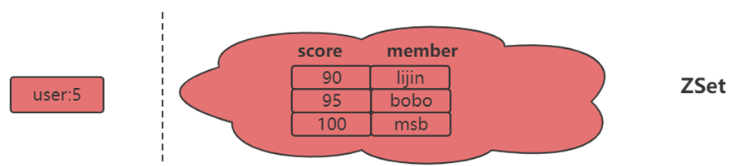

### （1）常用命令

#### ① zadd
`zadd` 命令用于向有序集合添加成员，其中成员的分数用于排序。可选参数如 `nx`、`xx`、`ch`、`incr` 调整添加行为。

- `nx`：成员必须不存在，才可以设置成功，用于添加新成员。
- `xx`：成员必须存在，才可以设置成功，用于更新已有成员的分数。
- `ch`：返回此次操作后，有序集合元素和分数发生变化的成员数。
- `incr`：对分数进行增加，用于增加已有成员的分数。

**示例**：
```plaintext
zadd myzset nx 1 "member1"
zadd myzset xx ch incr 5 "member1"
```

#### ② zcard
`zcard` 命令用于计算有序集合的成员个数。

**示例**：
```plaintext
zcard myzset
```

#### ③ zscore
`zscore` 命令用于获取有序集合中某个成员的分数。

**示例**：
```plaintext
zscore myzset "member1"
```

#### ④ zrank
`zrank` 命令用于计算有序集合中某个成员的排名（分数从低到高）。

**示例**：
```plaintext
zrank myzset "member1"
```

#### ⑤ zrevrank
`zrevrank` 命令用于计算有序集合中某个成员的排名（分数从高到低）。

**示例**：
```plaintext
zrevrank myzset "member1"
```

#### ⑥ zrem
`zrem` 命令用于从有序集合中删除一个或多个成员，返回成功删除的成员个数。

**示例**：
```plaintext
zrem myzset "member1" "member2"
```

#### ⑦ zrange
`zrange` 命令用于返回有序集合中指定排名范围的成员（分数从低到高），可选择是否返回分数。

**示例**：
```plaintext
zrange myzset 0 -1 withscores
```

#### ⑧ zrevrange
`zrevrange` 命令与 `zrange` 类似，但返回的成员排名是从高到低。

**示例**：
```plaintext
zrevrange myzset 0 -1 withscores
```

#### ⑨ zrangebyscore
`zrangebyscore` 命令用于返回有序集合中指定分数范围的成员，支持开闭区间。

**示例**：
```plaintext
zrangebyscore myzset (1 5 withscores
```

#### ⑩ zcount
`zcount` 命令用于返回有序集合中指定分数范围内的成员个数。

**示例**：
```plaintext
zcount myzset 1 5
```

#### ⑪ zremrangebyrank
`zremrangebyrank` 命令用于删除有序集合中指定排名范围内的成员。

**示例**：
```plaintext
zremrangebyrank myzset 0 1
```

#### ⑫ zremrangebyscore
`zremrangebyscore` 命令用于删除有序集合中指定分数范围内的成员。

**示例**：
```plaintext
zremrangebyscore myzset 1 3
```

#### ⑬ zinterstore
`zinterstore` 命令用于计算多个有序集合的交集，并将结果存储在新的集合中。

**示例**：
```plaintext
zinterstore out 2 myzset1 myzset2
```

#### ⑭ zunionstore
`zunionstore` 命令用于计算多个有序集合的并集，并将结果存储在新的集合中。

**示例**：

```plaintext
zunionstore out 2 myzset1 myzset2
```

### （2）性能分析

## 6.底层数据结构

底层数据结构一共有 7 种，分别是简单动态字符串、双向链表、压缩列表、哈希表、跳表和整数数组、快速列表。它们和数据类型的对应关系如下图所示：

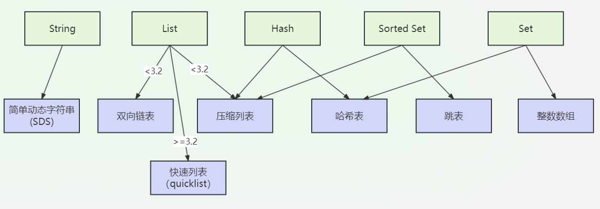

### （1）简单动态字符串

Redis 使用简单动态字符串（SDS）作为其字符串类型的底层数据结构，提供了多种优点相较于传统的 C 字符串。

SDS 的==结构==包括三个部分：

- **len**: 当前字符串实际占用的长度，不包括终止符。
- **alloc**: 字符串分配的总内存长度，包括终止符。
- **buf**: 字节数组，用于存放字符串内容，以空字符 `\0` 结尾，保证与 C 字符串的兼容性。

以下是关于 SDS 的一些关键特点：

- **支持二进制安全**：SDS 可以存储任何形式的二进制数据，包括图片、音频、视频和任何其他非文本数据。这是因为 SDS 使用 `len` 属性来标记字符串的结束，而不是依赖于空字符 '\0'。
- **常数时间复杂度获取长度**：SDS 结构中包含了一个 `len` 属性，即时记录字符串的长度。因此，获取字符串长度的操作是常数时间复杂度 \(O(1)\)，与字符串的实际长度无关。
- **空间预分配**：为了优化内存使用和减少重新分配的次数，SDS 在执行操作需要扩展内存时会预分配额外的未使用空间。
- **惰性空间释放**：在缩减字符串时不立即释放内存。

### （2）压缩列表

压缩列表是一个紧凑的数组，它能以高内存效率存储一系列元素。每个元素可以是字符串或整数，存储方式优化以减少所需空间。

ziplist的结构如下：

压缩列表的表头包括三个字段：

- **zlbytes**：记录整个压缩列表占用的内存字节数，使得整个列表的大小可以在 O(1) 的时间复杂度内被获取。
- **zltail**：记录到压缩列表最后一个元素的偏移量，可以在 O(1) 的时间复杂度内访问最后一个元素。
- **zllen**：记录列表中元素的数量。如果元素的数量小于 65535，这个值是准确的；如果元素数量超过 65535，则需要遍历整个列表来计算元素数量。

压缩列表的末尾有一个特殊字段 **zlend**，固定为 0xFF，标记列表的结束。

压缩列表中的每个节点包含以下部分：

- **prevlen**：记录前一个节点的长度。如果前一个节点的长度小于 254 字节，则 `prevlen` 占用 1 个字节；如果长度大于等于 254 字节，则 `prevlen` 占用 5 个字节（第一个字节设置为 0xFE，后四个字节存储前一个节点的实际长度）。
- **encoding**：记录当前节点的数据类型以及长度。编码方式可以直接表示一个小整数，或者存储字符串的长度等信息。
- **data**：根据 `encoding` 字段的定义，存储实际的数据。数据可以是整数或者二进制安全的字符串。

压缩列表非常适合存储数量较少且不经常改变的元素，因为每次修改可能需要重新分配内存并复制现有数据。

### （3）快速列表

快速列表（QuickList）是 Redis 用来优化列表数据结构的存储方式。在 Redis 中，快速列表是用来存储列表类型键的默认内部数据结构，它结合了双向链表和压缩列表（ziplist）的优点，旨在提供空间效率和插入/删除操作的性能优化。

==快速列表的外层结构是一个双向链表，每个链表节点称为一个“快速列表节点”（quicklist node）。==这使得快速列表能够从两端高效地添加或移除元素，同时也支持从两端进行高效的遍历。

每个快速列表节点内部包含一个压缩列表（ziplist），用于存储实际的元素数据。压缩列表是一个紧凑的数据结构，能够连续地存储多个元素。每个元素可以是小整数或较短的字符串，这种存储方式显著减少了内存的使用。快速列表在 Redis 中主要用于实现列表键，特别是当列表操作主要集中在两端时（如 LPush/RPush、LPop/RPop），它提供了优异的性能。此外，快速列表还非常适合实现发布订阅、撤销操作的历史记录等功能。

### （4）跳表

跳表（Skip List）是一种数据结构，它允许快速查询、插入、删除和访问数据元素。在许多方面，跳表与平衡树（如AVL树和红黑树）相似，提供了对数级的查找时间复杂度，但在实现上比这些树结构简单得多。Redis 使用跳表来实现有序集合数据类型，这是因为跳表在处理有序数据时具有高效的插入、删除和搜索性能，同时还可以快速访问有序序列中的元素。

跳表是一个多层结构的链表，==基本思想是通过维护多个指向其它元素的指针来提高链表的查找效率==。一个典型的跳表结构包括多个层次，每一层都是一个链表，用于存储元素：

- **底层**（Level 0）包含链表中的所有元素。
- **上层**（Level 1以上）作为快速通道，包含指向下一元素的指针，跳过中间的一些元素，使得查找效率提高。

==在跳表中查找元素的操作从最高层开始，沿着链表前进，如果发现下一个元素大于查找的元素，则下降到下一层继续查找，直到到达底层。这种层层下降的过程使得跳表的查找操作的平均时间复杂度为 \(O(\log n)\)。==

Redis中的有序集合（ZSET）就是使用跳表来实现的，因为它需要快速的插入、删除和查找操作，以及按照分数顺序和/或字典顺序进行元素访问。

## 7.类型应用选择

### （1） String

- **常规用途**：存储文本或二进制数据，如用户的邮箱、密码的哈希值、或任何其他形式的字符串数据。
- **缓存**：存储网页、数据库查询结果、图片或其他经常被请求的大对象。
- **计数器**：使用Redis的自增（INCR）和自减（DECR）操作来管理计数器，如网站访问次数、下载次数等。
- **共享会话**：在多个服务器之间共享用户会话信息。

### （2）Hash

- **对象表示**：存储对象（如用户的各种属性）的最佳选择，每个字段名和值对应对象的属性名和属性值。
- **配置存储**：存储和检索应用配置项，比如可以通过键来访问的各种设置。
- **数据分组**：将相关数据分组存储，如存储一个用户的多个属性或关系，方便统一处理。

### （3）List

- **消息队列**：利用列表的LPUSH操作和RPOP操作，可以实现简单的消息队列服务。
- **活动记录**：记录用户的最新操作或状态变更历史，新事件可以从头部插入，旧事件从尾部删除。
- **堆栈/队列**：利用LPUSH/RPUSH和LPOP/RPOP，List可以作为堆栈（后进先出）或队列（先进先出）使用。

### （4）Set

- **唯一性管理**：保证存储数据的唯一性，例如电子邮件列表、用户ID列表等。
- **集合运算**：非常适合需要进行交集、并集、差集等操作的场景，如实现社交应用中的共同好友功能。
- **访问控制**：用于存储和管理有访问权限的用户ID集合。

### （5）Sorted Set

- **排行榜**：适用于需要按顺序访问元素的场景，如游戏得分板、用户等级排名等。
- **带权重的队列**：每个元素都可以附加一个分数，便于实现优先队列，如根据用户的某些行为或属性动态调整其优先级。
- **时间序列数据**：可以用分数表示时间戳，存储时间相关的数据，如用户的行为日志。

# 三、高级数据类型

## 1.Bitmap

### （1）概述

Redis中的==Bitmap数据类型是一种灵活且空间效率高的方法来存储布尔值==。每个位（bit）可以独立设置为0或1，允许你以极低的空间成本处理大量的布尔标志。

**常用命令**

- `SETBIT`：设置位的值（0或1）。
- `GETBIT`：获取位的值。
- `BITCOUNT`：计算给定字符串中，被设置为1的位的数量。
- `BITOP`：对一个或多个Bitmap进行AND、OR、XOR和NOT运算。

Bitmaps 在 Redis 中实际上并没有专门的数据类型，而是通过字符串类型来实现的。这意味着 Bitmaps 是以字节数组的形式存储的，每个字节包含8个位。

- 每个字节由8个位组成，这些位可以独立设置为0或1。
- 字节是连续存储的，因此一个Bitmap实质上是一个字节序列。

由于底层使用的是字节操作，Redis可以利用位运算来快速处理Bitmap中的数据，例如位与（AND）、位或（OR）、位异或（XOR）等。

==Bitmap有内存溢出的问题==，如果在 Bitmap 中设置了非常远的位（例如，位索引非常高的位置），Redis 需要为从0到该位之间的所有字节分配空间，即使这些字节中的许多位并未实际使用。这可能导致内存的浪费。

### （2）应用

**用户行为追踪**：可以用Bitmap来追踪用户是否进行了某项活动，如是否登录、是否点击了一个特定的广告等。

**统计活跃用户**：通过设置特定日期的用户活跃位，可以快速统计任何日期范围内的活跃用户数。

**实时数据分析**：使用Bitmap进行实时数据分析，如实时计算用户的特定行为的发生次数。

**集合操作**：利用Bitmap实现集合的基本操作，如并集、交集和差集，这对于处理大规模数据集合特别有用。

## 2.布隆过滤器

### （1）概述

布隆过滤器（Bloom Filter）是一种空间效率极高的概率性数据结构，用于测试一个元素是否属于一个集合。它能够告诉你一个元素绝对不在集合中或可能在集合中。布隆过滤器的核心优势在于它需要的空间远少于其他数据结构，但这种效率是以一定的错误概率为代价的。

### （2）==原理==

布隆过滤器使用多个哈希函数将每个数据元素映射到一个大的位数组中的多个位置，并将这些位置置为1。查询时，同样通过这些哈希函数计算位置：

- 如果所有这些位置的位都是1，元素可能存在。

- 如果任一位置的位是0，元素肯定不存在。

  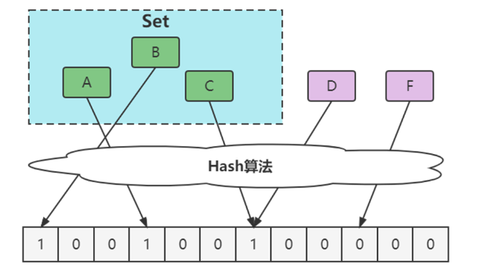

布隆过滤器可能会出现假阳性（false positives），即误判元素存在于集合中，本质是哈希冲突，但不会有假阴性（false negatives），即如果它说元素不在集合里，那么这个元素绝对不在集合中。

### （2）==缓存穿透==

缓存穿透是指查询不存在于缓存中的数据，导致请求直接到达数据库层，如果大量这种请求发生，会对数据库造成极大压力。

布隆过滤器可以有效避免缓存穿透的问题。

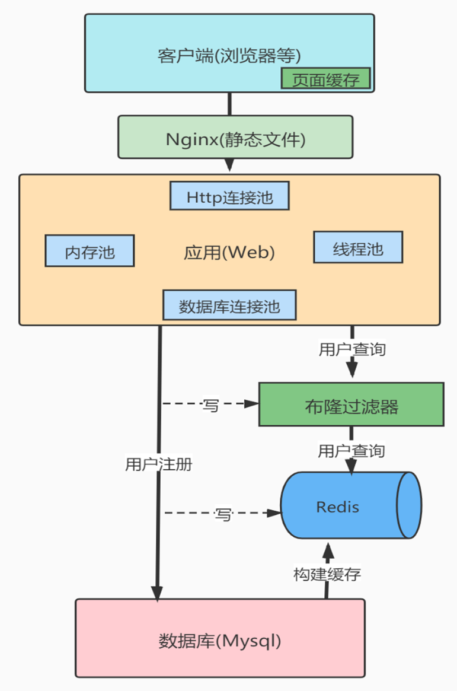

1. **初始化布隆过滤器**：将所有可能查询的数据元素提前加载到布隆过滤器中。
2. 请求检查：当一个查询请求到来时，先通过布隆过滤器检查该数据是否可能存在于缓存中。
   - 如果布隆过滤器判断数据绝对不存在，则可以直接返回结果，不必查询数据库或缓存。
   - 如果布隆过滤器认为数据可能存在，请求会继续查找缓存，如果缓存未命中，再去数据库查询数据。

当然，也可以在服务层添加缓存，以及参数校验机制。

## 3.HyperLogLog

### （1）概述

HyperLogLog 是一种用于基数估计算法的数据结构，它可以用非常小的空间来估算非常大的数据集中的不重复元素的数量（即基数）。HyperLogLog 在 Redis 中被广泛使用，尤其是在需要处理大量数据并且能容忍一定误差（0.81%）的场景中非常有用。

**常用命令**

- **PFADD**：将一个或多个元素添加到 HyperLogLog 中。
- **PFCOUNT**：返回给定 HyperLogLog 的近似基数，即估算的不重复元素数量。
- **PFMERGE**：合并多个 HyperLogLog 对象为一个 HyperLogLog，合并后的 HyperLogLog 的基数估计等于单独估算这些 HyperLogLog 后合并的基数估计。

### （2）原理

### （3）==UV==

在大数据和网络分析领域，UV（Unique Visitors，唯一访问者）是一个核心指标，用于衡量不同用户对网站或应用的访问情况。HyperLogLog (HLL) 由于其高效的空间利用和快速的计算能力，特别适合用来估算UV。

一个大型新闻网站需要实时跟踪和报告每天的唯一访问者数量。该网站的流量非常大，传统的方法（如使用数据库进行完整数据存储和查询）可能不够高效或成本过高。

使用 Redis 的 HyperLogLog 结构来存储和估算每天的UV：
- 每当用户访问网站时，将其用户ID或者其他唯一标识符（如Cookie或IP地址的哈希值）添加到当日的 HyperLogLog 结构中。
- 通过 `PFADD` 命令将用户标识符添加到 HyperLogLog 中，并使用 `PFCOUNT` 命令在任何时候快速获取估算的UV数。

## 4.GEO

### （1）概述

Redis的GEO（地理位置）数据类型提供了存储地理位置信息并执行位置相关查询的功能。这一功能基于有序集合（sorted sets），其中地理位置数据（如经度和纬度）被编码为有序集合的分数。这使得Redis能够高效地执行诸如计算两点之间的距离、查找给定区域内的点等地理空间查询。

**常用命令**

- **GEOADD**：添加一个或多个地理空间位置到指定的key中。
- **GEODIST**：计算两个给定位置之间的距离。
- **GEORADIUS** 和 **GEORADIUSBYMEMBER**：根据给定的经纬度或已知的成员位置，查找指定半径内的所有地点。
- **GEOHASH**：返回一个或多个位置元素的Geohash表示。

### （2）原理

# 四、高级特性

## 1.发布与订阅

发布与订阅模式是一种消息通信模式，其中发布者（publisher）发送消息而不是直接将消息发送给特定的接收者。订阅者（subscriber）可以订阅一个或多个频道，从而接收发布者发送到这些频道的消息。这种模式在构建松耦合的实时消息系统中非常有用，如聊天室、实时广播通知等。

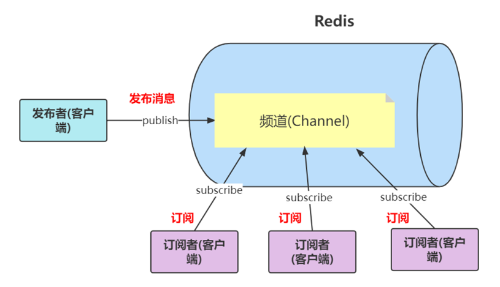

## 2.Stream

Redis Streams 是Redis的一种数据类型，用于表示消息流。这是为了处理数据流和实现复杂的消息队列任务而设计的。Streams 提供了多种特性，包括持久化消息、消息排序以及读取和消费的灵活性。这使得Redis Streams非常适合构建如日志收集、事件驱动的微服务架构、实时消息系统等应用。

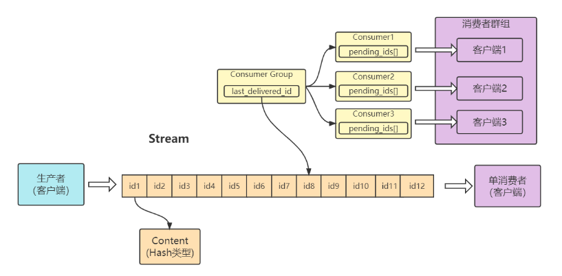

## 3.全局哈希表

为了实现从键到值的快速访问，Redis 使用了一个哈希表来保存所有键值对。一个哈希表，其实就是一个数组，数组的每个元素称为一个哈希桶。

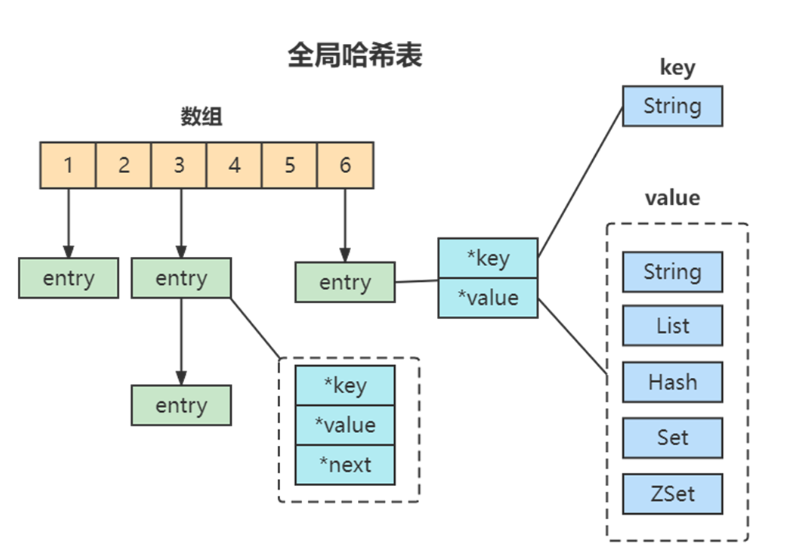

## 4.渐进式refresh

在Redis中，当哈希表的元素太多（即接近装载因子的极限时），或者哈希表太空（即元素太少时），Redis会进行rehash操作，将哈希表转移到一个更大或更小的空间中。渐进式rehash是一种优化技术，使得这一过程不会一次性地发生，从而防止在大规模操作时发生长时间的延迟。这种方法逐渐地将旧哈希表中的键值对迁移到新表中，分散了计算成本，减轻了对性能的影响。

**渐进式Rehash的流程**

1. **初始化新哈希表**：初始化一个新的哈希表，其大小通常是当前哈希表的两倍或一半。
2. **渐进式数据迁移**：Redis将原有哈希表中的数据分批次迁移到新哈希表中。这一过程通常在执行新的插入、删除或查找操作时并行进行。
3. **双哈希表操作**：Redis会同时维护旧的哈希表和新的哈希表。查找操作需要在两个哈希表中进行，以确保可以访问到所有的数据。
4. **完成迁移**：当所有键值对都从旧的哈希表迁移到新的哈希表后，旧的哈希表将被释放，新的哈希表接管所有操作。

## 5.慢查询

慢查询日志是Redis用来监控和记录查询执行时间超过预设阈值的查询请求。这使得开发者能够识别出哪些命令或脚本导致处理延迟，是性能调优的重要工具。通过配置`slowlog-log-slower-than`和`slowlog-max-len`参数，可以控制慢查询日志的行为，例如设定时间阈值和日志的大小。

## 6.Pipeline

Pipeline 是一种技术，允许客户端一次性发送多个命令到服务器，而无需等待每个命令的回复。这减少了网络往返时间（RTT），提高了命令执行的效率。Pipeline 非常适合于批量操作，例如批量插入或更新数据。它可以显著提高数据处理的速度。

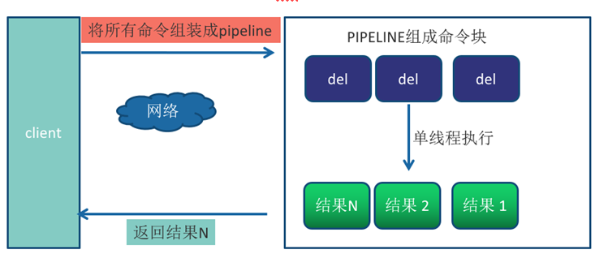

## 7.事务

Redis通过`MULTI`, `EXEC`, `WATCH`, 和 `DISCARD`命令提供了事务功能。事务允许将多个命令打包成一个原子性的执行块。这意味着事务内的所有命令要么全部执行，要么全部不执行。Redis的事务不是传统的ACID事务，但它确保按顺序执行，不会被其他命令打断。

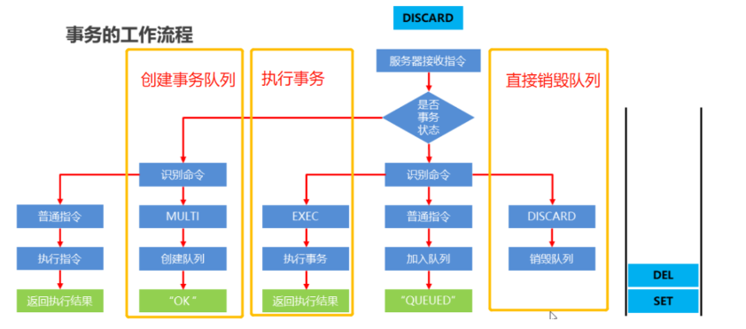

## 8.Lua

Redis支持使用Lua脚本来执行复杂的操作，这是一种嵌入式的脚本语言。通过Lua脚本，开发者可以在Redis服务器上直接运行代码，从而减少客户端和服务器之间的通信次数。Lua脚本在执行时是原子性的，这意味着在脚本执行期间不会插入其他客户端的命令。这允许开发者编写高复杂性的事务和操作，同时保持高性能和原子性。

# 五、持久化

Redis 提供了两种主要的数据持久化机制来确保在服务器停机的情况下不丢失数据：RDB（Redis Database）和 AOF（Append Only File）。这两种机制可以单独使用，也可以同时使用，以便结合它们各自的优势。

## 1.RDB

### （1）概述

==RDB 持久化会在指定的时间间隔内生成数据集的时间点快照。==

**优点**

- **紧凑的文件尺寸**：RDB 是一个压缩的二进制文件，是数据集的高效表示。
- **灾难恢复**：由于 RDB 文件是单一压缩文件，数据恢复快，非常适合灾难恢复。

**缺点**

- **数据损失**：如果 Redis 崩溃，你可能会丢失最后一次快照后的所有数据。
- **性能损耗**：`bgsave`需要`fork`创建子线程，存在性能开销。

RDB文件是一种二进制文件格式，用于存储特定时间点的Redis数据快照。

通过`redis.conf`配置文件中的`dir`和`dbfilename`指令来指定RDB文件的存储目录和文件名。默认文件名通常是`dump.rdb`。

```plaintext
dir /var/lib/redis
dbfilename dump.rdb
```

Redis使用LZF算法对RDB文件进行压缩，以减少存储空间的占用。这一点对于减少磁盘使用和加快数据传输非常有用。

**开启/关闭压缩**：

```bash
CONFIG SET rdbcompression yes
```

或者在`redis.conf`中设置：

```plaintext
rdbcompression yes
```

有时，RDB文件可能由于各种原因（如磁盘故障、非正常关闭Redis等）而损坏。这种情况下，Redis在尝试加载损坏的RDB文件时会拒绝启动，以防止损坏的数据影响到正常运行的数据库。

使用**redis-check-rdb**用于检查和修复RDB文件，并报告可能的错误。

```bash
redis-check-rdb /path/to/dump.rdb
```

### （2）触发时机

Redis提供了两种主要的命令来手动触发持久化操作，即`SAVE`和`BGSAVE`。

- `SAVE`：阻塞Redis的主线程来创建一个数据快照，即直接在主线程中执行持久化过程，将所有数据保存到硬盘上的一个RDB文件中。

- `BGSAVE`：启动一个子进程来创建数据快照，主线程继续处理客户端请求，从而避免了阻塞主线程。
- **异步操作**：`BGSAVE`是非阻塞性的，主线程在执行`BGSAVE`时仍然可以响应客户端请求。
  
- **资源消耗**：尽管`BGSAVE`避免了阻塞，但是子进程需要额外的内存来复制父进程的数据空间（写时复制技术）。在持久化过程中，可能会导致系统资源（如CPU和内存）的短暂高消耗。

除了手动执行，Redis 还可以配置自动触发`BGSAVE`。这是通过在配置文件中设置`save`指令来实现的。

```plaintext
save 900 1        # 900秒内至少有1个键被改变，则触发保存
save 300 10       # 300秒内至少有10个键被改变，则触发保存
save 60 10000     # 60秒内至少有10000个键被改变，则触发保存
```

这些配置指定了在给定的时间内，如果指定数量的键被修改，就自动执行`BGSAVE`。

### （3）==工作流程==

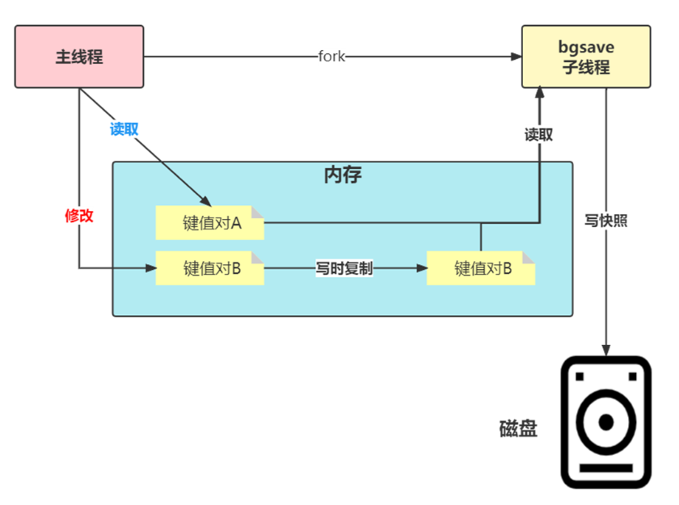


1. **创建子线程**：当执行`BGSAVE`命令时，Redis 主进程（父进程）会调用`fork()`创建一个子进程。这个子进程将负责将内存中的数据写入硬盘。
2. **COW**：`fork()`系统调用并不立即复制整个进程的内存空间，而是让父进程和子进程共享同一物理内存。只有当父进程或子进程尝试修改某些内存页时，操作系统才会真正地复制这个内存页，确保修改操作不会影响到另一进程。
3. **写入RDB**：子进程开始遍历Redis的整个数据集，将其序列化后写入一个临时的RDB文件中。一旦子进程完成了数据的读取和文件的写入，它会将临时的RDB文件替换旧的RDB文件。
4. **子进程退出**：数据写入完成后，子进程退出，父进程通过`waitpid()`系统调用回收子进程资源，以避免产生僵尸进程。
5. **替换旧文件**：

### （4）数据丢失

RDB 持久化机制通过创建数据集的快照来保存数据。如果 Redis 服务器在两次快照之间发生崩溃，自上次快照以来所有的数据更新都会丢失。

适当调整`bgsave`配置中的间隔时间和修改次数，可以减少数据丢失的风险，但会造成频繁持久化。

- 增加磁盘I/O操作，并且，多个持久化进程可能同时尝试访问磁盘资源，导致I/O带宽被过度占用，影响整体系统性能。
- `fork` 在创建子进程时会复制父进程的地址空间，尽管采用了写时复制技术，但`fork`操作本身还是会根据主线程的内存大小产生不同程度的CPU和内存开销，并且`fork` 过程中主线程会被短暂阻塞。

因此可以使用AOF以追加命令的方式记录数据修改，每秒同步一次，虽然可能引起一些延迟，但相较于RDB，它减少了数据丢失的风险并可以更频繁地进行数据同步而不必每次都进行全量写入。

## 2. AOF

### （1）概述

==AOF 持久化通过将所有写入命令追加到 AOF 文件的末尾来记录数据库状态。==

**优点**

- **数据安全**：可以配置为每秒同步一次，减少数据丢失的可能。
- **灵活性高**：提供了不同的同步频率设置，例如每次命令、每秒等。

**缺点**

- **文件大小**：AOF 文件的大小通常比 RDB 文件大，因为它存储了每个写操作命令。
- **性能开销**：仍然需要`fork`子线程，并且更加频繁。

### （2）触发时机

开启AOF功能需要下面配置，并且存储在AOF文件内，默认为`appendonly.aof`。

```conf
appendonly yes #默认不开启
appendfsync everysec #默认按秒
```

并且提供了多种==AOF缓冲区同步文件策略==，由参数appendfsync控制。

**always**：在这种模式下，每个写命令在被执行后立即同步到磁盘。这确保了即使在极端情况下，如突发的系统崩溃或断电，只要写命令返回给客户端，数据就绝对不会丢失。

**everysec**：写操作首先被写入操作系统的文件系统缓冲区。然后，Redis的后台进程每秒将这些缓冲区中的数据刷新到磁盘一次。

**no**：写操作被追加到内核的文件系统缓冲区中，具体的同步时间取决于操作系统的I/O调度策略和当前的系统负载。

### （3）AOF 重写

随着操作的累积，AOF 文件大小会不断增长，可能导致处理速度下降及存储资源的浪费。为了优化这一问题，Redis 实现了 AOF 重写机制，通过更紧凑的命令序列来减少文件体积。

- **手动触发**：可以通过执行 `BGREWRITEAOF` 命令来手动触发 AOF 重写。
- **自动触发**：
  - 根据配置的两个参数来自动触发：
    - `auto-aof-rewrite-percentage`：AOF 文件增长百分比。
    - `auto-aof-rewrite-min-size`：触发重写的最小文件大小。

重写机制如下：

- **数据过滤**：进程内已过期的数据不会被写入新的 AOF 文件。
- **命令优化**：多条冗余命令将合并为一条。例如，连续的 `set` 命令只保留最终的状态。
- **命令拆分**：对于包含大量元素的集合操作，为避免单个命令过大，会按元素数量拆分（如每64个元素一条命令）。

如果 AOF 文件损坏，Redis 将拒绝启动，以防止错误数据被加载。

使用 `redis-check-aof --fix` 命令对损坏的 AOF 文件进行修复。

`aof-load-truncated` 配置项用于处理可能因系统突然掉电而导致的 AOF 文件结尾不完整的情况。

### （4）==工作流程==

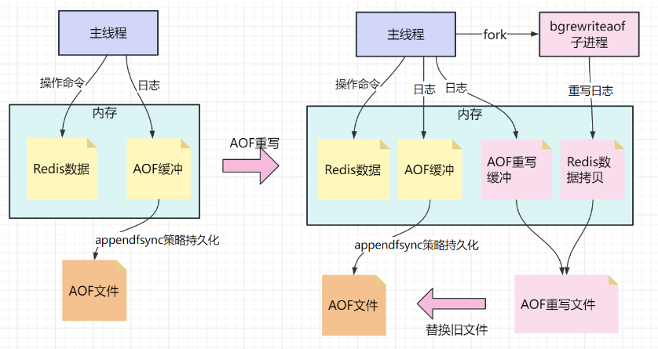


1. **创建子线程**：当 AOF 重写被触发，Redis 主进程将使用 `fork()` 创建一个子进程来执行 AOF 重写。这个过程利用操作系统的写时复制技术，允许子进程访问父进程的内存数据而不立即进行物理拷贝。
2. **AOF 重写缓冲区**：在 AOF 重写过程中，为了确保不丢失任何写命令，Redis 主进程额外维护AOF 重写缓冲区，重写期间所有新的写命令同时也会被写入这个缓冲区。
3. **子进程重写 AOF 文件**：子进程会读取主进程内存中的数据状态，并将这些数据转换为 Redis 命令，从而构建一个新的、优化的 AOF 文件。
4. **退出子线程**：一旦 AOF 重写完成，子进程会向父进程发送一个信号。此时，父进程会将 AOF 重写缓冲区中积累的所有写命令追加到新的 AOF 文件末尾，确保这些在重写过程中接收到的命令不会丢失。
5. **替换旧文件**：新的 AOF 文件准备就绪后，Redis 会将当前的 AOF 文件替换为新重写的文件。

## 3.==混合使用==

Redis 提供了混合持久化方式，即同时使用 RDB 和 AOF 进行数据持久化。在混合持久化中，Redis 会定期执行 RDB 快照持久化，将内存中的数据保存到磁盘上，同时也会将操作命令追加到 AOF 日志文件中。

通过 `aof-use-rdb-preamble`  配置项可以打开混合开关，yes则表示开启，no表示禁用，（7之前的版本默认是禁用的，Redis7默认的是开启），可通过config set修改

```
aof-use-rdb-preamble yes
```

借鉴了aof_rewrite的思路，就是RDB文件写完，再把重写缓冲区的数据，追加到RDB文件的末尾，追加的这部分数据的格式是AOF的命令格式，这就是rdb_aof的混用。

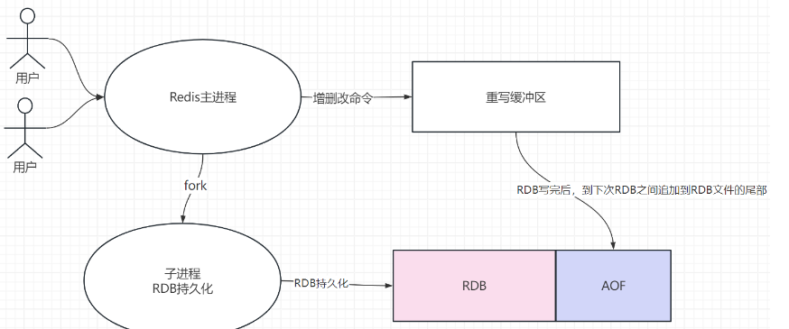

# 六、内存淘汰机制

## ==1.淘汰策略==

Redis是一个内存中的数据结构存储系统，设计用于快速读写操作。当内存使用超过配置的`maxmemory`限制时，为了维护性能并防止系统崩溃，Redis提供了几种内存淘汰策略。

- **Noeviction**：默认策略。在达到内存限制时，不会淘汰任何键，只是拒绝执行那些会增加内存使用的命令，比如`SET`, `LPUSH`等。
- **Volatile-lru (Least Recently Used)**：只淘汰那些设置了过期时间（TTL）的键，而且是最近最少使用的键。
- **Volatile-lfu**：
-  **Volatile-ttl**：淘汰那些；即将到期的、设置了TTL的键。
- **Volatile-random**：从设置了TTL的键中随机选取键进行淘汰。
- **Allkeys-lru**：从所有键中，选择最近最少使用的键进行淘汰，不论键是否设置了TTL。
- **Allkeys-lfu**：
-  **Allkeys-random**：从所有键中随机选择键进行淘汰。

**示例：**

```bash
# 设置最大内存限制
maxmemory 2gb
# 设置淘汰策略为所有键的LRU
maxmemory-policy allkeys-lru
```

## ==2.过期策略==

### （1）定期删除

定期删除策略是通过定时任务来检查并清除过期的键：
- **过期字典**：Redis内部维护了一个字典，专门用于存储所有设置了过期时间的键。这个字典将键和其对应的过期时间作为键值对存储。
- **扫描频率**：默认情况下，Redis每秒会进行十次过期扫描，这个频率可以通过修改Redis配置进行调整。
- **扫描算法**：每次扫描，Redis从过期字典中随机选取20个键进行检查，并清除其中已经过期的键。如果被检查的键中超过一定比例（25%）已经过期，则继续进行新一轮的随机扫描，这种贪心算法有助于快速减少过期键的数量，尤其是在键过期密集的情况下。

从库不会自己独立进行过期扫描，而是依赖主库的操作。当主库上的键过期并被删除时，相应的删除操作（DEL指令）会被同步到从库。

由于从库依赖主库的同步，可能会因为网络延迟或同步延迟导致主从数据不一致，即主库的数据已经删除，而从库可能还保留这些数据。

### （2）惰性删除

惰性删除策略是指仅在键被访问时才检查其是否已过期，当客户端尝试访问一个键时，Redis会检查该键是否已过期。如果键已经过期，Redis将不会返回任何数据给客户端，并立即从数据库中删除该键。

惰性删除是对定期删除的补充，确保那些定期删除漏网之鱼的过期键在被访问时能被清除。

通过结合定期删除和惰性删除，Redis能够有效地管理内存，同时避免了单一策略可能带来的性能问题。这种双重策略确保了Redis在保持高性能的同时，也能及时释放不再需要的资源。

## 3.底层实现

### ==（1）LRU 算法==

LRU算法是一种常见的淘汰策略，它帮助系统保持活跃数据的高速访问，同时淘汰那些长时间未被访问的数据。Redis采用了一种近似的LRU算法，使得内存管理既有效又节省资源。

传统的LRU算法使用一个字典来存储键值对，同时维护一个双向链表来记录访问顺序：
- **访问数据**：每当数据被访问时，如果数据存在于缓存中，它会被移动到链表的头部。
- **淘汰数据**：如果需要在缓存中加入新的数据，而缓存已满，链表尾部的数据（最久未被访问的数据）会被移除。

由于维护一个完整的双向链表对于内存和性能都是一种负担，Redis选择了实现一种近似的LRU算法，既节省资源又能达到类似的效果。

每个键对象都有一个24位的时间戳字段，记录了这个键最后一次被访问的时间。这个时间戳是以分钟为单位的，因此它不需要实时更新，同时也减少了内存使用。

当需要进行内存淘汰时，Redis并不是查看所有键的时间戳来决定哪个键是最久未被访问的。相反，它执行一种随机抽样策略。

- **随机抽样**：Redis会随机选择一定数量的键（由`maxmemory-samples`配置决定，默认是5），检查这些键的时间戳，然后淘汰其中最旧的键。
- **重复过程**：如果一次抽样后内存仍超出限制，Redis将重复抽样过程，直到内存使用降到设定的阈值以下。

通过采用这种近似的LRU算法，Redis能够在保持操作效率的同时，适当地管理内存使用，避免因为频繁的全盘扫描而导致性能下降。

### ==（2）LFU算法==

LFU （Least Frequently Used）策略是基于数据项的访问频次来进行淘汰决策，理论上能更准确地反映数据的热度。

如果数据在过去被频繁访问，那么它在未来也可能被频繁访问。因此，该策略会优先淘汰那些访问频次较低的数据项。

原先为每个键对象保留的 24 位空间被划分为两部分：

- **ldt（16位）**：存储上一次 `logc` 更新时间的时间戳对2^16取模。
  - 取模存储更多的时间戳，但精度不高，分钟级别的。
  - 在 Redis 进行淘汰检查时，如果当前时间与 `ldt` 存储的时间戳相比长时间未更新，则 `logc` 会被适当衰减，反映较长时间未访问的事实。衰减过程帮助 LFU 算法把那些曾经热门但当前不再热门的键淘汰出去。
  
- **logc（8位）**：存储访问频次的对数值。

  - `logc` 字段并不直接存储访问次数，而是存储其对数值。这样做的目的是为了防止计数器过快溢出，并能够在有限的空间内存储更大范围的访问频次。

  - 新键的 `logc` 初始化为一个默认值（如 5），这样新键不会因为刚创建就立即被淘汰。

每当内存达到 `maxmemory` 设置时，Redis 会触发淘汰逻辑。这个过程包括：
- **随机抽样**：随机选择一定数量的键。
- **更新热度**：对这些键的 `ldt` 和 `logc` 进行更新和衰减。
- **淘汰决策**：基于更新后的 `logc` 值，淘汰 "热度" 最低的键。

LFU 是一个高效的淘汰策略，尤其适用于需要维持热数据在内存中的场景。通过智能地使用计数器和时间戳，以及对数据访问热度的动态跟踪，Redis 的 LFU 策略能够在保持操作效率的同时，优化内存使用，减少不必要的数据淘汰。

## ==4.内存碎片==

### （1）产生的原因

内存碎片主要是由于内存分配和释放的非连续性造成的。在Redis的使用过程中，因为频繁的数据存储和删除操作，会导致内存中出现很多小的、不连续的空闲区域，这就是所谓的内存碎片。

- **固定大小分配**：内存分配器通常以固定大小的块分配内存给应用程序，这样做可以提高内存分配的效率。但是，当应用程序请求的内存大小不恰好等于这些固定大小的任何一个时，就会导致一部分内存块未被完全使用，形成内存碎片。

- **动态数据结构**：Redis使用的数据结构如列表、集合、哈希表等都是动态的，会随着操作的进行而频繁改变大小，这种大小的变化也会导致内存碎片的产生。

使用`info memory`命令可以查看内存的使用情况，包括内存碎片率。

- **mem_fragmentation_ratio**：这是一个重要的指标，它表示的是`used_memory_rss`与`used_memory`的比例。如果这个比例大于1，那么就表示有内存碎片。比例越高，碎片越多。

  ```plaintext
  # 举例
  used_memory: 100MB #使用的空间
  used_memory_rss: 150MB #申请的物理空间
  mem_fragmentation_ratio: 1.5
  ```

### （2）清理内存碎片

Redis提供了自动内存碎片整理功能，可以通过配置来启用和控制这一功能。

- **启用自动内存碎片整理**：
  ```bash
  config set activedefrag yes
  ```

- **控制参数**：
  - `active-defrag-ignore-bytes`：设置触发自动碎片整理的最小内存碎片大小。
  - `active-defrag-threshold-lower`：设置内存碎片率的下限，达到此比例时启动碎片整理。

  ```plaintext
  # 示例配置
  config set active-defrag-ignore-bytes 104857600   # 100MB
  config set active-defrag-threshold-lower 10       # 10%
  ```

### （3）清理算法

内存整理过程通常涉及将小的、不连续的内存片段合并成更大的连续块。

一旦数据被移动，原来的空间会被标记为可用，操作系统会将这些空闲的小片段合并成更大的空块，以供将来使用。

因为Redis是单线程的，任何需要大量CPU或内存操作的任务都有可能阻塞主线程，从而影响Redis的响应时间和吞吐量。数据迁移和空间合并就是这样的操作，它们需要时间来复制数据，并且在复制数据时，Redis可能无法响应其他请求。

# 七、主从复制、哨兵、集群

## 1.主从复制

### （1）概述

Redis 的主从复制是一种常用的数据同步和高可用性策略，它允许一个或多个从节点从主节点复制数据。这种机制增强了Redis的读取能力，同时提供了数据冗余和故障恢复的能力。

配置主从复制相对简单，主要在从节点上设置主节点的地址。

在从节点的`redis.conf`文件中或通过Redis命令行，可以设置从节点复制主节点的数据：

```bash
# 在 redis.conf 中设置
slaveof <masterip> <masterport>
# 或者在 Redis 命令行中执行
SLAVEOF <masterip> <masterport>
# 执行  `SLAVEOF no one` 可以让从节点断开与主节点的连接，并使其成为一个独立的主节点
```

当主从复制被设置时，从节点会连接到主节点，并请求复制数据。主节点开始一个后台保存过程，将其数据库快照发送给从节点，从节点载入这个快照，并开始接收主节点后续的所有写命令，以保持数据的一致性。

使用 `info replication` 命令可以查看当前复制的状态，默认情况下，从节点配置为只读模式（`slave-read-only=yes`），这是为了防止在从节点上进行写操作导致数据不一致。

如果从节点与主节点之间的连接断开，从节点会尝试重新连接主节点。一旦重新连接成功，从节点会继续从上次中断的地方开始复制数据。

故障转移通常需要使用 Redis Sentinel 或 Redis Cluster 来自动管理。这些工具可以监控主节点的健康状况，并在主节点故障时自动进行故障转移。

由于网络延迟或复制延迟，从节点的数据可能会稍微滞后于主节点。因此，在极端的高并发场景下，读取从节点可能不会立即反映最新写入主节点的数据。

### （2）结构

#### ①角色和责任

- **主节点**：接收来自客户端的所有写操作，并将这些操作记录到自己的数据集上。此外，主节点还负责将这些变更同步给所有连接的从节点。
- **从节点**：接收主节点的数据快照和所有更新的写命令。从节点通常用于读操作，以减轻主节点的读负载。在主节点不可用时，某个从节点可以被提升为新的主节点，这是实现故障转移的基础。如果存在拓扑结构，则将数据同步到它自己的从节点（二级从节点）。

#### ②主从模式

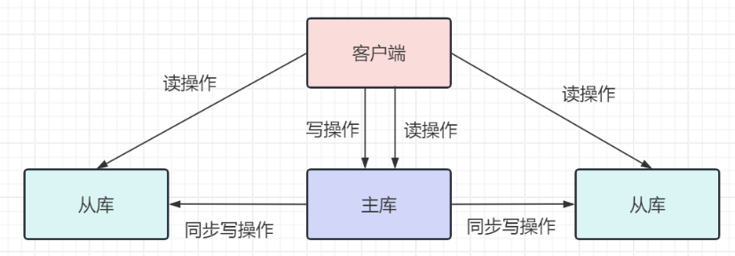

#### ③主从从模式

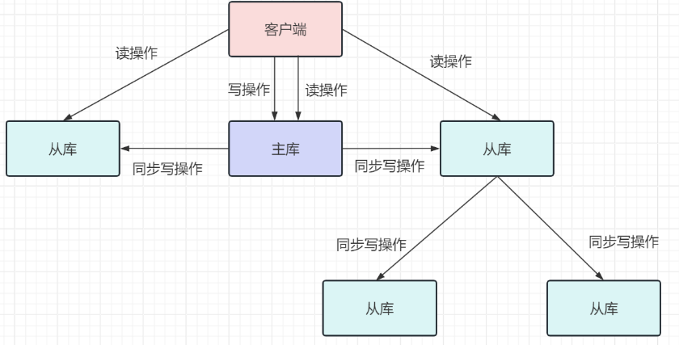

### ==（3）复制工作流程==

#### 	①全量复制

- **启动复制**：从节点通过执行 `REPLICAOF <masterip> <masterport>` 命令开始复制流程。
- **同步请求**：从节点向主节点发送 `PSYNC` 命令。由于这是初次同步，从节点不知道主节点的 `runID` 和偏移量，因此使用 `PSYNC ? -1`。
  - `runID` ：主节点的唯一标识符。

- **全量复制开始**：
  - **主节点响应**：主节点接收到 `PSYNC ? -1` 后，识别出需要进行全量复制，并响应 `+FULLRESYNC`，附带自己的 `runID` 和数据的偏移量 `offset`。
  - **数据快照**：主节点执行 `BGSAVE` 命令生成当前数据的快照（RDB文件），同时，新的写操作会被缓存以保证这些操作在RDB文件发送后也能同步到从节点。
- **传输RDB文件**：RDB文件生成后，主节点将其发送到从节点。从节点接收到文件后，将其存储在磁盘上，并用它来加载自己的数据集。
  - `repl-timeout` 配置定义了从节点等待主节点响应的最长时间。如果全量复制的时间超过这个值，从节点会放弃并清理已下载的临时文件。
  -  `client-output-buffer-limit` 用于控制Redis客户端的输出缓冲区大小。输出缓冲区用于存储即将发送给客户端的数据。例如，设置硬限制为256MB，软限制为64MB，如果输出缓冲区大小超过64MB持续超过60秒或者直接超过256MB，则断开连接。


#### 	②命令缓冲和增量复制

- **命令缓冲**：在从节点加载RDB文件期间，主节点继续处理客户端的写请求，并将这些新的写命令保存在自己的缓冲区中。
  - `repl-backlog-size` 是主节点用来保存所有从节点所需的历史写命令的缓冲区大小。

- **数据一致性**：一旦从节点完成了RDB文件的加载，它会开始接收主节点缓冲区中积累的写命令。这些命令是在RDB快照生成后发生的，因此它们必须被应用到从节点上，以确保数据的一致性。
  - 通过 `info replication` 命令可以查看从节点相对于主节点的延迟字节数，这有助于评估复制的即时性和是否需要进行优化。

- **流式复制**：从节点完成RDB加载并追上主节点之后，会进入常态的流式复制阶段，即从节点会实时接收并应用主节点的所有新写命令。

#### 	③重新同步

如果复制过程中出现网络问题或从节点重启，从节点将尝试重新连接主节点，并使用之前保存的 `runID` 和偏移量通过 `PSYNC` 命令请求增量复制。

## 2.哨兵

### （1）概述

Redis Sentinel是一个分布式架构，其中包含若干个Sentinel节点和Redis数据节点，每个Sentinel节点会对数据节点和其余Sentinel节点进行监控，当它发现节点不可达时，会对节点做下线标识。

如果被标识的是主节点，它还会和其他Sentinel节点进行“协商”，当大多数Sentinel节点都认为主节点不可达时，它们会选举出一个Sentinel节点来完成自动故障转移的工作，同时会将这个变化实时通知给Redis应用方。整个过程完全是自动的，不需要人工来介入，所以这套方案很有效地解决了Redis的高可用问题。

启动 Sentinel 的方法有两种：
- 使用 `redis-sentinel` 命令直接启动。
- 使用 `redis-server` 命令加上 `--sentinel` 参数启动。

### （2）结构

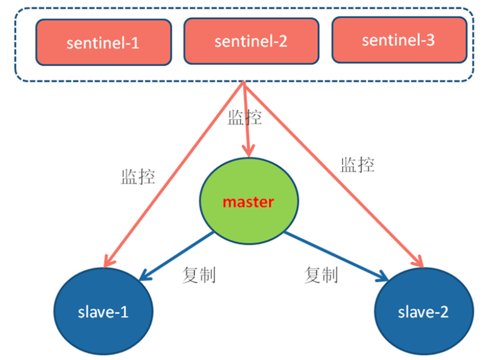

### ==（3）故障转移==

#### 	① 监控

- **``Info`命令**：Sentinel 对每个被监控的Redis主节点和从节点定期执行`INFO`命令。此命令返回关于Redis服务器状态的详细信息，包括客户端连接数、命令统计、内存使用情况、持久化、复制和CPU统计信息等。
- **`PING` 命令**：Sentinel 每隔一定时间（通常是每秒）向所有被监控的 Redis 实例发送 `PING` 命令。如果 Redis 实例在配置的 `down-after-milliseconds` 时间内没有响应 `PING` 命令，Sentinel 将该实例标记为主观下线（SDOWN）。
  - **down-after-milliseconds**：此参数在 Sentinel 的配置文件中设置，用于定义一个时间窗口，在此时间内未收到被监控节点的有效响应，Sentinel 将假定该节点不可达。
  - **SDOWN**：当某个Sentinel观察到一个节点在指定的时间内无响应，它会将该节点标记为SDOWN。
  - **ODOWN**：一旦一个节点被标记为SDOWN，观察到该状态的Sentinel会通过`__sentinel__:hello`频道查询其他Sentinel节点。如果多数Sentinel（根据配置的`quorum`值）同意某个主节点是不可达的，该节点被标记为ODOWN。

#### 	② 通知

**`__sentinel__:hello`频道**：所有的Sentinel节点通过订阅一个名为`__sentinel__:hello`的Pub/Sub频道相互通信。每个Sentinel节点都会定期在这个频道上广播一个消息，包含自己的状态和对其他Redis节点的看法（例如哪些节点认为主节点已下线）。

#### 	③ 故障转移

在Redis Sentinel集群中，故障转移开始前进行的首要步骤是领导者选举。这个过程确保只有一个Sentinel节点负责管理故障转移，防止多个节点同时执行可能导致混乱的操作。

1. **发起选举**：当一个Sentinel节点判定主节点为客观下线后，它会尝试成为领导者。这是通过向其他Sentinel节点发送 `SENTINEL is-master-down-by-addr` 命令实现的，请求它们承认自己为领导者。
   
2. **投票过程**：接收到命令的其他Sentinel节点会根据自己是否已经响应过其他节点的相同请求来决定是否支持当前请求。每个Sentinel节点只会在一轮选举中支持一次。

3. **确认领导者**：当一个Sentinel节点得到的支持票数超过设定的阈值（通常是 `max(quorum, num(sentinels)/2 + 1)`），它就会成为故障转移的领导者。

4. **选举失败**：如果在一定时间内没有选出领导者，将会重试选举过程。

领导者选举出后，该领导者将负责执行以下故障转移步骤：

1. **选择新主节点**：
   - **健康检查**：从剩余的从节点中排除那些不健康的节点，如主观下线、响应超时或与旧主节点失联过久的节点。
   - **优先级选择**：从健康的从节点中选出`slave-priority`最高的节点。
   - **数据完整性**：如果多个从节点优先级相同，选择复制偏移量最大的节点。
   - **稳定性选择**：如果复制偏移量也相同，选择`runid`最小的节点。

2. **晋升为主节点**：通过向选定的从节点发送`SLAVEOF no one`命令，使其成为新的主节点。

3. **重定向其他从节点**：更新剩余从节点的配置，使它们开始复制新的主节点。这一步确保数据的一致性和完整性。

4. **持续监控**：原主节点如果恢复后，会被配置为新主节点的从节点，继续参与数据复制。


## 3.集群

### （1）概述

Redis Cluster提供了一种方式，使得Redis实例能够在多个节点上运行，形成一个统一的系统。它主要解决了以下几个问题：
- **容量限制**：单个Redis实例受限于单机的内存容量，而Cluster通过分布数据到多个节点，显著扩展了数据存储能力。
- **高可用性**：通过数据的多节点复制，提高了服务的可用性和故障恢复能力。
- **负载均衡**：自动将数据和负载均匀分布到多个节点，提升了处理能力和响应速度。

搭建集群

```
1、启动节点

./redis-server ../conf/cluster_m_6900.conf
./redis-server ../conf/cluster_m_6901.conf
./redis-server ../conf/cluster_m_6902.conf
./redis-server ../conf/cluster_s_6930.conf
./redis-server ../conf/cluster_s_6931.conf
./redis-server ../conf/cluster_s_6932.conf

2、随机创建集群主从节点

redis-cli --cluster create

./redis-cli --cluster create 127.0.0.1:6900 127.0.0.1:6901 127.0.0.1:6902 127.0.0.1:6930 127.0.0.1:6931 127.0.0.1:6932 --cluster-replicas 1


3、指定主从节点
--创建集群主节点
./redis-cli --cluster create  127.0.0.1:6900 127.0.0.1:6901 127.0.0.1:6902

	1、请记录下每个M后形如“7353cda9e84f6d85c0b6e41bb03d9c4bd2545c07”的字符串，在后面添加从节点时有用；
	2、如果服务器存在着防火墙，那么在进行安全设置的时候，除了redis服务器本身的端口，比如6900 要加入允许列表之外，Redis服务在集群中还有一个叫集群总线端口，其端口为客户端连接端口加上10000，即 6900 + 10000 = 16900 。所以开放每个集群节点的客户端端口和集群总线端口才能成功创建集群！


M: dcd818ab48166ccea9563544839187ffa5d79f62 127.0.0.1:6900
   slots:[0-5460] (5461 slots) master
M: 8a790d30957b28232035cf6960ec29ad29aee6ff 127.0.0.1:6901
   slots:[5461-10922] (5462 slots) master
M: a495039067d023289bcc444634d38e25aef880cc 127.0.0.1:6902


加入第4台
60fd25ce5395a83032bccf30a4a30bd4ff96d732


--添加集群从节点
命令类似：./redis-cli --cluster add-node 127.0.0.1:6930 127.0.0.1:6900 --cluster-slave --cluster-master-id dcd818ab48166ccea9563544839187ffa5d79f62

./redis-cli --cluster add-node 127.0.0.1:6931 127.0.0.1:6900 --cluster-slave --cluster-master-id 8a790d30957b28232035cf6960ec29ad29aee6ff

./redis-cli --cluster add-node 127.0.0.1:6932 127.0.0.1:6900 --cluster-slave --cluster-master-id a495039067d023289bcc444634d38e25aef880cc


说明：上述命令把6930节点加入到6900节点的集群中，并且当做node_id为 117457eab5071954faab5e81c3170600d5192270 的从节点。如果不指定 --cluster-master-id 会随机分配到任意一个主节点。


有三个从节点，自然就要执行三次类似的命令。
./redis-cli --cluster add-node 127.0.0.1:6930 127.0.0.1:6900 --cluster-slave --cluster-master-id 117457eab5071954faab5e81c3170600d5192270
./redis-cli --cluster add-node 127.0.0.1:6931 127.0.0.1:6900 --cluster-slave --cluster-master-id 8a790d30957b28232035cf6960ec29ad29aee6ff
./redis-cli --cluster add-node 127.0.0.1:6932 127.0.0.1:6900 --cluster-slave --cluster-master-id a495039067d023289bcc444634d38e25aef880cc


4、集群管理
	--集群信息查看
	./redis-cli --cluster info 127.0.0.1:6900
	--检查集群
	./redis-cli --cluster check 47.112.44.148:6900 --cluster-search-multiple-owners


5、动态扩容
./redis-server ../conf/cluster_m_6903.conf

./redis-server ../conf/cluster_s_6933.conf


启动后  从的runid


迁移槽（扩容）

./redis-cli --cluster reshard --cluster-from dcd818ab48166ccea9563544839187ffa5d79f62 --cluster-to 60fd25ce5395a83032bccf30a4a30bd4ff96d732 --cluster-slots 1365 127.0.0.1:6900

./redis-cli --cluster reshard --cluster-from 8a790d30957b28232035cf6960ec29ad29aee6ff --cluster-to 60fd25ce5395a83032bccf30a4a30bd4ff96d732 --cluster-slots 1366 127.0.0.1:6900

./redis-cli --cluster reshard --cluster-from a495039067d023289bcc444634d38e25aef880cc --cluster-to 60fd25ce5395a83032bccf30a4a30bd4ff96d732 --cluster-slots 1365 127.0.0.1:6900

迁移槽（缩容）

./redis-cli --cluster reshard --cluster-from 60fd25ce5395a83032bccf30a4a30bd4ff96d732 --cluster-to dcd818ab48166ccea9563544839187ffa5d79f62 --cluster-slots 1365 127.0.0.1:6900

./redis-cli --cluster reshard --cluster-from 60fd25ce5395a83032bccf30a4a30bd4ff96d732 --cluster-to 8a790d30957b28232035cf6960ec29ad29aee6ff --cluster-slots 1366 127.0.0.1:6900

./redis-cli --cluster reshard --cluster-from 60fd25ce5395a83032bccf30a4a30bd4ff96d732 --cluster-to a495039067d023289bcc444634d38e25aef880cc --cluster-slots 1365 127.0.0.1:6900

节点下线（先从、再主）

./redis-cli --cluster del-node 127.0.0.1:6900 5bd705de41b4ee2f76c24965194c976ee878e8da


./redis-cli --cluster del-node 127.0.0.1:6900 60fd25ce5395a83032bccf30a4a30bd4ff96d732


```

相关参数：

```
redis-cli --cluster help
Cluster Manager Commands:
  create         host1:port1 ... hostN:portN   #创建集群
                 --cluster-replicas <arg>      #从节点个数
  check          host:port                     #检查集群
                 --cluster-search-multiple-owners #检查是否有槽同时被分配给了多个节点
  info           host:port                     #查看集群状态
  fix            host:port                     #修复集群
                 --cluster-search-multiple-owners #修复槽的重复分配问题
  reshard        host:port                     #指定集群的任意一节点进行迁移slot，重新分slots
                 --cluster-from <arg>          #需要从哪些源节点上迁移slot，可从多个源节点完成迁移，以逗号隔开，传递的是节点的node id，还可以直接传递--from all，这样源节点就是集群的所有节点，不传递该参数的话，则会在迁移过程中提示用户输入
                 --cluster-to <arg>            #slot需要迁移的目的节点的node id，目的节点只能填写一个，不传递该参数的话，则会在迁移过程中提示用户输入
                 --cluster-slots <arg>         #需要迁移的slot数量，不传递该参数的话，则会在迁移过程中提示用户输入。
                 --cluster-yes                 #指定迁移时的确认输入
                 --cluster-timeout <arg>       #设置migrate命令的超时时间
                 --cluster-pipeline <arg>      #定义cluster getkeysinslot命令一次取出的key数量，不传的话使	用默认值为10
                 --cluster-replace             #是否直接replace到目标节点
  rebalance      host:port                                      #指定集群的任意一节点进行平衡集群节点slot数量 
                 --cluster-weight <node1=w1...nodeN=wN>         #指定集群节点的权重
                 --cluster-use-empty-masters                    #设置可以让没有分配slot的主节点参与，默认不允许
                 --cluster-timeout <arg>                        #设置migrate命令的超时时间
                 --cluster-simulate                             #模拟rebalance操作，不会真正执行迁移操作
                 --cluster-pipeline <arg>                       #定义cluster getkeysinslot命令一次取出的key数量，默认值为10
                 --cluster-threshold <arg>                      #迁移的slot阈值超过threshold，执行rebalance操作
                 --cluster-replace                              #是否直接replace到目标节点
  add-node       new_host:new_port existing_host:existing_port  #添加节点，把新节点加入到指定的集群，默认添加主节点
                 --cluster-slave                                #新节点作为从节点，默认随机一个主节点
                 --cluster-master-id <arg>                      #给新节点指定主节点
  del-node       host:port node_id                              #删除给定的一个节点，成功后关闭该节点服务
  call           host:port command arg arg .. arg               #在集群的所有节点执行相关命令
  set-timeout    host:port milliseconds                         #设置cluster-node-timeout
  import         host:port                                      #将外部redis数据导入集群
                 --cluster-from <arg>                           #将指定实例的数据导入到集群
                 --cluster-copy                                 #migrate时指定copy
                 --cluster-replace                              #migrate时指定replace

```


### （2）虚拟槽分区机制

在Redis Cluster中，所有的键都通过一个固定范围内的整数（称为槽，总数为16384个，从0到16383）来进行分区。每个键通过哈希函数关联到一个槽，哈希函数的计算公式为：
```plaintext
slot = CRC16(key) % 16384
```
这种方法可以确保键被均匀且随机地分布到所有的槽中。

集群启动时，槽会被平均分配到所有节点上。每个节点负责一部分槽以及这些槽中所有键的读写操作。

节点加入或离开集群时，部分槽会自动迁移到其他节点，保持集群的负载均衡。

每次客户端请求都会计算键的槽位置，直接定位到负责该槽的节点，实现快速访问。

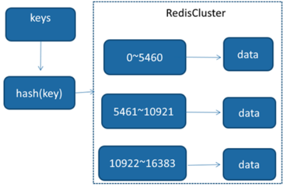

为了维持高效的操作，Redis Cluster通常不允许跨多个槽的操作，即所有涉及到多个键的操作，这些键必须在同一个槽中。

### （3）结构

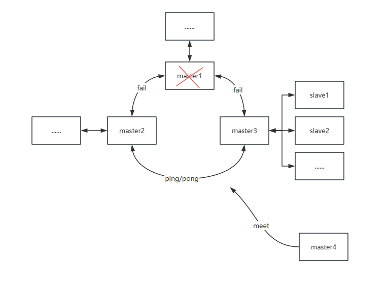

### （4）Gossip协议

Gossip协议在Redis Cluster中的应用允许节点以去中心化和高效的方式交换状态信息。Gossip协议的设计使得每个节点无需与集群中的每个其他节点保持持续连接，而是周期性地与一部分节点交换信息。这种方式极大地减少了通信开销，并提高了系统的可扩展性和容错性。

#### ① Gossip协议的关键特性

- **去中心化**：没有单一的信息汇总点或中心节点，所有节点均参与信息的传播。

- **自我修复**：集群能够自动识别和修复节点故障，通过不断的状态信息交换达到最终一致性。

- **扩展性**：由于信息交换不依赖于集群中的所有节点同时在线，Gossip协议非常适合大规模分布式系统。

#### ② Gossip消息类型详解

- **Ping消息**：主要用于心跳检测和携带关于节点及其已知的其他节点的信息。每个节点定期向随机选择的其他节点发送Ping消息，包含自身和部分已知节点的状态。

- **Pong消息**：作为对Ping和Meet消息的响应，携带回复节点的状态信息。Pong消息也可以用于更新其他节点的状态信息。

- **Meet消息**：用于引入新节点到现有集群。当一个新节点启动时，它发送Meet消息到已知的任一集群节点，请求加入集群。

- **Fail消息**：当一个节点判断另一个节点为不可达时，它会广播Fail消息。接收到Fail消息的节点会将相应的节点标记为失败，不再考虑该节点直到它重新声明为健康状态。

#### ==③ Gossip通信流程==

1. **初始化**：节点启动后，发送Meet消息到集群中的已知节点，请求加入集群。
   
2. **周期性交换**：每个节点定期向随机选择的一部分节点发送Ping消息，并附带自身和一部分已知节点的状态。接收到Ping的节点回复Pong消息，确认信息的接收并提供自身的最新状态。
   
3. **状态更新**：通过不断的Ping/Pong消息交换，每个节点逐步获得关于集群状态的更新，并对自身维护的节点状态信息进行调整。

### ==（6）故障转移==

#### ① 故障检测

使用Gossip协议，集群节点间定期交换状态信息，如在`cluster-node-timeout`时间（一般为15s）内`Ping`未响应，则发送节点会认为接收节点存在故障，把接收节点标记为主观下线(pfail)状态。

其他节点接收到含有主观下线状态的消息后，会检查自己的维护故障链表，并更新相应节点的状态，当足够数量的节点（超过半数）认为某主节点已下线，该节点状态将被更新为客观下线（fail），并进行广播。

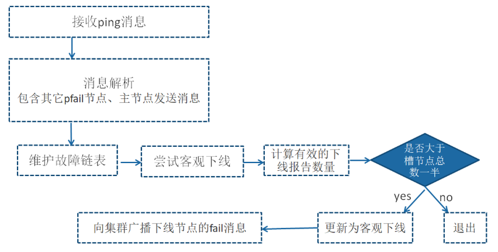

#### ② 故障选举

一旦主节点进入客观下线状态，其从节点将启动选举流程以选择一个从节点来替代故障的主节点。

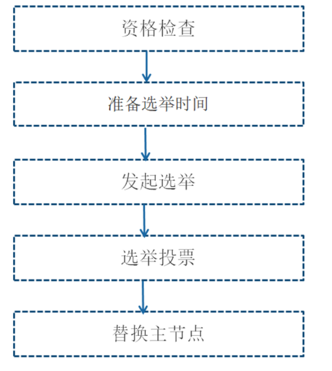

1. 资格检查：在选举过程中，每个从节点首先检查自己与主节点的最后通信时间。如果从节点与主节点的断线时间超过了 `cluster-node-timeout * cluster-slave-validity-factor`，则该从节点不具备参与故障转移的资格。

   -   `cluster-slave-validity-factor`：一个乘数因子，用于确定从节点与其主节点断开连接的最长时间，超过这个时间的从节点将不被视为故障转移的候选者。

2. 准备选举时间：合格的从节点将根据自己的复制偏移量计算触发选举时间，只有到达该时间，才能进行选举，以保证优先级，复制偏移量越大（即数据越完整），该从节点的选举时间越早。

3. 发起选举：从节点在达到预定的选举时间后，会更新集群的配置纪元（增加），并向其他节点发送选举请求。

   - 配置纪元：Redis集群用于追踪集群配置变更的一种机制。它是一个递增的整数，每当集群中发生重要事件时（如节点故障、主从切换等），配置纪元都会增加。

4. 选举投票：每个持有槽的主节点只会在该配置纪元中投票一次，以防止选票被分散。从节点需要获得超过半数的持有槽主节点的支持才能成为新的主节点。这保证了在任何给定时刻，只有一个从节点能成功地获得足够多的投票成为新主节点。

5. 替换主节点：一旦从节点获得了足够的支持，它将执行以下操作：

   - 取消与旧主节点的复制关系，自我提升为主节点。

   - 接管所有由旧主节点管理的槽。

   - 通知整个集群其新的主节点状态。

####  ③ 转移时间

- 主观下线（PFAIL）识别时间：这是指一个节点开始怀疑另一个节点可能已经失败的时间。等于 `cluster-node-timeout` 参数的设置值，这是一个节点等待从另一个节点接收有效响应的最大时间。如果在这个时间内没有收到响应，节点会被标记为主观下线。
- 主观下线状态消息传播时间：一旦一个节点被标记为主观下线，这个信息需要被传播到其他节点。通常小于或等于 `cluster-node-timeout/2`。这是因为集群使用Gossip协议周期性地交换状态信息，而这个周期通常设定为 `cluster-node-timeout` 的一半。这样做可以确保在下一个Gossip交换周期内，大多数节点能够接收到关于某节点主观下线的消息。
- 从节点转移时间：从节点开始响应主节点故障，并试图通过选举过程成为新的主节点的时间。通常小于或等于1000毫秒（1秒）。这包括从节点在确认主节点故障后发起选举的最大延迟时间。如果从节点的数据偏移量较大，它会获得在故障转移过程中更早发起选举的优先权。

结合以上三个阶段，可以估算整体的故障转移时间如下：
$$
\text{failover-time} \leq \text{cluster-node-timeout} + \frac{\text{cluster-node-timeout}}{2} + 1000
$$

### （7）不可用判定

主要判定方式是槽的完整：Redis集群要求所有16384个槽必须有节点服务。如果任何一个槽未被分配给某个节点，集群将进入`CLUSTERDOWN`状态，任何尝试访问的键命令都将返回错误：“CLUSTERDOWN Hash slot not served”。

但是如果持有槽的主节点下线，并且在故障恢复过程中（比如，故障转移未完成），这些槽将暂时无人服务，同样会导致集群的部分不可用，对于大多数业务无法容忍这种情况，因此可以设置`cluster-require-full-coverage` 参数。
```bash
cluster-require-full-coverage=yes #默认值，意味着集群要求所有槽都必须有节点服务才可用
cluster-require-full-coverage=no #这意味着即使某些槽未被服务，只要这些槽不是当前操作的目标，集群仍然可以对其他槽进行操作。这在某些业务场景下可以提高集群的可用性，尤其是在主节点故障并等待故障转移完成的情况下。
```

**特殊情况**

1. **主节点多数故障**：如果超过半数的主节点宕机，集群将无法进行正常的故障转移。因为根据Redis集群的故障转移机制，一个从节点成为主节点需要获得大多数（集群中半数以上）主节点的投票。

2. **小规模或偶数节点集群的问题**：
   - **节点数小于三**：在这种情况下，集群的故障恢复能力受限，因为进行有效投票的节点数量不足以形成稳定的多数。
   - **节点总数为偶数**：偶数节点的集群在发生分裂脑问题时处理更为复杂，因为可能出现票数平分的情况，从而导致没有任何节点能获得足够的多数来推进故障转移流程。

### （8）读写分离

#### 	① 读写分离概述

**分担负载**：

- **写操作**：所有的写请求都指向主数据库。主数据库负责处理数据的新增、修改和删除操作。
- **读操作**：读请求被分发到一个或多个从数据库。这些从数据库是主数据库的复制品，可以有一个或多个，根据读负载的需要进行扩展。

**数据同步**：从数据库定期从主数据库同步数据更新。这种同步可以是同步（实时）的，也可以是异步（延迟）的，具体取决于系统的需求和设计。

#### 	② 读写分离的问题

**数据一致性**：如果从数据库的数据同步有延迟，就可能读到过时的数据。

**复杂性增加**：维护读写分离的架构比单数据库架构更复杂，需要额外的同步机制和故障转移策略。

#### 	③Redis集群读写分离管理

从节点只读设置

- **开启**：通过发送 `readonly` 命令到从节点，客户端可以使得该连接成为只读，此时从节点可以接受并响应属于它所复制的主节点槽的读请求。

- **关闭**：如果需要关闭从节点的只读模式，可以发送 `readwrite` 命令，这将恢复从节点的默认设置，即不处理任何请求。

读写分离的数据一致性管理

- 使用 `CLUSTER SLAVES {nodeId}` 命令可以获取指定主节点下所有从节点的详细信息，客户端需要解析这些信息，排除任何处于 `fail` 状态的从节点，以确保所有的读请求都被发送到健康的从节点。
- 客户端需要动态地维护每个主节点的可用从节点列表，以及适当地路由读请求到这些从节点。对于每个从节点的新连接，都需要发送 `readonly` 命令以开启只读模式。

集群模式下读写分离成本比较高，可以直接扩展主节点数量提高集群性能，一般不建议集群模式下做读写分离。

