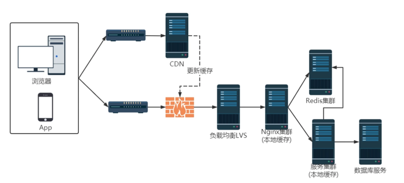
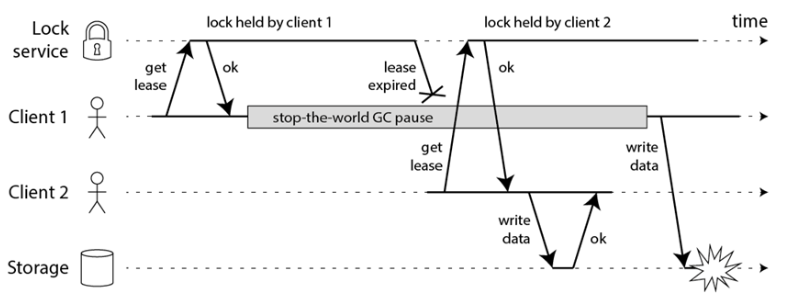

# 一、常用客户端

## 1. Jedis

Jedis 是一个较为直接和轻量级的 Redis 客户端实现，它直接提供了对 Redis 命令的封装。它是完全同步的，所以在多线程环境中可能不是很适合。如果需要一个简单且直接控制 Redis 的库，Jedis 是一个很好的选择。

**示例**：

```java
import redis.clients.jedis.Jedis;

public class RedisExample {
    public static void main(String[] args) {
        // 创建 Jedis 实例，连接到指定的 Redis 服务器
        Jedis jedis = new Jedis("localhost", 6379);

        // 设置一个键值对
        jedis.set("mykey", "myvalue");

        // 获取并打印出键值对
        System.out.println("Stored string in redis:: " + jedis.get("mykey"));

        // 关闭连接
        jedis.close();
    }
}

```

## 2. Lettuce

Lettuce 是一个可伸缩的线程安全的 Redis 客户端，支持同步、异步和反应式模式。Lettuce 基于Netty，这是一个高性能的事件驱动的网络应用框架，可以让 Lettuce 很好地扩展并用于多线程环境。它也支持高级 Redis 功能，如 Sentinel, Cluster, 和 Pipelining 等。

**示例**：

```java
import io.lettuce.core.RedisClient;
import io.lettuce.core.api.StatefulRedisConnection;
import io.lettuce.core.api.sync.RedisCommands;

public class RedisExample {
    public static void main(String[] args) {
        // 创建 RedisClient 实例
        RedisClient redisClient = RedisClient.create("redis://localhost:6379");

        // 开启一个连接
        StatefulRedisConnection<String, String> connection = redisClient.connect();

        // 获取同步执行命令的 API
        RedisCommands<String, String> syncCommands = connection.sync();

        // 执行一些基本操作
        syncCommands.set("key", "Hello, Redis!");
        String value = syncCommands.get("key");
        System.out.println("Value from Redis: " + value);

        // 关闭连接
        connection.close();
        redisClient.shutdown();
    }
}

```

## 3. Redisson

Redisson 是一个在 Redis 的基础上实现的 Java 分布式解决方案，提供了许多分布式的 Java 对象和服务。除了作为客户端连接 Redis 服务器外，Redisson 还提供了诸如分布式锁、集合、计数器等多种对象和服务，非常适合需要使用 Redis 实现分布式功能的场景。

**示例**：

```java
import org.redisson.Redisson;
import org.redisson.api.RLock;
import org.redisson.api.RedissonClient;
import org.redisson.config.Config;

public class RedissonExample {
    public static void main(String[] args) {
        // 配置 Redisson 客户端
        Config config = new Config();
        config.useSingleServer().setAddress("redis://127.0.0.1:6379");

        // 创建 Redisson 客户端实例
        RedissonClient redisson = Redisson.create(config);

        // 获取一个分布式锁
        RLock lock = redisson.getLock("myLock");

        // 锁定
        lock.lock();
        try {
            // 在此处进行一些操作
            System.out.println("Locked and processing");
        } finally {
            // 解锁
            lock.unlock();
        }

        // 关闭 Redisson 客户端
        redisson.shutdown();
    }
}

```

## 4.Spring Data Redis

Spring Data Redis 是 Spring 提供的用于简化操作 Redis 数据库的模块，是对 Jedis 和 Lettuce 都进行了封装，提供了更高级和方便的抽象来管理 Redis 数据连接和执行操作。

**示例**：

首先，需要在项目的 `pom.xml` 文件中添加 Spring Boot 的 Redis Starter 依赖：

```xml
<dependency>
    <groupId>org.springframework.boot</groupId>
    <artifactId>spring-boot-starter-data-redis</artifactId>
</dependency>
```

然后在 `application.properties` 或 `application.yml` 文件中配置 Redis 服务器的地址和其他参数：

```properties
spring.redis.host=localhost
spring.redis.port=6379
spring.redis.client-type=lettuce
```

一旦配置好，你可以在你的 Spring 应用中自动注入 Redis 操作模板 `StringRedisTemplate` 或 `RedisTemplate`，然后使用它们来执行 Redis 命令：

```java
import org.springframework.beans.factory.annotation.Autowired;
import org.springframework.data.redis.core.StringRedisTemplate;
import org.springframework.stereotype.Component;

@Component
public class RedisComponent {

    @Autowired
    private StringRedisTemplate template;

    public void setKeyValue(String key, String value) {
        template.opsForValue().set(key, value);
    }

    public String getValue(String key) {
        return template.opsForValue().get(key);
    }
}
```

# 二、缓存设计

## 1. 概述

分布式缓存是一种存储机制，将数据缓存分布在多个服务器上，这样数据就可以更快地被访问，同时还减少了对后端数据库的访问压力。它有助于减少延迟，增加吞吐量，并提高大规模应用的数据访问速度。

## 2. Redis缓存方案

假设你有一个电商平台，需要缓存产品的三级分类数据，以便快速响应用户的请求。可以使用 Redis 来存储这些信息。

**示例**：

```java
import org.springframework.beans.factory.annotation.Autowired;
import org.springframework.data.redis.core.RedisTemplate;
import org.springframework.stereotype.Service;

@Service
public class CategoryService {

    @Autowired
    private RedisTemplate<String, String> redisTemplate;

    public void saveCategories() {
        redisTemplate.opsForValue().set("category:electronics:smartphones", "iPhone, Samsung, Huawei");
        redisTemplate.opsForValue().set("category:electronics:laptops", "Dell, Apple, Lenovo");
        redisTemplate.opsForValue().set("category:clothing:men", "Shirts, Trousers, Shoes");
        redisTemplate.opsForValue().set("category:clothing:women", "Dresses, Skirts, Blouses");
    }

    public String getCategoryItems(String categoryKey) {
        return redisTemplate.opsForValue().get(categoryKey);
    }
}

```

压力测试是评估缓存系统性能的重要手段。可以使用工具如 `redis-benchmark` 进行标准测试，或者编写自定义脚本来模拟实际操作。

```bash
# 使用 redis-benchmark 进行性能测试
#这条命令会启动一个压力测试，模拟 100 个并发连接，总共发送 10000 个请求到 Redis 服务器。
redis-benchmark -h localhost -p 6379 -c 100 -n 10000
```
## 3.缓存穿透、雪崩、击穿

### （1）缓存穿透

缓存穿透问题发生在查询不存在的数据时，由于缓存中没有这类数据，每次查询都会直接访问数据库，这可能导致数据库压力过大。

**解决方案**

- **赋予空值**：将不存在的查询结果（如`null`或特定的错误信息）缓存起来，并设置较短的过期时间。这样当同样的查询再次发生时，可以直接从缓存中获取结果，避免对数据库的访问。
- **布隆过滤器**：使用布隆过滤器预先判断请求的数据是否可能存在。布隆过滤器可以高效地测试一个元素是否在一个集合中。如果布隆过滤器表示数据不存在，那么就直接返回，不进行数据库查询。

### （2）缓存雪崩

缓存雪崩是指在缓存层面大量的key同时失效，导致请求直接转发到数据库，可能会使数据库瞬时压力剧增，甚至崩溃。

**解决方案**

- **不同的过期时间**：给不同的缓存设置不同的随机过期时间，这样可以避免大量缓存同时到期。
- **缓存预热**：在缓存到期前，系统自动将数据更新到缓存中。

### （3）缓存击穿

缓存击穿指一个高并发访问的热点key突然失效，导致所有请求都去数据库加载数据，对数据库造成巨大压力。

**解决方案**

- **单独加锁**：对访问热点key时，使用分布式锁或互斥锁确保同一时间只有一个请求去到数据库。其他请求等待第一个请求处理完毕后，再从缓存中获取数据。
- **设置热点数据永不过期**：对于极其热门的数据，可以选择设置为永不过期，需要时再手动更新缓存。

## 4.数据一致性

在使用缓存系统时，尤其是当缓存与数据库同时存在并且需要频繁更新的数据时，数据一致性成为了一个需要重点关注的问题。

**先删除缓存、更新数据库策略**

这种策略的基本流程如下：

1. **删除缓存**：当数据需要更新时，首先删除缓存中的旧数据。
2. **更新数据库**：在缓存删除后，立即更新数据库中的数据。

这种方式的优点在于操作简单直接，并且能够较快地保证数据库中的数据是最新的。但是，这种方法也存在一些缺点和风险：

- **数据窗口期问题**：在缓存被删除和数据库更新之间存在一个时间窗口，在这个时间窗口内，如果有其他请求查询这个数据，会因为缓存已经被删除而直接查询到旧的数据库数据。这就产生了所谓的“脏数据”。
- **数据库操作失败**：如果在删除了缓存后，更新数据库操作失败了，那么这会导致数据丢失，因为缓存已经不存在，而数据库中的数据也没有被成功更新。

为了解决上述问题，通常会采用以下一些改进策略：

- **延迟双删策略**：
   - **第一次删除**：在更新数据库之前，先删除缓存。
   - **更新数据库**：进行数据库的更新操作。
   - **第二次删除**：数据库更新成功后，再次删除缓存。这一步是为了处理在数据库更新期间新产生的可能已经陈旧的缓存数据（异步）。
- **更新数据库后删除缓存**：
   - 有时，改变顺序，即先更新数据库，再删除缓存，可以减少数据不一致的风险。这样即便更新数据库后有新的读取请求发生，也会由于缓存失效而直接读取新的数据库数据。
   - 这种方法的风险在于，在数据库更新与缓存删除之间的窗口期内，仍可能读取到旧的缓存数据。

## 5.多级缓存架构



### （1）**Nginx 层**

- **负载均衡策略**：使用轮询或一致性哈希。轮询简单而有效，保证请求均匀分配。一致性哈希则更适合缓存场景，因为它可以减少节点变动时缓存失效的情况，提高缓存命中率。
- **本地缓存实现**：
  - **Lua Shared Dict**：轻量级，适用于存储小而频繁访问的数据。
  - **Nginx Proxy Cache**：面向磁盘或内存的缓存解决方案，适合缓存静态内容如图片、CSS、JavaScript文件等。
  - **本地 Redis**：适用于需要快速读取的动态内容。

### （2）**Redis 分布式缓存**

- **主从架构**：提供高可用性和读写分离，主节点处理写操作，从节点处理读操作，提高系统吞吐量。
- **缓存回写**：如果数据在 Nginx 层未命中，但在 Redis 中命中，应将数据回写到 Nginx 的本地缓存中，减少后续请求的响应时间。

### （3）**Tomcat 应用集群**

- **平台级本地缓存**：每个 Tomcat 实例可以维护自己的本地缓存，用于处理频繁的业务逻辑数据。
- **缓存一致性**：当多个 Tomcat 实例需要更新主 Redis 集群时，要注意使用原子操作或事务保证数据一致性。

### （4）**数据库缓存**

数据库如 MySQL 的查询缓存或 MongoDB 的 WiredTiger 存储引擎等，可以进一步减少对数据库的直接访问，提高查询效率。

# 三、分布式锁设计

## 1.概述

分布式锁是在分布式系统中用来避免多个进程或服务在同一时间内操作相同资源的机制。它将并行操作转换为串行，以避免数据冲突和不一致的情况发生。分布式锁与本地锁的主要区别在于其能够跨多个系统实例工作。

## ==2.Redis解决方案==

Redis 提供了多种实现分布式锁的方法，其中最常用的是利用 `SETNX` (SET if Not eXists) 命令。`SETNX` 命令在指定的 key 不存在时，会设置这个 key 的值，并返回 1；如果已存在，则不做任何操作，返回 0。这个特性可以被用来实现锁的功能。

- **基础使用示例**:

   ```redis
   SETNX lock_key 1
   EXPIRE lock_key 30
   ```
   这两个命令用于尝试获取锁，并为锁设置一个过期时间（如30秒）以避免死锁。但这两个命令不是原子操作，可能会在 `SETNX` 和 `EXPIRE` 之间发生故障导致死锁。

- **原子性优化**:

   ```redis
   SET lock_key 1 EX 30 NX
   ```
   Redis 2.6.12 版本后，`SET` 命令加入了更多选项，可以一条命令中同时设置键值对、过期时间以及存在性条件，保证了操作的原子性。

- **安全性优化**:
   考虑到锁释放的安全性问题，锁的值通常设置为唯一标识（如UUID），释放锁时检查标识，确保不会错误释放由其他进程持有的锁。

   ```redis
   SET lock_key uuid EX 30 NX
   ```

- **Lua 脚本**:
   使用 Lua 脚本在释放锁时检查锁的持有者是否为自己，这是一个原子操作，避免了在检查与释放之间的时间窗口内可能发生的问题。

   ```lua
   --这段脚本比较给定的 key 的当前值是否为传入的 UUID，如果是，则删除该 key 释放锁。
   if redis.call("get", KEYS[1]) == ARGV[1] then
       return redis.call("del", KEYS[1])
   else
       return 0
   end
   ```
   使用方法：
   ```redis
   EVAL <script> 1 lock_key uuid
   ```

- **看门狗优化**：

  加锁时，先设置一个过期时间，然后开启一个「守护线程」，定时去检测这个锁的失效时间，如果锁快要过期了，操作共享资源还未完成，那么就自动对锁进行「续期」，重新设置过期时间。

## ==3.Redisson==

Redisson 是一个在 Redis 的基础上实现的 Java 分布式解决方案，提供了许多分布式的 Java 对象和服务。它是一个功能丰富的 Redis 客户端，支持多种 Redis 服务器模式，包括单机、哨兵、集群等。Redisson 利用 Redis 来实现了各种 Java 常用的锁和同步器，例如锁（Locks）、原子变量、信号量、队列等。

### （1）Reentrant Lock

可重入锁（Reentrant Lock）是一种分布式锁，支持跨多个 JVM 的锁重入。可重入锁意味着同一个线程可以多次获取同一把锁。

**示例代码**：

```java
import org.redisson.Redisson;
import org.redisson.api.RLock;
import org.redisson.api.RedissonClient;
import org.redisson.config.Config;

public class ReentrantLockExample {
    public static void main(String[] args) {
        Config config = new Config();
        config.useSingleServer().setAddress("redis://127.0.0.1:6379");
        RedissonClient redisson = Redisson.create(config);

        RLock lock = redisson.getLock("anyLock");
        try {
            // 支持过期解锁功能, 10秒以后自动解锁, 无需调用unlock方法手动解锁
            lock.lock(10, TimeUnit.SECONDS);
            // 执行业务逻辑
            System.out.println("Locked and executing task.");
        } finally {
            lock.unlock();
            redisson.shutdown();
        }
    }
}
```

### （2）RReadWriteLock

读写锁允许多个读取者同时访问资源，但只允许一个写入者进入。如果写锁已被占用，则读锁将等待写锁释放。

**示例代码**：

```java
import org.redisson.Redisson;
import org.redisson.api.RReadWriteLock;
import org.redisson.api.RedissonClient;
import org.redisson.config.Config;

public class ReadWriteLockExample {
    public static void main(String[] args) {
        Config config = new Config();
        config.useSingleServer().setAddress("redis://127.0.0.1:6379");
        RedissonClient redisson = Redisson.create(config);

        RReadWriteLock rwLock = redisson.getReadWriteLock("anyRWLock");
        RLock readLock = rwLock.readLock();
        RLock writeLock = rwLock.writeLock();

        try {
            // 获取写锁
            writeLock.lock(10, TimeUnit.SECONDS);
            System.out.println("Write Lock acquired.");

            // 模拟业务逻辑
            // 释放写锁
            writeLock.unlock();

            // 获取读锁
            readLock.lock(10, TimeUnit.SECONDS);
            System.out.println("Read Lock acquired.");
        } finally {
            readLock.unlock();
            writeLock.unlock();
            redisson.shutdown();
        }
    }
}
```

### （3）Semaphore

信号量是一种限制访问共享资源的同步器，Redisson 的信号量可以跨越多个 JVM 工作。

**示例代码**：

```java
import org.redisson.Redisson;
import org.redisson.api.RSemaphore;
import org.redisson.api.RedissonClient;
import org.redisson.config.Config;

public class SemaphoreExample {
    public static void main(String[] args) throws InterruptedException {
        Config config = new Config();
        config.useSingleServer().setAddress("redis://127.0.0.1:6379");
        RedissonClient redisson = Redisson.create(config);

        RSemaphore semaphore = redisson.getSemaphore("anySemaphore");
        semaphore.acquire(); // 获取一个许可
        try {
            // 执行业务逻辑
            System.out.println("Semaphore acquired.");
        } finally {
            semaphore.release(); // 释放一个许可
            redisson.shutdown();
        }
    }
}
```

## ==4.Redlock==

### （1）概述

Redlock 算法是 Redis 官方提出的一种分布式锁的实现算法。单个 Redis 实例可能会出现的点故障问题，集群的主从复制会造成丢失，因此Redlock 通过在多个独立的 Redis 实例上实现锁来提高整个锁系统的容错性和可靠性，此时多个实例不是集群，而是单独的 Redis 实例。

**示例**：

```java
import org.redisson.Redisson;
import org.redisson.api.RLock;
import org.redisson.api.RedissonClient;
import org.redisson.config.Config;
import org.redisson.api.RedissonRedLock;

import java.util.concurrent.TimeUnit;

public class RedlockExample {

    public static void main(String[] args) {
        // 配置 Redisson 客户端连接，一般至少推荐五个实例对象，这里做了简化
        Config config1 = new Config();
        config1.useSingleServer().setAddress("redis://127.0.0.1:6379");
        RedissonClient redisson1 = Redisson.create(config1);

        Config config2 = new Config();
        config2.useSingleServer().setAddress("redis://127.0.0.1:6380");
        RedissonClient redisson2 = Redisson.create(config2);

        Config config3 = new Config();
        config3.useSingleServer().setAddress("redis://127.0.0.1:6381");
        RedissonClient redisson3 = Redisson.create(config3);

        // 创建三个锁对象，对应三个 Redis 实例
        RLock lock1 = redisson1.getLock("myLock");
        RLock lock2 = redisson2.getLock("myLock");
        RLock lock3 = redisson3.getLock("myLock");

        // 将三个锁合并为一个 RedLock
        RedissonRedLock redLock = new RedissonRedLock(lock1, lock2, lock3);

        try {
            // 尝试获取锁，最多等待100秒，锁持有最长时间10秒
            boolean isLocked = redLock.tryLock(100, 10, TimeUnit.SECONDS);
            if (isLocked) {
                // 执行业务逻辑
                System.out.println("Lock acquired");
            }
        } catch (InterruptedException e) {
            Thread.currentThread().interrupt();
        } finally {
            // 释放锁
            redLock.unlock();
            System.out.println("Lock released");
        }

        // 关闭 Redisson 客户端连接
        redisson1.shutdown();
        redisson2.shutdown();
        redisson3.shutdown();
    }
}

```

### （2）工作流程

1. **锁的请求**：客户端生成一个唯一的锁标识符，并在多个 Redis 实例上尝试通过 `SET key value NX PX milliseconds` 命令来获取锁。客户端记录尝试获取锁的开始时间。
2. **获取锁**：客户端必须从 `N` 个 Redis 实例中的大多数（即 `N/2 + 1` 个）成功获得锁，并且不能超过请求时间。如果客户端不能从大多数实例获取锁，它需要对已经获取到的锁进行释放。
3. **释放锁**：一旦客户端完成了其需要同步访问的操作，它应立即释放在所有 Redis 实例上的锁。

### （3）NPC

#### ① Network Delay

网络延迟可能导致客户端在尝试获取多个 Redis 实例上的锁时响应延迟，这会影响到锁获取的整体时间和可靠性。

**缓解策略：**

- **优化网络结构**：尽量保证 Redis 实例与客户端之间的网络延迟最小化，比如通过选择合适的地理位置和网络服务提供商。
- **设置合理的超时时间**：在客户端设置合理的命令超时时间，以防一个节点的响应延迟过高影响整个锁的获取过程。

#### ② Process Pause

进程因为 GC 或其他原因暂停，可能导致持有锁的进程在锁过期前无法释放锁，进而引起锁的错误重入。

**缓解策略：**

- **锁续期**：如果客户端预见到操作可能会很长，可以设计机制在操作进行时定期续期锁的过期时间。
- **减少 GC 影响**：优化应用的内存管理和垃圾收集策略，减少全停顿（Stop-The-World）的 GC 事件。

#### ③ Clock Drift

时钟漂移是指系统时钟不一致的情况，可能导致锁被错误地认为已经过期，或者还没有过期。

**缓解策略：**

- **时钟同步**：确保所有 Redis 服务器和客户端机器的时钟尽可能同步，使用 NTP（Network Time Protocol）服务来减少时钟漂移。
- **增加时间缓冲**：在设置锁的过期时间时加入一定的缓冲时间，以应对小范围的时钟漂移。

#### ④ 处理 GC 引发的锁冲突



1. **设计预防措施**：在获取锁的操作中，预估操作时间，并设置足够长的锁过期时间，以涵盖可能的 GC 延时。
2. **监控和日志**：在锁的操作中增加监控和日志记录，记录锁的获取、续期和释放情况，一旦发现锁操作异常，可以快速定位和调整。
3. **优化锁的粒度**：减少单个锁保护的资源范围，使用更细粒度的锁来降低单个锁被长时间持有的概率，同时减少由于锁等待导致的性能问题。

# 五、秒杀服务解决方案

秒杀活动的最大特点就是高并发而且是短时间内的高并发，那么对我们的服务要求就非常高，针对这种情况所产生的共性问题，对应的解决方案：

### 1. 独立的服务部署

通过独立部署秒杀服务，将秒杀业务与主业务分离，减轻对主系统的压力，提高系统的稳定性和可扩展性。

可以使用容器化（如 Docker）、微服务架构来部署独立的秒杀服务。这样可以快速扩展服务实例以应对流量波峰。

### 2. 秒杀请求加密处理

防止用户或黑客通过直接调用接口进行恶意请求。

使用加密令牌（Token）或签名（Signature）对秒杀请求进行验证。用户在参与秒杀前需要先获取一个有效的加密Token，该Token可以在用户请求秒杀时进行验证。

### 3. 库存预热，快速扣减

在秒杀开始前预加载库存信息到缓存系统中，减少对数据库的访问。

使用 Redis 等内存缓存系统存储库存数量，秒杀操作直接在 Redis 上进行扣减，通过原子操作保证库存的正确扣减。

Redisson 提供了多种分布式锁和同步器，如可重入锁（`RLock`）、公平锁（`RFairLock`）、读写锁（`RReadWriteLock`）和闭锁（`RCountDownLatch`）。确保在高并发环境下，对库存的访问和修改是同步的，防止超卖。

### 4. 动静分离

通过分离动态内容和静态内容，提高系统处理请求的能力。

使用 CDN 或其他静态资源服务器托管静态内容（如商品图片、JS/CSS文件），动态内容通过后端服务器处理。

### 5. 恶意请求拦截

防止恶意用户通过刷单等方式影响系统正常运行。

结合用户行为分析、IP黑名单、频率限制等技术，识别并拦截异常请求。

### 6. 流量错峰

避免在秒杀开始的瞬间产生流量高峰。

通过预约抢购、分批次放量等方式分散用户请求。

### 7. 限流、熔断、降级

确保系统在高负载情况下依然可用，避免系统完全崩溃。

- **限流**：限制某时间窗口内的请求量（如每秒请求量），超过限制的请求直接拒绝或排队。

- **熔断**：当系统负载过高时，自动停止部分服务，待系统稳定后再恢复。
- **降级**：在核心服务不可用时，提供降级服务，如返回简化的内容或提示信息。

使用 Redisson 的 `RSemaphore` 可以有效地实现限流，这是一种通过限制并发访问数量来控制系统负载的方法。

**示例：**

```java
import org.redisson.Redisson;
import org.redisson.api.RLock;
import org.redisson.api.RSemaphore;
import org.redisson.api.RedissonClient;
import org.redisson.config.Config;

public class SecKillService {

    private RedissonClient redisson;
    private RSemaphore semaphore;
    private RLock lock;

    public SecKillService() {
        Config config = new Config();
        config.useSingleServer().setAddress("redis://127.0.0.1:6379");
        this.redisson = Redisson.create(config);
        this.semaphore = redisson.getSemaphore("secKillSemaphore");
        //限流100
        semaphore.trySetPermits(100);
        this.lock = redisson.getLock("secKillLock");
    }

    public boolean attemptPurchase() throws InterruptedException {
        // 首先尝试获取信号量许可
        if (semaphore.tryAcquire()) {
            try {
                // 获取到许可后，尝试加锁处理业务
                lock.lock();
                try {
                    // 模拟处理订单的业务逻辑
                    System.out.println("处理订单中...");
                    Thread.sleep(1000); // 模拟业务执行时间
                } finally {
                    lock.unlock();
                }
            } finally {
                // 完成业务逻辑后，释放信号量
                semaphore.release();
            }
            return true;
        } else {
            System.out.println("当前用户太多，请稍后重试！");
            return false;
        }
    }

    public void shutdown() {
        redisson.shutdown();
    }

    public static void main(String[] args) throws InterruptedException {
        SecKillService service = new SecKillService();
        if (service.attemptPurchase()) {
            System.out.println("订单处理成功");
        } else {
            System.out.println("订单处理失败");
        }
        service.shutdown();
    }
}
```

### 8. 队列削峰

减少瞬时流量对后端服务的冲击。

使用消息队列接收秒杀请求，异步处理这些请求。通过调整消费速率来控制后端服务的负载。


