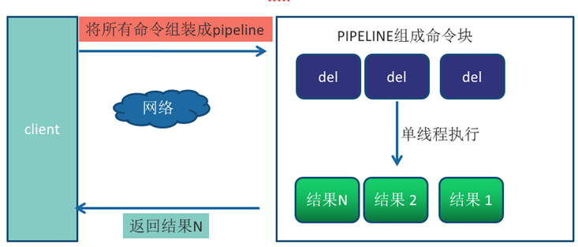
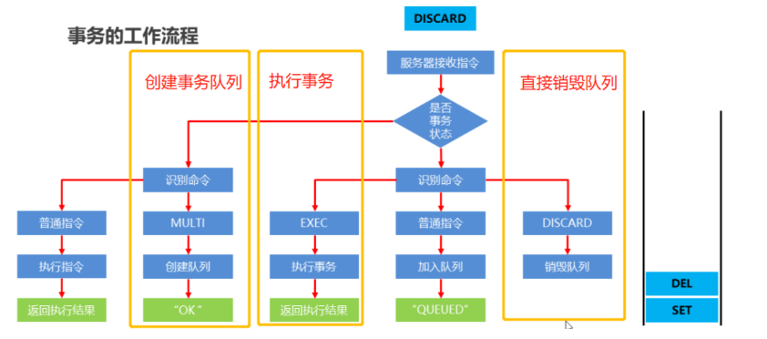
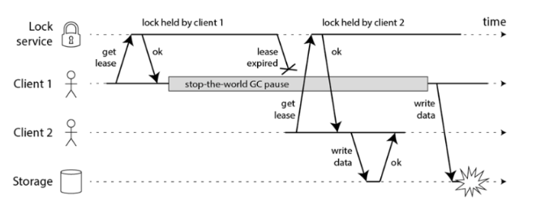

1. 什么是缓存？

   缓存是一种数据存储技术，用于临时存储频繁访问的数据，以便快速访问，通过减少对数据库或后端服务的直接请求，从而降低系统的负载和数据检索时间。

2. Redis的优势有哪些？

   **内存存储**：作为内存数据结构服务器，Redis提供极快的读写速度。

   **丰富的数据结构**：支持字符串、列表、集合、散列、有序集合等多种数据类型。

   **原子操作**：Redis的所有操作都是原子性的，确保数据的一致性。

   **持久化**：支持RDB和AOF两种方式，确保数据的持久存储。

   **高可用性和可伸缩性**：通过哨兵和集群模式，提供故障转移和数据分片功能。

   **支持事务**：虽然不是全ACID兼容，但支持通过MULTI、EXEC等命令进行事务处理。

   **多功能用途**：可用作缓存、消息队列、应用栈、发布订阅系统等。

3. 列举并描述Redis支持的数据类型。

   **String（字符串）**：文本或二进制数据。

   **List（列表）**：队列、栈。

   **Set（集合）**：无序且元素唯一，支持求交集、并集等操作。

   **Hash（哈希）**：存储对象和其属性。

   **Sorted Set（有序集合）**：元素唯一有序，适用于排行榜。

   **HyperLogLog**：用于高效地进行基数统计的概率数据结构。

   **Geo（地理位置）**：范围查询和半径查询。

   **Bitmaps**：通过位来表示数据，适合进行大量的位级操作。

   **Streams**：一种消息流数据类型，适用于构建消息队列和流应用。

4. 解释Redis数据结构的底层实现。

   

5. 什么是布隆过滤器？

   布隆过滤器使用多个哈希函数将每个数据元素映射到一个大的位数组中的多个位置，并将这些位置置为1查询时，同样通过这些哈希函数计算位置：

   - 如果所有这些位置的位都是1，元素可能存在。

   - 如果任一位置的位是0，元素肯定不存在。

   

   布隆过滤器可能会出现假阳性（false positives），即误判元素存在于集合中，本质是哈希冲突，但不会有假阴性（false negatives），即如果它说元素不在集合里，那么这个元素绝对不在集合中。

6. 布隆过滤器有什么应用。

   缓存穿透是指查询不存在于缓存中的数据，导致请求直接到达数据库层，如果大量这种请求发生，会对数据库造成极大压力。

   布隆过滤器可以有效避免缓存穿透的问题。

   

   1. **初始化布隆过滤器**：将所有可能查询的数据元素提前加载到布隆过滤器中。
   2. 请求检查：当一个查询请求到来时，先通过布隆过滤器检查该数据是否可能存在于缓存中。
      - 如果布隆过滤器判断数据绝对不存在，则可以直接返回结果，不必查询数据库或缓存。
      - 如果布隆过滤器认为数据可能存在，请求会继续查找缓存，如果缓存未命中，再去数据库查询数据。

7. Redis中统计UV数的方法。

   在大数据和网络分析领域，UV（Unique Visitors，唯一访问者）是一个核心指标，用于衡量不同用户对网站或应用的访问情况。HLL由于其高效的空间利用和快速的计算能力，特别适合用来估算UV。

   一个大型新闻网站需要实时跟踪和报告每天的唯一访问者数量。该网站的流量非常大，传统的方法可能不够高效或成本过高。

   使用 Redis 的 HyperLogLog 结构来存储和估算每天的UV：

   - 每当用户访问网站时，将其用户ID或者其他唯一标识符添加到当日的 HyperLogLog 结构中。
   - 通过 `PFADD` 命令将用户标识符添加到 HyperLogLog 中，并使用 `PFCOUNT` 命令在任何时候快速获取估算的UV数。

8. 描述Redis RDB持久化的工作流程。

   

   

   1. **创建子线程**：Redis 主进程会调用`fork()`创建一个子进程。这个子进程将负责将内存中的数据写入硬盘。
   2. **COW**：`fork()`系统调用并不立即复制整个进程的内存空间，而是让父进程和子进程共享同一物理内存。只有当父进程或子进程尝试修改某些内存页时，操作系统才会真正地复制这个内存页，确保修改操作不会影响到另一进程。
   3. **写入RDB**：子进程开始遍历Redis的整个数据集，将其序列化后写入一个临时的RDB文件中。一旦子进程完成了数据的读取和文件的写入，它会将临时的RDB文件替换旧的RDB文件。
   4. **子进程退出**：数据写入完成后，子进程退出，父进程通过`waitpid()`系统调用回收子进程资源，以避免产生僵尸进程。
   5. **替换旧文件**：

9. 讨论RDB数据丢失问题。

   如果 Redis 服务器在两次快照之间发生崩溃，自上次快照以来所有的数据更新都会丢失。

   适当调整间隔时间，可以减少数据丢失的风险，但会造成频繁持久化。

   - 多个持久化进程会增加磁盘的IO，影响整体系统性能。
   - `fork` 会产生CPU和内存开销，并且主线程会被短暂阻塞。

10. 描述Redis AOF持久化的工作流程。

    

    1. **创建子线程**：Redis 主进程 `fork()` 一个子进程。
    2. **AOF 重写缓冲区**：在 AOF 重写过程中，为了确保不丢失任何写命令，Redis 主进程额外维护AOF 重写缓冲区，重写期间所有新的写命令同时也会被写入这个缓冲区。
    3. **子进程重写 AOF 文件**：子进程会读取主进程内存中的数据状态，并将这些数据转换为 Redis 命令，从而构建一个新的、优化的 AOF 文件。
    4. **退出子线程**：一旦 AOF 重写完成，子进程会向父进程发送一个信号。此时，父进程会将 AOF 重写缓冲区中积累的所有写命令追加到新的 AOF 文件末尾，确保这些在重写过程中接收到的命令不会丢失。
    5. **替换旧文件**：新的 AOF 文件准备就绪后，Redis 会将当前的 AOF 文件替换为新重写的文件。

11. 解释Redis使用RDB和AOF混合持久化的工作流程。

    

    借鉴了aof_rewrite的思路，就是RDB文件写完，再把重写缓冲区的数据，追加到RDB文件的末尾，追加的这部分数据的格式是AOF的命令格式，这就是rdb_aof的混用。

12. 列举并解释Redis的内存淘汰策略。

    - **Noeviction**：默认策略。在达到内存限制时，不会淘汰任何键，只是拒绝执行那些会增加内存使用的命令。
    - **Volatile-lru** ：淘汰最近最少使用、设置TTL的键。
    - **Volatile-lfu**：淘汰访问频次低的、设置TTL的键，
    - **Volatile-ttl**：淘汰那些即将到期的、设置了TTL的键。
    - **Volatile-random**：从设置了TTL的键中随机选取键进行淘汰。

13. 什么是LRU算法？

    用于淘汰那些长时间未被访问的数据。

    传统的LRU算法使用一个字典来存储键值对，同时维护一个双向链表来记录访问顺序：

    - **访问数据**：每当数据被访问时，如果数据存在于缓存中，它会被移动到链表的头部。
    - **淘汰数据**：如果需要在缓存中加入新的数据，而缓存已满，链表尾部的数据（最久未被访问的数据）会被移除。

    Redis采取一种近似的LRU算法。

    每个键对象都有一个24位的时间戳字段，记录了这个键最后一次被访问的时间。

    当需要进行内存淘汰时，并不是查看所有键的时间戳来决定哪个键是最久未被访问的。相反，它执行一种随机抽样策略。

    - **随机抽样**：随机选择一定数量的键（由`maxmemory-samples`配置决定，默认是5），检查这些键的时间戳，然后淘汰其中最旧的键。
    - **重复过程**：如果一次抽样后内存仍超出限制，Redis将重复抽样过程，直到内存使用降到设定的阈值以下。

14. 什么是LFU算法？

    基于数据项的访问频次来进行淘汰。

    原先为每个键对象保留的 24 位空间被划分为两部分：

    - **ldt（16位）**：更新时间的时间戳。进行淘汰检查时，如果当前时间与 `ldt` 存储的时间戳相比长时间未更新，则 `logc` 会被适当衰减，反映较长时间未访问的事实。

    - **logc（8位）**：访问频次。新键的 `logc` 初始化为一个默认值（如 5），这样新键不会因为刚创建就立即被淘汰。

    每当内存达到 `maxmemory` 设置时，Redis 会触发淘汰逻辑。这个过程包括：

    - **随机抽样**：随机选择一定数量的键。
    - **更新热度**：对这些键的 `ldt` 和 `logc` 进行更新和衰减。
    - **淘汰决策**：基于更新后的 `logc` 值，淘汰 "热度" 最低的键。

15. 什么是Redis的过期策略？

    定期删除策略：

    - **过期字典**：存储所有设置了过期时间的键。
    - **扫描频率**：默认情况下，每秒会进行十次过期扫描。
    - **扫描算法**：每次扫描，从过期字典中随机选取20个键进行检查，并清除其中已经过期的键。如果被检查的键中超过一定比例（25%）已经过期，则继续进行新一轮的随机扫描。

    惰性删除策略是指仅在键被访问时才检查其是否已过期，当客户端尝试访问一个键时，Redis会检查该键是否已过期。如果键已经过期，Redis将不会返回任何数据给客户端，并立即从数据库中删除该键。

    惰性删除是对定期删除的补充，确保那些定期删除漏网之鱼的过期键在被访问时能被清除。

16. 讨论Redis内存碎片化问题。

    内存碎片主要是由于内存分配和释放的非连续性造成的。

    使用`info memory`命令可以查看内存的使用情况，包括内存碎片率。

    ```shell
    used_memory: 100MB #使用的空间
    used_memory_rss: 150MB #申请的物理空间
    mem_fragmentation_ratio: 1.5
    ```

    **启用自动内存碎片整理：**

    ```bash
    config set activedefrag yes
    ```

    ```plaintext
    config set active-defrag-ignore-bytes 104857600   # 设置触发自动碎片整理的最小内存碎片大小。
    config set active-defrag-threshold-lower 10       # 设置内存碎片率的下限，达到此比例时启动碎片整理。
    ```

17. 讨论Redis内存清理算法。

    内存整理过程通常涉及将小的、不连续的内存片段合并成更大的连续块。一旦数据被移动，原来的空间会被标记为可用，操作系统会将这些空闲的小片段合并成更大的空块，以供将来使用。

    数据迁移和空间合并，需要时间来复制数据，会发生阻塞。

18. 描述Redis主从复制的流程。

    #### 	①全量复制

    - **启动复制**：从节点通过执行 `REPLICAOF <masterip> <masterport>` 命令开始复制流程。
    - **同步请求**：从节点向主节点发送 `PSYNC` 命令。由于这是初次同步，从节点不知道主节点的 `runID` 和偏移量，因此使用 `PSYNC ? -1`。
    - **全量复制开始**：
      - **主节点响应**：主节点接收到 `PSYNC ? -1` 后，识别出需要进行全量复制，并响应 `+FULLRESYNC`，附带自己的 `runID` 和数据的偏移量 `offset`。
      - **数据快照**：主节点执行 `BGSAVE` 命令生成当前数据的快照（RDB文件）。
      - **命令缓存**：新的写操作会被缓存以保证这些操作在RDB文件发送后也能同步到从节点。
    - **传输RDB文件**：RDB文件生成后，主节点将其发送到从节点。从节点接收到文件后，将其存储在磁盘上，并用它来加载自己的数据集。
    - **数据一致性**：一旦从节点完成了RDB文件的加载，它会开始接收主节点缓冲区中积累的写命令。
    
    #### 	②增量复制
    
    - **流式复制**：从节点完成RDB加载并追上主节点之后，会进入常态的流式复制阶段，即从节点会实时接收并应用主节点的所有新写命令。
    
    #### 	③重新链接
    
    ​	如果复制过程中出现网络问题或从节点重启，从节点将尝试重新连接主节点，并使用之前保存的 `runID` 和偏移量通过 `PSYNC` 命令请求增量复制。

19. 解释Redis哨兵的故障转移流程。

    #### 	①监控

    - **``Info`命令**：Sentinel 对每个被监控的 Redis 实例定期执行`INFO`命令。此命令返回关于Redis服务器状态的详细信息。
    - **`PING` 命令**：Sentinel 对每个被监控的 Redis 实例定期执行 `PING` 命令。如果 Redis 实例在配置的 `down-after-milliseconds` 时间内没有响应 `PING` 命令，Sentinel 将该实例标记为SDOWN。
      - **down-after-milliseconds**：此参数在 Sentinel 的配置文件中设置，用于定义一个时间窗口，在此时间内未收到被监控节点的有效响应，Sentinel 将假定该节点不可达。
      - **SDOWN**：当某个Sentinel观察到一个节点在指定的时间内无响应，它会将该节点标记为SDOWN。
      - **ODOWN**：一旦一个节点被标记为SDOWN，观察到该状态的Sentinel会通过`__sentinel__:hello`频道查询其他Sentinel节点。如果多数Sentinel（根据配置的`quorum`值）同意某个主节点是不可达的，该节点被标记为ODOWN。

    #### 	② 通知

    **`__sentinel__:hello`频道**：所有的Sentinel节点通过订阅一个名为`__sentinel__:hello`的Pub/Sub频道相互通信。每个Sentinel节点都会定期在这个频道上广播一个消息，包含自己的状态和对其他Redis节点的看法。

    #### 	③ 故障转移

    在Redis Sentinel集群中，故障转移开始前进行的首要步骤是领导者选举。这个过程确保只有一个Sentinel节点负责管理故障转移，防止多个节点同时执行可能导致混乱的操作。

    1. **发起选举**：当一个Sentinel节点判定主节点为客观下线后，它会尝试成为领导者。这是通过向其他Sentinel节点发送 `SENTINEL is-master-down-by-addr` 命令实现的，请求它们承认自己为领导者。

    2. **投票过程**：接收到命令的其他Sentinel节点会根据自己是否已经响应过其他节点的相同请求来决定是否支持当前请求。每个Sentinel节点只会在一轮选举中支持一次。

    3. **确认领导者**：当一个Sentinel节点得到的支持票数超过设定的阈值（通常是 `max(quorum, num(sentinels)/2 + 1)`），它就会成为故障转移的领导者。

    4. **选举失败**：如果在一定时间内没有选出领导者，将会重试选举过程。

    领导者选举出后，该领导者将负责执行以下故障转移步骤：

    1. **选择新主节点**：
       - **健康检查**：从剩余的从节点中排除那些不健康的节点，如主观下线、响应超时或与旧主节点失联过久的节点。
       - **优先级选择**：从健康的从节点中选出`slave-priority`最高的节点。
       - **数据完整性**：如果多个从节点优先级相同，选择复制偏移量最大的节点。
       - **稳定性选择**：如果复制偏移量也相同，选择`runid`最小的节点。

    2. **晋升为主节点**：通过向选定的从节点发送`SLAVEOF no one`命令，使其成为新的主节点。

    3. **重定向其他从节点**：更新剩余从节点的配置，使它们开始复制新的主节点。这一步确保数据的一致性和完整性。

    4. **持续监控**：原主节点如果恢复后，会被配置为新主节点的从节点，继续参与数据复制。

20. 什么是Redis集群的gossip协议？

    Gossip协议使得每个节点无需与集群中的每个其他节点保持持续连接，而是周期性地与一部分节点交换信息。

    1. **初始化**：节点启动后，发送Meet消息到集群中的已知节点，请求加入集群。

    2. **周期性交换**：每个节点定期向随机选择的一部分节点发送Ping消息，并附带自身和一部分已知节点的状态。接收到Ping的节点回复Pong消息，确认信息的接收并提供自身的最新状态。

    3. **状态更新**：通过不断的Ping/Pong消息交换，每个节点逐步获得关于集群状态的更新，并对自身维护的节点状态信息进行调整。

21. 讨论Redis集群的故障转移流程。

    #### ① 故障检测

    使用Gossip协议，集群节点间定期交换状态信息，如在`cluster-node-timeout`时间（一般为15s）内`Ping`未响应，则发送节点会认为接收节点存在故障，把接收节点标记为主观下线(pfail)状态。

    其他节点接收到含有主观下线状态的消息后，会检查自己的维护故障链表，并更新相应节点的状态，当足够数量的节点（超过半数）认为某主节点已下线，该节点状态将被更新为客观下线（fail），并进行广播。

    

    #### ② 故障选举

    一旦主节点进入客观下线状态，其从节点将启动选举流程以选择一个从节点来替代故障的主节点。

    

    1. 资格检查：在选举过程中，每个从节点首先检查自己与主节点的最后通信时间。如果从节点与主节点的断线时间超过了 `cluster-node-timeout * cluster-slave-validity-factor`，则该从节点不具备参与故障转移的资格。

    2. 准备选举时间：合格的从节点将根据自己的复制偏移量计算触发选举时间，只有到达该时间，才能进行选举，以保证优先级，复制偏移量越大（即数据越完整），该从节点的选举时间越早。

    3. 发起选举：从节点在达到预定的选举时间后，会更新集群的配置纪元（增加），并向其他节点发送选举请求。

    4. 选举投票：每个持有槽的主节点只会在该配置纪元中投票一次，以防止选票被分散。从节点需要获得超过半数的持有槽主节点的支持才能成为新的主节点。这保证了在任何给定时刻，只有一个从节点能成功地获得足够多的投票成为新主节点。

    5. 替换主节点：一旦从节点获得了足够的支持，它将执行以下操作：

       - 取消与旧主节点的复制关系，自我提升为主节点。

       - 接管所有由旧主节点管理的槽。

       - 通知整个集群其新的主节点状态。

    ####  ③ 故障转移时间

    $$
    \text{failover-time} \leq \text{cluster-node-timeout} + \frac{\text{cluster-node-timeout}}{2} + 1000
    $$

22. Redis的pipeline是什么？为何使用它？

    允许客户端一次性发送多个命令到服务器，而无需等待每个命令的回复。这减少了RTT，提高了命令执行的效率。

    

23. 对Redis事务的理解及其使用场景。

    Redis的事务功能允许用户将多个命令打包成一个原子性的操作序列。这些命令作为一个整体一起执行，确保所有命令在执行过程中不会被其他命令中断，从而保证了执行的原子性。

    

    Redis的事务通过以下四个关键命令实现：
    - **MULTI**：标记一个事务的开始。
    - **EXEC**：执行所有在MULTI之后队列中的命令。
    - **DISCARD**：取消事务，清空队列中的所有命令。
    - **WATCH**：监视一个或多个键，如果在事务执行之前这些键被修改，那么事务将被中断。

    虽然事务保证了命令的原子性，它并不支持回滚。

24. 如何在Redis中实现分布式锁？

    `SETNX` 命令在指定的 key 不存在时，会设置这个 key 的值，并返回 1；如果已存在，则不做任何操作，返回 0。这个特性可以被用来实现锁的功能。

    ```redis
    SETNX lock_key 1
    EXPIRE lock_key 30
    ```

    这两个命令用于尝试获取锁，并为锁设置一个过期时间（如30秒）以避免死锁。但这两个命令不是原子操作，可能会在 `SETNX` 和 `EXPIRE` 之间发生故障导致死锁。

    ```redis
    SET lock_key 1 EX 30 NX
    ```

    Redis 2.6.12 版本后，`SET` 命令加入了更多选项，可以一条命令中同时设置键值对、过期时间以及存在性条件，保证了操作的原子性。
    考虑到锁释放的安全性问题，锁的值通常设置为唯一标识（如UUID），释放锁时检查标识，确保不会错误释放由其他进程持有的锁。

    ```redis
    SET lock_key uuid EX 30 NX
    ```
    
    使用 Lua 脚本在释放锁时检查锁的持有者是否为自己，这是一个原子操作，避免了在检查与释放之间的时间窗口内可能发生的问题。
    
    ```lua
    --这段脚本比较给定的 key 的当前值是否为传入的 UUID，如果是，则删除该 key 释放锁。
    if redis.call("get", KEYS[1]) == ARGV[1] then
        return redis.call("del", KEYS[1])
    else
        return 0
    end
    ```
    
    使用方法：
    
    ```redis
    EVAL <script> 1 lock_key uuid
    ```
    
    看门狗优化，加锁时，先设置一个过期时间，然后开启一个「守护线程」，定时去检测这个锁的失效时间，如果锁快要过期了，操作共享资源还未完成，那么就自动对锁进行「续期」，重新设置过期时间。

25. 什么是Redssion？

    Redisson 是一个在 Redis 的基础上实现的 Java 分布式解决方案，提供了许多分布式的 Java 对象和服务。

    Reentrant Lock：支持跨多个 JVM 的锁重入。

    RReadWriteLock：读写锁允许多个读取者同时访问资源，但只允许一个写入者进入。如果写锁已被占用，则读锁将等待写锁释放。、

    Semaphore：信号量是一种限制访问共享资源的同步器，Redisson 的信号量可以跨越多个 JVM 工作。

26. 什么是Redlock？

    单个 Redis 实例可能会出现的点故障问题，集群的主从复制会造成丢失，因此Redlock 通过在多个独立的 Redis 实例上实现锁来提高整个锁系统的容错性和可靠性。

    1. **锁的请求**：客户端生成一个唯一的锁标识符，并在多个 Redis 实例上尝试通过 `SET key value NX PX milliseconds` 命令来获取锁，客户端记录尝试获取锁的开始时间。
    2. **获取锁**：客户端必须从 `N` 个 Redis 实例中的大多数（即 `N/2 + 1` 个）成功获得锁，并且不能超过请求时间。如果客户端不能从大多数实例获取锁，它需要对已经获取到的锁进行释放。
    3. **释放锁**：一旦客户端完成了其需要同步访问的操作，它应立即释放在所有 Redis 实例上的锁。

27. Redlock有哪些问题？

    Network Delay、Process Pause、Clock Drift

    

28. Redis中的键和值是如何组织的？

    

29. 什么是Redis的渐进式rehash？

    渐进式rehash使得rehash这一过程不会一次性地发生，逐渐地将旧哈希表中的键值对迁移到新表中，从而防止在大规模操作时发生长时间的延迟。

    **渐进式Rehash的流程**

    1. **初始化新哈希表**：初始化一个新的哈希表，其大小通常是当前哈希表的两倍或一半。
    2. **渐进式数据迁移**：Redis将原有哈希表中的数据分批次迁移到新哈希表中。这一过程通常在执行新的插入、删除或查找操作时并行进行。
    3. **双哈希表操作**：Redis会同时维护旧的哈希表和新的哈希表。查找操作需要在两个哈希表中进行，以确保可以访问到所有的数据。
    4. **完成迁移**：当所有键值对都从旧的哈希表迁移到新的哈希表后，旧的哈希表将被释放，新的哈希表接管所有操作。

30. 讨论Redis的单线程模型和多线程模型。

    Redis 最初被设计为单线程模型，这意味着所有的数据操作都在一个线程中串行执行。

    随着技术的发展，Redis 也引入了多线程模型，但主要应用在网络I/O处理上，而不是数据操作。从Redis 6.0开始，引入了多线程来处理客户端的请求和响应，主要目的是减少因网络数据包的读取和发送而产生的延迟。

31. 为什么Redis需要使用I/O多路复用技术？

    I/O多路复用技术允许单个线程同时监视多个文件描述符（网络连接），以查看它们是否有I/O操作可执行。这是通过操作系统提供的select、poll、epoll等系统调用实现的。

32. 什么是缓存穿透？

    缓存穿透问题发生在查询不存在的数据时，由于缓存中没有这类数据，每次查询都会直接访问数据库，这可能导致数据库压力过大。

    **解决方案**

    - **赋予空值**：将不存在的查询结果缓存起来，并设置较短的过期时间。
    - **布隆过滤器**：使用布隆过滤器预先判断请求的数据是否可能存在。

33. 什么是缓存雪崩？

    缓存雪崩是指在缓存层面大量的key同时失效，导致请求直接转发到数据库，可能会使数据库瞬时压力剧增，甚至崩溃。

    **解决方案**

    - **不同的过期时间**：给不同的缓存设置不同的随机过期时间，这样可以避免大量缓存同时到期。
    - **缓存预热**：在缓存到期前，系统自动将数据更新到缓存中。

34. 什么是缓存击穿？

    缓存击穿指一个高并发访问的热点key突然失效，导致所有请求都去数据库加载数据，对数据库造成巨大压力。

    **解决方案**

    - **加锁**：对访问热点key时，使用分布式锁或互斥锁确保同一时间只有一个请求去到数据库。其他请求等待第一个请求处理完毕后，再从缓存中获取数据。
    - **设置热点数据永不过期**：对于极其热门的数据，可以选择设置为永不过期，需要时再手动更新缓存。

35. 什么是Redis中的bigkey？

    "bigkey"指的是占用大量内存空间的键。

    问题：

    - **内存使用**：过大的键消耗大量内存资源，可能导致内存不足。
    - **操作延迟**：对bigkey的操作可能需要较长时间，这会影响到响应时间。
    - **数据迁移和备份问题**：在进行持久化、网络复制或节点迁移时，大键的处理通常比较缓慢，影响整体性能。

36. 什么是Redis中的热点key？

    热点key是指在Redis中被频繁访问的键。

    问题：

    - **负载不均**：当大量请求针对少数几个键时，可能导致某个节点或服务器的负载过高，而其他节点则相对空闲。
    - **性能瓶颈**：高频访问的键可能成为性能瓶颈，特别是在分布式环境中，因为所有相关请求都必须路由到保存这些键的节点。
    - **延迟增加**：在极端情况下，热点key的高访问频率可能导致网络或服务器处理瓶颈，进而增加延迟。

37. 如何保证缓存与数据库的数据一致性？

    **先删除缓存、更新数据库策略**

    但是，这种方法也存在一些缺点和风险：

    - **数据窗口期问题**：在缓存被删除和数据库更新之间存在一个时间窗口，在这个时间窗口内，如果有其他请求查询这个数据，会因为缓存已经被删除而直接查询到旧的数据库数据。
    - **数据库操作失败**：如果在删除了缓存后，更新数据库操作失败了，那么这会导致数据丢失，因为缓存已经不存在，而数据库中的数据也没有被成功更新。

    为了解决上述问题，通常会采用以下一些改进策略：

    - **延迟双删策略**
    - **更新数据库后删除缓存**

38. 设计一个多级缓存架构。

    

39. 如何判断Redis集群的可用性？

    槽的完整

    但是在故障恢复过程中，这些槽将暂时无人服务，同样会导致集群的部分不可用，对于大多数业务无法容忍这种情况，因此可以设置`cluster-require-full-coverage` 参数。

30. Redis如何处理大量连接的性能问题？

    I/O 多路复用、单线程

31. Redis如何支持Lua脚本，其应用场景有哪些？

    通过Lua脚本，开发者可以在Redis服务器上直接运行代码，从而减少客户端和服务器之间的通信次数。Lua脚本在执行时是原子性的，这意味着在脚本执行期间不会插入其他客户端的命令。这允许开发者编写高复杂性的事务和操作，同时保持高性能和原子性。

32. 什么是Redis的HyperLogLog数据结构，如何解决UV？

    HyperLogLog 是一种用于基数估计算法的数据结构，它可以用非常小的空间来估算非常大的数据集中的不重复元素的数量（即基数）。

    一个大型新闻网站需要实时跟踪和报告每天的唯一访问者数量。

    - 每当用户访问网站时，将其用户ID或者其他唯一标识符（如Cookie或IP地址的哈希值）添加到当日的 HyperLogLog 结构中。
    - 通过 `PFADD` 命令将用户标识符添加到 HyperLogLog 中，并使用 `PFCOUNT` 命令在任何时候快速获取估算的UV数。

33. Redis的事务与传统数据库事务有何不同？

    虽然Redis的事务保证原子性，即事务内的命令要么全部执行，要么一个都不执行，但它不支持回滚。

    Redis的事务没有隔离级别的概念。

34. Redis集群中如何处理键的一致性分布？

    在Redis集群中，键的一致性分布是通过使用哈希槽（hash slot）来实现的。
