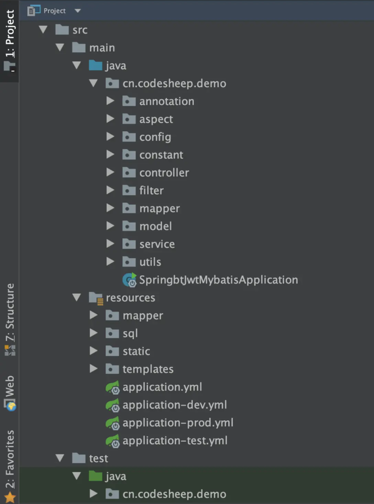

# 一、需求&设计

## 1.项目概述

### （1）项目介绍

Community Management System

### （2）模块划分

用户权限

系统管理模块：该模块包括了用户权限的管理、部门以及岗位的管理、还有字典数据和日志数据的管理。

社区模块：该模块主要管理社区内的相关信息，包括小区信息、楼栋信息、单元信息以及具体的房屋信息。

## 2.需求分析

## 3.系统设计

### （1）接口文档

> 详见接口设计文档

接口地址：

请求方式：

接口描述：

请求参数说明：

响应结果说明：

响应结果示例：

### （2）技术选型

前端技术选型：

vue-cli、Element UI库、node.js、axios

后端技术选型：

SpringBoot、Spring Security、MyBatis-plus、MySQL、Redis

### （3）库表设计

> 详见数据库设计文档

# 二、业务开发

## 1.项目搭建

### （1）相关配置文件

### （2）项目结构



```
|_annotation：放置项目自定义注解
|_aspect：放置切面代码
|_config：放置配置类
|_constant：放置常量、枚举等定义
   |__consist：存放常量定义
   |__enums：存放枚举定义
|_controller：放置控制器代码
|_filter：放置一些过滤、拦截相关的代码
|_mapper：放置数据访问层代码接口
|_model：放置数据模型代码
   |__entity：放置数据库实体对象定义
   |__dto：存放数据传输对象定义
   |__vo：存放显示层对象定义
|_service：放置具体的业务逻辑代码（接口和实现分离）
   |__intf：存放业务逻辑接口定义
   |__impl：存放业务逻辑实际实现
|_utils：放置工具类和辅助代码
```

```
|_mapper：存放mybatis的XML映射文件（如果是mybatis项目）
|_static：存放网页静态资源，比如下面的js/css/img
   |__js：
   |__css：
   |__img：
   |__font：
   |__等等
|_template：存放网页模板，比如thymeleaf/freemarker模板等
   |__header
   |__sidebar
   |__bottom
   |__XXX.html等等
|_application.yml       基本配置文件
|_application-dev.yml   开发环境配置文件
|_application-test.yml  测试环境配置文件
|_application-prod.yml  生产环境配置文件
```

### （3）IDEA连接MySQL


