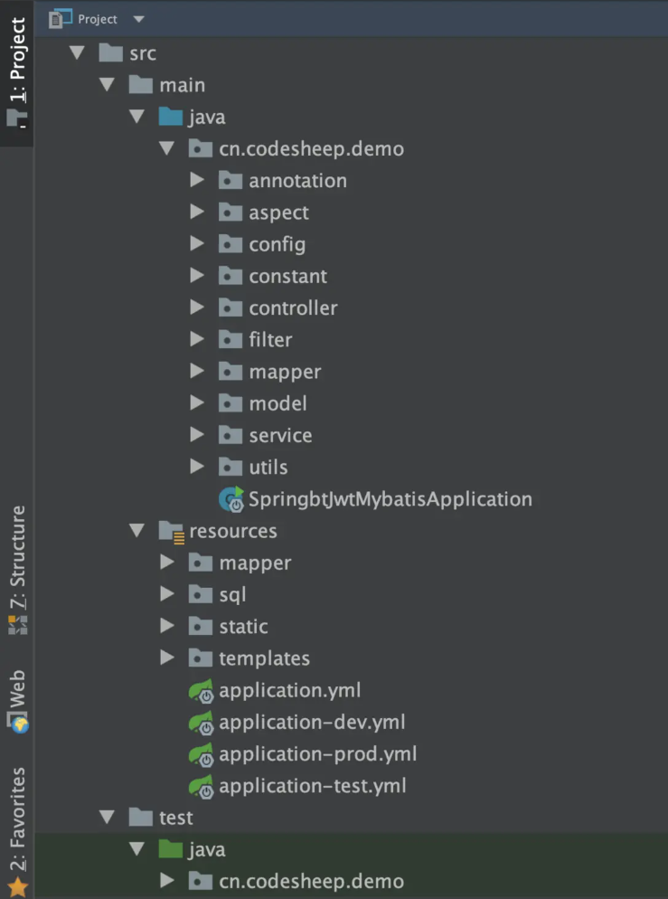

# 一、需求&设计

## 1.项目概述

### （1）项目介绍

Community Management System

### （2）模块划分

用户权限

系统管理模块：该模块包括了用户权限的管理、部门以及岗位的管理、还有字典数据和日志数据的管理。

社区模块：该模块主要管理社区内的相关信息，包括小区信息、楼栋信息、单元信息以及具体的房屋信息。

## 2.需求分析

## 3.系统设计

### （1）接口文档

> 详见接口设计文档

接口地址：

请求方式：

接口描述：

请求参数说明：

响应结果说明：

响应结果示例：

### （2）技术选型

前端技术选型：

vue-cli、Element UI库、node.js、axios

后端技术选型：

SpringBoot、Spring Security、MyBatis-plus、MySQL、Redis

### （3）库表设计

# 二、业务开发

## 1.项目搭建

### （1）相关配置文件

### （2）项目结构



```
|_annotation：放置项目自定义注解
|_aspect：放置切面代码
|_config：放置配置类
|_constant：放置常量、枚举等定义
   |__consist：存放常量定义
   |__enums：存放枚举定义
|_controller：放置控制器代码
|_filter：放置一些过滤、拦截相关的代码
|_mapper：放置数据访问层代码接口
|_model：放置数据模型代码
   |__entity：放置数据库实体对象定义
   |__dto：存放数据传输对象定义
   |__vo：存放显示层对象定义
|_service：放置具体的业务逻辑代码（接口和实现分离）
   |__intf：存放业务逻辑接口定义
   |__impl：存放业务逻辑实际实现
|_utils：放置工具类和辅助代码
```

```
|_mapper：存放mybatis的XML映射文件（如果是mybatis项目）
|_static：存放网页静态资源，比如下面的js/css/img
   |__js：
   |__css：
   |__img：
   |__font：
   |__等等
|_template：存放网页模板，比如thymeleaf/freemarker模板等
   |__header
   |__sidebar
   |__bottom
   |__XXX.html等等
|_application.yml       基本配置文件
|_application-dev.yml   开发环境配置文件
|_application-test.yml  测试环境配置文件
|_application-prod.yml  生产环境配置文件
```

### （3）IDEA连接MySQL

使用mybatis-x插件生成实体类、mapper接口、service、mapper.xml

### （4）接口统一规范

#### 响应

* **code ：响应状态码**
* **message ：响应结果描述**
* **data：返回的数据**

enum ResponseCode，class ResponseResult<T>

#### 参数校验

```xml
<dependency>
    <groupId>org.springframework.boot</groupId>
    <artifactId>spring-boot-starter-validation</artifactId>
</dependency>
```

以下是一些常用的校验注解及其用途：

1. **@NotNull**
   - 验证字段不为 `null`。
   - 适用于任何对象类型。

2. **@NotEmpty**
   - 验证字段既不为 `null` 也不为空。
   - 适用于 `CharSequence`（如 `String`）、`Collection`、`Map` 或数组。

3. **@NotBlank**
   - 验证 `CharSequence` 类型的字段不为 `null`，且必须至少包含一个非空白字符。
   - 主要用于验证字符串。

4. **@Min(value)**
   - 验证数值或其封装类型的字段值必须大于或等于指定的最小值。
   - 适用于数字类型字段。

5. **@Max(value)**
   - 验证数值或其封装类型的字段值必须小于或等于指定的最大值。
   - 适用于数字类型字段。

6. **@Size(min=, max=)**
   - 验证字段（`Collection`、`Map`、数组或字符串类型）的大小是否在指定的范围内。
   - `min` 和 `max` 属性允许你指定范围。

7. **@Email**
   - 验证字段必须是一个格式正确的电子邮件地址。
   - 适用于字符串类型字段。

8. **@Positive**
   - 验证数值必须为正数。
   - 适用于数值类型字段。

9. **@PositiveOrZero**
   - 验证数值必须为正数或零。
   - 适用于数值类型字段。

10. **@Negative**
    - 验证数值必须为负数。
    - 适用于数值类型字段。

11. **@NegativeOrZero**
    - 验证数值必须为负数或零。
    - 适用于数值类型字段。

12. **@Past**
    - 验证日期或时间值必须在当前时间之前。
    - 适用于日期和时间类型字段。

13. **@PastOrPresent**
    - 验证日期或时间值必须在当前时间或之前。
    - 适用于日期和时间类型字段。

14. **@Future**
    - 验证日期或时间值必须在当前时间之后。
    - 适用于日期和时间类型字段。

15. **@FutureOrPresent**
    - 验证日期或时间值必须在当前时间或之后。
    - 适用于日期和时间类型字段。

16. **@Pattern(regexp)**
    - 验证字符串字段是否符合指定的正则表达式。
    - `regexp` 属性用于定义正则表达式。

这些注解为不同类型的数据提供了广泛的验证支持，可应用于企业级应用的多种场景中，确保数据的完整性和准确性。

#### 异常

ExceptionCode、GlobalExceptionHandler

## 2.社区资产模块

### （1）需求分析

社区资产模块主要管理小区信息、楼栋信息、单元信息及房屋信息的数据更新与维护。

管理内容有多条件分页查询，修改信息，导入导出Excel

### （2）库表设计

### （3）多条件分页查询社区

Mybatis-plus分页插件

多表动态sql查询

### （4）新增社区

下拉地区列表

### （5）更新社区

### （6）删除社区

批量删除

### （7）导入导出Excle社区信息

Easy-POI使用

## 3.权限模块管理

## 4.系统模块开发


