#  2024年金三银四面试突击班MYSQL专题--架构

### 1、谈一下你对于MYSQL整体架构的理解

​			一般情况下，我们在进行MYSQL整体架构描述的时候分为三层，分别是客户端，服务端，存储引擎，如下图所示：

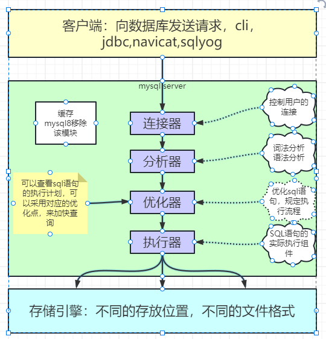

#### 1、客户端

​		客户端主要用于向MYSQL的服务端发送SQL语句，我们使用的cli，jdbc，可视化工具都可以称之为客户端

#### 2、服务端

​		MYSQL的服务端主要是对外提供MYSQL的服务，主要包含四个组件：连接器，分析器，优化器，执行器

​		**连接器**

​		在MYSQL中，支持多种通信协议，主要有以下分类：

​		（1）TCP/IP协议，任何编程语言在进行数据库连接的时候基本都是通过TCP协议连接到MYSQL服务器。

​		（2）Unix Socket协议，在Linux服务器上，进行数据库连接的时候需要理解一个物理文件，mysql.sock

​		在MYSQL中，主要使用半双工的通信方式，半双工意味着要么是客户端向服务端发送数据，要么是服务端向客户端发送数据，这两个动作不能同时发生，在进行数据传输的过程中，数据不能分成小块发送，只能一次性发送，如果发送给服务器的数据包过大，我们需要调整MYSQL Server的max_allowed_packet参数，默认值为4M

​		在MYSQL中，既支持短连接，也支持长连接，短连接就是每次操作完成之后都会进行关闭，长连接可以保持打开，方便后续的程序进行使用，对于长时间不用的连接，MYSQL服务器会自动断开：wait_timeout和interactive_timeout都用来控制连接在空闲状态下被服务器关闭之前等待的时间，wait_timeout表示非交互式连接，比如JDBC程序，interactive_timeout表示交互式连接，比如mysql的命令行。

​		在mysql中可以通过show processlist命令来查看mysql的连接，mysql的连接状态如下所示：

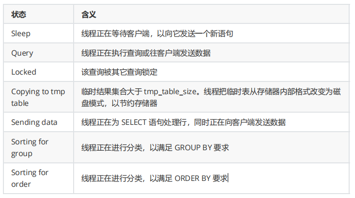

​		**分析器**

​		分析器主要用来进行词法分析和语法分析操作，将一条SQL语句转化为MYSQL可以执行的抽象语法树

​		词法分析是指将输入的SQL字符串分割成一系列的词法单元，称之为token

​		语法分析是指将词法分析产生的词法单元进行一些语法检查，并转换成一棵抽象语法树。

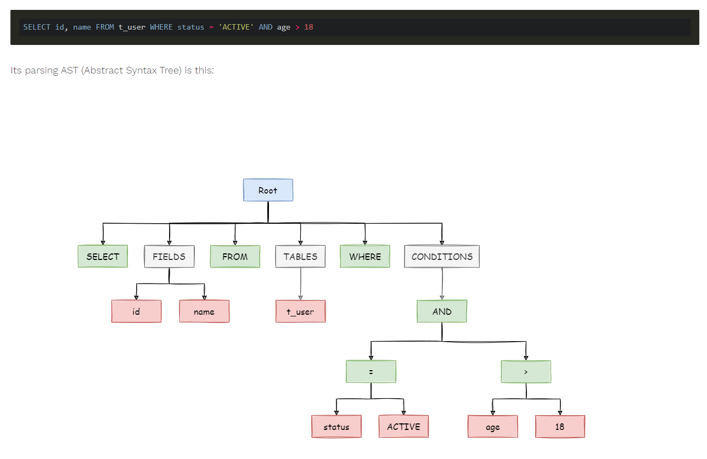

​		**优化器**

​		优化器主要用于根据抽象语法树生成不同的执行计划，然后选择一种最优的执行计划进行执行，现在的MYSQL选择的是基于成本的优化，哪种执行计划开销最小，就用哪种。

​		**执行器**

​		执行器主要用于根据优化器提供的执行计划来操作数据，并返回结果给客户端。在此过程中，执行器会调用执行引擎的API来执行数据操作并且验证用户是否具有权限执行该SQL语句，在执行完成之后将查询到的结果返回给客户端。

#### 3、存储引擎

​		在MYSQL中，我们看到的数据是以表的方式进行展示，但是实际在进行存储的时候以文件的方式进行存储，不同类型的表在磁盘中会有不同的组织和存储形式。

​		不同的数据文件在磁盘的不同组织形式。

​		通过执行show engines可以查看MYSQL中支持的存储引擎：

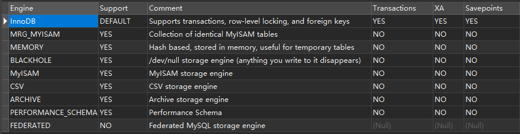

​		**MyISAM（3个文件）** 

​		These tables have a small footprint. Table-level locking limits the performance in read/write workloads, so it is often used in read-only or read-mostly workloads in Web and data warehousing configurations. 

​		应用范围比较小。表级锁定限制了读/写的性能，因此在 Web 和数据仓库配置中，它通常用于只读或以读为主的工作。 

​		特点： 

​		支持表级别的锁（插入和更新会锁表）。不支持事务。 

​		拥有较高的插入（insert）和查询（select）速度。 

​		存储了表的行数（count 速度更快）。 

​		适合：只读之类的数据分析的项目。 

​		**InnoDB（2个文件）**

​		The default storage engine in MySQL 5.7. InnoDB is a transaction-safe (ACID compliant) storage engine for MySQL that has commit, rollback, and crash-recovery capabilities to protect user data. InnoDB row-level locking (without escalation to coarser granularity locks) and Oracle style consistent nonlocking reads increase multi-user concurrency and performance. InnoDB stores user data in clustered indexes to reduce I/O for common queries based on primary keys. To maintain data integrity, InnoDB also supports FOREIGN KEY referential-integrity constraints. 

​		mysql 5.7 中的默认存储引擎。InnoDB 是一个事务安全（与 ACID 兼容）的 MySQL存储引擎，它 具有提交、回滚和崩溃恢复功能来保护用户数据。InnoDB 行级锁（不升级为更粗粒度的锁）和Oracle 风格的一致非锁读提高了多用户并发性和性能。InnoDB 将用户数据存储在聚集索引中，以减少基于主键的常见查询的 I/O。为了保持数据完整性，InnoDB 还支持外键引用完整性约束。 

​		特点： 

​		支持事务，支持外键，因此数据的完整性、一致性更高。 

​		支持行级别的锁和表级别的锁。 

​		支持读写并发，写不阻塞读。 

​		特殊的索引存放方式，可以减少 IO，提升查询效率。 

​		适合：经常更新的表，存在并发读写或者有事务处理的业务系统。 

​		**Memory（1个文件）** 

​		Stores all data in RAM, for fast access in environments that require quick lookups of non-critical data. This engine was formerly known as the HEAP engine. Its use cases are decreasing; InnoDB with its buffer pool memory area provides a general-purpose and durable way to keep most or all data in memory, and NDBCLUSTER provides fast key-value lookups for huge distributed data sets.

​		将所有数据存储在 RAM 中，以便在需要快速查找非关键数据的环境中快速访问。这个引擎以前被称为堆引擎。其使用案例正在减少；InnoDB 及其缓冲池内存区域提供了一种通用、持久的方法来 将大部分或所有数据保存在内存中，而 ndbcluster 为大型分布式数据集提供了快速的键值查找。 

​		特点： 

​		把数据放在内存里面，读写的速度很快，但是数据库重启或者崩溃，数据会全部消失。只适合做临时表。默认使用哈希索引，将表中的数据存储到内存中。 

​		**CSV（3个文件）** 

​		Its tables are really text files with comma-separated values. CSV tables let you import or dump data in CSV format, to exchange data with scripts and applications that read and write that same format. Because CSV tables are not indexed, you typically keep the data in InnoDB tables during normal operation, and only use CSV tables during the import or export stage. 

​		它的表实际上是带有逗号分隔值的文本文件。csv 表允许以 csv 格式导入或转储数据，以便与读写相同格式的脚本和应用程序交换数据。因为 csv 表没有索引，所以通常在正常操作期间将数据保存在 innodb表中，并且只在导入或导出阶段使用 csv 表。 

​		特点： 

​		不允许空行，不支持索引。格式通用，可以直接编辑，适合在不同数据库之间导入导出。 

​		**Archive（2个文件）** 

​		These compact, unindexed tables are intended for storing and retrieving large amounts of seldom-referenced historical, archived, or security audit information. 

​		这些紧凑的未索引表用于存储和检索大量很少引用的历史、存档或安全审计信息。 

​		特点： 

​		不支持索引，不支持 update delete。

### 2、聊一下innodb存储引擎的整体架构图

在mysql的早期版本中，默认的存储引擎是Myisam，后来由Innobase Oy公司开发出innodb，作为插件引擎集成在mysql中，因其出色的性能在mysql5.5版本之后开始作为默认的存储引擎。Innodb是第一个完整支持ACID事务的mysql存储引擎，特点是行锁设计，支持MVCC，支持外键，提供一致性非锁定读，非常适合OLTP场景。

innodb存储引擎架构包含内存结构和磁盘结构两大部分，整体架构图如下：

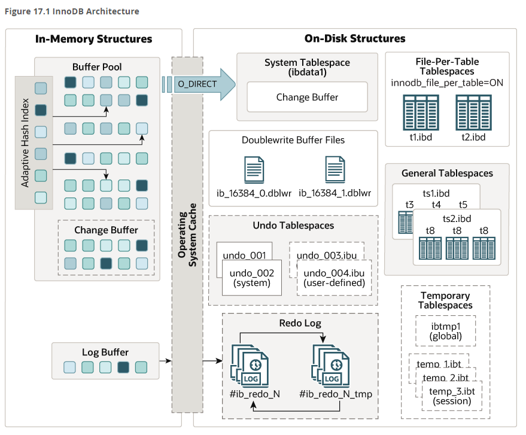

#### In-Memory Structure

##### **Buffer Pool**

buffer pool是Innodb在访问表和索引数据时缓存的主要内存区域。缓冲池允许直接从内存访问频繁使用的数据，这种方式加快了数据的处理速度，在某些专用的服务器上，通常会将80%的物理内存分配给buffer pool。

为了提高大容量读取的效率，缓冲池被划分为可能包含多行的页面，为了提高缓存管理的效率，缓冲池被实现问我页面链表，很少使用的数据使用最近最少算法（LRU）从缓存中淘汰。

 数据库中的缓冲池是通过 LRU（Latest Recent Used，最近最少使用）算法来进行管理的。即最频繁使用的页在 LRU 列表的前端，而最少使用的页在 LRU 列表的尾端。当缓冲池不能存放新读取到的页时，将首先释放 LRU 列表中尾端的页。 

 在 InnoDB 存储引擎中，缓冲池中页的大小默认为 16KB，同样使用 LRU 算法对缓冲池进行管理。稍有不同的是 InnoDB 存储引擎对传统的 LRU 算法做了一些优化。在 InnoDB 的存储引擎中，LRU 列表中还加入了 midpoint 位置。新读取到的页，虽然是最新访问的页，但并不是直接放入到 LRU 列表的首部，而是放入到 LRU 列表的 midpoint 位置。这个算法在 InnoDB 存储引擎下称为 midpoint insertion strategy。在默认配置下，该位置在 LRU 列表长度的 5/8 处。 

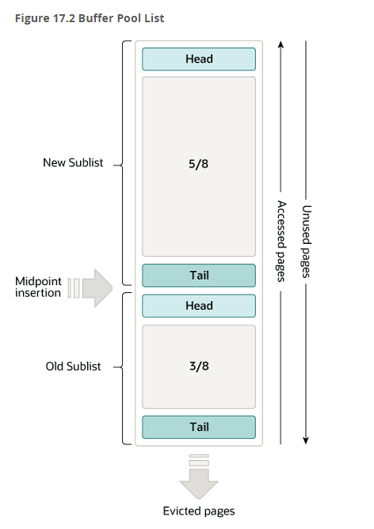

在innodb存储引擎中，把midpoint之后的列表称之为旧列表，之前的列表称之为新列表，每一个子列表都有头部和尾部，可以把新列表里的数据理解为活跃的热点数据。

默认情况下

1. Old 链表占整个LRU 链表的比例是3/8。该比例由innodb_old_blocks_pct控制，默认值是37（3/8*100）。该值取值范围为5~95，为全局动态变量。
2. 当新的页被读取到Buffer Pool里面的时候，和传统的LRU算法插入到LRU链表头部不同，Innodb LRU算法是将新的页面插入到Yong 链表的尾部和Old 链表的头部中间的位置，这个位置叫做Mid Point，如上图所示。
3. 频繁访问一个Buffer Pool的页面，会促使页面往Young链表的头部移动。如果一个Page在被读到Buffer Pool后很快就被访问，那么该Page会往Young List的头部移动，但是如果一个页面是通过预读的方式读到Buffer Pool，且之后短时间内没有被访问，那么很可能在下次访问之前就被移动到Old List的尾部，而被驱逐了。
4. 随着数据库的持续运行，新的页面被不断的插入到LRU链表的Mid Point，Old 链表里的页面会逐渐的被移动Old链表的尾部。同时，当经常被访问的页面移动到LRU链表头部的时候，那些没有被访问的页面会逐渐的被移动到链表的尾部。最终，位于Old 链表尾部的页面将被驱逐。

如果一个数据页已经处于Young 链表，当它再次被访问的时候，只有当其处于Young 链表长度的1/4(大约值)之后，才会被移动到Young 链表的头部。这样做的目的是减少对LRU 链表的修改，因为LRU 链表的目标是保证经常被访问的数据页不会被驱逐出去。

innodb_old_blocks_time 控制的Old 链表头部页面的转移策略。该Page需要在Old 链表停留超过innodb_old_blocks_time 时间，之后再次被访问，才会移动到Young 链表。这么操作是避免Young 链表被那些只在innodb_old_blocks_time时间间隔内频繁访问，之后就不被访问的页面塞满，从而有效的保护Young 链表。

在全表扫描或者全索引扫描的时候，Innodb会将大量的页面写入LRU 链表的Mid Point位置，并且只在短时间内访问几次之后就不再访问了。设置innodb_old_blocks_time的时间窗口可以有效的保护Young List，保证了真正的频繁访问的页面不被驱逐。

innodb_old_blocks_time 单位是毫秒，默认值是1000。调大该值提高了从Old链表移动到Young链表的难度，会促使更多页面被移动到Old 链表，老化，从而被驱逐。

当扫描的表很大，Buffer Pool都放不下时，可以将innodb_old_blocks_pct设置为较小的值，这样只读取一次的数据页就不会占据大部分的Buffer Pool。例如，设置innodb_old_blocks_pct = 5，会将仅读取一次的数据页在Buffer Pool的占用限制为5％。

当经常扫描一些小表时，这些页面在Buffer Pool移动的开销较小，我们可以适当的调大innodb_old_blocks_pct，例如设置innodb_old_blocks_pct = 50。

在SHOW ENGINE INNODB STATUS 里面提供了Buffer Pool一些监控指标，有几个我们需要关注一下：

1. youngs/s：该指标表示的是每秒访问Old 链表中页面，使其移动到Young链表的次数。如果MySQL实例都是一些小事务，没有大表全扫描，且该指标很小，就需要调大innodb_old_blocks_pct 或者减小innodb_old_blocks_time，这样会使得Old List 的长度更长，Old页面被移动到Old List 的尾部消耗的时间会更久，那么就提升了下一次访问到Old List里面的页面的可能性。如果该指标很大，可以调小innodb_old_blocks_pct，同时调大innodb_old_blocks_time，保护热数据。
2. non-youngs/s：该指标表示的是每秒访问Old 链表中页面，没有移动到Young链表的次数，因为其不符合innodb_old_blocks_time。如果该指标很大，一般情况下是MySQL存在大量的全表扫描。如果MySQL存在大量全表扫描，且这个指标又不大的时候，需要调大innodb_old_blocks_time，因为这个指标不大意味着全表扫描的页面被移动到Young 链表了，调大innodb_old_blocks_time时间会使得这些短时间频繁访问的页面保留在Old 链表里面。

每隔1秒钟，Page Cleaner线程执行LRU List Flush的操作，来释放足够的Free Page。innodb_lru_scan_depth 变量控制每个Buffer Pool实例每次扫描LRU List的长度，来寻找对应的脏页，执行Flush操作。

##### Change Buffer

 在 MySQL5.5 之前，叫插入缓冲（Insert Buffer），只针对 INSERT 做了优化；现在对 DELETE 和 UPDATE 也有效，叫做写缓冲（Change Buffer）。它是一种应用在**非唯一普通索引页**（non-unique secondary index page）不在缓冲池中，对页进行了写操作，并不会立刻将磁盘页加载到缓冲池，而仅仅记录缓冲变更（Buffer Changes），等未来数据被读取时，再将数据合并（Merge）恢复到缓冲池中的技术。写缓冲的目的是降低写操作的磁盘 IO，提升数据库性能。 

数据的修改分为两个情况：

1. 当修改的数据页在缓冲池时

通过 LRU、Flush List 的管理，数据库不是直接写入磁盘中，是先将 redo log 写入到磁盘，再通过 checkpoint 机制，将这些 “脏数据页” 同步地写入磁盘，等于是将这期间发生的 n 次的落盘合并成了一次落盘。因为有 redo log 是落盘的，所以即使数据库崩溃，缓存中的数据页全部丢失，也可以通过 redo log 将这些数据页找回来。

redo log 是数据库用来在崩溃的时候进行数据恢复的日志，redo log 的写入策略可以通过参数控制，并不一定是每一次写操作之后立即落盘 redo log，在部分参数下，redo log 可能是每秒集中写入一次，也有可能采取其他落盘策略，但是无论采用什么方式，redo log 的量都是不会减少的，与数据写入的覆盖性不同，后一条 redo log 是不会覆盖前一条的，而是增量形式的，因此写 redo log 的操作，等同于是对磁盘某一小块区域的顺序 I/O，而不像数据落盘一样的随机 IO 在磁盘里写入，需要磁盘在多个地方移动磁头。所以 redo log 的落盘是 IO 操作当中消耗较少的一种，比数据直接刷回磁盘要优很多。

2. 当修改的数据页不在缓冲池时，不用写缓冲至少需要下面的三步：

- 先把需要的索引页，从磁盘加载到缓冲池，一次磁盘随机读操作；
- 修改缓冲池中的页，一次内存操作；
- 写入 redo log ，一次磁盘顺序写操作；

在没有命中缓冲池的时候，至少多产生一次磁盘 IO，对于写多读少的业务场景，性能损耗是很高的

加入写缓冲优化后，流程优化为：

- 在写缓冲中记录这个操作，一次内存操作；
- 写入 redo log，一次磁盘顺序写操作；

其性能与这个索引页在缓冲池中，相近。

3. 如何保证数据的一致性？

- 数据库异常奔溃，能够从 redo log 中恢复数据；
- 写缓冲不只是一个内存结构，它也会被定期刷盘到写缓冲系统表空间；
- 数据读取时，有另外的流程，将数据合并到缓冲池；

下一次读到该索引页：

- 载入索引页，缓冲池未命中，这次磁盘 IO 不可避免；
- 从写缓冲读取相关信息；
- 恢复索引页，放到缓冲池 LRU 和 Flush 里；（在真正被读取时，才会被加载到缓冲池中）

4. 为什么写缓冲优化，仅适用于非唯一普通索引页呢？

InnoDB 里有聚集索引（Clustered Index）) 和普通索引 (Secondary Index) 两种。如果索引设置了唯一（Unique）属性，在 进行修改操作 时， InnoDB 必须进行唯一性检查 。也就是说， 索引页即使不在缓冲池，磁盘上的页读取无法避免（否则怎么校验是否唯一！？）

此时就应该直接把相应的页放入缓冲池再进行修改。

5. 除了数据页被访问，还有哪些场景会触发刷写缓冲中的数据呢？

- 有一个后台线程，会认为数据库空闲时；
- 数据库缓冲池不够用时；
- 数据库正常关闭时；
- redo log 写满时；（几乎不会出现 redo log 写满，此时整个数据库处于无法写入的不可用状态）

6. 什么业务场景，适合开启 InnoDB 的写缓冲机制？

- 数据库大部分是非唯一索引；
- 业务是写多读少，或者不是写后立刻读取；

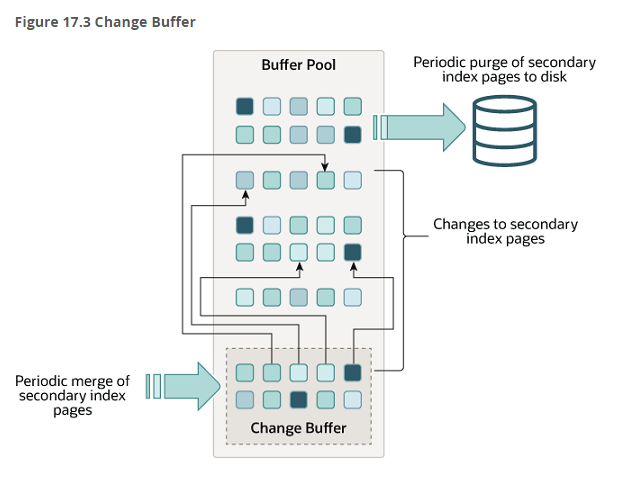

#####  Adaptive Hash Index

Innodb存储引擎会监控对表上各索引页的查询，如果观察到建立哈希索引可以带来速度提升，则建立哈希索引，称之为自适应哈希索引。自适应哈希是通过缓冲池的B+树页构造而来，因此建立的速度很快，不需要对整张表创建哈希索引，Innodb存储引擎会自动根据访问的频率和模式来自动的为某些热点页建立哈希索引。可以通过    [`innodb_adaptive_hash_index`](https://dev.mysql.com/doc/refman/8.0/en/innodb-parameters.html#sysvar_innodb_adaptive_hash_index) 参数来开启和关闭自适应哈希。

##### Log Buffer

Log Buffer是存储要写入磁盘上的日志文件的数据的内存区域，日志缓冲区的大小由innodb_log_buffer_size变量决定的，默认是16M，日志缓冲区的内容定期刷新到磁盘。较大的日志缓冲区可以运行大型事务，而无需再事务提交之前将重做日志数据写入磁盘。因此，如果有更新、插入或者删除许多行的事务，则增加日志缓冲区的大小可以节省磁盘IO。

可以通过 innodb_flush_log_at_trx_commit参数来控制如何将日志缓冲区的内容写入并刷新到磁盘，默认是1

1、参数为 0 时，表示事务 commit 不立即把 redo log buffer 里的数据刷入磁盘文件的，而是依靠 InnoDB 的主线程每秒（此时间由参数 innodb_flush_log_at_timeout 控制，默认 1s）执行一次刷新到磁盘。此时可能你提交事务了，结果 mysql 宕机了，然后此时内存里的数据全部丢失。

2、 参数为 1 时，表示事务 commit 后立即把 redo log buffer 里的数据写入到 os buffer 中，并立即执行 fsync () 操作 

3、  参数为 2 时，表示事务 commit 后立即把 redo log buffer 里的数据写入到 os buffer 中，但不立即 fsync () SQL 执行过程 

 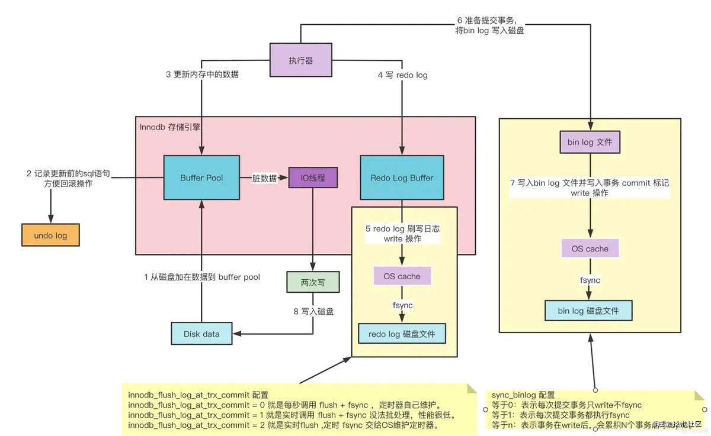 

#### On-Disk Structures

Innodb存储引擎的逻辑存储结构是将所有的数据都逻辑的放在了一个空间中，这个空间中的文件就是实际存在的物理文件（ibd文件）。默认情况下，一个表占用一个表空间，表空间可以看做是Innodb存储引擎逻辑结构的最高层，所有的数据都放在表空间中。

表空间分为系统表空间，临时表空间，通用表空间，undo表空间和独立表空间。

##### 系统表空间

 系统表空间可以对应文件系统上一个或多个实际的文件，默认情况下， InnoDB 会在数据目录下创建一个名为ibdata1，大小为 12M 的文件，这个文件就是对应的系统表空间在文件系统上的表示。这个文件是可以自扩展的，当不够用的时候它会自己增加文件大小。需要注意的一点是，在一个 MySQL 服务器中，系统表空间只有一份。

可以通过innodb_data_file_path变量设置

##### 独立表空间

 在 MySQL5.6.6 以及之后的版本中， InnoDB 并不会默认的把各个表的数据存储到系统表空间中，而是为每一个表建立一个独立表空间，也就是说我们创建了多少个表，就有多少个独立表空间。使用独立表空间来存储表数据的话，会在该表所属数据库对应的子目录下创建一个表示该独立表空间的文件，文件名和表名相同，只不过添加了一个.ibd 的扩展名而已。 

可以通过变量innodb_file_per_table变量设置

##### 通用表空间

通用表空间是使用create tablespace语法创建的共享表空间，主要有以下功能：

1、跟系统表空间类似，通用表空间是能够存储多个表的数据的共享表空间

2、与独立表空间相比，通用表空间具有潜在的内存优势：通用表空间多个表共享一个表空间，所以消耗更少的内存用于表空间元数据，独立表空间需要更多的内存用于表空间元数据

3、数据文件可以放置在与mysql目录相关或独立的目录中

4、通用表空间支持所有的行格式以及相关的特性

5、create table语句可以使用tablespace选项在通用表空间，独立表空间，或者系统表空间创建表

6、create table语句可以使用tablespace选项在通用表空间，独立表空间，或者系统表空间移动表

##### Undo 表空间

在初始化mysql实例的时候，会创建两个默认的undo表空间，用于事务异常时进行数据回滚，默认的undo表空间文件名称是undo_001和undo_002。如果默认的表空间不足以支撑需求，那么可以增加、删除和移动undo表空间

##### 临时表空间

临时表空间分为会话临时表空间和全局临时表空间

**会话临时表空间**

会话临时表空间用于存储用户创建的临时表或由优化器创建的内部临时表。

当一个会话首次请求创建磁盘上的临时表时，服务器会从临时表空间池中分配临时表空间给会话，分配给会话的临时表空间将用于会话创建的所有磁盘上的临时表。

当会话断开连接时，其临时表空间被截断并释放会池中。

一个会话最多分配两个临时表空间，一个用于用户创建的临时表，另一个用于优化器创建的内部临时表

服务器启动时将创建一个包含10个临时表空间的池，池的大小永远不会缩小，表空间会根据需要自动添加到池中，当服务器正常关闭或者初始化终止时，临时表空间将被移除。

**全局临时表空间**

全局临时表空间用于存储对用户创建的临时表所做更改的回滚段。

全局临时表空间在正常关闭或初始化终止时被移除，并在服务器启动时重新创建

全局临时表空间在创建时接受一个动态生成的空间ID

如果无法创建全局临时表空间，服务器将拒绝启动，如果服务器意外停止，全局临时表空间不会被移除

重新启动mysql服务器会自动移除并重新创建全局临时表空间，回收全局临时表空间数据文件占用的磁盘空间

##### Doublewrite Buffer Files

我们常见的服务器一般是linux系统，linux文件系统页的默认大小是4KB，而mysql的页大小默认是16KB，mysql程序一般是运行在linux操作系统上的，所以当跟操作系统进行交互的时候，mysql中一页数据刷到磁盘，就要写4个文件系统里的页，如下图所示：

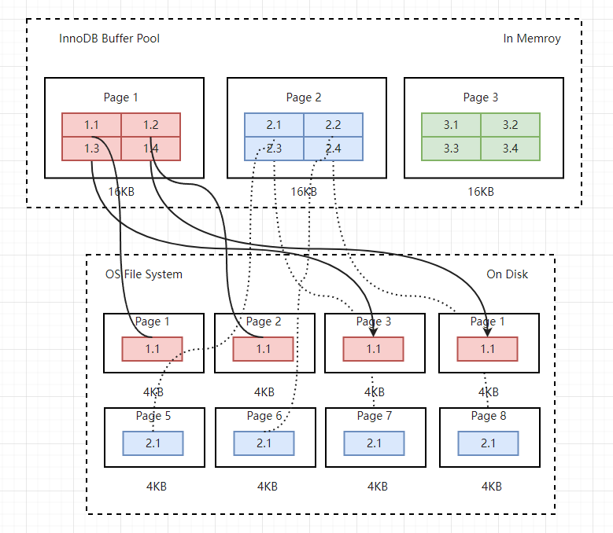

注意，这个刷页的操作并不是原子操作，比如我们操作第二个页的时候，服务器断电了，那么就会有问题，出现页数据损坏的情况，此时是无法通过redolog来进行修复的，因为redolog中记录的是对页的物理操作，而不是页面的全量记录，当发生部分页写入的时候，出现的是未修改的数据，此时redolog是无能为力的。

Doublewrite Buffer的出现就是为了解决上面的这种，给Innodb提供了数据页的可靠性，虽然名字带了Buffer，但是实际上是由内存+磁盘的结构：

内存结构：Doublewrite Buffer内存结构由128个页组成，大小是2MB

磁盘结构：Doublewrite Buffer磁盘结构由128个页（2个区组成，每个区1MB），大小是2MB

 Doublewrite Buffer的原理是，再把数据页写到数据文件之前，InnoDB先把它们写到一个叫「**doublewrite buffer（双写缓冲区）**」的共享表空间内，在写doublewrite buffer完成后，InnoDB才会把页写到数据文件适当的位置。 

 如果在写页的过程中发生意外崩溃，InnoDB会在doublewrite buffer中找到完好的page副本用于恢复。 

DoubleWrite Buffer原理图如下所示：

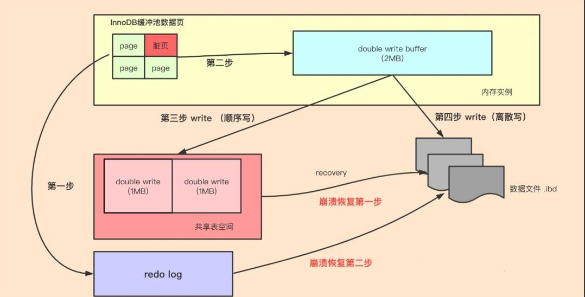

1、页数据先通过memcpy函数拷贝到内存中的DoubleWrite Buffer中

2、DoubleWrite Buffer的内存里的数据页会fsync刷到DoubleWrite Buffer的磁盘上，分两次写入，每次写1MB

3、 如果操作系统在将页写入磁盘的过程中发生了崩溃，在恢复过程中，InnoDB存储引擎可以从共享表空间中的Double write中找到该页的一个副本，将其复制到表空间文件，再应用redo日志 

那么如何利用Doublewrite Buffer来进行数据恢复呢？主要由三种情况：1、脏数据写磁盘成功，这种情况是最常见的，这种情况不需要Doublewrite Buffer，2、表空间写失败，如果写表空间失败，那么这些数据不会写到数据文件中，数据库认为这次刷盘没有发生过，mysql此时会载入原始数据，不做任何修改，3、脏数据刷数据文件失败，此时写表空间成功了，但是写数据文件失败，在恢复的时候，mysql会比较整个页面，如果不对的话，直接从Doublewrite Buffer中找到该页的副本，并将其复制到数据文件中，然后再进行redolog的操作。

##### Redo Log

redolog记录数据库的变更，数据库崩溃后，会从redolog中获取事务信息，进行系统恢复，在5.x版本中，redolog在磁盘上表现为ib_logfile0和ib_logfile1.在mysql8版本之后以#ib_redo_N来记录

#### Tablespace结构

从Innodb存储引擎的逻辑结构看，所有的数据都被逻辑地放在一个空间内，称之为表空间，表空间又由 段（segment），区（extent），页（page）组成。页在一些文档中有时候也称为块（block） ，如下图所示：

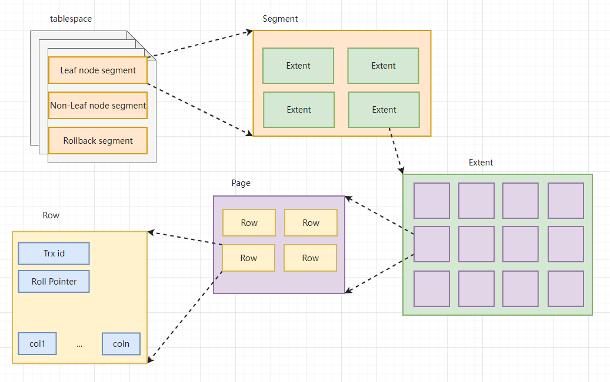

- **段（segment）**

  - 表空间由段组成，常见的段有**数据段、索引段、回滚段**等。
  - InnoDB存储引擎表是索引组织的，因此数据即索引，索引即数据。**数据段即为B+树的叶子结点，索引段即为B+树的非索引结点**。
  - 在InnoDB存储引擎中对段的管理都是由**引擎自身所完成**，DBA不能也没必要对其进行控制。

  **区（extent）**

  - 区是由**连续页**组成的空间，在任何情况下每个区的大小都为**1MB**。
  - 为了**保证区中页的连续性**，InnoDB存储引擎**一次从磁盘申请4~5个区**。
  - 默认情况下，InnoDB存储引擎页的大小为**16KB**，一个区中一共**64个连续**的区。

  **页（page）**

  - **页是InnoDB磁盘管理的最小单位**。
  - 在InnoDB存储引擎中，默认每个页的大小为**16KB**。
  - 从InnoDB1.2.x版本开始，可以通过参数**innodbpagesize**将页的大小设置为4K，8K，16K。
  - InnoDB存储引擎中，常见的页类型有：**数据页，undo页，系统页，事务数据页，插入缓冲位图页，插入缓冲空闲列表页**等。

#### 页结构

innodb数据页由以下7部分组成，如图所示：

 其中**File Header、Page Header、File Trailer**的大小是固定的，分别为**38，56，8**字节，这些空间用来标记该页的一些信息，如**Checksum，数据页所在B+树索引的层数**等。**User Records、Free Space、Page Directory**这些部分为**实际的行记录**存储空间，因此大小是动态的。 

 下边我们用表格的方式来大致描述一下这7个部分： 

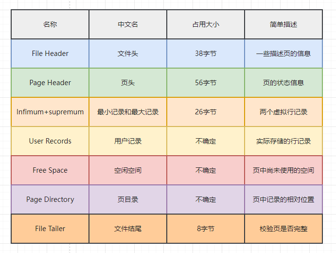

**记录在页中的存储流程图**

 每当我们插入一条记录，都会从Free Space部分，也就是尚未使用的存储空间中申请一个记录大小的空间划分到User Records部分，当Free Space部分的空间全部被User Records部分替代掉之后，也就意味着这个页使用完了，如果还有新的记录插入的话，就需要去申请新的页了，这个过程的图示如下： 

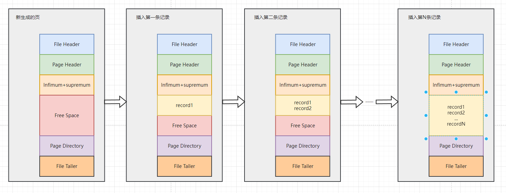

**不同的Innodb页构成的数据结构图**

 一张表中可以有成千上万条记录，一个页只有16KB，所以可能需要好多页来存放数据。不同页其实构成了一条**双向链表**，File Header是InnoDB页的第一部分，它的**FILPAGEPREV和FILPAGENEXT**就分别代表本页的上一个和下一个页的页号，即链表的上一个以及下一个节点指针。 

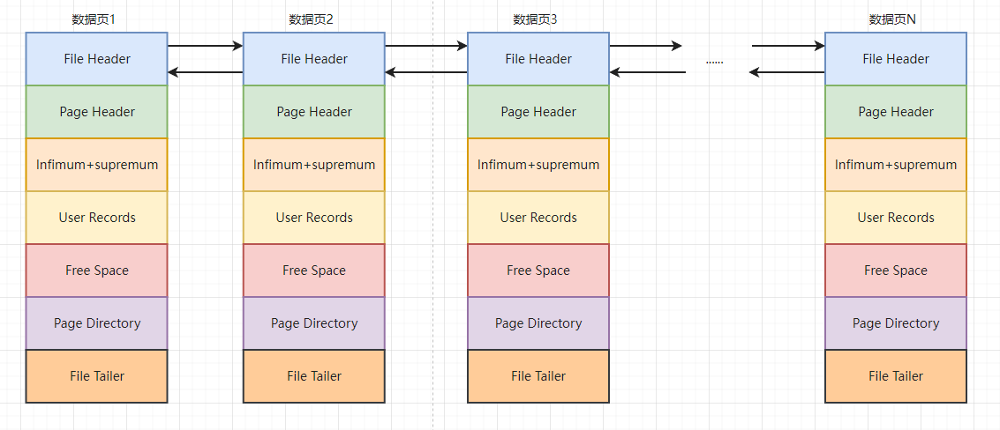

### 3、分库分表相关的问题

#### （1）为什么要进行分库操作？

分库指的是将存储在一个数据库中的数据拆分到多个数据库中进行存储。主要原因如下:

1、性能提升：随着业务量的增长，单一数据库可能会面临性能瓶颈。分库可以将数据和请求分散到多个数据库上，从而提高系统的吞吐量和响应时间

2、容量扩展：单一数据库可能收到硬件资源（磁盘，CPU，内存）的限制，分库可以将数据分散到多个数据库上，从而突破这些限制，实现容量的线性扩展

3、可靠性提升：分库可以提高系统的可靠性。当某个数据库出现故障时，其他数据库仍然可以正常工作，从而保证业务的连续性 

4、安全性提升：分库可以降低数据泄露的风险。通过将数据分散到多个数据库上，即使某个数据库被攻破，攻击者也无法获取全部数据 

5、运维便利性：分库可以提高运维的便利性。每个数据库可以独立进行备份、恢复、监控等操作，降低了运维的复杂性和难度 

#### （2）为什么要进行分表操作？

分表操作是指将一个大表按照一定的规则分解成多张具有独立空间的表的过程。主要原因如下：

1、性能提升：随着业务的发展，数据库中的数据量会不断增长，导致单表的数据量变得非常大。当表的数据量过大时，查询和插入操作会变得非常耗时，性能低下。分表可以将数据分散到多个表中，减少单个表的数据量，从而提高查询和插入的效率。

2、减轻IO和CPU压力：当单表数据量过大时，查询操作可能需要扫描大量的数据，导致磁盘IO和网络IO的压力增大，同时也可能增加CPU的负担。分表可以将数据分散到多个表中，减少单次查询需要扫描的数据量，从而减轻IO和CPU的压力。

3、方便数据管理：随着数据量的增长，单表的数据管理可能会变得非常复杂。分表可以将数据按照一定的规则进行划分，使得数据管理变得更加简单和清晰。

4、 避免锁竞争：在并发访问较高的情况下，单表可能会成为锁竞争的热点，导致性能下降。分表可以将数据分散到多个表中，减少锁竞争的可能性。

#### （3）如何选择分片键？

分片键的选择并没有啥具体的原则，重点还是结合业务和需求来进行判断，比如可以进行如下选择和判断：

1、选择合适的业务逻辑主体：比如面向用户的应用，可以使用用户id作为分片键，在电商系统重，可以选择订单、卖家等作为分片键

2、如果没有特别明确的业务主体，那么可以考虑数据分布和访问均衡度，尽可能的使每个分表重的数据相对均衡的分布在不同的物理分表中，比如在电商系统中，可以按照商品id和用户id将数据均衡的分布，在金融行业，可以按照用户id或者交易时间进行分表，在物流行业，可以按照订单id或者运输轨迹进行分布，在社交媒体行业，可以按照用户id或者发布时间进行分布

注意：时间类型是一个很好的分片键选择，可以将数据均衡分布

#### （4）非分片键如何查询？

当按照某一个或者某几个分片键进行分库分表之后，在一些业务场景，难免需要按照非分片键进行查询，此时可以按照如下方式进行查询：

1、对所有库所有表进行遍历查询，找到符合条件的记录，此时的效率一定很低，不建议使用

2、将需要查询的数据信息同步到ES中，在ES中进行高效查询，此方式效率较高，但是需要进行mysql和ES的数据同步

3、可以考虑在不同的分表中存储一些冗余数据，能够在此分表上直接进行查询，而不需要跨表查询，比如，在一个有大量用户但是活跃用户较少的系统中，可以将活跃用户的数据冗余在单独的表中，查询的时候直接查询这张表，而不需要扫描全部的表

4、可以考虑使用基因法，比如在电商系统中，让同一个用户的所有订单全部存储到一个表中，且查询的时候既可以通过用户id，也可以通过订单id。

#### （5）如何实现跨节点的join关联

在没有分库分表的场景中，join关联多张表的时候非常简单，但是分库分表之后，相关联的表可能不再同一个数据库中，那么如何解决跨库的join操作呢？

1、字段冗余：把需要关联的字段放入主表中，避免关联操作；比如订单表保存了卖家ID（sellerId），你把卖家名字sellerName也保存到订单表，这就不用去关联卖家表了。这是一种空间换时间的思想。

2、全局表：比如系统中所有模块都可能会依赖到的一些基础表（即全局表），在每个数据库中均保存一份。

3、数据抽象同步：比如A库中的a表和B库中的b表有关联，可以定时将指定的表做同步，将数据汇合聚集，生成新的表。一般可以借助ETL工具。

4、应用层代码组装：分开多次查询，调用不同模块服务，获取到数据后，代码层进行字段计算拼装。

#### （6）分库后，事务问题如何解决？

分库分表后，假设两个表在不同的数据库中，那么本地事务已经无效了，此时需要考虑分布式事务，常见的分布式事务解决方案如下：

1、两阶段提交

2、三阶段提交

3、TCC

4、saga

5、本地消息表

6、最大努力通知

#### （7）分库分表的分页问题

**方案1（全局视野法）：**

在各个数据库节点查到对应结果后，在代码端汇聚再分页。这样优点是业务无损，精准返回所需数据；缺点则是会返回过多数据，增大网络传输，也会造成空查，

> 比如分库分表前，你是根据创建时间排序，然后获取第2页数据。如果你是分了两个库，那你就可以每个库都根据时间排序，然后都返回2页数据，然后把两个数据库查询回来的数据汇总，再根据创建时间进行内存排序，最后再取第2页的数据。

**方案2（业务折衷法-禁止跳页查询）：**

这种方案需要业务妥协一下，只有上一页和下一页，不允许跳页查询了。

> 这种方案，查询第一页时，是跟全局视野法一样的。但是下一页时，需要把当前最大的创建时间传过来，然后每个节点，都查询大于创建时间的一页数据，接着汇总，内存排序返回。

#### （8）垂直分库、水平分库、垂直分表、水平分表的区别

垂直分库：将原本一个数据库中的表按照业务功能分布到不同的数据库中，每个数据库只包含部分表

水平分库：将一个数据库中的表按照数据行进行拆分，分不到多个数据库中国，每个数据库都包含完成的表结构，但只包含部分数据

垂直分表：将一个数据库中的列拆分到不同的表中，这些表具有相同的主键，但包含不同的列

水平分表：将一个数据库表中的数据拆分到多个相同结构的表中，每个表都包含部分数据行，通常按照一定的规则拆分

#### （9）分表要停服嘛？不停服怎么做？

不用停服。不停服的时候，应该怎么做呢，主要分五个步骤：

1、编写代理层，加个开关（控制访问新的DAO还是老的DAO，或者是都访问），灰度期间，还是访问老的DAO。

2、发版全量后，开启双写，既在旧表新增和修改，也在新表新增和修改。日志或者临时表记下新表ID起始值，旧表中小于这个值的数据就是存量数据，这批数据就是要迁移的。

3、通过脚本把旧表的存量数据写入新表。

4、停读旧表改读新表，此时新表已经承载了所有读写业务，但是这时候不要立刻停写旧表，需要保持双写一段时间。

5、当读写新表一段时间之后，如果没有业务问题，就可以停写旧表啦
