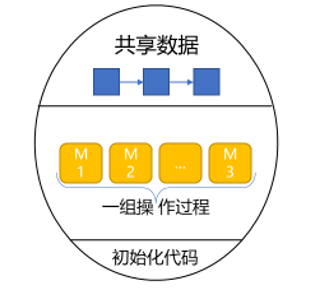
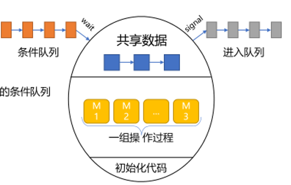
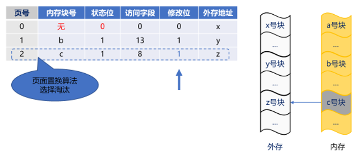
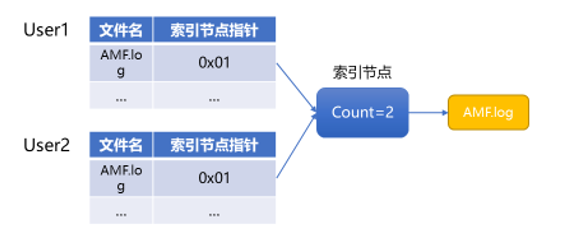
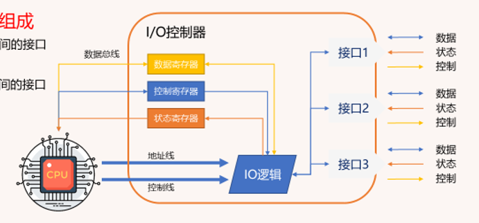
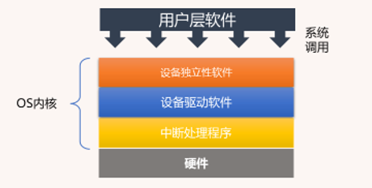

- [ ] 理解操作系统的概念、特征、功能和提供的服务，掌握操作系统的运行机制和体系结构
- [ ] 理解进程、线程的概念，掌握进程的状态及其转换
- [ ] 理解处理机调度的概念和基本准则，掌握调度方式、时机、切换与过程，掌握典型的调度算法
- [ ] 能够描述出进程同步的概念，掌握实现临界区互斥的基本方法，掌握信号量机制
- [ ] 理解死锁的概念，能够说出常见的死锁处理策略，掌握死锁的预防和避免，能够检测并解除死锁
- [ ] 理解内存管理及相关的概念，掌握连续/非连续分配管理方式
- [ ] 理解虚拟内存及相关概念，掌握请求分页管理方式
- [ ] 掌握常用的页面置换算法，理解页面分配策略
- [ ] 理解文件、目录、文件共享、文件保护、访问控制等概念，掌握文件及目录实现
- [ ] 能够描述出磁盘的结构，掌握常用的磁盘调度算法
- [ ] 理解I/O相关的基本概念，掌握I/O控制方式
- [ ] 理解I/O调度的概念，能够说出缓存相关概念，掌握I/O设备的分配与回收，掌握假脱机技术

# 一、操作系统概述

## 1. 基本概念

### （1）什么是操作系统

操作系统（Operating System, 简称OS）是一种系统软件，主要功能是管理和控制计算机硬件与软件资源，提供给用户和其他软件方便的交互界面和环境。它是计算机系统中最基础的软件，没有它，用户几乎不能有效地使用计算机。

操作系统的主要任务包括管理计算机的硬件资源（如CPU、内存、硬盘、输入输出设备等），管理文件系统，以及处理外围设备的输入输出控制。它也负责运行其他所有的程序，称为应用程序。

### （2）操作系统的特征

操作系统的主要特征包括：

- **并发（Concurrency）**：支持多个进程同时运行，利用CPU的多核特性进行多任务处理。
  
- **共享（Sharing）**：允许多个进程访问同一资源，如打印机、文件等，同时采用各种方法来解决资源访问冲突。

- **虚拟（Virtualization）**：提供一种抽象的接口隐藏物理硬件的复杂性，使用户和应用程序感觉到资源（如内存、CPU）似乎无限大，独立于实际的物理资源。

- **异步（Asynchrony）**：系统中的进程可以以不可预知的速率和顺序进展，操作系统需要保证这种不确定性不会影响到用户和程序的使用。

### （3）操作系统的目标和功能

操作系统的主要目标和功能可以归纳为：

- **资源的管理者**：高效和公平地分配计算机资源，管理各种硬件资源，包括处理器、内存、磁盘等。

- **用户与计算机硬件系统之间的接口**：提供用户接口，如命令行、图形界面等，使用户可以方便地与计算机交互。

- **扩充机器（Machine Extension）**：操作系统使得计算机的复杂和底层硬件对于用户而言更加简单和透明，增加了机器的易用性和可访问性。

感谢指正，按照您的格式要求进行调整，下面是正确的整理：

## 2. 操作系统的发展与分类

### （1）手工操作阶段（无操作系统）

在计算机早期，操作完全由人工完成，包括物理地切换电缆和设置开关以编程和输入数据。这一阶段没有操作系统的概念。

### （2）批处理阶段（操作系统开始出现）

#### ① **单道批处理系统**

这种系统允许用户提交作业，作业被存储在外部设备上，计算机从中读取一个作业执行，执行完后再读取下一个作业。此系统缺乏交互性，但开始有了作业管理。

#### ② **多道批处理系统**

与单道批处理系统不同，多道批处理系统可以同时在内存中加载多个作业。通过作业间的并行执行，提高了CPU和IO设备的利用率，缩短了用户等待时间。

### （3）分时操作系统

分时操作系统能够让多个用户几乎同时通过各自的终端使用计算机资源，通过时间片轮转技术，每个用户都有一段时间片来使用CPU，使用户可以交互式地使用计算机。

### （4）实时操作系统

实时操作系统能够提供及时的、确定的响应时间，广泛应用于需要快速响应外部事件的系统，如嵌入式系统、工业控制、航空航天等领域。

### （5）网络操作系统和分布式计算机系统

网络操作系统主要支持网络中的计算机之间的信息交流和资源共享。分布式操作系统则是控制在多个网络节点上分散的资源，使之对用户如同单一的系统。

### （6）个人计算机操作系统

这类操作系统专为个人用户设计，强调易用性、图形用户界面和对多任务的支持。常见的个人计算机操作系统包括 Microsoft Windows、macOS 以及各种 Linux 发行版。

根据您的指示，以下是操作系统运行机制的详细说明，并遵循您的标题格式：

## 3. 操作系统的运行机制

### （1）时钟管理

时钟管理是操作系统中的核心功能之一，用于保证系统的时间管理和控制。时钟管理主要负责维护系统时间、提供计时服务，并且控制时间片的分配给多个进程，以实现进程调度。时钟中断是操作系统实现多任务并发执行的基础，通过周期性的时钟中断信号，操作系统能够从一个进程切换到另一个进程。

### （2）中断机制

中断机制使计算机硬件通过发送信号给 CPU，告知发生了事件，需要立即处理。CPU 响应这些事件，打断当前任务以执行中断处理程序，提高多道程序环境下的CPU利用率。

#### ①  中断的三种情况


- **陷阱（Trap）**：由应用程序主动引发的中断，通常用于系统调用或服务请求，例如请求操作系统执行文件读取操作。内中断。
- **故障（Fault）**：由错误条件引发的中断，例如当程序尝试访问未分配的内存时，操作系统会检测到并触发页面错误。内中断。
- **终止（Abort）**：由致命错误引发的中断，通常指示硬件故障或非法操作，这类中断可能导致任务终止。外中断。

#### ② 中断处理过程


- **接收中断**：中断控制器将中断信号发送到 CPU。
- **保存状态**：CPU 保存当前任务状态（如程序计数器和寄存器），以便中断处理后能恢复执行。
- **执行中断服务程序**：CPU 根据中断向量表定位并执行对应的中断服务程序。
- **恢复状态并返回**：中断处理完成后，CPU 恢复先前的任务状态。
- **中断返回**：执行中断返回指令，结束中断处理。

### （3）原语

原语是操作系统中执行时间非常短且在执行过程中不可被中断的基本操作。操作系统的许多核心功能（如进程调度、资源分配和消息传递）都是通过原语实现的。原语通常由一系列的机器指令组成，确保操作的原子性和系统的稳定性。

### （4）系统数据结构

操作系统使用各种数据结构来管理硬件和软件资源。这些数据结构包括但不限于进程控制块（PCB）、文件描述符表、内存管理表等。通过这些系统数据结构，操作系统能够跟踪资源使用情况，管理用户数据和状态信息，以及维持系统操作的整体效率和安全性。

### （5）系统调用

系统调用是程序在执行时，请求操作系统内核提供服务的一种机制。它是用户程序与操作系统之间的接口。系统调用允许用户级程序执行诸如文件操作、进程控制和网络通信等操作。这些调用是受控的，确保操作系统的稳定性和安全性，防止用户程序直接操作硬件资源可能引发的问题。

## 4.操作系统的结构


### （1）用户态和内核态

#### ① 用户态（User Mode）

应用程序运行时的执行环境。在用户态下，应用程序只能访问受限资源，如应用程序自身的内存空间、CPU 寄存器等，并且不能直接访问操作系统的底层资源和硬件设备。

#### ② 内核态（Kernel Mode）

指操作系统内核运行时的执行环境。在内核态下，操作系统具有更高的权限，可以直接访问系统的硬件和底层资源，如 CPU、内存、设备驱动程序等。

用户态和内核态之间的转换主要通过系统调用和中断完成：

- **系统调用**：当用户态进程需要执行特权操作（如读写文件、分配内存）时，会发起系统调用请求，由操作系统内核处理该请求并返回结果。
- **中断**：硬件设备（如键盘、网络接口）发出中断请求时，当前运行的用户态进程会暂停，操作系统内核处理中断请求，处理完成后恢复用户态进程的执行。

#### ③ 用户态和内核态的切换时机

系统调用：当用户态进程需要执行特权操作时，会通过系统调用接口请求操作系统的服务。

硬件中断：当硬件设备（如键盘、鼠标、网络卡）需要操作系统处理某个事件时，会发出中断信号。

异常处理：当用户态程序执行出现异常（如除零错误、非法内存访问）时，处理器会触发异常。

#### ④ 系统调用的过程


1. **从用户态到内核态**：
   - 将系统调用名称转换为系统调用号。将「系统调用号」和「请求参数」放到寄存器里。
   - 执行中断指令（如 `int $0x80`），产生一个中断，CPU 陷入到内核态。
2. **执行内核态逻辑**：
   - 将当前用户态的上下文保存到内核数据结构。
   - 从寄存器中取出系统调用号，根据系统调用号，在「系统调用表」中找到相应的系统调用函数进行调用，并将寄存器中保存的参数作为函数参数传递。
   - 执行系统调用函数。
3. **从内核态到用户态**：
   - 发起中断返回指令（`iret` 指令）。
   - 恢复原来用户态保存的现场（包括代码段、指令指针寄存器等）。

在一次系统调用过程中，会发生两次「CPU 上下文切换」（CPU 上下文指的是 CPU 寄存器和程序计数器）：

1. **第一次 CPU 上下文切换：从用户态到内核态**：
   - 将原来用户态的寄存器（如指令位置）保存起来。
   - 更新 CPU 寄存器为内核态指令的新位置。
   - 跳转到内核态，执行内核任务。

2. **第二次 CPU 上下文切换：从内核态到用户态**：
   - 恢复原来保存的用户态寄存器。
   - 切换到用户空间，继续运行进程。

### （2）大内核

大内核（Monolithic Kernel）是一种将操作系统的大部分功能，如进程管理、内存管理、文件系统和设备驱动等，都集成在一个大的内核空间中的结构。在大内核结构中，所有这些功能紧密集成，运行在单一的执行空间。

### （3）微内核

微内核（Microkernel）是另一种操作系统结构，它的设计哲学是尽可能地将系统的基本服务如进程通信、内存管理等核心功能最小化，而将其他如文件系统、设备驱动等服务转移到用户空间。

# 二、进程管理

## 1.进程与线程

### （1）进程概述

#### ① 进程的概念

==进程（process）是操作系统进行资源分配和调度的基本单位==。

#### ② 进程结构

- **控制块（Process Control Block, PCB）**：每个进程都有一个PCB，它包含了进程的重要信息，如进程状态、程序计数器、CPU寄存器和内存管理信息，是==进程的唯一标识==。
- **数据段**：包含程序的全局变量。
- **程序段**：包含可执行的程序代码，可被多个进程共享。

### （2）线程概述

#### ① 线程的概念
==线程是操作系统能够进行运算调度的最小单位==。它被包含在进程之中，是进程中的实际运作单位。一个进程可以包含一个或多个线程。

#### ② 线程与进程的比较
- 定义：进程是操作系统进行资源分配和调度的基本单位；线程是操作系统能够进行运算调度的最小单位。进程包含线程，一个进程可以由一个或多个线程组成。
- 资源分配：进程拥有独立的地址空间；线程则不拥有独立的资源，它与同一进程的其他线程共享进程资源。
- 独立性：进程是独立的执行实体，一个进程崩溃通常不会影响到其他进程。而一个线程的错误可以影响到同一进程中的其他线程。
- 开销：进程创建和销毁进程的开销相对较大，进程间的切换也比线程间切换要消耗更多资源。线程开销相对较小，因为它们共享大部分资源。
- 通信：进程间通信需要操作系统提供的特定机制，通信成本相对较高。由于共享内存和数据，线程间的通信可以直接通过读写共享数据来完成，速度快但需要处理同步和互斥问题。

线程相对于进程，大大降低了创建、撤销、切换可执行实体的成本和难度。

#### ③ 线程的实现方式
- **用户级线程**：这种线程的管理由用户进程自行处理，不需要内核的介入。优点是线程切换不需要内核模式的权限，速度较快；缺点是一旦执行线程发生阻塞，则整个进程都会被阻塞。
- **内核级线程**：这种线程由操作系统内核进行管理和调度。优点是一个线程的阻塞不会影响到进程中的其他线程；缺点是线程切换需要在用户态和核心态之间进行，因此相对较慢。

## 2.进程的运行

### （1）进程状态

#### ① 基本状态

进程在其生命周期中会有以下几种基本状态：

- **创建（New）**：进程正在被创建。在这个状态下，操作系统为新进程分配资源和初始化进程控制块（PCB）。

- **就绪（Ready）**：进程已准备好运行并等待CPU分配。在就绪状态的进程存放于就绪队列中，等待操作系统的调度算法选择它执行。

- **执行（Running）**：进程正在执行。在这个状态下，进程占有CPU，其指令正在被CPU处理。

- **阻塞（Blocked）**：进程因等待某种事件（如I/O操作完成、信号量操作等）而暂停执行。在此状态下，进程不会占用CPU资源，直到其等待的事件发生。

- **终止（Terminated）**：进程完成执行或被系统终止。在这个状态下，操作系统会回收利用其资源，如释放内存和关闭打开的文件等。


#### ② 进程的创建

1. **PCB**：为新进程分配一个进程控制块，用于存储进程的各种信息，如进程 ID（PID）、进程状态、寄存器内容、内存管理信息等。
2. **分配资源**：分配必要的系统资源，如内存、文件描述符、I/O 设备等。
3. **初始化**：初始化进程的属性，如进程状态（初始为就绪态）、优先级、父进程 ID（PPID）等。为新进程分配并初始化地址空间，加载程序代码和初始化数据。
4. **继承父进程资源**：子进程继承父进程的一些资源和属性，如环境变量、打开的文件描述符等。
5. **插入就绪队列**：将新进程的 PCB 插入到系统的就绪队列中，以便调度器可以调度它执行。

在 Unix/Linux 系统中，创建进程通常通过 `fork` 和 `exec` 系列系统调用完成。

`fork` 创建一个新进程，该新进程是调用 `fork` 的父进程的副本。新进程称为子进程，父进程称为父进程。`fork` 系统调用的主要步骤如下：

1. **分配 PCB**：内核为子进程分配一个新的 PCB。
2. **复制父进程上下文**：内核将父进程的 PCB、用户空间的内存（代码段、数据段、堆、栈等）和打开的文件描述符等复制到子进程的 PCB 中。
3. **修改特定字段**：子进程的 PCB 中的特定字段，如 PID、PPID、计时器等会被相应修改。
4. **插入就绪队列**：子进程的 PCB 被插入到就绪队列中。

`fork` 的返回值：
- 在父进程中，`fork` 返回子进程的 PID。
- 在子进程中，`fork` 返回 0。

`exec` 系列系统调用用于替换进程的当前代码段和数据段，使进程执行一个新的程序。常用的 `exec` 函数包括 `execl`、`execv`、`execle`、`execve` 等。

`exec` 的主要步骤如下：

1. **加载新程序**：内核从文件系统中加载新程序的可执行文件到进程的内存空间。
2. **重置内存空间**：清空进程的代码段、数据段、堆和栈，并重新初始化它们。
3. **设置入口点**：将程序计数器设置为新程序的入口点。
4. **执行新程序**：开始执行新加载的程序。

```c
execl("/bin/ls", "ls", "-l", (char *)NULL);
```


### （2）进程控制

#### ① 原语

原语（Primitive）是操作系统中的基本操作，用于控制和管理进程的状态。这些原语通常由若干条机器指令组成，以原子方式执行，确保操作的不可分割性，防止在执行过程中被打断。因此，它们通常在内核态下执行，直接由操作系统内核管理和控制。


原语是操作系统设计中的关键部分，因为它们确保了系统的稳定性和进程状态的正确管理。以下是一些基本的进程控制原语：

- **创建原语（Create）**：启动一个新的进程。这个原语负责为新进程分配必要的资源，如内存、文件句柄等，并初始化进程控制块（PCB）。

- **终止原语（Destroy）**：结束一个进程的执行。这通常发生在进程完成其任务后或者需要被异常终止时。终止原语会清理进程使用的资源，关闭打开的文件，并从系统中删除进程控制块。

- **阻塞原语（Block）**：当进程不能继续执行（例如，等待I/O操作完成）时，它会被放入阻塞状态。阻塞原语负责挂起进程的执行，直到其等待的事件发生。

- **唤醒原语（Wakeup）**：此原语用于将处于阻塞状态的进程重新放入就绪队列，使其能够继续执行。

- **调度原语（Dispatch）**：此原语负责从就绪队列中选择一个进程，并将处理器的控制权转交给它，使其进入执行状态。

#### ② 挂起和激活

为了更好地管理系统资源以及用户对进程的观察和分析，操作系统提供了进程的挂起（Suspend）和激活（Active）状态。这两种状态允许操作系统在需要时暂停进程的活动，并在适当的时机恢复进程的执行。


##### 挂起状态 (Suspend)

挂起状态是指进程暂时停止执行并从活动状态（内存）转移到非活动状态（外存），但进程的所有信息仍然保留在系统中。挂起状态分为两种：

- **静止就绪（Suspend Ready）**：在这个状态下，进程已经准备好执行，但由于某种原因（如系统资源紧张），被挂起。进程可以迅速恢复到就绪状态，一旦资源变得可用。

- **静止阻塞（Suspend Blocked）**：进程由于等待某种事件而被阻塞，并且被挂起。即使等待的事件发生，进程也不会立即执行，直到它被激活并移回活动阻塞或就绪状态。

##### 激活状态 (Active)

激活状态是将挂起的进程重新转换回其先前的活动状态。这通常发生在系统资源重新分配或用户手动激活进程时。激活状态同样分为两种：

- **活动就绪（Active Ready）**：进程可以被调度执行。

- **活动阻塞（Active Blocked）**：即使进程被激活，也必须等待其所需的事件发生后才能继续执行。

### （3）进程调度

#### ① 处理机调度

处理机调度是操作系统中的一种机制，用于==根据特定的算法和原则重新分配CPU资源==。这通常发生在多个进程竞争处理器资源的环境中，特别是在多任务操作系统中。

- **前提**：存在多个进程同时运行的情况，而可用的处理机数量有限。
- **目的**：最大化CPU的利用率，减少其空闲时间，提高系统的整体效率和性能。

#### ② 调度的层次


- **作业调度**：决定哪些作业从作业池中调入内存。
- **内存调度**：决定内存中哪些进程应保留在内存中，哪些应被换出，以便为新的进程或现有进程腾出空间。
- **进程调度**：决定哪个已就绪的进程将获得CPU时间，进行实际的运行。

#### ③ 调度方式

调度方式根据是否允许进程调度中断当前运行的进程，可以分为：

- **抢占式**：当前执行的进程可以在任何时刻被挂起，以便另一个更高优先级的进程可以运行。这通常在实时操作系统中更为常见。
- **非抢占式**：一旦进程获得CPU，它将一直运行直至完成或自行释放CPU。

#### ④ 调度时机

调度发生在硬件中断，如：

- 进程正常完成。
- 进入阻塞状态。
- 时间片用完。
- 高优先级进程剥夺式调度。
- 异常错误（内存页缺失、除0）

#### ⑤ 调度过程

调度过程涉及几个关键步骤：

- **保存镜像**：保存当前进程的状态，以便日后可以恢复。
- **调度算法**：运用特定的算法（如轮转法、优先级调度等）来选择下一个执行的进程。
- **进程切换**：实际切换CPU到新选定的进程。
- **处理机回收**：在进程执行完毕后，释放并回收处理机资源，以供其他进程使用。

#### ⑥ 调度算法指标

在操作系统中，调度算法的性能评估依赖于多个关键指标。这些指标帮助系统管理员和开发者了解调度策略的效率及其对系统性能的影响。下面是一些主要的调度算法指标：

- **CPU利用率**：表示CPU的工作时间与总时间的比率。高CPU利用率意味着系统能有效地利用处理器资源。

- **吞吐量**：单位时间内系统完成的进程数量。吞吐量越高，表示系统的总体效率越好。

- **周转时间**：从作业提交到作业完成的时间，包括所有等待、执行和阻塞的时间。周转时间越短，系统的反应越快。

- **等待时间**：进程在就绪队列中等待调度的总时间。等待时间的优化可以提升用户体验和系统的公平性。

- **响应时间**：从用户提交请求到首次响应的时间。对于交互式系统，响应时间是用户体验的关键指标。

#### ⑦ 调度算法


- **先来先服务（FCFS, First-Come, First-Served）**：最简单的调度算法，按照请求的顺序进行调度。尽管实现简单，但可能导致较长的等待时间，尤其是当前面的作业非常耗时时。

- **最短作业优先（SJF, Shortest Job First）**：优先调度预计执行时间最短的作业。这种方法可以减少等待时间，但需要预知作业的执行时间，并且长作业等待时间长。

  

- **最高响应比优先（HRRN, Highest Response Ratio Next）**：结合了等待时间和作业长度的考量，计算响应比（等待时间加上要求服务时间与服务时间的比值）最高的作业优先调度。

  

- **优先级调度算法（PSA, Priority Scheduling Algorithm）**：根据优先级来调度作业。高优先级的作业先执行。优先级可以是静态的也可以是动态的。

- **轮转调度（RR, Round Robin）**：每个进程被分配一个固定时间片。轮流执行，如果时间片用完，进程就会被放回就绪队列末尾。

  

- **多级反馈队列（MFQ, Multilevel Feedback Queue）**：一个复杂的调度算法，使用多个队列，每个队列有不同的优先级。进程可以根据其行为（如CPU使用率）在队列之间移动，旨在同时优化响应时间和CPU利用率。

  

## 3.进程通信

### （1）进程通信的概念

进程通信（Inter-Process Communication, IPC）是指在不同进程之间传递信息或数据的机制。操作系统提供多种方式支持进程通信，使得不同的进程能够协调工作，共享数据，或完成分布式计算任务。有效的进程通信可以增强应用的功能和效率。

### （2）共享存储


#### ① 共享数据结构

OS提供并控制一段多个进程可以共同访问的数据结构。

#### ② 共享存储区

除了结构化的数据外，进程也可以共享整个内存块或存储区。这些区域可以通过映射到各个进程的地址空间中来实现数据的共享。共享存储区是一个高效的数据交换方式，尤其是在数据量较大时，因为它避免了数据的复制，但它也增加了对数据同步和一致性管理的需求。

### （3）消息传递

#### ① 直接通信

在直接通信模式中，每对进程都需要明确地知道对方的标识（如进程ID）。发送进程指定接收进程的标识，直接向其发送消息。接收进程也需知道消息的来源。每个进程需要维护一个消息缓冲队列。


#### ② 间接通信

间接通信通过使用共享的数据结构（如消息队列、邮件箱等）来实现。进程将消息发送到一个中间结构，其他进程则可以从中读取消息。这种模式解耦了进程间的直接关系，提高了系统的灵活性和可扩展性。


### （4）管道

管道是一种最基本的IPC机制，允许一个进程的输出直接成为另一个进程的输入。它通常分为两种：

- **匿名管道（Anonymous Pipe）**：主要用于有亲缘关系的进程间通信（如父子进程）。管道是单向的，数据只能在一个方向上流动。

- **命名管道（Named Pipe，也称FIFO）**：允许无亲缘关系的进程间通信。与无名管道不同，命名管道在文件系统中有一个名字，任何知道这个名字的进程都可以通过它发送或接收数据，实现双向通信。

以流的形式读写，并满足未满不读，已满不写，未空不写，已空不读，读后删除


管道在内核中实现为一个缓冲区。这个缓冲区在创建管道时分配，用于存储从写端写入的数据，直到从读端读取这些数据。

创建管道时，操作系统返回两个文件描述符：

- **写端文件描述符**：用于向管道中写入数据。
- **读端文件描述符**：用于从管道中读取数据。

在 UNIX 系统中，可以使用 `pipe` 系统调用创建一个匿名管道：

```c
int pipe(int pipefd[2]);
```

- `pipefd[0]`：读端文件描述符。
- `pipefd[1]`：写端文件描述符。

## 4.进程同步

### （1）进程同步的概念

进程同步是指在多个进程执行过程中协调它们的执行顺序，确保它们在访问共享资源或进行通信时能够按照预期的方式安全地进行。

**前提条件**

- **并发**：多个进程同时处于执行状态，或者在没有完全独立的情况下同时进展。

- **竞争**：多个进程共同争夺有限的系统资源，如CPU时间、内存以及其他硬件和软件资源。

- **通信**：进程间需要交换信息，这通常涉及到对共享数据的访问或消息传递。

**相互制约的形式**

- **互斥（Mutual Exclusion）**：互斥是指某一资源在同一时刻只允许一个进程访问。这是为了防止数据不一致和资源冲突。

- **同步（Synchronization）**：同步是指在进程执行中对事件顺序的协调。通常涉及到一个进程在继续执行前必须等待其他进程达到某个状态或完成某些任务。

### （2）互斥访问临界资源

#### ① 访问过程


互斥访问临界资源的过程通常分为四个部分：

- **进入区（Entry Section）**：进程在此区域内表明它希望进入临界区。在这一部分，进程需要使用一种方法来检查是否允许进入临界区。
  
- **临界区（Critical Section）**：包含访问共享资源的代码。此区域必须确保一次只有一个进程可以执行。
  
- **退出区（Exit Section）**：进程在此区域内表明它已离开临界区，其他进程可以尝试进入临界区。
  
- **剩余区（Remainder Section）**：进程不尝试进入临界区的代码部分。此区域的代码与共享资源的访问无关。

#### ② 访问原则

为了有效管理对临界资源的访问，需要遵循以下基本原则：

- **空闲让进（No Lock Out）**：如果临界区空闲，任何请求进入的进程都应当被允许进入。
  
- **忙则等待（Mutual Exclusion）**：如果有进程在临界区内，其他请求进入的进程必须等待。
  
- **有限等待（Bounded Waiting）**：确保每个进程等待进入临界区的时间有上限，防止饥饿。
  
- **让权等待（Wait and Proceed）**：如果进程不能进入临界区，它应该释放处理器，让其他进程运行，防止忙等待。

#### ③ 访问基本方法

##### 软件方法

- **单标志法（Single Flag Algorithm）**：最简单的方法，使用一个共享变量来表示是否有进程在临界区。

  ```java
  //公共变量turn用于指示可以被允许进入的进程编号,即如果turn==0，则允许编号为0的进程进入
  //P0
  while(trun!=0);//进入区
  //临界区
  turn=1;//退出区
  //剩余区
  
  //P1
  while(turn!=1);
  //临界区
  turn=0;//退出区
  //剩余区
  ```

  如果 `turn` 未指向某个空闲且希望进入临界区的进程，即使临界区空闲，该进程也无法进入，违背空闲等待。

- **双标志法先检查（First Check Double Flag Algorithm）**：两个进程各自有一个标志，表明它们试图进入临界区，但在设置自己的标志前先检查对方的标志。

  ```java
  //flag[i]，true表示进程i已进入临界区，flase表示进程未进入临界区
  //P0
  while(flag[1]);//进入区
  flag[0]=true;
  //临界区
  flag[0]=false//退出区
      
  //P1
  while(flag[0]);//进入区
  flag[1]=true;
  //临界区
  flag[1]=false//退出区
  ```

  由于没有同步机制确保两个进程不会同时进入临界区，可能导致两个进程都能访问临界资源，违背忙则等待。

- **双标志法后检查（Second Check Double Flag Algorithm）**：先设置自己的标志，然后检查对方的标志是否设置。

  ```java
  //flag[i]，true表示进程i已进入临界区，flase表示进程未进入临界区
  //P0
  flag[0]=true;//进入区
  while(flag[1]);
  //临界区
  flag[0]=false//退出区
      
  //P1
  flag[1]=true;//进入区
  while(flag[0]);
  //临界区
  flag[1]=false//退出区
  ```

  存在死锁风险，尤其是当两个进程几乎同时设置各自的标志时，违背空闲让进、有限等待。

- **皮特森算法（Peterson's Algorithm）**：两个进程的解决方案，使用两个标志和一个轮到谁的变量来保证互斥。

  ```java
  //P0
  flag[0]=true;//进入区
  turn=1;
  while(flag[1]&&turn==1);
  //临界区
  flag[0]=false//退出区
      
  //P1
  flag[1]=true;//进入区
  turn=0;
  while(flag[0]&&turn==0);
  //临界区
  flag[1]=false//退出区
  ```

  进程在检查条件时持续占用CPU，直到它可以进入临界区。这意味着进程在等待时不释放CPU，可能导致效率低下，违背让权等待。

##### 硬件方法

- **中断屏蔽（Disable Interrupts）**：在单核处理器上通过禁用中断来保证临界区的代码不被中断，从而保证互斥。

  

- **测试并设置（Test and Set, TS）**：一种原子操作，用于设置某个值并返回原值，广泛用于构建锁和其他同步机制。

- **交换（Swap）**：原子地交换两个变量的值，用于实现临界区的互斥访问。

### （3）条件变量

条件变量是一种线程同步机制，用于在线程之间协调状态信息，确保某些条件满足后才继续执行。它通常与互斥锁一起使用，用于实现等待和通知机制。

- **初始化**：使用 `pthread_cond_init` 初始化条件变量。
- **销毁**：使用 `pthread_cond_destroy` 销毁条件变量。
- **等待**：使用 `pthread_cond_wait` 使线程等待条件变量，等待过程中释放互斥锁，条件满足时重新加锁并继续执行。
- **通知**：使用 `pthread_cond_signal` 或 `pthread_cond_broadcast` 通知等待的线程，`signal` 通知一个线程，`broadcast` 通知所有等待的线程。

示例代码：两个线程交替打印一个共享变量

```c
#include <pthread.h>
#include <stdio.h>
#include <stdlib.h>

#define NUM_ITERATIONS 10

pthread_mutex_t mutex;
pthread_cond_t cond_var;
int shared_var = 0;
int turn = 0;  // 0 for thread 1, 1 for thread 2

void* thread_func1(void* arg) {
    for (int i = 0; i < NUM_ITERATIONS; ++i) {
        pthread_mutex_lock(&mutex);
        while (turn != 0) {
            pthread_cond_wait(&cond_var, &mutex);
        }
        printf("Thread 1: %d\n", shared_var);
        shared_var++;
        turn = 1;
        pthread_cond_signal(&cond_var);
        pthread_mutex_unlock(&mutex);
    }
    return NULL;
}

void* thread_func2(void* arg) {
    for (int i = 0; i < NUM_ITERATIONS; ++i) {
        pthread_mutex_lock(&mutex);
        while (turn != 1) {
            pthread_cond_wait(&cond_var, &mutex);
        }
        printf("Thread 2: %d\n", shared_var);
        shared_var++;
        turn = 0;
        pthread_cond_signal(&cond_var);
        pthread_mutex_unlock(&mutex);
    }
    return NULL;
}

int main() {
    pthread_t thread1, thread2;

    pthread_mutex_init(&mutex, NULL);
    pthread_cond_init(&cond_var, NULL);

    pthread_create(&thread1, NULL, thread_func1, NULL);
    pthread_create(&thread2, NULL, thread_func2, NULL);

    pthread_join(thread1, NULL);
    pthread_join(thread2, NULL);

    pthread_mutex_destroy(&mutex);
    pthread_cond_destroy(&cond_var);

    return 0;
}
```

### （4）信号量

信号量是一个用于协调多个进程或线程对共享资源访问的同步工具。在操作系统中，信号量可以防止资源冲突并确保在任何时刻，对共享资源的访问都是互斥的或有序的。信号量主要通过两个基本操作来实现这一目的：P（Proberen，尝试）操作和V（Verhogen，增加）操作。

#### ① PV操作

- **P操作**：这个操作通常被称为“wait”或“decrement”。如果信号量的值大于零，P操作将其减一，这表示占用了一个单位的资源。如果信号量的值为零，进行P操作的进程或线程将被阻塞，直到信号量的值变为大于零。
- **V操作**：这个操作也被称为“signal”或“increment”。它将信号量的值加一，这表示释放了一个单位的资源。如果有其他进程或线程因为信号量的值为零而被阻塞，V操作还将唤醒其中一个等待的进程或线程。

#### ② 整型信号量

整型信号量是一种简单的信号量，其中信号量的值是一个整数。

整型信号量不保留阻塞进程的信息，可能导致忙等现象，即进程在等待资源时持续检查信号量的值，这可能导致CPU资源的浪费。

#### ③ 记录型信号量

记录型信号量（也称为计数信号量或复杂信号量）提供了一种更复杂的同步机制。它不仅包括一个整数值来表示资源的数量，还包括一个等待队列，用于记录等待该信号量的所有进程。

通过维护一个等待队列，记录型信号量可以更有效地管理阻塞进程，避免忙等，并允许更公平的资源访问。


当一个进程执行P操作并且信号量的值不足时，进程会被添加到等待队列并处于阻塞状态。当某个进程释放资源执行V操作时，等待队列中的一个或多个进程将被唤醒。

### （5）管程

#### ① 定义

管程是一个由操作系统或编程语言提供的软件模块，用于处理多个进程间的同步问题。它封装了共享资源的数据结构和对这些资源操作的一组过程，确保了对共享资源访问的互斥性和有序性。

#### ② 组成

一个管程通常包括以下几个组成部分：



- **共享数据结构**：这些是由管程管理的数据，多个进程可能会竞争对这些数据的访问。
- **过程集**：操作共享数据的方法或函数。这些过程只能通过管程接口调用，确保了操作的安全性。

#### ③ 基本特性

管程的基本特性包括：

- **封装性**：管程将所有访问共享资源的操作封装在内部，对外部进程隐藏其实现细节，通过暴露的接口进行交互。
- **互斥性**：管程内的过程调用是互斥的，这意味着在同一时间内，只有一个进程可以执行管程内的任何一个过程。

#### ④ 条件变量

条件变量是管程中用于同步的特殊变量，它们允许进程在特定条件下进行等待和唤醒操作。使用条件变量的基本操作包括：



- **wait()**：进程调用此方法时，如果某个条件不成立，它会阻塞自己。进程会释放管程的锁并进入等待状态，直到其他进程唤醒它。条件队列有多个。
- **signal()**：当进程改变了条件的状态，使等待这个条件的进程可以继续执行时，它会调用此方法。如果条件变量的等待队列非空，signal()会唤醒一个等待中的进程。


### （6）经典同步问题

#### ① 生产者-消费者问题

生产者-消费者问题涉及两类进程：生产者和消费者。这两类进程共享一个固定大小的缓冲区。生产者产生数据并放入缓冲区，消费者从缓冲区取出数据。

- **关键同步需求**：确保生产者不会在缓冲区满时试图添加数据，消费者不会在缓冲区空时试图取出数据。
- **常用同步工具**：信号量用于控制对缓冲区的访问，一个信号量控制可用空间数量，另一个控制可用数据数量。

#### ② 读者-写者问题

读者-写者问题涉及两类进程：读者（只读共享数据）和写者（更新共享数据）。问题的核心是允许多个读者同时读取数据，但在写者写入时不允许其他读者或写者访问数据。

- **关键同步需求**：写者具有排他性访问共享数据的权利，多个读者可以同时读取数据，但写操作需要完全的互斥。
- **常用同步工具**：管程或读写锁（一种特殊类型的锁，允许并发读取但排他写入）。

#### ③ 哲学家进餐问题

哲学家进餐问题模拟了五位哲学家围坐一桌，交替地思考和进餐。每位哲学家之间放有一根筷子，每位哲学家进餐时都需要同时拿起左右两边的筷子。

- **关键同步需求**：防止哲学家之间的死锁，确保每位哲学家都能最终进餐。
- **常用同步工具**：信号量或管程用于控制筷子的使用，可以实施策略如限制同时拿筷子的哲学家数量。

#### ④ 吸烟者问题

吸烟者问题涉及三位吸烟者和一个调解者。每位吸烟者无限地制作烟并吸烟，但他们每人只有一种吸烟材料（如烟纸、烟草、火柴之一），调解者无限提供其他两种材料。

- **关键同步需求**：确保每位吸烟者只在他们需要的两种材料都可用时才开始制作烟。
- **常用同步工具**：信号量用于协调材料的分配，每种材料的提供触发一个特定的信号量。

## 5. 死锁

### （1）死锁的概念

死锁是指多个进程在执行过程中因争夺资源而造成的一种僵局，这些进程相互等待对方持有的资源，从而无法向前推进。在死锁状态中，每个进程都在等待永远不可能被满足的条件，导致它们无限期地阻塞。

### （2）死锁的必要条件

死锁发生必须同时满足以下四个条件：

1. **互斥条件**：至少有一个资源必须处于非共享模式，即一次只有一个进程可以使用资源。
2. **占有并等待条件**：一个进程至少占有一个资源，并且正在等待获取其他进程占有的额外资源。
3. **不可抢占条件**：资源不能被强行从一个进程中夺取，进程必须自愿释放其资源。
4. **循环等待条件**：必须存在一个进程-资源的环形链，每个进程都在等待下一个进程所占有的资源。

### （3）死锁的处理策略

##### ① 死锁预防

死锁预防是通过设计系统以破坏导致死锁的四个必要条件中的至少一个来实现的：

- **破坏互斥条件**：尽可能使用可共享的资源。
- **破坏占有和等待条件**：要求进程在开始执行前一次性申请所有需要的资源。
- **破坏不可抢占条件**：如果一个已经持有资源的进程请求新的资源失败，它必须释放其原有资源。
- **破坏循环等待条件**：对资源类型进行排序，并要求每个进程按顺序申请资源。

##### ② 死锁避免

死锁避免使用算法来确保系统不会进入不安全状态。不安全状态是指存在至少一个资源分配序列可能导致死锁的状态。

最常见的是银行家算法，它通过考虑当前资源分配和未来可能的最大请求来确定系统是否处于安全状态。

##### ③ 死锁检测

这种方法允许系统进入死锁状态，然后通过算法检测是否发生了死锁。如果检测到死锁，系统必须采取措施来恢复。

通常使用资源分配图的变种，图拓扑排序的简化，周期性地检查图中是否存在循环，循环存在即表示死锁。


##### ④ 死锁解除

一旦检测到死锁，就必须采取措施来解决，常见的方法包括：

- **资源剥夺**：从某些进程中强制取回资源。
- **进程终止**：逐步终止参与死锁的一个或多个进程，直到死锁解除。
- **进程回退**：回退到足以避免死锁的地步

# 三、内存管理

> 参考：[一步一图带你深入理解 Linux 虚拟内存管理 (qq.com)](https://mp.weixin.qq.com/s?__biz=Mzg2MzU3Mjc3Ng==&mid=2247486732&idx=1&sn=435d5e834e9751036c96384f6965b328&chksm=ce77cb4bf900425d33d2adfa632a4684cf7a63beece166c1ffedc4fdacb807c9413e8c73f298&scene=21&cur_album_id=2559805446807928833#wechat_redirect)

## 1.内存管理概念

### （1）存储器结构

存储器结构描述了计算机系统中数据存储和访问的不同层级，这些层级从速度和容量两个方面对存储资源进行优化。


- **寄存器**：寄存器位于CPU内部，提供最快的数据访问速度。它们用于存放指令、数据和地址，在执行程序时扮演关键角色。

- **高速缓冲存储器（Cache）**：缓存是一种非常快速的半导体内存，用于临时存放从主存中读取的数据。它的目的是减少访问主存储器的次数，从而加快数据访问速度。

- **主存储器（主内存）**：也就是通常所说的RAM（随机访问存储器），是大部分程序和当前正在使用的数据存放的地方。主存速度快于硬盘，但慢于寄存器和缓存。

- **硬盘缓存**：硬盘缓存或硬盘缓冲区，位于硬盘驱动器内部，是一种快速的内存，用于临时存储即将写入或刚从硬盘读取的数据。

- **固定硬盘**：作为长期数据存储的主要介质，固定硬盘提供了大量的存储空间，用于存放不常用的数据和操作系统、应用程序等。

- **可移动存储介质**：如USB闪存驱动器、外部硬盘等，它们允许数据在不同设备间移动和交换。

#### ① 多级缓存

现代 CPU 通常采用多级缓存（L1、L2、L3）来提高数据访问速度，减少内存延迟。缓存是位于 CPU 和主内存之间的一种高速存储器，用于临时存储常用的数据和指令。多级缓存系统的设计目的是在不同层级之间平衡速度和容量，以最大化性能。

**L1 缓存**是多级缓存体系中速度最快、但容量最小的一层。通常分为两个部分：指令缓存（Instruction Cache, I-Cache）和数据缓存（Data Cache, D-Cache）。

**L2 缓存**比 L1 缓存容量大，但速度稍慢。它作为 L1 缓存的后备，存储更多的数据和指令。

**L3 缓存**是多级缓存体系中速度最慢、但容量最大的一层。它作为 L1 和 L2 缓存的后备，进一步减少对主内存的访问。

多级缓存的工作原理是基于局部性原理（locality principle），即程序在运行时，通常会重复访问相同的数据和指令。多级缓存通过分层存储这些频繁访问的数据，减少访问主内存的次数，从而提高整体性能。

在多核系统中，每个核心都有自己的 L1 和 L2 缓存，可能会出现缓存一致性问题，即多个缓存中的数据副本不一致。为解决这一问题，现代 CPU 实现了缓存一致性协议（如 MESI 协议），确保所有缓存副本的一致性。

### （2）进程运行原理


#### ① 链接（Linking）

链接是在编译之后执行的一个过程，其主要目的是将程序的各个编译单元和所需的库文件组合成一个单一的可执行文件。

- **静态链接**：静态链接器将所有需要的库函数的代码直接链接到最终的可执行文件中。这意味着一旦创建了可执行文件，它就包含了运行所需的所有代码。静态链接的优点是简化了程序的部署，因为所有需要的代码都已经包含在内，但这也可能导致可执行文件的体积较大。

- **动态链接**：与静态链接不同，动态链接不会把库函数的代码加入到可执行文件中。相反，它只包含对库函数位置的引用。当程序运行时，操作系统负责载入这些库。这样做的好处是减小了可执行文件的大小，共享库也可以被多个程序共同使用，从而节省空间。

#### ② 装载（Loading）

装载是程序启动时由操作系统执行的过程，操作系统将可执行文件的内容从磁盘读取到主存中，为其运行做好准备。这个阶段包括：

- **静态装入**：程序在执行之前，操作系统将其全部内容一次性装入内存，通常装入到预定的内存地址中。这意味着程序必须在编译时确定其内存地址。

- **动态装入**：动态装入允许程序在运行时被装入到内存的任何部分。这需要程序能够在任何地址运行，依赖于相对地址和动态重定位的能力。动态装入的优点是更加灵活，内存利用率更高。

- **动态链接和装入**：在动态链接的环境下，装入程序时并不需要将所有代码和数据装入内存，而是在程序执行过程中根据需要动态地装入。当执行到需要使用某个库函数时，操作系统才将对应的库装入内存。如果库已经被其他程序装入，则可以共享同一份代码。

#### ③ 逻辑地址与物理地址

在计算机系统中，地址转换是一个关键的内存管理功能，它涉及到逻辑地址（也称为虚拟地址）和物理地址的区别与转换：

- **逻辑地址**：是由程序生成的地址，用于标识程序中的一个具体位置。这些地址在程序运行时由编译器产生，它们是相对于程序本身的，独立于程序实际在内存中的物理位置。

- **物理地址**：是实际存在于内存硬件中的地址。物理地址指向物理内存中的一个实际存储位置，用于在内存芯片上定位数据。

**地址转换过程**：当程序被执行时，它的逻辑地址需要转换为物理地址，这一过程通常由硬件设备（如内存管理单元，MMU）完成。MMU使用一张表（页表）来映射逻辑地址到物理地址。这允许系统的多个进程共享物理内存，同时每个进程都认为自己独占整个地址空间，这样提高了内存的利用率，也加强了安全性。

### （3）虚拟内存

虚拟内存是一种内存管理技术，允许操作系统使用硬盘上的空间来模拟额外的内存。它将每个进程看到的内存地址空间与实际的物理内存地址空间分离开来。


内核空间是操作系统内核的地址空间，通常是整个系统共享的，具有最高的权限。内核空间主要用于管理硬件资源、系统数据结构和内核代码。一般情况下，用户态进程无法直接访问内核空间。

用户态空间是为用户进程分配的虚拟地址空间。每个用户进程都有自己独立的用户态空间，包含以下主要部分：

- **代码段（Text Segment）**：存储可执行程序的机器代码。该段通常是只读的，以防止代码被意外或恶意修改。
- **数据段（Data Segment）**：存储已初始化的全局变量和静态变量。
- **BSS 段（BSS Segment）**：存储未初始化的全局变量和静态变量。在程序加载时，该段会被初始化为零。
- **堆（Heap）**：用于动态内存分配。堆的大小可以在运行时通过调用 `malloc`、`free` 等函数动态调整。
- **栈（Stack）**：用于存储函数调用的局部变量、返回地址和函数调用上下文。栈通常从高地址向低地址增长。
- **文件映射区（File Mapping Region）**：用于将文件内容映射到进程的地址空间。这种映射使得文件 I/O 操作可以像内存操作一样进行。
- **匿名映射区（Anonymous Mapping Region）**：用于不关联文件的内存映射，例如 `mmap` 分配的内存。这部分内存通常用于共享内存和动态内存分配。
- **保留区（Reserved Area）**：用于保留操作系统需要的特殊用途的地址空间。

虚拟内存的优点

- **扩展内存容量**：虚拟内存使得系统可以使用超出物理内存容量的地址空间，通过将不常用的数据存放在硬盘上，保证内存的有效利用。
- **进程隔离**：每个进程拥有独立的虚拟地址空间，防止进程间的相互干扰，提高系统的稳定性和安全性。
- **内存保护**：操作系统可以通过页表控制内存访问权限，防止进程非法访问其他进程的内存区域，增强系统安全。
- **内存共享**：不同进程可以共享某些内存区域（如共享库），节省内存资源。
- **简单的编程模型**：程序员可以认为程序拥有连续的内存地址空间，而无需关心实际的物理内存布局和管理。

### （4）内存保护

内存保护是操作系统用以确保每个进程只能访问自己的内存空间的机制，防止一个进程的错误操作影响到其他进程或操作系统的稳定性。内存保护主要通过以下方式实现：

- **基址和界限寄存器**：这是一种比较传统的技术，其中基址寄存器存储进程可以访问的内存的最低物理地址，界限寄存器存储进程可以访问的内存的大小。这确保了进程不能读写超出指定内存区域的数据。

- **分页和分段**：现代操作系统广泛采用分页系统来管理内存。每个进程拥有自己的页表，将逻辑地址映射到物理地址。通过有效管理页表条目，操作系统可以防止一个进程访问其他进程的内存页面。

- **访问权限**：内存管理单元还负责检查每次内存访问的有效性，包括读/写权限和执行权限。例如，某些内存区域可以标记为只读或不可执行，以防止程序数据被意外或恶意修改。

- **虚拟内存技术**：虚拟内存允许操作系统使用硬盘空间来模拟额外的RAM，进一步增强了内存保护。不仅如此，它也允许操作系统隔离每个程序的地址空间，增强安全性和稳定性。

### （5）内存扩充

#### ① 覆盖（Overlaying）

覆盖是一种内存管理技术，用于允许程序的某部分根据需要加载到内存中，特别适用于内存容量小于程序大小的情况。这种技术要求程序被划分为若干个独立的部分或模块，其中每个部分都可以独立执行，并且只有必要的部分在任何给定时间内被装入内存。

#### ② 交换（Swapping）

交换是操作系统用来管理内存的另一种技术，它涉及将整个进程或线程的内存映像在物理内存和磁盘之间移动。当系统的物理内存不足以容纳所有当前活跃的进程时，操作系统可以选择一个或多个进程，将它们完整地移动到磁盘缓冲区，从而释放内存空间给其他进程使用。

### （6）mmap

`mmap`（内存映射文件）是一种将文件或设备中的内容映射到内存地址空间的方法，常用于以下场景：

1. **文件 I/O 操作**：高效文件读取、大文件处理
   
2. **IPC**：不同进程可以通过映射同一个文件到内存，实现共享内存，从而进行进程间通信。
   
3. **匿名内存映射**：不需要实际文件支持，直接映射一块内存区域，用于动态内存分配和管理。
   
4. **直接内存访问（DMA）**：将IO设备数据存入内存，允许进程直接访问设备内存，提高数据传输效率。

`mmap` 的工作原理包括以下几个步骤：

1. **创建映射**：调用 `mmap` 函数，向操作系统请求将一个文件或设备的内容映射到进程的地址空间。
   - 传递参数包括文件描述符、映射长度、保护标志（读、写、执行权限）、映射标志（共享、私有等）、偏移量等。
   
2. **内存页映射**：操作系统将文件内容或设备内存分成多个内存页（通常是 4KB）。将这些内存页映射到进程的虚拟地址空间，通过页表记录映射关系。
   
3. **懒加载**：映射创建时，并不会立即加载文件内容到内存，而是在进程访问相应内存区域时，触发缺页异常，由操作系统加载对应的内存页。
   
4. **内存访问**：进程可以通过指针访问映射区域，像操作内存一样操作文件内容。
   - 写入操作可以直接修改内存中的数据，根据映射标志，修改内容可以反映到文件（共享映射）或仅影响内存（私有映射）。
   
5. **同步和取消映射**：可以使用 `msync` 函数将内存映射区域的修改同步到文件。调用 `munmap` 函数取消映射，释放映射区域。

以下是一个简单的 `mmap` 使用示例：

```c
#include <stdio.h>
#include <stdlib.h>
#include <fcntl.h>
#include <sys/mman.h>
#include <unistd.h>
#include <string.h>

int main() {
    int fd = open("example.txt", O_RDWR);
    if (fd == -1) {
        perror("open");
        exit(EXIT_FAILURE);
    }

    // 获取文件大小
    size_t length = lseek(fd, 0, SEEK_END);

    // 创建内存映射
    char *mapped = mmap(NULL, length, PROT_READ | PROT_WRITE, MAP_SHARED, fd, 0);
    if (mapped == MAP_FAILED) {
        perror("mmap");
        close(fd);
        exit(EXIT_FAILURE);
    }

    // 读取文件内容
    printf("File content: %s\n", mapped);

    // 修改文件内容
    strcpy(mapped, "Hello, mmap!");

    // 同步内存到文件
    if (msync(mapped, length, MS_SYNC) == -1) {
        perror("msync");
    }

    // 取消映射
    if (munmap(mapped, length) == -1) {
        perror("munmap");
    }

    close(fd);
    return 0;
}
```

`mmap` 提供了一种高效的文件和内存管理方式，通过将文件内容映射到内存，简化了文件 I/O 操作和进程间通信，适用于需要频繁访问大文件或共享内存的应用场景。

## 2.内存管理

### （1）连续分配管理

#### ① 单一连续分配（Single Contiguous Allocation）

在这种最简单的内存管理策略中，操作系统占用内存的一小部分，剩余的全部内存被单一的用户进程占用。这种方法通常用在单用户、单任务的操作系统中，如早期的个人电脑系统。


- **优点**：实现简单，管理容易。
- **缺点**：无法有效支持多任务操作，内存利用率低，无法保护用户程序和操作系统之间的内存空间。

#### ② 固定分区分配（Fixed Partition Allocation）

将内存分割为几个固定大小的分区，每个分区可以装载一个进程。根据系统设计，分区的大小可以相等也可以不等。


- **优点**：相较于单一连续分配，固定分区支持多任务环境，可以有多个程序同时在内存中。
- **缺点**：分区大小固定可能导致内部碎片，并且分区数限制了最大可运行的进程数。小程序可能浪费大分区的空间，大程序可能无法找到足够大的分区。

#### ③ 动态分区分配（Dynamic Partition Allocation）

动态分区分配允许分区的大小根据进程的实际需要在运行时动态确定。内存分区在进程装载时创建，并在进程终止时释放。


- **优点**：相较于固定分区，动态分区更加灵活，可以更有效地利用内存，减少了内部碎片。
- **缺点**：可能导致外部碎片，即随着时间的推移，内存中可能出现多个小的空闲分区，这些小分区可能无法被有效使用。此外，动态分区分配需要更复杂的内存管理算法，如首次适应（First Fit）、最佳适应（Best Fit）、最差适应（Worst Fit）和临近适应等。


进程释放后需要回收内存空间，并将相邻空闲的空间合并，更新空闲分区链表。

### （2）非连续分配管理

#### ① 基本分页存储管理

分页存储管理是一种内存管理技术，它将物理内存划分为固定大小的块，称为“页框”，同时将逻辑内存划分为同样大小的块，称为“页”，进程在装载时，以页为单位向内存申请全部的页框，访问时，通过MMU进行逻辑地址到物理内存地址的转换。。


- **页框（Page Frame）**：物理内存被划分的固定大小的单元。每个页框可以包含一个页的数据。

- **页表（Page Table）**：页表存储了页表项，每个页表项包含了与一个虚拟页对应的物理页框的地址。页号与逻辑地址的页号对应，块号加上逻辑地址的偏移量为真实的物理内存地址。

- **页（Page）**：页是虚拟内存系统中的一个基本单元，它是虚拟地址空间和物理地址空间的共同组成部分。通常，页的大小是固定的，常见的大小有4KB、2MB或更大，具体大小依操作系统的设计而定。
  
  - **页号（Page Number）**：决定这个地址属于哪一个页。
  - **偏移量（Offset）**：在页内的具体位置。
  
- **逻辑地址**：高20位是页号，低12为是页内偏移量。每页大小是4KB，地址空间最多允许有2^20页。

  

- **基本地址变换机构（MMU）**：硬件设备，用于在程序执行时动态地将虚拟地址转换为物理地址。
- **页表寄存器（PTR）**：用于存放页表的起始地址F和页表长度M。

**内存访问过程**


1. **越界判断**：如果页号大于页表长度，则越界，发生页错误。

2. **地址转换**：当一个程序访问一个存储地址时，该地址首先被视为虚拟地址。MMU使用该虚拟地址的“页号”部分来查找页表，确定对应的物理页框。

   

3. **物理内存**：一旦获得物理页框的地址，MMU将虚拟地址的偏移量添加到页框地址，形成完整的物理地址，然后访问该地址。

快表（TLB，Translation Lookaside Buffer）是一种特殊的缓存，用于存储最近使用的页表条目（PTEs）。这是因为直接从物理内存中获取页表条目相对较慢，使用快表可以显著减少这种延迟。

- **命中（Hit）**：如果快表中存在对应的虚拟地址的条目，则直接使用该条目进行地址转换，这极大加快了转换过程。
- **未命中（Miss）**：如果快表中没有找到对应的虚拟地址，操作系统必须访问主内存中的页表来获取所需的映射。一旦获取，该映射将被添加到快表中，以便将来访问。


快表虽然提高了访问速度，但其容量相对较小，因此它通常只存储最常访问的页表条目。

随着地址空间的扩大，单级页表可能会变得非常大，以至于不能全部存储在物理内存中，这会导致页表自身的管理也成为性能瓶颈。为解决这个问题，可以采用两级页表结构：

逻辑地址：


- **一级页表**：也称为页目录，它包含指向二级页表的指针。
- **二级页表**：包含实际的页表条目，这些条目指向物理页框。


当需要进行地址转换时，系统首先使用虚拟地址的一部分在一级页表中查找相应的二级页表，然后使用虚拟地址的另一部分在二级页表中查找到具体的物理页框。这种方法可以减少单个页表的大小，只有被实际使用的页表部分需要被装入内存，从而减少了内存的占用和提高了效率。


#### ② 基本分段存储管理

分段存储管理是一种内存管理方式，它允许程序的逻辑地址空间被划分为逻辑上有意义的段，如代码段、数据段和堆栈段等。每个段都是连续的内存块，但各个段之间可以非连续地存储。

- **段（Segment）**：每个段由段名和段长（长度）两部分定义，并且每个段在内存中可以独立地被装入或移出。
- **段表**：用于存储关于每个内存段的信息，包括段的基地址和段的长度。
  - **段基址**（Segment Base）：这是段在物理内存中的起始地址。
  - **段长度**（Segment Length）：定义了段的大小，用于地址转换时检查地址是否越界。

逻辑地址为


#### ③ 基本段页式存储管理

段页式存储管理结合了分页和分段两种技术的优点。在这种系统中，程序的地址空间首先被划分为多个段，然后每个段被进一步细分为多个页。这种方法既利用了分段的逻辑优势，又实现了分页的物理内存管理效率。

一个进程对应一个段表，一个段表项对应一个页表，一个页表对应多个物理块


## 3.虚拟内存管理

### （1）基本概念

**虚拟内存** 是一种存储器管理技术，它利用硬盘的一部分作为扩展的内存来使用。虚拟内存使得操作系统能够超越物理内存的限制，通过在硬盘上创建一个页面交换（swap）文件或分页文件，来模拟更大的内存空间。

虚拟内存管理系统具备请求调入（Demand Paging）和置换（Swapping）的功能：

- **请求调入**：这是一种按需页面管理策略，即只有当程序尝试访问当前不在物理内存中的页面时，该页面才被加载（调入）到内存中。
- **置换**：当物理内存已满时，操作系统必须选择某些页面将其移出内存（置换到硬盘上），以便为新的页面访问腾出空间。

虚拟内存管理的设计基于**局部性原理**，该原理表明程序在执行时候的内存访问往往是高度集中的：

- **时间局部性**：如果一个信息项正在被访问，那么它在不久的将来很可能再次被访问。
- **空间局部性**：如果一个信息项正在被访问，那么与它相邻的信息项很快也可能被访问。

### （2）请求分页存储管理

请求分页管理方式是一种常见的虚拟内存管理技术，它基于需求调页的概念，即页面只有在实际被访问时才被加载到物理内存中。这种方法使得操作系统能够有效地管理大量的虚拟内存，同时优化物理内存的使用。

#### ① 页表

页表是虚拟内存系统中用于存储虚拟地址到物理地址映射的数据结构。每个进程都有自己的页表，它记录了该进程的虚拟内存空间到物理内存空间的映射关系。


- **页表条目（PTEs）**：每个页表条目包含有关一个虚拟页面的信息，如相对应的物理页框号、在内存中的状态（是否已加载）、访问权限（读/写/执行）以及使用状态（如修改位，表示页面自被加载以来是否被修改过）。

#### ② 缺页中断机构

缺页中断是请求分页系统的核心机制。当一个进程尝试访问一个尚未加载到物理内存的页面时，硬件会触发一个缺页中断。

- **中断处理**：操作系统的缺页中断处理程序负责响应这一中断。它确定引起中断的虚拟页面，查找空闲的物理页框，然后从磁盘（或其他辅助存储设备）中调入缺失的页面。
- **页面替换**：如果没有空闲的物理页框，操作系统必须选择一个物理页面来替换。这通常根据页面替换算法（如最近最少使用（LRU）、时钟算法等）进行。



#### ③ 地址变换机构

地址变换机构（如内存管理单元 MMU）是负责将虚拟地址转换成物理地址的硬件部件。这一转换通常在每次内存访问时进行，使用页表来完成。


### （3）请求分段存储管理

### （4）请求段页式存储管理

### （5）页面置换算法

#### ① 最佳置换算法（OPT）
- **原理**：总是淘汰将来最长时间不会被访问的页面。
- **实现**：理论上最优，但实际上不可实现，因为它要求操作系统知道未来的页面访问请求。

#### ② 最近最少使用（LRU）算法
- **原理**：淘汰最长时间未被访问的页面。
- **实现**：可以通过栈、计数或标记的方法来实现。LRU近似地模拟了最佳置换算法，通常认为效果较好。

#### ③ 先进先出（FIFO）算法
- **原理**：最先进入内存的页面最先被淘汰。
- **实现**：维护一个队列，保持页面调入内存的顺序。简单但可能不是很有效，容易引发Belady异常（即内存增加但缺页率增加的现象）。

#### ④ 时钟（CLOCK）算法
- **原理**：设置一个访问位，每个页面被访问时将此位设置为1。时钟指针周期性地检查这些位，未被访问的页面将被替换。
- **实现**：是一种实现成本较低的LRU近似算法，性能较FIFO更优。

### （6）页面分配策略

驻留集（Resident Set）是指在任何时刻实际驻留在物理内存中的一个进程的页面集合。这个集合的大小和管理是影响系统性能的重要因素之一。

通过监控页面错误率来动态调整驻留集的大小。如果页面错误率太高，可能意味着驻留集太小；如果页面错误很少，则可能过大。

固定分配：每个进程在开始执行时被分配一定数量的页面，并在整个运行期间保持不变。

可变分配：根据进程的需要和整体的内存使用情况动态调整每个进程的页面数。

- **全局置换**：一个进程可以替换系统中任何进程的页面。
- **局部置换**：一个进程只能替换自己的页面。


调入页面的时机定义了何时应该将一个页面从磁盘等辅助存储调入物理内存。合理的调入策略可以减少页面错误，优化程序的执行效率。


- **按需调页**（Demand Paging）：
   - 最常见的策略，仅在实际访问页面时才将其调入内存。
   - 这可以避免不必要的I/O操作，但可能导致程序初期运行时出现“缺页风暴”。
- **预调页**（Pre-paging）：
   - 在预测到某些页面即将被需要时提前调入这些页面。
   - 可以减少缺页中断，但如果预测不准确，则可能导致不必要的内存占用和I/O活动。

# 四、文件管理

## 1. 文件概述

### （1）文件基本概念

文件是一个命名的数据集合，通常存储在持久性存储设备上，如硬盘、固态驱动器或光盘。文件可以包含文本、图像、音频、视频等数据形式。

文件的属性包括但不限于：

- **名称**：唯一标识文件的标识符。
- **类型**：文件的类型，如文本、二进制、可执行文件等。
- **大小**：文件中数据的字节大小。
- **保护信息**：文件的访问权限，如读、写、执行权限。
- **时间戳**：文件的创建时间、最后修改时间和最后访问时间。
- **所有者**：文件的拥有者和关联的用户或用户组。

**基本操作**：
- **创建**：创建一个新文件。
- **打开**：打开一个现有文件进行读写或执行。
- **读取**：从文件中读取数据。
- **写入**：向文件中写入数据。
- **关闭**：关闭打开的文件，确保所有数据都已正确保存。
- **删除**：移除文件，释放存储空间。
- **修改属性**：更改文件的属性，如访问权限或时间戳。

### （2）文件的逻辑结构

##### ① 无结构文件

也称为流式文件，它将数据视为字节或字符的连续序列。在无结构文件中，没有进一步的结构化元素，数据简单地按照顺序存储。这种类型的文件适合存储那些不需要内部结构的数据，如纯文本文件。

##### ② 有结构文件

- **顺序文件**：数据按顺序存储，适用于那些经常需要顺序访问的场景。例如，日志文件通常就是顺序文件。

  

- **索引文件**：在文件的一部分维护一个索引，索引指向文件中数据的存储位置。这允许快速随机访问，适用于数据库和文件管理系统。

  

- **索引顺序文件**：结合了顺序文件和索引文件的特点，数据依旧按顺序存储，但通过索引可以快速访问任何顺序的数据块。

  

- **散列文件**：使用散列函数来决定数据的存储位置，可以快速地通过键值对访问数据，适用于需要快速查找的应用。

  

### （3）文件的物理结构

#### ① 文件控制块（FCB）

文件控制块是一个操作系统数据结构，它包含了管理文件所必需的所有信息，如文件的大小、位置、访问权限、创建和修改时间等。FCB是文件元数据的一部分，通常在文件系统的目录项中存储。


#### ② 索引节点（inode）

在类Unix系统中，索引节点或inode是文件系统中一个重要的概念。每个inode存储关于文件的元数据（不包括文件名和实际数据）。每个文件都有一个唯一的inode号，inode包含了文件的类型、大小、设备ID、指向文件数据块的指针、权限、所有者信息、时间戳等。

#### ③ 目录结构

目录结构定义了文件和其他目录如何组织。目录是特殊类型的文件，其中包含了其他文件和目录的列表。每个条目通常包含文件名和指向该文件元数据（如FCB或inode）的指针。目录结构可以是扁平的或分层的（树形结构），大多数现代文件系统采用树形目录结构，允许用户通过路径来访问文件。


### （4）文件共享

#### ① 硬链接

硬链接是指向文件系统中的实际数据的直接指针。创建硬链接相当于为文件创建了另一个名字。在inode-based文件系统中，硬链接指向同一个inode号，这意味着即使原始文件名被删除，只要还有一个硬链接指向那个inode，文件数据就仍然可访问。



#### ② 软链接（符号链接）

软链接，或称为符号链接，是指向另一个文件名的引用。软链接类似于Windows中的快捷方式，它包含了目标文件的路径。如果原始文件被移动或删除，软链接将失效，因为它依赖于原始文件的路径。


### （5）文件保护

口令：为文件或文件系统设置口令，只有输入正确的口令才能访问。

加密：使用加密技术对文件内容进行加密，即使文件被盗或非法访问，没有解密密钥也无法读取文件内容。

权限：文件系统可以为每个文件设置访问权限，定义哪些用户或组可以读、写或执行文件。在Unix和类Unix系统中，这通常通过读（r）、写（w）、执行（x）权限来实现。

## 2.文件的管理

（1）文件的层次结构

（2）目录实现

线性列表、哈希表

（3）文件分配方式

①连续分配

②链接分配

隐式链接、显示链接（FAT）

③索引分配

（4）文件存储空间管理

①前置概念

卷、文件区、目录区

②空闲表法

③空闲链表法

空闲盘块链、空闲盘区链

④成组链表法

分配过程、回收过程

⑤位视图法

分配过程、回收过程

# 五、IO管理

## 1. IO设备概述

### （1）IO设备的概念

输入/输出（IO）设备是计算机系统中用于与外界或用户进行数据交互的设备。它们允许计算机系统从外部环境接收数据（输入），或向外部环境发送数据（输出）。

IO设备通常可以分为以下几类：

- **输入设备**：允许用户或其他系统将数据传输到计算机中。常见的输入设备包括键盘、鼠标、扫描仪、摄像头等。
- **输出设备**：将处理后的数据从计算机传输到外部环境。常见的输出设备包括显示器、打印机、扬声器等。
- **存储设备**：用于数据的长期保存。这些设备既可以进行数据输入也可以进行数据输出，例如硬盘驱动器、固态驱动器、USB闪存驱动器等。
- **通信设备**：使计算机能够与网络中的其他计算机或设备通信，如调制解调器、网络卡等。

IO设备主要由两部分构成：

- **机械部件**：包括设备的物理、机械组件，如打印机的打印头、鼠标的滚轮、键盘的按键等。
- **电子部件**：IO控制器或设备控制器，这些部分负责处理数据和控制设备操作。例如，显示器的显示控制器、鼠标的光电传感器、键盘的信号处理器等。

### （2）IO控制器

IO控制器是计算机硬件的关键组成部分，负责管理CPU与IO设备之间的数据交流。它充当了中介的角色，确保数据能够在处理器和外部设备之间高效、正确地传输。IO控制器也被称为设备控制器或适配器。

#### ① IO控制器的组成



IO控制器主要由以下几个部分组成：

- **CPU与控制器的接口**：这一部分确保IO控制器能够与CPU通信，接收CPU的命令，并将数据传输给CPU或从CPU接收数据。控制器通过这个接口接收指令、发送状态信息以及传输数据。

- **IO逻辑**：这包括一组专门的电路，负责处理来自CPU的指令，控制数据流向，以及处理数据缓冲和转换。IO逻辑还包括错误检测和纠正机制，保证数据在传输过程中的完整性和准确性。这部分可能包括DMA（直接内存访问）功能，允许数据直接在内存和IO设备之间传输，而不需要CPU介入，从而减轻CPU的负担。

- **控制器与设备间的接口**：这是连接控制器和具体IO设备的物理或逻辑接口。它负责将控制器的命令转换为设备能够理解的命令，以及从设备接收数据并传递给控制器。

#### ② IO控制方式

#####  程序直接控制（Programmed I/O）

在程序直接控制方式中，CPU直接与IO设备交互，负责每一步的数据传输。CPU在数据传输期间需要持续检查设备的状态，等待其准备就绪。

- **优点**：实现简单，对硬件要求低。
- **缺点**：CPU和IO串行，出现忙等。

#####  中断驱动控制（Interrupt-driven I/O）

在中断驱动控制方式中，CPU发起IO操作后可以继续执行其他任务。当IO设备准备好数据或需要服务时，它会向CPU发送中断信号，CPU随后暂停当前任务，处理IO操作，之后再恢复之前的任务。

- **优点**：CPU和IO可以并行。
- **缺点**：每次读取一个字，频繁中断耗时。

#####  直接内存访问（DMA）控制

DMA（Direct Memory Access，直接内存访问）技术，绕过 CPU，直接在内存和外设之间进行数据传输。这样可以减少 CPU 的参与，提高数据传输的效率。


- **优点**：CPU和IO可以并行，并且每个IO指令可以操纵一个块。
- **缺点**：离散块需要频繁中断。

#####  通道控制（Channel I/O）


通道控制方式中，专用的处理器（称为通道）负责处理所有IO操作。这些通道处理器可以同时管理多个IO操作，并且可以执行一定程度的处理，如数据排序或简单计算。

- **优点**：提供了高度的并行性，适合大型系统，可以有效管理多个IO设备。
- **缺点**：硬件成本高，系统设计和管理更为复杂。

### （3）零拷贝

零拷贝（Zero-copy）技术是一种计算机操作系统中用于提高数据传输效率的优化策略。在传统的数据传输过程中，需要将数据从一个缓冲区拷贝到另一个缓冲区，然后再传输给目标。这涉及到多次的 CPU 和内存之间的数据拷贝操作，会消耗 CPU 的时间和内存带宽。而零拷贝技术通过直接共享数据的内存地址，避免了中间的拷贝过程，从而提高了数据传输的效率。

#### ① 传统IO


零拷贝技术可以利用 Linux 下的 MMap、sendFile 等手段来实现，使得数据能够直接从磁盘映射到内核缓冲区，然后通过 DMA 传输到网卡缓存，整个过程中 CPU 只负责管理和调度，而无需执行实际的数据复制指令。

#### ② MMap

MMap（Memory Map）是 Linux 操作系统中提供的一种将文件映射到进程地址空间的一种机制，通过 MMap 进程可以像访问内存一样访问文件，而无需显式的复制操作。


传统的 IO 需要四次拷贝和四次上下文（用户态和内核态）切换，而 MMap 只需要三次拷贝和四次上下文切换，从而能够提升程序整体的执行效率，并且节省了程序的内存空间。

#### ③ senFile

在 Linux 操作系统中 sendFile() 是一个系统调用函数，用于高效地将文件数据从内核空间直接传输到网络套接字（Socket）上，从而实现零拷贝技术。这个函数的主要目的是减少 CPU 上下文切换以及内存复制操作，提高文件传输性能。


#### ④ 零拷贝技术的应用

- **NIO（New I/O）通道**：java.nio.channels.FileChannel 提供了 transferTo() 和 transferFrom() 方法，可以直接将数据从一个通道传输到另一个通道，例如从文件通道直接传输到 Socket 通道，整个过程无需将数据复制到用户空间缓冲区，从而实现了零拷贝。
- **Socket Direct Buffer**：在 JDK 1.4 及更高版本中，Java NIO 支持使用直接缓冲区（DirectBuffer），这类缓冲区是在系统堆外分配的，可以直接由网卡硬件进行 DMA 操作，减少数据在用户态与内核态之间复制次数 ，提高网络数据发送效率。
- **Apache Kafka 或者 Netty 等高性能框架**：这些框架在底层实现上通常会利用 Java NIO 的上述特性来优化数据传输，如 Kafka 生产者和消费者在传输消息时会用到零拷贝技术以提升性能。

### （4）IO软件层次结构



- 中断处理程序（Interrupt Handlers）：中断处理程序是最底层的IO软件，直接与硬件交互。它响应硬件中断，执行必要的初步数据处理，并快速恢复系统到可接受其他中断的状态。
- 设备驱动程序（Device Drivers）：设备驱动程序管理特定的IO设备。它知道如何操作其控制的设备，能够执行如启动、停止、读写等基本操作。驱动程序将复杂的硬件操作细节抽象化，为上层提供统一的接口。
- 设备独立性软件（Device-Independent Software）：这一层软件隐藏了不同硬件设备间的差异，为上层应用提供统一的、设备无关的接口。这使得应用程序无需关心底层硬件的具体细节。

## 2.IO设备的管理

### （1）IO调度

IO调度是指操作系统管理和优化IO设备请求的过程。它的目的是最大化设备利用率，减少任务完成时间，并提高整体系统效率。IO调度的策略依赖于设备的类型（如磁盘、打印机等）和应用的需求。常见的IO调度算法包括：

- **先来先服务（FCFS, First-Come, First-Served）**：简单但可能导致长队列和不公平的等待时间，特别是在负载较重的系统中。
- **最短寻道时间优先（SSTF, Shortest Seek Time First）**：用于磁盘调度，选择移动臂行程最短的请求优先执行，减少了寻道时间。
- **SCAN（电梯算法）**：磁头移动方向中的请求按顺序服务，到达一端后反向，效率高于FCFS和SSTF，公平性较好。
- **循环扫描（C-SCAN）**：类似于SCAN，但只在一个方向上处理请求，达到一端后直接跳回起点，开始新的一轮扫描。

### （2）设备保护

设备保护确保系统中的IO设备不会因为错误的操作或恶意的干预而被破坏。这包括确保设备不被非授权的程序访问，并防止对设备的非法操作。设备保护可以通过以下方式实现：

- **权限管理**：操作系统控制对IO设备的访问，只有拥有适当权限的程序或用户才能操作特定设备。
- **锁和同步机制**：使用锁来保证当一个进程正在使用设备时，其他进程不能同时访问该设备。
- **虚拟化技术**：通过虚拟化技术，多个操作系统实例可以共享同一硬件资源，而每个实例都认为自己拥有独立的设备。

### （3）假脱机技术

假脱机技术（Spooling）是一种用于管理IO设备请求的技术，尤其是打印机等较慢的设备。它涉及将任务数据存储在一个临时存储区（通常是硬盘），然后按顺序发送到IO设备。


- **缓冲输入输出数据**：提高系统运行效率，因为CPU可以在IO操作进行时处理其他任务。
- **排队任务**：按顺序处理任务，提高多用户环境下的资源共享和任务管理效率。
- **减少设备冲突**：通过集中管理请求，避免了设备冲突和访问的不一致性。

### （4）设备的分配与回收

#### ①考虑的因素

固有属性、分配算法、安全性

#### ②静态分配与动态分配

进程运行前分配所有资源还是运行中动态分配。

#### ③设备管理中的数据结构


**设备表（Device Table）**：

- 为系统中的每个设备维护一个表格。
- 包含设备的状态、类型、位置、配置参数等信息。

**控制器表（Controller Table）**：

- 记录每个设备控制器的属性和状态，如控制器负责的设备、控制器的硬件地址等。

**通道表（Channel Table）**：

- 在使用通道控制器的系统中，通道表记录了每个通道的状态及其当前正在处理的IO请求。

**系统设备表**：

- 包含指向所有设备及其控制表的指针。

#### ④设备分配步骤


### （5）缓冲区管理

缓冲区管理是操作系统用来临时存储输入输出数据的一种技术，它帮助协调CPU和IO设备间的速度差异。有效的缓冲区管理可以显著提高系统的整体性能和效率。

#### ① 单缓冲（Single Buffering）

在单缓冲策略中，只使用一个缓冲区来存储从IO设备传输来的数据。在这种方式下，CPU必须等待直到缓冲区中的数据被处理完毕后，才能从IO设备读取新的数据到缓冲区。

非空不写、未满不读


#### ② 双缓冲（Double Buffering）

双缓冲使用两个缓冲区交替进行数据的读取和处理。当一个缓冲区被CPU处理时，另一个缓冲区可以同时从IO设备读取数据。这样可以减少等待时间，使CPU和IO设备能更好地并行工作。


#### ③ 循环缓冲（Circular Buffering）

循环缓冲也称为环形缓冲，它使用一个固定大小的缓冲区，形成一个循环队列。数据从一端写入缓冲区，并从另一端读出。当缓冲区填满后，数据写入操作回绕到缓冲区的开始位置，继续写入。


#### ④ 缓冲池（Buffer Pool）

缓冲池是由多个缓冲区组成的集合，系统可以动态地分配和回收缓冲区给不同的IO操作。这种策略可以根据需要调整缓冲区的数量，优化资源使用。


