# 进程间有哪些通信方式？

## 1.共享存储

共享存储是一种允许多个进程访问相同的内存区域的通信机制。

避免了数据复制，可以提高效率。但是需要进程同步管理。

### （1）共享数据结构

操作系统控制并提供一段内存区域，多个进程可以访问这些共享的数据结构。

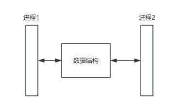

### （2）共享存储区

通过将内存区域映射到各个进程的地址空间中来实现数据共享。

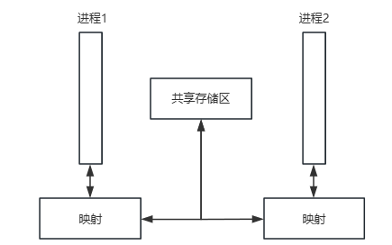

## 2.消息传递

消息传递系统允许进程通过发送和接收消息来通信，而不是直接共享内存。

### （1）直接通信

进程需要指定接收方的进程标识来发送消息，接收方也需要识别消息的来源，并且维护消息缓冲队列。

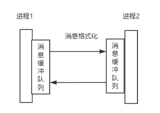

### （2）间接通信

通过共享的数据结构（如消息队列、信箱）进行通信，进程之间不直接交互，进行了解耦。

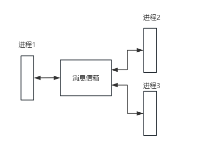


## 3.管道

### （1）匿名管道

亲缘关系的进程间的单向通信。

数据以流的形式传输，存在同步机制（未满不读，已满不写，未空不写，已空不读）以维持数据的完整性。

仅限于单向通信，若想实现全双工通信，需要至少两个管道。

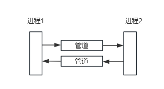

### （2）命名管道

任何进程之间的通信，无论这些进程是否有亲缘关系，需要知道管道的唯一标识符。

# 进程和线程之间有什么区别？

- 定义：进程是操作系统进行资源分配和调度的基本单位；线程是操作系统能够进行运算调度的最小单位。进程包含线程，一个进程可以由一个或多个线程组成。
- 资源分配：进程拥有独立的地址空间；线程则不拥有独立的资源，它与同一进程的其他线程共享进程资源。
- 独立性：进程是独立的执行实体，一个进程崩溃通常不会影响到其他进程。而一个线程的错误可以影响到同一进程中的其他线程。
- 开销：进程创建和销毁进程的开销相对较大，进程间的切换也比线程间切换要消耗更多资源。线程开销相对较小，因为它们共享大部分资源。
- 通信：进程间通信需要操作系统提供的特定机制，通信成本相对较高。由于共享内存和数据，线程间的通信可以直接通过读写共享数据来完成，速度快但需要处理同步和互斥问题。

# 简述操作系统如何进行内存管理

## 1.连续分配管理

### （1）单一连续分配

操作系统占用内存的一小部分，剩余的全部内存被单一的用户进程占用。

只能用于单用户、单任务OS，存在外部碎片，内存利用率低。

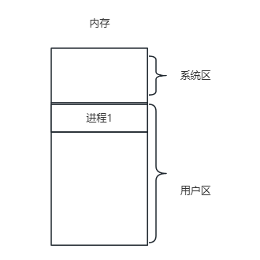

### （2）固定分区分配

将物理内存分割为几个固定大小的分区，可以是大小相等也可以不等，每个分区都可以装载一个进程。

存在内部碎片，并限制进程数量。

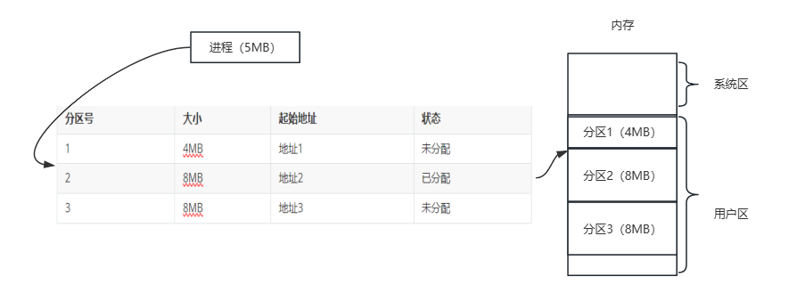

### （3）动态分区分配

允许分区大小根据进程的需求在运行时动态确定，内存分区在进程装载时创建，在进程终止时释放。

在进程释放后，会存在外部碎片。

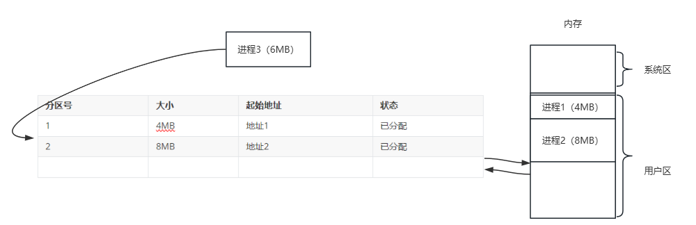

进程1终止释放空间，注意需要将相邻空闲的空间合并，并更新空闲分区链表。

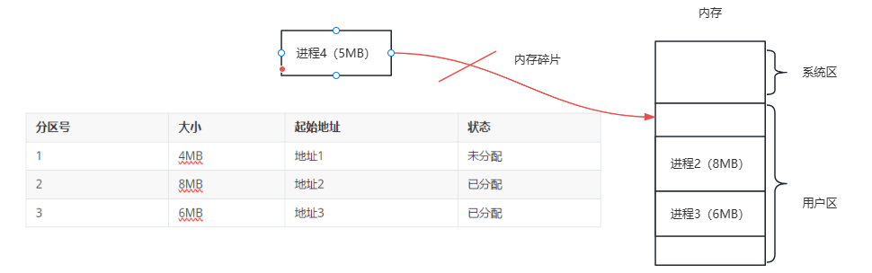

假设刚才进程123开辟的空间不连续，并且全都释放，会形成一个空闲链表，需要内存管理算法，来为进程分配内存。

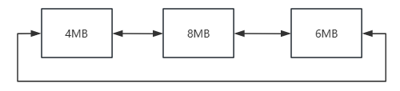

- 首次适应：从低地址到高地址依次查找合适的空间。
- 最佳适应：优先使用较小的空闲空间。
- 最坏适应：优先使用较大的空闲时间。
- 临近适应：从上次查找处向后查找。

## 2.非连续分配管理

### （1）基本分页存储管理

将物理内存划分为固定的页框，同时将逻辑地址划分为固定的页，进程在装载时，以页为单位向内存申请全部的页框，访问时通过MMU进行逻辑地址到物理内存地址的转换。但会产生内部碎片。

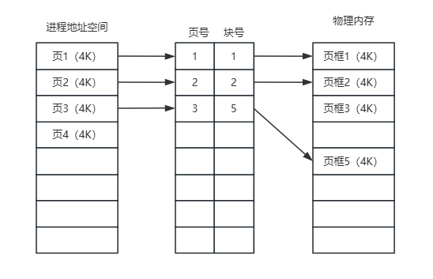

具体程序访问内存的过程

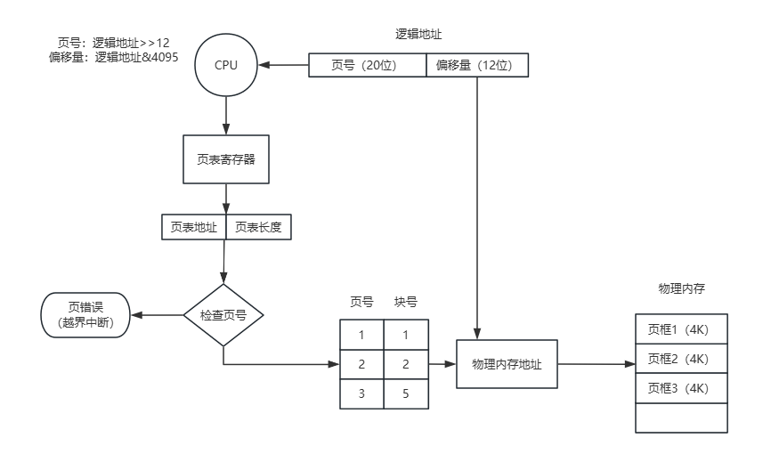

直接从物理内存中获取页表条目相对较慢，可以使用快表存储最近使用的页表条目进行缓存。

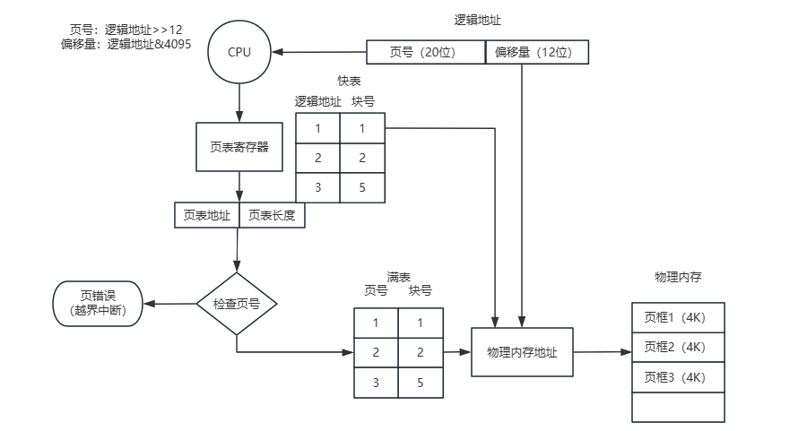

随着地址空间的扩大，单级页表可能会变得非常大，2\^20*4B=4MB。采用两级页表结构，4MB/2^12。

逻辑地址的页号分为一级页号（10位）、二级页号（10位）


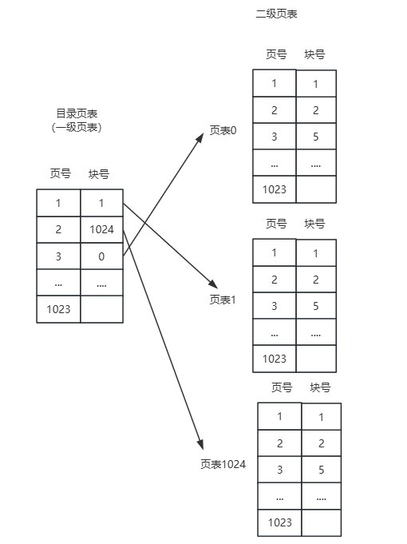

当需要进行地址转换时，系统首先使用虚拟地址的一部分在一级页表中查找相应的二级页表，然后使用虚拟地址的另一部分在二级页表中查找到具体的物理页框。这种方法可以减少单个页表的大小，只有被实际使用的页表部分需要被装入内存，从而减少了内存的占用和提高了效率。

### （2）基本分段存储管理

将进程空间地址划分为逻辑上有意义的段，每个段都可以独立的装载或移除。容易按照逻辑模块实现信息共享和保护，但会产生外部碎片。

逻辑地址组成：段号（16位），段内地址（16位）

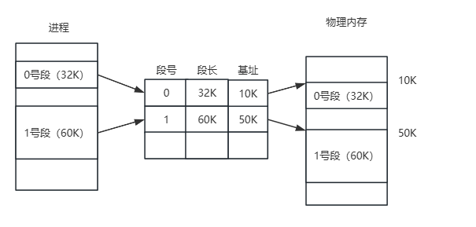

### （3）基本段页式存储管理

将进程空间地址划分位多个段，再将每个段划分为多个页，物理内存划分多个页框。

逻辑地址组成：段号（16位·），页号（4位），页内地址（12位）

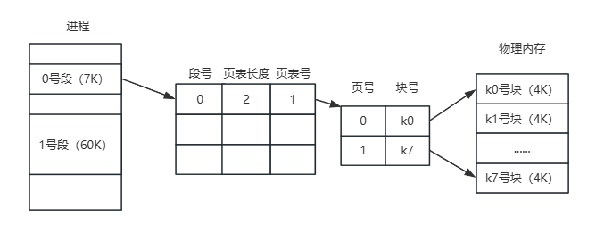

## 3.虚拟内存管理

利用磁盘的一部分作为扩展内存使用，使操作系统能够超越物理内存的限制。

请求调入：按需加载页面。

置换：物理内存已满时，通过置换算法，为新的页面腾出空间。

### （1）请求分页存储管理

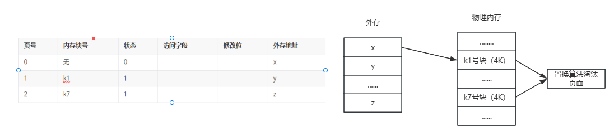

缺页中断机构，当进程尝试访问一个未加载的页面时，会发生硬件中断。MMU。

置换算法：OPT、FIFO、LRU、ClOCK

### （2）请求分段存储管理

### （3）请求段页式存储管理

# 什么时候会由用户态陷入内核态？

系统调用、硬件中断、异常处理

# 用户态和内核态是如何切换的？

以系统调用为例：

1. 从用户态到内核态：
   - 将系统调用名称转换为系统调用号，并将系统调用号和请求参数放到寄存器中。
   - 发起中断指令（int $0x80），CPU陷入内核态。
2. 执行内核态逻辑：
   - 将当前用户态的上下文保存到内核数据结构。
   - 取出系统调用号，在系统调用表中找到相应的函数，并把寄存器中的请求参数作为函数参数。
   - 执行系统调用函数。
3. 从内核态到用户态：
   - 恢复原来用户态的上下文。
   - 发起中断返回指令（iret）。

发生了两次CPU上下文切换。

# 简述自旋锁与互斥锁的使用场景

```java
//单标志法
//turn代表进程能够访问临界区
while(turn!=0);//进入区
//临界区
turn=1;//退出区
```

```java
//turn代表进程能够访问临界区
while(turn!=0)//进入区
{block}
//临界区
turn=1;//退出区
```

自旋锁是基于忙等待的机制，线程在尝试获取锁时会一直循环检查，占用CPU资源；而互斥锁是基于阻塞等待的机制，线程在获取不到锁时会进入阻塞状态等待被唤醒，涉及上下文切换。

自旋锁适合用于保护共享资源的访问时间较短的情况，而且线程竞争不激烈。互斥锁适合用于保护共享资源的访问时间较长或线程竞争激烈的情况。

# 简述 mmap 的使用场景以及原理

- 文件I/O操作：高效的文件读取、大文件处理。
- IPC：共享内存存储通信、管道。
- 匿名内存映射：动态内存分配和管理。
- DMA：将IO设备数据放入内存管理，提高数据传输。

1. 创建映射：调用mmap，传入文件描述符、映射长度、权限、映射标志、偏移量。
2. 内存页映射：将文件划分为多个页，通过页表映射到物理内存的页框中。
3. 懒加载：映射创建时，并不会全部加载进内存，而是访问到相关区域时，发生缺页异常中断，由操作系统加载。
4. 访问：逻辑地址通过mmu转换为实际的物理内存地址访问。
5. 同步：如果发生修改映射区域，应该通过msync同步到文件。

# Linux 下如何查看端口被哪个进程占用？

### 1. 使用 `lsof` 命令

`lsof`（List Open Files）是一个列出当前系统打开文件的命令。网络端口在 Linux 中被视为文件，因此可以使用 `lsof` 来查看占用某个端口的进程。

```sh
lsof -i :<port>
```

### 2. 使用 `netstat` 命令

`netstat`（Network Statistics）是一个显示网络连接、路由表、接口状态等信息的命令。可以结合 `grep` 来过滤特定端口的信息。

```sh
netstat -tuln | grep <port>
```

例如，要查看占用端口 8080 的进程，可以运行：

### 3. 使用 `pidof` 和 `ps` 命令

如果已经知道某个服务程序的名称，可以使用 `pidof` 查找其进程 ID，然后使用 `ps` 查看进程的详细信息。

```sh
pidof <service_name>
ps -fp $(pidof <service_name>)
```

# 两个线程交替打印一个共享变量

```java
public class AlternatePrinting {
    private static final int NUM_ITERATIONS = 10;
    private static int sharedVar = 0;
    private static boolean turn = true; // true for thread1, false for thread2

    private static final Lock lock = new ReentrantLock();
    private static final Condition condition = lock.newCondition();

    public static void main(String[] args) {
        Thread thread1 = new Thread(new Runnable() {
            @Override
            public void run() {
                for (int i = 0; i < NUM_ITERATIONS; ++i) {
                    lock.lock();
                    try {
                        while (!turn) {
                            condition.await();
                        }
                        System.out.println("Thread 1: " + sharedVar++);
                        turn = false;
                        condition.signalAll();
                    } catch (InterruptedException e) {
                        Thread.currentThread().interrupt();
                    } finally {
                        lock.unlock();
                    }
                }
            }
        });

        Thread thread2 = new Thread(new Runnable() {
            @Override
            public void run() {
                for (int i = 0; i < NUM_ITERATIONS; ++i) {
                    lock.lock();
                    try {
                        while (turn) {
                            condition.await();
                        }
                        System.out.println("Thread 2: " + sharedVar++);
                        turn = true;
                        condition.signalAll();
                    } catch (InterruptedException e) {
                        Thread.currentThread().interrupt();
                    } finally {
                        lock.unlock();
                    }
                }
            }
        });

        thread1.start();
        thread2.start();
        try {
            thread1.join();
            thread2.join();
        } catch (InterruptedException e) {
            Thread.currentThread().interrupt();
        }
    }
}

```

# 简述进程调度的算法

FIFO：先来先服务，维护就绪队列，按照请求顺序进行调度。但是有较长的等待时间。

SJF：短作业优先，优先调度最短的作业。但是需要预估作业时间，而且长作业等待时间长。

HRRF：高响应优先，结合了等待时间和作业时间，计算响应比（等待时间+作业时间）/作业时间。

PSA：根据优先级调度作业，优先级可动态的调整。

RR：时间片轮转，每个进程分配一个时间片，并发的进行调度。

MFQ：多级反馈队列。

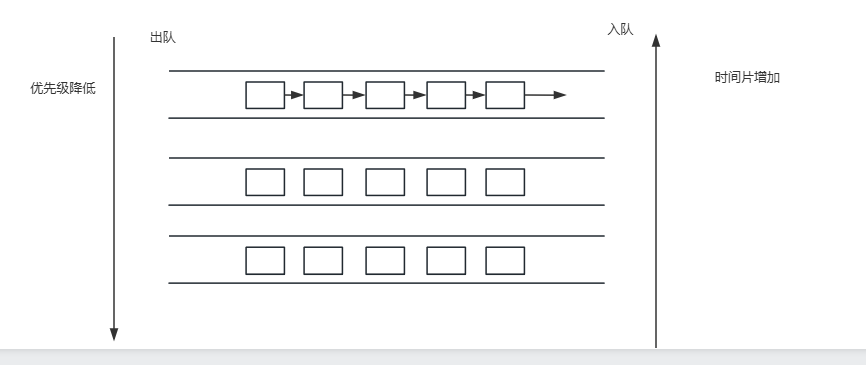

# 简述 Linux 零拷贝的原理

## 1.传统IO


## 2.mmap

将文件映射到进程地址空间的一种机制，通过 MMap 进程可以像访问内存一样访问文件，而无需显式的复制操作。

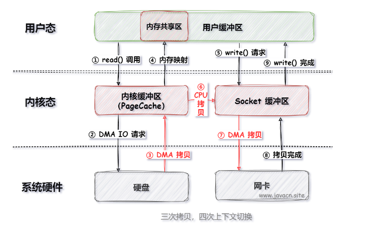

## 3.sendfile

将文件数据从内核空间直接传输到网络套接字（Socket）上.

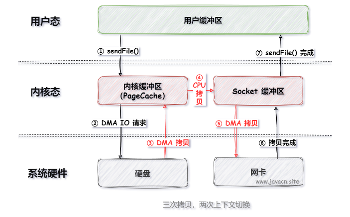

# 进程切换的时机

进程切换发生在硬件中断，如：

- 进程正常完成。
- 进入阻塞状态。
- 时间片用完。
- 高优先级进程剥夺式调度。
- 异常错误（内存页缺失、除0）

# 虚拟内存有什么优点？

- **扩展内存容量**：虚拟内存使得系统可以使用超出物理内存容量的地址空间，通过将不常用的数据存放在硬盘上，保证内存的有效利用。
- **进程隔离**：每个进程拥有独立的虚拟地址空间，防止进程间的相互干扰，提高系统的稳定性和安全性。
- **内存保护**：操作系统可以通过页表控制内存访问权限，防止进程非法访问其他进程的内存区域，增强系统安全。
- **内存共享**：不同进程可以共享某些内存区域（如共享库），节省内存资源。
- **简单的编程模型**：程序员可以认为程序拥有连续的内存地址空间，而无需关心实际的物理内存布局和管理。

# 简述同步与异步的区别，阻塞与非阻塞的区别

同步与异步：调用者是否需要主动查询任务响应，或者说被调的任务是否需要主动反馈响应。

阻塞与非阻塞：调用者是否需要等待任务的响应。

同步阻塞：

同步非阻塞：

异步阻塞：

异步非阻塞：

# 简述操作系统中 malloc 的实现原理

1. **内存分配**：根据请求的大小，在已有的空闲内存块中找到合适的块进行分配。
2. **管理元数据**：维护内存块的元数据，用于跟踪内存块的大小和使用状态。

当调用 `malloc` 时，可以通过系统调用（如 `sbrk` 或 `mmap`）向操作系统请求更多的内存，它会执行以下步骤：

1. **对齐大小**：将请求的内存大小对齐到特定的边界，以满足硬件或性能要求。
2. **寻找合适的块**：在空闲链表中找到一个足够大的空闲块。如果找到合适的块，则将其分割，分配所需的部分，并将剩余部分留在空闲链表中。
3. **更新元数据**：更新内存块的元数据，将其标记为已分配。

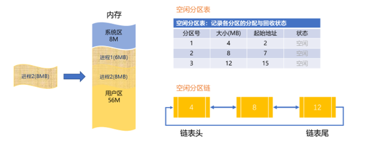

当调用 `free` 函数释放内存时，`malloc` 会执行以下步骤：

1. **标记为空闲**：将内存块的元数据标记为未使用。
2. **合并相邻块**：尝试与相邻的空闲块合并，以减少内存碎片，并更新空闲链表。

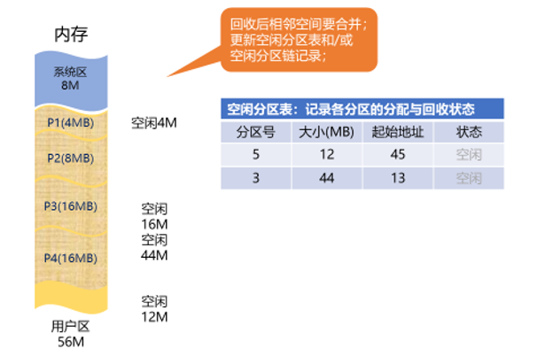

# 内存管理算法

首次适应、最佳适应、最坏适应、临近适应

# 进程地址空间从高位到低位都有些什么？

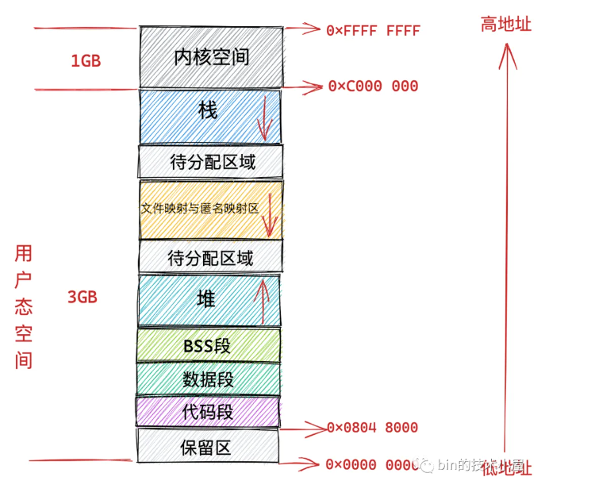

# Linux 下如何排查 CPU 以及 内存占用过多？

## 1.排查 CPU 占用过多

1. **使用 `top` 命令**：
   `top` 是一个实时显示系统任务的命令，可以显示 CPU 使用情况、内存使用情况和各个进程的详细信息。
   
   ```sh
   top
   ```

   在 `top` 命令界面中，可以看到每个进程的 CPU 使用率。按 `P` 键可以按 CPU 使用率排序。

2. **使用 `htop` 命令**：
   `htop` 是一个类似 `top` 的命令行工具，但提供了更友好的界面和更多的交互功能。需要先安装 `htop`：

   ```sh
   sudo apt-get install htop  # 对于 Debian/Ubuntu 系统
   sudo yum install htop      # 对于 CentOS/RHEL 系统
   ```

   启动 `htop`：
   
   ```sh
   htop
   ```

   在 `htop` 中，可以更直观地查看和排序进程的 CPU 使用情况。

3. **使用 `ps` 命令**：
   `ps` 命令可以列出当前系统中的进程，并显示它们的 CPU 使用情况。

   ```sh
   ps -eo pid,ppid,cmd,%mem,%cpu --sort=-%cpu | head
   ```

   该命令会显示 CPU 使用率最高的几个进程。

## 2.排查内存占用过多

1. **使用 `free` 命令**：
   `free` 命令可以显示系统的内存使用情况，包括总内存、已用内存、空闲内存和交换内存。

   ```sh
   free -h
   ```

   `-h` 选项表示以人类可读的格式显示内存使用情况。

2. **使用 `vmstat` 命令**：
   `vmstat` 命令可以报告虚拟内存、进程、CPU 活动等信息。

   ```sh
   vmstat 1 5
   ```

   该命令每秒显示一次系统状态，共显示 5 次。

3. **使用 `top` 或 `htop` 命令**：
   与排查 CPU 占用过多类似，`top` 和 `htop` 也可以用于查看内存使用情况。在 `top` 命令界面中，按 `M` 键可以按内存使用率排序。

4. **使用 `ps` 命令**：
   `ps` 命令可以显示进程的内存使用情况。

   ```sh
   ps -eo pid,ppid,cmd,%mem,%cpu --sort=-%mem | head
   ```


# 进程通信中的管道实现原理是什么？

匿名管道：子进程继承父进程的文件标识符和文件描述表。

命名管道：在文件系统中创建一个特殊的文件，进程可以通过读写这个文件来进行通信。

# Linux 如何查看实时的滚动日志？

## 1.使用 `tail` 命令查看实时滚动日志

`tail` 命令是查看文件末尾内容的工具，使用 `-f` 选项可以持续监视文件的变化，并输出新增的内容。典型用法如下：

```sh
tail -f /path/to/logfile
```

示例：

```sh
tail -f /var/log/syslog
```

这样可以实时查看 `/var/log/syslog` 文件的新日志条目。

`-F` 选项与 `-f` 类似，但它会在日志文件被重命名或删除后重新打开文件。这在日志文件被轮转（rotation）时特别有用。

```sh
tail -F /path/to/logfile
```

`multitail` 是一个功能更强大的工具，允许同时监视多个日志文件，并以彩色高亮显示不同类型的日志条目。需要先安装 `multitail`：

```sh
sudo apt-get install multitail  # 对于 Debian/Ubuntu 系统
sudo yum install multitail      # 对于 CentOS/RHEL 系统
```

使用示例：

```sh
multitail /var/log/syslog /var/log/auth.log
```

## 2.使用 `less` 命令查看滚动日志

`less` 命令也是一个常用的文件查看工具，支持按页浏览大文件。使用 `Shift + F` 可以进入类似 `tail -f` 的模式，实时查看文件的变化。

```sh
less /path/to/logfile
```

在 `less` 界面中按 `Shift + F` 进入实时监控模式。

## 3.使用 `journalctl` 命令查看系统日志

对于使用 `systemd` 的系统，可以使用 `journalctl` 命令查看和管理系统日志。使用 `-f` 选项可以实时查看日志。

```sh
journalctl -f
```

也可以指定某个特定的服务日志：

```sh
journalctl -u nginx -f
```

# 简述创建进程的流程

1. PCB：分配PCB，存储进程的信息。
2. 分配资源：分配必要的系统资源，如内存、文件描述符、I/O设备。
3. 初始化进程：初始化进程的属性，状态、进程地址空间、加载代码、初始化数据。
4. 继承父进程资源
5. 插入就绪队列

# 虚拟内存的页面置换算法

OPT：最佳置换算法，淘汰将来最长时间不会被访问的页面。

FIFO：淘汰最先进入内存的页面。

LRU：淘汰最近没有被访问的页面。

CLOCK：周期性检查未被访问的页面。

设置一个访问位和一个修改位，每个页面被访问时将此位设置为1，并增加修改位。时钟指针周期性地检查这些位，未被访问的页面将被替换，如果都被访问，看修改次数。

# 简述 CPU L1, L2, L3 多级缓存的基本作用

多级缓存是基于局部性原理， 位于 CPU 和主内存之间的一种高速存储器，用于临时存储常用的数据和指令，使得不同层级之间平衡速度和容量。

在多核系统中，每个核心都有自己的 L1 和 L2 缓存，可能会出现缓存一致性问题，即多个缓存中的数据副本不一致。为解决这一问题，现代 CPU 实现了缓存一致性协议（如 MESI 协议），确保所有缓存副本的一致性。

# 信号量是如何实现的？

信号量是一个用于协调多个进程或线程对共享资源访问的同步工具。

- **P操作**：这个操作通常被称为“wait”或“decrement”。如果信号量的值大于零，P操作将其减一，这表示占用了一个单位的资源。如果信号量的值为零，进行P操作的进程或线程将被阻塞，直到信号量的值变为大于零。
- **V操作**：这个操作也被称为“signal”或“increment”。它将信号量的值加一，这表示释放了一个单位的资源。如果有其他进程或线程因为信号量的值为零而被阻塞，V操作还将唤醒其中一个等待的进程或线程。

```java
void wait(int semaphore){
    semaphore--;
    while(semaphore<0);
}
void signal(int semaphore){
    semaphore++;
}
int semaphore=10;
//thread1
{
    wait(semaphore);//进去区
    //临界区
    semaphore(semaphore);
}
```

出现忙等，可以维护一个等待队列，将未拿到资源的进程阻塞放入等待队列。

# 简述 Linux 的 I/O模型

1. **阻塞 I/O（Blocking I/O）**：在阻塞 I/O 模型中，I/O 操作（如 `read` 或 `write`）会阻塞进程，直到操作完成。进程在等待期间不能执行其他任务。
   
   简单易用，但在 I/O 操作等待时间较长时，可能导致 CPU 资源浪费。
   
2. **非阻塞 I/O（Non-blocking I/O）**：非阻塞 I/O 模型中，I/O 操作立即返回，如果操作无法完成，返回 `-1` 并设置 `errno` 为 `EAGAIN` 或 `EWOULDBLOCK`。
   
   适用于需要高响应性的应用，但需要通过轮询不断检查 I/O 操作是否完成，可能导致 CPU 资源浪费。
   
3. **I/O 多路复用（I/O Multiplexing）**：使用 `select`、`poll` 或 `epoll` 等系统调用，监视多个文件描述符的 I/O 事件，并在事件就绪时进行 I/O 操作。
   
   适用于同时处理多个 I/O 事件的场景，通常用于网络服务器开发。
   
4. **信号驱动 I/O（Signal-driven I/O）**：使用信号机制，当文件描述符就绪时，内核向进程发送信号，进程在信号处理程序中进行 I/O 操作。
   
   适用于需要在事件就绪时立即响应的场景，但信号处理的复杂性较高。
   
5. **异步 I/O（Asynchronous I/O, AIO）**：异步 I/O 模型中，I/O 操作立即返回，内核在操作完成时通知进程或回调指定函数。
   
   适用于高并发、低延迟的场景，但实现和使用相对复杂。

# Linux 共享内存是如何实现的？

1. **System V 共享内存**：System V 共享内存是最早的一种共享内存机制，通过 `shmget`、`shmat`、`shmdt` 和 `shmctl` 系统调用实现。
   
2. **POSIX 共享内存**：POSIX 共享内存是另一种共享内存机制，通过 `shm_open`、`mmap`、`munmap`、`shm_unlink` 等系统调用实现。
   
3. **匿名共享内存（使用 `mmap`）**：匿名共享内存可以通过 `mmap` 系统调用实现，不需要通过文件系统创建共享内存对象。常用于父子进程间的共享内存。


