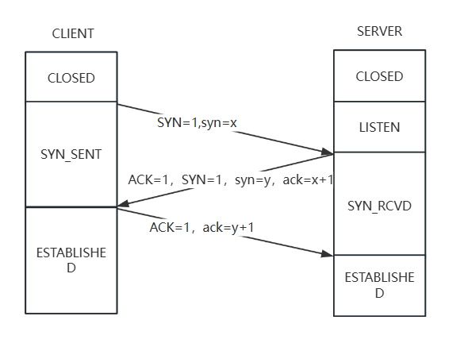
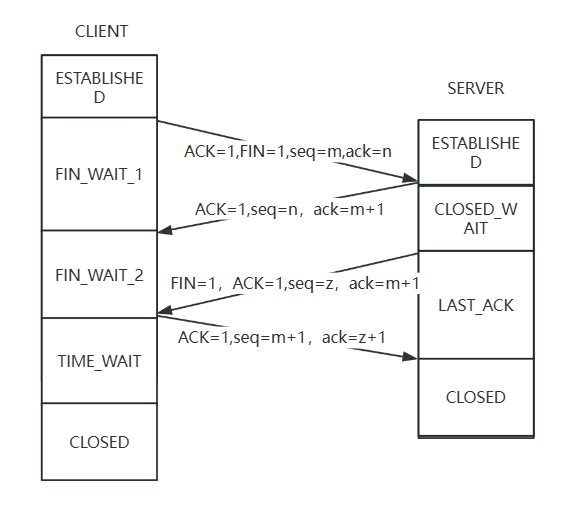
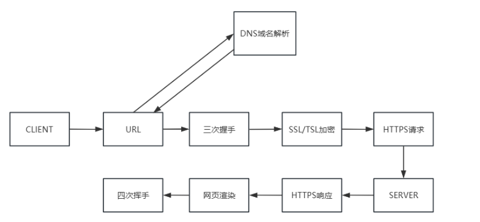
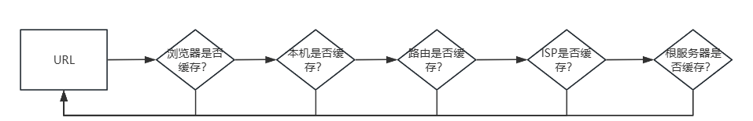
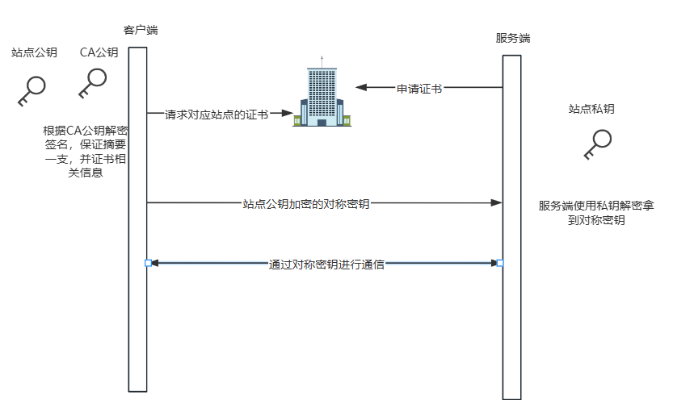
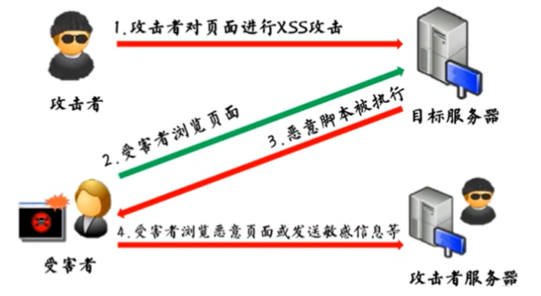
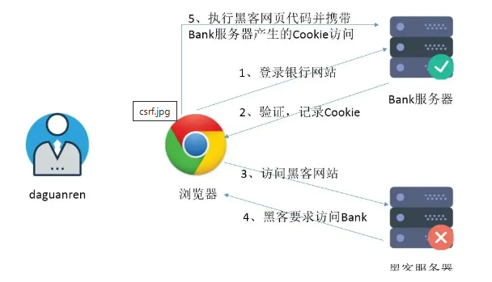
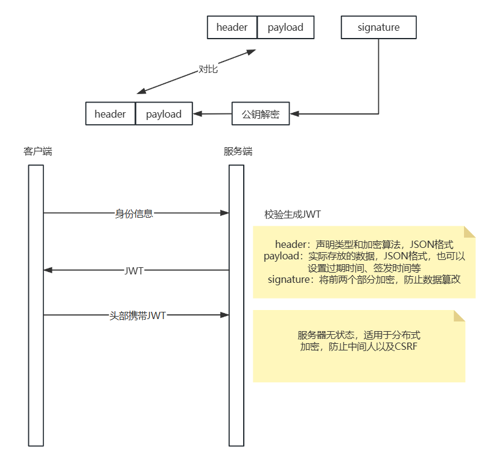
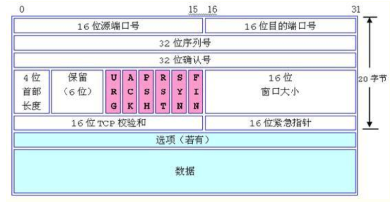
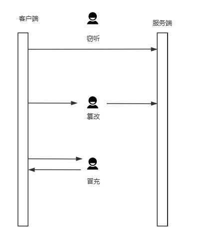

# 简述 TCP 三次握手以及四次挥手的流程。为什么需要三次握手以及四次挥手？

## 1.三次握手

## 2.四次挥手

# HTTP 与 HTTPS 有哪些区别？

HTTPS（加密数据）=HTTP（明文数据）+SSH/TSL（CA+密钥）

# 从输入 URL 到展现页面的全过程

# TCP 与 UDP 在网络协议中的哪一层，他们之间有什么区别？

|          | TCP                | UDP                      |
| -------- | ------------------ | ------------------------ |
| 是否连接 | 连接               | 无连接                   |
| 是否可靠 | 可靠               | 不可靠                   |
| 连接个数 | 一对一             | 单播、多播、广播         |
| 传输方式 | 字节流             | 报文                     |
| 首部开销 | 20字节（60字节）   | 8字节                    |
| 适用场景 | 可靠传输、文件传输 | 电话通讯、视频会议、直播 |

# TCP 怎么保证可靠传输？

- 分段传输：TCP根据MSS分割为适合发送的数据段，一般是基于IP基于MTU，最多不能超过MTU。
- 超时重传：TCP发送数据后会启动计时器，如果未收到确认，则会重发该数据。
- CRC校验：检测数据在传输过程中是否发生了错误。
- 流量控制：允许接收端控制发送端的发送速率，以避免缓冲区溢出。
- 滑动窗口：
  - 确认应答机制：每发送一个数据报，就等待一个确认应答（ACK）
  - 累计机制：减少传输的RRT。
  - 窗口：操作系统维护的缓存，接收方会根据实际接收情况，在应答数据包中告知发送方自己的接收窗口大小，发送方无需等待确认，可以继续发送数据。如果窗口左部的字节已经发送并且收到了确认，那么就将窗口向右滑动一定距离，直到左部第一个字节不是已发送并且已确认的状态。

# 简述 HTTP 1.0，1.1，2.0 的主要区别

HTTP1.0：非持续连接

HTTP1.1：持续连接

HTTP2.0：二进制分帧，优先级排序，首部压缩，多路复用，服务器推送

# DNS 查询服务器的基本流程是什么？DNS 劫持是什么？

# Cookie 和 Session 的关系和区别是什么？

Cookie和Seesion都是会话技术，用于存储数据，使得HTTP从无状态变为有状态。

|          | Cookie             | Seesion |
| -------- | ------------------ | ------- |
| 存储位置 | 客户端             | 服务端  |
| 容量     | 较小               | 较大    |
| 安全性   | 明文传输不可靠     | 可靠    |
| 生命     | 较短               | 较长    |
| 适用场景 | 身份认证、登录状态 | 购物车  |

# 简述 HTTPS 的加密与认证过程

# RestFul 是什么？RestFul 请求的 URL 有什么特点？

基于 REST（Representational State Transfer，表述性状态转移）架构风格的 Web 服务设计方式。

资源定位、使用名词而非动词、层次清晰、支持过滤和分页、无状态

通过HTTP的方法来表示操作：GET（查询）、POST（创建）、PUT（修改）、DELETE（删除）

# RestFul 与 RPC 的区别是什么？RestFul 的优点在哪里？

RPC（Remote Procedure Call，远程过程调用）是一种进程间通信技术，允许程序通过调用远程服务器上的函数或过程来实现分布式计算。RPC 的目的是使远程服务调用看起来就像是在调用本地函数一样，简化了分布式系统的开发。

RPC与RestFul

**RESTful**：

- 基于资源（Resource）的概念，使用标准的 HTTP 方法（GET、POST、PUT、DELETE 等）对资源进行操作。
- 强调无状态性，每个请求都包含所有必要的信息，服务器不需要保存客户端的状态。
- 使用统一的接口（如 URL）来操作资源，便于理解和使用。

**RPC**：

- 基于过程调用的概念，客户端通过调用远程服务器上的函数或方法来实现通信。
- 可以是有状态的，服务器可能需要维护客户端的会话状态。
- 通常使用特定的协议和接口定义语言（如 Protocol Buffers）来描述服务接口和数据格式。

# 什么是 TCP 粘包和拆包？

TCP传输的面向字节流的，没有消息保护的边界，发送房在应用层将多个数据包放在一个TCP报文段中，接收方应用层无法区分，可能会被当做一个包处理，或者发送方把一个数据拆分为多个TCP报文段，接收方将他们当作多个数据包处理。

粘包：缓冲区。

拆包：滑动窗口、MSS大于MTU。

解决：固定长度、特殊字符、变长协议

# TCP 中 SYN 攻击是什么？如何防止？

伪造大量的TCP连接请求，使得目标服务器不断响应这些请求并且维护 TCP 连接，最终导致服务器资源耗尽无法响应合法的连接请求从而实现拒绝服务攻击。

监控syn包、监控半连接请求、延迟加载线程、调整TCP连接时间、重试次数、增大连接队列、SYN Cookie技术

# TCP 挥手时出现大量 CLOSE_WAIT 或 TIME_WAIT 怎么解决？

- top查看cpu利用率和load情况（大量close_wait属于io密集型，会导致load相比cpu利用率高出很多）
- netstat观察close_wait的数量变化。
- wireshark辅助查看网络包的发送情况。
- 优化服务器系统的网络配置，连接配置，使用socket重用或及时释放资源即可。

# 什么是跨域，什么情况下会发生跨域请求？

跨域（cross-origin）是指在浏览器执行请求时，当前页面的源（协议、域名、端口）与目标源不同，浏览器由于同源策略会限制跨站请求。

# 简述什么是 XSS 攻击以及 CSRF 攻击？

## 1.XSS（跨站脚本攻击）

## 2.CSRF（跨站请求伪造）

# HTTP 中 GET 和 POST 区别

| 特点     | GET 请求                              | POST 请求                                |
| -------- | ------------------------------------- | ---------------------------------------- |
| 功能     | 获取数据                              | 提交数据                                 |
| 请求参数 | 通过 URL 传递，使用查询字符串         | 包含在请求体中，不显示在 URL 中          |
| 请求长度 | 有限制，一般不超过 2048 个字符        | 没有长度限制，可以传递大量数据           |
| 幂等性   | 是幂等的，多次请求结果相同            | 不是幂等的，多次请求可能导致不同结果     |
| 缓存     | 可以被缓存                            | 通常不会被缓存                           |
| 安全性   | 参数显示在 URL 中，不适合传递敏感信息 | 参数包含在请求体中，相对适合传递敏感信息 |
| 书签     | 可以被书签保存                        | 不适合被书签保存                         |

# TCP 的 keepalive 了解吗？说一说它和 HTTP 的 keepalive 的区别？

**TCP Keepalive** 是一种机制，用于检测连接的空闲状态，并在长时间无数据传输时确认连接是否仍然有效。TCP Keepalive 通过在连接上定期发送小的探测数据包，检查连接的状态。如果连接在指定时间内没有响应，TCP 会认为连接已经断开，并通知应用程序。

**HTTP Keepalive** 是一种机制，用于保持客户端与服务器之间的连接在多个请求/响应对之后仍然打开，从而避免为每个请求重新建立连接的开销。这种机制也被称为持久连接（Persistent Connection）。

# 简述常见的 HTTP 状态码的含义（301，304，401，403）

301 Moved Permanently（永久重定向）

304 Not Modified（未修改）

401 Unauthorized（未授权）

403 Forbidden（禁止访问）

# 从系统层面上，UDP 如何保证尽量可靠？

在应用层，增加TCP的可靠机制。

# 简述 JWT 的原理和校验机制

# TCP 长连接和短连接有那么不同的使用场景？

**长连接**：长连接是指TCP通信双方在建立连接后，保持连接状态较长时间，直到某一方主动关闭连接。这种方式适用于需要频繁通信的场景。

**短链接**：短连接是指在每次通信时建立一个新的TCP连接，数据传输完成后立即关闭连接。这种方式适用于操作不频繁的场景。

# 什么是 ARP 协议？简述其使用场景

# 简述 RPC 的调用过程

# 简述 TCP 的报文头部结构

# 什么是中间人攻击？如何防止攻击？

中间人攻击：窃听、篡改、冒充

对称加密+非对称加密+CA

# 如何设计 API 接口使其实现幂等性？

**GET 请求**：GET 请求天生是幂等的，因为它们只用于读取数据，不会修改服务器的状态。

**页面控制**：页面调用接口时可以通过禁用（如按钮置灰或显示加载状态）防止用户在请求未完成前重复点击，从而减少不必要的重复请求和可能的数据冲突。

**使用RPG模式**：指示客户端发起一个新的GET请求去访问一个特定的URL。客户端遵照服务器的重定向指示，自动发送GET请求访问新的URL，此时返回的页面将展示之前POST操作处理完毕的结果。

**Token机制：**客户端每次请求都需要携带一个唯一的Token，而服务器则验证这个Token的有效性。如果服务器收到了一个已经使用过的Token就会认为这是一个重复请求并拒绝处理。

唯一标识符、时间戳

# 简述在四层和七层网络协议中负载均衡的原理

# 为什么需要序列化？有什么序列化的方式？

# 简述 iPv4 和 iPv6 的区别

| 特点         | IPv4                           | IPv6                                 |
| ------------ | ------------------------------ | ------------------------------------ |
| 地址长度     | 32 位                          | 128 位                               |
| 地址表示法   | 点分十进制（如 `192.168.0.1`） | 冒号十六进制（如 `2001:db8::1`）     |
| 地址空间     | 约 43 亿个地址                 | 约 3.4 x 10^38 个地址                |
| 地址耗尽问题 | 地址空间已耗尽                 | 地址空间非常庞大，几乎无限           |
| 地址自动配置 | 需要手动配置或 DHCP            | 支持无状态地址自动配置（SLAAC）      |
| 内置安全性   | 无内置安全性，需额外配置 IPsec | 内置 IPsec 支持                      |
| NAT 支持     | 广泛使用 NAT 解决地址不足问题  | 减少 NAT 需求，支持端到端连接        |
| 路由效率     | 路由表较大，效率较低           | 路由表较小，效率较高                 |
| 头部复杂性   | 头部复杂，有多个选项字段       | 头部简洁，固定大小，选项通过扩展实现 |