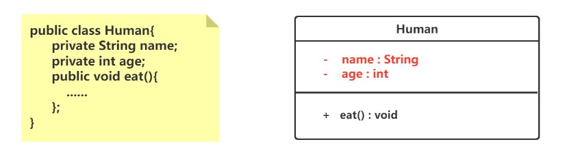
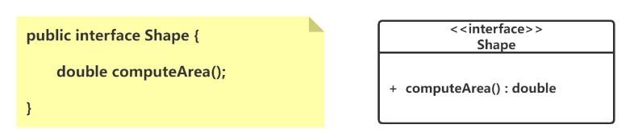
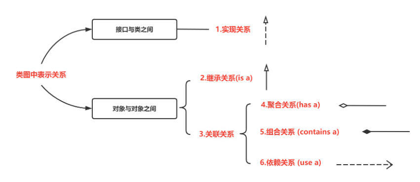
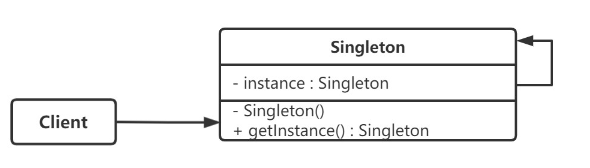
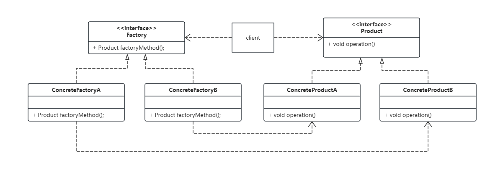
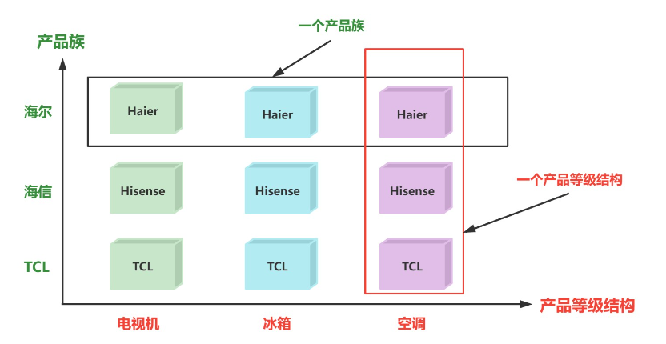
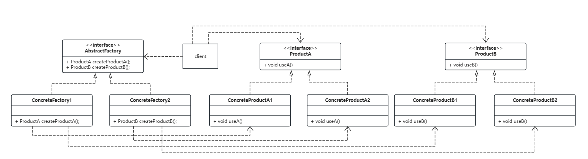
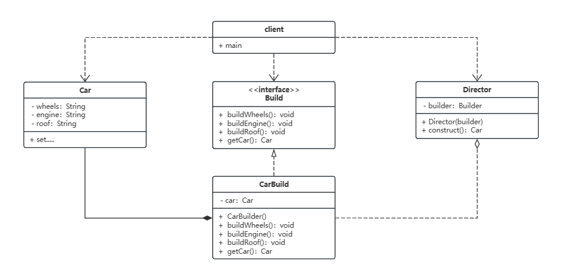
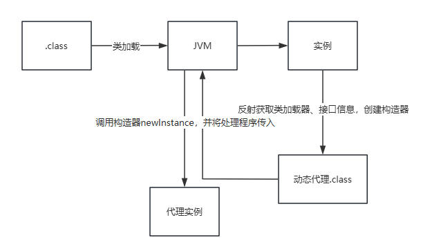

# 一、UML图①②③④⑤

类图（Class Diagram）是统一建模语言（UML, Unified Modeling Language）中的一种图形，用于展示系统中的类、类之间的关系以及类的内部结构。它是面向对象分析和设计过程中最常用的图形之一。类图不仅有助于软件开发过程中的设计和文档化，也有助于团队成员之间的沟通。

## 1.类



### （1）矩形框

- **顶部**：显示类的名称，如果是抽象类，则名称是斜体。
- **中部**：显示类的属性或成员变量。
- **底部**：显示类的方法或成员函数。

### （2）修饰符

- “+” 表示 `public`；
- “-” 表示 `private`；
- “#” 表示 `protected`；
- 不带符号表示 `default`。

## 2.接口

接口在类图中也是用矩形框表示，但是与类的表示法不同的是，接口在类图中的第一层顶端用构造型 <<interface>>表示，下面是接口的名字，第二层是方法。



## 3.关系表示



# 二、创建型模式

## 1.单例模式

### （1）概述

单例模式保证某个类在运行期间，只有一个实例，并为该实例提供一个全局访问节点，而这个类被称为单例类。



### （2）饿汉模式

饿汉式单例模式是一种在类加载时就完成实例化并初始化好静态实例的方法，以确保实例的唯一性和线程安全。这种方法利用了Java类加载机制，确保实例只被创建一次。

**实现：**

```java
public class Singleton {
    // 在类加载时就初始化一个静态私有实例
    private static final Singleton instance = new Singleton();

    // 私有构造函数，防止外部创建实例
    private Singleton() {}

    // 提供一个公共的静态方法，返回唯一实例
    public static Singleton getInstance() {
        return instance;
    }
}

```

**特点**

- **线程安全**：由于单例的唯一实例是在类加载时创建的，这一过程由JVM执行，因此不会出现线程安全问题。
- **无延迟加载**：实例在类加载时就已创建，因此不存在延迟加载的选项。这样做的好处是避免了调用 `getInstance()` 方法时的任何类型的同步延迟，但是也可能导致资源利用率降低。
- **资源消耗**：如果实例创建过程中涉及重资源分配，或实例占用明显的内存空间，且该实例的使用频率并不高，那么这种模式可能导致资源的浪费。

### （3）懒汉模式（DCL）

双重校验锁模式（Double-Check Locking）是懒汉模式的一个改进版本，用于减少获取对象的成本和提高性能，同时保持线程安全。这种方式首先检查实例是否已经创建，如果尚未创建，才进行同步。这种方法可以大大减少 `getInstance()` 的时间消耗。

**实现：**

```java
public class LazySingleton {
    // 使用 volatile 关键字保证可见性和禁止指令重排序
    private static volatile LazySingleton instance;

    // 私有构造函数，防止外部实例化
    private LazySingleton() {}

    // 公共的获取实例方法，实现双重校验锁
    public static LazySingleton getInstance() {
        if (instance == null) { // 第一次检查：避免不必要的同步
            synchronized (LazySingleton.class) { // 同步
                if (instance == null) { // 第二次检查：在null的情况下创建实例
                    instance = new LazySingleton();
                }
            }
        }
        return instance;
    }
}

```

**特点**

- **线程安全**：通过同步代码块减少了同步的开销，只在第一次创建实例时才同步，提高了效率。
- **延迟加载**：实例在首次使用时创建，优化了资源的使用。
- **资源优化**：避免了在应用启动时就创建对象，减轻了启动负担。

**注意事项**

- **volatile 关键字**：`instance` 需要被声明为 `volatile`，这样可以防止 JVM 的指令重排，确保在对象被初始化之后才将引用指向内存空间，从而保证线程安全。
- **性能考虑**：虽然双重校验锁比普通锁性能更好，但在极高并发的情况下仍然会有性能瓶颈。

## 2.工厂方法模式

### （1）概述

工厂方法模式是一种创建型设计模式，它定义了一个创建对象的接口，但将实际的对象创建工作推迟到实现类中完成。这样的设计模式让类的实例化操作延迟到其实现类，通过这种方式，工厂方法模式解决了接口选择的问题，使一个类不需要知道它所创建的对象的具体类。

### （2）组成

- **抽象产品（Product）**:定义了产品的接口，是工厂方法创建的对象所必须遵守的模型。抽象产品可以是一个接口或抽象类，由具体产品类实现或继承。
- **具体产品（Concrete Product）**:实现或继承抽象产品的具体类。每一个具体产品类都对应一个特定的实际产品。
- **抽象工厂（Factory）**:声明工厂方法，该方法返回一个抽象产品。创建者通常是一个接口，包含调用工厂方法以返回产品对象的代码。
- **具体工厂（Concrete Factory）**:实现抽象工厂中定义的工厂方法，返回一个具体产品实例。具体工厂决定如何创建产品，以及要创建哪些产品。

### （3）类图结构



### （4）示例

```java
// 抽象产品
public interface Product {
    void operate();
}

// 具体产品A
public class ConcreteProductA implements Product {
    @Override
    public void operate() {
        System.out.println("ConcreteProductA operating.");
    }
}

// 具体产品B
public class ConcreteProductB implements Product {
    @Override
    public void operate() {
        System.out.println("ConcreteProductB operating.");
    }
}

// 抽象工厂
public interface  Factory {
    // 声明工厂方法
    Product factoryMethod();
}

// 具体工厂A
public class ConcreteFactoryA implements Factory {
    @Override
    public Product factoryMethod() {
        return new ConcreteProductA();
    }
}

// 具体工厂B
public class ConcreteFactoryB implements Factory {
    @Override
    public Product factoryMethod() {
        return new ConcreteProductB();
    }
}

```


## 3.抽象工厂模式

### （1）概述

抽象工厂模式是一种创建型设计模式，用于处理具有相同（或相似）主题的产品族而无需指定具体类的情况。这个模式提供了一个接口，用来创建一系列相关或相互依赖的对象，而不需要指定它们具体的类。

### （2）产品等级结构与产品族

- **产品等级结构** ：产品等级结构即产品的继承结构，如一个抽象类是电视机，其子类有海尔电视机、海信电视机、TCL电视机，则抽象电视机与具体品牌的电视机之间构成了一个产品等级结构，抽象电视机是父类，而具体品牌的电视机是其子类。

- **产品族** ：在抽象工厂模式中，产品族是指由同一个工厂生产的，位于不同产品等级结构中的一组产品，如海尔电器工厂生产的海尔电视机、海尔电冰箱，海尔电视机位于电视机产品等级结构中，海尔电冰箱位于电冰箱产品等级结构中。



### （3）组成

- **抽象工厂（Abstract Factory）**:提供一个创建一系列相关或相互依赖对象的接口，而无需指定它们具体的类。
- **具体工厂（Concrete Factory）**:实现抽象工厂的操作，生成具体的产品。
- **抽象产品（Abstract Product）**:为一类产品对象声明一个接口。
- **具体产品（Concrete Product）**:抽象产品的具体实现。这些定义了具体工厂生产的具体产品对象，实现抽象产品定义的接口。

### （4）类图结构



### （5）示例

```java
// 抽象产品A
public interface ProductA {
    void useA();
}

// 抽象产品B
public interface ProductB {
    void useB();
}

// 具体产品A1
public class ProductA1 implements ProductA {
    @Override
    public void useA() {
        System.out.println("Using Product A1");
    }
}

// 具体产品B1
public class ProductB1 implements ProductB {
    @Override
    public void useB() {
        System.out.println("Using Product B1");
    }
}

// 具体产品A2
public class ProductA2 implements ProductA {
    @Override
    public void useA() {
        System.out.println("Using Product A2");
    }
}

// 具体产品B2
public class ProductB2 implements ProductB {
    @Override
    public void useB() {
        System.out.println("Using Product B2");
    }
}

// 抽象工厂
public interface AbstractFactory {
    ProductA createProductA();
    ProductB createProductB();
}

// 具体工厂1
public class ConcreteFactory1 implements AbstractFactory {
    @Override
    public ProductA createProductA() {
        return new ProductA1();
    }

    @Override
    public ProductB createProductB() {
        return new ProductB1();
    }
}

// 具体工厂2
public class ConcreteFactory2 implements AbstractFactory {
    @Override
    public ProductA createProductA() {
        return new ProductA2();
    }

    @Override
    public ProductB createProductB() {
        return new ProductB2();
    }
}

// 客户端代码
public class Client {
    private ProductA productA;
    private ProductB productB;

    public Client(AbstractFactory factory) {
        productA = factory.createProductA();
        productB = factory.createProductB();
    }

    public void useProducts() {
        productA.useA();
        productB.useB();
    }
}

```


## 4.建造者模式

### （1）概述

建造者模式是一种创建型设计模式，它提供了一种创建复杂对象的最佳方式。该模式允许你将一个复杂对象的构建过程从其表示中分离出来，使得同样的构建过程可以创建不同的表示。这种模式通常用于设计一个复杂对象的组成部分和它的装配方式。

### （2）组成

1. **产品（Product）**:最终要构建的复杂对象。
2. **建造者（Builder）**:抽象接口，定义创建产品对象的各个部件的接口。
3. **具体建造者（Concrete Builder）**:实现 Builder 接口，提供完成构建最终产品实例的方法和过程。每个具体建造者都负责创建特定产品的实例。
4. **指挥者（Director）**:负责安排已有模块的构建步骤，对外提供简化的接口。

### （3）类图结构



### （4）示例

```java
// 产品角色
class Car {
    private String wheels;
    private String engine;
    private String roof;

    public void setWheels(String wheels) { this.wheels = wheels; }
    public void setEngine(String engine) { this.engine = engine; }
    public void setRoof(String roof) { this.roof = roof; }
    public String toString() {
        return "Car with " + wheels + ", " + engine + ", " + roof;
    }
}

// 抽象建造者
interface Builder {
    void buildWheels();
    void buildEngine();
    void buildRoof();
    Car getCar();
}

// 具体建造者
class CarBuilder implements Builder {
    private Car car;

    public CarBuilder() {
        this.car = new Car();
    }

    @Override
    public void buildWheels() {
        car.setWheels("Normal wheels");
    }

    @Override
    public void buildEngine() {
        car.setEngine("Normal engine");
    }

    @Override
    public void buildRoof() {
        car.setRoof("Normal roof");
    }

    @Override
    public Car getCar() {
        return car;
    }
}

// 指挥者
class Director {
    private Builder builder;

    public Director(Builder builder) {
        this.builder = builder;
    }

    public Car construct() {
        builder.buildWheels();
        builder.buildEngine();
        builder.buildRoof();
        return builder.getCar();
    }
}

// 客户端代码
public class Client {
    public static void main(String[] args) {
        Builder builder = new CarBuilder();
        Director director = new Director(builder);
        Car car = director.construct();
        System.out.println(car);
    }
}

```

## 5.原型模式

# 三、结构性模式

## 1.代理模式

### （1）概述

代理模式作为一种结构型设计模式，主要用于间接访问某个对象，同时添加一些控制这种访问的功能。

在代理模式中，代理（Proxy）通过实现与真实主题（Real Subject）相同的接口，成为客户端和真实主题之间的中介。代理对象内部包含对真实主题的引用，控制着对真实主题的访问，并可以在调用真实主题的方法前后执行其他操作。这种结构允许进行各种操作，比如安全检查、增强功能、管理资源等。

- **抽象主题（Subject）类**：这是一个接口或抽象类，定义代理和真实主题必须实现的方法，确保代理可以在任何需要真实主题的场合被使用。
- **真实主题（Real Subject）类**：这个类实现了抽象主题的业务操作，定义了代理所代表的真实对象。
- **代理（Proxy）类**：代理含有对真实主题的引用，通常会处理所有的对真实主题的访问请求。代理通常在执行真实主题的一个操作前后进行其它操作，如执行安全检查、修改请求、管理资源、缓存结果等。

### （2）静态代理

静态代理是在编译时就已经确定了代理类和目标类的关系。在这种代理模式中，代理类和目标类通常会实现相同的接口或继承相同的抽象类，代理类需要显式地声明它代理的目标对象，并在内部持有目标对象的引用。

考虑一个简单的场景，如一个文档编辑器中的图片加载：

- **抽象主题**：定义了显示图像的方法。
- **真实主题**：加载磁盘上的图像并显示。
- **代理**：代理图像类首先在屏幕上显示一个加载中的提示，然后异步加载真实图像，加载完成后更新显示。

```java
interface Image {
    void display();
}

// Real Subject
class ProxyImage implements Image {
    private RealImage realImage;

    public ProxyImage(RealImage realImage) {
        this.realImage = realImage;
    }

    @Override
    public void display() {
        System.out.println("Display placeholder while loading the image");
        realImage.display();
    }
}

// Proxy
class ProxyImage implements Image {
    private RealImage realImage;

    public ProxyImage(RealImage realImage) {
        this.realImage = realImage;
    }

    @Override
    public void display() {
        System.out.println("Display placeholder while loading the image");
        realImage.display();
    }
}
```

### （3）JDK动态代理

代理类在运行时被动态创建。Java 最常见的是使用 `java.lang.reflect.Proxy` 类和 `java.lang.reflect.InvocationHandler` 接口。

- java.lang.reflect Proxy主要方法为

  ```java
  static Object newProxyInstance(
      ClassLoader loader,  		//指定当前目标对象使用类加载器
      Class<?>[] interfaces,    //目标对象实现的接口的类型
      InvocationHandler h      //事件处理器
  ) 
  //返回一个指定接口的代理类实例，该接口可以将方法调用指派到指定的调用处理程序。
  ```

- java.lang.reflect InvocationHandler主要方法为

  ```java
  Object invoke(Object proxy, Method method, Object[] args) 
  // 在代理实例上处理方法调用并返回结果。
  ```

**示例**

```java
public class ProxyFactory {
    private Object target;
    public ProxyFactory(Object target) {
        this.target = target;
    }
    public Object getProxy() {
        return Proxy.newProxyInstance(target.getClass().getClassLoader(), target.getClass().getInterfaces(), new InvocationHandler() {
            @Override
            public Object invoke(Object proxy, Method method, Object[] args) throws Throwable {
                System.out.println("Display placeholder while loading the image");
                return method.invoke(target, args);
            }
        });
    }
}
```

动态代理类的字节码是在运行时创建的。Java 使用 `java.lang.reflect.Proxy` 类和 `java.lang.reflect.InvocationHandler` 接口实现动态代理。核心方法 `Proxy.newProxyInstance` 能够在运行时动态创建代理类。这个过程大致包括以下步骤：



1. **确定代理类的名称**：通常形式为 `com.sun.proxy.$ProxyN`，其中 `N` 是一个递增的数字。
2. **生成代理类的字节码**：根据传递给 `newProxyInstance` 方法的接口列表和调用处理器，动态生成代理类的字节码。这个过程由 `ProxyClassFactory` 完成，它调用 `ProxyGenerator.generateProxyClass` 方法来生成字节码。
3. **加载代理类到 JVM**：使用指定的类加载器，将生成的字节码加载到 JVM 中。这个类加载器通常是传递给 `newProxyInstance` 方法的类加载器。
4. **创建代理实例**：使用反射机制，通过加载的代理类构造函数创建代理实例。构造函数接受一个 `InvocationHandler` 作为参数。

生成的代理类实际上继承自 `Proxy` 类并实现了指定的接口。代理类中的每个方法实际上是通过调用其 `InvocationHandler` 的 `invoke` 方法来实现的。这样，当代理类的方法被调用时，实际执行的是 `InvocationHandler` 中的代码。

### （4）CGLIB动态代理

CGLIB（Code Generation Library）是一个强大的、高性能、高质量的代码生成库，用于在运行时扩展 Java 类和实现接口。与 JDK 动态代理只能代理实现了接口的类不同，CGLIB 能够直接代理没有实现接口的类。

- **Enhancer**：这是 CGLIB 的核心类，用于生成代理类。它可以用于在运行时动态生成一个给定类的子类，并拦截所有的方法调用。

  ```java
  Enhancer enhancer = new Enhancer();
  enhancer.setSuperclass(MyClass.class); // 设置需要创建子类的类
  enhancer.setCallback(new MethodInterceptor() { // 设置方法拦截器
      public Object intercept(Object obj, Method method, Object[] args, MethodProxy proxy) throws Throwable {
          System.out.println("Before method call");
          Object result = proxy.invokeSuper(obj, args);
          System.out.println("After method call");
          return result;
      }
  });
  MyClass myClassProxy = (MyClass) enhancer.create(); // 创建代理对象
  ```

**主要方法**

- **Enhancer.create()**：创建代理类的实例。该方法负责生成目标类的子类，并实例化这个代理对象。
- **MethodInterceptor** 接口实现：这是一个回调接口，其 `intercept` 方法将在原方法调用前后被执行。这类似于 JDK 的 `InvocationHandler`，但是它提供了对原始方法的调用能力，即可以调用 `MethodProxy.invokeSuper`。
  - **Object obj**
    - **描述**：这是代理类的实例，即方法调用的“this”对象。通常，你不会直接使用这个对象调用方法，因为它会导致递归调用自身从而引发栈溢出。
    - **用途**：可以用来获取关于代理实例的信息，如类信息等。
  - **Method method**
    - **描述**：这是被调用的方法的反射对象 (`java.lang.reflect.Method`)。它表示原始类中被拦截的方法。
    - **用途**：可以通过这个对象获取方法的元数据（如方法名、返回类型、参数类型等），或者用它在其他对象上调用相同的方法。
  - **Object[] args**
    - **描述**：这是方法调用时传递的参数数组。数组中的每个元素对应一个方法参数。
    - **用途**：可以修改这些参数值或根据这些参数执行特定逻辑，还可以在调用原始方法或其他方法时使用这些参数。
  - **MethodProxy proxy**
    - **描述**：这是方法代理的 CGLIB 提供的特殊对象。`MethodProxy` 是性能优化了的方法调用代理，比直接使用反射更高效。
    - 用途：
      - **invoke**：可以使用这个代理对象在原始对象（非代理对象）上调用原始方法。
      - **invokeSuper**：可以调用对象的超类实现（即代理类的父类中的实现），这通常用于执行原始方法的调用。这种调用方式避免了直接使用 `method.invoke` 可能引起的无限递归问题。


示例代码

```java
public class CglibProxyFactory implements MethodInterceptor{
    private Object target;
    public CglibProxyFactory(Object target) {
        this.target = target;
    }
    public Object getProxy() {
        Enhancer enhancer = new Enhancer();
        enhancer.setSuperclass(target.getClass());
        enhancer.setCallback(this);
        return enhancer.create();
    }

    @Override
    public Object intercept(Object o, Method method, Object[] objects, MethodProxy methodProxy) throws Throwable {
        System.out.println("Display placeholder while loading the image");
        return methodProxy.invokeSuper(o, objects);
    }
}
```

1. **确定代理类的类型**：动态生成目标类的子类作为代理类。
2. **生成代理类的字节码**：CGLIB 库内部使用 `ASM`，一种基于 Java 字节码的操作和分析框架，来生成新的类。
3. **加载代理类到 JVM**：使用目标类的类加载器，将生成的字节码加载到 JVM。
4. **创建代理实例**：通过调用 Enhancer 的 `create()` 方法创建代理实例。

CGLIB 由于能够直接代理类而不仅仅是接口，因此在使用 Spring 或 Hibernate 时尤其有用，当一个类没有实现接口时，Spring 会自动使用 CGLIB 来创建代理对象。

### （5）JDK动态代理于CGLIB动态代理

**当对象实现了接口时**：优先使用 JDK 动态代理，因为它不需要额外的库，且足够简单。

**当对象没有实现接口时**：必须使用 CGLIB，因为 JDK 动态代理无法应用。

**性能敏感的系统**：CGLIB 通常提供更好的性能，因此在性能需求较高的情况下，即使对象实现了接口，也可能优先选择 CGLIB。

在 Spring 框架中，当 AOP 被应用到 bean 上时，默认情况下，Spring 会使用 JDK 动态代理。如果被代理的 bean 没有实现任何接口，则 Spring 会自动切换到 CGLIB。这种灵活的策略让 Spring 能够更好地适应不同的开发需求。

总的来说，JDK 动态代理和 CGLIB 动态代理各有优势，适合不同的场景。理解它们的差异和特点可以帮助开发者在特定的应用场景中做出更合适的技术选择。

## 2.装饰器模式

### （1）概述

装饰器模式（Decorator Pattern）是一种结构型设计模式，它允许用户在不修改现有对象的结构的情况下，动态地添加功能到对象上。装饰器模式通过创建一个包含原始对象的对象，即一个装饰类，来实现功能的扩展。这种模式是继承的一个有力的替代方案，因为它可以在运行时增加或修改对象的行为。

装饰器模式通常包含以下几个角色：

1. **抽象组件（Component）**：定义一个对象接口，可以给这些对象动态地添加职责。
2. **具体组件（Concrete Component）**：定义了抽象组件的具体实现，它是被装饰的对象。
3. **装饰抽象类（Decorator）**：持有一个组件（Component）对象的实例，并定义一个与抽象组件接口一致的接口。
4. **具体装饰类（Concrete Decorator）**：实现抽象装饰类中定义的接口，并添加新的功能。

### （2）原理

装饰器模式的工作流程如下：

1. 装饰器中含有一个组件引用，这是通过构造函数或者某种设定方法传入的。
2. 装饰器实现与抽象组件相同的接口，并将部分或全部请求委托给这个组件来处理。
3. 装饰器在发送请求到组件之前或之后，可以执行额外的操作，从而实现功能的扩展。


### （3）使用案例

实现一个文本处理系统，该系统能够对输入的文本进行多种处理，如添加HTML标记、加密等。

首先定义一个抽象组件接口 `Text`，它将是所有文本处理类的基类：

```java
interface Text {
    String getContent();
}
```

然后创建一个具体组件，即实际包含文本数据的类：

```java
class PlainText implements Text {
    private String content;

    public PlainText(String content) {
        this.content = content;
    }

    @Override
    public String getContent() {
        return content;
    }
}
```

接下来定义抽象装饰类，它持有一个 `Text` 类型的对象，并实现了 `Text` 接口：

```java
abstract class TextDecorator implements Text {
    protected Text innerText;

    public TextDecorator(Text text) {
        this.innerText = text;
    }
}
```

添加HTML标记的装饰器，例如可以将文本包裹在 `<p>` 标签中：

```java
class HtmlDecorator extends TextDecorator {
    public HtmlDecorator(Text text) {
        super(text);
    }

    @Override
    public String getContent() {
        return "<p>" + innerText.getContent() + "</p>";
    }
}
```

为了保护内容的安全，我们可能需要加密文本。这里使用简单的反转字符串模拟加密：

```java
class EncryptDecorator extends TextDecorator {
    public EncryptDecorator(Text text) {
        super(text);
    }

    @Override
    public String getContent() {
        return new StringBuilder(innerText.getContent()).reverse().toString();
    }
}
```

现在我们可以创建一个文本对象，并动态地为其添加装饰：

```java
public class TextTest {
    @Test
    public void test() {
        Text text = new PlainText("zhangsan");
        String content = text.getContent();
        System.out.println(content);

        Text text1 = new HtmlDecorator(text);
        System.out.println(text1.getContent());

        System.out.println(new EncryptDecorator(text).getContent());

        System.out.println(new HtmlDecorator(
                new EncryptDecorator(text)
        ).getContent());
    }

}
```

### （4）优缺点

**优点：**

- 增加和删除职责时灵活方便。
- 可以通过一种透明的方式添加装饰，用户从外部看不到组件的变化。
- 可以用多个装饰功能来装饰同一对象，提供了比继承更有弹性的解决方案。

**缺点：**

- 会产生许多小对象，过多的使用装饰可能会导致系统复杂。
- 动态和多层装饰时，系统的调试和维护可能变得比较困难。

## 3.适配器模式

### （1）概述

适配器模式（Adapter Pattern）是一种结构型设计模式，它允许接口不兼容的接口能够相互合作。这种模式通常用于使现有的接口与其他接口一起工作，而不需要修改它们的源代码。

适配器模式主要包含以下几个角色：

1. **目标（Target）**：定义客户所需的特定领域相关的接口。
2. **需要适配的类（Adaptee）**：包含一些功能，但其接口与目标接口不兼容。
3. **适配器（Adapter）**：负责将需要适配的类的接口转换成目标接口。

适配器模式主要分为两种形式：

**类适配器**

- 通过继承对一个接口与另一个接口进行匹配。
- 类适配器直接继承自 `Adaptee`，同时实现 `Target` 接口。

**对象适配器**

- 通过组合来连接 `Adaptee` 和 `Target`。
- 对象适配器包含一个指向 `Adaptee` 的引用，在其方法中调用 `Adaptee` 的方法，并适当地调整结果以符合 `Target` 接口。

### （2）原理

适配器接收 `Target` 接口的调用请求，将这些请求转化为 `Adaptee` 的接口调用（可能有适当的转换），并将结果返回给客户。这使得 `Adaptee` 的功能能够适应多种不同的接口需求，而无需更改原始类的代码。

#### ① **类适配器**


#### ② 对象适配器


### （3）使用案例

#### ① 类适配器

假设我们有一个旧的音频播放器接口（Adaptee），它只支持播放mp3格式的文件。现在市场上流行的是更高质量的音乐格式，比如wav。我们的目标是让旧的播放器能够播放wav格式的音乐文件（Target）。

定义了一个新的音乐播放接口`WavPlayer`，它包含一个方法`playWav`，用于播放wav格式的音乐文件。

```java
interface WavPlayer {
    void playWav(String fileName);
}
```
一个已有的类，能够播放mp3格式的音乐文件。这个类的方法`playMp3`会输出正在播放的mp3文件名。

```java
class Mp3Player {
    public void playMp3(String fileName) {
        System.out.println("Playing mp3 file: " + fileName);
    }
}
```

这个类继承自`Mp3Player`并实现了`WavPlayer`接口。在其`playWav`方法中，它首先模拟将wav文件转换为mp3格式的过程，然后调用继承自`Mp3Player`的`playMp3`方法来播放实际的音乐文件。通过这种方式，`AudioAdapter`使得原本只能播放mp3文件的播放器能够处理wav文件。

```java
class AudioAdapter extends Mp3Player implements WavPlayer {
    @Override
    public void playWav(String fileName) {
        System.out.println("Converting wav to mp3...");
        playMp3(fileName);
    }
}
```

在这个测试类中，创建了一个`AudioAdapter`的实例，它被视为一个`WavPlayer`。通过调用`playWav`方法，测试类演示了如何使用适配器来播放wav格式的音乐文件，验证了适配器是否能正确地将请求从`WavPlayer`接口转换到`Mp3Player`接口。

```java
public class AudioAdapterTest {
    @Test
    public void test() {
        WavPlayer wavPlayer = new AudioAdapter();
        wavPlayer.playWav("sample.wav");
    }
}
```

#### ② 对象适配器

对象适配器模式与类适配器模式相比，主要区别在于对象适配器使用组合而非继承来达到适配目的。这种方式提供了更好的灵活性和扩展性，因为它将适配器与被适配的类的实现细节解耦，仅通过接口进行交互。

让我们通过修改之前的音频播放器的例子来展示对象适配器的使用。在这个新的例子中，`AudioAdapter`将使用组合的方式持有`Mp3Player`的一个实例，而不是继承它。

首先，定义`WavPlayer`接口和`Mp3Player`类，这些保持不变：

```java
interface WavPlayer {
    void playWav(String fileName);
}

class Mp3Player {
    public void playMp3(String fileName) {
        System.out.println("Playing mp3 file: " + fileName);
    }
}
```

接下来，实现`AudioAdapter`作为对象适配器：

```java
class AudioAdapter implements WavPlayer {
    private Mp3Player mp3Player;

    public AudioAdapter(Mp3Player mp3Player) {
        this.mp3Player = mp3Player;
    }

    @Override
    public void playWav(String fileName) {
        System.out.println("Converting wav to mp3...");
        mp3Player.playMp3(fileName); // 使用组合对象来调用mp3播放方法
    }
}
```

在这个实现中，`AudioAdapter`不再继承`Mp3Player`，而是通过一个构造函数接收一个`Mp3Player`的实例，并在需要时使用这个实例来播放mp3文件。

最后，修改测试类来使用新的适配器：

```java
public class AudioAdapterTest {
    @Test
    public void test() {
        Mp3Player mp3Player = new Mp3Player();
        WavPlayer wavPlayer = new AudioAdapter(mp3Player);
        wavPlayer.playWav("sample.wav");
    }
}
```

在测试类中，现在需要先创建一个`Mp3Player`实例，然后将这个实例传递给`AudioAdapter`的构造函数。这种方式使得`AudioAdapter`更为灵活，因为它可以与任何实现了相应接口的`Mp3Player`实例一起工作。

对象适配器模式使得适配器能够更加灵活地处理多个和不同的被适配对象，同时保持了被适配对象的封装性。这种模式在需要适配多种不同对象时尤为有用，也更容易适应未来的变化。

### （4）优缺点

**优点：**

- 提高了类的透明性和复用性：适配器模式将具有特定功能但接口不兼容的类的功能引入到了目标接口实现中。
- 灵活性和扩展性良好：在不修改现有代码的情况下引入新的适配器类，可以提供对未来系统的可能变化的适应。

**缺点：**

- 过多地使用适配器，会让系统非常凌乱，不易整体把握。特别是使用多个适配器时，不易理解。

# 四、行为型模式

## 1.观察者模式

## 2.模板模式

## 3.策略模式

## 4.职责链模式

### （1）概述

职责链模式（Chain of Responsibility Pattern）是一种常用的设计模式，在这种模式中，许多对象由每一个对象对其下一个对象的引用而连接起来形成一条链，使得多个对象都有机会处理请求，从而避免请求的发送者和接收者之间的耦合关系。请求在这条链上传递，直到一个对象处理它为止。

### （2）原理

职责链模式通常涉及以下几个角色：

- **抽象处理者（Handler）**：定义一个处理请求的接口，含有继承的后继链接。
- **具体处理者（ConcreteHandler）**：具体处理者接收到请求后，可以选择处理或传递给下一个后继者。

### （3）使用案例

在软件系统中，常见的应用场景如日志处理系统、权限控制系统等。例如，一个简单的日志处理系统可能包括三个处理类：`InfoLogger`、`DebugLogger`和`ErrorLogger`。每一个类只处理特定类型的日志消息，不匹配的消息就传递给链中的下一个处理者。

在上述职责链模式的例子中，我们定义了三个不同级别的日志处理类：`InfoLogger`、`DebugLogger`和`ErrorLogger`。每个类都是`Logger`抽象类的一个具体实现，根据不同的日志级别处理相应的日志消息。以下是每个类的详细介绍和独立的代码示例。

这是一个抽象的处理者类，定义了处理日志请求的基本框架，包括接收请求和设置下一个处理者的方法。

```java
abstract class Logger {
    public static int INFO = 1;
    public static int DEBUG = 2;
    public static int ERROR = 3;

    protected int level;
    //责任链中的下一个元素
    protected Logger nextLogger;

    public Logger setNextLogger(Logger nextLogger){
        this.nextLogger = nextLogger;
        return nextLogger;
    }

    public void logMessage(int level, String message){
        if(this.level <= level){
            write(message);
        }
        if(nextLogger != null){
            nextLogger.logMessage(level, message);
        }
    }

    abstract protected void write(String message);
}
```

`InfoLogger`类处理信息级别的日志。如果日志级别是信息级别（1），这个处理者将输出日志；否则，它将请求传递给责任链中的下一个处理者。

```java
class InfoLogger extends Logger {
    public InfoLogger(int level){
        this.level = level;
    }

    protected void write(String message) {
        System.out.println("Info Logger: " + message);
    }
}
```

`DebugLogger`类处理调试级别的日志。它将处理所有调试级别（2）的消息，并按需将消息传递到责任链的下一环。

```java
class DebugLogger extends Logger {
    public DebugLogger(int level){
        this.level = level;
    }

    protected void write(String message) {
        System.out.println("Debug Logger: " + message);
    }
}
```

`ErrorLogger`类是责任链中级别最高的日志处理者，处理错误级别（3）的日志。它会捕获所有错误信息，并且不需要进一步传递，因为它是链中的最后一个处理者。

```java
class ErrorLogger extends Logger {
    public ErrorLogger(int level){
        this.level = level;
    }

    protected void write(String message) {
        System.out.println("Error Logger: " + message);
    }
}
```

在客户端代码中，我们首先创建这三个日志处理器，并将它们链接成一个处理链。然后我们模拟发送不同级别的日志消息，以观察如何被处理。

```java
public class LoggerTest {
    @Test
    public void test() {
        Logger loggerChain=new InfoLogger(Logger.INFO).setNextLogger(
                new DebugLogger(Logger.DEBUG).setNextLogger(
                        new ErrorLogger(Logger.ERROR)
                )
        );

        loggerChain.logMessage(Logger.INFO, "This is an information.");
        loggerChain.logMessage(Logger.DEBUG, "This is a debug level information.");
        loggerChain.logMessage(Logger.ERROR, "This is an error information.");
    }
}
```

这样，通过职责链模式，我们可以灵活地处理不同级别的日志，而且可以在运行时动态调整处理链，增加新的处理类或修改链的顺序，使得系统更加灵活和可扩展。

### （4）优缺点

**优点**

1. **降低耦合度**：请求的发送者和接收者之间不需要互相知道，增强了系统的灵活性。
2. **增加新的命令处理容易**：可以通过增加新的处理类在运行时对链进行扩展，易于控制处理流程。
3. **增强可扩展性**：可以动态地重新组织和分配责任链，不必修改现有代码。

**缺点**

1. **处理时间可能增长**：请求可能需要遍历整个链，导致处理时间变长。
2. **调试难度**：由于处理过程的分散性，调试和理解路径可能比较困难。
3. **可能不保证接收**：请求可能在链的末端仍未被处理，需要额外注意确保请求的正确处理或回馈。
